# 深度学习巨头Yann Lecun 中科院自动化所座谈及清华大学讲座干货速递（一）

原创 张重阳 自动化学报 2017-03-23 17:05 北京

> 原文地址: [https://mp.weixin.qq.com/s/k7Xq8zGrPPipiexdIM-T2w](https://mp.weixin.qq.com/s/k7Xq8zGrPPipiexdIM-T2w)

2017年3月22日星期三，空气重度污染的北京迎来了人工智能领域一位重量级的嘉宾——Facebook人工智能实验室主任，卷积神经网络的发明人Yann Lecun教授。Yann Lecun一行上午在中国科学院自动化研究所举行了40分钟的小型座谈会，下午在清华大学举办了“深度学习与人工智能的未来”主题演讲。笔者有幸全程参与了上述两项活动，现将活动的主要内容及个人感悟与大家分享，欢迎各位分享、转发。未经本人授权，任何组织、个人不得擅自使用本文的文字及图片资料。

3.22 上午 中国科学院自动化研究所智能化大厦17层紫东咖啡厅 主场

Lecun的到来所里之前也没有做过多的宣传，可能是由于上一次Andrew NG来做报告，整个学术报告厅被挤爆，这一次所里只举行了一个40人左右小而精的座谈会。主要形式以嘉宾和听众互动为主。座谈会的主持人是中科院自动化所副所长刘成林研究员，主要嘉宾包括Yann Lecun教授，Facebook 副总裁企业发展副总裁博士和田渊栋博士。

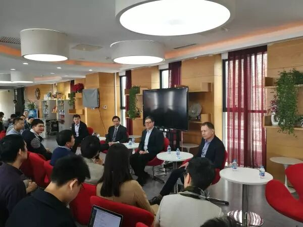座谈会嘉宾：左起：田渊栋、刘成林、Yann Lecun、Vaughan Smith

座谈会的开始，刘所长进行了热情而简短的欢迎致辞，接下来就以问答互动的形式开始了座谈。每一个问题我可能无法全部记清楚，现把我自己印象比较深刻的问题简要总结，部分问题在下午清华的讲座中也谈到了。其中一位同学谈到了了深度学习目前还没有相关理论解释的问题。Lecun的观点是，并非所有的研究都是现有理论后有实践，很多问题都是人们先发现了某种现象，后来才找到了合理的理论解释。在下午清华的讲座的QA环节，Lecun又举了几个具体例子，瓦特发明蒸汽机是在动力学理论之前，人们最早发明飞机的时候，也没有完善的空气动力学理论。深度学习就是理论在实践之后。刘所长问了一个关于GAN的问题，Lecun对GAN赞不绝口，并补充说明了GAN不是他自己的idea，是Ian Goodfellow在读博士期间提出来的，下午清华讲座中有关于GAN的详细介绍，这里暂不展开。还有同学问到了那些领域深度学习并不work，Lecun回答是也谈到了Logistic Regression这些较为经典的模型可以发挥威力的场景。（笔者补充：其实当我们的数据量较小的时候，深度学习的效果可能没有传统的经典模型那么好）。很幸运笔者获得了座谈会最后的一个提问机会，笔者的问题是关于深度学习对抗样本的，深度学习在计算机视觉、语音识别、自然语言处理都取得了突破性的进展，但是研究者也发现深度神经网络也是很容易被愚弄的，当对一张图片加上人为的噪声之后，系统会将其错误分类，类似的现象在强化学习领域里也被观察到，智能体可能会被攻击者误导执行错误的动作，对抗样本和AI的安全密切相关，对此，您有何评论？Lecun说到这是一个很好的问题，他在做手写字符识别的时候也注意到了这种现象，当时为了探索什么图像会让卷积网络完美的预测一个数字4，然后将梯度反向传播的输入图像，所得到的结果和预想的是不一样的。他认为非监督学习是解决对抗样本问题的一个比较有效的思路。在座谈会的最后，刘所长请Yann Lecun教授给在座的同学一句寄语，Lecen教授说我们现在正处于一个AI发展很好的时代，未来AI取得的重要突破，在座的同学就可能扮演重要的角色。教授的谆谆教诲真是给笔者等莫大的学习动力。

3.22 下午清华大学礼堂

讲座主题：“深度学习与人工智能的未来”

讲座由清华大学交叉信息研究院院长，图灵奖获得者姚期智教授主持，下面奉上讲座ppt，一张ppt胜千言，下面我们看图说话

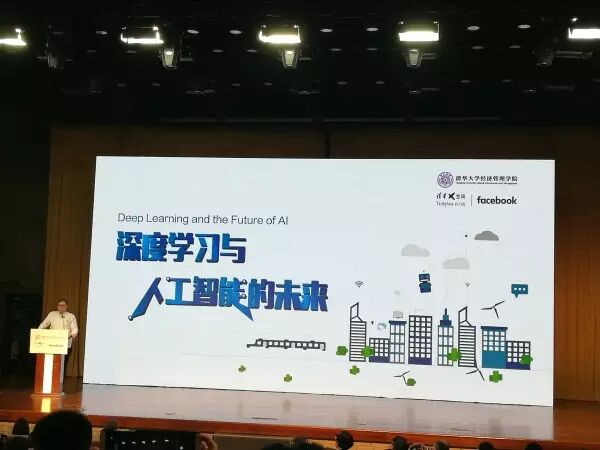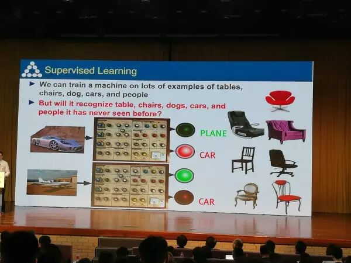监督学习介绍，中间的旋钮真是调参的形象化介绍

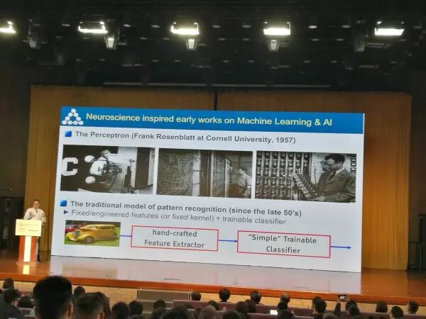神经网络历史回顾，感知机介绍，那个时候的计算机真是老古董，之前的特征提取以人工的特征为主（hand-crafted feature）

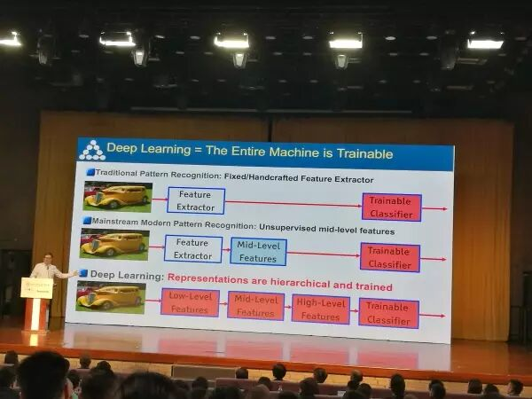深度学习引入：所有的特征都是机器自己学习得到

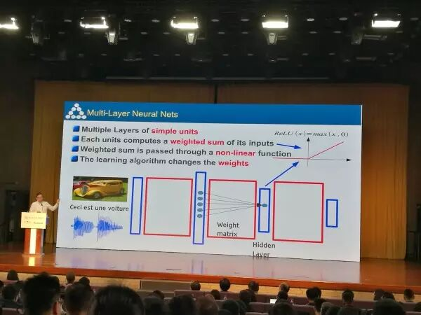深度学习的数学原理很简单，矩阵相乘、求和、激活函数

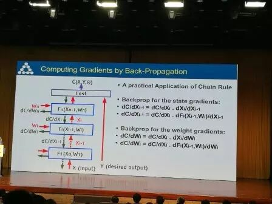反向传播算法原理

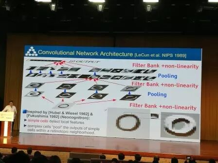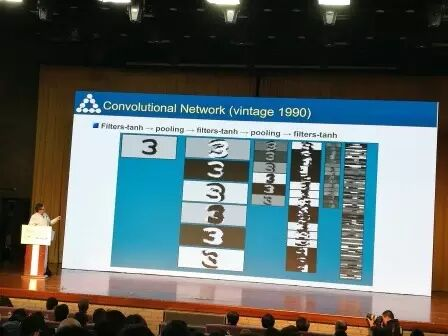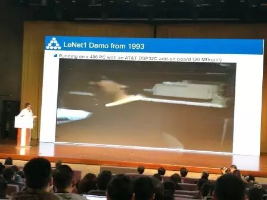那年的Lecun，是个小鲜肉，在贝尔实验室工作期间发明了LeNet

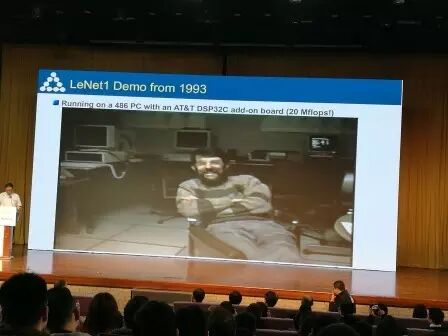Lecun的同事，应该也是位大牛

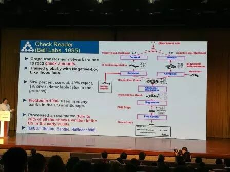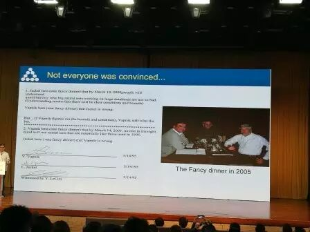有意思的学术八卦：大神间的赌局，Jackel和Vapnik（SVM发明者）打了两次赌，赌一顿饭，一人赢了一次，所以觉得两人共同为饭局买单，大神的赌局见证了神经网络的兴起，搞学术的还是严谨，打赌都有字据见证人，Lecun作为见证人可能是这顿饭唯一没有花钱的。

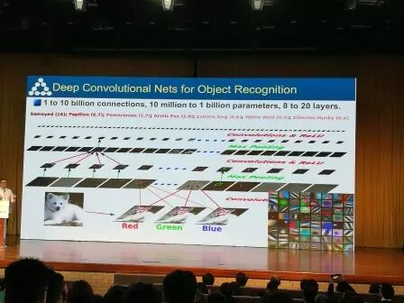ImageNet数据出现之后，深度卷积网络用于物体识别取得重大突破

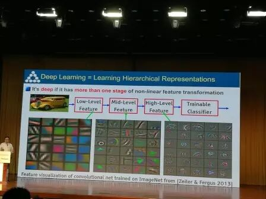深度神经网络可以学习到不同层级的抽象特征

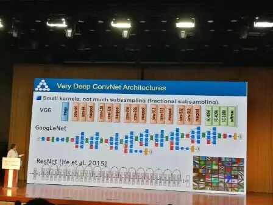经典网络模型，VGG GoogleNet ResNet

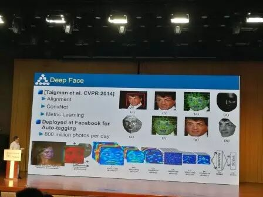深度学习应用于人脸识别，Lecun说他起先并不认为深度学习在人脸识别上会work

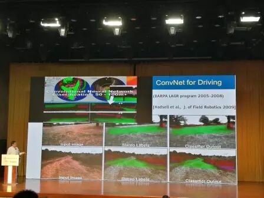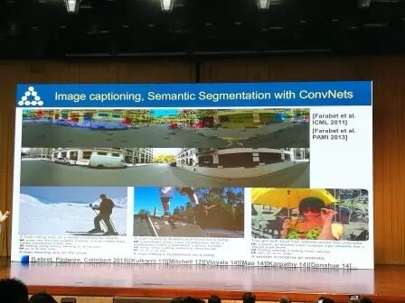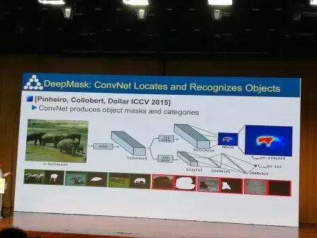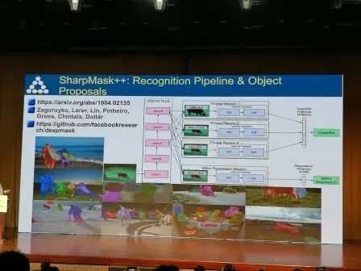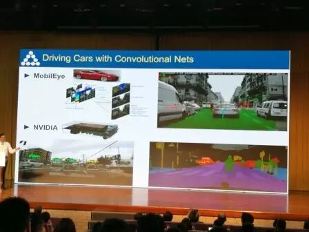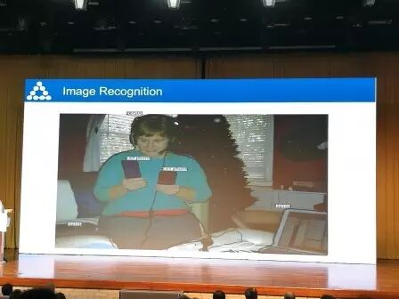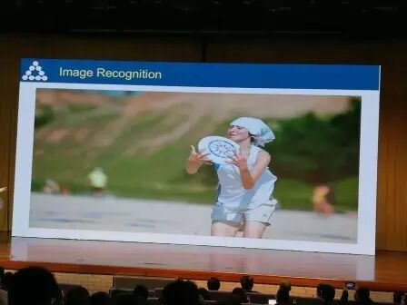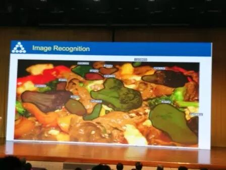  

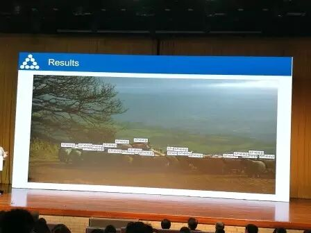深度学习在计算机视觉中的各种应用，图像识别、分割、目标检测，还可以数羊，这是要变深度催眠的节奏吗？

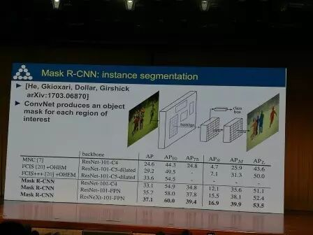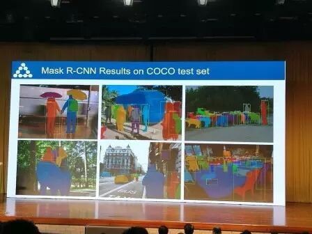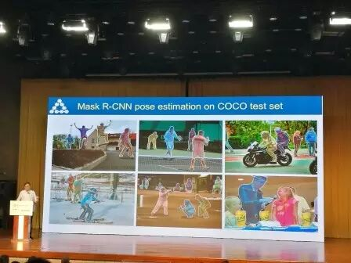介绍了何凯明最近的Mask R-CNN，在arXiv网上可以下载

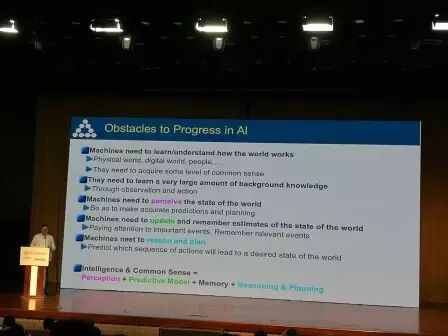列举了AI发展的主要挑战和障碍。后续更新包括预测学习和强化学习部分，敬请期待!

由于时间紧张，可能会有不少笔误，欢迎大家指正!