# 深度学习巨头Yann Lecun 中科院自动化所座谈及清华大学讲座干货速递（二）

原创 张重阳 自动化学报 2017-03-27 10:05 北京

> 原文地址: [https://mp.weixin.qq.com/s/wvgr9gm027UlppY5T7-iZg](https://mp.weixin.qq.com/s/wvgr9gm027UlppY5T7-iZg)

下面 我们分享Lecun关于无监督学习和强化学习的观点

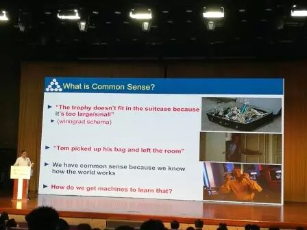实现通用人工智能一个关键的问题就是要让计算机拥有常识，比如当东西太多我们就会知道行李箱装不下（笔者注：这是一个自然推理的过程，就好比天冷了要加衣服一样），我们拥有常识因为我们知道这个世界如何运转，那如何让机器也学习到这些呢？

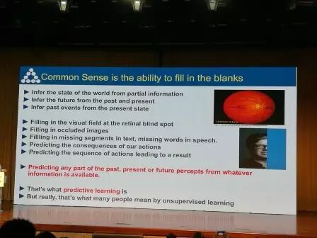常识就是预测的能力，比如说当Lecun照片的某一部分被遮挡，我们可以推理出被遮挡的部分，对于文本中省略的词语，我们也可以补足（这难道是传说中的完形填空？）。接着，Lecun抛出了自己的主打概念“Predict Learning（预测学习）”，也就是大多数人认为的无监督学习。（笔者注：个人认为预测学习的提法更加精准，预测的内涵就是推理）

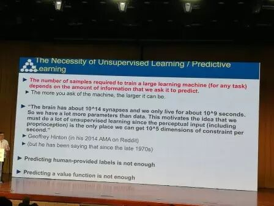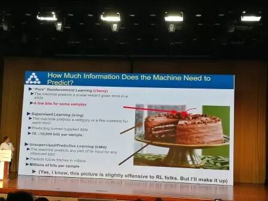经典比喻：强化学习：樱桃，监督学习：蛋糕上的糖霜；非监督学习：蛋糕，

在Lecun看来，非监督学习是主体。

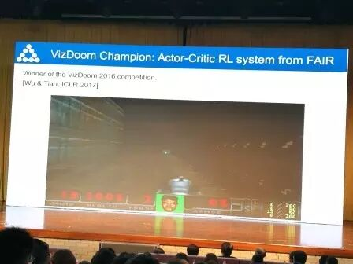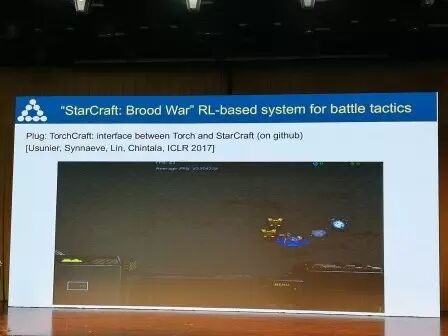强化学习玩星际争霸

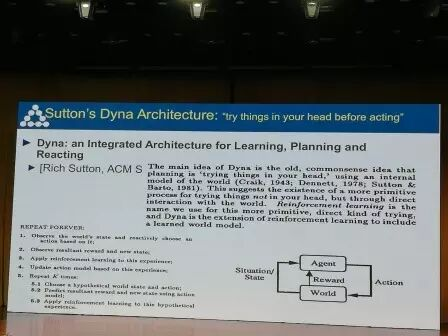Dyna：强化学习泰斗Sutton所提出的一个框架

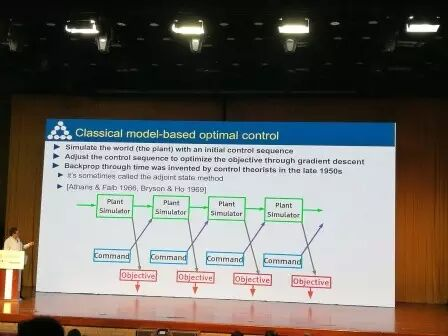古典的基于模型最优化控制

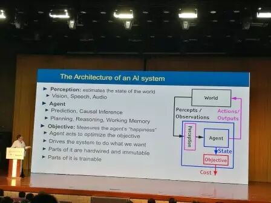人工智能的一个架构：智能体感知世界进行推理、规划以获得最高奖赏

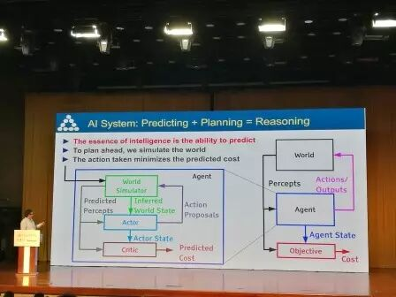预测+规划=推理

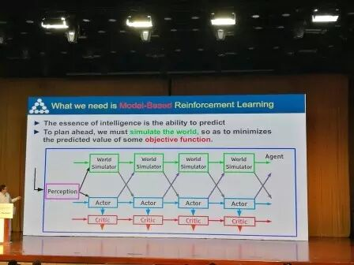基于模型的强化学习，为了做好规划，我们需要对世界进行建模仿真

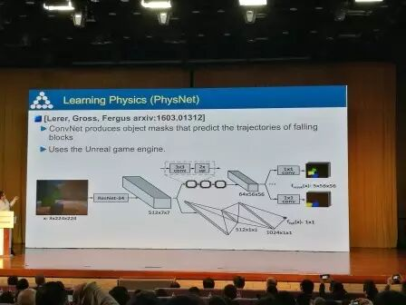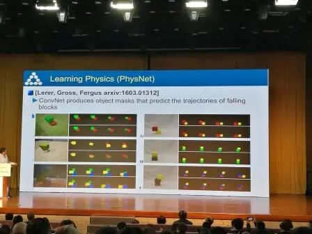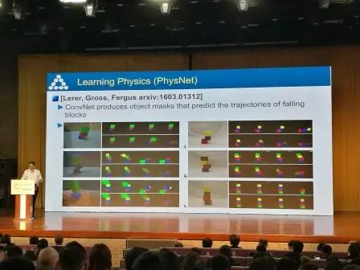预测砖块掉落的轨迹

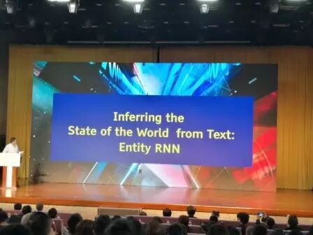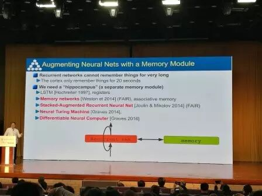通过记忆模块增强神经网络

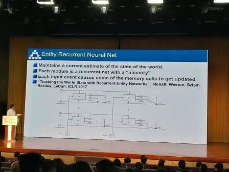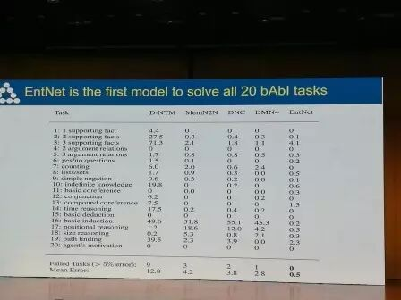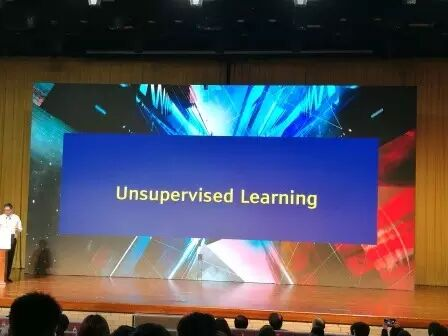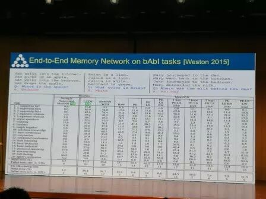  
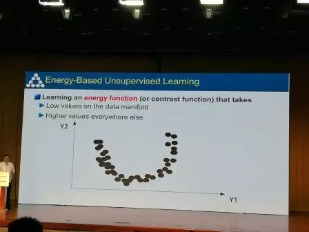

基于能量的无监督学习：学习一个能量函数，该函数在数据流形上的值比较低，其他地方的值较高

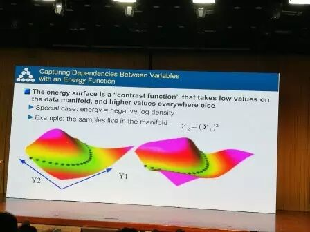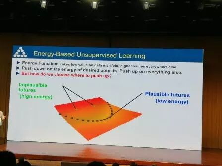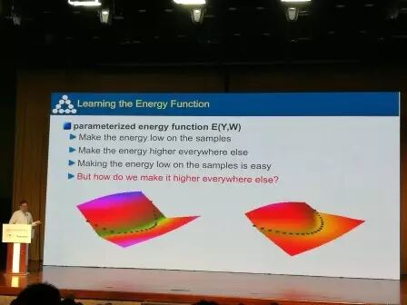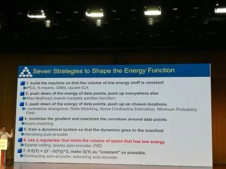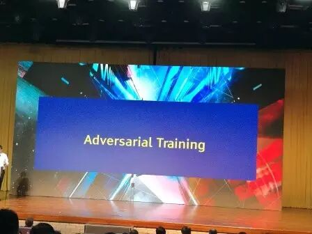目前火热的对抗训练闪亮登场

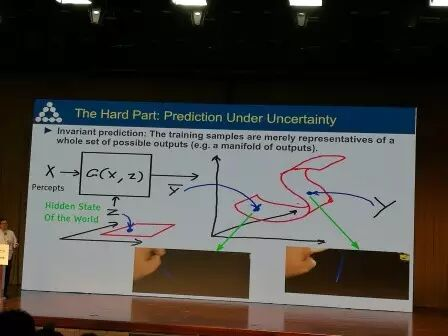很多情况下预测的结果具有不确定性，但是它们会在同一个数据流形上

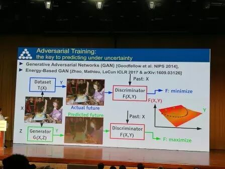对抗训练是在不确定条件下进行预测的关键，Lecun再一次高度赞扬了GAN

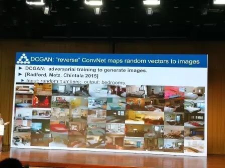基于GAN生成的逼真度很高的卧室图片

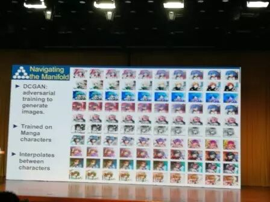生成的卡通头像

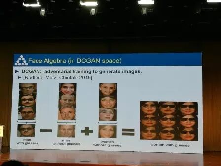有意思的图像算数：眼镜男-普通男+普通女=眼镜女

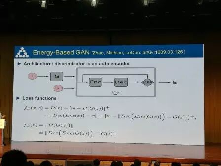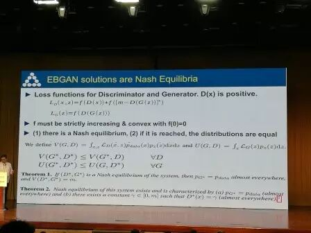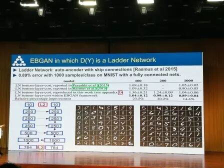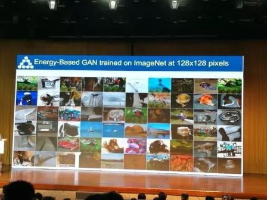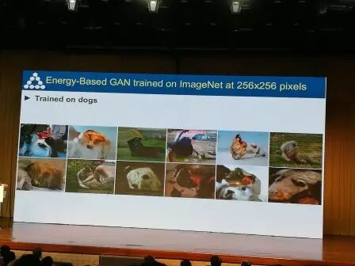EBGAN生成的自然图像，仔细看可以发现他们并不是真实的自然物体，生成的狗头有点像毕加索画的风格，抽象派

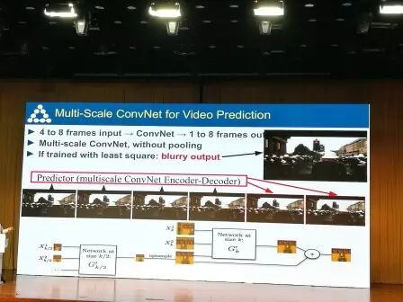多尺度的卷积神经网络用于视频预测

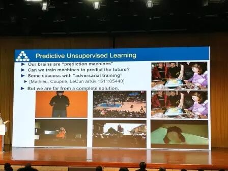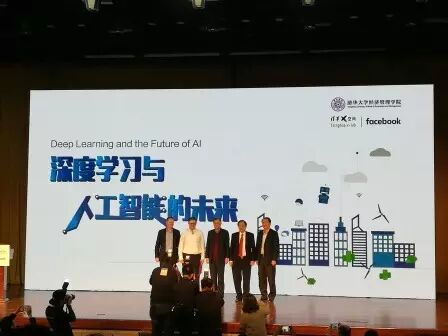讲座结束，各位专家们上台合影

[深度学习巨头Yann Lecun 中科院自动化所座谈及清华大学讲座干货速递（一）](http://mp.weixin.qq.com/s?__biz=MzAwMzAzMDgxOA==&mid=2651063176&idx=1&sn=a40df238e6f0b45d14ef0eb2cbeaa669&chksm=8131c9c5b64640d3b6f621246805291310b37c7be2095ecc9ff7c71f38a3c542855fa575c351&scene=21#wechat_redirect)