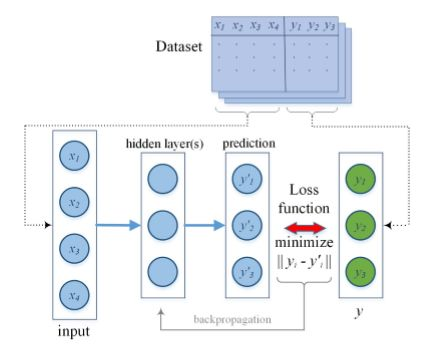
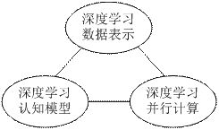

# 深度学习认知计算综述

原创 自动化学报 2018-02-09 09:00 北京

> 原文地址: [https://mp.weixin.qq.com/s/Z3ZD-nuBQxBqTeuVTSoBZw](https://mp.weixin.qq.com/s/Z3ZD-nuBQxBqTeuVTSoBZw)

有了IBM Watson，世界正变得更健康、更安全、更富创造力。Watson是采用认知计算系统的人工智能，而认知计算是对新一代智能系统特点的概括。从功能层面上讲, 认知系统具备人类的某些认知能力, 能够出色完成对数据的发现、理解、推理、决策等特定认知任务。随着大数据和智能时代的到来, 机器学习的研究重心已开始从感知领域转移到认知计算, 如何提升对大规模数据的认知能力已成为智能科学与技术的一大研究热点。得益于计算机硬件性能的提升和云计算技术的发展, 最近的深度学习有望开启大数据认知计算领域的研究新热潮。

图1 模仿大脑认知能力图

认知计算是解决理解和学习的问题, 学习能力是认知系统的关键。深度学习通过构建基于表示的多层机器学习模型，训练海量数据, 学习有用特征, 以达到提升识别、分类或预测的准确性。深度学习模型包括输入层、隐藏层和输出层三部分，每层之间通过权重连接，整个训练过程由前馈映射和反向传播学习实现，如图2所示。深度学习可以超越概念学习,是深层神经网络学习算法的重大突破，基于深度学习的围棋程序AlphaGo已达到职业棋手水平。

图2 深度学习训练模型

目前，一个深度认知计算过程主要包含三个方面：深度学习数据表示、深度学习认知模型和深度学习并行计算。这三个方面紧密关联，其中数据表示是深度学习认知计算的基础，深度学习模型是认知计算的关键，高性能并行计算是实现深度学习认知计算的保障。

图3 深度学习认知计算示意图

本文总结了近年来大数据环境下基于深度学习的认知计算研究进展, 主要从三个模块对深度学习认知计算进行综述。其一是深度学习数据表示,通过对数据特性的分析，介绍了多模态数据表示和张量数据表示方法；其二是深度认知模型，对多种模型进行了前沿概况；其三是深度学习并行计算，并行计算方法主要包括GPU加速、数据并行与模型并行、计算集群及其并行应用。在对以上三个模块进行概括、比较和分析的基础上，简要介绍了深度学习认知计算的应用，同时, 对面向大数据的深度学习认知计算的挑战和发展趋势进行了总结、思考与展望。

引用格式

陈伟宏, 安吉尧, 李仁发, 李万里. 深度学习认知计算综述. 自动化学报, 2017, 43(11): 1886-1897

作者简介

陈伟宏 湖南大学信息科学与工程学院博士研究生。主要研究方向为信息物理系统，并行与分布式计算，机器学习。

E-mail: whchen@hnu.edu.cn

安吉尧 湖南大学信息科学与工程学院教授。主要研究方向为信息物理系统，并行与分布式计算，计算智能。本文通信作者。

E-mail: anbobcn@hnu.edu.cn 

李仁发 湖南大学信息科学与工程学院教授。主要研究方向为嵌入式系统, 信息物理系统, 人工智能与机器视觉。

E-mail: lirenfa@hnu.edu.cn

李万里 湖南大学信息科学与工程学院博士研究生。主要研究方向为机器学习, 计算机视觉, 智能交通系统和驾驶员行为分析。

E-mail: 446154669@qq.com

欢迎扫描二维码、长按图片识别关注《自动化学报》中文版订阅号aas1963，服务号自动化学报和英文版服务号！

JAS《自动化学报》（英文版）

自动化学报服务号

自动化学报订阅号

  

联系我们

Tel:  010-82544653（日常咨询和稿件处理） 

        010-82544677（录用后稿件处理）

Fax: 010-82544497

Email: aas@ia.ac.cn（日常咨询和稿件处理）

          aas\_editor@ia.ac.cn（录用后稿件处理）

http://www.aas.net.cn

  

点击阅读原文查看更多