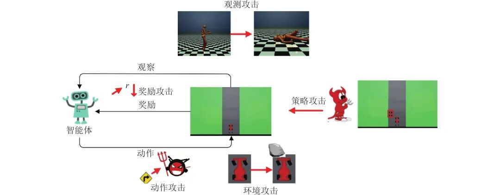
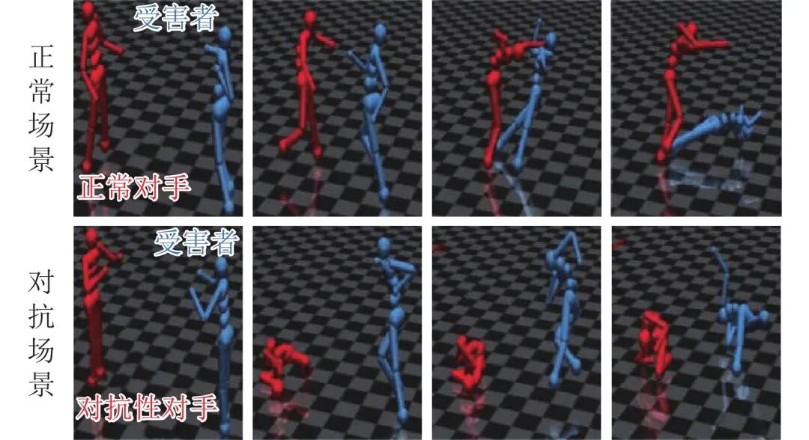

# 深度强化学习的攻防与安全性分析综述

原创 自动化学报 自动化学报 2022-04-02 14:50 北京

> 原文地址: [https://mp.weixin.qq.com/s/T\_lI4ycfCj5VhWjXLAzYFQ](https://mp.weixin.qq.com/s/T_lI4ycfCj5VhWjXLAzYFQ)

**点击蓝字|关注我们**

  

**引用本文**

  

陈晋音, 章燕, 王雪柯, 蔡鸿斌, 王珏, 纪守领. 深度强化学习的攻防与安全性分析综述. 自动化学报, 2022, 48(1): 21−39 doi: 10.16383/j.aas.c200166

Chen Jin-Yin, Zhang Yan, Wang Xue-Ke, Cai Hong-Bin, Wang Jue, Ji Shou-Ling. A survey of attack, defense and related security analysis for deep reinforcement learning. Acta Automatica Sinica, 2022, 48(1): 21−39 doi: 10.16383/j.aas.c200166

http://www.aas.net.cn/cn/article/doi/10.16383/j.aas.c200166?viewType=HTML

  

**文章简介**

  

**关键词**

  

深度强化学习, 对抗攻击, 防御, 策略攻击, 安全性

  

**摘   要**

  

深度强化学习是人工智能领域新兴技术之一, 它将深度学习强大的特征提取能力与强化学习的决策能力相结合, 实现从感知输入到决策输出的端到端框架, 具有较强的学习能力且应用广泛. 然而, 已有研究表明深度强化学习存在安全漏洞, 容易受到对抗样本攻击. 为提高深度强化学习的鲁棒性、实现系统的安全应用, 本文针对已有的研究工作, 较全面地综述了深度强化学习方法、对抗攻击、防御方法与安全性分析, 并总结深度强化学习安全领域存在的开放问题以及未来发展的趋势, 旨在为从事相关安全研究与工程应用提供基础.

  

**引   言**

  

自Mnih等将深度学习与强化学习结合并提出第一个深度强化学习框架—深度Q网络(Deep Q network, DQN)以来, 深度强化学习(Deep reinforcement learning, DRL)方法就被人们视为迈向通用人工智能的必要路径之一. 随后, 各种强化学习的改进算法不断提出, 例如: 基于值函数的算法有双重深度Q网络(DDQN)、优先经验回放Q网络(Prioritized DQN)、对偶深度Q网络(Dueling DQN)等, 基于策略的强化学习算法有异步/同步优势行动者评论者(A3C/A2C)、信任域策略优化(TRPO)、K因子信任域行动者评论者算法(ACKTR)等. 基于深度强化学习的应用领域也非常广泛, 例如: 游戏博弈、自动驾驶、医疗健康、金融交易、机器人控制、网络安全、计算机视觉等. 为加强深度强化学习在安全攸关领域的安全应用, 及早发现深度强化学习算法漏洞, 防止恶意用户利用这些漏洞进行非法牟利行为. 不同于传统机器学习的单步预测任务, 深度强化学习系统利用多步决策完成特定任务, 且连续决策之间具有高度相关性. 总体来说, 深度强化学习系统的攻击可针对强化学习算法的5个主要环节展开恶意攻击, 包括: 环境、观测、奖励、动作以及策略.

  

Huang等最早于2017年对深度强化学习系统存在的漏洞做出了相关研究. 他将机器学习安全领域中面临的对抗攻击应用到了深度强化学习模型中, 通过在智能体的观测状态添加对抗扰动, 令整个深度强化学习系统性能显著下降. 随后, 针对特定应用, Chen等在自动寻路任务中通过在环境中添加“挡板状”障碍物, 使智能体无法抵达目的地. Tretschk等通过对抗变换网络修改Pong智能体训练时维护的奖励目标, 使智能体的训练朝着游戏失败的方向进行. Ferdowsi等在第21届智能交通系统国际会议上提出了此类问题对自动驾驶应用的影响. 因此深度强化学习系统真正应用到实际工业界之前, 探究深度强化学习系统的脆弱点、提高其防御能力与鲁棒性十分重要.

  

为了提高深度学习模型的鲁棒性, 已有研究提出了较多DRL防御方法, 主要包括三个方向: 对抗训练、鲁棒学习、对抗检测. 例如: Behzadan等提出了使用对抗训练实现梯度攻击的防御; Gu等采用DRL训练对抗智能体, 与目标系统的智能体进行零和博弈提升其鲁棒性; Lin等\[25\]借助预测帧模型, 通过比较策略对预测帧与当前输出的KL散度概率分布实现攻击检测.

  

目前, 深度强化学习领域的攻防研究还有很大发展空间, 针对深度强化学习存在的易受对抗样本攻击等问题, 深度强化学习模型的鲁棒性优化以及对抗防御方法也已成为重点关注对象, 仍需不断探索. 同时由于深度强化学习在安全攸关领域的应用, 其存在的策略漏洞也成为了一大安全隐患. 为了更好地探究深度强化学习系统的攻防研究现状与未来发展方向, 本文针对深度强化学习算法、攻击与防御方法, 以及安全性分析展开尽可能全面的综述.

  

**6.   未来研究方向**

  

本文针对深度强化学习已提出的攻击方法以及为抵御这些攻击而提出的防御措施进行了全面调查. 我们还提供了可用于实验的环境、算法以及攻击基准, 同时对攻防指标进行整理总结. 本节我们针对深度强化学习的攻防方法及安全性分析, 探讨其在未来的研究发展方向, 从不同角度分析之后可发展的研究内容.

  

**6.1   攻击方法**

  

已有的面向深度学习的攻击方法中, 迭代攻击方法的性能相对较优, 但是迭代方法计算代价太高, 不能满足DRL系统实时预测的需求. 针对DRL的攻击, 未来可能从攻击的实时性要求出发, 研究基于生成式对抗网络的对抗样本生成方法, 经过训练后可生成大量高效的攻击; 从攻击的实操角度出发, 研究基于模仿学习构建替代模型的方式来缩短攻击准备的时间, 以解决DRL系统的黑盒替代模型训练代价太大的问题; 对于训练阶段进行的攻击, 研究DRL训练过程的中毒攻击技术, 通过在DRL系统中的状态、奖励值或是环境模型中嵌入后门触发器实现后门攻击; 针对攻击的迁移性, 研究攻击方法在不同算法或者不同模型结构上的迁移性, 比较其攻击成功率; 针对DRL的多智能体任务, 研究多智能体的协同合作过程中存在的策略漏洞, 从而进行策略攻击; 从攻击的可解释性出发, 研究不同的攻击方法对策略网络中神经元的激活状况的影响, 寻找敏感神经元和神经通路来提高攻击的效果.

  

此外, 与传统DNN模型类似, 一些大型的如金融交易领域的DRL系统通常会被部署到云平台上. 这些领域的环境模型与训练数据常常具有非常高的价值, 攻击者未来可以尝试以访问云平台公用API的方式进行模型与训练数据的窃取.

  

**6.2   防御方法**

  

深度学习主要通过修改模型输入、目标函数以及网络结构这三类方法来实现防御效果. 但是, 深度学习的大多数防御方法不能满足DRL的实际应用场景中, 尤其是在多智能体的任务场景中. 针对DRL的防御, 之后的研究可能从数据安全的角度出发, 研究使用自编码器对受扰动的奖励、观测信号进行数据预处理, 提高DRL系统面对信号噪声的鲁棒性; 从模型鲁棒的角度出发, 构建基于模型集成的强化学习环境动态建模方法, 通过模型集合来提高模型鲁棒性, 生成稳定有效的模型策略; 从策略优化的角度出发, 研究单个智能体甚至于多个智能体协同合作之间的策略漏洞, 体现在模型策略网络的训练过程, 以优化模型的策略.

  

**6.3   安全性分析**

  

DL在攻防的分析上已经提出了许多指标, 如对抗类别平均置信度、平均结构相似度、分类精确方差等. 而对DRL的攻击与防御的实验结果主要还是以简单的平均回合奖励、奖励值的收敛曲线来进行评估. 这样单一、表面的指标不能够充分说明DRL模型的鲁棒性, 未来还需要提出更深层的评估标准, 用以展现决策边界、环境模型在防御前后的不同.

  

目前在DL领域, 已经有研究人员推出了一些模型测试评估平台, 这些平台集成了目前对DL模型的攻击方法与防御方法, 并以现有的模型安全指标对模型进行安全性分析. DRL领域也可以结合本身的特点, 搭建相应的攻防安全分析平台, 并添加DRL特有的测试需求, 如对系统的环境建模误差进行分析、针对不同的系统生成标准的连续测试场景等.

  

图 1  对DRL系统的不同类型攻击

  

图 3  对抗智能体攻击效果  

  

**作者简介**

**陈晋音**

浙江工业大学网络空间安全研究院副教授. 2009年获得浙江工业大学博士学位. 主要研究方向为人工智能安全, 网络数据挖掘, 智能计算, 计算机视觉. 本文通信作者.

E-mail: chenjinyin@zjut.edu.cn

**章   燕**

浙江工业大学信息工程学院硕士研究生. 主要研究方向为人工智能安全, 计算机视觉.

E-mail: 2111903240@zjut.edu.cn

**王雪柯**

浙江工业大学信息工程学院硕士研究生. 主要研究方向为人工智能安全, 计算机视觉.

E-mail: 17660478061@163.com

**蔡鸿斌**

华东师范大学软件工程学院硕士研究生. 主要研究方向为深度学习.

E-mail: hongbincai5330@163.com

**王   珏**

浙江工业大学信息工程学院硕士研究生. 主要研究方向为人工智能安全, 计算机视觉.

E-mail: 211190321@zjut.edu.cn

**纪守领**

浙江大学“百人计划”研究员. 2013年获得佐治亚州立大学计算机科学博士学位, 2015年获得佐治亚理工学院电子与计算机工程博士学位. 主要研究方向为数据驱动的安全性和隐私性, 人工智能安全性, 大数据分析.

E-mail: sji@zju.edu.cn

  

**相关文章**

**（请向上滑动阅读）**

  

\[1\]  吴健发, 王宏伦, 王延祥, 刘一恒. 无人机反应式扰动流体路径规划. 自动化学报. doi: 10.16383/j.aas.c210231

http://www.aas.net.cn/cn/article/doi/10.16383/j.aas.c210231?viewType=HTML

  

\[2\]  陈晋音, 吴长安, 郑海斌, 王巍, 温浩. 基于通用逆扰动的对抗攻击防御方法. 自动化学报. doi: 10.16383/j.aas.c201077

http://www.aas.net.cn/cn/article/doi/10.16383/j.aas.c201077?viewType=HTML

  

\[3\]  李凯文, 张涛, 王锐, 覃伟健, 贺惠晖, 黄鸿. 基于深度强化学习的组合优化研究进展. 自动化学报, 2021, 47(11): 2521-2537. doi: 10.16383/j.aas.c200551

http://www.aas.net.cn/cn/article/doi/10.16383/j.aas.c200551?viewType=HTML

  

\[4\]  吴晓光, 刘绍维, 杨磊, 邓文强, 贾哲恒. 基于深度强化学习的双足机器人斜坡步态控制方法. 自动化学报, 2021, 47(8): 1976-1987. doi: 10.16383/j.aas.c190547

http://www.aas.net.cn/cn/article/doi/10.16383/j.aas.c190547?viewType=HTML

  

\[5\]  施伟, 冯旸赫, 程光权, 黄红蓝, 黄金才, 刘忠, 贺威. 基于深度强化学习的多机协同空战方法研究. 自动化学报, 2021, 47(7): 1610-1623. doi: 10.16383/j.aas.c201059

http://www.aas.net.cn/cn/article/doi/10.16383/j.aas.c201059?viewType=HTML

  

\[6\]  陈晋音, 沈诗婧, 苏蒙蒙, 郑海斌, 熊晖. 车牌识别系统的黑盒对抗攻击. 自动化学报, 2021, 47(1): 121-135. doi: 10.16383/j.aas.c190488

http://www.aas.net.cn/cn/article/doi/10.16383/j.aas.c190488?viewType=HTML

  

\[7\]  党力, 张雪锋, 惠妍. 基于比特串异或和置乱变换的指纹模板保护算法. 自动化学报, 2020, 46(12): 2681-2689. doi: 10.16383/j.aas.c190011

http://www.aas.net.cn/cn/article/doi/10.16383/j.aas.c190011?viewType=HTML

  

\[8\]  孙长银, 穆朝絮. 多智能体深度强化学习的若干关键科学问题. 自动化学报, 2020, 46(7): 1301-1312. doi: 10.16383/j.aas.c200159

http://www.aas.net.cn/cn/article/doi/10.16383/j.aas.c200159?viewType=HTML

  

\[9\]  金哲豪, 刘安东, 俞立. 基于GPR和深度强化学习的分层人机协作控制. 自动化学报. doi: 10.16383/j.aas.c190451

http://www.aas.net.cn/cn/article/doi/10.16383/j.aas.c190451?viewType=HTML

  

\[10\]  姚红革, 张玮, 杨浩琪, 喻钧. 深度强化学习联合回归目标定位. 自动化学报. doi: 10.16383/j.aas.c200045

http://www.aas.net.cn/cn/article/doi/10.16383/j.aas.c200045?viewType=HTML

  

\[11\]  陈峰, 袁志明, 闫璐, 许伟, 苗义烽, 高博文. 高速铁路智能CTC自律机系统的可靠性与安全性评估. 自动化学报, 2020, 46(3): 463-470. doi: 10.16383/j.aas.c190195

http://www.aas.net.cn/cn/article/doi/10.16383/j.aas.c190195?viewType=HTML

  

\[12\]  梁星星, 冯旸赫, 马扬, 程光权, 黄金才, 王琦, 周玉珍, 刘忠. 多Agent深度强化学习综述. 自动化学报, 2020, 46(12): 2537-2557. doi: 10.16383/j.aas.c180372

http://www.aas.net.cn/cn/article/doi/10.16383/j.aas.c180372?viewType=HTML

  

\[13\]  孔锐, 蔡佳纯, 黄钢. 基于生成对抗网络的对抗攻击防御模型. 自动化学报. doi: 10.16383/j.aas.2020.c200033

http://www.aas.net.cn/cn/article/doi/10.16383/j.aas.2020.c200033?viewType=HTML

  

\[14\]  王云鹏, 郭戈. 基于深度强化学习的有轨电车信号优先控制. 自动化学报, 2019, 45(12): 2366-2377. doi: 10.16383/j.aas.c190164

http://www.aas.net.cn/cn/article/doi/10.16383/j.aas.c190164?viewType=HTML

  

\[15\]  秦蕊, 曾帅, 李娟娟, 袁勇. 基于深度强化学习的平行企业资源计划. 自动化学报, 2017, 43(9): 1588-1596. doi: 10.16383/j.aas.2017.c160664

http://www.aas.net.cn/cn/article/doi/10.16383/j.aas.2017.c160664?viewType=HTML

  

\[16\]  赵福均, 周志杰, 胡昌华, 常雷雷, 王力. 基于证据推理的动态系统安全性在线评估方法. 自动化学报, 2017, 43(11): 1950-1961. doi: 10.16383/j.aas.2017.c160384

http://www.aas.net.cn/cn/article/doi/10.16383/j.aas.2017.c160384?viewType=HTML

  

\[17\]  郭潇逍, 李程, 梅俏竹. 深度学习在游戏中的应用. 自动化学报, 2016, 42(5): 676-684. doi: 10.16383/j.aas.2016.y000002

http://www.aas.net.cn/cn/article/doi/10.16383/j.aas.2016.y000002?viewType=HTML

  

\[18\]  陈兴国, 俞扬. 强化学习及其在电脑围棋中的应用. 自动化学报, 2016, 42(5): 685-695. doi: 10.16383/j.aas.2016.y000003

http://www.aas.net.cn/cn/article/doi/10.16383/j.aas.2016.y000003?viewType=HTML

  

\[19\]  张东, 倪江群, 李大捷. 基于GSM模型的扩频水印安全性分析. 自动化学报, 2009, 35(7): 841-850. doi: 10.3724/SP.J.1004.2009.00841

http://www.aas.net.cn/cn/article/doi/10.3724/SP.J.1004.2009.00841?viewType=HTML

  

\[20\]  席裕庚, 张纯刚. 一类动态不确定环境下机器人的滚动路径规划. 自动化学报, 2002, 28(2): 161-175.

http://www.aas.net.cn/cn/article/id/16409?viewType=HTML

  

**近期文章**

  

[《自动化学报》2022年第03期目录分享](http://mp.weixin.qq.com/s?__biz=MzAwMzAzMDgxOA==&mid=2651075527&idx=1&sn=bc020c5fd09080243f7527610b003507&chksm=8131f98ab646709c2f485852b526989a3b9af5cc93e8afb508d9239b78176f49caa9807d6a8d&scene=21#wechat_redirect)

[2022斯坦福AI指数报告出炉！点击获取完整报告](http://mp.weixin.qq.com/s?__biz=MzAwMzAzMDgxOA==&mid=2651075236&idx=3&sn=1caed46e80f613c172a227ead8ddc1a3&chksm=8131f8e9b64671ffa8d6f7c8a36210fe1e262a66a42ab9a544e064d3c725b4a31274a4551750&scene=21#wechat_redirect)

[CVPR 2022 | 自动化所新作速览！（上）](http://mp.weixin.qq.com/s?__biz=MzAwMzAzMDgxOA==&mid=2651075034&idx=2&sn=48b5232daaa7a51da96c3a7c87013e2d&chksm=8131fb97b6467281dc8e02749df8d0388f89d30e3b08f44d13c700169d1d7a22c4feef9f2dba&scene=21#wechat_redirect)

[CVPR 2022 | 自动化所新作速览！（下）](http://mp.weixin.qq.com/s?__biz=MzAwMzAzMDgxOA==&mid=2651075034&idx=3&sn=21833bb312bb0d9826c64c9fce068aa5&chksm=8131fb97b646728147f2bff58a04230d708d5a4537eb824656c2d54580b11f6a47b0eb30ade6&scene=21#wechat_redirect)

[直播回放分享 | 陈关荣教授：探索最优同步网络的拓扑结构](http://mp.weixin.qq.com/s?__biz=MzIxMjA5Njg2Nw==&mid=2649061608&idx=1&sn=1500a81260d8f5127b7cb7767c759fba&chksm=8f5a9ae4b82d13f201b714d8e96af9bbddf442bb7e10c97416fb925ab2170c05fa12010fb1d1&scene=21#wechat_redirect)

  

**热点文章**

  

[《自动化学报》2019年高关注论文](http://mp.weixin.qq.com/s?__biz=MzAwMzAzMDgxOA==&mid=2651073450&idx=1&sn=6f57bd0df73f259aa416575f1f69bdfb&chksm=8131e1e7b64668f1344de4acdef6148e8dcfa60c80e4f48e6cb1270558c2beade5601e92d05c&scene=21#wechat_redirect)

[《自动化学报》2021年热点文章回顾](http://mp.weixin.qq.com/s?__biz=MzAwMzAzMDgxOA==&mid=2651072577&idx=1&sn=4e6be077d7371c7d29d9a371d8defe19&chksm=8131e20cb6466b1aec2f3b8b1063d3be11725ca9a0c15785c3b42a638170e732acd0d8d345e0&scene=21#wechat_redirect)

[国家自然科学基金论文精选](http://mp.weixin.qq.com/s?__biz=MzI2NjA3MzM5MA==&mid=2649960308&idx=1&sn=1634c999f22588333537f13393403f9c&chksm=f2942b35c5e3a2232e86b51c2b7c8f37a4d3d7f858d370d76d5afd00567d7da6e9543476d120&scene=21#wechat_redirect)  

[国家重点研发计划论文精选](http://mp.weixin.qq.com/s?__biz=MzI2NjA3MzM5MA==&mid=2649960255&idx=1&sn=f48435928fd924134cb72014860b9d00&chksm=f2942b7ec5e3a26869da68a1419b3b40ca1e6cb98abf2e380d78a49ffb99c85991d76cc346b0&scene=21#wechat_redirect)

[中国科学院自动化研究所高层次人才招聘启事 | 长期有效](http://mp.weixin.qq.com/s?__biz=MzI2NjA3MzM5MA==&mid=2649959451&idx=1&sn=657b7e4aeeaa88114d5189641c5409dc&chksm=f294285ac5e3a14cd230a2b9678c32ba9bf92e8ffc9d61d506c5ffea2df793456dd37c2c6fb1&scene=21#wechat_redirect)

  

**期刊动态**

  

[自动化学报（英文版）和自动化学报入选计算领域高质量科技期刊T1类](http://mp.weixin.qq.com/s?__biz=MzAwMzAzMDgxOA==&mid=2651073859&idx=2&sn=7a9192717637dcf6cddb39ed961e8c3b&chksm=8131e70eb6466e188a123c504bdeba80c75681de4762f8685b3bf584bc33eb12362c70613b4e&scene=21#wechat_redirect)

[《自动化学报》编辑部防诈骗公告](http://mp.weixin.qq.com/s?__biz=MzAwMzAzMDgxOA==&mid=2651073517&idx=1&sn=c52de7c685e546af9faffc0cefab1c85&chksm=8131e1a0b64668b63ebaa68ea81cbaec3b94dc52ea8360821a0a49e67ae7e4b428a25d0f19c5&scene=21#wechat_redirect)

[《自动化学报》致谢审稿人](http://mp.weixin.qq.com/s?__biz=MzI2NjA3MzM5MA==&mid=2649961201&idx=1&sn=3142842d75c441ae860c1ecb313c7657&chksm=f29436b0c5e3bfa6c679210f60513eb1a7205dc20fe028f482bb593eac60427e4e56fba12493&scene=21#wechat_redirect)

[自动化学报多篇论文入选中国百篇最具影响国内论文和中国精品期刊顶尖论文](http://mp.weixin.qq.com/s?__biz=MzI2NjA3MzM5MA==&mid=2649961152&idx=1&sn=4a5e9e4b84879f4cde4e13a0ef97272c&chksm=f2943681c5e3bf97d7770c9623dac869b283b3ea83f3d320017974033e361d8b999134a8bdff&scene=21#wechat_redirect)

[自动化学报各项主要指标蝉联第1，再获百种中国杰出期刊称号](http://mp.weixin.qq.com/s?__biz=MzI2NjA3MzM5MA==&mid=2649960903&idx=1&sn=7da8b8a0167e16bcbaa1f00fbfb69782&chksm=f2943586c5e3bc9014f6d4fff7147b998ae42b4da452907e641e8029f296fd2413b4f17aef62&scene=21#wechat_redirect)

  

**期刊目录**

  

[2022年第03期](http://mp.weixin.qq.com/s?__biz=MzAwMzAzMDgxOA==&mid=2651075527&idx=1&sn=bc020c5fd09080243f7527610b003507&chksm=8131f98ab646709c2f485852b526989a3b9af5cc93e8afb508d9239b78176f49caa9807d6a8d&scene=21#wechat_redirect)

[2022年第02期](http://mp.weixin.qq.com/s?__biz=MzI2NjA3MzM5MA==&mid=2649961838&idx=1&sn=29334896aa0f372b70312250c75b6b20&chksm=f294312fc5e3b8392ffd49100eaba435bf48fa9234c5019fe7b16ed1e4ebef70be58691f3fb3&scene=21#wechat_redirect)

[2022年第01期](http://mp.weixin.qq.com/s?__biz=MzI2NjA3MzM5MA==&mid=2649961423&idx=1&sn=3b65958faa7c7f94c247f46dd72bd71e&chksm=f294378ec5e3be9825f860d132c36c97f3e877089449cb1fe85a6d1e7da9bd0e24795336bc54&scene=21#wechat_redirect)

[《自动化学报》2021年全年合集](http://mp.weixin.qq.com/s?__biz=MzAwMzAzMDgxOA==&mid=2651072770&idx=1&sn=7c531f7fa3bc390558fab15b339ce86e&chksm=8131e34fb6466a59ed079448fddda0fc9f97066460bff8f6835288003a1fba2812de383813c1&scene=21#wechat_redirect)

[《自动化学报》2020年全年合集](http://mp.weixin.qq.com/s?__biz=MzI2NjA3MzM5MA==&mid=2649957972&idx=1&sn=1951847aacbcb7d22bdd2a46a79af871&chksm=f2942215c5e3ab03d070d8e52b8764b38036897c97b6a26c7a1f918c806b28edbe6c0fbf7ea9&scene=21#wechat_redirect)

[2020年第10期 工业人工智能专题](http://mp.weixin.qq.com/s?__biz=MzI2NjA3MzM5MA==&mid=2649957201&idx=1&sn=ab82a767bd716ab67fdf2942500d8b61&chksm=f2942710c5e3ae06b27f9e63a5e329a1123d90b051164e6b6123c500230541b1ed12d92abbfb&scene=21#wechat_redirect)

[2020年第09期 分布式信息能源系统理论与应用专题](http://mp.weixin.qq.com/s?__biz=MzI2NjA3MzM5MA==&mid=2649956412&idx=1&sn=8ebc13d63fd333ad85dbb8b5825df248&chksm=f294247dc5e3ad6ba297857a5b957e97cf499266c50318791fa8abd9432ecf1d9c3d9b287e36&scene=21#wechat_redirect)

  

  

  

**长按二维码｜关注我们**

**IEEE/CAA Journal of Automatica Sinica (JAS)**

**长按二维码｜关注我们**

**《自动化学报》服务号**

**长按二维码｜关注我们**

**《自动化学报》订阅号**  

  

**联系我们**

**网站:** 

http://www.aas.net.cn

http://www.ieee-jas.net

**投稿:** 

https://mc03.manuscriptcentral.com/aas-cn   

https://mc03.manuscriptcentral.com/ieee-jas 

**电话:**

010-82544653（日常咨询和稿件处理）           

010-82544677（录用后稿件处理）

**邮箱:** 

aas@ia.ac.cn（日常咨询和稿件处理）

aas\_editor@ia.ac.cn（录用后稿件处理）

**博客:** 

http://blog.sina.com.cn/aaseditor 

  

**点击****阅读原文** **了解更多**