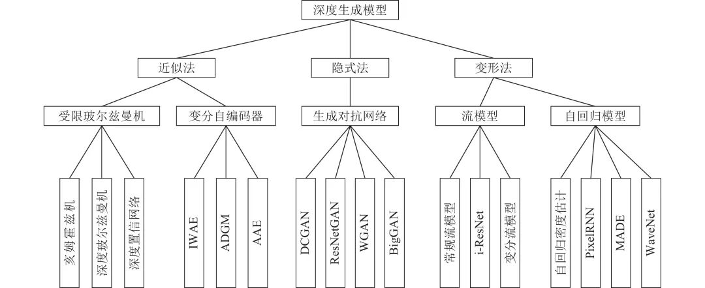
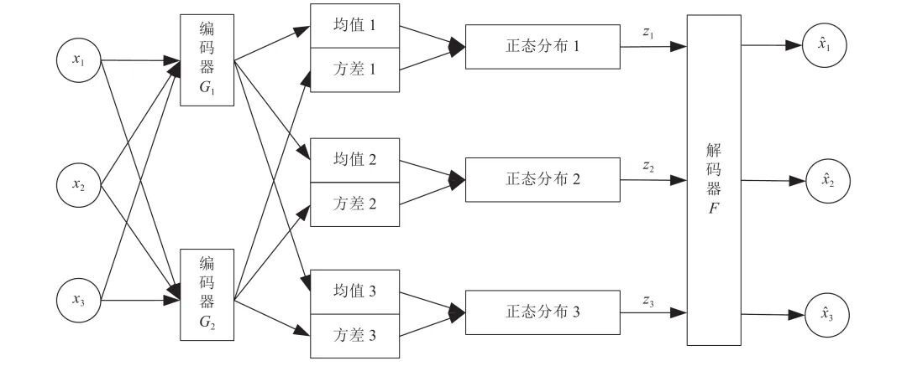
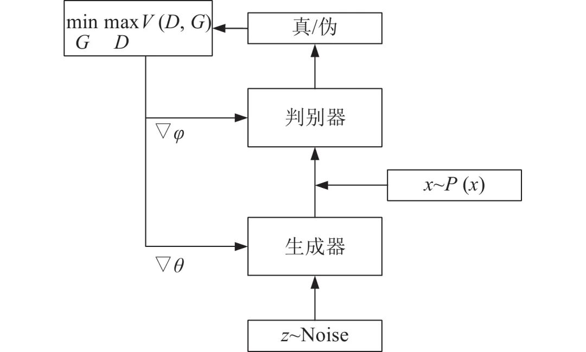
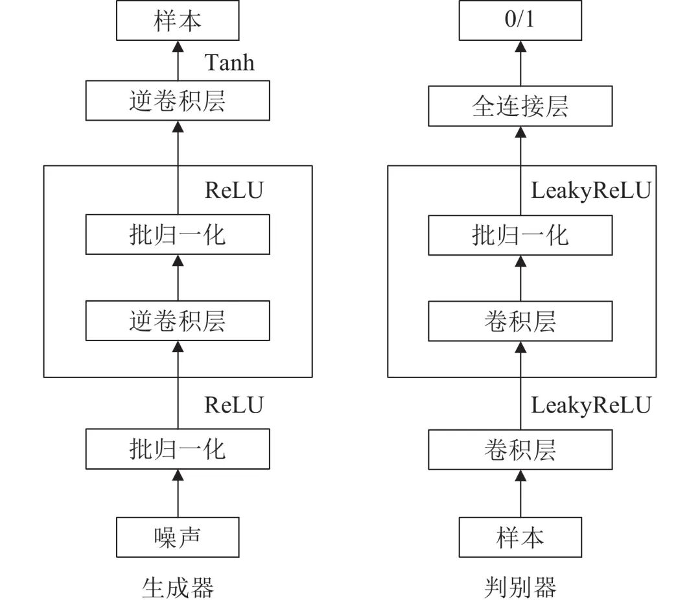
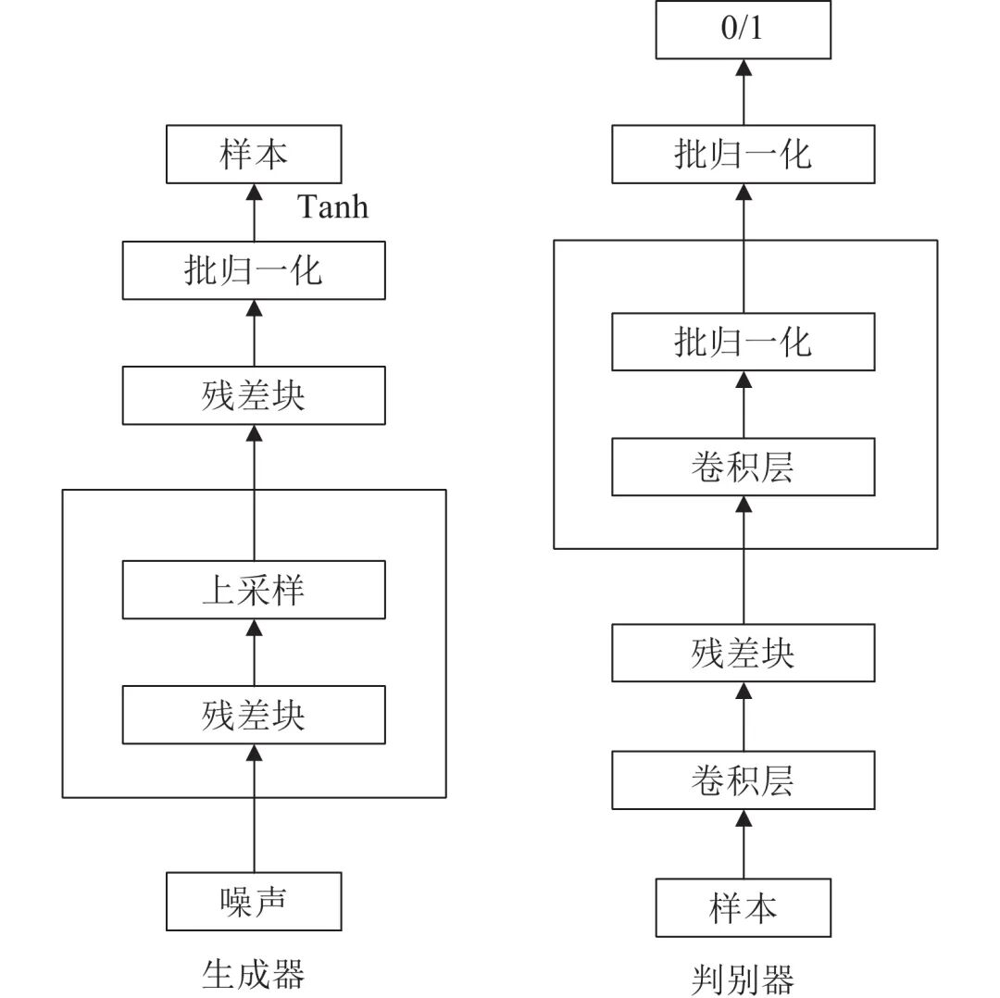
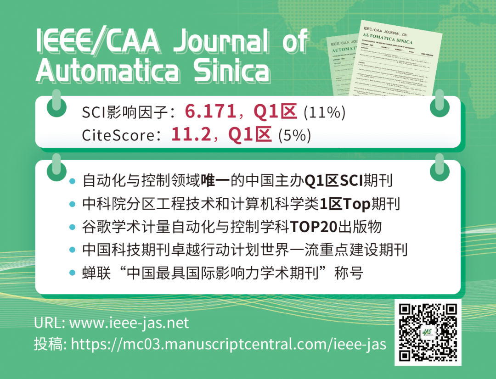

# 深度生成模型综述

原创 自动化学报 自动化学报 2022-04-06 16:37 北京

> 原文地址: [https://mp.weixin.qq.com/s/JdeztQuZIpr\_kdtCLUcYJA](https://mp.weixin.qq.com/s/JdeztQuZIpr_kdtCLUcYJA)

**点击蓝字|关注我们**

  

  

**引用本文**

  

胡铭菲, 左信, 刘建伟. 深度生成模型综述. 自动化学报, 2022, 48(1): 40−74 doi: 10.16383/j.aas.c190866

Hu Ming-Fei, Zuo Xin, Liu Jian-Wei. Survey on deep generative model. Acta Automatica Sinica, 2022, 48(1): 40−74 doi: 10.16383/j.aas.c190866

http://www.aas.net.cn/cn/article/doi/10.16383/j.aas.c190866?viewType=HTML

  

**文章简介**

  

**关键词**

  

深度生成式模型, 受限玻尔兹曼机, 变分自编码器, 流模型, 生成对抗网络, 自回归分布估计

  

**摘   要**

  

通过学习可观测数据的概率密度而随机生成样本的生成模型在近年来受到人们的广泛关注, 网络结构中包含多个隐藏层的深度生成式模型以更出色的生成能力成为研究热点, 深度生成模型在计算机视觉、密度估计、自然语言和语音识别、半监督学习等领域得到成功应用, 并给无监督学习提供了良好的范式. 本文根据深度生成模型处理似然函数的不同方法将模型分为三类: 第一类方法是近似方法, 包括采用抽样方法近似计算似然函数的受限玻尔兹曼机(Restricted Boltzmann machine, RBM)和以受限玻尔兹曼机为基础模块的深度置信网络(Deep belief network, DBN)、深度玻尔兹曼机(Deep Boltzmann machines, DBM)和亥姆霍兹机, 与之对应的另一种模型是直接优化似然函数变分下界的变分自编码器以及其重要的改进模型, 包括重要性加权自编码和可用于半监督学习的深度辅助深度模型; 第二类方法是避开求极大似然过程的隐式方法, 其代表模型是通过生成器和判别器之间的对抗行为来优化模型参数从而巧妙避开求解似然函数的生成对抗网络以及重要的改进模型, 包括WGAN、深度卷积生成对抗网络和当前最顶级的深度生成模型BigGAN; 第三类方法是对似然函数进行适当变形的流模型和自回归模型, 流模型利用可逆函数构造似然函数后直接优化模型参数, 包括以NICE为基础的常规流模型、变分流模型和可逆残差网络(i-ResNet), 自回归模型(NADE)将目标函数分解为条件概率乘积的形式, 包括神经自回归密度估计(NADE)、像素循环神经网络(PixelRNN)、掩码自编码器(MADE)以及WaveNet等. 详细描述上述模型的原理和结构以及模型变形后, 阐述各个模型的研究进展和应用, 最后对深度生成式模型进行展望和总结.

  

**引   言**

  

受益于当前计算机性能的快速提升, 学习可观测样本的概率密度并随机生成新样本的生成模型成为热点. 相比于需要学习条件概率分布的判别模型, 生成模型的训练难度大、模型结构复杂, 但除了能够生成新样本外, 生成模型在图像重构、缺失数据填充、密度估计、风格迁移和半监督学习等应用领域也获得了巨大的成功. 当前可观测样本的数量和维数都大幅度增加, 浅层的生成模型受到性能瓶颈的限制而无法满足应用需求, 从而被含有多个隐藏层的深度生成模型替代, 深度生成模型能够学习到更好的隐表示, 模型性能更好. 本文对有重要意义的深度生成模型进行全面的分析和讨论, 对各大类模型的结构和基本原理进行梳理和分类. 本文第1节介绍深度生成模型的概念和分类; 第2节介绍受限玻尔兹曼机和以受限玻尔兹曼机为基础模块的几种深度生成模型, 重点内容是各种模型的不同训练算法; 第3节介绍变分自编码器的基本结构、变分下界的推理和重参数化方法; 第4节介绍生成对抗网络, 主要内容为模型原理、训练方法和稳定性研究, 以及两种重要的模型结构; 第5节总结了流模型的结构, 详细介绍了流模型的技术特点; 第6节分析了自回归模型的模型结构以及几种重要分支的研究进展; 第7节将介绍生成模型中的两个小分支: 矩阵匹配模型和随机生成模型; 第8节对深度生成模型存在的问题进行分析讨论, 并对未来的研究方向和发展趋势做出了展望.

  

**1.   深度生成模型概述**

  

深度生成模型的目标函数是数据分布与模型分布之间的距离, 可以用极大似然法进行求解. 从处理极大似然函数的方法的角度, 可将深度生成模型分成如下三种, 分类内容如图1所示. 具体分类方式如下:

  

图 1  深度生成模型分类

  

第一种方法是通过变分或抽样的方法求似然函数的近似分布, 这种方法可称为近似方法, 主要包括受限玻尔兹曼机和变分自编码器. 用抽样方法近似求解似然函数的受限玻尔兹曼机属于浅层模型, 以该模型为基础模块的深度生成模型.

  

包括深度玻尔兹曼机和深度置信网络两种; 变分自编码器用似然函数的变分下界作为目标函数, 这种使用变分下界替代似然函数的近似方法的效率比受限玻尔兹曼机的抽样方法高很多, 实际效果也更好, 变分自编码器具有代表性的模型包括重要性加权自编码、辅助深度生成模型等.

  

第二种方法是避开求极大似然过程的隐式方法, 其代表模型是生成对抗网络. 生成对抗网络利用神经网络的学习能力来拟合两个分布之间的距离, 巧妙地避开了求解似然函数的难题, 是目前最成功、最有影响力的生成模型, 其具有代表性的模型很多, 例如深度卷积生成对抗网络、WGAN和当前生成能力最好的BigGAN; 另外利用参数化马尔科夫过程代替直接参数化似然函数的生成随机网络也属于此类方法.

  

第三类方法是对似然函数进行适当变形, 变形的目的是为了简化计算, 此类方法包括流模型和自回归模型两种模型. 流模型利用可逆网络构造似然函数之后直接优化模型参数, 训练出的编码器利用可逆结构的特点直接得到生成模型. 流模型包括常规流模型、变分流模型和可逆残差网络三种; 自回归模型将目标函数分解为条件概率乘积的形式, 这类模型有很多, 具有代表性的包括像素循环神经网络、掩码自编码器以及成功生成逼真的人类语音样本的WaveNet等.

  

图 7  VAE结构图

  

图 11  GAN模型结构

  

图 12  DCGAN结构

  

图 13  ResNet-GAN结构

  

请点击左下角“阅读原文”了解更多！

  

**作者简介**

**胡铭菲**

中国石油大学 (北京) 自动化系博士研究生. 主要研究方向为模式识别, 智能系统.

E-mail: hmfzsy@gmail.com

**左   信**

中国石油大学 (北京) 自动化系教授. 主要研究方向为智能控制.

E-mail: zuox@cup.edu.cn

**刘建伟**

中国石油大学 (北京) 自动化系副研究员. 主要研究方向为模式识别, 智能系统, 先进控制. 本文通信作者.

E-mail: liujw@cup.edu.cn

  

**相关文章**

**（请向上滑动阅读）**

  

\[1\]  尹明, 吴浩杨, 谢胜利, 杨其宇. 基于自注意力对抗的深度子空间聚类. 自动化学报, 2022, 48(1): 271-281. doi: 10.16383/j.aas.c200302

http://www.aas.net.cn/cn/article/doi/10.16383/j.aas.c200302?viewType=HTML

  

\[2\]  梁文琦, 王广聪, 赖剑煌. 基于多对多生成对抗网络的非对称跨域迁移行人再识别. 自动化学报, 2022, 48(1): 103-120. doi: 10.16383/j.aas.c190303

http://www.aas.net.cn/cn/article/doi/10.16383/j.aas.c190303?viewType=HTML

  

\[3\]  崔琳琳, 沈冰冰, 葛志强. 基于混合变分自编码器回归模型的软测量建模方法. 自动化学报, 2022, 48(2): 398-407. doi: 10.16383/j.aas.c210035

http://www.aas.net.cn/cn/article/doi/10.16383/j.aas.c210035?viewType=HTML

  

\[4\]  赖轩, 曲延云, 谢源, 裴玉龙. 基于拓扑一致性对抗互学习的知识蒸馏. 自动化学报. doi: 10.16383/j.aas.200665

http://www.aas.net.cn/cn/article/doi/10.16383/j.aas.200665?viewType=HTML

  

\[5\]  林泓, 任硕, 杨益, 张杨忆. 融合自注意力机制和相对鉴别的无监督图像翻译. 自动化学报, 2021, 47(9): 2226-2237. doi: 10.16383/j.aas.c190074

http://www.aas.net.cn/cn/article/doi/10.16383/j.aas.c190074?viewType=HTML

  

\[6\]  蒋芸, 谭宁. 基于条件深度卷积生成对抗网络的视网膜血管分割. 自动化学报, 2021, 47(1): 136-147. doi: 10.16383/j.aas.c180285

http://www.aas.net.cn/cn/article/doi/10.16383/j.aas.c180285?viewType=HTML

  

\[7\]  暴琳, 孙晓燕, 巩敦卫, 张勇. 融合注意力机制的增强受限玻尔兹曼机驱动的交互式分布估计算法. 自动化学报. doi: 10.16383/j.aas.c200604

http://www.aas.net.cn/cn/article/doi/10.16383/j.aas.c200604?viewType=HTML

  

\[8\]  胡旭光, 马大中, 郑君, 张化光, 王睿. 基于关联信息对抗学习的综合能源系统运行状态分析方法. 自动化学报, 2020, 46(9): 1783-1797. doi: 10.16383/j.aas.c200171

http://www.aas.net.cn/cn/article/doi/10.16383/j.aas.c200171?viewType=HTML

  

\[9\]  张宁, 王永成, 张欣, 徐东东. 基于深度学习的单幅图片超分辨率重构研究进展. 自动化学报, 2020, 46(12): 2479-2499. doi: 10.16383/j.aas.c190031

http://www.aas.net.cn/cn/article/doi/10.16383/j.aas.c190031?viewType=HTML

  

\[10\]  刘建伟, 谢浩杰, 罗雄麟. 生成对抗网络在各领域应用研究进展. 自动化学报, 2020, 46(12): 2500-2536. doi: 10.16383/j.aas.c180831

http://www.aas.net.cn/cn/article/doi/10.16383/j.aas.c180831?viewType=HTML

  

\[11\]  刘一敏, 蒋建国, 齐美彬, 刘皓, 周华捷. 融合生成对抗网络和姿态估计的视频行人再识别方法. 自动化学报, 2020, 46(3): 576-584. doi: 10.16383/j.aas.c180054

http://www.aas.net.cn/cn/article/doi/10.16383/j.aas.c180054?viewType=HTML

  

\[12\]  孔锐, 蔡佳纯, 黄钢. 基于生成对抗网络的对抗攻击防御模型. 自动化学报. doi: 10.16383/j.aas.2020.c200033

http://www.aas.net.cn/cn/article/doi/10.16383/j.aas.2020.c200033?viewType=HTML

  

\[13\]  李燕萍, 曹盼, 左宇涛, 张燕, 钱博. 基于i向量和变分自编码相对生成对抗网络的语音转换. 自动化学报. doi: 10.16383/j.aas.c190733

http://www.aas.net.cn/cn/article/doi/10.16383/j.aas.c190733?viewType=HTML

  

\[14\]  付晓, 沈远彤, 李宏伟, 程晓梅. 基于半监督编码生成对抗网络的图像分类模型. 自动化学报, 2020, 46(3): 531-539. doi: 10.16383/j.aas.c180212

http://www.aas.net.cn/cn/article/doi/10.16383/j.aas.c180212?viewType=HTML

  

\[15\]  史科, 陆阳, 刘广亮, 毕翔, 王辉. 基于多隐层Gibbs采样的深度信念网络训练方法. 自动化学报, 2019, 45(5): 975-984. doi: 10.16383/j.aas.c170669

http://www.aas.net.cn/cn/article/doi/10.16383/j.aas.c170669?viewType=HTML

  

\[16\]  张一珂, 张鹏远, 颜永红. 基于对抗训练策略的语言模型数据增强技术. 自动化学报, 2018, 44(5): 891-900. doi: 10.16383/j.aas.2018.c170464

http://www.aas.net.cn/cn/article/doi/10.16383/j.aas.2018.c170464?viewType=HTML

  

\[17\]  唐贤伦, 杜一铭, 刘雨微, 李佳歆, 马艺玮. 基于条件深度卷积生成对抗网络的图像识别方法. 自动化学报, 2018, 44(5): 855-864. doi: 10.16383/j.aas.2018.c170470

http://www.aas.net.cn/cn/article/doi/10.16383/j.aas.2018.c170470?viewType=HTML

  

\[18\]  赵树阳, 李建武. 基于生成对抗网络的低秩图像生成方法. 自动化学报, 2018, 44(5): 829-839. doi: 10.16383/j.aas.2018.c170473

http://www.aas.net.cn/cn/article/doi/10.16383/j.aas.2018.c170473?viewType=HTML

  

\[19\]  张龙, 赵杰煜, 叶绪伦, 董伟. 协作式生成对抗网络. 自动化学报, 2018, 44(5): 804-810. doi: 10.16383/j.aas.2018.c170483

http://www.aas.net.cn/cn/article/doi/10.16383/j.aas.2018.c170483?viewType=HTML

  

\[20\]  李飞, 高晓光, 万开方. 基于改进并行回火算法的RBM网络训练研究. 自动化学报, 2017, 43(5): 753-764. doi: 10.16383/j.aas.2017.c160326

http://www.aas.net.cn/cn/article/doi/10.16383/j.aas.2017.c160326?viewType=HTML

  

**近期文章**

  

[《自动化学报》2022年第03期目录分享](http://mp.weixin.qq.com/s?__biz=MzAwMzAzMDgxOA==&mid=2651075527&idx=1&sn=bc020c5fd09080243f7527610b003507&chksm=8131f98ab646709c2f485852b526989a3b9af5cc93e8afb508d9239b78176f49caa9807d6a8d&scene=21#wechat_redirect)

[2022斯坦福AI指数报告出炉！点击获取完整报告](http://mp.weixin.qq.com/s?__biz=MzAwMzAzMDgxOA==&mid=2651075236&idx=3&sn=1caed46e80f613c172a227ead8ddc1a3&chksm=8131f8e9b64671ffa8d6f7c8a36210fe1e262a66a42ab9a544e064d3c725b4a31274a4551750&scene=21#wechat_redirect)

[CVPR 2022 | 自动化所新作速览！（上）](http://mp.weixin.qq.com/s?__biz=MzAwMzAzMDgxOA==&mid=2651075034&idx=2&sn=48b5232daaa7a51da96c3a7c87013e2d&chksm=8131fb97b6467281dc8e02749df8d0388f89d30e3b08f44d13c700169d1d7a22c4feef9f2dba&scene=21#wechat_redirect)

[CVPR 2022 | 自动化所新作速览！（下）](http://mp.weixin.qq.com/s?__biz=MzAwMzAzMDgxOA==&mid=2651075034&idx=3&sn=21833bb312bb0d9826c64c9fce068aa5&chksm=8131fb97b646728147f2bff58a04230d708d5a4537eb824656c2d54580b11f6a47b0eb30ade6&scene=21#wechat_redirect)

[直播回放分享 | 陈关荣教授：探索最优同步网络的拓扑结构](http://mp.weixin.qq.com/s?__biz=MzIxMjA5Njg2Nw==&mid=2649061608&idx=1&sn=1500a81260d8f5127b7cb7767c759fba&chksm=8f5a9ae4b82d13f201b714d8e96af9bbddf442bb7e10c97416fb925ab2170c05fa12010fb1d1&scene=21#wechat_redirect)

  

**热点文章**

  

[《自动化学报》2019年高关注论文](http://mp.weixin.qq.com/s?__biz=MzAwMzAzMDgxOA==&mid=2651073450&idx=1&sn=6f57bd0df73f259aa416575f1f69bdfb&chksm=8131e1e7b64668f1344de4acdef6148e8dcfa60c80e4f48e6cb1270558c2beade5601e92d05c&scene=21#wechat_redirect)

[《自动化学报》2021年热点文章回顾](http://mp.weixin.qq.com/s?__biz=MzAwMzAzMDgxOA==&mid=2651072577&idx=1&sn=4e6be077d7371c7d29d9a371d8defe19&chksm=8131e20cb6466b1aec2f3b8b1063d3be11725ca9a0c15785c3b42a638170e732acd0d8d345e0&scene=21#wechat_redirect)

[国家自然科学基金论文精选](http://mp.weixin.qq.com/s?__biz=MzI2NjA3MzM5MA==&mid=2649960308&idx=1&sn=1634c999f22588333537f13393403f9c&chksm=f2942b35c5e3a2232e86b51c2b7c8f37a4d3d7f858d370d76d5afd00567d7da6e9543476d120&scene=21#wechat_redirect)  

[国家重点研发计划论文精选](http://mp.weixin.qq.com/s?__biz=MzI2NjA3MzM5MA==&mid=2649960255&idx=1&sn=f48435928fd924134cb72014860b9d00&chksm=f2942b7ec5e3a26869da68a1419b3b40ca1e6cb98abf2e380d78a49ffb99c85991d76cc346b0&scene=21#wechat_redirect)

[中国科学院自动化研究所高层次人才招聘启事 | 长期有效](http://mp.weixin.qq.com/s?__biz=MzI2NjA3MzM5MA==&mid=2649959451&idx=1&sn=657b7e4aeeaa88114d5189641c5409dc&chksm=f294285ac5e3a14cd230a2b9678c32ba9bf92e8ffc9d61d506c5ffea2df793456dd37c2c6fb1&scene=21#wechat_redirect)

  

**期刊动态**

  

[自动化学报（英文版）和自动化学报入选计算领域高质量科技期刊T1类](http://mp.weixin.qq.com/s?__biz=MzAwMzAzMDgxOA==&mid=2651073859&idx=2&sn=7a9192717637dcf6cddb39ed961e8c3b&chksm=8131e70eb6466e188a123c504bdeba80c75681de4762f8685b3bf584bc33eb12362c70613b4e&scene=21#wechat_redirect)

[《自动化学报》编辑部防诈骗公告](http://mp.weixin.qq.com/s?__biz=MzAwMzAzMDgxOA==&mid=2651073517&idx=1&sn=c52de7c685e546af9faffc0cefab1c85&chksm=8131e1a0b64668b63ebaa68ea81cbaec3b94dc52ea8360821a0a49e67ae7e4b428a25d0f19c5&scene=21#wechat_redirect)

[《自动化学报》致谢审稿人](http://mp.weixin.qq.com/s?__biz=MzI2NjA3MzM5MA==&mid=2649961201&idx=1&sn=3142842d75c441ae860c1ecb313c7657&chksm=f29436b0c5e3bfa6c679210f60513eb1a7205dc20fe028f482bb593eac60427e4e56fba12493&scene=21#wechat_redirect)

[自动化学报多篇论文入选中国百篇最具影响国内论文和中国精品期刊顶尖论文](http://mp.weixin.qq.com/s?__biz=MzI2NjA3MzM5MA==&mid=2649961152&idx=1&sn=4a5e9e4b84879f4cde4e13a0ef97272c&chksm=f2943681c5e3bf97d7770c9623dac869b283b3ea83f3d320017974033e361d8b999134a8bdff&scene=21#wechat_redirect)

[自动化学报各项主要指标蝉联第1，再获百种中国杰出期刊称号](http://mp.weixin.qq.com/s?__biz=MzI2NjA3MzM5MA==&mid=2649960903&idx=1&sn=7da8b8a0167e16bcbaa1f00fbfb69782&chksm=f2943586c5e3bc9014f6d4fff7147b998ae42b4da452907e641e8029f296fd2413b4f17aef62&scene=21#wechat_redirect)

  

**期刊目录**

  

[2022年第03期](http://mp.weixin.qq.com/s?__biz=MzAwMzAzMDgxOA==&mid=2651075527&idx=1&sn=bc020c5fd09080243f7527610b003507&chksm=8131f98ab646709c2f485852b526989a3b9af5cc93e8afb508d9239b78176f49caa9807d6a8d&scene=21#wechat_redirect)

[2022年第02期](http://mp.weixin.qq.com/s?__biz=MzI2NjA3MzM5MA==&mid=2649961838&idx=1&sn=29334896aa0f372b70312250c75b6b20&chksm=f294312fc5e3b8392ffd49100eaba435bf48fa9234c5019fe7b16ed1e4ebef70be58691f3fb3&scene=21#wechat_redirect)

[2022年第01期](http://mp.weixin.qq.com/s?__biz=MzI2NjA3MzM5MA==&mid=2649961423&idx=1&sn=3b65958faa7c7f94c247f46dd72bd71e&chksm=f294378ec5e3be9825f860d132c36c97f3e877089449cb1fe85a6d1e7da9bd0e24795336bc54&scene=21#wechat_redirect)

[《自动化学报》2021年全年合集](http://mp.weixin.qq.com/s?__biz=MzAwMzAzMDgxOA==&mid=2651072770&idx=1&sn=7c531f7fa3bc390558fab15b339ce86e&chksm=8131e34fb6466a59ed079448fddda0fc9f97066460bff8f6835288003a1fba2812de383813c1&scene=21#wechat_redirect)

[《自动化学报》2020年全年合集](http://mp.weixin.qq.com/s?__biz=MzI2NjA3MzM5MA==&mid=2649957972&idx=1&sn=1951847aacbcb7d22bdd2a46a79af871&chksm=f2942215c5e3ab03d070d8e52b8764b38036897c97b6a26c7a1f918c806b28edbe6c0fbf7ea9&scene=21#wechat_redirect)

[2020年第10期 工业人工智能专题](http://mp.weixin.qq.com/s?__biz=MzI2NjA3MzM5MA==&mid=2649957201&idx=1&sn=ab82a767bd716ab67fdf2942500d8b61&chksm=f2942710c5e3ae06b27f9e63a5e329a1123d90b051164e6b6123c500230541b1ed12d92abbfb&scene=21#wechat_redirect)

[2020年第09期 分布式信息能源系统理论与应用专题](http://mp.weixin.qq.com/s?__biz=MzI2NjA3MzM5MA==&mid=2649956412&idx=1&sn=8ebc13d63fd333ad85dbb8b5825df248&chksm=f294247dc5e3ad6ba297857a5b957e97cf499266c50318791fa8abd9432ecf1d9c3d9b287e36&scene=21#wechat_redirect)

  

  

  

**长按二维码｜关注我们**

**IEEE/CAA Journal of Automatica Sinica (JAS)**

**长按二维码｜关注我们**

**《自动化学报》服务号**

**长按二维码｜关注我们**

**《自动化学报》订阅号**  

  

**联系我们**

**网站:** 

http://www.aas.net.cn

http://www.ieee-jas.net

**投稿:** 

https://mc03.manuscriptcentral.com/aas-cn   

https://mc03.manuscriptcentral.com/ieee-jas 

**电话:**

010-82544653（日常咨询和稿件处理）           

010-82544677（录用后稿件处理）

**邮箱:** 

aas@ia.ac.cn（日常咨询和稿件处理）

aas\_editor@ia.ac.cn（录用后稿件处理）

**博客:** 

http://blog.sina.com.cn/aaseditor 

  

**点击****阅读原文** **了解更多**