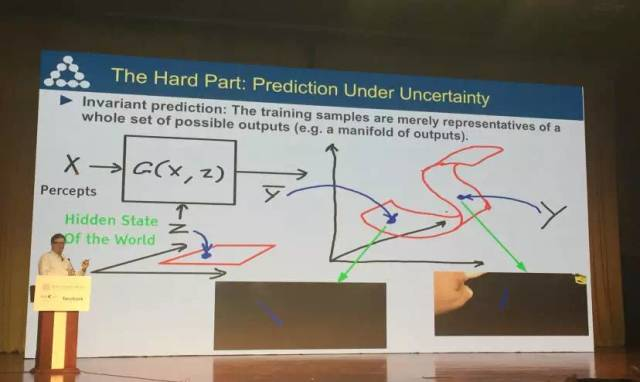
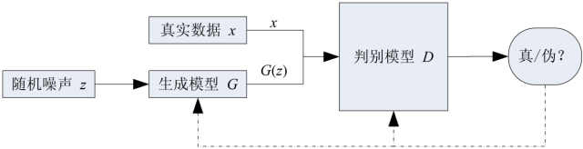
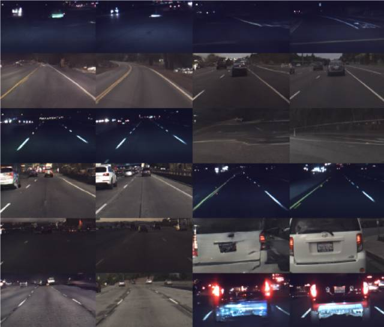
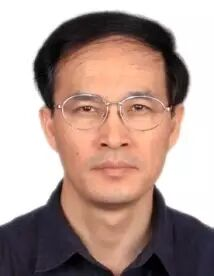

# 生成式对抗网络GAN的研究进展与展望

原创 自动化学报 2017-03-28 13:46 北京

> 原文地址: [https://mp.weixin.qq.com/s/WXADgcMHD-rMCvrLUYW9ew](https://mp.weixin.qq.com/s/WXADgcMHD-rMCvrLUYW9ew)

Yann LeCun 对GAN给予高度肯定

生成式对抗网络GAN（Generative adversarial networks）是Ian Goodfellow等人在2014年提出的一种生成式模型。王飞跃研究员等在《自动化学报》第三期阐述了GAN的研究进展与发展趋势。首先总结了GAN的提出背景、理论与实现模型及应用领域，然后分析GAN的优缺点并展望GAN的发展趋势，重点讨论了GAN与平行智能的关系。

在人工智能的热潮、生成式模型的积累、神经网络的深化、对抗思想的成功等因素的综合影响下，GAN应运而生，并且立刻受到了人工智能研究者的重视。

GAN在结构上受博弈论中的二人零和博弈（即二人的利益之和为零，一方的所得正是另一方的所失）的启发，系统由一个生成器G和一个判别器D构成。生成器的目的是尽量捕捉真实数据样本的潜在分布，并生成新的数据样本；而判别器的目的是尽量正确判别输入数据是来自真实数据还是来自生成器。生成器和判别器均可以采用深度神经网络。为了取得游戏胜利，这两个游戏参与者需要不断优化，各自提高自己的生成能力和判别能力。

GAN的优化过程是一个极小极大博弈（Minimax game）问题，优化目标是达到纳什均衡，使生成器估测到数据样本的分布。GAN的计算流程与结构如图1所示。自从Goodfellow等提出GAN以来，陆续出现了一些基于GAN的衍生模型（例如W-GAN、LS-GAN、Semi-GAN、C-GAN、Bi-GAN、Info-GAN、AC-GAN、Seq-GAN等），这些模型的创新点包括模型结构改进、理论扩展及应用等。

图1  GAN的计算流程与结构

GAN的研究和应用

在当前的人工智能热潮下，GAN的提出满足了许多领域的研究和应用需求，同时为这些领域注入了新的发展动力。GAN已经成为人工智能学界一个热门的研究方向，著名学者Yann LeCun甚至将其称为“过去十年间机器学习领域最让人激动的点子”。目前，图像和视觉领域是对GAN研究和应用最广泛的一个领域，已经可以生成数字、人脸等物体对象，构成各种逼真的室内外场景，从分割图像恢复原图像，给黑白图像上色，从物体轮廓恢复物体图像，从低分辨率图像生成高分辨率图像等。图2显示了GAN生成的超分辨率图像。图3显示了GAN生成的驾驶场景图像。此外，GAN已经开始被应用到语音和语言处理、电脑病毒监测、棋类比赛程序等问题的研究中。

图2  GAN生成的超分辨率图像

图3  GAN生成的驾驶场景图像（奇数列为生成图像，偶数列为目标图像）

GAN的优缺点和发展趋势

GAN采用对抗学习的准则，理论上还不能判断模型的收敛性和均衡点的存在性。训练过程需要保证两个对抗网络的平衡和同步，否则难以得到很好的训练效果。而实际过程中两个对抗网络的同步不易把控，训练过程可能不稳定。另外，作为以神经网络为基础的生成式模型，GAN存在神经网络类模型的一般性缺陷，即可解释性差。另外，GAN生成的样本虽然具有多样性，但是存在崩溃模式（Collapse mode）现象，可能生成多样的，但对于人类来说差异不大的样本。虽然GAN存在这些问题，但是已取得的研究进展表明它具有广阔的发展前景。Wasserstein GAN彻底解决了训练不稳定问题，同时基本解决了崩溃模式现象。如何彻底解决崩溃模式并继续优化训练过程是GAN的一个研究方向。另外，关于GAN收敛性和均衡点存在性的理论推断也是未来的一个重要研究课题。从发展应用GAN的角度，如何根据简单随机的输入，生成多样的、能够与人类交互的数据，是近期的一个应用发展方向。从GAN与其他方法交叉融合的角度，如何将GAN与特征学习、模仿学习、强化学习等技术更好地融合，开发新的人工智能应用或者促进这些方法的发展，是很有意义的发展方向。从长远来看，如何利用GAN推动人工智能的发展与应用，提升人工智能理解世界的能力，甚至激发人工智能的创造力是值得研究者思考的问题。

GAN与平行智能的关系

最后，重点讨论了GAN与平行智能的关系，认为GAN可以深化平行系统的虚实互动、交互一体的理念，特别是计算实验的思想，为ACP (Artificial societies, computational experiments, and parallel execution) 理论提供了十分具体和丰富的算法支持。平行系统强调虚实互动，构建人工系统来描述和表示实际系统，利用计算实验来学习和评估各种计算模型，通过平行执行来提升实际系统的性能，使得人工系统和实际系统共同推进。ACP理论和平行系统方法目前已经发展为更广义的平行智能理论。在GAN训练过程中，真实的数据样本和生成的数据样本通过对抗网络互动，并且训练好的生成器能够生成比真实样本更多的虚拟样本。在平行视觉、平行控制、平行学习等若干平行系统中，GAN可以通过生成与真实数据同分布的数据样本，深化平行系统的虚实互动、交互一体的理念，支持平行系统的理论和应用研究。因此，GAN作为一种有效的生成式模型，可以融入到平行智能的研究体系。

引用格式

王坤峰, 苟超, 段艳杰, 林懿伦, 郑心湖, 王飞跃. 生成式对抗网络GAN的研究进展与展望. 自动化学报, 2017, 43(3): 321-332

作者发表的相关文章：

[平行机器人与平行无人系统——智能无人载具的研究新进展](http://mp.weixin.qq.com/s?__biz=MzAwMzAzMDgxOA==&mid=2651063159&idx=1&sn=85511333c6ef151772c12f1ce1865ea8&chksm=8131c93ab646402c2a88349b771786364392abd4b017986beb891cef5389fab360ca149551a9&scene=21#wechat_redirect)  

[平行学习——机器学习的一个新型理论框架](http://mp.weixin.qq.com/s?__biz=MzAwMzAzMDgxOA==&mid=2651063132&idx=2&sn=5d4b7da792a728ef5a4104c48fa751e5&chksm=8131c911b646400778fc358760d80348ad261d6b9b461fdcd193be89d545429c74513399eea4&scene=21#wechat_redirect)  

[平行视觉: 基于ACP 的智能视觉计算方法](http://mp.weixin.qq.com/s?__biz=MzAwMzAzMDgxOA==&mid=2651063100&idx=3&sn=1405c979688899b68a6ded16602e7bfb&chksm=8131c971b646406755aa4f221807292de744cd0840650dc9486ab4ceeb07fede950d50cdc8f3&scene=21#wechat_redirect)  

[好文推荐：区块链技术发展现状与展望](http://mp.weixin.qq.com/s?__biz=MzAwMzAzMDgxOA==&mid=403579316&idx=1&sn=af5bd9d5b5c868b44eee7b2f166bb747&scene=21#wechat_redirect)  

作者简介

王坤峰 中国科学院自动化研究所复杂系统管理与控制国家重点实验室副研究员. 主要研究方向为智能交通系统, 智能视觉计算, 机器学习.

E-mail: kunfeng.wang@ia.ac.cn

苟超 中国科学院自动化研究所复杂系统管理与控制国家重点实验室博士研究生. 主要研究方向为智能交通系统, 图像处理, 模式识别.

E-mail: gouchao2012@ia.ac.cn

段艳杰 中国科学院自动化研究所复杂系统管理与控制国家重点实验室博士研究生. 主要研究方向为智能交通系统, 机器学习及应用.

E-mail: duanyanjie2012@ia.ac.cn

林懿伦 中国科学院自动化研究所复杂系统管理与控制国家重点实验室博士研究生. 主要研究方向为社会计算, 智能交通系统, 深度学习和强化学习.

E-mail: linyilun2014@ia.ac.cn

郑心湖明尼苏达大学计算机科学与工程学院研究生. 主要研究方向为社会计算, 机器学习, 数据分析.

E-mail: zheng473@umn.edu

王飞跃 中国科学院自动化研究所复杂系统管理与控制国家重点实验室研究员. 国防科学技术大学军事计算实验与平行系统技术研究中心主任. 主要研究方向为智能系统和复杂系统的建模、分析与控制. 本文通信作者.

E-mail: feiyue.wang@ia.ac.cn

微信服务号：自动化学报

微信订阅号：aas1963

新浪微博：自动化学报

新浪博客：Automation\_2011

联系我们：

Tel:  010-82544653（日常咨询和稿件处理） 

        010-82544677（录用后稿件处理）

Fax: 010-82544497

Email: aas@ia.ac.cn（日常咨询和稿件处理）

          aas\_editor@ia.ac.cn（录用后稿件处理）

http://www.aas.net.cn

