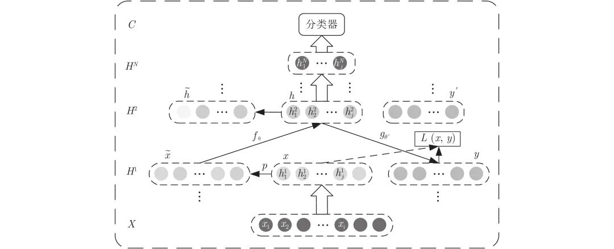
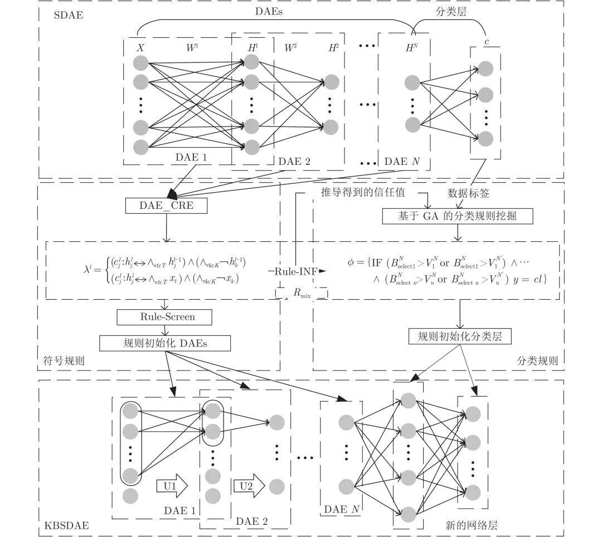
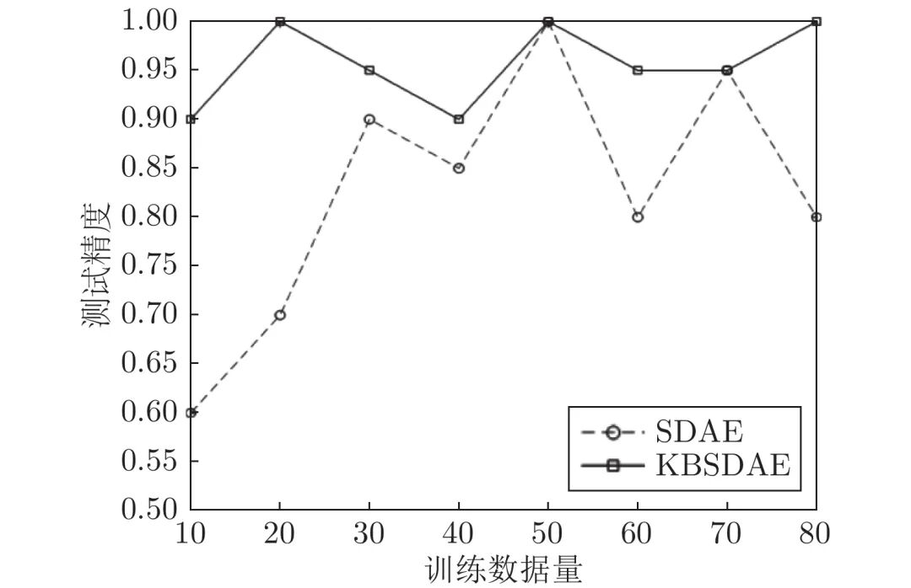
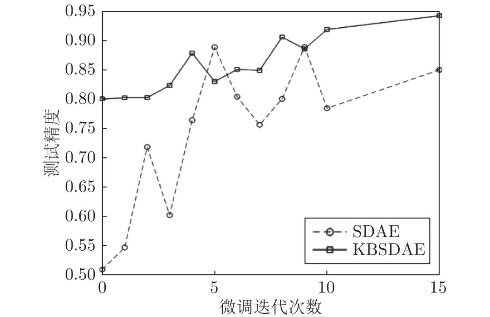
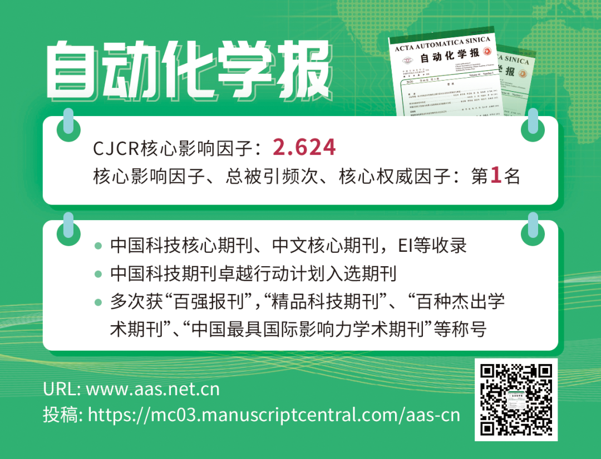

# 知识堆叠降噪自编码器

原创 自动化学报 自动化学报 2022-03-18 15:55 北京

> 原文地址: [https://mp.weixin.qq.com/s/1r8b6ctFhJnh2v2u87gnZQ](https://mp.weixin.qq.com/s/1r8b6ctFhJnh2v2u87gnZQ)

**点击蓝字 关注我们**

  

**引****用本文**

  

刘国梁, 余建波. 知识堆叠降噪自编码器. 自动化学报, 2022, 48(3): 774−786 doi: 10.16383/j.aas.c190375 

Liu Guo-Liang, Yu Jian-Bo. Knowledge-based stacked denoising autoencoder. Acta Automatica Sinica, 2022, 48(3): 774−786 doi: 10.16383/j.aas.c190375  

http://www.aas.net.cn/cn/article/doi/10.16383/j.aas.c190375?viewType=HTML

  

**文章简介**

  

**关键词**

  

深度学习, 堆叠降噪自编码器, 知识发现, 符号规则, 分类规则

  

**摘   要**

  

深度神经网络是具有复杂结构和多个非线性处理单元的模型, 广泛应用于计算机视觉、自然语言处理等领域. 但是, 深度神经网络存在不可解释这一致命缺陷, 即“黑箱问题”, 这使得深度学习在各个领域的应用仍然存在巨大的障碍. 本文提出了一种新的深度神经网络模型 —— 知识堆叠降噪自编码器(Knowledge-based stacked denoising autoencoder, KBSDAE). 尝试以一种逻辑语言的方式有效解释网络结构及内在运作机理, 同时确保逻辑规则可以进行深度推导. 进一步通过插入提取的规则到深度网络, 使KBSDAE不仅能自适应地构建深度网络模型并具有可解释和可视化特性, 而且有效地提高了模式识别性能. 大量的实验结果表明, 提取的规则不仅能够有效地表示深度网络, 还能够初始化网络结构以提高KBSDAE的特征学习性能、模型可解释性与可视化, 可应用性更强.

  

**引   言**

  

知识的表述和推理一直是人工智能的热点话题, 其中知识所代表的是数据特征与标签间存在的一般规律. 在人工智能发展早期, 符号规则用来表述知识并进行推理, 研究者企图通过这种方式来以人类的思维模式解释机器的结论, 而在这一过程中的规则定义为知识. 符号形式的优点在于可以通过推导对知识进行验证, 并且其规则推导过程都是可以理解的.

  

在大数据时代, 以连接主义为核心的神经网络相较于符号系统具有更好的适应性. 其中, 深度学习凭借其良好的特征学习性能近些年已经在各个领域得到了广泛应用. 通过深度学习得到的深度网络即为具有深度结构的神经网络. 在深度神经网络领域, Hinton等基于深度置信网络(Deep belief network, DBN)提出非监督贪心逐层训练算法, 为解决深层结构优化难题提供了解决办法, 并进一步提出了堆叠自动编码器(Stacked auto encoder, SAE). Lecun等提出了卷积神经网络(Convolutional neural networks, CNN), 利用空间相对关系以减少参数数目来提高反向传播算法的训练效果, 在图像识别方面应用前景广阔. 此外, 深度学习还出现了一些变形结构, 如堆叠降噪自编码器(Stacked denoising auto encoder, SDAE). 深度网络凭借其强大的学习能力广泛地应用于各个领域, 但同时也据有不可忽视的 “黑箱问题”, 即人类不能通过了解网络内部的结构和数值特性来得到数据特征和数据标签之间的关系, 这一问题从根本上限制了深度神经网络的发展.

  

近年来, 一些研究者开始探究如何将符号系统和神经网络相结合, 其中一部分人希望通过符号规则所表示的逻辑关系来解释网络内部的结构和数值特性, 另一部分希望将人类已知的知识通过符号系统传入神经网络以提高网络性能. Gallant最先提出了一种使用IF-THEN规则解释推理结论的神经网络专家系统. 其后Towell等提出基于知识的人工神经网络(Knowledge-based artificial neural network, KBANN), 利用MofN规则实现对神经网络的知识抽取和插入, 通过这种方式解释网络并增强网络性能. Garcez等在KBANN的基础上提出了 CILP (Connectionist inductive learning and logic programming)系统, 该系统将逻辑规则应用到初始化网络过程中, 使网络可以更好地学习数据和知识. Fernando 等在KBANN的基础上提出了INSS (Incremental neuro-symbolic system)系统, 成功利用包含实数的分类规则初始化人工神经网络. Setiono在前人的基础上从标准的三层前馈神经网络中抽取了IF-THEN规则, 该抽取算法最大的亮点在于将隐藏节点的激活值离散化. 袁静等尝试利用符号逻辑语言描述神经网络, 并通过激活强度从理论上帮助规则进行推导. 钱大群等根据神经网络节点的输出值建立约束并生成规则. 这种规则被用来解释神经网络的行为. 黎明等将模糊规则与神经网络相结合以提高模型的模式识别能力. 在深度学习上更进一步的研究中, Penning等提出神经符号认知代理模型(Neural-symbolic cognitive agent, NSCA), 试图将时间符号知识规则与RTRBM (Recurrent temporal restricted Boltzmann machine)结合实现在线学习. Odense等将受限玻尔兹曼机(Restricted Boltzmann machine, RBM)与MofN规则相结合. 深度置信网络(DBN)是由RBM堆叠形成的, 而这一研究的意义则在于这是对DBN网络进行模块化解释的主要基础, 也是对神经网络与符号结合的一种新思考. Tran等在NSCA的基础上将置信度规则与DBN相结合, 实现知识的抽取和插入. Li等通过将符号系统与神经网络相结合形成神经符号系统, 将符号主义与连接主义的优点集成, 形成新的推理学习模型. Garcez等提出了神经符号计算的概念, 其中知识以符号的形式表示, 而学习和推理由神经元计算. 通过这种方式将神经网络的鲁棒学习和有效推理与符号的可解释性相结合. 论文从知识的表示、提取、推理和学习方面进行讨论, 并分别对基于规则、基于公式和基于嵌入的神经符号计算方法进行了论述. 但是, 上文所提到的知识提取与插入方法通常在浅层神经网络模型实施, 对于深度神经网络模型的知识提取与插入有待深入展开.

  

本文提出了一种新的深度神经网络模型 —— 知识堆叠降噪自编码器 (Knowledge-based stacked denoising autoencoder, KBSDAE), 实现了符号系统与深度SDAE之间的有效集成, 解决了深度神经网络的知识发现, 特征提取与网络可视化问题. 本文的主要贡献如下: 1)提出了一种新的深度知识神经网络KBSDAE模型, 显著地提高了特征学习及模式识别性能; 2)提出了一种从深度网络发现知识的方法, 实现了深度网络可解释的目的; 3)有效地将符号规则与分类规则相结合, 获得了一种具有高推导性能的规则系统. 最后采用各类标杆数据验证了本文所提出方法的有效性与可应用性.

  

图 1  堆叠降噪自编码器工作原理示意图

  

图 2  KBSDAE模型结构图

  

图 7  不同DNA promoter数据量训练的SDAE与KBSDAE分类性能对比

  

图 8  不同Fine-tuning训练步数的SDAE与KBSDAE分类性能对比

  

请点击左下角“**阅读原文**”了解更多！

  

**作者简介**

**刘国梁**

同济大学机械与能源工程学院硕士研究生. 2018年获上海大学机械工程及其自动化学院学士学位. 主要研究方向为机器学习, 深度学习, 智能质量管控. 本文通信作者.

E-mail: guoliangliutt@163.com

**余建波**

同济大学机械与能源工程学院教授. 2009年获上海交通大学机械工程学院博士学位. 主要研究方向为机器学习, 深度学习, 智能质量管控, 过程控制, 视觉检测与识别.

E-mail: jbyu@tongji.edu.cn

  

**相关文章**

**（请向上滑动阅读）**

  

\[1\]  钱大群, 孙振飞. 神经网络的知识获取与行为解释. 自动化学报, 1994, 20(3): 348-351

http://www.aas.net.cn/article/id/14101?viewType=HTML

  

\[2\]  范家伟, 张如如, 陆萌, 何佳雯, 康霄阳, 柴文俊, 石珅达, 宋美娜, 鄂海红, 欧中洪. 深度学习方法在糖尿病视网膜病变诊断中的应用. 自动化学报, 2021, 47(5): 985-1004. doi: 10.16383/j.aas.c190069

http://www.aas.net.cn/cn/article/doi/10.16383/j.aas.c190069?viewType=HTML

  

\[3\]  刘国梁, 余建波. 基于堆叠降噪自编码器的神经-符号模型及在晶圆表面缺陷识别. 自动化学报. doi: 10.16383/j.aas.c190857

http://www.aas.net.cn/cn/article/doi/10.16383/j.aas.c190857?viewType=HTML

  

\[4\]  侯建华, 张国帅, 项俊. 基于深度学习的多目标跟踪关联模型设计. 自动化学报, 2020, 46(12): 2690-2700. doi: 10.16383/j.aas.c180528

http://www.aas.net.cn/cn/article/doi/10.16383/j.aas.c180528?viewType=HTML

  

\[5\]  许玉格, 钟铭, 吴宗泽, 任志刚, 刘伟生. 基于深度学习的纹理布匹瑕疵检测方法. 自动化学报. doi: 10.16383/j.aas.c200148

http://www.aas.net.cn/cn/article/doi/10.16383/j.aas.c200148?viewType=HTML

  

\[6\]  梁星星, 冯旸赫, 马扬, 程光权, 黄金才, 王琦, 周玉珍, 刘忠. 多Agent深度强化学习综述. 自动化学报, 2020, 46(12): 2537-2557. doi: 10.16383/j.aas.c180372

http://www.aas.net.cn/cn/article/doi/10.16383/j.aas.c180372?viewType=HTML

  

\[7\]  付晓, 沈远彤, 李宏伟, 程晓梅. 基于半监督编码生成对抗网络的图像分类模型. 自动化学报, 2020, 46(3): 531-539. doi: 10.16383/j.aas.c180212

http://www.aas.net.cn/cn/article/doi/10.16383/j.aas.c180212?viewType=HTML

  

\[8\]  林金花, 姚禹, 王莹. 基于深度图及分离池化技术的场景复原及语义分类网络. 自动化学报, 2019, 45(11): 2178-2186. doi: 10.16383/j.aas.2018.c170439

http://www.aas.net.cn/cn/article/doi/10.16383/j.aas.2018.c170439?viewType=HTML

  

\[9\]  张号逵, 李映, 姜晔楠. 深度学习在高光谱图像分类领域的研究现状与展望. 自动化学报, 2018, 44(6): 961-977. doi: 10.16383/j.aas.2018.c170190

http://www.aas.net.cn/cn/article/doi/10.16383/j.aas.2018.c170190?viewType=HTML

  

\[10\]  吴志勇, 丁香乾, 许晓伟, 鞠传香. 基于深度学习和模糊C均值的心电信号分类方法. 自动化学报, 2018, 44(10): 1913-1920. doi: 10.16383/j.aas.2018.c170417

http://www.aas.net.cn/cn/article/doi/10.16383/j.aas.2018.c170417?viewType=HTML

  

\[11\]  陈伟宏, 安吉尧, 李仁发, 李万里. 深度学习认知计算综述. 自动化学报, 2017, 43(11): 1886-1897. doi: 10.16383/j.aas.2017.c160690

http://www.aas.net.cn/cn/article/doi/10.16383/j.aas.2017.c160690?viewType=HTML

  

\[12\]  罗建豪, 吴建鑫. 基于深度卷积特征的细粒度图像分类研究综述. 自动化学报, 2017, 43(8): 1306-1318. doi: 10.16383/j.aas.2017.c160425

http://www.aas.net.cn/cn/article/doi/10.16383/j.aas.2017.c160425?viewType=HTML

  

\[13\]  段艳杰, 吕宜生, 张杰, 赵学亮, 王飞跃. 深度学习在控制领域的研究现状与展望. 自动化学报, 2016, 42(5): 643-654. doi: 10.16383/j.aas.2016.c160019

http://www.aas.net.cn/cn/article/doi/10.16383/j.aas.2016.c160019?viewType=HTML

  

\[14\]  郭潇逍, 李程, 梅俏竹. 深度学习在游戏中的应用. 自动化学报, 2016, 42(5): 676-684. doi: 10.16383/j.aas.2016.y000002

http://www.aas.net.cn/cn/article/doi/10.16383/j.aas.2016.y000002?viewType=HTML

  

\[15\]  刘康, 张元哲, 纪国良, 来斯惟, 赵军. 基于表示学习的知识库问答研究进展与展望. 自动化学报, 2016, 42(6): 807-818. doi: 10.16383/j.aas.2016.c150674

http://www.aas.net.cn/cn/article/doi/10.16383/j.aas.2016.c150674?viewType=HTML

  

\[16\]  耿杰, 范剑超, 初佳兰, 王洪玉. 基于深度协同稀疏编码网络的海洋浮筏SAR图像目标识别. 自动化学报, 2016, 42(4): 593-604. doi: 10.16383/j.aas.2016.c150425

http://www.aas.net.cn/cn/article/doi/10.16383/j.aas.2016.c150425?viewType=HTML

  

\[17\]  唐朝辉, 朱清新, 洪朝群, 祝峰. 基于自编码器及超图学习的多标签特征提取. 自动化学报, 2016, 42(7): 1014-1021. doi: 10.16383/j.aas.2016.c150736

http://www.aas.net.cn/cn/article/doi/10.16383/j.aas.2016.c150736?viewType=HTML

  

\[18\]  邱桃荣, 刘清, 黄厚宽. 关系数据库中知识发现的一种粒计算方法. 自动化学报, 2009, 35(8): 1071-1079. doi: 10.3724/SP.J.1004.2009.01071

http://www.aas.net.cn/cn/article/doi/10.3724/SP.J.1004.2009.01071?viewType=HTML

  

\[19\]  杨炳儒, 李晋宏, 宋威, 李欣. 面向复杂系统的知识发现过程模型KD(D&K)及其应用. 自动化学报, 2007, 33(2): 151-155. doi: 10.1360/aas-007-0151

http://www.aas.net.cn/cn/article/doi/10.1360/aas-007-0151?viewType=HTML

  

\[20\]  郑斌祥, 席裕庚, 杜秀华. 基于离群指数的时序数据离群挖掘. 自动化学报, 2004, 30(1): 70-77.

http://www.aas.net.cn/cn/article/id/16349?viewType=HTML

  

\[21\]  洪家荣. 知识发现的理论及其实现. 自动化学报, 1993, 19(6): 663-669.

http://www.aas.net.cn/cn/article/id/14185?viewType=HTML

  

  

**近期文章**

[直播回放分享 | 陈关荣教授：探索最优同步网络的拓扑结构](http://mp.weixin.qq.com/s?__biz=MzIxMjA5Njg2Nw==&mid=2649061608&idx=1&sn=1500a81260d8f5127b7cb7767c759fba&chksm=8f5a9ae4b82d13f201b714d8e96af9bbddf442bb7e10c97416fb925ab2170c05fa12010fb1d1&scene=21#wechat_redirect)

[人生跑马灯？人类首次同步测量大脑濒死状态](http://mp.weixin.qq.com/s?__biz=MzAwMzAzMDgxOA==&mid=2651074149&idx=2&sn=60d48feaa01d160092c19a91e1314db7&chksm=8131e428b6466d3e1e8f835c506ae7faf61e8b66d94fc1dd027a089e075f82078ce5422a0a13&scene=21#wechat_redirect)

[自动化学报（英文版）和自动化学报入选计算领域高质量科技期刊T1类](http://mp.weixin.qq.com/s?__biz=MzAwMzAzMDgxOA==&mid=2651073859&idx=2&sn=7a9192717637dcf6cddb39ed961e8c3b&chksm=8131e70eb6466e188a123c504bdeba80c75681de4762f8685b3bf584bc33eb12362c70613b4e&scene=21#wechat_redirect)

[AI黑科技：马赛克加密被破解了！](http://mp.weixin.qq.com/s?__biz=MzAwMzAzMDgxOA==&mid=2651073824&idx=2&sn=0c15fef01cd893210bef1cceece5d49d&chksm=8131e76db6466e7b1c78884be8517733101cbe37b5a2fd95f4d4df6b569956c0dc5598435eb4&scene=21#wechat_redirect)

[Nature：当AI学会控制核聚变反应堆](http://mp.weixin.qq.com/s?__biz=MzAwMzAzMDgxOA==&mid=2651073629&idx=2&sn=b298f9f715cc9a6a38a54f36aea98171&chksm=8131e610b6466f06072ffe4dcfb213dde209f893bd3071cd4cbca8ba9a6484334028a3aae92a&scene=21#wechat_redirect)

[《自动化学报》编辑部防诈骗公告](http://mp.weixin.qq.com/s?__biz=MzAwMzAzMDgxOA==&mid=2651073517&idx=1&sn=c52de7c685e546af9faffc0cefab1c85&chksm=8131e1a0b64668b63ebaa68ea81cbaec3b94dc52ea8360821a0a49e67ae7e4b428a25d0f19c5&scene=21#wechat_redirect)

[中国科学院自动化研究所“海外优青”项目招聘启事](http://mp.weixin.qq.com/s?__biz=MzAwMzAzMDgxOA==&mid=2651073629&idx=3&sn=704a900c277b3224dfa9745d2ccc8c24&chksm=8131e610b6466f06329a900636c1bf894d6a890b89d114bbd9faf5f9a8132a73a228e7c3aeac&scene=21#wechat_redirect)

[“诺奖风向标”斯隆奖2022名单出炉！27位华人学者入选](http://mp.weixin.qq.com/s?__biz=MzAwMzAzMDgxOA==&mid=2651073517&idx=2&sn=5ed3a30328a9f41bd43999c1592469b8&chksm=8131e1a0b64668b687601773f8d9d6960344a59a62e83dede480b768fad7375bc5329cfcebdc&scene=21#wechat_redirect)

[Nature封面：人类又输给了AI，赛车AI击败人类顶级车手！](http://mp.weixin.qq.com/s?__biz=MzAwMzAzMDgxOA==&mid=2651073362&idx=2&sn=e9a5d620fd2afa6af2c13d9c695e54a7&chksm=8131e11fb64668099fa52873d8df2f3a91c3244972da7d10cbf7c234c8b95b70954e1f2affab&scene=21#wechat_redirect)

  

**热点文章**

[《自动化学报》2019年高关注论文](http://mp.weixin.qq.com/s?__biz=MzAwMzAzMDgxOA==&mid=2651073450&idx=1&sn=6f57bd0df73f259aa416575f1f69bdfb&chksm=8131e1e7b64668f1344de4acdef6148e8dcfa60c80e4f48e6cb1270558c2beade5601e92d05c&scene=21#wechat_redirect)

[《自动化学报》2021年热点文章回顾](http://mp.weixin.qq.com/s?__biz=MzAwMzAzMDgxOA==&mid=2651072577&idx=1&sn=4e6be077d7371c7d29d9a371d8defe19&chksm=8131e20cb6466b1aec2f3b8b1063d3be11725ca9a0c15785c3b42a638170e732acd0d8d345e0&scene=21#wechat_redirect)

[国家自然科学基金论文精选](http://mp.weixin.qq.com/s?__biz=MzI2NjA3MzM5MA==&mid=2649960308&idx=1&sn=1634c999f22588333537f13393403f9c&chksm=f2942b35c5e3a2232e86b51c2b7c8f37a4d3d7f858d370d76d5afd00567d7da6e9543476d120&scene=21#wechat_redirect)  

[国家重点研发计划论文精选](http://mp.weixin.qq.com/s?__biz=MzI2NjA3MzM5MA==&mid=2649960255&idx=1&sn=f48435928fd924134cb72014860b9d00&chksm=f2942b7ec5e3a26869da68a1419b3b40ca1e6cb98abf2e380d78a49ffb99c85991d76cc346b0&scene=21#wechat_redirect)

[中国科学院自动化研究所高层次人才招聘启事 | 长期有效](http://mp.weixin.qq.com/s?__biz=MzI2NjA3MzM5MA==&mid=2649959451&idx=1&sn=657b7e4aeeaa88114d5189641c5409dc&chksm=f294285ac5e3a14cd230a2b9678c32ba9bf92e8ffc9d61d506c5ffea2df793456dd37c2c6fb1&scene=21#wechat_redirect)

  

**期刊动态**

[自动化学报（英文版）和自动化学报入选计算领域高质量科技期刊T1类](http://mp.weixin.qq.com/s?__biz=MzAwMzAzMDgxOA==&mid=2651073859&idx=2&sn=7a9192717637dcf6cddb39ed961e8c3b&chksm=8131e70eb6466e188a123c504bdeba80c75681de4762f8685b3bf584bc33eb12362c70613b4e&scene=21#wechat_redirect)

[《自动化学报》编辑部防诈骗公告](http://mp.weixin.qq.com/s?__biz=MzAwMzAzMDgxOA==&mid=2651073517&idx=1&sn=c52de7c685e546af9faffc0cefab1c85&chksm=8131e1a0b64668b63ebaa68ea81cbaec3b94dc52ea8360821a0a49e67ae7e4b428a25d0f19c5&scene=21#wechat_redirect)

[《自动化学报》致谢审稿人](http://mp.weixin.qq.com/s?__biz=MzI2NjA3MzM5MA==&mid=2649961201&idx=1&sn=3142842d75c441ae860c1ecb313c7657&chksm=f29436b0c5e3bfa6c679210f60513eb1a7205dc20fe028f482bb593eac60427e4e56fba12493&scene=21#wechat_redirect)

[自动化学报多篇论文入选中国百篇最具影响国内论文和中国精品期刊顶尖论文](http://mp.weixin.qq.com/s?__biz=MzI2NjA3MzM5MA==&mid=2649961152&idx=1&sn=4a5e9e4b84879f4cde4e13a0ef97272c&chksm=f2943681c5e3bf97d7770c9623dac869b283b3ea83f3d320017974033e361d8b999134a8bdff&scene=21#wechat_redirect)

[自动化学报各项主要指标蝉联第1，再获百种中国杰出期刊称号](http://mp.weixin.qq.com/s?__biz=MzI2NjA3MzM5MA==&mid=2649960903&idx=1&sn=7da8b8a0167e16bcbaa1f00fbfb69782&chksm=f2943586c5e3bc9014f6d4fff7147b998ae42b4da452907e641e8029f296fd2413b4f17aef62&scene=21#wechat_redirect)

[《自动化学报》发表文章入选第六届中国科协优秀科技论文](http://mp.weixin.qq.com/s?__biz=MzI2NjA3MzM5MA==&mid=2649960313&idx=1&sn=01b5a9defe9664ba4a0b8d7322e115d0&chksm=f2942b38c5e3a22e2c57edaa8667a27368ccfb595e6a372dfa85ff2a61329788870d77957a2f&scene=21#wechat_redirect)

[自动化学报（英文版）首届青年编委招募](http://mp.weixin.qq.com/s?__biz=MzI2NjA3MzM5MA==&mid=2649959475&idx=1&sn=e28ce2b8fa27ee4fb6a5c0c17e25dd25&chksm=f2942872c5e3a16438dbf45fd8091b643cd2bf50f0bab7092a6c5103d06cd4a16ebceb4db40a&scene=21#wechat_redirect)

  

**期刊目录**

[2022年第02期](http://mp.weixin.qq.com/s?__biz=MzI2NjA3MzM5MA==&mid=2649961838&idx=1&sn=29334896aa0f372b70312250c75b6b20&chksm=f294312fc5e3b8392ffd49100eaba435bf48fa9234c5019fe7b16ed1e4ebef70be58691f3fb3&scene=21#wechat_redirect)

[2022年第01期](http://mp.weixin.qq.com/s?__biz=MzI2NjA3MzM5MA==&mid=2649961423&idx=1&sn=3b65958faa7c7f94c247f46dd72bd71e&chksm=f294378ec5e3be9825f860d132c36c97f3e877089449cb1fe85a6d1e7da9bd0e24795336bc54&scene=21#wechat_redirect)

[《自动化学报》2021年全年合集](http://mp.weixin.qq.com/s?__biz=MzAwMzAzMDgxOA==&mid=2651072770&idx=1&sn=7c531f7fa3bc390558fab15b339ce86e&chksm=8131e34fb6466a59ed079448fddda0fc9f97066460bff8f6835288003a1fba2812de383813c1&scene=21#wechat_redirect)

[《自动化学报》2020年全年合集](http://mp.weixin.qq.com/s?__biz=MzI2NjA3MzM5MA==&mid=2649957972&idx=1&sn=1951847aacbcb7d22bdd2a46a79af871&chksm=f2942215c5e3ab03d070d8e52b8764b38036897c97b6a26c7a1f918c806b28edbe6c0fbf7ea9&scene=21#wechat_redirect)

[2020年第10期 工业人工智能专题](http://mp.weixin.qq.com/s?__biz=MzI2NjA3MzM5MA==&mid=2649957201&idx=1&sn=ab82a767bd716ab67fdf2942500d8b61&chksm=f2942710c5e3ae06b27f9e63a5e329a1123d90b051164e6b6123c500230541b1ed12d92abbfb&scene=21#wechat_redirect)

[2020年第09期 分布式信息能源系统理论与应用专题](http://mp.weixin.qq.com/s?__biz=MzI2NjA3MzM5MA==&mid=2649956412&idx=1&sn=8ebc13d63fd333ad85dbb8b5825df248&chksm=f294247dc5e3ad6ba297857a5b957e97cf499266c50318791fa8abd9432ecf1d9c3d9b287e36&scene=21#wechat_redirect)

  

  

  

**长按二维码｜关注我们**

**IEEE/CAA Journal of Automatica Sinica (JAS)**

**长按二维码｜关注我们**

**《自动化学报》服务号**

**长按二维码｜关注我们**

**《自动化学报》订阅号**  

  

**联系我们**

**网站:** 

http://www.aas.net.cn

http://www.ieee-jas.net

**投稿:** 

https://mc03.manuscriptcentral.com/aas-cn   

https://mc03.manuscriptcentral.com/ieee-jas 

**电话:**

010-82544653（日常咨询和稿件处理） 

010-82544677（录用后稿件处理）

**邮箱:** 

aas@ia.ac.cn（日常咨询和稿件处理）  

aas\_editor@ia.ac.cn（录用后稿件处理）

**博客:** 

http://blog.sina.com.cn/aaseditor 

  

**↓ 点击下方 阅读原文 了解更多**