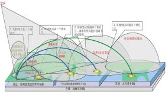
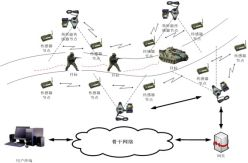
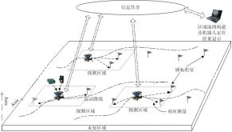
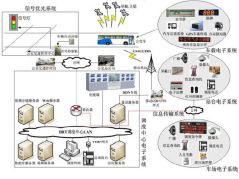
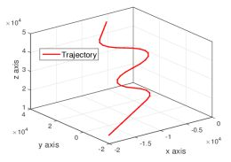
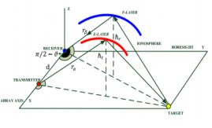
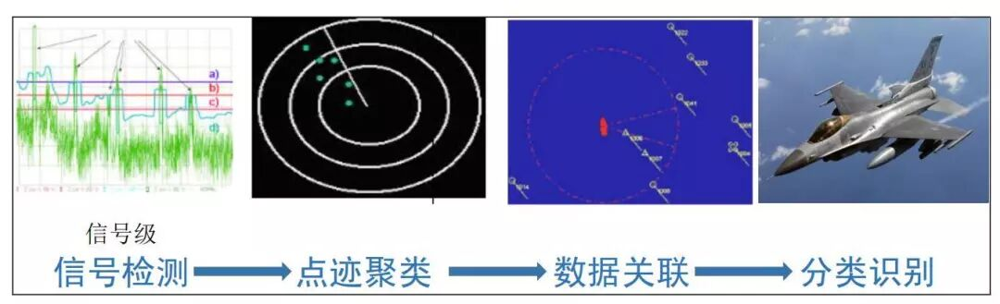
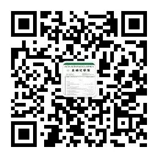

# 西北工业大学潘泉教授等：信息融合理论研究进展：基于变分贝叶斯的联合优化

原创 自动化学报 2019-08-08 09:06 北京

> 原文地址: [https://mp.weixin.qq.com/s/TUDRvMdroDnM4XYwbB8QmA](https://mp.weixin.qq.com/s/TUDRvMdroDnM4XYwbB8QmA)

  

  

信息融合技术以各类软/硬传感器为基础，通过数学方法和技术工具对获取的多源信息进行关联、估计和融合，以实现目标系统的协调优化和综合处理的目的。经过20世纪80年代初直到现在的持续研究高潮，信息融合理论和技术进一步得到了飞速发展，信息融合逐渐作为一门独立学科被成功应用于军事指挥自动化、战略预警与防御、多目标跟踪与识别和精确制导武器等军事领域，并逐渐辐射到智能交通、遥感监测、医学诊断、电子商务、人工智能、无线通信和工业过程监控与故障诊断等众多民用领域。

  

潘泉, 胡玉梅, 兰华, 孙帅, 王增福, 杨峰. 信息融合理论研究进展:基于变分贝叶斯的联合优化. 自动化学报, 2019, 45(7): 1207-1223.

  

图1美国战略预警系统

  

图2 无线传感器网络

  

图3多机器人系统协同探测与处理

  

图4智能交通系统

  

信息融合本身是一种形式框架，本质是多元变量的估计与决策。以信息融合技术为基础的目标跟踪系统越来越多地涉及到信号处理，统计估计与推理，机器学习，大数据等多领域，并且不断地遇到多种不确定问题，例如：

  

1) 系统非线性、非高斯问题需要更优的近似解决方案；

2) 系统参数未知、运动模型和量测模型多模式问题需要设计准确的辨识优化框架；

3) 目标状态、模型参数、数据关联参数等多个变量未知引发的高维数、深耦合问题需要考虑建立状态估计与参数辨识之间的解耦与反馈机制。

  

图5非线性、多模式的目标运动

  

图6多模式、参数未知的量测系统

  

在复杂应用背景的多种不确定因素条件下，上述问题可能多种组合相伴相生，相互耦合。传统的分而治之的序贯处理方式往往存在以下缺点：开环结构，鲁棒性能差；信息利用率低，难以应对耦合问题；容易造成误差传播累积。

  

图7传统信息处理的序贯结构示意图

  

面对上述问题，如何实现对目标运动状态的精确估计、模型参数的准确辨识以及高维、耦合变量的近似解耦等问题的综合处理，以获得目标跟踪性能的整体改善？

  

联合优化处理方式的目标就是解决一个连续/离散混合系统的估计和辨识问题，包括连续变量的系统状态与未知扰动输入估计和隐变量参数空间下多离散变量辨识的总和。然而，由于上述非线性、多模式、参数未知、高维数和耦合等问题的存在，在最优贝叶斯估计意义下，连续的后验概率密度函数的积分难以获得解析解，离散变量的边缘化包括对隐变量所有可能的排列求和，可能导致计算量以指数形式增长，以至难以在实际中准确计算。 

  

期望最大化(EM)方法和变分贝叶斯(VB)方法的迭代处理框架恰好与目标跟踪中的估计与辨识问题相契合，便于在非线性状态估计与参数辨识之间建立闭环反馈回路，并解决估计与辨识间的耦合问题。EM对于高维复杂分布下的隐变量估计问题，在很多情况下E步都无法得到对隐变量统计信息的解析解。VB方法是一种采用简单分布近似隐变量真实后验分布的推断方法，与EM方法的不同之处在于，在VB中未知参数被看作是服从一定分布的随机变量。其特有的以下优势为复杂系统中的联合优化问题提供了解决途径：

  

① 便于构建未知参数/状态估计与辨识的联合优化处理框架，建立状态与未知参数间信息交互回路，实现全局求解与优化；

② 能够通过平均场分解将高维问题转化为多个低维求解问题，降低计算复杂度；

③ 闭环迭代的处理结构，有效处理耦合问题，充分挖掘原始信息；

④ 由于置信下界(Evidence Lower Bound，ELBO)对于每个隐变量是凸的，因此具有迭代收敛特性；

⑤ 便于结合坐标上升、随机优化等优化方法，提高参数/状态估计精度。

  

论文着重介绍了变分贝叶斯辨识、估计和优化的统一框架和以其为基础的目标跟踪联合一体优化方法，并以天波超视距雷达为应用背景，给出在多路径多模式多目标跟踪场景下算法的一般性描述。最后，讨论了变分贝叶斯理论在目标跟踪领域的开放问题和未来研究方向。

  

**作者简介**

潘泉, 西北工业大学自动化学院教授, 信息融合技术教育部重点实验室主任. 主要研究方向：信息融合理论及应用、目标跟踪与识别技术、光谱成像及图像处理.

E-mail: quanpan@nwpu.edu.cn

胡玉梅, 西北工业大学自动化学院博士研究生. 主要研究方向: 信息融合理论及应用、目标跟踪与联合优化.  

E-mail: hym\_henu@163.com

兰华, 西北工业大学自动化学院讲师. 主要研究方向: 目标跟踪、信息融合、变分推理. 

E-mail: lanhua@nwpu.edu.cn

孙帅, 墨尔本皇家理工大学博士研究生. 主要研究方向: 多目标跟踪、变分贝叶斯推理. 

E-mail: shuai.sun@student.rmit.edu.au

王增福, 西北工业大学自动化学院副教授. 主要研究方向: 信息融合理论与目标跟踪、 传感器管理、组合优化. 

E-mail: wangzengfu@gmail.com

杨峰, 西北工业大学自动化学院副教授. 主要研究方向为多源信息融合、 目标跟踪、 雷达数据处理. 

E-mail: yangfeng@nwpu.edu.cn

自动化

学报

**信息物理融合系统理论与应用专刊**

[信息物理融合系统理论与应用专刊序言](http://mp.weixin.qq.com/s?__biz=MzAwMzAzMDgxOA==&mid=2651064291&idx=1&sn=4da1e829cb5a537b55dfb6cba8cb3c3d&chksm=8131cdaeb64644b878bf01b39d1a0ca987534b51b11ad7731cac3244dadbb3d36be3ec22cc0c&scene=21#wechat_redirect)

[工业网络系统的感知-传输-控制一体化:挑战和进展](http://mp.weixin.qq.com/s?__biz=MzAwMzAzMDgxOA==&mid=2651064296&idx=1&sn=af7524600c45518a394580467c4904e0&chksm=8131cda5b64644b3256cdab623b7659847c9762f3c726b3e23b53a07f5fe5ddbd946f3f9aef0&scene=21#wechat_redirect)  

[信息物理系统技术综述](http://mp.weixin.qq.com/s?__biz=MzAwMzAzMDgxOA==&mid=2651064319&idx=1&sn=b6a9e44bab786498fddb75b5f6bbe1eb&chksm=8131cdb2b64644a49e2329de3a8721e5eb860d058563e038876316151cbebe7b61904028b862&scene=21#wechat_redirect)  

[多时空尺度的风力发电预测方法综述](http://mp.weixin.qq.com/s?__biz=MzAwMzAzMDgxOA==&mid=2651064323&idx=1&sn=fd00093932e56ef5f4f2e38dbc0b29e2&chksm=8131c24eb6464b58d305023f3faa393cb94fb89b5e5aeccfd23f37697521e916069594b29b9a&scene=21#wechat_redirect)  

[面向电力信息物理系统的虚假数据注入攻击研究综述](http://mp.weixin.qq.com/s?__biz=MzAwMzAzMDgxOA==&mid=2651064332&idx=1&sn=69371ccf017fd66a309407e580c4470a&chksm=8131c241b6464b57e1f6aee6b1690e56ed93ed0bf7c80e912336976954922cabcd7f8f964a69&scene=21#wechat_redirect)  

[信息物理融合的智慧能源系统多级对等协同优化](http://mp.weixin.qq.com/s?__biz=MzAwMzAzMDgxOA==&mid=2651064339&idx=1&sn=00ba84e37be296a07f02ccec9ee7bda0&chksm=8131c25eb6464b48eb09906290aa2dd9488c8b72c3ab4ac14f84c783294e06a9ec762ccdb6b2&scene=21#wechat_redirect)  

[基于贝叶斯序贯博弈模型的智能电网信息物理安全分析](http://mp.weixin.qq.com/s?__biz=MzAwMzAzMDgxOA==&mid=2651064352&idx=1&sn=3ee773694ee5d8d7db714003997b4ce0&chksm=8131c26db6464b7b15122d1950b27cf4cba93996afff47290267250913c8f730bc8e2732b272&scene=21#wechat_redirect)  

[网络攻击下信息物理融合电力系统的弹性事件触发控制](http://mp.weixin.qq.com/s?__biz=MzAwMzAzMDgxOA==&mid=2651064381&idx=1&sn=cdfd94ee2f6962583c79fc39e328b7f9&chksm=8131c270b6464b66d903a73118f04dcb54bb263409f49635cfc306fba7e98af3b899a6f31255&scene=21#wechat_redirect)  

[拒绝服务攻击下基于UKF的智能电网动态状态估计研究](http://mp.weixin.qq.com/s?__biz=MzAwMzAzMDgxOA==&mid=2651064388&idx=1&sn=b64eb668c35b5237272102ba10afc028&chksm=8131c209b6464b1f97c38301a9ee3905b390267216f96792c0db3fbcb75d5103077c8c03f724&scene=21#wechat_redirect)  

[智能交通信息物理融合云控制系统](http://mp.weixin.qq.com/s?__biz=MzAwMzAzMDgxOA==&mid=2651064393&idx=1&sn=0039e3cb167520c5492cee3b17918184&chksm=8131c204b6464b12c92da88f7ea33b88a8c63fc37883f6d0d9a6b00a04c76e01f88a76920394&scene=21#wechat_redirect)  

[东北大学郭戈教授等：交通信息物理系统中的车辆协同运行优化调度](http://mp.weixin.qq.com/s?__biz=MzAwMzAzMDgxOA==&mid=2651064404&idx=1&sn=803628dc5b258cd6a76ac7ff6b94ecad&chksm=8131c219b6464b0f553affb02ef8b0cbb4a342946f8ead11e94f4e8489d02926c5401b9c1029&scene=21#wechat_redirect)  

[北交唐涛教授等：基于二维结构熵的CBTC系统信息安全风险评估方法](http://mp.weixin.qq.com/s?__biz=MzAwMzAzMDgxOA==&mid=2651064409&idx=1&sn=cd24c6fa49d24e4f082104eba0666e75&chksm=8131c214b6464b027ce79d3a8813760512098a3dea1ed80195cffbbbb787b475196ce4e56c44&scene=21#wechat_redirect)  

[东北大学孙秋野教授等：基于数据特征融合的管网信息物理异常诊断方法](http://mp.weixin.qq.com/s?__biz=MzAwMzAzMDgxOA==&mid=2651064414&idx=1&sn=517e101f507825ed0fcd9b7c9c70d148&chksm=8131c213b6464b05a7b06f2439e9281905c193352e34101dc207f63330ac642a7ff543abd586&scene=21#wechat_redirect)  

[重庆大学宋永端教授等：受攻击信息物理系统的分布式安全状态估计与控制——一种有限时间方法](http://mp.weixin.qq.com/s?__biz=MzAwMzAzMDgxOA==&mid=2651064429&idx=1&sn=e1a8f6699982fba0786487125b7624fd&chksm=8131c220b6464b36734290d9ab62cfdd3f4a996737439518c61487dc3d72682a05a76163cb92&scene=21#wechat_redirect)  

[大连理工夏浩教授等：基于博弈论的信息物理融合系统安全控制](http://mp.weixin.qq.com/s?__biz=MzAwMzAzMDgxOA==&mid=2651064438&idx=1&sn=33c2fd05cdfb6513bed429e1ccee0828&chksm=8131c23bb6464b2d6acede9f2c16374d58ac7e2967a5eb571a4a98635d4915b50f55b6276291&scene=21#wechat_redirect)  

[西安交通大学彭勤科教授等：假数据注入攻击下信息物理融合系统的稳定性研究](http://mp.weixin.qq.com/s?__biz=MzAwMzAzMDgxOA==&mid=2651064449&idx=1&sn=cf19ea9877b91f31fa451345cf447cbe&chksm=8131c2ccb6464bda7865bcaee8a6d0a42961f3adc6c1e64cc30e6323854bbed6d266f565b3b7&scene=21#wechat_redirect)  

  

**自动化科学与技术未来发展专刊**

[自动化科学与技术未来发展专刊](http://mp.weixin.qq.com/s?__biz=MzAwMzAzMDgxOA==&mid=2651064147&idx=1&sn=327b3991ea3e77cbcf4d980323c7f82a&chksm=8131cd1eb64644083d7138ddf86b40542952eed2bb5bc1422e1f36ec54d4603a1ccf231fc6ef&scene=21#wechat_redirect)  

[陈杰院士等：自动化科学与技术未来发展专刊序言](http://mp.weixin.qq.com/s?__biz=MzAwMzAzMDgxOA==&mid=2651064125&idx=1&sn=719f1a79512837b53e30b629a71cb13c&chksm=8131cd70b64644668547da0629266b323cc8eb363958689b74964fe4451f1c6d2033a6e0d8ba&scene=21#wechat_redirect)  

[柴天佑院士：自动化科学与技术发展方向](http://mp.weixin.qq.com/s?__biz=MzAwMzAzMDgxOA==&mid=2651064125&idx=2&sn=a21645cfef86f1fe6892ca9b69683865&chksm=8131cd70b6464466988712c4ac5ef9b7e4f8aee6414de2dc56a14f61f08fecbbe03ef048e4c5&scene=21#wechat_redirect)  

[东北大学丁进良教授等：复杂工业过程智能优化决策系统的现状与展望](http://mp.weixin.qq.com/s?__biz=MzAwMzAzMDgxOA==&mid=2651064151&idx=1&sn=2c6b2ef1a6178d340d8b10083699c62c&chksm=8131cd1ab646440cb51478ad8d204a9dc6c1450a09340a10333eef2c55ae88e0163a6ea99c53&scene=21#wechat_redirect)  

[美国南加州大学秦泗钊教授等：数据驱动的工业过程运行监控与自优化研究展望](http://mp.weixin.qq.com/s?__biz=MzAwMzAzMDgxOA==&mid=2651064163&idx=1&sn=edd98909d12c4ebaae5222a64b79440e&chksm=8131cd2eb64644384d2d7d3fce1edf2debdd8328ac63262e2d698a3f0192a6c91c898ba28f49&scene=21#wechat_redirect)  

[桂卫华院士等：铝电解生产智能优化制造研究综述](http://mp.weixin.qq.com/s?__biz=MzAwMzAzMDgxOA==&mid=2651064156&idx=1&sn=657a5cfaca9a69ab7d630bd3f949ae4d&chksm=8131cd11b64644070005198101ade827f94912bd46c6a2b3d1d2ec50e42cfea45d2c7105b5ee&scene=21#wechat_redirect)  

[北工大乔俊飞教授等：城市污水处理过程异常工况识别和抑制研究](http://mp.weixin.qq.com/s?__biz=MzAwMzAzMDgxOA==&mid=2651064167&idx=1&sn=7acd6f8fddecb189d52dfced142b3758&chksm=8131cd2ab646443ce7791a9c38f40e5cebe15018442874148e216580934b32508f7cfab28b2f&scene=21#wechat_redirect)

[北理孙健教授、邓方教授和陈杰院士：陆用运动体控制系统发展现状与趋势](http://mp.weixin.qq.com/s?__biz=MzAwMzAzMDgxOA==&mid=2651064172&idx=1&sn=de6c39a807bc6cf3c86ed92691f2e74a&chksm=8131cd21b64644371c7382e9f44d84a777e616956035af1926bbf63d233dce4243d9d20096a2&scene=21#wechat_redirect)  

[中科院自动化所侯增广研究员等：康复辅助机器人及其物理人机交互方法](http://mp.weixin.qq.com/s?__biz=MzAwMzAzMDgxOA==&mid=2651064187&idx=1&sn=5d397da5ebb4c31840db0043b85580f8&chksm=8131cd36b64644203ab4079f881b673207b0896f587a22abdada7f3e64882b8cf44639631a0e&scene=21#wechat_redirect)

  

**生成式对抗网络GAN技术与应用专刊**

[生成式对抗网络：从生成数据到创造智能](http://mp.weixin.qq.com/s?__biz=MzAwMzAzMDgxOA==&mid=2651063870&idx=1&sn=1e1d7562a4bbe4c31e2fdef4859c0bc4&chksm=8131cc73b6464565d9419524cd87b4bbe363384f0ba722017e91a49af4640d349403ea9a0ea6&scene=21#wechat_redirect)  

[人工智能研究的新前线：生成式对抗网络](http://mp.weixin.qq.com/s?__biz=MzAwMzAzMDgxOA==&mid=2651063920&idx=1&sn=9094936d46b4bab696df49c408fa1656&chksm=8131cc3db646452b0cba9ebdee9672b9ae010166a941ef19d5972616235193048a3346cf54f0&scene=21#wechat_redirect)  

[一种能量函数意义下的生成式对抗网络](http://mp.weixin.qq.com/s?__biz=MzAwMzAzMDgxOA==&mid=2651063930&idx=1&sn=8fc4569fbc51adb78002a6c492a7b58f&chksm=8131cc37b646452180ad8b4be28b69e9e1767c94cf2bf8b712074d8b26e72fffd95146d9fac5&scene=21#wechat_redirect)  

[协作式生成对抗网络](http://mp.weixin.qq.com/s?__biz=MzAwMzAzMDgxOA==&mid=2651063937&idx=1&sn=b3bb0ca500fa6f1e5b2d4fdc476187ed&chksm=8131ccccb64645daca101424f49facb82039d857908b8467fc5033a3b254fc348376128fef89&scene=21#wechat_redirect)  

[融合对抗学习的因果关系抽取](http://mp.weixin.qq.com/s?__biz=MzAwMzAzMDgxOA==&mid=2651063950&idx=1&sn=073948b72538b1547399cd7d3ba0b847&chksm=8131ccc3b64645d5c3c82fb7baa62c0cd2644c19f626a6a0904b6223bf155b8e77045006815a&scene=21#wechat_redirect)  

[基于生成对抗网络的多视图学习与重构算法](http://mp.weixin.qq.com/s?__biz=MzAwMzAzMDgxOA==&mid=2651063957&idx=1&sn=19964ffc71d7cb689887517b5d1bec12&chksm=8131ccd8b64645cee6db75a3910ee76a1bf2dab99af617044cfc2210d106ebc8c5eb7c88f7ba&scene=21#wechat_redirect)  

[基于生成对抗网络的低秩图像生成方法](http://mp.weixin.qq.com/s?__biz=MzAwMzAzMDgxOA==&mid=2651063961&idx=1&sn=8d6567b1750f5aa499007f17bed8e92b&chksm=8131ccd4b64645c2a898492cbb2eb4ed8272b4234bd1a08da279f17d6eb9884e0d4ace8f062c&scene=21#wechat_redirect)  

[基于条件深度卷积生成对抗网络的图像识别方法](http://mp.weixin.qq.com/s?__biz=MzAwMzAzMDgxOA==&mid=2651063972&idx=1&sn=b8bf8ae85b62f83e74d50f086ff6bc04&chksm=8131cce9b64645ff1ce4a10e6482d74876c664917a3ee821c11a72693cee3af1360b88d6fffe&scene=21#wechat_redirect)  

[基于生成式对抗网络的鲁棒人脸表情识别](http://mp.weixin.qq.com/s?__biz=MzAwMzAzMDgxOA==&mid=2651063980&idx=1&sn=ee5a109bc89e6b59dcf0db6359438be1&chksm=8131cce1b64645f7d5c0153e2fc3703abc37bc4edb3fc668efc90fd7433599ef40dcaa94e238&scene=21#wechat_redirect)  

[基于对抗训练策略的语言模型数据增强技术](http://mp.weixin.qq.com/s?__biz=MzAwMzAzMDgxOA==&mid=2651063984&idx=1&sn=6092ba309457e2810275069f4dfcef80&chksm=8131ccfdb64645ebb732eccf9f0fb0a81615f92a321d233837e60534ffaca0a352e6d81c97e5&scene=21#wechat_redirect)

[基于GAN技术的自能源混合建模与参数辨识方法-自能源，一场“草根能源”的盛宴](http://mp.weixin.qq.com/s?__biz=MzAwMzAzMDgxOA==&mid=2651063988&idx=1&sn=7c506b7a5c161d7c7b302a17ea28a097&chksm=8131ccf9b64645ef252f6078efb02f067d99a4d4d3cf020dfe8d21f85fb512835931dc11fbd7&scene=21#wechat_redirect)

[基于位错理论的距离正则化水平集图像分割算法](http://mp.weixin.qq.com/s?__biz=MzAwMzAzMDgxOA==&mid=2651063994&idx=1&sn=6e6e13de682aecbea7fec4ebbd4e4316&chksm=8131ccf7b64645e1c36dce0c5ba1a70ffcbf2f2ea25cc920c7ee6315227610c205029b5e0f67&scene=21#wechat_redirect)

[异质依存网络衰退特征与关键节点辨识](http://mp.weixin.qq.com/s?__biz=MzAwMzAzMDgxOA==&mid=2651064002&idx=1&sn=6b560d52462a2c2958004fb2e701d2c1&chksm=8131cc8fb6464599f19c7d08ce7a86b1638ad2542c79c16e178db90bee226be9c182cfba21cb&scene=21#wechat_redirect)

欢迎扫描二维码、长按图片识别关注《自动化学报》中文版订阅号aas1963，服务号自动化学报和英文版服务号！

JAS《自动化学报》（英文版）

自动化学报服务号

自动化学报订阅号

  

联系我们

Tel:  010-82544653（日常咨询和稿件处理） 

        010-82544677（录用后稿件处理）

Fax: 010-82544497

Email: aas@ia.ac.cn（日常咨询和稿件处理）

          aas\_editor@ia.ac.cn（录用后稿件处理）

http://www.aas.net.cn

点

这里“阅读原文”，查看更多