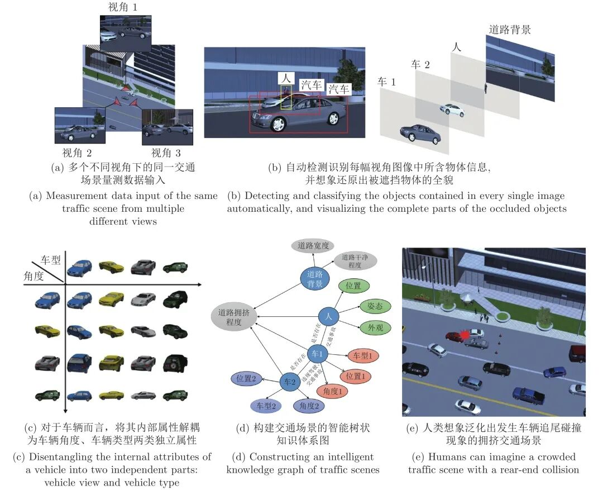
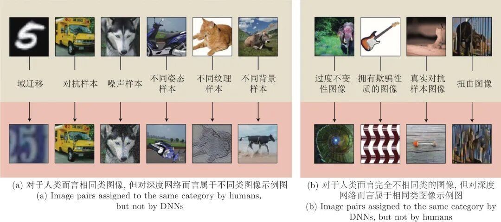
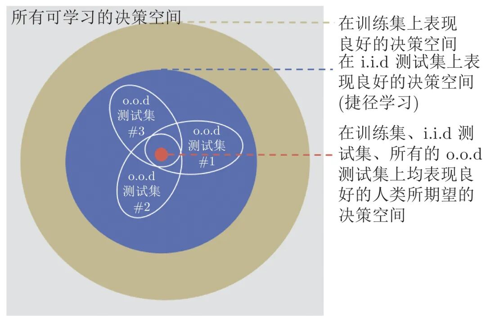
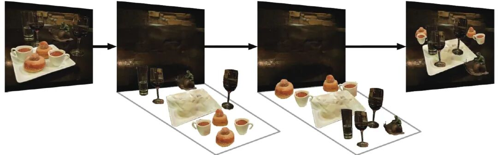
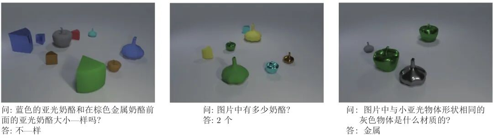
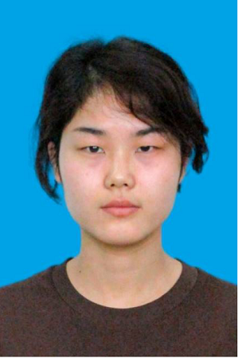

# 解耦表征学习综述

原创 自动化学报 自动化学报 2022-02-14 17:14 北京

> 原文地址: [https://mp.weixin.qq.com/s/Fa1xo62YdZdufDU1U3bYfg](https://mp.weixin.qq.com/s/Fa1xo62YdZdufDU1U3bYfg)

点击蓝字

关注我们

  

推荐一篇**解耦表征学习**方面的文章，希望您能喜欢！欢迎已经优先出版的作者给小编提供资料（请您向编辑部索要推送模板aaswkfb@ia.ac.cn），及时发布在我们的公众号上宣传。

  

**引用本文**

文载道, 王佳蕊, 王小旭, 潘泉. 解耦表征学习综述. 自动化学报, 2022, 48(2): 351−374 doi: 10.16383/j.aas.c210096

(Wen Zai-Dao, Wang Jia-Rui, Wang Xiao-Xu, Pan Quan. A review of disentangled representation learning. Acta Automatica Sinica, 2022, 48(2): 351−374 doi: 10.16383/j.aas.c210096)

http://www.aas.net.cn/cn/article/doi/10.16383/j.aas.c210096?viewType=HTML

  

**文章简介**

  

**关键词**

  

深度学习, 捷径学习, 潜在生成因子, 智能感知, 解耦表征学习

  

**摘   要**

  

在大数据时代下, 以高效自主隐式特征提取能力闻名的深度学习引发了新一代人工智能的热潮, 然而其背后黑箱不可解释的“捷径学习”现象成为制约其进一步发展的关键性瓶颈问题. 解耦表征学习通过探索大数据内部蕴含的物理机制和逻辑关系复杂性, 从数据生成的角度解耦数据内部多层次、多尺度的潜在生成因子, 促使深度网络模型学会像人类一样对数据进行自主智能感知, 逐渐成为新一代基于复杂性的可解释深度学习领域内重要研究方向, 具有重大的理论意义和应用价值. 本文系统地综述了解耦表征学习的研究进展, 对当前解耦表征学习中的关键技术及典型方法进行了分类阐述, 分析并汇总了现有各类算法的适用场景并对此进行了可视化实验性能展示, 最后指明了解耦表征学习今后的发展趋势以及未来值得研究的方向.

  

**引   言**

  

自动化系统, 大到复杂的自动驾驶、飞行控制等运动系统, 小到人脸图像识别、行人流量检测、视频跟踪监控等图像/视频解译系统, 均在国家重大生产、生活与管理进程中起到了不可替代的作用. 随着人工智能技术最近几年的迅速发展, 采集数据的自动、精准智能感知对整个系统的智能辨识与控制预测能力至关重要, 备受研究者的广泛关注.

  

人类作为目前最为智能的生物系统, 能够通过各类生物传感器(眼睛、鼻子、耳朵等)接收周围环境的视觉、嗅觉、听觉等数据信号, 并将这些数据送入大脑进行融合处理, 挖掘出数据内部隐含的各类有效信息, 通过持续性学习将其汇总为简单的语义属性, 形成概念, 建立起抽象的逻辑关联规则, 最终结合自身具备的常识形成完整知识体系, 实现对各类复杂环境的智能化感知. 例如, 将图1 (a)中从不同视角下拍摄得到的三幅不同交通图像作为视觉数据输入到人眼中, 人类便能够自主完成如下的层次化数据智能感知:

  

图 1  人类对于交通场景量测数据的层次化智能感知示意图

  

1) 检测并识别出图像中不同姿态、不同风格的物体, 并具有抗遮挡能力, 能够毫不费力地想象还原出被遮挡物体的全貌, 如图1 (b)所示;

  

2) 能够全面有效剖析出每类物体的各个内在属性并对该类物体进行全方位想象关联. 例如对于图1 (c)中的车辆而言, 假设将其内在属性认知为车型、角度两类, 人类便可按照这两类属性对已有图像进行相应的分组关联, 并能够通过组合不同的属性值想象出并未见过的车辆图像. 如此, 面对存在车辆的各类未知新场景, 人类能够不受大差异性视角或新型车辆的影响, 检测并识别出各类不同的车辆, 并能够精确推理出每辆车的内在属性值;

  

3) 能够结合一些常识推理(例如两辆车相对位置过近或人躺在车辆行驶正中间的马路上时往往代表着交通事故的发生)构建出代表不同对象间交互关系的树状知识体系图, 如图1 (d)所示. 利用该知识体系图, 人类能够通过对知识的改造重组想象泛化出各类符合因果逻辑关系的新场景, 例如图1 (e)中道路拥堵状态下的交通事故新场景. 该能力有助于人类对各类复杂场景进行因果知识关系梳理与认知更新, 从而轻松完成类似智能知识问答等复杂图像理解任务.

  

为了使现有系统真正实现对数据的自主智能感知, 借鉴人类这种层次化数据智能感知思想, 构建从数据、信息、语义、规则再到知识的多尺度、多层次、具有可解释性的数据表征至关重要.

  

传统模式识别主要依据特定领域的专家经验知识进行显式的特征设计与推理, 从而完成相应任务. 随着误差反向传播(Back propagation, BP)人工神经网络的提出, 将传统专家知识驱动的显式特征提取方法替换为复杂数据驱动的神经网络隐式特征提取方法逐渐引起了学术界的关注. 尤其在Hinton等提出以深度神经网络为代表的深度学习技术后, 相关以深度学习为主的隐式特征提取理论开始蓬勃发展, 逐渐在语音识别、自然语言处理、人脸识别、目标检测等领域取得突破性进展. 截至目前, 深度学习技术已被广泛应用于多种复杂非线性系统的预测任务中. 这类以提升特定预测任务性能指标为目的的判别式深度学习算法通过堆叠多层神经网络来构建从原始的输入数据到最终预测目标(如物体类别、位置、姿态等)的端到端非线性映射函数, 使机器能够从数据中自适应地进行学习, 有效缓解传统模式识别中手工设计选择显式特征的繁琐低效问题.

  

然而现有以有监督深度网络为代表的端到端黑箱判别式学习方法是一种捷径学习(Shortcut learning)策略, 即网络学习得到的判别性隐式抽象特征往往没有朝着人类所期望的方向进行泛化. 如图2所示, 对于图2 (a)中所显示的人类所具有的泛化能力并未被网络所学到. 与此相反, 在图2 (b)中, 网络学习得到的泛化能力又不能为人类所理解. 发生这种现象的本质原因在于现有判别式网络做出决策的评判标准仅仅为了提高训练样本数据的预测准确性. 在这种评判标准下, 网络会自主选择一条最容易、最精准地对训练集拟合的方向进行学习, 而这一方向并不一定是人类所期望网络学习的方向. 如图3所示, 网络学到得是所有决策空间中在训练集上展现出良好性能的一部分决策, 在这一部分决策内, 仅有一小部分决策能够泛化到服从独立同分布特性(Independent and identically distributed, i.i.d) 的测试集上, 即图3中的蓝色区域. 然而人类真正期望网络做出的决策不仅能够泛化到i.i.d测试集上, 而且能够泛化到其余该分布以外(Out-of-distribution, o.o.d)的测试集中, 即图3中的红色区域部分. 现有大多数判别式网络仅旨在寻找蓝色区域内适应于i.i.d测试集的决策空间, 难以自主学到同时适应于o.o.d数据集的红色区域决策空间. 例如图2 (a)中, 当网络学习判断图像类别是否为猫时, 很容易聚焦于图像的纹理特征, 而忽略整体的形状特征, 这使得一幅具有猫的形状、大象纹理的图像会被网络判定为大象而不是猫; 又如图2 (b)中, 网络对于一把吉他类别的判断可能仅在于评判其是否具有弯曲的纹理与线段等, 这使得该网络很容易将人类认为明显不是吉他的图像判定为吉他. 因此现有深度网络经常因为稳定性差、可解释性弱、易受欺骗攻击等饱受诟病.

  

图 2  深度网络的捷径学习(Shortcut learning)现象示例图

  

图 3  决策空间示意图

  

为了缓解上述问题, 对网络学习方向施加一定的归纳偏好约束, 促使网络挖掘数据中所蕴含的常识推理与因果逻辑关系\[28-31\], 将有助于网络像人类一样学习从数据到信息到语义到规则再到知识的多尺度、多层次化数据表征. 基于此, 结合认知科学原理和视觉信息处理机制的解耦表征学习逐渐成为深度学习领域重要的研究方向\[32-36\]. 解耦表征学习旨在按照人类能够理解的方式从真实数据中对具有明确物理含义的生成因子(如类别、位置、外观、纹理等)进行解耦, 并给出其所对应的独立潜在表示, 引起国内外大量学者的广泛关注.

  

鉴于解耦表征学习深刻的理论意义, 所蕴含的应用价值以及可观的发展潜力, 本文对解耦表征学习的研究进展进行了系统性的综述, 为进一步深入研究解耦表征学习机制、开发解耦表征学习应用潜力确立了良好的基础. 文中第1节对解耦表征学习基本概念、发展历史等进行了概述; 第2节着重介绍了从非结构化表征先验正则角度分析解耦表征学习最初的几种典型解决思路; 第3节则从结构化模型先验归纳偏好的角度挖掘模型架构设计对于现有解耦表征学习的启发; 第4节结合实际数据中所蕴含的物理知识对现有解耦表征学习研究进行进一步深入探索; 第5节则对前三节的模型算法进行对比分析论证. 最后, 在第6节指出了解耦表征学习未来的可能发展方向并对全文进行总结.

  

图 11  人类想象泛化能力示意图

  

图 22  文献\[98\]所提方法应用在CLEVR\[128\]数据集上的智能知识问答实验结果图

  

请点击左下角“**阅读原文**”了解更多！

  

**作者简介**

**文载道**

西北工业大学自动化学院副教授. 主要研究方向为压缩感知与稀疏模型, 认知机器学习, 合成孔径雷达图像解译, 多源自主目标识别.

E-mail: wenzaidao@nwpu.edu.cn

**王佳蕊**

西北工业大学自动化学院博士研究生. 主要研究方向为解耦表征学习, SAR 图像处理, 因果推理. 

E-mail: wangjiarui\_wyy163@163.com

**王小旭**

西北工业大学自动化学院教授. 主要研究方向为惯性器件与惯性导航, 合成孔径雷达图像解译, 协同感知. 本文通信作者. 

E-mail: woyaofly1982@163.com

**潘　泉**

西北工业大学自动化学院教授. 主要研究方向为信息融合理论及应用, 目标跟踪与识别技术, 光谱成像及图像处理. 

E-mail: quanpan@nwpu.edu.cn

  

**相关文章**

  

**（请向上滑动阅读）**

  

\[1\]  王晓峰, 杨亚东. 基于生态演化的通用智能系统结构模型研究. 自动化学报, 2020, 46(5): 1017−1030. doi: 10.16383/j.aas.c170679

http://www.aas.net.cn/cn/article/doi/10.16383/j.aas.c170679?viewType=HTML

  

\[2\]  蒋弘毅, 王永娟, 康锦煜. 目标检测模型及其优化方法综述. 自动化学报, 2021, 47(6): 1232−1255.  doi: 10.16383/j.aas.c190756

http://www.aas.net.cn/cn/article/doi/10.16383/j.aas.c190756?viewType=HTML

  

\[3\]  何星辰, 郭勇, 李奇龙, 高唱. 基于深度学习的抗年龄干扰人脸识别. 自动化学报, 2022, 48(3): 1−10 doi: 10.16383/j.aas.c190256

http://www.aas.net.cn/cn/article/doi/10.16383/j.aas.c190256?viewType=HTML

  

\[4\]  林文瑞, 丛爽. 基于深度学习LDAMP网络的量子状态估计. 自动化学报, 2021, x(x): 1−12 doi: 10.16383/j.aas.c210156

http://www.aas.net.cn/cn/article/doi/10.16383/j.aas.c210156?viewType=HTML

  

\[5\]  陶显, 侯伟, 徐德. 基于深度学习的表面缺陷检测方法综述. 自动化学报, 2021, 47(5): 1017-1034. doi: 10.16383/j.aas.c190811

http://www.aas.net.cn/cn/article/doi/10.16383/j.aas.c190811?viewType=HTML

  

\[6\]  范家伟, 张如如, 陆萌, 何佳雯, 康霄阳, 柴文俊, 石珅达, 宋美娜, 鄂海红, 欧中洪. 深度学习方法在糖尿病视网膜病变诊断中的应用. 自动化学报, 2021, 47(5): 985-1004. doi: 10.16383/j.aas.c190069

http://www.aas.net.cn/cn/article/doi/10.16383/j.aas.c190069?viewType=HTML

  

\[7\]  盖杉, 鲍中运. 基于深度学习的高噪声图像去噪算法. 自动化学报, 2020, 46(12): 2672-2680. doi: 10.16383/j.aas.c180271

http://www.aas.net.cn/cn/article/doi/10.16383/j.aas.c180271?viewType=HTML

  

\[8\]  侯建华, 张国帅, 项俊. 基于深度学习的多目标跟踪关联模型设计. 自动化学报, 2020, 46(12): 2690-2700. doi: 10.16383/j.aas.c180528

http://www.aas.net.cn/cn/article/doi/10.16383/j.aas.c180528?viewType=HTML

  

\[9\]  许玉格, 钟铭, 吴宗泽, 任志刚, 刘伟生. 基于深度学习的纹理布匹瑕疵检测方法. 自动化学报. doi: 10.16383/j.aas.c200148

http://www.aas.net.cn/cn/article/doi/10.16383/j.aas.c200148?viewType=HTML

  

\[10\]  梁星星, 冯旸赫, 马扬, 程光权, 黄金才, 王琦, 周玉珍, 刘忠. 多Agent深度强化学习综述. 自动化学报, 2020, 46(12): 2537-2557. doi: 10.16383/j.aas.c180372

http://www.aas.net.cn/cn/article/doi/10.16383/j.aas.c180372?viewType=HTML

  

\[11\]  李良福, 马卫飞, 李丽, 陆铖. 基于深度学习的桥梁裂缝检测算法研究. 自动化学报, 2019, 45(9): 1727-1742. doi: 10.16383/j.aas.2018.c170052

http://www.aas.net.cn/cn/article/doi/10.16383/j.aas.2018.c170052?viewType=HTML

  

\[12\]  罗浩, 姜伟, 范星, 张思朋. 基于深度学习的行人重识别研究进展. 自动化学报, 2019, 45(11): 2032-2049. doi: 10.16383/j.aas.c180154

http://www.aas.net.cn/cn/article/doi/10.16383/j.aas.c180154?viewType=HTML

  

\[13\]  田娟秀, 刘国才, 谷珊珊, 鞠忠建, 刘劲光, 顾冬冬. 医学图像分析深度学习方法研究与挑战. 自动化学报, 2018, 44(3): 401-424. doi: 10.16383/j.aas.2018.c170153

http://www.aas.net.cn/cn/article/doi/10.16383/j.aas.2018.c170153?viewType=HTML

  

\[14\]  李敏, 禹龙, 田生伟, 吐尔根·依布拉音, 赵建国. 基于深度学习的维吾尔语名词短语指代消解. 自动化学报, 2017, 43(11): 1984-1992. doi: 10.16383/j.aas.2017.c160330

http://www.aas.net.cn/cn/article/doi/10.16383/j.aas.2017.c160330?viewType=HTML

  

\[15\]  张慧, 王坤峰, 王飞跃. 深度学习在目标视觉检测中的应用进展与展望. 自动化学报, 2017, 43(8): 1289-1305. doi: 10.16383/j.aas.2017.c160822

http://www.aas.net.cn/cn/article/doi/10.16383/j.aas.2017.c160822?viewType=HTML

  

\[16\]  胡长胜, 詹曙, 吴从中. 基于深度特征学习的图像超分辨率重建. 自动化学报, 2017, 43(5): 814-821. doi: 10.16383/j.aas.2017.c150634

http://www.aas.net.cn/cn/article/doi/10.16383/j.aas.2017.c150634?viewType=HTML

  

\[17\]  陈伟宏, 安吉尧, 李仁发, 李万里. 深度学习认知计算综述. 自动化学报, 2017, 43(11): 1886-1897. doi: 10.16383/j.aas.2017.c160690

http://www.aas.net.cn/cn/article/doi/10.16383/j.aas.2017.c160690?viewType=HTML

  

\[18\]  贺昱曜, 李宝奇. 一种组合型的深度学习模型学习率策略. 自动化学报, 2016, 42(6): 953-958. doi: 10.16383/j.aas.2016.c150681

http://www.aas.net.cn/cn/article/doi/10.16383/j.aas.2016.c150681?viewType=HTML

  

\[19\]  朱煜, 赵江坤, 王逸宁, 郑兵兵. 基于深度学习的人体行为识别算法综述. 自动化学报, 2016, 42(6): 848-857. doi: 10.16383/j.aas.2016.c150710

http://www.aas.net.cn/cn/article/doi/10.16383/j.aas.2016.c150710?viewType=HTML

  

\[20\]  奚雪峰, 周国栋. 面向自然语言处理的深度学习研究. 自动化学报, 2016, 42(10): 1445-1465. doi: 10.16383/j.aas.2016.c150682

http://www.aas.net.cn/cn/article/doi/10.16383/j.aas.2016.c150682?viewType=HTML

  

\[21\]  段艳杰, 吕宜生, 张杰, 赵学亮, 王飞跃. 深度学习在控制领域的研究现状与展望. 自动化学报, 2016, 42(5): 643-654. doi: 10.16383/j.aas.2016.c160019

http://www.aas.net.cn/cn/article/doi/10.16383/j.aas.2016.c160019?viewType=HTML

  

\[22\]  郭潇逍, 李程, 梅俏竹. 深度学习在游戏中的应用. 自动化学报, 2016, 42(5): 676-684. doi: 10.16383/j.aas.2016.y000002

http://www.aas.net.cn/cn/article/doi/10.16383/j.aas.2016.y000002?viewType=HTML

  

  

**期刊目录**

[2022年第01期](http://mp.weixin.qq.com/s?__biz=MzI2NjA3MzM5MA==&mid=2649961423&idx=1&sn=3b65958faa7c7f94c247f46dd72bd71e&chksm=f294378ec5e3be9825f860d132c36c97f3e877089449cb1fe85a6d1e7da9bd0e24795336bc54&scene=21#wechat_redirect)

[《自动化学报》2021年全年合集](http://mp.weixin.qq.com/s?__biz=MzAwMzAzMDgxOA==&mid=2651072770&idx=1&sn=7c531f7fa3bc390558fab15b339ce86e&chksm=8131e34fb6466a59ed079448fddda0fc9f97066460bff8f6835288003a1fba2812de383813c1&scene=21#wechat_redirect)

[《自动化学报》2020年全年合集](http://mp.weixin.qq.com/s?__biz=MzI2NjA3MzM5MA==&mid=2649957972&idx=1&sn=1951847aacbcb7d22bdd2a46a79af871&chksm=f2942215c5e3ab03d070d8e52b8764b38036897c97b6a26c7a1f918c806b28edbe6c0fbf7ea9&scene=21#wechat_redirect)

[2020年第10期 工业人工智能专题](http://mp.weixin.qq.com/s?__biz=MzI2NjA3MzM5MA==&mid=2649957201&idx=1&sn=ab82a767bd716ab67fdf2942500d8b61&chksm=f2942710c5e3ae06b27f9e63a5e329a1123d90b051164e6b6123c500230541b1ed12d92abbfb&scene=21#wechat_redirect)

[2020年第09期 分布式信息能源系统理论与应用专题](http://mp.weixin.qq.com/s?__biz=MzI2NjA3MzM5MA==&mid=2649956412&idx=1&sn=8ebc13d63fd333ad85dbb8b5825df248&chksm=f294247dc5e3ad6ba297857a5b957e97cf499266c50318791fa8abd9432ecf1d9c3d9b287e36&scene=21#wechat_redirect)

  

**热点文章**

[《自动化学报》2021年热点文章回顾](http://mp.weixin.qq.com/s?__biz=MzAwMzAzMDgxOA==&mid=2651072577&idx=1&sn=4e6be077d7371c7d29d9a371d8defe19&chksm=8131e20cb6466b1aec2f3b8b1063d3be11725ca9a0c15785c3b42a638170e732acd0d8d345e0&scene=21#wechat_redirect)

[国家自然科学基金论文精选](http://mp.weixin.qq.com/s?__biz=MzI2NjA3MzM5MA==&mid=2649960308&idx=1&sn=1634c999f22588333537f13393403f9c&chksm=f2942b35c5e3a2232e86b51c2b7c8f37a4d3d7f858d370d76d5afd00567d7da6e9543476d120&scene=21#wechat_redirect)

[国家重点研发计划论文精选](http://mp.weixin.qq.com/s?__biz=MzI2NjA3MzM5MA==&mid=2649960255&idx=1&sn=f48435928fd924134cb72014860b9d00&chksm=f2942b7ec5e3a26869da68a1419b3b40ca1e6cb98abf2e380d78a49ffb99c85991d76cc346b0&scene=21#wechat_redirect)

[中国科学院自动化研究所高层次人才招聘启事 | 长期有效](http://mp.weixin.qq.com/s?__biz=MzI2NjA3MzM5MA==&mid=2649959451&idx=1&sn=657b7e4aeeaa88114d5189641c5409dc&chksm=f294285ac5e3a14cd230a2b9678c32ba9bf92e8ffc9d61d506c5ffea2df793456dd37c2c6fb1&scene=21#wechat_redirect)

  

**期刊动态**

[《自动化学报》致谢审稿人](http://mp.weixin.qq.com/s?__biz=MzAwMzAzMDgxOA==&mid=2651072581&idx=1&sn=0015285a83a86dcc192171d7086a4411&chksm=8131e208b6466b1edc1882937de90bdd6ad081ae2635c48648c488d0e61c3adba04bd21f5e50&scene=21#wechat_redirect)

[自动化学报多篇论文入选中国百篇最具影响国内论文和中国精品期刊顶尖论文](http://mp.weixin.qq.com/s?__biz=MzI2NjA3MzM5MA==&mid=2649961152&idx=1&sn=4a5e9e4b84879f4cde4e13a0ef97272c&chksm=f2943681c5e3bf97d7770c9623dac869b283b3ea83f3d320017974033e361d8b999134a8bdff&scene=21#wechat_redirect)

[自动化学报各项主要指标蝉联第1，再获百种中国杰出期刊称号](http://mp.weixin.qq.com/s?__biz=MzAwMzAzMDgxOA==&mid=2651072451&idx=1&sn=4ec5101a4eef20c2fa0fe7303813f2b0&chksm=8131ed8eb6466498039e33d8fb1b621366c7fb8470e2ad9e46f875f06301ef8bc3691b903e96&scene=21#wechat_redirect)

[《自动化学报》发表文章入选第六届中国科协优秀科技论文](http://mp.weixin.qq.com/s?__biz=MzI2NjA3MzM5MA==&mid=2649960313&idx=1&sn=01b5a9defe9664ba4a0b8d7322e115d0&chksm=f2942b38c5e3a22e2c57edaa8667a27368ccfb595e6a372dfa85ff2a61329788870d77957a2f&scene=21#wechat_redirect)

[自动化学报（英文版）首届青年编委招募](http://mp.weixin.qq.com/s?__biz=MzI2NjA3MzM5MA==&mid=2649959475&idx=1&sn=e28ce2b8fa27ee4fb6a5c0c17e25dd25&chksm=f2942872c5e3a16438dbf45fd8091b643cd2bf50f0bab7092a6c5103d06cd4a16ebceb4db40a&scene=21#wechat_redirect)

  

  

**长按二维码｜关注我们**

**IEEE/CAA Journal of Automatica Sinica (JAS)**

**长按二维码｜关注我们**

**《自动化学报》服务号**

**长按二维码｜关注我们**

**《自动化学报》订阅号**  

  

**联系我们**

**网站:** 

http://www.aas.net.cn

http://www.ieee-jas.net

**投稿:** 

https://mc03.manuscriptcentral.com/aas-cn   

https://mc03.manuscriptcentral.com/ieee-jas 

**电话:**  010-82544653（日常咨询和稿件处理） 

           010-82544677（录用后稿件处理）

**邮箱:**  aas@ia.ac.cn（日常咨询和稿件处理）  

           aas\_editor@ia.ac.cn（录用后稿件处理）

**博客:** 

http://blog.sina.com.cn/aaseditor 

  

**↓ 点击下方 阅读原文 了解更多**