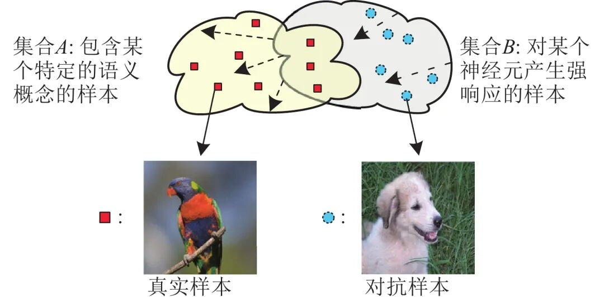
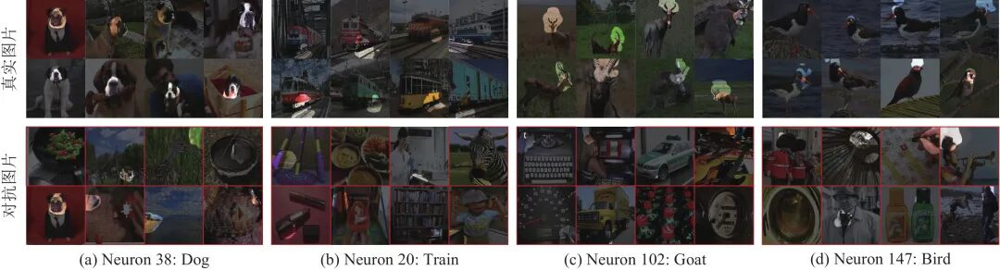
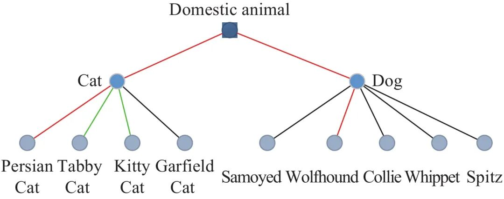

# 面向对抗样本的深度神经网络可解释性分析

原创 自动化学报 自动化学报 2022-04-07 16:05 北京

> 原文地址: [https://mp.weixin.qq.com/s/xCHIHdMI63wjppceade8ZA](https://mp.weixin.qq.com/s/xCHIHdMI63wjppceade8ZA)

**点击蓝字|关注我们**

  

**引用本文**

  

董胤蓬, 苏航, 朱军. 面向对抗样本的深度神经网络可解释性分析. 自动化学报, 2022, 48(1): 75−86 doi: 10.16383/j.aas.c200317

Dong Yin-Peng, Su Hang, Zhu Jun. Interpretability analysis of deep neural networks with adversarial examples. Acta Automatica Sinica, 2022, 48(1): 75−86 doi: 10.16383/j.aas.c200317

http://www.aas.net.cn/cn/article/doi/10.16383/j.aas.c200317?viewType=HTML

  

**文章简介**

  

**关键词**

  

深度神经网络, 可解释性, 对抗样本, 视觉特征表示

  

**摘   要**

  

虽然深度神经网络 (Deep neural networks, DNNs) 在许多任务上取得了显著的效果, 但是由于其可解释性 (Interpretability) 较差, 通常被当做“黑盒”模型. 本文针对图像分类任务, 利用对抗样本 (Adversarial examples) 从模型失败的角度检验深度神经网络内部的特征表示. 通过分析, 发现深度神经网络学习到的特征表示与人类所理解的语义概念之间存在着不一致性. 这使得理解和解释深度神经网络内部的特征变得十分困难. 为了实现可解释的深度神经网络, 使其中的神经元具有更加明确的语义内涵, 本文提出了加入特征表示一致性损失的对抗训练方式. 实验结果表明该训练方式可以使深度神经网络内部的特征表示与人类所理解的语义概念更加一致.

  

**引   言**

  

深度神经网络(Deep neural networks, DNNs)由于在语音识别、图像分类、自然语言处理等诸多领域取得了很好的效果, 近年来获得了人们的广泛关注. 但是由于缺乏对其内部工作机理的理解与分析, 深度神经网络通常被看作“黑盒”模型, 导致用户只能观察模型的预测结果, 而不能了解模型产生决策的原因. 深度神经网络的不可解释性也会极大地限制其发展与应用. 例如, 在诸如医疗、自动驾驶等许多实际的应用场景中, 仅仅向用户提供最终的预测结果而不解释其原因并不能够满足用户的需求. 用户需要获取模型产生决策的原因来理解、认可、信任一个模型, 并在模型出错时修复模型的问题. 因此, 研究提升模型可解释性的学习算法、使用户可以理解信任模型、并与模型进行交互变得至关重要.

  

近些年来, 有很多的方法尝试去解决深度神经网络的可解释性问题. 例如, 一个模型对于图像的分类结果可以归因于图像的关键性区域或者其他类似图像. 同时, 一系列的工作研究如何可视化深度神经网络内部神经元学习到的特征. 但是这些方法存在以下几个问题: 1)它们通常是在模型训练结束后进行解释, 并不能在训练的过程中约束其学习到一个可解释的模型; 2)它们仅仅关注模型对于正常样本的预测进行解释与分析, 而忽视了模型在现实场景中可能遇到的对抗样本(Adversarial examples); 3)它们并没有解释模型发生错误的原因, 也不能让用户针对性地修复模型的问题.

  

本文针对图像分类任务, 利用对抗样本检验深度神经网络的内部特征表示. 对抗样本是指攻击者通过向真实样本(Real examples)中添加微小的、人眼不可察觉的扰动, 导致模型发生预测错误的样本. 真实样本和对抗样本可以从正反两方面研究深度神经网络的行为, 既可以通过真实样本分析模型产生正确预测的原因, 同时也可以通过对抗样本分析模型发生错误的原因, 以深入探究深度神经网络的运行机制. 虽然利用模型预测错误的真实样本分析其产生错误的原因也是一种可行的方法, 但是真实样本中发生的错误往往是比较小的错误, 相比于对抗样本的预测错误可以忽略不计. 例如, 模型可能会将一个真实的公交车图片错分为客车, 这种错误可以被接受; 然而如果模型将一个对抗的公交车图片错分为飞机, 则不能够被我们所接受. 通过将对抗样本与真实样本输入到深度神经网络中并检验其特征表示, 我们发现深度神经网络内部学习到的特征表示与人类所理解的语义概念之间存在着极大的不一致性. 如图1所示, 神经元学习到的特征通常用对其产生强响应的样本所表示. 当只使用真实样本时, 神经元会检测某种语义概念. 但是会存在其他的样本 (例如蓝色圆圈标记的对抗样本) 也对神经元产生很强的响应, 尽管这些样本的语义概念十分不一致. 这使得神经元学习得到的特征难以解释.

  

图 1  语义概念与神经元学习到的特征存在不一致性的示意图

  

基于以上的分析, 本文进一步提出了加入特征表示一致性损失的对抗训练方式(Adversarial training with a consistent loss), 其目标是在模型的训练过程中学习到人类可解释的特征表示. 通过加入对抗样本与真实样本特征表示的距离作为一致性损失函数训练深度神经网络, 可以使网络在特征层面上消除掉对抗噪声的干扰, 使其对于对抗样本的特征表示与真实样本的特征表示尽量接近. 如图1所示, 对于深度神经网络内部的某个神经元, 如果该神经元检测到的特征与人类所理解的语义概念不一致时, 意味着会存在蓝色圆圈标记的对抗样本对其产生很强的响应. 然而这些对抗样本所对应的真实样本并不会对其产生很强的响应, 这就导致了一致性损失很大. 通过加入特征表示一致性的损失函数, 可以使得该神经元学习到的特征与人类所理解的某个语义概念相关联(如虚线所示). 这个过程最终会使得深度神经网络内部的神经元学习到可以抵抗对抗噪声干扰的特征, 从而在某个语义概念出现时产生响应、不出现时不产生响应. 因此该方法可以提升深度神经网络的可解释性. 实验结果表明在一些可解释性度量标准下, 该训练方式可以使深度神经网络内部的特征表示与人类所理解的语义概念更加一致, 得到可解释性更好的深度神经网络.

  

本文的主要贡献有: 1)提出利用对抗样本分析深度神经网络的可解释性, 并发现神经元学习到的特征表示与人类所理解的语义概念之间存在不一致性; 2)提出了加入特征表示一致性损失的对抗训练方式, 可以极大地促进深度神经网络的可解释性.

  

图 2  VGG-16网络中神经元(来自conv5\_3层)特征可视化

  

图 3  基于WordNet衡量特征的层次与一致性示意

  

请点击左下角“**阅读原文**”了解更多！

  

**作者简介**

**董胤蓬**

清华大学计算机科学与技术系博士研究生. 主要研究方向为机器学习, 深度学习的可解释性与鲁棒性.

E-mail: dyp17@mails.tsinghua.edu.cn

**苏   航**

清华大学计算机系副研究员. 主要研究方向为鲁棒、可解释人工智能基础理论及其视觉应用.

E-mail: suhangss@mail.tsinghua.edu.cn

**朱   军**

清华大学计算机系教授. 主要研究方向为机器学习. 本文通信作者.

E-mail: cszj@mail.tsinghua.edu.cn

  

**相关文章**

**（请向上滑动阅读）**

  

\[1\]   张芳, 王萌, 肖志涛, 吴骏, 耿磊, 童军, 王雯. 基于全卷积神经网络与低秩稀疏分解的显著性检测. 自动化学报, 2019, 45(11): 2148-2158. doi: 10.16383/j.aas.2018.c170535

http://www.aas.net.cn/cn/article/doi/10.16383/j.aas.2018.c170535?viewType=HTML

  

\[2\]   李阳, 王璞, 刘扬, 刘国军, 王春宇, 刘晓燕, 郭茂祖. 基于显著图的弱监督实时目标检测. 自动化学报, 2020, 46(2): 242−255 doi: 10.16383/j.aas.c180789

http://www.aas.net.cn/cn/article/doi/10.16383/j.aas.c180789?viewType=HTML

  

\[3\]   刘建伟, 赵会丹, 罗雄麟, 许鋆. 深度学习批归一化及其相关算法研究进展. 自动化学报, 2020, 46(6): 1090−1120 doi: 10.16383/j.aas.c180564

http://www.aas.net.cn/cn/article/doi/10.16383/j.aas.c180564?viewType=HTML

  

\[4\]   蓝天, 彭川, 李森, 钱宇欣, 陈聪, 刘峤. 基于RefineNet的端到端语音增强方法. 自动化学报, 2022, 48(2): 554-563. doi: 10.16383/j.aas.c190433

http://www.aas.net.cn/cn/article/doi/10.16383/j.aas.c190433?viewType=HTML

  

\[5\]   李凯文, 张涛, 王锐, 覃伟健, 贺惠晖, 黄鸿. 基于深度强化学习的组合优化研究进展. 自动化学报, 2021, 47(11): 2521-2537. doi: 10.16383/j.aas.c200551

http://www.aas.net.cn/cn/article/doi/10.16383/j.aas.c200551?viewType=HTML

  

\[6\]   张振宇, 杨健. 基于元学习的双目深度估计在线适应算法. 自动化学报. doi: 10.16383/j.aas.c200286

http://www.aas.net.cn/cn/article/doi/10.16383/j.aas.c200286?viewType=HTML

  

\[7\]   陈晋音, 吴长安, 郑海斌, 王巍, 温浩. 基于通用逆扰动的对抗攻击防御方法. 自动化学报. doi: 10.16383/j.aas.c201077

http://www.aas.net.cn/cn/article/doi/10.16383/j.aas.c201077?viewType=HTML

  

\[8\]   司念文, 张文林, 屈丹, 罗向阳, 常禾雨, 牛铜. 卷积神经网络表征可视化研究综述. 自动化学报. doi: 10.16383/j.aas.c200554

http://www.aas.net.cn/cn/article/doi/10.16383/j.aas.c200554?viewType=HTML

  

\[9\]   周志杰, 曹友, 胡昌华, 唐帅文, 张春潮, 王杰. 基于规则的建模方法的可解释性及其发展. 自动化学报, 2021, 47(6): 1201-1216. doi: 10.16383/j.aas.c200402

http://www.aas.net.cn/cn/article/doi/10.16383/j.aas.c200402?viewType=HTML

  

\[10\]   余正飞, 闫巧, 周鋆. 面向网络空间防御的对抗机器学习研究综述. 自动化学报. doi: 10.16383/j.aas.c210089

http://www.aas.net.cn/cn/article/doi/10.16383/j.aas.c210089?viewType=HTML

  

\[11\]   赵文迪, 陈德旺, 卓永强, 黄允浒. 深度神经模糊系统算法及其回归应用. 自动化学报, 2020, 46(11): 2350-2358. doi: 10.16383/j.aas.c200100

http://www.aas.net.cn/cn/article/doi/10.16383/j.aas.c200100?viewType=HTML

  

\[12\]   饶川, 陈靓影, 徐如意, 刘乐元. 一种基于动态量化编码的深度神经网络压缩方法. 自动化学报, 2019, 45(10): 1960-1968. doi: 10.16383/j.aas.c180554

http://www.aas.net.cn/cn/article/doi/10.16383/j.aas.c180554?viewType=HTML

  

\[13\]   袁文浩, 孙文珠, 夏斌, 欧世峰. 利用深度卷积神经网络提高未知噪声下的语音增强性能. 自动化学报, 2018, 44(4): 751-759. doi: 10.16383/j.aas.2018.c170001

http://www.aas.net.cn/cn/article/doi/10.16383/j.aas.2018.c170001?viewType=HTML

  

\[14\]   孙旭, 李晓光, 李嘉锋, 卓力. 基于深度学习的图像超分辨率复原研究进展. 自动化学报, 2017, 43(5): 697-709. doi: 10.16383/j.aas.2017.c160629

http://www.aas.net.cn/cn/article/doi/10.16383/j.aas.2017.c160629?viewType=HTML

  

\[15\]   韩伟, 张雄伟, 闵刚, 张启业. 基于感知掩蔽深度神经网络的单通道语音增强方法. 自动化学报, 2017, 43(2): 248-258. doi: 10.16383/j.aas.2017.c150719

http://www.aas.net.cn/cn/article/doi/10.16383/j.aas.2017.c150719?viewType=HTML

  

\[16\]   唐郅, 侯进. 基于深度神经网络的语音驱动发音器官的运动合成. 自动化学报, 2016, 42(6): 923-930. doi: 10.16383/j.aas.2016.c150726

http://www.aas.net.cn/cn/article/doi/10.16383/j.aas.2016.c150726?viewType=HTML

  

\[17\]   杨娟, 陆阳, 黄镇谨, 王强. 二进神经网络中的汉明球突及其线性可分性. 自动化学报, 2011, 37(6): 737-745. doi: 10.3724/SP.J.1004.2011.00737

http://www.aas.net.cn/cn/article/doi/10.3724/SP.J.1004.2011.00737?viewType=HTML

  

\[18\]  刘勍, 许录平, 马义德, 王勇. 基于脉冲耦合神经网络的图像NMI特征提取及检索方法. 自动化学报, 2010, 36(7): 931-938. doi: 10.3724/SP.J.1004.2010.00931

http://www.aas.net.cn/cn/article/doi/10.3724/SP.J.1004.2010.00931?viewType=HTML

  

\[19\]   郝红卫, 蒋蓉蓉. 基于最近邻规则的神经网络训练样本选择方法. 自动化学报, 2007, 33(12): 1247-1251. doi: 10.1360/aas-007-1247

http://www.aas.net.cn/cn/article/doi/10.1360/aas-007-1247?viewType=HTML

  

\[20\]  邢宗义, 贾利民, 张永, 胡维礼, 秦勇. 一类基于数据的解释性模糊建模方法的研究. 自动化学报, 2005, 31(6): 815-824.

http://www.aas.net.cn/cn/article/id/15937?viewType=HTML

  

\[21\]   潘且鲁, 苏剑波, 席裕庚. 基于神经网络的机器人手眼无标定平面视觉跟踪. 自动化学报, 2001, 27(2): 194-199.

http://www.aas.net.cn/cn/article/id/16462?viewType=HTML

  

\[22\]   王利生, 谈正, 张军凯. 联想记忆神经网络局部指数稳定的充要条件及特征函数. 自动化学报, 1999, 25(6): 777-781.

http://www.aas.net.cn/cn/article/id/16620?viewType=HTML

  

\[23\]   钱大群, 孙振飞. 神经网络的知识获取与行为解释. 自动化学报, 1994, 20(3): 348-351.

http://www.aas.net.cn/cn/article/id/14101?viewType=HTML

  

**近期文章**

  

[《自动化学报》2022年第03期目录分享](http://mp.weixin.qq.com/s?__biz=MzAwMzAzMDgxOA==&mid=2651075527&idx=1&sn=bc020c5fd09080243f7527610b003507&chksm=8131f98ab646709c2f485852b526989a3b9af5cc93e8afb508d9239b78176f49caa9807d6a8d&scene=21#wechat_redirect)

[2022斯坦福AI指数报告出炉！点击获取完整报告](http://mp.weixin.qq.com/s?__biz=MzAwMzAzMDgxOA==&mid=2651075236&idx=3&sn=1caed46e80f613c172a227ead8ddc1a3&chksm=8131f8e9b64671ffa8d6f7c8a36210fe1e262a66a42ab9a544e064d3c725b4a31274a4551750&scene=21#wechat_redirect)

[CVPR 2022 | 自动化所新作速览！（上）](http://mp.weixin.qq.com/s?__biz=MzAwMzAzMDgxOA==&mid=2651075034&idx=2&sn=48b5232daaa7a51da96c3a7c87013e2d&chksm=8131fb97b6467281dc8e02749df8d0388f89d30e3b08f44d13c700169d1d7a22c4feef9f2dba&scene=21#wechat_redirect)

[CVPR 2022 | 自动化所新作速览！（下）](http://mp.weixin.qq.com/s?__biz=MzAwMzAzMDgxOA==&mid=2651075034&idx=3&sn=21833bb312bb0d9826c64c9fce068aa5&chksm=8131fb97b646728147f2bff58a04230d708d5a4537eb824656c2d54580b11f6a47b0eb30ade6&scene=21#wechat_redirect)

[直播回放分享 | 陈关荣教授：探索最优同步网络的拓扑结构](http://mp.weixin.qq.com/s?__biz=MzIxMjA5Njg2Nw==&mid=2649061608&idx=1&sn=1500a81260d8f5127b7cb7767c759fba&chksm=8f5a9ae4b82d13f201b714d8e96af9bbddf442bb7e10c97416fb925ab2170c05fa12010fb1d1&scene=21#wechat_redirect)

  

**热点文章**

  

[《自动化学报》2019年高关注论文](http://mp.weixin.qq.com/s?__biz=MzAwMzAzMDgxOA==&mid=2651073450&idx=1&sn=6f57bd0df73f259aa416575f1f69bdfb&chksm=8131e1e7b64668f1344de4acdef6148e8dcfa60c80e4f48e6cb1270558c2beade5601e92d05c&scene=21#wechat_redirect)

[《自动化学报》2021年热点文章回顾](http://mp.weixin.qq.com/s?__biz=MzAwMzAzMDgxOA==&mid=2651072577&idx=1&sn=4e6be077d7371c7d29d9a371d8defe19&chksm=8131e20cb6466b1aec2f3b8b1063d3be11725ca9a0c15785c3b42a638170e732acd0d8d345e0&scene=21#wechat_redirect)

[国家自然科学基金论文精选](http://mp.weixin.qq.com/s?__biz=MzI2NjA3MzM5MA==&mid=2649960308&idx=1&sn=1634c999f22588333537f13393403f9c&chksm=f2942b35c5e3a2232e86b51c2b7c8f37a4d3d7f858d370d76d5afd00567d7da6e9543476d120&scene=21#wechat_redirect)  

[国家重点研发计划论文精选](http://mp.weixin.qq.com/s?__biz=MzI2NjA3MzM5MA==&mid=2649960255&idx=1&sn=f48435928fd924134cb72014860b9d00&chksm=f2942b7ec5e3a26869da68a1419b3b40ca1e6cb98abf2e380d78a49ffb99c85991d76cc346b0&scene=21#wechat_redirect)

[中国科学院自动化研究所高层次人才招聘启事 | 长期有效](http://mp.weixin.qq.com/s?__biz=MzI2NjA3MzM5MA==&mid=2649959451&idx=1&sn=657b7e4aeeaa88114d5189641c5409dc&chksm=f294285ac5e3a14cd230a2b9678c32ba9bf92e8ffc9d61d506c5ffea2df793456dd37c2c6fb1&scene=21#wechat_redirect)

  

**期刊动态**

  

[自动化学报（英文版）和自动化学报入选计算领域高质量科技期刊T1类](http://mp.weixin.qq.com/s?__biz=MzAwMzAzMDgxOA==&mid=2651073859&idx=2&sn=7a9192717637dcf6cddb39ed961e8c3b&chksm=8131e70eb6466e188a123c504bdeba80c75681de4762f8685b3bf584bc33eb12362c70613b4e&scene=21#wechat_redirect)

[《自动化学报》编辑部防诈骗公告](http://mp.weixin.qq.com/s?__biz=MzAwMzAzMDgxOA==&mid=2651073517&idx=1&sn=c52de7c685e546af9faffc0cefab1c85&chksm=8131e1a0b64668b63ebaa68ea81cbaec3b94dc52ea8360821a0a49e67ae7e4b428a25d0f19c5&scene=21#wechat_redirect)

[《自动化学报》致谢审稿人](http://mp.weixin.qq.com/s?__biz=MzI2NjA3MzM5MA==&mid=2649961201&idx=1&sn=3142842d75c441ae860c1ecb313c7657&chksm=f29436b0c5e3bfa6c679210f60513eb1a7205dc20fe028f482bb593eac60427e4e56fba12493&scene=21#wechat_redirect)

[自动化学报多篇论文入选中国百篇最具影响国内论文和中国精品期刊顶尖论文](http://mp.weixin.qq.com/s?__biz=MzI2NjA3MzM5MA==&mid=2649961152&idx=1&sn=4a5e9e4b84879f4cde4e13a0ef97272c&chksm=f2943681c5e3bf97d7770c9623dac869b283b3ea83f3d320017974033e361d8b999134a8bdff&scene=21#wechat_redirect)

[自动化学报各项主要指标蝉联第1，再获百种中国杰出期刊称号](http://mp.weixin.qq.com/s?__biz=MzI2NjA3MzM5MA==&mid=2649960903&idx=1&sn=7da8b8a0167e16bcbaa1f00fbfb69782&chksm=f2943586c5e3bc9014f6d4fff7147b998ae42b4da452907e641e8029f296fd2413b4f17aef62&scene=21#wechat_redirect)

  

**期刊目录**

  

[2022年第03期](http://mp.weixin.qq.com/s?__biz=MzAwMzAzMDgxOA==&mid=2651075527&idx=1&sn=bc020c5fd09080243f7527610b003507&chksm=8131f98ab646709c2f485852b526989a3b9af5cc93e8afb508d9239b78176f49caa9807d6a8d&scene=21#wechat_redirect)

[2022年第02期](http://mp.weixin.qq.com/s?__biz=MzI2NjA3MzM5MA==&mid=2649961838&idx=1&sn=29334896aa0f372b70312250c75b6b20&chksm=f294312fc5e3b8392ffd49100eaba435bf48fa9234c5019fe7b16ed1e4ebef70be58691f3fb3&scene=21#wechat_redirect)

[2022年第01期](http://mp.weixin.qq.com/s?__biz=MzI2NjA3MzM5MA==&mid=2649961423&idx=1&sn=3b65958faa7c7f94c247f46dd72bd71e&chksm=f294378ec5e3be9825f860d132c36c97f3e877089449cb1fe85a6d1e7da9bd0e24795336bc54&scene=21#wechat_redirect)

[《自动化学报》2021年全年合集](http://mp.weixin.qq.com/s?__biz=MzAwMzAzMDgxOA==&mid=2651072770&idx=1&sn=7c531f7fa3bc390558fab15b339ce86e&chksm=8131e34fb6466a59ed079448fddda0fc9f97066460bff8f6835288003a1fba2812de383813c1&scene=21#wechat_redirect)

[《自动化学报》2020年全年合集](http://mp.weixin.qq.com/s?__biz=MzI2NjA3MzM5MA==&mid=2649957972&idx=1&sn=1951847aacbcb7d22bdd2a46a79af871&chksm=f2942215c5e3ab03d070d8e52b8764b38036897c97b6a26c7a1f918c806b28edbe6c0fbf7ea9&scene=21#wechat_redirect)

[2020年第10期 工业人工智能专题](http://mp.weixin.qq.com/s?__biz=MzI2NjA3MzM5MA==&mid=2649957201&idx=1&sn=ab82a767bd716ab67fdf2942500d8b61&chksm=f2942710c5e3ae06b27f9e63a5e329a1123d90b051164e6b6123c500230541b1ed12d92abbfb&scene=21#wechat_redirect)

[2020年第09期 分布式信息能源系统理论与应用专题](http://mp.weixin.qq.com/s?__biz=MzI2NjA3MzM5MA==&mid=2649956412&idx=1&sn=8ebc13d63fd333ad85dbb8b5825df248&chksm=f294247dc5e3ad6ba297857a5b957e97cf499266c50318791fa8abd9432ecf1d9c3d9b287e36&scene=21#wechat_redirect)

  

  

  

**长按二维码｜关注我们**

**IEEE/CAA Journal of Automatica Sinica (JAS)**

**长按二维码｜关注我们**

**《自动化学报》服务号**

**长按二维码｜关注我们**

**《自动化学报》订阅号**  

  

**联系我们**

**网站:** 

http://www.aas.net.cn

http://www.ieee-jas.net

**投稿:** 

https://mc03.manuscriptcentral.com/aas-cn   

https://mc03.manuscriptcentral.com/ieee-jas 

**电话:**

010-82544653（日常咨询和稿件处理）           

010-82544677（录用后稿件处理）

**邮箱:** 

aas@ia.ac.cn（日常咨询和稿件处理）

aas\_editor@ia.ac.cn（录用后稿件处理）

**博客:** 

http://blog.sina.com.cn/aaseditor 

  

**点击****阅读原文** **了解更多**