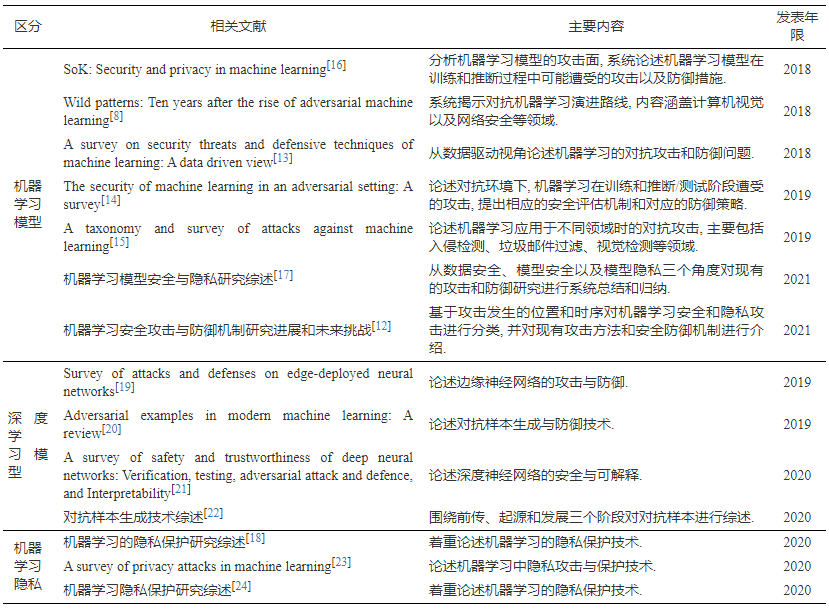
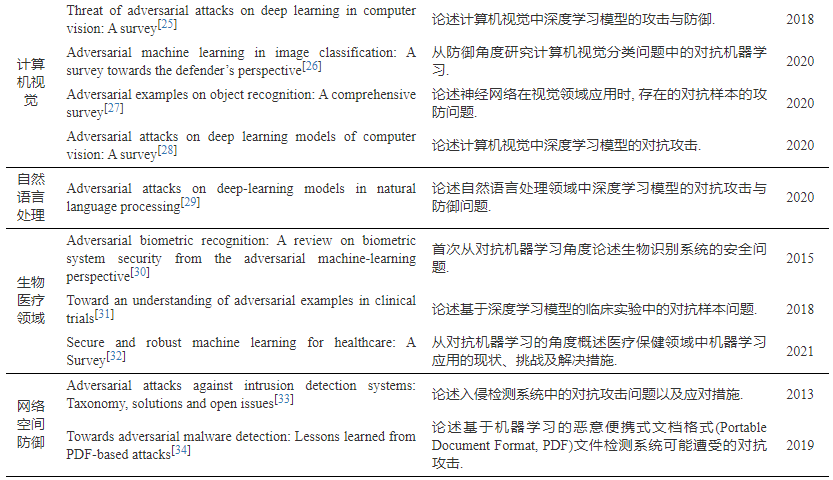
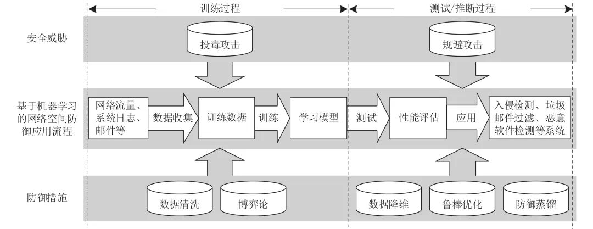
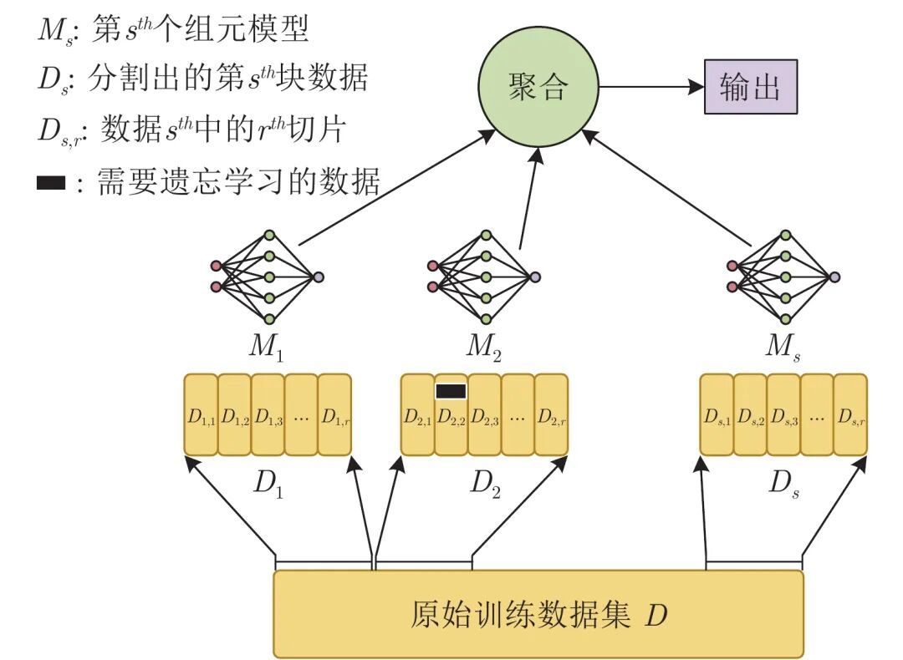

# 面向网络空间防御的对抗机器学习研究综述

原创 自动化学报 自动化学报 2022-06-10 15:52 北京

> 原文地址: [https://mp.weixin.qq.com/s/L2BCEcZ39GK7C4xbf\_RL6A](https://mp.weixin.qq.com/s/L2BCEcZ39GK7C4xbf_RL6A)

**点击蓝字 关注我们**

✦

✦

  

**引用本文**

✦

✦

✦

✦

  

余正飞, 闫巧, 周鋆. 面向网络空间防御的对抗机器学习研究综述. 自动化学报, 2022, 48(7): 1625−1649 doi: 10.16383/j.aas.c210089

Yu Zheng-Fei, Yan-Qiao, Zhou Yun. A survey on adversarial machine learning for cyberspace defense. Acta Automatica Sinica, 2022, 48(7): 1625−1649 doi: 10.16383/j.aas.c210089    

http://www.aas.net.cn/cn/article/doi/10.16383/j.aas.c210089?viewType=HTML

  

**文章简介**

✦

✦

✦

✦

  

✦

**关键词**

✦

  

网络空间防御, 对抗机器学习, 投毒攻击, 规避攻击, 对抗样本

  

✦

**摘   要**

✦

  

机器学习以强大的自适应性、自学习能力, 成为网络空间防御的研究热点和重要方向. 然而, 机器学习模型在网络空间环境下存在受到对抗攻击的潜在风险, 可能成为防御体系中最为薄弱的环节, 从而危害整个系统的安全. 为此, 科学分析安全问题场景, 从运行机理上探索算法可行性、安全性, 对运用机器学习模型构建网络空间防御系统大有裨益. 本文全面综述对抗机器学习这一跨学科研究领域在网络空间防御中取得的成果及以后的发展方向. 首先介绍了网络空间防御、对抗机器学习等背景知识. 其次, 针对机器学习在网络空间防御中可能遭受的攻击, 引入机器学习敌手模型概念, 目的是科学评估其在特定威胁场景下的安全属性. 而后, 针对网络空间防御的机器学习算法, 分别论述了在测试阶段发动规避攻击、在训练阶段发动投毒攻击、在机器学习全阶段发动隐私窃取的方法, 进而研究如何在网络空间对抗环境下, 强化机器学习模型的防御方法. 最后, 展望了网络空间防御中对抗机器学习研究的未来方向和有关挑战.

  

✦

**引   言**

✦

  

近年来, 人工智能、云计算、大数据、物联网、区块链等新一代信息技术突飞猛进, 信息化和工业化深度融合, 各类安全事件和网络攻击频繁发生, 网络空间面临严重的安全威胁. 2016年, 由恶意软件Mirai控制的僵尸网络发起分布式拒绝服务(Distributed denial of service, DDoS)攻击, 造成美国东海岸大范围断网. 2017年, 勒索病毒软件WannaCry通过“永恒之蓝”MS17-010漏洞在全球范围大爆发, 至少150个国家、30万名用户中招, 造成经济损失高达80亿美元. 2019年, 中国网络空间研究院编写的网络空间安全蓝皮书《中国网络空间安全发展报告(2019)》指出,“网络冲突和攻击成为国家间对抗主要形式”. 据不完全统计, 我国每年因伪基站、恶意软件勒索等数字犯罪造成的损失达上百亿元.

  

上述事例表明, 网络空间安全不仅影响着国民经济的发展, 还关系着社会的稳定和国家安全. 事实证明,“被动防守永远无法确保安全”, 传统的以固定规则设定的网络空间防御体系变得效率低下, 在面对“零日”漏洞以及各种高级可持续威胁时常常无能为力, 网络空间防御面临严峻挑战.

  

与此同时, 计算机算力的显著提升和数据量的日益递增, 带动了机器学习的快速发展, 人工智能迎来第三次发展浪潮. 以深度学习为代表的机器学习作为当前人工智能领域最热门的研究方向之一, 在计算机视觉、语音识别、自然语言处理等方面取得了一系列令人瞩目的研究成果, 成为引领未来的战略性技术.

  

机器学习技术在处理分类任务和决策问题时展现的突出能力, 成为网络空间防御中应用的新技术. 利用机器学习技术构建“关口前移, 防患于未然”的积极防御战略, 提高网络空间安全监测和处理的效率, 得到各国政府以及学术界、工业界的广泛关注. 当前, 基于机器学习的网络空间安全研究在系统安全、网络安全及应用安全等层面已有不少解决方案和方法, 在包括垃圾邮件过滤、恶意软件检测、网络入侵检测、漏洞分析与挖掘等领域均取得了不错的效果. 可以预见的是, 引入机器学习来解决网络空间安全问题是不容置疑的趋势, 机器学习在网络空间防御中的应用前景也会不断扩展.

  

值得注意的是, 将机器学习应用于网络空间防御问题并非新概念. 近年来, 各主流网络安全公司纷纷尝试利用机器学习改进或重制其安全产品. 然而, 利用机器学习解决网络空间防御问题仍处于初级阶段. 从模型的泛化能力、检测准确度以及实时性来看, 目前的技术解决方案均不能较好满足网络空间防御的应用需求. 导致这一现象的原因有很多, 一般来说可以概括为机器学习算法的安全性、功能及性能三个方面. 安全性是机器学习在网络空间防御应用首先应解决的基础性问题. 面向网络空间防御的机器学习需要在对抗多变的环境中处理大量数据, 对算法的安全性要求极为严苛. 在算法安全性得到保障的基础上, 机器学习的功能才可以得以实现. 在算法安全性和算法功能实现的基础上, 算法自适应性、可解释性等问题需要得以关注.

  

不幸的是, 机器学习本身存在易受对抗攻击的安全隐患. 网络空间更是高对抗环境, 无时无刻不在发生力量之间的相互对抗, 机器学习在这样的对抗环境下具有高度的脆弱性, 存在受到对抗攻击的潜在风险, 可能成为网络空间防御体系中最为薄弱的环节, 从而危害整个系统的安全. 例如, 机器学习模型训练过程中利用大量的网络流量、日志信息、系统信号等非结构化数据, 对这些输入数据进行投毒攻击(Poisoning attack), 会使得模型无法取得良好效果. 此外, 研究显示, 机器学习相关算法能够轻易地被对抗样本(Adversarial example)操控, 将对抗样本作为输入, 即使其中仅包含人类难以察觉的轻微扰动, 也会导致系统性能明显下降. 利用机器学习解决网络空间安全问题仍是极具挑战性的工作.

  

为应对以上挑战, 研究人员着手开展对抗机器学习(Adversarial machine learning)相关研究, 提高机器学习算法在网络空间防御中的鲁棒性, 推动机器学习相关算法的应用. 网络空间中广泛存在的对抗使得机器学习的应用面临严峻挑战. 研究在不断发展, 但仍距真相甚远. 以对抗样本生成和防御为中心的对抗深度学习, 无疑是对抗机器学习领域当前最受关注的研究热点. 然而, 网络空间是“没有经过勘测的深海”, 科学分析安全问题场景, 从运行机理上展开研究, 探索机器学习算法应用的可行性, 对于机器学习在网络空间防御中的应用大有裨益.

  

**对抗机器学习相关综述.** 随着对抗机器学习研究的深入, 相关研究成果不断涌现. 为此, 众多学者逐渐展开了对抗机器学习的综述工作, 对该领域进行了归纳与总结, 典型的综述文献及主要内容如表1所示. 在已有的综述文献中, 部分综述性工作从总体上对机器学习模型或深度学习模型的对抗攻击和防御展开论述, 如文献\[8\]从对抗机器学习演进路线切入, 论述机器学习的攻防问题, 应用范围包括计算机视觉及网络安全, 文献\[20\]详尽论述深度学习中的对抗样本生成与防御技术; 部分综述性工作围绕对抗机器学习中的隐私攻防进行了论述. 上述综述对通用机器学习模型和深度学习模型的对抗攻防问题进行了论述. 值得注意的是, 机器学习算法在与具体应用领域结合时, 往往具有鲜明的领域特点. 为此, 部分综述性工作围绕机器学习应用于各领域时的攻击与防御问题进行了研究, 主要包括计算机视觉、自然语言处理、生物医疗等, 较好地论述了各自领域所带来的新特点与新问题. 同时, 也有部分工作围绕网络空间防御中基于机器学习的入侵检测系统、恶意软件检测对抗攻击与防御问题进行论述. 然而, 没有相关研究就机器学习在网络空间防御应用中存在的对抗攻击与防御进行综述. 本文在详尽调研与检索相关论文的基础上, 首次从网络空间防御这个角度切入, 开展对抗机器学习综述.

  

表 1  对抗机器学习相关综述

  

**论文选取范围.** 本文的综述范围主要是国内外人工智能和信息安全领域顶级会议、期刊, 包括安全与隐私专题研讨会(IEEE Symposium on security and privacy, S&P)、计算机和通信安全会议(ACM Conference on computer and communications security, CCS)、安全专题研讨会(Usenix security symposium)、网络与分布式系统安全研讨会(ISOC Network and distributed system security symposium, NDSS)等国际信息安全四大会议, 学习表征国际会议(International conference on learning representations, ICLR)、知识发现与数据挖掘(ACM Knowledge discovery and data mining, KDD)、神经信息处理系统年会(Annual conference on neural information processing systems, NeurIPS)、国际人工智能联合会议(International joint conference on artificial intelligence, IJCAI)、人工智能大会(AAAI Conference on artificial intelligence, AAAI)等人工智能领域顶级会议, 以及国内计算机领域部分重要刊物. 另外, 部分预印版论文对该方向研究有较大影响, 本文选取部分质量较好、方法较新、引用较高的预印版论文进行论述.

  

**本综述的主要贡献.** 本综述以网络空间防御为问题背景, 全面综述机器学习在网络空间防御中可能遭受的对抗攻击、可采取的防御措施及以后的发展方向. 本综述的主要贡献有两个方面. 一是首次从网络空间防御层面论述机器学习的对抗攻击与防御; 二是探讨了该领域可能的发展方向与存在的挑战.

  

本综述的主要结构如下. 首先, 介绍网络空间防御及对抗机器学习等背景知识. 其次, 针对机器学习算法在网络空间防御中可能遭受的攻击进行威胁建模, 目的是科学评估其在特定攻击场景下的安全属性. 而后, 针对应用于网络空间防御的机器学习算法, 讨论如何实现测试阶段的规避攻击(Evasion attack), 训练阶段的投毒攻击以及机器学习全阶段的隐私窃取. 在这基础之上, 论述当前主要采取的防御措施. 最后, 讨论了当前研究的主要局限性以及下一步研究的可行方向.

  

图 2  网络空间防御中的对抗攻击与防御措施

  

图 11  SISA训练示意图

  

请点击左下角“**阅读原文**”了解更多！

  

**作者简介**

✦

✦

✦

✦

  

**余正飞**

国防科技大学系统工程学院博士研究生. 主要研究方向为对抗机器学习, 网络安全.

E-mail: yuzhengfei19@nudt.edu.cn

**闫   巧**

深圳大学计算机与软件学院教授. 主要研究方向为网络安全, 人工智能等. 本文通信作者.

E-mail: yanq@szu.edu.cn

**周   鋆**

国防科技大学系统工程学院副教授. 主要研究方向为机器学习, 概率图模型. 本文通信作者.

E-mail: zhouyun@nudt.edu.cn

  

**相关文章**

✦

✦

✦

✦

  

**（请向上滑动阅读）**

  

\[1\]  尹明, 吴浩杨, 谢胜利, 杨其宇. 基于自注意力对抗的深度子空间聚类. 自动化学报, 2022, 48(1): 271-281. doi: 10.16383/j.aas.c200302

http://www.aas.net.cn/cn/article/doi/10.16383/j.aas.c200302?viewType=HTML

  

\[2\]  席磊, 何苗, 周博奇, 李彦营. 基于改进多隐层极限学习机的电网虚假数据注入攻击检测. 自动化学报. doi: 10.16383/j.aas.c211127

http://www.aas.net.cn/cn/article/doi/10.16383/j.aas.c211127?viewType=HTML

  

\[3\]  董胤蓬, 苏航, 朱军. 面向对抗样本的深度神经网络可解释性分析. 自动化学报, 2022, 48(1): 75-86. doi: 10.16383/j.aas.c200317

http://www.aas.net.cn/cn/article/doi/10.16383/j.aas.c200317?viewType=HTML

  

\[4\]  赖轩, 曲延云, 谢源, 裴玉龙. 基于拓扑一致性对抗互学习的知识蒸馏. 自动化学报. doi: 10.16383/j.aas.200665

http://www.aas.net.cn/cn/article/doi/10.16383/j.aas.200665?viewType=HTML

  

\[5\]  李新利, 邹昌铭, 杨国田, 刘禾. SealGAN: 基于生成式对抗网络的印章消除研究. 自动化学报, 2021, 47(11): 2614-2622. doi: 10.16383/j.aas.c190459

http://www.aas.net.cn/cn/article/doi/10.16383/j.aas.c190459?viewType=HTML

  

\[6\]  石家宇, 陈博, 俞立. 基于拉普拉斯特征映射学习的隐匿FDI攻击检测. 自动化学报, 2021, 47(10): 2494-2500. doi: 10.16383/j.aas.c190551

http://www.aas.net.cn/cn/article/doi/10.16383/j.aas.c190551?viewType=HTML

  

\[7\]  陈晋音, 沈诗婧, 苏蒙蒙, 郑海斌, 熊晖. 车牌识别系统的黑盒对抗攻击. 自动化学报, 2021, 47(1): 121-135. doi: 10.16383/j.aas.c190488

http://www.aas.net.cn/cn/article/doi/10.16383/j.aas.c190488?viewType=HTML

  

\[8\]  陈晋音, 吴长安, 郑海斌, 王巍, 温浩. 基于通用逆扰动的对抗攻击防御方法. 自动化学报. doi: 10.16383/j.aas.c201077

http://www.aas.net.cn/cn/article/doi/10.16383/j.aas.c201077?viewType=HTML

  

\[9\]  胡旭光, 马大中, 郑君, 张化光, 王睿. 基于关联信息对抗学习的综合能源系统运行状态分析方法. 自动化学报, 2020, 46(9): 1783-1797. doi: 10.16383/j.aas.c200171

http://www.aas.net.cn/cn/article/doi/10.16383/j.aas.c200171?viewType=HTML

  

\[10\]  孔锐, 黄钢. 基于条件约束的胶囊生成对抗网络. 自动化学报, 2020, 46(1): 94-107. doi: 10.16383/j.aas.c180590

http://www.aas.net.cn/cn/article/doi/10.16383/j.aas.c180590?viewType=HTML

  

\[11\]  孔锐, 蔡佳纯, 黄钢. 基于生成对抗网络的对抗攻击防御模型. 自动化学报. doi: 10.16383/j.aas.2020.c200033

http://www.aas.net.cn/cn/article/doi/10.16383/j.aas.2020.c200033?viewType=HTML

  

\[12\]  杨飞生, 汪璟, 潘泉, 康沛沛. 网络攻击下信息物理融合电力系统的弹性事件触发控制. 自动化学报, 2019, 45(1): 110-119. doi: 10.16383/j.aas.c180388

http://www.aas.net.cn/cn/article/doi/10.16383/j.aas.c180388?viewType=HTML

  

\[13\]  郑文博, 王坤峰, 王飞跃. 基于贝叶斯生成对抗网络的背景消减算法. 自动化学报, 2018, 44(5): 878-890. doi: 10.16383/j.aas.2018.c170562

http://www.aas.net.cn/cn/article/doi/10.16383/j.aas.2018.c170562?viewType=HTML

  

\[14\]  王坤峰, 左旺孟, 谭营, 秦涛, 李力, 王飞跃. 生成式对抗网络:从生成数据到创造智能. 自动化学报, 2018, 44(5): 769-774. doi: 10.16383/j.aas.2018.y000001

http://www.aas.net.cn/cn/article/doi/10.16383/j.aas.2018.y000001?viewType=HTML

  

\[15\]  卢倩雯, 陶青川, 赵娅琳, 刘蔓霄. 基于生成对抗网络的漫画草稿图简化. 自动化学报, 2018, 44(5): 840-854. doi: 10.16383/j.aas.2018.c170486

http://www.aas.net.cn/cn/article/doi/10.16383/j.aas.2018.c170486?viewType=HTML

  

\[16\]  冯冲, 康丽琪, 石戈, 黄河燕. 融合对抗学习的因果关系抽取. 自动化学报, 2018, 44(5): 811-818. doi: 10.16383/j.aas.2018.c170481

http://www.aas.net.cn/cn/article/doi/10.16383/j.aas.2018.c170481?viewType=HTML

  

\[17\]  张龙, 赵杰煜, 叶绪伦, 董伟. 协作式生成对抗网络. 自动化学报, 2018, 44(5): 804-810. doi: 10.16383/j.aas.2018.c170483

http://www.aas.net.cn/cn/article/doi/10.16383/j.aas.2018.c170483?viewType=HTML

  

\[18\]  孙亮, 韩毓璇, 康文婧, 葛宏伟. 基于生成对抗网络的多视图学习与重构算法. 自动化学报, 2018, 44(5): 819-828. doi: 10.16383/j.aas.2018.c170496

http://www.aas.net.cn/cn/article/doi/10.16383/j.aas.2018.c170496?viewType=HTML

  

\[19\]  王坤峰, 苟超, 段艳杰, 林懿伦, 郑心湖, 王飞跃. 生成式对抗网络GAN的研究进展与展望. 自动化学报, 2017, 43(3): 321-332. doi: 10.16383/j.aas.2017.y000003

http://www.aas.net.cn/cn/article/doi/10.16383/j.aas.2017.y000003?viewType=HTML

  

\[20\]  李旭东. 抗几何攻击的空间域图像数字水印算法. 自动化学报, 2008, 34(7): 832-837. doi: 10.3724/SP.J.1004.2008.00832

http://www.aas.net.cn/cn/article/doi/10.3724/SP.J.1004.2008.00832?viewType=HTML

  

  

**近期文章**

✦

✦

✦

✦

[《自动化学报》2022年48卷6期目录分享](http://mp.weixin.qq.com/s?__biz=MzAwMzAzMDgxOA==&mid=2651078686&idx=1&sn=d2e559b173ad8aa24cfbc0ba136341ba&chksm=81318a53b6460345dff49d9c111e75895b58a276707f4e36e987a68a8b19046523a8b20ce45b&scene=21#wechat_redirect)

[JAS最新CiteScore达13.0，控制与优化领域排名全球第1](http://mp.weixin.qq.com/s?__biz=MzAwMzAzMDgxOA==&mid=2651078686&idx=2&sn=069c1a6eb49b19a19f558753911ec330&chksm=81318a53b64603456b758585a86970d7f6564330b37d4620c7d04dfdc020b66bc2843e37e8de&scene=21#wechat_redirect)

[基于混合生成对抗网络的多视角图像生成算法](http://mp.weixin.qq.com/s?__biz=MzAwMzAzMDgxOA==&mid=2651078638&idx=1&sn=a0bdc2a039c37d2ccdb6ad144551c5d7&chksm=8131f5a3b6467cb5355e1260b3e234b89277f5684ecf9a25f9f4cdaa8a0f1757e265c6b9551f&scene=21#wechat_redirect)

[一种新颖的深度因果图建模及其故障诊断方法](http://mp.weixin.qq.com/s?__biz=MzAwMzAzMDgxOA==&mid=2651078638&idx=2&sn=9310650828da9a3f3e091d6d0692ef8d&chksm=8131f5a3b6467cb5518ec6ff4219e4c4001abe33f648e852794f465e63cfb1b1da45a8878944&scene=21#wechat_redirect)

[SealGAN: 基于生成式对抗网络的印章消除研究](http://mp.weixin.qq.com/s?__biz=MzAwMzAzMDgxOA==&mid=2651078520&idx=1&sn=7b2fd3ad0255df30e61587f6ec80fd61&chksm=8131f535b6467c2351542b9537baee1f20a56d0cbe0baf3aa8c6b10e6830b72150c4bc4fe1d8&scene=21#wechat_redirect)

[基于遗传乌燕鸥算法的同步优化特征选择](http://mp.weixin.qq.com/s?__biz=MzAwMzAzMDgxOA==&mid=2651078520&idx=2&sn=41dec470920a78fd021209e5a113d716&chksm=8131f535b6467c23e0b7246b7697614f7c4debcbd0d727df9e8fca2841a6623d48c4e0571bb3&scene=21#wechat_redirect)

[基于轮胎状态刚度预测的极限工况路径跟踪控制研究](http://mp.weixin.qq.com/s?__biz=MzAwMzAzMDgxOA==&mid=2651078406&idx=1&sn=8b5e13ba1fbc860b2d6d92007d179345&chksm=8131f54bb6467c5d558d1ebbb4284a903eea029458b76e3e041773b42465284ab401d28e694e&scene=21#wechat_redirect)

[基于多参数灵敏度分析与遗传优化的铁水质量无模型自适应控制](http://mp.weixin.qq.com/s?__biz=MzAwMzAzMDgxOA==&mid=2651078406&idx=2&sn=919e0ff02f38f7bca086867466a39225&chksm=8131f54bb6467c5d789d8bf33edd281094acde67c5c035df91a8d655c03c3e9f096b3a1c6d2e&scene=21#wechat_redirect)

[串行生产线中机器维修工人的任务分配问题研究](http://mp.weixin.qq.com/s?__biz=MzAwMzAzMDgxOA==&mid=2651078261&idx=1&sn=af3614da8d72cbe2e4f01ddebad97732&chksm=8131f438b6467d2e30070c37bdd4ca82a6fa414a2b26588dc0d0bfec42efea2b2729becd1fc0&scene=21#wechat_redirect)  

[参考点自适应调整下评价指标驱动的高维多目标进化算法](http://mp.weixin.qq.com/s?__biz=MzAwMzAzMDgxOA==&mid=2651078261&idx=2&sn=725096e30b6fa219dcadacd45e6ded10&chksm=8131f438b6467d2e16f74d001605e31d4ec852905a2f39385130867dd12d5f031bc836b611cf&scene=21#wechat_redirect)

[基于改进YOLOv3算法的公路车道线检测方法](http://mp.weixin.qq.com/s?__biz=MzAwMzAzMDgxOA==&mid=2651078200&idx=1&sn=4044a26db179fbfb3781438fc7d9057d&chksm=8131f475b6467d63cf97cea2ea58db3bdc8f9d6958896d95b9a9b3a44828946362c7d6891418&scene=21#wechat_redirect)  

[直播预告‖自动化前沿热点讲堂之第十七讲](http://mp.weixin.qq.com/s?__biz=MzAwMzAzMDgxOA==&mid=2651078200&idx=2&sn=27f5d791ac740f87f0bcf7854c03f466&chksm=8131f475b6467d6366df12dbeb2d11b026a233143ed5d6fd80e3174be2ca86878ec8b56d302c&scene=21#wechat_redirect)

[一种基于改进AOD-Net的航拍图像去雾算法](http://mp.weixin.qq.com/s?__biz=MzAwMzAzMDgxOA==&mid=2651078165&idx=1&sn=092f00bc0dba34c5fd7c160e233ee480&chksm=8131f458b6467d4e9899392d597abb82989303551eae58bd4b9ef5580623abe046b273fbdbb3&scene=21#wechat_redirect)

[基于多级动态主元分析的电熔镁炉异常工况诊断](http://mp.weixin.qq.com/s?__biz=MzAwMzAzMDgxOA==&mid=2651078165&idx=2&sn=8d9a1a97361f5aea0655ef0bad114d5d&chksm=8131f458b6467d4e7b8185944175b5670bf21736d9ace23f32c73febef9b17de59f87795ad2d&scene=21#wechat_redirect)

[一种针对德州扑克AI的对手建模与策略集成框架【视频】](http://mp.weixin.qq.com/s?__biz=MzAwMzAzMDgxOA==&mid=2651078084&idx=1&sn=66f75170f77cdae1de9f7957ab6211be&chksm=8131f789b6467e9ff292811301f7aa59da264c1ebe9d3e805181b338cd4a41fe839759bf9d7b&scene=21#wechat_redirect)

[量子线性卷积及其在图像处理中的应用](http://mp.weixin.qq.com/s?__biz=MzAwMzAzMDgxOA==&mid=2651078077&idx=1&sn=0f8e5cc62e1a4648057f27b196fb3de5&chksm=8131f7f0b6467ee681a9542faea153769e16a0ff1a0f59b513f32a8f3ca3f360b045ca89615d&scene=21#wechat_redirect)

[基于非线性干扰观测器的飞机全电刹车系统滑模控制设计](http://mp.weixin.qq.com/s?__biz=MzAwMzAzMDgxOA==&mid=2651078038&idx=1&sn=e5b2617763076b22acf9042cd66265c6&chksm=8131f7dbb6467ecd0c2f64516f6ec7bf689fa3108d330d2f7c99144380c33c5a21dcf835f48c&scene=21#wechat_redirect)

  

**热点文章**

✦

✦

✦

✦

[基于改进YOLOv3算法的公路车道线检测方法](http://mp.weixin.qq.com/s?__biz=MzAwMzAzMDgxOA==&mid=2651078200&idx=1&sn=4044a26db179fbfb3781438fc7d9057d&chksm=8131f475b6467d63cf97cea2ea58db3bdc8f9d6958896d95b9a9b3a44828946362c7d6891418&scene=21#wechat_redirect)

[通信延时环境下异质网联车辆队列非线性纵向控制](http://mp.weixin.qq.com/s?__biz=MzAwMzAzMDgxOA==&mid=2651077767&idx=2&sn=d497bd4b45545cdc7584e9c9568ef4e0&chksm=8131f6cab6467fdc01f675bd4ea8b4823af1ff46862041b55d3b58ce8903265b6efd60bbc281&scene=21#wechat_redirect)

[图像异常检测研究现状综述](http://mp.weixin.qq.com/s?__biz=MzAwMzAzMDgxOA==&mid=2651077688&idx=1&sn=2535d4c0961f79a4e6e28fcec08d2fed&chksm=8131f675b6467f63e42dec407492be9cccdbf245e71dd2cd84b1d4af8072250b8b9f0f01329c&scene=21#wechat_redirect)

[迭代学习模型预测控制研究现状与挑战](http://mp.weixin.qq.com/s?__biz=MzAwMzAzMDgxOA==&mid=2651077623&idx=1&sn=1d8a9d2a39cab773fd8b49e8e73c55fd&chksm=8131f1bab64678ac33f4512961aa95fe90d40e9dbd6c4e13cad77295f4940b6aef050700caac&scene=21#wechat_redirect)

[2022年第05期](http://mp.weixin.qq.com/s?__biz=MzAwMzAzMDgxOA==&mid=2651077579&idx=1&sn=d2cf8dfd19e4104f5958b4ad6356239d&chksm=8131f186b6467890faae7fb5e1bdb23ca54b21a631ce9c32c47dc615ff926149628b9bf9b64b&scene=21#wechat_redirect)

[基于凸近似的避障原理及无人驾驶车辆路径规划模型预测算法](http://mp.weixin.qq.com/s?__biz=MzAwMzAzMDgxOA==&mid=2651077442&idx=1&sn=432dd266dbf5c99ca845248bb09df5c1&chksm=8131f10fb646781977984ae605369c8004b7c57f61747a28c49813698802554d4a11047abea0&scene=21#wechat_redirect)

[通信受限的多智能体系统二分实用一致性](http://mp.weixin.qq.com/s?__biz=MzAwMzAzMDgxOA==&mid=2651077321&idx=1&sn=02d81030a428cbb4275f4ff076068f08&chksm=8131f084b646799235c36b924d470f26f4e4da762c08d57e951613e4f74a57febdc8c03777c9&scene=21#wechat_redirect)

[【热点专题】多目标优化](http://mp.weixin.qq.com/s?__biz=MzI2NjA3MzM5MA==&mid=2649962438&idx=1&sn=83b21f7b6a63fc4e01c2f4718b2aae92&chksm=f2943387c5e3ba91ce32286c06f215a989233f55bbbd5c7d436a43c40615bb5ae208d0f0f228&scene=21#wechat_redirect)

[一种基于深度迁移学习的滚动轴承早期故障在线检测方法](http://mp.weixin.qq.com/s?__biz=MzAwMzAzMDgxOA==&mid=2651076931&idx=2&sn=128b1673843353529d8b130f372bb46f&chksm=8131f30eb6467a18e0f645b207ada16cd601b791297b32b1caccf72daa50b55063074ec4fdc3&scene=21#wechat_redirect)

[基于多智能体强化学习的乳腺癌致病基因预测](http://mp.weixin.qq.com/s?__biz=MzAwMzAzMDgxOA==&mid=2651076931&idx=1&sn=a62942cd056156ad5a885d6350e8b373&chksm=8131f30eb6467a18ffbee77b25fb9b0417b08918d3625d04c89a3a9bcb1490eece239c5fda25&scene=21#wechat_redirect)

[基于事件触发的离散MIMO系统自适应评判容错控制](http://mp.weixin.qq.com/s?__biz=MzAwMzAzMDgxOA==&mid=2651076863&idx=1&sn=aec9cf55a1b0b8eae741999601a8c6df&chksm=8131f2b2b6467ba4c20d388390d4ac191555e5d00d77f510f72af77359d18bdca5230ea52df0&scene=21#wechat_redirect)

[水下多机器人系统综述](http://mp.weixin.qq.com/s?__biz=MzAwMzAzMDgxOA==&mid=2651076668&idx=1&sn=b50e43710be8208fd711cd45943e95c0&chksm=8131f271b6467b675083610c925ce0d329e201ddab5c8e935eb266fbf41418395459fdd0618d&scene=21#wechat_redirect)

[基于事件触发二阶多智能体系统的固定时间比例一致性](http://mp.weixin.qq.com/s?__biz=MzAwMzAzMDgxOA==&mid=2651076637&idx=2&sn=fcf40a44a926c9034593207d6a614e95&chksm=8131f250b6467b46e70d4ef5f10226fbed60a0d12e327f83c793d86e7815ff00e4fcafcac295&scene=21#wechat_redirect)

[基于事件触发的分布式优化算法](http://mp.weixin.qq.com/s?__biz=MzAwMzAzMDgxOA==&mid=2651076142&idx=2&sn=b074793ec4be44ea08efb78617dcdcc0&chksm=8131fc63b6467575b7f6d698909e56be16089f8f56ca415294483ff6f40902c7546417f82531&scene=21#wechat_redirect)

  

**期刊动态**

✦

✦

✦

✦

[JAS最新CiteScore达13.0，控制与优化领域排名全球第1](http://mp.weixin.qq.com/s?__biz=MzAwMzAzMDgxOA==&mid=2651078686&idx=2&sn=069c1a6eb49b19a19f558753911ec330&chksm=81318a53b64603456b758585a86970d7f6564330b37d4620c7d04dfdc020b66bc2843e37e8de&scene=21#wechat_redirect)

[《自动化学报》多名作者入选爱思唯尔2021中国高被引学者](http://mp.weixin.qq.com/s?__biz=MzAwMzAzMDgxOA==&mid=2651076637&idx=1&sn=ee78f108cf0551024cb95c33241a5f1d&chksm=8131f250b6467b46c8d4af1bd63381328a80c65ade97a6daa97e3bb4538b39c6f761da238066&scene=21#wechat_redirect)

[自动化学报（英文版）和自动化学报入选计算领域高质量科技期刊T1类](http://mp.weixin.qq.com/s?__biz=MzAwMzAzMDgxOA==&mid=2651073859&idx=2&sn=7a9192717637dcf6cddb39ed961e8c3b&chksm=8131e70eb6466e188a123c504bdeba80c75681de4762f8685b3bf584bc33eb12362c70613b4e&scene=21#wechat_redirect)

[《自动化学报》编辑部防诈骗公告](http://mp.weixin.qq.com/s?__biz=MzAwMzAzMDgxOA==&mid=2651073517&idx=1&sn=c52de7c685e546af9faffc0cefab1c85&chksm=8131e1a0b64668b63ebaa68ea81cbaec3b94dc52ea8360821a0a49e67ae7e4b428a25d0f19c5&scene=21#wechat_redirect)

[《自动化学报》致谢审稿人](http://mp.weixin.qq.com/s?__biz=MzI2NjA3MzM5MA==&mid=2649961201&idx=1&sn=3142842d75c441ae860c1ecb313c7657&chksm=f29436b0c5e3bfa6c679210f60513eb1a7205dc20fe028f482bb593eac60427e4e56fba12493&scene=21#wechat_redirect)

[自动化学报多篇论文入选中国百篇最具影响国内论文和中国精品期刊顶尖论文](http://mp.weixin.qq.com/s?__biz=MzI2NjA3MzM5MA==&mid=2649961152&idx=1&sn=4a5e9e4b84879f4cde4e13a0ef97272c&chksm=f2943681c5e3bf97d7770c9623dac869b283b3ea83f3d320017974033e361d8b999134a8bdff&scene=21#wechat_redirect)

[自动化学报各项主要指标蝉联第1，再获百种中国杰出期刊称号](http://mp.weixin.qq.com/s?__biz=MzI2NjA3MzM5MA==&mid=2649960903&idx=1&sn=7da8b8a0167e16bcbaa1f00fbfb69782&chksm=f2943586c5e3bc9014f6d4fff7147b998ae42b4da452907e641e8029f296fd2413b4f17aef62&scene=21#wechat_redirect)

  

**期刊目录**

✦

✦

✦

✦

[2022年第06期](http://mp.weixin.qq.com/s?__biz=MzAwMzAzMDgxOA==&mid=2651078686&idx=1&sn=d2e559b173ad8aa24cfbc0ba136341ba&chksm=81318a53b6460345dff49d9c111e75895b58a276707f4e36e987a68a8b19046523a8b20ce45b&scene=21#wechat_redirect)

[2022年第05期](http://mp.weixin.qq.com/s?__biz=MzI2NjA3MzM5MA==&mid=2649962842&idx=1&sn=b91e3ab1206e29fdb9287ebbf7b07638&chksm=f2943d1bc5e3b40d9447d720203aca6ca2ae6662b85e3d9d5768c2da45df90cc31e49f895255&scene=21#wechat_redirect)

[2022年第04期](http://mp.weixin.qq.com/s?__biz=MzI2NjA3MzM5MA==&mid=2649962369&idx=1&sn=ae2c4584f8904be917b600e67005ae03&chksm=f29433c0c5e3bad6d78382b3c09015aadb09e040b8fc8c319c4f554fd592fe677797000340cd&scene=21#wechat_redirect)

[2022年第03期](http://mp.weixin.qq.com/s?__biz=MzAwMzAzMDgxOA==&mid=2651075527&idx=1&sn=bc020c5fd09080243f7527610b003507&chksm=8131f98ab646709c2f485852b526989a3b9af5cc93e8afb508d9239b78176f49caa9807d6a8d&scene=21#wechat_redirect)

[2022年第02期](http://mp.weixin.qq.com/s?__biz=MzI2NjA3MzM5MA==&mid=2649961838&idx=1&sn=29334896aa0f372b70312250c75b6b20&chksm=f294312fc5e3b8392ffd49100eaba435bf48fa9234c5019fe7b16ed1e4ebef70be58691f3fb3&scene=21#wechat_redirect)

[2022年第01期](http://mp.weixin.qq.com/s?__biz=MzI2NjA3MzM5MA==&mid=2649961423&idx=1&sn=3b65958faa7c7f94c247f46dd72bd71e&chksm=f294378ec5e3be9825f860d132c36c97f3e877089449cb1fe85a6d1e7da9bd0e24795336bc54&scene=21#wechat_redirect)

[《自动化学报》2021年全年合集](http://mp.weixin.qq.com/s?__biz=MzAwMzAzMDgxOA==&mid=2651072770&idx=1&sn=7c531f7fa3bc390558fab15b339ce86e&chksm=8131e34fb6466a59ed079448fddda0fc9f97066460bff8f6835288003a1fba2812de383813c1&scene=21#wechat_redirect)

[《自动化学报》2020年全年合集](http://mp.weixin.qq.com/s?__biz=MzI2NjA3MzM5MA==&mid=2649957972&idx=1&sn=1951847aacbcb7d22bdd2a46a79af871&chksm=f2942215c5e3ab03d070d8e52b8764b38036897c97b6a26c7a1f918c806b28edbe6c0fbf7ea9&scene=21#wechat_redirect)

[2020年第10期 工业人工智能专题](http://mp.weixin.qq.com/s?__biz=MzI2NjA3MzM5MA==&mid=2649957201&idx=1&sn=ab82a767bd716ab67fdf2942500d8b61&chksm=f2942710c5e3ae06b27f9e63a5e329a1123d90b051164e6b6123c500230541b1ed12d92abbfb&scene=21#wechat_redirect)

[2020年第09期 分布式信息能源系统理论与应用专题](http://mp.weixin.qq.com/s?__biz=MzI2NjA3MzM5MA==&mid=2649956412&idx=1&sn=8ebc13d63fd333ad85dbb8b5825df248&chksm=f294247dc5e3ad6ba297857a5b957e97cf499266c50318791fa8abd9432ecf1d9c3d9b287e36&scene=21#wechat_redirect)

  

  

**长按二维码｜关注我们**

**IEEE/CAA Journal of Automatica Sinica (JAS)**

**长按二维码｜关注我们**

**《自动化学报》服务号**

**长按二维码｜关注我们**

**《自动化学报》订阅号**  

  

**联系我们**

**网站:** 

http://www.aas.net.cn

http://www.ieee-jas.net

**投稿:** 

https://mc03.manuscriptcentral.com/aas-cn   

https://mc03.manuscriptcentral.com/ieee-jas 

**电话:**

010-82544653（日常咨询和稿件处理） 

010-82544677（录用后稿件处理）

**邮箱:** 

aas@ia.ac.cn（日常咨询和稿件处理）  

aas\_editor@ia.ac.cn（录用后稿件处理）

**博客:** 

http://blog.sina.com.cn/aaseditor 

  

**↓ 点击下方 阅读原文 了解更多**