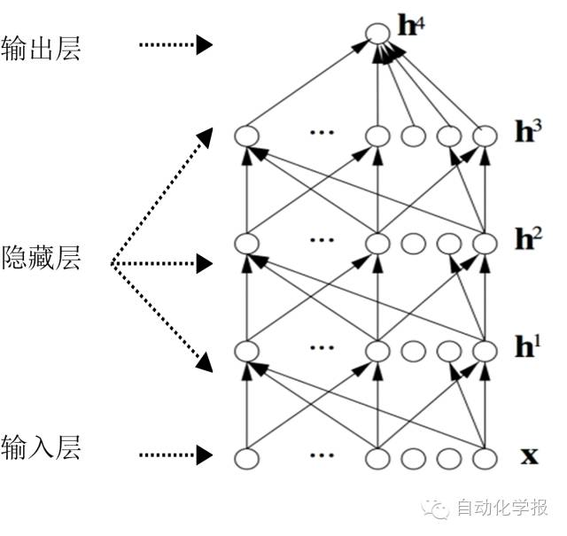
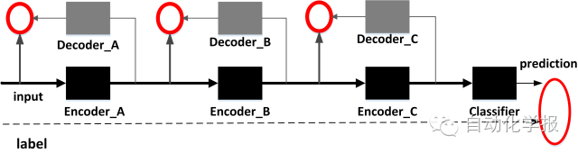

# 面向自然语言处理的深度学习研究

原创 自动化学报 2016-10-31 16:41 北京

> 原文地址: [https://mp.weixin.qq.com/s/6YfX1hgHTpdBnVQDbhd6Zg](https://mp.weixin.qq.com/s/6YfX1hgHTpdBnVQDbhd6Zg)

近年来, 深度学习在图像和语音处理领域已经取得显著进展, 但是在同属人类认知范畴的自然语言处理任务中, 研究还未取得重大突破. 本文首先从深度学习的应用动机、首要任务及基本框架等角度介绍了深度学习的基本概念; 其次, 围绕数据表示和学习模型两方面, 重点分析讨论了当前面向自然语言处理的深度学习研究进展及其应用策略; 并进一步介绍了已有的深度学习平台和工具; 最后, 对深度学习在自然语言处理领域的发展趋势和有待深入研究的难点进行了展望.

深度学习(Deep Learning)通过建立深层神经网络,模拟人脑的机制进行解释并分析学习图像、语音及文本等数据,是目前机器学习研究中的一个热点领域.传统机器学习工作的有效性,很大程度上依赖于人工设计的数据表示和输入特征的有效性;机器学习方法在这个过程中的作用仅仅是优化学习权重以便最终输出最优的学习结果.

与传统浅层学习的不同之处在于,首先,深度学习要求模型结构必须具有足够的深度(Depths),通常要求具有3层以上的隐层节点,有的甚至可能达到10 多层.这种多层非线性映射结构,有助于完成复杂函数逼近.其次,深度学习特别强调特征学习的重要性.通过非监督预训练算法,将输入原始样本在原空间的特征,逐层变化,映射到一个新的特征空间,进而有可能使用新特征更加容易实现分类或预测.此外,生成性预训练方法也避免了因为网络函数表达能力过强而可能出现的过拟合(Overfitting)问题.

深度学习的首要任务是尽可能采用一种简单的算法来实现所求解问题的分层特征表示.经过特征的逐层变换,使得原始样本特征可以映射变换到另一个新特征空间,进而可以更加容易地利用特征完成分类或预测任务.因此,特别强调特征学习(Feature Learning)或表示学习(Representation Learning) 的重要性,这一点与传统机器学习方法是一致的,所不同的是,深度学习实现特征自动提取,而传统机器学习更依赖于人工分析特征. 具体而言,图1表示了深度学习的基本框架.

图1 深度学习框架

算法流程如下所示.

步骤1. 随机初始化构建一个学习网络; 设置训练网络层数n;

步骤2. 初始化无标注数据作为网络训练输入集; 初始化训练网络层i = 1;

步骤3. 基于输入集, 采用无监督学习算法预训练当前层的学习网络;

步骤4. 每层的网络训练结果作为下一层的输入, 再次构建输入集;

步骤5. 如果i 小于网络层数n, 则网络训练层i = i + 1, 算法跳转到步骤3; 否则, 跳转到步骤6;

步骤6. 采用有监督学习方法来调整所有层的网络参数, 使误差达到要求;

步骤7. 完成分类器(如神经网络分类器) 构建;或者完成深度生成模型(如深度玻尔兹曼机) 构建.

上述算法流程中的步骤2到4 是深度学习的关键, 也称为“逐层预训练(Layer-wise pretraining)”. 如图2 所示.

图2 逐层预训练模型

相比于图像和语音领域所取得的成果, 深度学习在自然语言处理上尽管还未取得重大突破, 但也在以下相关诸多领域, 如词性标注、句法分析、词义学习、情感分析有着初步应用, 并取得较好效果.

面向自然语言处理的深度学习平台或工具较多,根据开发语言的不同,可以分为基于Python、C++、C或Java等不同程序设计语言实现的算法库或框架;根据实现的神经网络模型的不同,可以分为面向RBM/DBN(Deep Belief Network)等组件、卷积神经网络(CNN)、循环神经网络、递归神经网络实现的框架平台;根据功能目标不同,又可以分为提供深度学习基本功能实现的函数库/工具包、以及在函数库基础上面向领域任务构建的不同应用框架等.

总体而言, 相比于图像处理,自然语言的分层抽象其实并不明显.自然语言处理在深度学习中所采用的特征表示,目前主要是Word Embedding机制.尽管从语言表达的形式角度,也可以构建字母、单词、词组、短语、句子等层次结构,但从语义表达角度来看,似乎没有如图像处理那样具有明显的抽象分层,例如单词和词组、词组和短语之间,语义表达上面并没有非常明显的不同.抽象层次不明显,实质上就可能限制了特征表示的多样性,从而无法最好地发挥深度学习多层特征表示的长处.除了词向量之外,是否还有更好的特征表示方式？采用何种模型来构建明显分层机制？等等此类问题,也是面向自然语言处理的深度学习在未来发展中需要重点研究的内容.当然,尽管目前来看,面向自然语言的深度学习还存在着各种各样的问题,但是总体而言,现有深度学习的特征自动表示及分层抽象思想,为自然语言处理提供了一种将特征表示和应用实现独立分开的可行方法,这将使得在领域任务和语言之间的泛化迁移变得较为容易.

引用格式

奚雪峰, 周国栋. 面向自然语言处理的深度学习研究. 自动化学报, 2016, 42(10): 1445-1465

作者简介

奚雪峰 苏州大学计算机科学与技术学院博士研究生. 主要研究方向为自然语言理解, 篇章分析, 自动问答.

E-mail: xfxi@mail.usts.edu.cn

周国栋 苏州大学特聘教授. 主要研究方向为自然语言理解, 中文信息处理, 信息抽取. 本文通信作者.

E-mail: gdzhou@suda.edu.cn

欢迎扫描二维码、长按图片识别关注《自动化学报》中文版订阅号aas1963，服务号自动化学报和英文版服务号！

