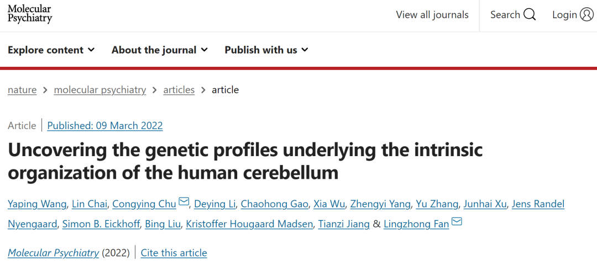
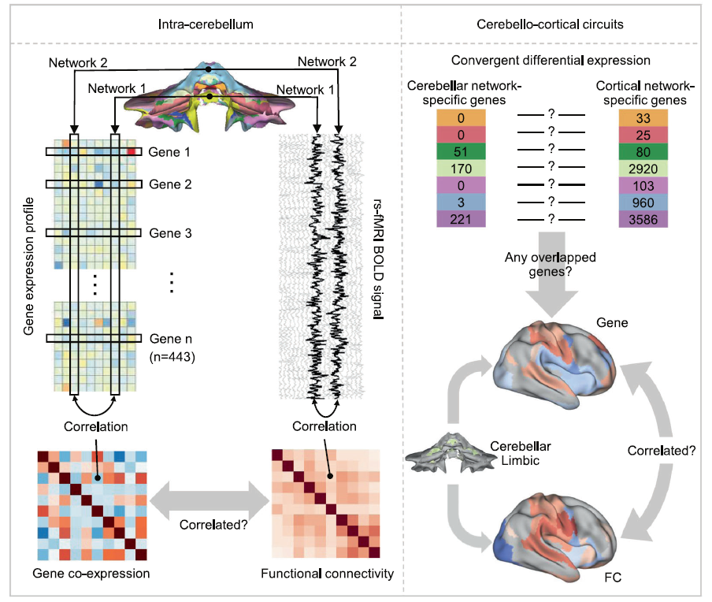
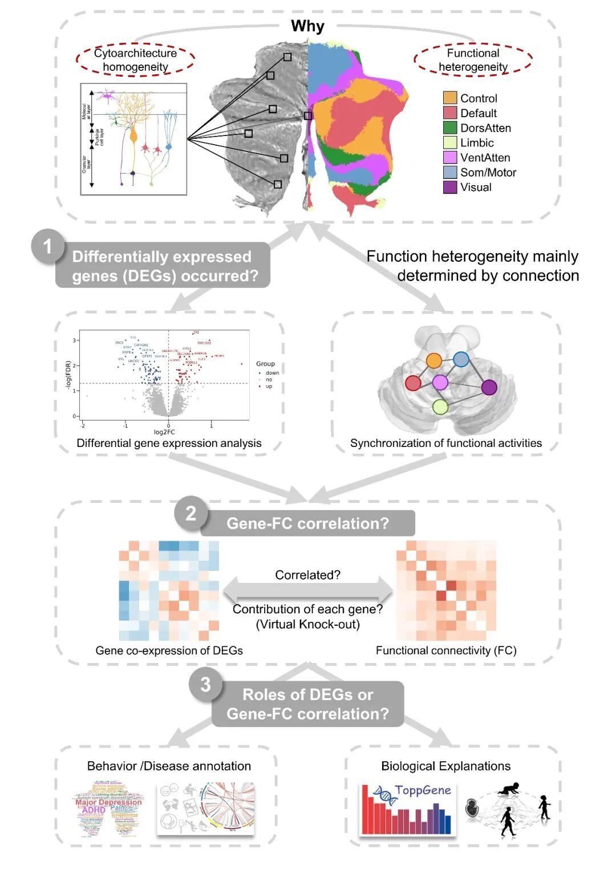

# Little brain, Big deal: 自动化所团队发现人类小脑功能异质背后的遗传学证据

原创 王亚平 自动化学报 2022-03-14 16:39 北京

> 原文地址: [https://mp.weixin.qq.com/s/G2OrtiCp9R4aSRgClXVDXA](https://mp.weixin.qq.com/s/G2OrtiCp9R4aSRgClXVDXA)

  

  

  

  

**CASIA**

  

  

**解锁更多智能之美**

  

脑功能组织模式的两个基本准则是分离和整合。功能分离是指不同功能（如运动、感觉或高级认知）的特征区域在解剖空间上是分离的；与此同时，支撑功能分离的神经解剖结构又需要相互联系，即谓功能整合。人类大脑的各种高级功能，如情绪、记忆、认知等便依赖于功能分离与功能整合之间的动态平衡，其失衡也会导致各种精神障碍的出现。因此**研究功能分离与功能整合之间的动态平衡是神经科学领域中的关键性科学问题**，可以帮助我们更好地理解神经系统内信息处理交流的模式以及产生高级认知功能的基础，同时也能够帮助阐明精神障碍的发病机理。

目前，相较于对人类大脑功能组织模式的认识，我们对功能分离和功能整合之间的关系在人类小脑中如何表征和交互仍知之甚少。**人类小脑虽然体积小，仅占整个人脑体积的十分之一，但却包含了整个脑部50%以上的神经细胞。**在过去长达两百多年里，小脑区域被认为只在运动任务和感觉信息处理中发挥作用。现在，越来越多的研究发现它还参与到了情绪、语言、记忆等高级认知功能中。同时，大量的研究也发现小脑的改变也与包括自闭症、抑郁症、精神分裂症等在内的多种精神障碍相关。关于人类小脑的一个有趣的悖论是小脑皮层的细胞构筑近乎同质与其复杂的功能异质性之间的不一致。细胞构筑高度同质的不同小脑区域是如何参与功能分离的呢？不同于大脑皮层，人类小脑的功能多样性更多地取决于小脑与小脑外结构的广泛相互连接，而非其高度均一的细胞构筑。既然普遍认为人类神经系统的宏观功能组织是由潜在的微观基因表达调节的，那么小脑这种独特的内在功能组织模式是否也是由基因调控的呢？如果有其遗传基础，又是通过什么样的机制进行运作的？至今，这些问题还未被系统地研究和回答。

近日，中科院自动化所脑网络组研究中心樊令仲研究组联合国科大中丹科教中心、德国于利希研究中心等国内外研究机构，在国际精神疾病领域知名期刊《Molecular Psychiatry》上发表了题为“Uncovering the genetic profiles underlying the intrinsic organization of the human cerebellum”的研究论文。**该研究揭示了小脑功能异质性及其驱动因素（即小脑连接、小脑-皮层连接）的遗传基础，为解析自发状态下小脑内在功能组织模式提供证据。**

该研究运用了脑影像-转录组关联分析的思路，结合人脑转录组图谱（Allen Human Brain Atlas）和多模态人类脑影像数据，不仅鉴定出了443个小脑功能网络特异性基因，而且发现这些基因的共表达模式与静息状态下小脑自发的功能连接（Functional connectivity, FC）密切相关。其中90个基因还与大-小脑的情绪和认知功能网络的功能连接有关。

通过观察基因共表达和功能连接之间偶联关系的变化，这443个小脑功能网络特异性基因被"虚拟敲除"分为了两个子集：基因贡献指标为正的基因集（positive gene contribution indicator，）和基因贡献指标为负的基因集（negative gene contribution indicator，）。通过后续的基因功能注释发现，主要参与小脑的神经发育过程，并在小脑延长的发育期显著高表达。而与神经递质传递有关，并且在婴儿晚期、儿童早期、青春期和成年早期显著表达。更有趣的发现是，与情绪认知行为高度关联, 同时与许多表现为小脑功能异常的神经精神疾病显著相关。

基因"虚拟敲除"：基因共表达和功能连接之间偶联关系

综上，该研究发现了小脑功能分离背后的网络特异性基因与小脑内部以及大-小脑之间功能连接的高度相关。这些结果有助于重新思考小脑功能高度异质性背后的遗传基础，并为小脑参与高级功能以及神经精神疾病的功能障碍，提供微观-宏观相交互的可能性机制解释。同时，该研究还确定了重要的遗传标志物，支撑了小脑功能网络在情绪认知行为和许多脑部疾病中发挥的关键作用。这些发现暗示了建立小脑**"基因—连接—功能/功能障碍"**关联性假说的可能性，同时也为之后揭示小脑在自闭症、精神分裂症等神经发育障碍性疾病中扮演的角色提供了基础。

人类小脑功能异质的遗传学基础研究思路

该研究的第一作者是中科院自动化所与国科大中丹科教中心联合培养的王亚平同学与中科院自动化所柴霖同学。上述工作得到了科技部、国家自然科学基金委、中科院战略性先导科技专项、中国科学院青年创新促进会等项目的大力支持和资助。

  

  

  

  

  

_文章链接_

Wang, Yaping#, Lin Chai#, Congying Chu\*, Deying Li, Chaohong Gao, Xia Wu, Zhengyi Yang, Yu Zhang, Junhai Xu, Jens Randel Nyengaard, Simon B. Eickhoff, Bing Liu, Kristoffer Hougaard Madsen, Tianzi Jiang, and Lingzhong Fan\*. 2022. Uncovering the genetic profiles underlying the intrinsic organization of the human cerebellum, Molecular Psychiatry. 

DOI：10.1038/s41380-022-01489-8.

**文章链接：**

https://www.nature.com/articles/s41380-022-01489-8

**全文连接:**  

https://rdcu.be/cIAFV

  

  

  

* * *

欢迎后台留言、推荐您感兴趣的话题、内容或资讯！

如需转载或投稿，请后台私信。

