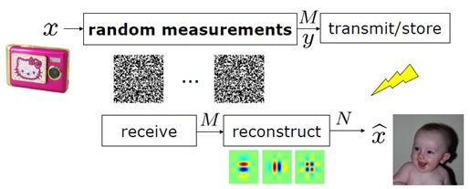
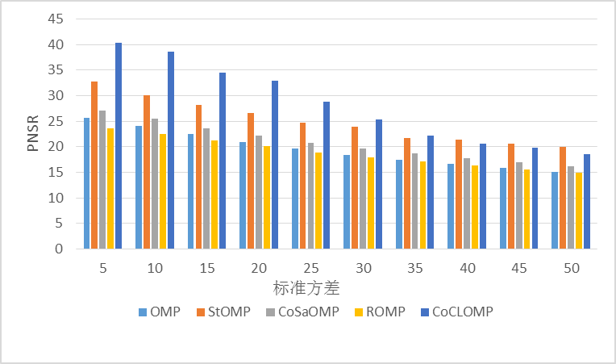
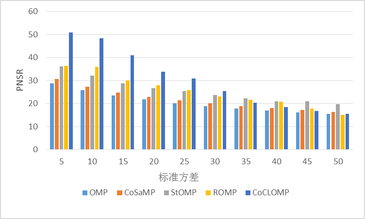
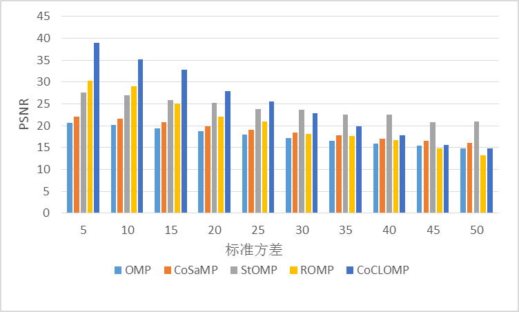
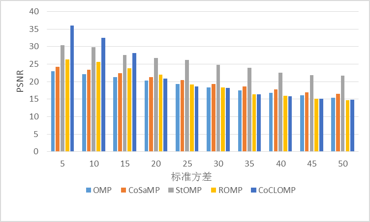
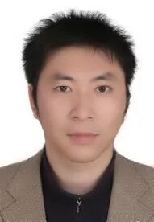
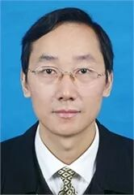
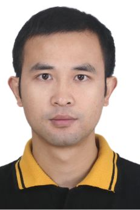
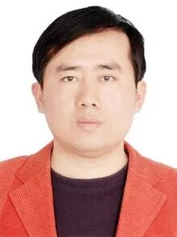

# 一种基于CGLS和LSQR的联合优化的匹配追踪算法

原创 自动化学报 2018-09-12 19:23 北京

> 原文地址: [https://mp.weixin.qq.com/s/Oc7wQrLyONiJqy-LappMfw](https://mp.weixin.qq.com/s/Oc7wQrLyONiJqy-LappMfw)

压缩感知

压缩感知（Compressed sensing），又称压缩采样、压缩传感，是一种寻找欠定线性系统的稀疏解的理论，它通过开发信号的稀疏特性，在远小于Nyquist 采样率的条件下，用随机采样获取信号的离散样本，然后通过非线性重建算法完美的重建信号。其基础理论由菲尔兹奖获得者华裔科学家陶哲轩， 斯坦福大学教授 Candes、Donoho 创立，该理论一经提出就引起学术界和工业界的广泛关注。它在信息论、图像处理、地球科学、光学、微波成像、模式识别、无线通信、大气、地质等领域受到高度关注，并被美国科技评论评为2007年度十大科技进展。

图1. 压缩感知的采集过程

在压缩感知理论中, 设计好的稀疏重构算法是一个比较重要, 同时也是一个具有挑战性的问题. 稀疏重构的基本目标是用较少的数据样本, 通过解一个优化问题完成信号或者图像重构. 关于稀疏重构过程, 一个重要的研究方向是在数据受噪声干扰的情况下, 如何高效快速地重建原信号. 本文提出了基于共轭梯度最小二乘法 (Conjugate gradient least squares,CGLS) 和最小二乘 QR 分解 (Least squares QR, LSQR) 的联合优化的匹配追踪算法（CoCLOMP）. 该算法采用 Alpha 散度来测量 CGLS和 LSQR 之间的离散度 (差异度), 并通过离散度来选择最优的解序列. 实验选取了图像处理标准测试图库中Lena 、aerial、man、boat四幅图，分析结果表明基于CGLS 和 LSQR 的联合优化的匹配追踪算法在压缩采样的信号受噪声干扰情况下具有较好的恢复能力。

a.噪声下重构boat图的PSNR值 

b.噪声下重构Lena图的PSNR值

c.噪声下重构aerial图的PSNR值

d.噪声下重构man图的PSNR值

图2 噪声下重构Lena 、aerial、man、boat图的PSNR

引用格式

陈善雄, 熊海灵, 廖剑伟, 周骏, 左俊森. 一种基于CGLS和LSQR的联合优化的匹配追踪算法. 自动化学报, 2018, 44(7): 1293-1303

作者简介

陈善雄 西南大学计算机与信息科学学院副教授. 2013 年获得重庆大学计算机科学与技术博士学位. 主要研究方向为数据挖掘, 模式识别, 压缩感知. 本文通信作者. 

E-mail: csxpml@163.com

熊海灵 西南大学计算机与信息科学学院教授. 2007 年获得西南大学数字农业方向农学博士学位. 主要研究方向为数据库与智能信息处理, 计算机模拟及其应用. 

E-mail: xionghl@swu.edu.cn

廖剑伟 西南大学计算机与信息科学学院副教授. 2012 年获日本东京大学计算机科学博士学位. 主要研究方向为系统软件和高性能分布式存储.

E-mail: liaotoad@gmail.com

周 骏 西南大学计算机与信息科学学院副教授. 2013 年获得电子科技大学计算机应用技术博士学位.主要研究方向为图像处理, 计算机视觉, 分子影像.

E-mail: zhouj@swu.edu.cn

左俊森 西南大学计算机与信息科学学院硕士研究生. 主要研究方向为数据库与智能检索技术, 计算机模拟及其应用.

E-mail: zuojunsen@email.swu.edu.cn

自动化

学报

**生成式对抗网络GAN技术与应用专刊**

[生成式对抗网络：从生成数据到创造智能](http://mp.weixin.qq.com/s?__biz=MzAwMzAzMDgxOA==&mid=2651063870&idx=1&sn=1e1d7562a4bbe4c31e2fdef4859c0bc4&chksm=8131cc73b6464565d9419524cd87b4bbe363384f0ba722017e91a49af4640d349403ea9a0ea6&scene=21#wechat_redirect)  

[人工智能研究的新前线：生成式对抗网络](http://mp.weixin.qq.com/s?__biz=MzAwMzAzMDgxOA==&mid=2651063920&idx=1&sn=9094936d46b4bab696df49c408fa1656&chksm=8131cc3db646452b0cba9ebdee9672b9ae010166a941ef19d5972616235193048a3346cf54f0&scene=21#wechat_redirect)  

[一种能量函数意义下的生成式对抗网络](http://mp.weixin.qq.com/s?__biz=MzAwMzAzMDgxOA==&mid=2651063930&idx=1&sn=8fc4569fbc51adb78002a6c492a7b58f&chksm=8131cc37b646452180ad8b4be28b69e9e1767c94cf2bf8b712074d8b26e72fffd95146d9fac5&scene=21#wechat_redirect)  

[协作式生成对抗网络](http://mp.weixin.qq.com/s?__biz=MzAwMzAzMDgxOA==&mid=2651063937&idx=1&sn=b3bb0ca500fa6f1e5b2d4fdc476187ed&chksm=8131ccccb64645daca101424f49facb82039d857908b8467fc5033a3b254fc348376128fef89&scene=21#wechat_redirect)  

[融合对抗学习的因果关系抽取](http://mp.weixin.qq.com/s?__biz=MzAwMzAzMDgxOA==&mid=2651063950&idx=1&sn=073948b72538b1547399cd7d3ba0b847&chksm=8131ccc3b64645d5c3c82fb7baa62c0cd2644c19f626a6a0904b6223bf155b8e77045006815a&scene=21#wechat_redirect)  

[基于生成对抗网络的多视图学习与重构算法](http://mp.weixin.qq.com/s?__biz=MzAwMzAzMDgxOA==&mid=2651063957&idx=1&sn=19964ffc71d7cb689887517b5d1bec12&chksm=8131ccd8b64645cee6db75a3910ee76a1bf2dab99af617044cfc2210d106ebc8c5eb7c88f7ba&scene=21#wechat_redirect)  

[基于生成对抗网络的低秩图像生成方法](http://mp.weixin.qq.com/s?__biz=MzAwMzAzMDgxOA==&mid=2651063961&idx=1&sn=8d6567b1750f5aa499007f17bed8e92b&chksm=8131ccd4b64645c2a898492cbb2eb4ed8272b4234bd1a08da279f17d6eb9884e0d4ace8f062c&scene=21#wechat_redirect)  

[基于条件深度卷积生成对抗网络的图像识别方法](http://mp.weixin.qq.com/s?__biz=MzAwMzAzMDgxOA==&mid=2651063972&idx=1&sn=b8bf8ae85b62f83e74d50f086ff6bc04&chksm=8131cce9b64645ff1ce4a10e6482d74876c664917a3ee821c11a72693cee3af1360b88d6fffe&scene=21#wechat_redirect)  

[基于生成式对抗网络的鲁棒人脸表情识别](http://mp.weixin.qq.com/s?__biz=MzAwMzAzMDgxOA==&mid=2651063980&idx=1&sn=ee5a109bc89e6b59dcf0db6359438be1&chksm=8131cce1b64645f7d5c0153e2fc3703abc37bc4edb3fc668efc90fd7433599ef40dcaa94e238&scene=21#wechat_redirect)  

[基于对抗训练策略的语言模型数据增强技术](http://mp.weixin.qq.com/s?__biz=MzAwMzAzMDgxOA==&mid=2651063984&idx=1&sn=6092ba309457e2810275069f4dfcef80&chksm=8131ccfdb64645ebb732eccf9f0fb0a81615f92a321d233837e60534ffaca0a352e6d81c97e5&scene=21#wechat_redirect)

[基于GAN技术的自能源混合建模与参数辨识方法-自能源，一场“草根能源”的盛宴](http://mp.weixin.qq.com/s?__biz=MzAwMzAzMDgxOA==&mid=2651063988&idx=1&sn=7c506b7a5c161d7c7b302a17ea28a097&chksm=8131ccf9b64645ef252f6078efb02f067d99a4d4d3cf020dfe8d21f85fb512835931dc11fbd7&scene=21#wechat_redirect)

[基于位错理论的距离正则化水平集图像分割算法](http://mp.weixin.qq.com/s?__biz=MzAwMzAzMDgxOA==&mid=2651063994&idx=1&sn=6e6e13de682aecbea7fec4ebbd4e4316&chksm=8131ccf7b64645e1c36dce0c5ba1a70ffcbf2f2ea25cc920c7ee6315227610c205029b5e0f67&scene=21#wechat_redirect)

[异质依存网络衰退特征与关键节点辨识](http://mp.weixin.qq.com/s?__biz=MzAwMzAzMDgxOA==&mid=2651064002&idx=1&sn=6b560d52462a2c2958004fb2e701d2c1&chksm=8131cc8fb6464599f19c7d08ce7a86b1638ad2542c79c16e178db90bee226be9c182cfba21cb&scene=21#wechat_redirect)

欢迎扫描二维码、长按图片识别关注《自动化学报》中文版订阅号aas1963，服务号自动化学报和英文版服务号！

JAS《自动化学报》（英文版）

自动化学报服务号

自动化学报订阅号

  

联系我们

Tel:  010-82544653（日常咨询和稿件处理） 

        010-82544677（录用后稿件处理）

Fax: 010-82544497

Email: aas@ia.ac.cn（日常咨询和稿件处理）

          aas\_editor@ia.ac.cn（录用后稿件处理）

http://www.aas.net.cn

点

这里“阅读原文”，查看更多