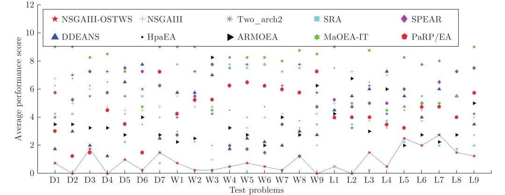
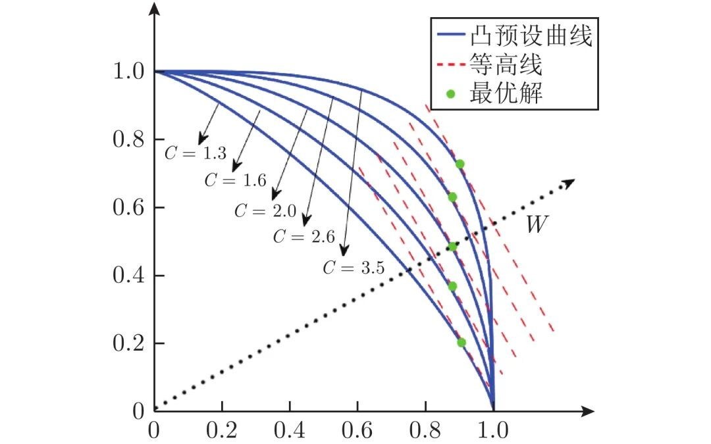
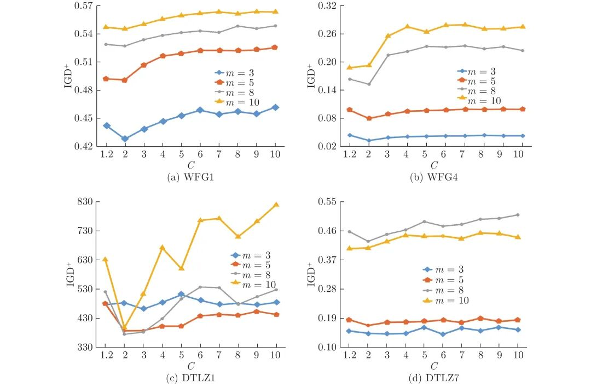

# 一种基于目标空间转换权重求和的超多目标进化算法

原创 自动化学报 自动化学报 2022-04-12 17:50 北京

> 原文地址: [https://mp.weixin.qq.com/s/DFPCFjKeaU6qN2HowkFyzQ](https://mp.weixin.qq.com/s/DFPCFjKeaU6qN2HowkFyzQ)

**点击蓝字 关注我们**

  

**引****用本文**

  

梁正平, 骆婷婷, 王志强, 朱泽轩, 胡凯峰. 一种基于目标空间转换权重求和的超多目标进化算法. 自动化学报, 2022, 48(4): 1060−1078 doi: 10.16383/j.aas.c200483

Liang Zheng-Ping, Luo Ting-Ting, Wang Zhi-Qiang, Zhu Ze-Xuan, Hu Kai-Feng. A many-objective evolutionary algorithm based on weighted sum of objective space transformation. Acta Automatica Sinica, 2022, 48(4): 1060−1078 doi: 10.16383/j.aas.c200483

http://www.aas.net.cn/cn/article/doi/10.16383/j.aas.c200483?viewType=HTML

  

**文章简介**

  

**关键词**

  

目标空间转换, 权重求和, 超多目标优化, 进化算法

  

**摘   要**

  

权重求和是基于分解的超多目标进化算法中常用的方法, 相比其他方法具有计算简单、搜索效率高等优点, 但难以有效处理帕累托前沿面(Pareto optimal front, PF)为非凸型的问题. 为充分发挥权重求和方法的优势, 同时又能处理好PF为非凸型的问题, 本文提出了一种基于目标空间转换权重求和的超多目标进化算法, 简称NSGAIII-OSTWS. 该算法的核心是将各种问题的PF转换为凸型曲面, 再利用权重求和方法进行优化. 具体地, 首先利用预估PF的形状计算个体到预估PF的距离; 然后, 根据该距离值将个体映射到目标空间中预估凸型曲面与理想点之间的对应位置; 最后, 采用权重求和函数计算出映射后个体的适应值, 据此实现对问题的进化优化. 为验证NSGAIII-OSTWS的有效性, 将NSGAIII-OSTWS与7个NSGAIII的变体, 以及9个具有代表性的先进超多目标进化算法在WFG、DTLZ和LSMOP基准问题上进行对比, 实验结果表明NSGAIII-OSTWS具备明显的竞争性能.

  

**引   言**

  

现实应用中存在各种各样的多目标优化问题(Multi-objective optimization problems, MOPs), 如电能分配、污水处理控制、服务质量优化、车辆路径规划、软件项目管理、微电网管理, 等等. 由于MOPs的不同目标函数之间通常相互冲突, MOPs的最优解集不是单一的解而是一组折衷解, 即帕累托最优解集(Pareto optimal set). 虽然一些性能优越的多目标进化算法(Multi-objective evolutionary algorithms, MOEAs), 如NSGA-II, SPEA2和MOEA-PPF等能很好的处理MOPs, 但在解决超多目标优化问题(Many-objective optimization problems, MaOPs)时, 上述算法的性能将显著下降. 原因是随着目标函数的增加, 非支配个体在种群中所占的比例将呈指数式增长, 基于帕累托关系的算法会逐渐丧失收敛压力. 为解决该问题, 学术界从不同角度对超多目标进化算法(Many-objective evolutionary algorithms, MaOEAs) 进行了较广泛的探讨, 大致可分为以下四类: 1) 基于放松支配. 该类算法的主要思想是通过扩大支配范围来增强种群往PF方向收敛的压力. 代表性方法有ϵ支配, L支配和模糊支配等; 2) 基于指标. 该类算法将个体的指标值作为环境选择的衡量标准, 如IBEA, HypE和ARMOEA等; 3) 基于分解. 该类算法将MaOPs分解为多个单目标优化问题(Single-objective optimization problems, SOPs), 随后在进化框架下同时优化这些SOPs, 如MOEA/D, NSGAIII和SPEAR等. 4)混合型. 该类算法采用两种或者两种以上的方法来实现对超多目标问题的优化, 如Two\_arch2和HpaEA均融合了基于支配和基于指标的方法, SRA则采用了多指标的策略. 在上述算法中, 基于分解的MaOEAs受到了学术界的高度关注, 该类算法的核心是对参考向量和分解方法的设计.

  

参考向量主要影响种群在PF上分布的均匀性, 即多样性. 在经典的分解类算法MOEA/D中, 采用一组均匀分布在目标空间上的向量集作为参考向量. 该参考向量在规则PF问题上能取得优越的性能, 但不能很好地处理退化、不连续、凹凸混合等不规则PF问题. 原因在于不规则PF上参考向量的分布不均匀, 进而造成种群在PF上分布不均匀. 针对该问题, 学术界提出了很多对均匀分布的参考向量进行调整的方法, 如CA-MOEA通过层次聚类方法来调整每代的参考向量, MOEA-AWA则根据种群中的精英个体来对参考向量进行调整, 类似的调整方法还有g-DBEA和DDEANS等. 然而, 由于频繁调整参考向量, 参考向量调整类算法的性能在处理规则PF问题时容易恶化.

  

分解方法主要影响种群的搜索效率, 即收敛性. 现有研究表明, 切比雪夫方法可有效处理各种PF形状的问题但搜索效率很低, 权重求和方法虽然不能处理好非凸PF问题但搜索效率却很高. 为此, Ishibuchi等提出了两种改进方案, 分别为自适应切比雪夫和权重求和方法AS, 同时使用切比雪夫和权重求和方法SS, 以综合切比雪夫和权重求和各自的优势. 此外, Wang等提出了局部权重求和方法LWS, 在综合性能上取得了显著的效果. 但由于LWS加入了局部的思想, 一定程度上降低了权重求和方法的搜索效率.

  

总体而言, 虽然学术界已对基于分解的MaOEAs进行了较广泛研究, 但该类方法的性能仍存在较大提升空间. 为尽可能不损害权重求和方法搜索效率高的优势, 同时又能处理好各类PF为非凸型的问题, 本文从改进现有分解方法的角度, 提出了一种基于目标空间转换权重求和的超多目标进化算法, 简称NSGAIII-OSTWS. 其中目标空间转换权重求和(Objective space transformation based weighted sum, OSTWS)将各种类型问题的PF转换为凸型曲面, 再利用权重求和方法对问题进行优化. 具体地, 首先利用预估PF的形状计算个体到预估PF的距离; 然后, 根据该距离值将个体映射到目标空间中预估凸型曲面与理想点之间的对应位置; 最后, 采用权重求和函数计算出映射后个体的适应值, 据此实现对问题的优化. 为验证OSTWS的有效性, 本文在NSGAIII框架的基础上, 将OSTWS与现有的7个分解方法在WFG、DTLZ和LSMOP测试问题集上进行了对比, 同时将所提的NSGAIII-OSTWS与9个具有代表性的MaOEAs进行了对比, 实验结果表明NSGAIII-OSTWS具备良好的竞争性能.

  

本文的内容安排如下. 第1节介绍与本文相关的背景知识. 第2节阐述目标空间转换权重求和方法OSTWS, 以及基于OSTWS的超多目标进化算法NSGAIII-OSTWS. 第3节介绍实验设计、实验结果, 并进行相关讨论. 最后对本文进行总结并指出未来的研究方向.

  

图 7  NSGAIII-OSTWS, NSGAIII, Two\_arch2, SRA, SPEAR, DDEANS, HpaEA, ARMOEA, MaOEA-IT和PaRP/EA在所有测试问题, 即DTLZ(Dx), WFG(Wx) 和LSMOP(Lx) 上的平均GD表现分, 分值越小, 算法的整体性能越好. 通过实线连接NSGAIII-OSTWS的得分, 以便易于评估分数

  

图 8  不同预设凸曲线在参考向量w上获得的最优解示意图

  

图 9  不同CC值在WFG1, WFG4, DTLZ1和DTLZ7问题的3, 5, 8和10目标维度上的IGD+均值

  

请点击左下角“**阅读原文**”了解更多！

  

**作者简介**

**梁正平**

深圳大学计算机与软件学院副教授. 2006年获武汉大学博士学位. 主要研究方向为计算智能, 大数据分析与应用.

E-mail: liangzp@szu.edu.cn

**骆婷婷**

华为技术有限公司工程师. 2020年获深圳大学硕士学位. 主要研究方向为计算智能, 自然语言处理与应用.

E-mail: luotingting2017@email.szu.edu.cn

**王志强**

深圳大学计算机与软件学院教授. 主要研究方向为计算智能, 大数据分析与应用和多媒体技术与应用.

E-mail: wangzq@szu.edu.cn

**朱泽轩**

深圳大学计算机与软件学院教授. 2008年获新加坡南洋理工大学博士学位. 主要研究方向为计算智能, 机器学习与生物信息学. 本文通信作者.

E-mail: zhuzx@szu.edu.cn

**胡凯峰**

深圳大学信息中心工程师. 2019年获深圳大学硕士学位. 主要研究方向为计算智能及其应用.

E-mail: kaifeng@szu.edu.cn

  

**相关文章**

**（请向上滑动阅读）**

  

\[1\]   孔维健, 柴天佑, 丁进良, 吴志伟. 镁砂熔炼过程全厂电能分配实时多目标优化方法研究. 自动化学报, 2014, 40(1): 51-61. doi: 10.3724/SP.J.1004.2014.00051

http://www.aas.net.cn/cn/article/doi/10.3724/SP.J.1004.2014.00051?viewType=HTML

  

\[2\]   乔俊飞, 韩改堂, 周红标. 基于知识的污水生化处理过程智能优化方法. 自动化学报, 2017, 43(6): 1038-1046. doi: 10.16383/j.aas.2017.c170088

http://www.aas.net.cn/cn/article/doi/10.16383/j.aas.2017.c170088?viewType=HTML

  

\[3\]   余伟伟, 谢承旺, 闭应洲, 夏学文, 李雄, 任柯燕, 赵怀瑞, 王少锋. 一种基于自适应模糊支配的高维多目标粒子群算法. 自动化学报, 2018, 44(12): 2278-2289. doi: 10.16383/j.aas.2018.c170573

http://www.aas.net.cn/cn/article/doi/10.16383/j.aas.2018.c170573?viewType=HTML

  

\[4\]   黄刚, 李军华. 基于 AC-DSDE 进化算法多 UAVs协同目标分配. 自动化学报, 2021, 47(1): 173-184. doi: 10.16383/j.aas.c190334

http://www.aas.net.cn/cn/article/doi/10.16383/j.aas.c190334?viewType=HTML

  

\[5\]   孙超利, 李贞, 金耀初. 模型辅助的计算费时进化高维多目标优化. 自动化学报. doi: 10.16383/j.aas.c200969

http://www.aas.net.cn/cn/article/doi/10.16383/j.aas.c200969?viewType=HTML

  

\[6\]   顾清华, 周煜丰, 李学现, 阮顺领. 基于径向空间划分的昂贵多目标进化算法. 自动化学报. doi: 10.16383/j.aas.c200791

http://www.aas.net.cn/cn/article/doi/10.16383/j.aas.c200791?viewType=HTML

  

\[7\]   陈国玉, 李军华, 黎明, 陈昊. 基于R2指标和参考向量的高维多目标进化算法. 自动化学报, 2021, 47(11): 2675-2690. doi: 10.16383/j.aas.c180722

http://www.aas.net.cn/cn/article/doi/10.16383/j.aas.c180722?viewType=HTML

  

\[8\]   梁正平, 李辉才, 王志强, 胡凯峰, 朱泽轩. 自适应变化响应的动态多目标进化算法. 自动化学报. doi: 10.16383/j.aas.c210121

http://www.aas.net.cn/cn/article/doi/10.16383/j.aas.c210121?viewType=HTML

  

\[9\]   封文清, 巩敦卫. 基于在线感知Pareto前沿划分目标空间的多目标进化优化. 自动化学报, 2020, 46(8): 1628-1643. doi: 10.16383/j.aas.2018.c180323

http://www.aas.net.cn/cn/article/doi/10.16383/j.aas.2018.c180323?viewType=HTML

  

\[10\]   马永杰, 陈敏, 龚影, 程时升, 王甄延. 动态多目标优化进化算法研究进展. 自动化学报, 2020, 46(11): 2302-2318. doi: 10.16383/j.aas.c190489

http://www.aas.net.cn/cn/article/doi/10.16383/j.aas.c190489?viewType=HTML

  

\[11\]   刘元, 郑金华, 邹娟, 喻果. 基于邻域竞赛的多目标优化算法. 自动化学报, 2018, 44(7): 1304-1320. doi: 10.16383/j.aas.2017.c160315

http://www.aas.net.cn/cn/article/doi/10.16383/j.aas.2017.c160315?viewType=HTML

  

\[12\]   李金忠, 刘关俊, 闫春钢, 蒋昌俊. 排序学习研究进展与展望. 自动化学报, 2018, 44(8): 1345-1369. doi: 10.16383/j.aas.2018.c170246

http://www.aas.net.cn/cn/article/doi/10.16383/j.aas.2018.c170246?viewType=HTML

  

\[13\]   丁进良, 杨翠娥, 陈立鹏, 柴天佑. 基于参考点预测的动态多目标优化算法. 自动化学报, 2017, 43(2): 313-320. doi: 10.16383/j.aas.2017.c150811

http://www.aas.net.cn/cn/article/doi/10.16383/j.aas.2017.c150811?viewType=HTML

  

\[14\]   陈美蓉, 郭一楠, 巩敦卫, 杨振. 一类新型动态多目标鲁棒进化优化方法. 自动化学报, 2017, 43(11): 2014-2032. doi: 10.16383/j.aas.2017.c160300

http://www.aas.net.cn/cn/article/doi/10.16383/j.aas.2017.c160300?viewType=HTML

  

\[15\]   巩敦卫, 刘益萍, 孙晓燕, 韩玉艳. 基于目标分解的高维多目标并行进化优化方法. 自动化学报, 2015, 41(8): 1438-1451. doi: 10.16383/j.aas.2015.c140832

http://www.aas.net.cn/cn/article/doi/10.16383/j.aas.2015.c140832?viewType=HTML

  

\[16\]   陈振兴, 严宣辉, 吴坤安, 白猛. 融合张角拥挤控制策略的高维多目标优化. 自动化学报, 2015, 41(6): 1145-1158. doi: 10.16383/j.aas.2015.c140555

http://www.aas.net.cn/cn/article/doi/10.16383/j.aas.2015.c140555?viewType=HTML

  

\[17\]   王大志, 刘士新, 郭希旺. 求解总拖期时间最小化流水车间调度问题的多智能体进化算法. 自动化学报, 2014, 40(3): 548-555. doi: 10.3724/SP.J.1004.2014.00548

http://www.aas.net.cn/cn/article/doi/10.3724/SP.J.1004.2014.00548?viewType=HTML

  

\[18\]   于坤杰, 王昕, 王振雷. 基于反馈的精英教学优化算法. 自动化学报, 2014, 40(9): 1976-1983. doi: 10.3724/SP.J.1004.2014.01976

http://www.aas.net.cn/cn/article/doi/10.3724/SP.J.1004.2014.01976?viewType=HTML

  

\[19\]   高维尚, 邵诚. 复杂非凸约束优化难题与迭代动态多样进化算法. 自动化学报, 2014, 40(11): 2469-2479. doi: 10.3724/SP.J.1004.2014.02469

http://www.aas.net.cn/cn/article/doi/10.3724/SP.J.1004.2014.02469?viewType=HTML

  

\[20\]   胡正平, 谭营. 基于目标模糊置信度描述驱动的区域能量进化增长图像分割算法. 自动化学报, 2008, 34(9): 1047-1052. doi: 10.3724/SP.J.1004.2008.01047

http://www.aas.net.cn/cn/article/doi/10.3724/SP.J.1004.2008.01047?viewType=HTML

  

\[21\]   张勇, 巩敦卫, 郝国生, 蒋余庆. 含区间参数多目标系统的微粒群优化算法. 自动化学报, 2008, 34(8): 921-928. doi: 10.3724/SP.J.1004.2008.00921

http://www.aas.net.cn/cn/article/doi/10.3724/SP.J.1004.2008.00921?viewType=HTML

  

\[22\]   李翔龙, 殷国富, 罗红波. 进化神经网络在机床工具损耗预测中的应用. 自动化学报, 2004, 30(1): 114-119.

http://www.aas.net.cn/cn/article/id/16181?viewType=HTML

  

\[23\]   丁永生, 任立红, 邵世煌. 采用新的DNA进化算法自动设计Takagi-Sugeno模糊控制器. 自动化学报, 2001, 27(4): 510-520.

http://www.aas.net.cn/cn/article/id/16435?viewType=HTML

  

  

**近期文章**

[【热点专题】目标检测](http://mp.weixin.qq.com/s?__biz=MzI2NjA3MzM5MA==&mid=2649962259&idx=1&sn=97b0c31ec704211713ef8cba4bb51b01&chksm=f2943352c5e3ba44f2c7217cff60405765c6d67312beb6d07006155404bfc4b34268956697f5&scene=21#wechat_redirect)

[《自动化学报》2022年第03期目录分享](http://mp.weixin.qq.com/s?__biz=MzAwMzAzMDgxOA==&mid=2651075527&idx=1&sn=bc020c5fd09080243f7527610b003507&chksm=8131f98ab646709c2f485852b526989a3b9af5cc93e8afb508d9239b78176f49caa9807d6a8d&scene=21#wechat_redirect)

[2022斯坦福AI指数报告出炉！点击获取完整报告](http://mp.weixin.qq.com/s?__biz=MzAwMzAzMDgxOA==&mid=2651075236&idx=3&sn=1caed46e80f613c172a227ead8ddc1a3&chksm=8131f8e9b64671ffa8d6f7c8a36210fe1e262a66a42ab9a544e064d3c725b4a31274a4551750&scene=21#wechat_redirect)

[黄艳龙, 徐德, 谭民. 机器人运动轨迹的模仿学习综述](http://mp.weixin.qq.com/s?__biz=MzAwMzAzMDgxOA==&mid=2651075236&idx=1&sn=ec575c249f6e60709a32a7dfa6b55f37&chksm=8131f8e9b64671ffaf5de201407410a38735b35d7f4e6ab43eb05dac537068fb912ceef808c1&scene=21#wechat_redirect)

[CVPR 2022 | 自动化所新作速览！（上）](http://mp.weixin.qq.com/s?__biz=MzAwMzAzMDgxOA==&mid=2651075034&idx=2&sn=48b5232daaa7a51da96c3a7c87013e2d&chksm=8131fb97b6467281dc8e02749df8d0388f89d30e3b08f44d13c700169d1d7a22c4feef9f2dba&scene=21#wechat_redirect)

[CVPR 2022 | 自动化所新作速览！（下）](http://mp.weixin.qq.com/s?__biz=MzAwMzAzMDgxOA==&mid=2651075034&idx=3&sn=21833bb312bb0d9826c64c9fce068aa5&chksm=8131fb97b646728147f2bff58a04230d708d5a4537eb824656c2d54580b11f6a47b0eb30ade6&scene=21#wechat_redirect)

[直播回放分享 | 陈关荣教授：探索最优同步网络的拓扑结构](http://mp.weixin.qq.com/s?__biz=MzIxMjA5Njg2Nw==&mid=2649061608&idx=1&sn=1500a81260d8f5127b7cb7767c759fba&chksm=8f5a9ae4b82d13f201b714d8e96af9bbddf442bb7e10c97416fb925ab2170c05fa12010fb1d1&scene=21#wechat_redirect)

  

**热点文章**

[【热点专题】目标检测](http://mp.weixin.qq.com/s?__biz=MzI2NjA3MzM5MA==&mid=2649962259&idx=1&sn=97b0c31ec704211713ef8cba4bb51b01&chksm=f2943352c5e3ba44f2c7217cff60405765c6d67312beb6d07006155404bfc4b34268956697f5&scene=21#wechat_redirect)

[《自动化学报》2022年第03期目录分享](http://mp.weixin.qq.com/s?__biz=MzAwMzAzMDgxOA==&mid=2651075527&idx=1&sn=bc020c5fd09080243f7527610b003507&chksm=8131f98ab646709c2f485852b526989a3b9af5cc93e8afb508d9239b78176f49caa9807d6a8d&scene=21#wechat_redirect)

[2022斯坦福AI指数报告出炉！点击获取完整报告](http://mp.weixin.qq.com/s?__biz=MzAwMzAzMDgxOA==&mid=2651075236&idx=3&sn=1caed46e80f613c172a227ead8ddc1a3&chksm=8131f8e9b64671ffa8d6f7c8a36210fe1e262a66a42ab9a544e064d3c725b4a31274a4551750&scene=21#wechat_redirect)

[黄艳龙, 徐德, 谭民. 机器人运动轨迹的模仿学习综述](http://mp.weixin.qq.com/s?__biz=MzAwMzAzMDgxOA==&mid=2651075236&idx=1&sn=ec575c249f6e60709a32a7dfa6b55f37&chksm=8131f8e9b64671ffaf5de201407410a38735b35d7f4e6ab43eb05dac537068fb912ceef808c1&scene=21#wechat_redirect)

[CVPR 2022 | 自动化所新作速览！（上）](http://mp.weixin.qq.com/s?__biz=MzAwMzAzMDgxOA==&mid=2651075034&idx=2&sn=48b5232daaa7a51da96c3a7c87013e2d&chksm=8131fb97b6467281dc8e02749df8d0388f89d30e3b08f44d13c700169d1d7a22c4feef9f2dba&scene=21#wechat_redirect)

[CVPR 2022 | 自动化所新作速览！（下）](http://mp.weixin.qq.com/s?__biz=MzAwMzAzMDgxOA==&mid=2651075034&idx=3&sn=21833bb312bb0d9826c64c9fce068aa5&chksm=8131fb97b646728147f2bff58a04230d708d5a4537eb824656c2d54580b11f6a47b0eb30ade6&scene=21#wechat_redirect)

[直播回放分享 | 陈关荣教授：探索最优同步网络的拓扑结构](http://mp.weixin.qq.com/s?__biz=MzIxMjA5Njg2Nw==&mid=2649061608&idx=1&sn=1500a81260d8f5127b7cb7767c759fba&chksm=8f5a9ae4b82d13f201b714d8e96af9bbddf442bb7e10c97416fb925ab2170c05fa12010fb1d1&scene=21#wechat_redirect)

  

**期刊动态**

[自动化学报（英文版）和自动化学报入选计算领域高质量科技期刊T1类](http://mp.weixin.qq.com/s?__biz=MzAwMzAzMDgxOA==&mid=2651073859&idx=2&sn=7a9192717637dcf6cddb39ed961e8c3b&chksm=8131e70eb6466e188a123c504bdeba80c75681de4762f8685b3bf584bc33eb12362c70613b4e&scene=21#wechat_redirect)

[《自动化学报》编辑部防诈骗公告](http://mp.weixin.qq.com/s?__biz=MzAwMzAzMDgxOA==&mid=2651073517&idx=1&sn=c52de7c685e546af9faffc0cefab1c85&chksm=8131e1a0b64668b63ebaa68ea81cbaec3b94dc52ea8360821a0a49e67ae7e4b428a25d0f19c5&scene=21#wechat_redirect)

[《自动化学报》致谢审稿人](http://mp.weixin.qq.com/s?__biz=MzI2NjA3MzM5MA==&mid=2649961201&idx=1&sn=3142842d75c441ae860c1ecb313c7657&chksm=f29436b0c5e3bfa6c679210f60513eb1a7205dc20fe028f482bb593eac60427e4e56fba12493&scene=21#wechat_redirect)

[自动化学报多篇论文入选中国百篇最具影响国内论文和中国精品期刊顶尖论文](http://mp.weixin.qq.com/s?__biz=MzI2NjA3MzM5MA==&mid=2649961152&idx=1&sn=4a5e9e4b84879f4cde4e13a0ef97272c&chksm=f2943681c5e3bf97d7770c9623dac869b283b3ea83f3d320017974033e361d8b999134a8bdff&scene=21#wechat_redirect)

[自动化学报各项主要指标蝉联第1，再获百种中国杰出期刊称号](http://mp.weixin.qq.com/s?__biz=MzI2NjA3MzM5MA==&mid=2649960903&idx=1&sn=7da8b8a0167e16bcbaa1f00fbfb69782&chksm=f2943586c5e3bc9014f6d4fff7147b998ae42b4da452907e641e8029f296fd2413b4f17aef62&scene=21#wechat_redirect)

  

**期刊目录**

[2022年第03期](http://mp.weixin.qq.com/s?__biz=MzAwMzAzMDgxOA==&mid=2651075527&idx=1&sn=bc020c5fd09080243f7527610b003507&chksm=8131f98ab646709c2f485852b526989a3b9af5cc93e8afb508d9239b78176f49caa9807d6a8d&scene=21#wechat_redirect)

[2022年第02期](http://mp.weixin.qq.com/s?__biz=MzI2NjA3MzM5MA==&mid=2649961838&idx=1&sn=29334896aa0f372b70312250c75b6b20&chksm=f294312fc5e3b8392ffd49100eaba435bf48fa9234c5019fe7b16ed1e4ebef70be58691f3fb3&scene=21#wechat_redirect)

[2022年第01期](http://mp.weixin.qq.com/s?__biz=MzI2NjA3MzM5MA==&mid=2649961423&idx=1&sn=3b65958faa7c7f94c247f46dd72bd71e&chksm=f294378ec5e3be9825f860d132c36c97f3e877089449cb1fe85a6d1e7da9bd0e24795336bc54&scene=21#wechat_redirect)

[《自动化学报》2021年全年合集](http://mp.weixin.qq.com/s?__biz=MzAwMzAzMDgxOA==&mid=2651072770&idx=1&sn=7c531f7fa3bc390558fab15b339ce86e&chksm=8131e34fb6466a59ed079448fddda0fc9f97066460bff8f6835288003a1fba2812de383813c1&scene=21#wechat_redirect)

[《自动化学报》2020年全年合集](http://mp.weixin.qq.com/s?__biz=MzI2NjA3MzM5MA==&mid=2649957972&idx=1&sn=1951847aacbcb7d22bdd2a46a79af871&chksm=f2942215c5e3ab03d070d8e52b8764b38036897c97b6a26c7a1f918c806b28edbe6c0fbf7ea9&scene=21#wechat_redirect)

[2020年第10期 工业人工智能专题](http://mp.weixin.qq.com/s?__biz=MzI2NjA3MzM5MA==&mid=2649957201&idx=1&sn=ab82a767bd716ab67fdf2942500d8b61&chksm=f2942710c5e3ae06b27f9e63a5e329a1123d90b051164e6b6123c500230541b1ed12d92abbfb&scene=21#wechat_redirect)

[2020年第09期 分布式信息能源系统理论与应用专题](http://mp.weixin.qq.com/s?__biz=MzI2NjA3MzM5MA==&mid=2649956412&idx=1&sn=8ebc13d63fd333ad85dbb8b5825df248&chksm=f294247dc5e3ad6ba297857a5b957e97cf499266c50318791fa8abd9432ecf1d9c3d9b287e36&scene=21#wechat_redirect)

  

  

  

**长按二维码｜关注我们**

**IEEE/CAA Journal of Automatica Sinica (JAS)**

**长按二维码｜关注我们**

**《自动化学报》服务号**

**长按二维码｜关注我们**

**《自动化学报》订阅号**  

  

**联系我们**

**网站:** 

http://www.aas.net.cn

http://www.ieee-jas.net

**投稿:** 

https://mc03.manuscriptcentral.com/aas-cn   

https://mc03.manuscriptcentral.com/ieee-jas 

**电话:**

010-82544653（日常咨询和稿件处理） 

010-82544677（录用后稿件处理）

**邮箱:** 

aas@ia.ac.cn（日常咨询和稿件处理）  

aas\_editor@ia.ac.cn（录用后稿件处理）

**博客:** 

http://blog.sina.com.cn/aaseditor 

  

**↓ 点击下方 阅读原文 了解更多**