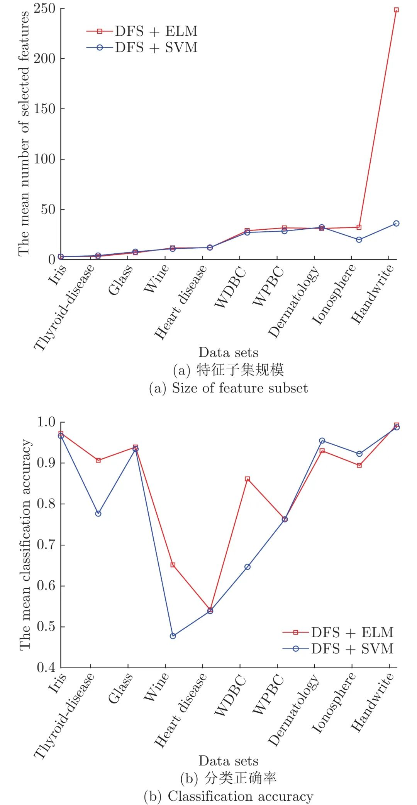
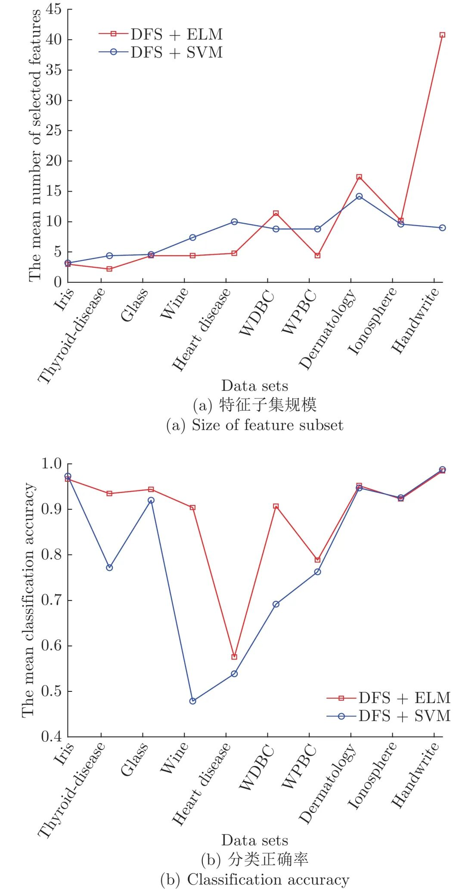
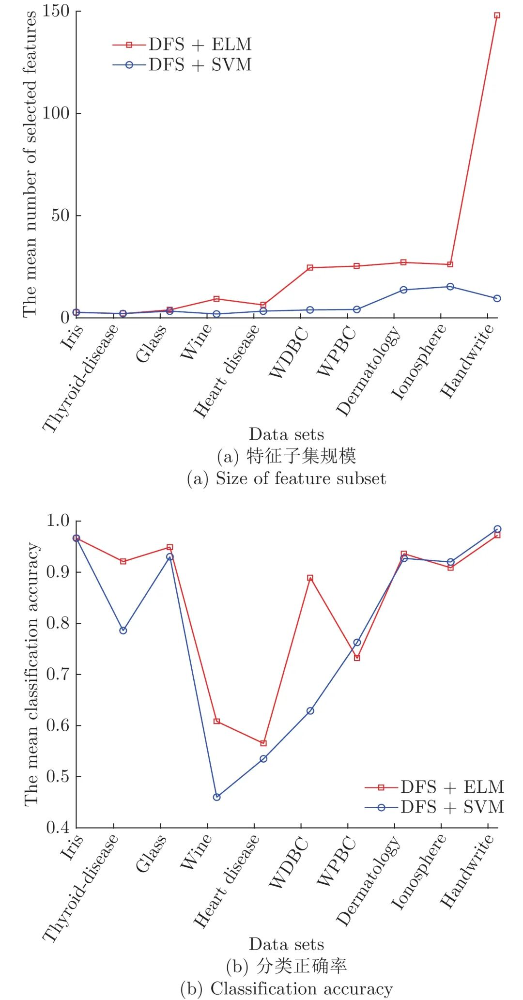
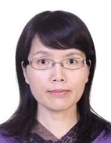

# 一种改进的特征子集区分度评价准则

原创 自动化学报 自动化学报 2022-05-07 16:41 北京

> 原文地址: [https://mp.weixin.qq.com/s/98LE0OTJmTnlhbic9G4SOQ](https://mp.weixin.qq.com/s/98LE0OTJmTnlhbic9G4SOQ)

**点击蓝字 关注我们**

✦

✦

  

**引用本文**

✦

✦

✦

✦

  

谢娟英, 吴肇中, 郑清泉, 王明钊. 一种改进的特征子集区分度评价准则. 自动化学报, 2022, 48(5): 1292−1306 doi: 10.16383/j.aas.c200704

Xie Juan-Ying, Wu Zhao-Zhong, Zheng Qing-Quan, Wang Ming-Zhao. An improved criterion for evaluating the discernibility of a feature subset. Acta Automatica Sinica, 2022, 48(5): 1292−1306 doi: 10.16383/j.aas.c200704

http://www.aas.net.cn/cn/article/doi/10.16383/j.aas.c200704?viewType=HTML

  

**文章简介**

✦

✦

✦

✦

  

✦

**关键词**

✦

  

特征子集区分度, 特征选择, 离散系数, 极限学习机, 特征搜索策略

  

  

✦

**摘   要**

✦

  

针对特征子集区分度准则(Discernibility of feature subsets, DFS)没有考虑特征测量量纲对特征子集区分能力影响的缺陷, 引入离散系数, 提出GDFS (Generalized discernibility of feature subsets)特征子集区分度准则. 结合顺序前向、顺序后向、顺序前向浮动和顺序后向浮动4种搜索策略, 以极限学习机为分类器, 得到4种混合特征选择算法. UCI数据集与基因数据集的实验测试, 以及与DFS、Relief、DRJMIM、mRMR、LLE Score、AVC、SVM-RFE、VMInaive、AMID、AMID-DWSFS、CFR和FSSC-SD的实验比较和统计重要度检测表明: 提出的GDFS优于DFS, 能选择到分类能力更好的特征子集.

  

✦

**引   言**

✦

  

大数据时代的数据不仅样本量剧增, 维数也日益剧增, 引发维数灾难, 增加计算复杂度, 而且冗余和不相关特征使得分类器性能较差, 给数据分析带来挑战. 因此, 特征选择及其评价成为一个研究热点.

  

特征选择旨在发现具有强分类能力且互不相关或尽可能互不相关的少量特征构成特征子集. 特征搜索策略包括完全搜索、随机搜索和启发式搜索3大类. 特征选择算法可分为: Filter, Wrapper, Embedded, Hybrid, 以及Ensemble几大类. Filter方法根据独立于分类器的特征重要性评价准则, 如卡方检验等来判断特征的分类能力, 选择分类性能强的特征构成特征子集. Filter方法独立于学习过程, 速度快, 但需要阈值作为停止准则, 且准确率较低. Wrapper方法依赖于分类器, 需要将训练样本分为训练子集和验证子集两部分, 特征选择则过程中, 以分类器在验证子集的性能判断相应特征子集的分类能力, 选择分类能力强的特征子集. 构建基于特征子集的分类模型, 以测试集对模型进行评价, 从而评价特征子集和相应特征选择算法的性能. Wrapper方法中, 特征选择过程中使用的学习算法完全是一个“黑匣子”. 因此, Wrapper方法依赖于学习过程, 准确率较高, 但计算量大, 且存在过适应风险. Embedded方法通过优化一个目标函数实现特征选择, 特征选择在优化目标函数过程中完成, 不需要将训练样本分成训练子集和验证子集, 但构造合适的优化目标函数困难. Hybrid方法集成Filter方法和Wrapper方法的优势, 采用Filter方法独立于分类器的准则度量特征分类能力大小, 以一定的启发式策略来搜索特征子集, 采用Wrapper方法的以分类器分类性能评价相应特征子集的分类能力. 因此, Hybrid方法得到广泛关注. Ensemble方法集成不同特征选择算法实现特征选择, 一般情况下具有较好性能, 能选择到分类能力较好的特征子集, 但需要训练多个不同分类器.

  

Relief算法是经典的Filter方法, 但只适用于二分类问题. Relief-F算法将Relief由二分类扩展到多分类问题. LVW (Las Vegas wrapper)算法在拉斯维加斯方法(Las Vegas method)框架下使用随机搜索策略实现特征选择. SVM-RFE (SVM-recursive feature elimination)基于SVM (Support vector machine)和后向剔除思想实现特征选择, 是经典的Embedded特征选择算法, 是为解决超高维基因选择问题提出的算法, 但若每次只剔除一个基因, 时间消耗将成为瓶颈. 为此, 作者Guyon指出, 对于超高维基因选择, 每次迭代, 可一次剔除上百个基因, 但她没有给出到底一次剔除多少个基因合适的理论依据和实践指导. mRMR (Max-relevance, min-redundancy)基于特征相关性, 旨在选择到分类能力强且冗余度最小的特征构成特征子集, 但不同的相关性度量可能会得到不同的结果. F-score是衡量特征在两类间分辨能力的有效准则. Xie等将F-score推广用于任意类分类问题, 并提出考虑特征测量量纲的改进F-score特征重要度评价准则D-score, 用于皮肤病诊断. 针对F-score和D-score仅考虑单个特征区分能力, 没有考虑特征联合贡献的问题, 谢等提出了考虑特征联合贡献的特征子集区分度衡量准则DFS (Discernibility of feature subsets), 从而获得分类能力更优的特征子集. LLE Score (Locally linear embedding score)算法通过局部线性嵌入, 实现非线性维约简, 进行肿瘤基因选择. AVC (Feature selection with AUC-based variable complementarity)算法通过最大化变量互补性实现特征选择. 最大化ROC曲线下面积的基因选择算法实现了非平衡基因数据的特征选择. 特征选择算法DRJMIM (Dynamic relevance and joint mutual information maximization)充分考虑特征相关性和特征相互依赖性, 采用动态相关性和最大化联合互信息实现特征选择. 基于邻域粗糙集的特征选择算法基于邻域熵的不确定性度量, 从基因表达数据集中选择差异表达基因实现癌症分类. 谢等对非平衡基因数据的差异表达基因选择进行了系统研究, 提出了16种针对非平衡基因数据的特征选择算法. Li等从数据视图角度对特征选择算法进行总结, 将特征选择算法分为基于相似度的方法、基于信息论的方法、基于稀疏学习的方法, 以及基于统计的方法4大类.

  

特征选择研究已引起研究者广泛关注, 是高维小样本癌症基因数据分析的首要步骤, 也是其他高维数据分析的基础. 然而, 现有特征选择算法对特征分类能力的评价, 多数仅考虑单个特征的分类贡献, 并忽略了特征测量量纲的影响, DFS准则考虑了特征的联合贡献, 但其没有考虑不同测量量纲对特征分类贡献的影响, 值域差异悬殊的特征, 相当于被赋予了差异悬殊的权重, 无法准确度量特征对分类的贡献量. 为此, 提出GDFS (Generalized discernibility of feature subsets)新准则, 引入离散系数对DFS准则进行改进, 客观度量特征子集的分类能力. 以ELM (Extreme learning machine)为分类工具评估特征子集的分类性能. UCI (University of California in Irvine)机器学习数据库数据集和基因数据集的实验测试, 以及与DFS和现有经典特征选择算法的实验比较与统计显著性检测表明, 提出的GDFS特征子集区分度评价准则是一种有效的特征子集分类能力度量准则, 能选择到分类性能很好的特征子集.

  

图 2  DFS+SBS算法的5-折交叉验证实验结果

  

图 3  DFS+SFFS算法的5-折交叉验证实验结果

  

图 4  DFS+SBFS算法的5-折交叉验证实验结果

  

请点击左下角“**阅读原文**”了解更多！

  

**作者简介**

✦

✦

✦

✦

  

**谢娟英**

陕西师范大学计算机科学学院教授. 主要研究方向为机器学习, 数据挖掘, 生物医学大数据分析. 本文通信作者.

E-mail: xiejuany@snnu.edu.cn

**吴肇中**

陕西师范大学计算机科学学院硕士研究生. 主要研究方向为机器学习, 生物医学数据分析.

E-mail: wzz@snnu.edu.cn

**郑清泉**

陕西师范大学计算机科学学院硕士研究生. 主要研究方向为数据挖掘, 生物医学数据分析.

E-mail: zhengqingqsnnu@163.com

**王明钊**

陕西师范大学生命科学学院博士研究生. 2017 年获得陕西师范大学计算机科学学院硕士学位. 主要研究方向为生物信息学.

E-mail: wangmz2017@snnu.edu.cn

  

**相关文章**

✦

✦

✦

✦

  

**（请向上滑动阅读）**

  

\[1\]  刘卓, 汤健, 柴天佑, 余文. 基于多模态特征子集选择性集成建模的磨机负荷参数预测方法. 自动化学报, 2021, 47(8): 1921-1931. doi: 10.16383/j.aas.c190735

http://www.aas.net.cn/cn/article/doi/10.16383/j.aas.c190735?viewType=HTML

  

\[2\]  张万栋, 李庆忠, 黎明, 武庆明. 基于最优误差自校正极限学习机的高频地波雷达RD谱图海面目标检测算法. 自动化学报, 2021, 47(1): 108-120. doi: 10.16383/j.aas.c180210

http://www.aas.net.cn/cn/article/doi/10.16383/j.aas.c180210?viewType=HTML

  

\[3\]  贾鹤鸣, 李瑶, 孙康健. 基于遗传乌燕鸥算法的同步优化特征选择. 自动化学报. doi: 10.16383/j.aas.c200322

http://www.aas.net.cn/cn/article/doi/10.16383/j.aas.c200322?viewType=HTML

  

\[4\]  陈晓云, 廖梦真. 基于稀疏和近邻保持的极限学习机降维. 自动化学报, 2019, 45(2): 325-333. doi: 10.16383/j.aas.2018.c170216

http://www.aas.net.cn/cn/article/doi/10.16383/j.aas.2018.c170216?viewType=HTML

  

\[5\]  徐德. 单目视觉伺服研究综述. 自动化学报, 2018, 44(10): 1729-1746. doi: 10.16383/j.aas.2018.c170715

http://www.aas.net.cn/cn/article/doi/10.16383/j.aas.2018.c170715?viewType=HTML

  

\[6\]  许夙晖, 慕晓冬, 柴栋, 罗畅. 基于极限学习机参数迁移的域适应算法. 自动化学报, 2018, 44(2): 311-317. doi: 10.16383/j.aas.2018.c160818

http://www.aas.net.cn/cn/article/doi/10.16383/j.aas.2018.c160818?viewType=HTML

  

\[7\]  孙广路, 宋智超, 刘金来, 朱素霞, 何勇军. 基于最大信息系数和近似马尔科夫毯的特征选择方法. 自动化学报, 2017, 43(5): 795-805. doi: 10.16383/j.aas.2017.c150851

http://www.aas.net.cn/cn/article/doi/10.16383/j.aas.2017.c150851?viewType=HTML

  

\[8\]  徐嘉明, 张卫强, 杨登舟, 刘加, 夏善红. 基于流形正则化极限学习机的语种识别系统. 自动化学报, 2015, 41(9): 1680-1685. doi: 10.16383/j.aas.2015.c140916

http://www.aas.net.cn/cn/article/doi/10.16383/j.aas.2015.c140916?viewType=HTML

  

\[9\]  周全, 王磊, 周亮, 郑宝玉. 基于多尺度上下文的图像标注算法. 自动化学报, 2014, 40(12): 2944-2949. doi: 10.3724/SP.J.1004.2014.02944

http://www.aas.net.cn/cn/article/doi/10.3724/SP.J.1004.2014.02944?viewType=HTML

  

\[10\]  侯杰, 茅耀斌, 孙金生. 基于指数损失和0-1损失的在线Boosting算法. 自动化学报, 2014, 40(4): 635-642. doi: 10.3724/SP.J.1004.2014.00635

http://www.aas.net.cn/cn/article/doi/10.3724/SP.J.1004.2014.00635?viewType=HTML

  

\[11\]  冯定成, 陈峰, 徐文立. 一种基于局部流形结构的无监督特征学习方法. 自动化学报, 2014, 40(10): 2253-2261. doi: 10.3724/SP.J.1004.2014.02253

http://www.aas.net.cn/cn/article/doi/10.3724/SP.J.1004.2014.02253?viewType=HTML

  

\[12\]  桂卫华, 阳春华, 徐德刚, 卢明, 谢永芳. 基于机器视觉的矿物浮选过程监控技术研究进展. 自动化学报, 2013, 39(11): 1879-1888. doi: 10.3724/SP.J.1004.2013.01879

http://www.aas.net.cn/cn/article/doi/10.3724/SP.J.1004.2013.01879?viewType=HTML

  

\[13\]  刘建伟, 李双成, 罗雄麟. p范数正则化支持向量机分类算法. 自动化学报, 2012, 38(1): 76-87. doi: 10.3724/SP.J.1004.2012.00076

http://www.aas.net.cn/cn/article/doi/10.3724/SP.J.1004.2012.00076?viewType=HTML

  

\[14\]  徐丹蕾, 杜兰, 刘宏伟, 洪灵, 李彦兵. 一种基于变分相关向量机的特征选择和分类结合方法. 自动化学报, 2011, 37(8): 932-943. doi: 10.3724/SP.J.1004.2011.00932

http://www.aas.net.cn/cn/article/doi/10.3724/SP.J.1004.2011.00932?viewType=HTML

  

\[15\]  刘峤, 秦志光, 陈伟, 张凤荔. 基于零范数特征选择的支持向量机模型. 自动化学报, 2011, 37(2): 252-256. doi: 10.3724/SP.J.1004.2011.00252

http://www.aas.net.cn/cn/article/doi/10.3724/SP.J.1004.2011.00252?viewType=HTML

  

\[16\]  崔潇潇, 王贵锦, 林行刚. 基于Adaboost权值更新以及K-L距离的特征选择算法. 自动化学报, 2009, 35(5): 462-468. doi: 10.3724/SP.J.1004.2009.00462

http://www.aas.net.cn/cn/article/doi/10.3724/SP.J.1004.2009.00462?viewType=HTML

  

\[17\]  曹媛媛, 杨波, 徐光祐. 基于分形纹理特征和小波变换的网状纹理检测方法. 自动化学报, 2007, 33(7): 688-692. doi: 10.1360/aas-007-0688

http://www.aas.net.cn/cn/article/doi/10.1360/aas-007-0688?viewType=HTML

  

\[18\]  张鸿宾, 孙广煜. Tabu搜索在特征选择中的应用. 自动化学报, 1999, 25(4): 457-466.

http://www.aas.net.cn/cn/article/id/16707?viewType=HTML

  

\[19\]  章新华. 一种特征选择的动态规划方法. 自动化学报, 1998, 24(5): 675-680.

http://www.aas.net.cn/cn/article/id/16781?viewType=HTML

  

\[20\]  徐雷. 模拟退火组合优化法在模式识别中的若干应用. 自动化学报, 1989, 15(2): 114-121.

http://www.aas.net.cn/cn/article/id/14920?viewType=HTML

  

  

**近期文章**

✦

✦

✦

✦

  

[支持数据隐私保护的联邦深度神经网络模型研究](http://mp.weixin.qq.com/s?__biz=MzAwMzAzMDgxOA==&mid=2651077039&idx=1&sn=679f6b0a5a6a97ad2564e590bd534072&chksm=8131f3e2b6467af447638b7d6e7312046f128019c857cf8e79609736f5d57849cfa2c34f8ba4&scene=21#wechat_redirect)

[【热点专题】多目标优化](http://mp.weixin.qq.com/s?__biz=MzI2NjA3MzM5MA==&mid=2649962438&idx=1&sn=83b21f7b6a63fc4e01c2f4718b2aae92&chksm=f2943387c5e3ba91ce32286c06f215a989233f55bbbd5c7d436a43c40615bb5ae208d0f0f228&scene=21#wechat_redirect)

[联合样本输出与特征空间的半监督概念漂移检测法及其应用](http://mp.weixin.qq.com/s?__biz=MzAwMzAzMDgxOA==&mid=2651076994&idx=1&sn=4e40a43610e5879752437474d12ea2c8&chksm=8131f3cfb6467ad9f54ad169a3857897807584e30d02dbbf83c75664398d19992c1b95fb6be2&scene=21#wechat_redirect)

[面向行人重识别的局部特征研究进展、挑战与展望](http://mp.weixin.qq.com/s?__biz=MzAwMzAzMDgxOA==&mid=2651076994&idx=2&sn=2f1fe243ff0cc599548f9c1d238b4a59&chksm=8131f3cfb6467ad93a3228636e3780da17bb32b7383faa4e5746adab8a53db9281d1894c160c&scene=21#wechat_redirect)

[基于多智能体强化学习的乳腺癌致病基因预测](http://mp.weixin.qq.com/s?__biz=MzAwMzAzMDgxOA==&mid=2651076931&idx=1&sn=a62942cd056156ad5a885d6350e8b373&chksm=8131f30eb6467a18ffbee77b25fb9b0417b08918d3625d04c89a3a9bcb1490eece239c5fda25&scene=21#wechat_redirect)

[一种基于深度迁移学习的滚动轴承早期故障在线检测方法](http://mp.weixin.qq.com/s?__biz=MzAwMzAzMDgxOA==&mid=2651076931&idx=2&sn=128b1673843353529d8b130f372bb46f&chksm=8131f30eb6467a18e0f645b207ada16cd601b791297b32b1caccf72daa50b55063074ec4fdc3&scene=21#wechat_redirect)

[水下多机器人系统综述](http://mp.weixin.qq.com/s?__biz=MzAwMzAzMDgxOA==&mid=2651076668&idx=1&sn=b50e43710be8208fd711cd45943e95c0&chksm=8131f271b6467b675083610c925ce0d329e201ddab5c8e935eb266fbf41418395459fdd0618d&scene=21#wechat_redirect)

[《自动化学报》多名作者入选爱思唯尔2021中国高被引学者](http://mp.weixin.qq.com/s?__biz=MzAwMzAzMDgxOA==&mid=2651076637&idx=1&sn=ee78f108cf0551024cb95c33241a5f1d&chksm=8131f250b6467b46c8d4af1bd63381328a80c65ade97a6daa97e3bb4538b39c6f761da238066&scene=21#wechat_redirect)

[基于事件触发的离散MIMO系统自适应评判容错控制](http://mp.weixin.qq.com/s?__biz=MzAwMzAzMDgxOA==&mid=2651076863&idx=1&sn=aec9cf55a1b0b8eae741999601a8c6df&chksm=8131f2b2b6467ba4c20d388390d4ac191555e5d00d77f510f72af77359d18bdca5230ea52df0&scene=21#wechat_redirect)

[一种脑肢融合的神经康复训练在线评价与调整方法](http://mp.weixin.qq.com/s?__biz=MzAwMzAzMDgxOA==&mid=2651076801&idx=1&sn=01be1c22a480f6d2c52e4afcf7c173d8&chksm=8131f28cb6467b9af8e33ff70860ff2731c797d27cbbda568088b6d17a41ae07d38ebb59a0e5&scene=21#wechat_redirect)

[基于自适应LASSO先验的稀疏贝叶斯学习算法](http://mp.weixin.qq.com/s?__biz=MzAwMzAzMDgxOA==&mid=2651076733&idx=1&sn=01ccbc6fe6e387330aa93ae1a2a11953&chksm=8131f230b6467b260036bbc1efe3db2924397a4e7ba2f683e2e0c4819805906180d44529244a&scene=21#wechat_redirect)  

[眼动跟踪研究进展与展望](http://mp.weixin.qq.com/s?__biz=MzAwMzAzMDgxOA==&mid=2651076581&idx=1&sn=dab1369362bf1790033e5cf2f5736281&chksm=8131fda8b64674be08cbf0bf3bf5a928115b76ec24e8000cad36820b039d33dedba8a048210e&scene=21#wechat_redirect)

  

**热点文章**

✦

✦

✦

✦

  

[【热点专题】多目标优化](http://mp.weixin.qq.com/s?__biz=MzI2NjA3MzM5MA==&mid=2649962438&idx=1&sn=83b21f7b6a63fc4e01c2f4718b2aae92&chksm=f2943387c5e3ba91ce32286c06f215a989233f55bbbd5c7d436a43c40615bb5ae208d0f0f228&scene=21#wechat_redirect)

[基于事件触发的分布式优化算法](http://mp.weixin.qq.com/s?__biz=MzAwMzAzMDgxOA==&mid=2651076142&idx=2&sn=b074793ec4be44ea08efb78617dcdcc0&chksm=8131fc63b6467575b7f6d698909e56be16089f8f56ca415294483ff6f40902c7546417f82531&scene=21#wechat_redirect)

[一种针对德州扑克AI的对手建模与策略集成框架](http://mp.weixin.qq.com/s?__biz=MzAwMzAzMDgxOA==&mid=2651075800&idx=1&sn=9ab9006d50bb2513c49006b1c1431a3c&chksm=8131fe95b6467783eb58de5d7b1726ddcb881561603c76bdcefa44f4a9a9027afc37b1be979c&scene=21#wechat_redirect)

[工业铸件缺陷无损检测技术的应用进展与展望](http://mp.weixin.qq.com/s?__biz=MzAwMzAzMDgxOA==&mid=2651075561&idx=1&sn=afda9a46702ab802788e1c9fc67b5849&chksm=8131f9a4b64670b2c122efca37574a0dceda3582b0477845b80670246b4eb8befce2ae748dc1&scene=21#wechat_redirect)

[CVPR 2022 | 自动化所新作速览！（上）](http://mp.weixin.qq.com/s?__biz=MzAwMzAzMDgxOA==&mid=2651075034&idx=2&sn=48b5232daaa7a51da96c3a7c87013e2d&chksm=8131fb97b6467281dc8e02749df8d0388f89d30e3b08f44d13c700169d1d7a22c4feef9f2dba&scene=21#wechat_redirect)

[CVPR 2022 | 自动化所新作速览！（下）](http://mp.weixin.qq.com/s?__biz=MzAwMzAzMDgxOA==&mid=2651075034&idx=3&sn=21833bb312bb0d9826c64c9fce068aa5&chksm=8131fb97b646728147f2bff58a04230d708d5a4537eb824656c2d54580b11f6a47b0eb30ade6&scene=21#wechat_redirect)

[直播回放分享 | 陈关荣教授：探索最优同步网络的拓扑结构](http://mp.weixin.qq.com/s?__biz=MzIxMjA5Njg2Nw==&mid=2649061608&idx=1&sn=1500a81260d8f5127b7cb7767c759fba&chksm=8f5a9ae4b82d13f201b714d8e96af9bbddf442bb7e10c97416fb925ab2170c05fa12010fb1d1&scene=21#wechat_redirect)

[《自动化学报》2019年高关注论文](http://mp.weixin.qq.com/s?__biz=MzAwMzAzMDgxOA==&mid=2651073450&idx=1&sn=6f57bd0df73f259aa416575f1f69bdfb&chksm=8131e1e7b64668f1344de4acdef6148e8dcfa60c80e4f48e6cb1270558c2beade5601e92d05c&scene=21#wechat_redirect)

[《自动化学报》2021年热点文章回顾](http://mp.weixin.qq.com/s?__biz=MzAwMzAzMDgxOA==&mid=2651072577&idx=1&sn=4e6be077d7371c7d29d9a371d8defe19&chksm=8131e20cb6466b1aec2f3b8b1063d3be11725ca9a0c15785c3b42a638170e732acd0d8d345e0&scene=21#wechat_redirect)

[国家自然科学基金论文精选](http://mp.weixin.qq.com/s?__biz=MzI2NjA3MzM5MA==&mid=2649960308&idx=1&sn=1634c999f22588333537f13393403f9c&chksm=f2942b35c5e3a2232e86b51c2b7c8f37a4d3d7f858d370d76d5afd00567d7da6e9543476d120&scene=21#wechat_redirect)  

[国家重点研发计划论文精选](http://mp.weixin.qq.com/s?__biz=MzI2NjA3MzM5MA==&mid=2649960255&idx=1&sn=f48435928fd924134cb72014860b9d00&chksm=f2942b7ec5e3a26869da68a1419b3b40ca1e6cb98abf2e380d78a49ffb99c85991d76cc346b0&scene=21#wechat_redirect)

  

**期刊动态**

✦

✦

✦

✦

  

[《自动化学报》多名作者入选爱思唯尔2021中国高被引学者](http://mp.weixin.qq.com/s?__biz=MzAwMzAzMDgxOA==&mid=2651076637&idx=1&sn=ee78f108cf0551024cb95c33241a5f1d&chksm=8131f250b6467b46c8d4af1bd63381328a80c65ade97a6daa97e3bb4538b39c6f761da238066&scene=21#wechat_redirect)

[自动化学报（英文版）和自动化学报入选计算领域高质量科技期刊T1类](http://mp.weixin.qq.com/s?__biz=MzAwMzAzMDgxOA==&mid=2651073859&idx=2&sn=7a9192717637dcf6cddb39ed961e8c3b&chksm=8131e70eb6466e188a123c504bdeba80c75681de4762f8685b3bf584bc33eb12362c70613b4e&scene=21#wechat_redirect)

[《自动化学报》编辑部防诈骗公告](http://mp.weixin.qq.com/s?__biz=MzAwMzAzMDgxOA==&mid=2651073517&idx=1&sn=c52de7c685e546af9faffc0cefab1c85&chksm=8131e1a0b64668b63ebaa68ea81cbaec3b94dc52ea8360821a0a49e67ae7e4b428a25d0f19c5&scene=21#wechat_redirect)

[《自动化学报》致谢审稿人](http://mp.weixin.qq.com/s?__biz=MzI2NjA3MzM5MA==&mid=2649961201&idx=1&sn=3142842d75c441ae860c1ecb313c7657&chksm=f29436b0c5e3bfa6c679210f60513eb1a7205dc20fe028f482bb593eac60427e4e56fba12493&scene=21#wechat_redirect)

[自动化学报多篇论文入选中国百篇最具影响国内论文和中国精品期刊顶尖论文](http://mp.weixin.qq.com/s?__biz=MzI2NjA3MzM5MA==&mid=2649961152&idx=1&sn=4a5e9e4b84879f4cde4e13a0ef97272c&chksm=f2943681c5e3bf97d7770c9623dac869b283b3ea83f3d320017974033e361d8b999134a8bdff&scene=21#wechat_redirect)

[自动化学报各项主要指标蝉联第1，再获百种中国杰出期刊称号](http://mp.weixin.qq.com/s?__biz=MzI2NjA3MzM5MA==&mid=2649960903&idx=1&sn=7da8b8a0167e16bcbaa1f00fbfb69782&chksm=f2943586c5e3bc9014f6d4fff7147b998ae42b4da452907e641e8029f296fd2413b4f17aef62&scene=21#wechat_redirect)

  

**期刊目录**

✦

✦

✦

✦

  

[2022年第04期](http://mp.weixin.qq.com/s?__biz=MzI2NjA3MzM5MA==&mid=2649962369&idx=1&sn=ae2c4584f8904be917b600e67005ae03&chksm=f29433c0c5e3bad6d78382b3c09015aadb09e040b8fc8c319c4f554fd592fe677797000340cd&scene=21#wechat_redirect)

[2022年第03期](http://mp.weixin.qq.com/s?__biz=MzAwMzAzMDgxOA==&mid=2651075527&idx=1&sn=bc020c5fd09080243f7527610b003507&chksm=8131f98ab646709c2f485852b526989a3b9af5cc93e8afb508d9239b78176f49caa9807d6a8d&scene=21#wechat_redirect)

[2022年第02期](http://mp.weixin.qq.com/s?__biz=MzI2NjA3MzM5MA==&mid=2649961838&idx=1&sn=29334896aa0f372b70312250c75b6b20&chksm=f294312fc5e3b8392ffd49100eaba435bf48fa9234c5019fe7b16ed1e4ebef70be58691f3fb3&scene=21#wechat_redirect)

[2022年第01期](http://mp.weixin.qq.com/s?__biz=MzI2NjA3MzM5MA==&mid=2649961423&idx=1&sn=3b65958faa7c7f94c247f46dd72bd71e&chksm=f294378ec5e3be9825f860d132c36c97f3e877089449cb1fe85a6d1e7da9bd0e24795336bc54&scene=21#wechat_redirect)

[《自动化学报》2021年全年合集](http://mp.weixin.qq.com/s?__biz=MzAwMzAzMDgxOA==&mid=2651072770&idx=1&sn=7c531f7fa3bc390558fab15b339ce86e&chksm=8131e34fb6466a59ed079448fddda0fc9f97066460bff8f6835288003a1fba2812de383813c1&scene=21#wechat_redirect)

[《自动化学报》2020年全年合集](http://mp.weixin.qq.com/s?__biz=MzI2NjA3MzM5MA==&mid=2649957972&idx=1&sn=1951847aacbcb7d22bdd2a46a79af871&chksm=f2942215c5e3ab03d070d8e52b8764b38036897c97b6a26c7a1f918c806b28edbe6c0fbf7ea9&scene=21#wechat_redirect)

[2020年第10期 工业人工智能专题](http://mp.weixin.qq.com/s?__biz=MzI2NjA3MzM5MA==&mid=2649957201&idx=1&sn=ab82a767bd716ab67fdf2942500d8b61&chksm=f2942710c5e3ae06b27f9e63a5e329a1123d90b051164e6b6123c500230541b1ed12d92abbfb&scene=21#wechat_redirect)

[2020年第09期 分布式信息能源系统理论与应用专题](http://mp.weixin.qq.com/s?__biz=MzI2NjA3MzM5MA==&mid=2649956412&idx=1&sn=8ebc13d63fd333ad85dbb8b5825df248&chksm=f294247dc5e3ad6ba297857a5b957e97cf499266c50318791fa8abd9432ecf1d9c3d9b287e36&scene=21#wechat_redirect)

  

  

  

**长按二维码｜关注我们**

**IEEE/CAA Journal of Automatica Sinica (JAS)**

**长按二维码｜关注我们**

**《自动化学报》服务号**

**长按二维码｜关注我们**

**《自动化学报》订阅号**  

  

**联系我们**

**网站:** 

http://www.aas.net.cn

http://www.ieee-jas.net

**投稿:** 

https://mc03.manuscriptcentral.com/aas-cn   

https://mc03.manuscriptcentral.com/ieee-jas 

**电话:**

010-82544653（日常咨询和稿件处理） 

010-82544677（录用后稿件处理）

**邮箱:** 

aas@ia.ac.cn（日常咨询和稿件处理）  

aas\_editor@ia.ac.cn（录用后稿件处理）

**博客:** 

http://blog.sina.com.cn/aaseditor 

  

**↓ 点击下方 阅读原文 了解更多**