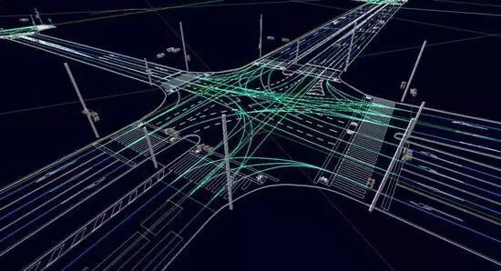

# 一类新型动态多目标鲁棒进化优化方法

原创 自动化学报 2018-01-24 14:20 北京

> 原文地址: [https://mp.weixin.qq.com/s/f4FMTKmaDTzvQhhH65TwSA](https://mp.weixin.qq.com/s/f4FMTKmaDTzvQhhH65TwSA)

现实生产生活中的许多优化问题，往往受生产工况、运行环境等动态变化因素的影响，形成动态优化问题(Dynamic optimization problems, DOPs)。

物流调度、生产优化控制、工程设计，以及路径规划等诸多领域的实际优化问题。以车辆路径规划为例，**一方面**，车辆所承担的运输任务数量可能发生增减；**另一方面**，道路拥堵状况和天气等运行环境也可能发生动态变化。这些时变因素，会以时变参数、数量或形式变化的目标函数或决策变量反映在优化问题描述中。在工程优化设计问题中，衡量设计方案质量或成本的性能指标，往往跟随方案运行条件发生动态变化。

来自网络  

为解决该类问题，研究人员提出跟踪最优解(Track the moving optima，TMO)的方法。**TMO方法是指**，当优化问题发生动态改变时，重新触发寻优过程，以快速、准确地找到适应于新优化模型的最优解。在该思想构架下，研究人员围绕环境探测、预测机制、多种群进化、保持多样性等核心问题，开展了丰富多样的算法研究，取得了丰硕的研究成果。特别是，研究人员将模拟生物进化和其行为方式的各类智能优化方法，引入到动态优化问题的求解中，形成了众多动态进化优化方法。这些方法可以在优化问题发生动态变化时，通过进化迭代过程，尽快找到新问题的最优解。显然，基于TMO 的动态进化优化方法希望以尽可能小的计算代价，来高效追踪动态变化后优化问题的真实最优解。

然而，该类方法在求解动态优化问题时，往往会遇到以下问题。**其一**，准确判断优化问题发生了动态变化，是实施TMO 方法的前提。但是，动态优化问题的变化多样性，导致准确且快速探测环境变化还存在很多困难；**其二**，当动态优化问题中的时变因素变化频率较快时，基于TMO 的动态优化方法需要被频繁触发。特别是，对于复杂或搜索空间较大的动态优化问题，其进化求解过程比较耗时，往往很难在有限时间内获得问题的最优解或者令人满意的较优解；**其三**，针对某些动态优化问题，比如生产调度和路径规划，当动态因素发生变化时，就去执行寻优获得的新最优解，往往需要调整众多相关人员或资源。导致耗费的成本巨大。

来自网络

基于此，本文给出了一种解决动态优化问题的动态鲁棒优化方法。**其核心思想**是面向连续变化环境下的动态优化问题，找到用户可以接受的一组基于时间的鲁棒最优解序列(Robust Pareto optima over time, RPOOT)。当环境发生变化时，根据用户可接受程度，直接采用相邻前一环境下的鲁棒解作为当前环境下的较优解，而不是重新寻找新环境下的最优解。RPOOT可以有效降低新环境下优化问题的寻优代价，满足生产实际中有限资源调配的需求。

引用格式

陈美蓉, 郭一楠, 巩敦卫, 杨振. 一类新型动态多目标鲁棒进化优化方法. 自动化学报, 2017, 43(11): 2014-2032

作者简介

**陈美蓉**

中国矿业大学博士研究生。主要研究方向为进化计算。

E-mail: cmrzl@126.com

**郭一楠** 

中国矿业大学信息与控制工程学院教授。主要研究方向为智能优化算法与控制，数据挖掘与知识发现。本文通信作者。

E-mail:nanfly@126.com 

**巩敦卫** 

中国矿业大学信息与控制工程学院教授。主要研究方向为进化计算与应用。

E-mail: dwgong@vip.163.com 

**杨振** 

中国矿业大学信息与控制工程学院硕士研究生。主要研究方向为多目标进化优化。

E-mail: yangzhen.cumt@foxmail.com

欢迎扫描二维码、长按图片识别关注《自动化学报》中文版订阅号aas1963，服务号自动化学报和英文版服务号！

JAS《自动化学报》（英文版）

自动化学报服务号

自动化学报订阅号

  

联系我们

Tel:  010-82544653（日常咨询和稿件处理） 

        010-82544677（录用后稿件处理）

Fax: 010-82544497

Email: aas@ia.ac.cn（日常咨询和稿件处理）

          aas\_editor@ia.ac.cn（录用后稿件处理）

http://www.aas.net.cn

更多精彩内容，尽在阅读原文