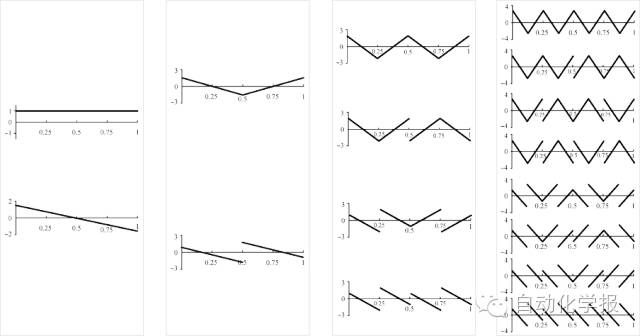
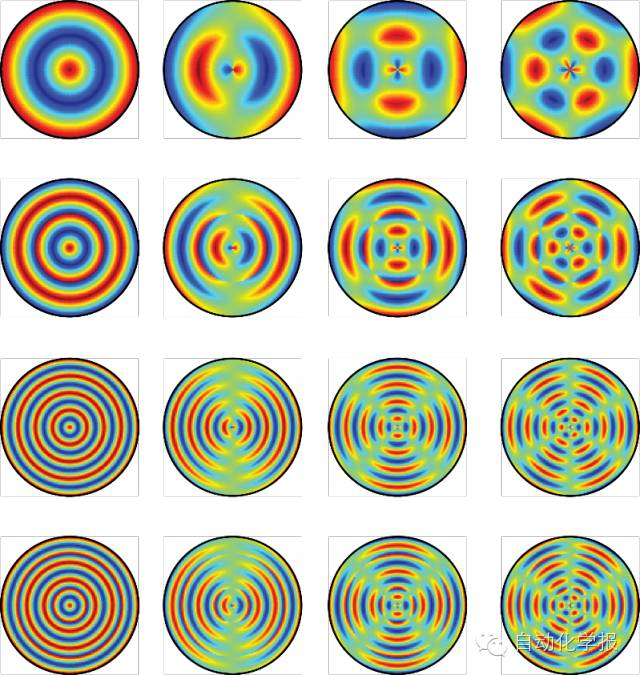
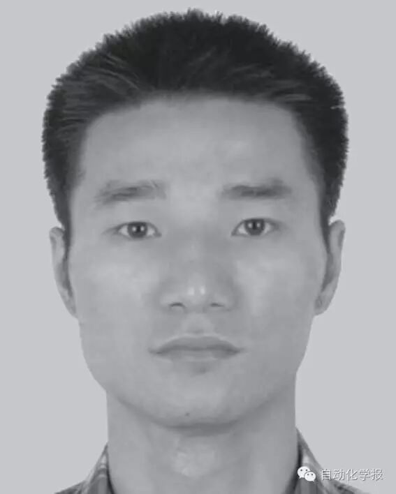

# 二维旋转不变U 变换及其应用

原创 自动化学报 2016-10-09 18:48 北京

> 原文地址: [https://mp.weixin.qq.com/s/OoFYAnvf\_oLhsPFf3e6IcQ](https://mp.weixin.qq.com/s/OoFYAnvf_oLhsPFf3e6IcQ)

图像的旋转不变性在目标表达与识别中具有基本的重要性。传统的Zernike矩等矩特征是一类旋转不变量，已被广泛应用于模式识别、边缘检测、图像匹配等领域，其核心算法是将图像目标投影到一个由多项式函数系支撑的函数空间中。不足之处有：1）多项式的表达式非常复杂，包含若干阶乘项，导致计算复杂度高，数值不稳定；2）多项式基函数在区间上震荡分布非常不均匀，影响图像特征提取；3）多项式基函数的零点数目偏少，导致它捕获图像高频成份能力弱。

本文中我们引入一类新的正交分段多项式函数系-U系统，替代了传统的矩特征中的多项式基函数，构造了一类二维旋转不变U变换（Rotation-invariant U transform, RIUT）。前16个1次U-系统基函数的图像如图1所示，部分RIUT基函数如图1所示。基于U-系统的诸多特殊性质，RIUT能够有效地克服上述传统方法的缺点。最后，将RIUT应用于二值图像检索中，实验结果表明本文的方法比传统方法具有更高的检索精度。

图1 U-系统基函数（前16项）

图2 部分RIUT基函数

引用格式

陈伟. 二维旋转不变U 变换及其应用. 自动化学报, 2016, 42(9): 1380-1388

作者简介

陈伟 江南大学数字媒体学院讲师.2013 年获得澳门科技大学理学博士学位. 主要研究方向为计算机图形学和图像处理. 

E-mail: wchen\_jdsm@163.com

欢迎扫描二维码、长按图片识别关注《自动化学报》中文版订阅号aas1963，服务号自动化学报和英文版服务号！

