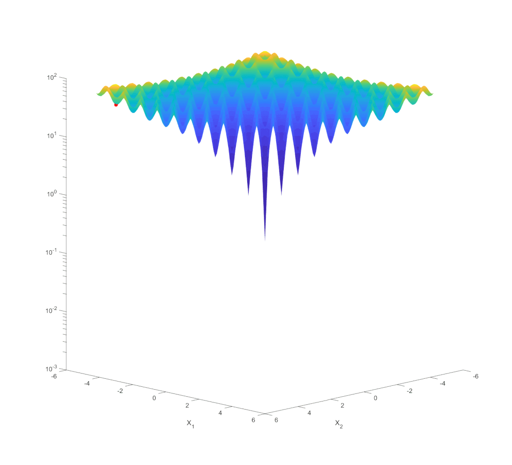
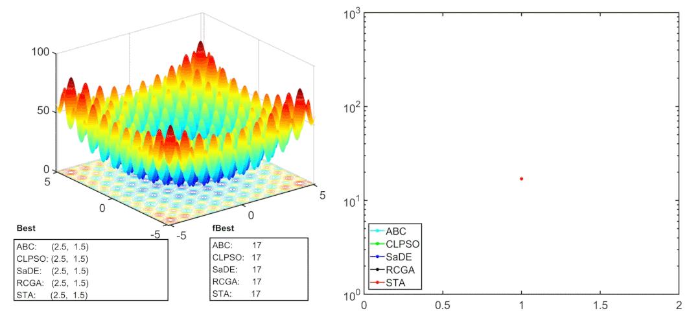
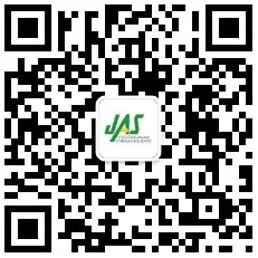

# 周晓君, 阳春华, 桂卫华. 状态转移算法原理与应用

原创 自动化学报 自动化学报 2021-01-08 15:55 北京

> 原文地址: [https://mp.weixin.qq.com/s/DemIwCDkwrPSWJCF7\_KaXw](https://mp.weixin.qq.com/s/DemIwCDkwrPSWJCF7_KaXw)

**点击蓝字**丨**关注我们**

周晓君, 阳春华, 桂卫华. 状态转移算法原理与应用. 自动化学报, 2020, 46(11): 2260−2274

_http://www.aas.net.cn/cn/article/doi/10.16383/j.aas.c190624_

**背景介绍**

自上世纪70年代美国密歇根大学约翰·霍兰德教授最早提出的遗传算法以来，以遗传算法为代表的智能优化算法得到了长足的发展，涌现了诸如模拟退火、蚁群算法、粒子群优化等众多新型智能优化算法，正在成为智能科学、信息科学、人工智能中最为活跃的研究方向之一，并在诸多工程领域得到迅速推广和应用。目前大多数智能优化算法都是以行为主义模仿学习为主，通过模拟自然界鸟群、蜂群、鱼群等生物进化来求解复杂优化问题。然而，基于行为主义的智能优化算法主要是模仿，带有一定的机械性和盲从性。一方面，这种基于模仿表象学习的方法造成算法的可扩展性差，大多数智能优化算法在某些问题上低维时表现良好，维度变高时效果显著变差；另一方面，它使得算法容易出现诸如停滞或早熟收敛等现象，即算法可能停滞在任意随机点，而不是数学意义上的最优解。为了消除已有智能优化算法容易陷入停滞现象、提高算法的可扩展性和拓宽智能优化算法的应用范围，周晓君博士于2012年原创性地提出了一种基于结构化学习的新型智能优化算法——状态转移算法。

**状态转移算法原理介绍**

状态转移算法是一种基于结构化学习的智能型随机性全局优化算法，它抓住最优化算法的本质、目的和要求，以全局性、最优性、快速性、收敛性、可控性五大核心结构要素为体系框架。它的基本思想是将最优化问题的一个解看成是一个状态，解的迭代更新过程看成是状态转移过程，利用现代控制理论中的离散时间状态空间表达式来作为产生候选解的统一框架，基于此框架来设计状态变换算子。与大多数基于种群的进化算法不同，标准的状态转移算法是一种基于个体的进化算法，它基于给定当前解，通过采样方式，多次独立运行某种状态变换算子产生候选解集，并与当前解进行比较，迭代更新当前解，直到满足某种终止条件。值得一提的是，状态转移算法中的每种状态变换算子都能够产生具有规则形状、可控大小的几何邻域，它设计了包括旋转变换、平移变换、伸缩变换、坐标轴搜索等不同的状态变换算子以满足全局搜索、局部搜索以及启发式搜索等功能需要，并且以交替轮换的方式适时地使用各种不同算子，使得状态转移算法能够在概率意义上很快找到全局最优解。

  

_状态转移算法迭代过程_

**智能优化算法对比**

通过常见的标准测试Rastrigin函数，下面展示了标准状态转移算法STA与其它智能优化算法，包括人工蜂群算法（ABC）、粒子群优化算法（CLPSO）、差分进化算法（SaDE）和遗传算法（RCGA）在该函数上寻优性能对比。可以看出，跟先进的遗传算法、粒子群优化算法、差分进化算法等智能优化算法相比，状态转移算法具有全局搜索能强、寻优速度快、扩展性好、可控性高等显著优点。

  

_智能优化算法对比_

**本文工作**

本文系统地阐述了状态转移算法的基本原理和内在特性, 详细介绍了状态转移算法的演变与提升, 包括离散、约束与多目标状态转移算法, 状态转移算法参数分析与优化、算子拓展与智能化策略等内容, 并从非线性系统辨识、工业过程控制、机器学习与数据挖掘等方面重点介绍了状态转移算法的应用.

**结论与展望**

与常规的基于行为主义模仿学习为主的智能优化算法不同，状态转移算法是一种基于结构主义学习的新型智能全局优化算法，它抓住最优化算法的本质、目的和要求, 从而不会陷入停滞点，不容易陷入局部最优，且具有全局搜索能强、寻优速度快、扩展性好、可控性高等显著优点。本文系统地阐述了状态转移算法的基本原理和内在特性，并从理论研究与应用研究两方面对状态转移算法进行了详细介绍，目前状态转移算法在有色冶金过程建模与优化控制中得到了很好的应用，在其他领域的研究也有待进一步拓展。

  

**作者简介**

  

**周晓君**

中南大学自动化学院副教授. 2014 年获得澳大利亚联邦大学应用数学博士学位. 主要研究方向为复杂工业过程建模、优化与控制, 最优化理论与算法, 状态转移算法, 对偶理论及其应用.

E-mail: michael.x.zhou@csu.edu.

cn

**阳春华**

中南大学自动化学院教授.2002 年获得中南大学博士学位. 主要研究方向为复杂工业过程建模与优化, 分析检测与自动化装置, 智能自动化系统. 本文通信作者.

E-mail: ychh@csu.edu.cn

**桂卫华**

中国工程院院士, 中南大学自动化学院教授. 1981 年获得中南矿冶学院硕士学位. 主要研究方向为流程工业智能制造, 复杂工业过程建模,优化与控制应用和知识自动化.

E-mail: gwh@csu.edu.cn

  

**期刊目录**

[2020年第12期](http://mp.weixin.qq.com/s?__biz=MzI2NjA3MzM5MA==&mid=2649957715&idx=1&sn=95480c6acd1c8e73389e4d716cc32813&chksm=f2942112c5e3a8047d3c3ad7413d75882120ff676fda831b53ec1a8e5e9f30da80b2a1586847&scene=21#wechat_redirect)

[2020年第11期](http://mp.weixin.qq.com/s?__biz=MzI2NjA3MzM5MA==&mid=2649957411&idx=1&sn=5ca87461c530768b126c09e118731593&chksm=f2942062c5e3a974dd97073a022c8ac0e79fa5b31412aaea45dcd58d86a792930f9d2a07f973&scene=21#wechat_redirect)

[2020年第10期 工业人工智能专题](http://mp.weixin.qq.com/s?__biz=MzI2NjA3MzM5MA==&mid=2649957201&idx=1&sn=ab82a767bd716ab67fdf2942500d8b61&chksm=f2942710c5e3ae06b27f9e63a5e329a1123d90b051164e6b6123c500230541b1ed12d92abbfb&scene=21#wechat_redirect)

[2020年第09期 分布式信息能源系统理论与应用专题](http://mp.weixin.qq.com/s?__biz=MzI2NjA3MzM5MA==&mid=2649956412&idx=1&sn=8ebc13d63fd333ad85dbb8b5825df248&chksm=f294247dc5e3ad6ba297857a5b957e97cf499266c50318791fa8abd9432ecf1d9c3d9b287e36&scene=21#wechat_redirect)

[2020年第08期](http://mp.weixin.qq.com/s?__biz=MzI2NjA3MzM5MA==&mid=2649956008&idx=1&sn=1a2ea95039cb57d13f8a2c2904752449&chksm=f2941ae9c5e393ffe619c9b17f847097525a80e1a1580bb06f0cb290c46d523e11724d1978ef&scene=21#wechat_redirect)

[2020年第07期](http://mp.weixin.qq.com/s?__biz=MzI2NjA3MzM5MA==&mid=2649955834&idx=1&sn=1ce70709a36d93bd39b6415dff17c71c&chksm=f29419bbc5e390ad48ffa85cdcfaa94f3d28e1feb4e03c21b79a5e22df0fdf47f8c5fd020cee&scene=21#wechat_redirect)

[2020年上半年合集](http://mp.weixin.qq.com/s?__biz=MzI2NjA3MzM5MA==&mid=2649955913&idx=1&sn=79bcb27a9ec7a0db7bda0de2622c8f98&chksm=f2941a08c5e3931e2fec62fe080dc3e19b2d2d0dc4b067cab1d8202fd628c36cadc59e31481e&scene=21#wechat_redirect)

[2019年第12期 智能轨道交通系统专刊](http://mp.weixin.qq.com/s?__biz=MzI2NjA3MzM5MA==&mid=2649955524&idx=1&sn=a76b97bf832e984f0155acc0fb367bc7&chksm=f2941885c5e391935c353c88072e806cb0b5b9b78b1f7b23b3c6f4b8c6a2c12f72557f87b56b&scene=21#wechat_redirect)

[2019年第11期](http://mp.weixin.qq.com/s?__biz=MzI2NjA3MzM5MA==&mid=2649955490&idx=1&sn=bbe2565e502b7ed5e23ca910cad9b48e&chksm=f29418e3c5e391f52b0098db18982c174c54452aacccbfc7e46bfc30b2d84635db3769ad4126&scene=21#wechat_redirect)

[2019年第10期](http://mp.weixin.qq.com/s?__biz=MzAwMzAzMDgxOA==&mid=2651064742&idx=1&sn=80097cede4041fb1e47ffcd2d4049dcf&chksm=8131c3ebb6464afd499b085c96a0ea6a5e533656165aa9ef324d17fcbc1d75438b0428af90ba&scene=21#wechat_redirect)

[2019年第09期](http://mp.weixin.qq.com/s?__biz=MzI2NjA3MzM5MA==&mid=2649955428&idx=1&sn=54c45ff9c2280fe1ebc4ad49fcaeff17&chksm=f2941825c5e391338862ce891f34e768e3d924da2d74de0f7acf28d9e55fae35571b362ee000&scene=21#wechat_redirect)

[2019年第08期](http://mp.weixin.qq.com/s?__biz=MzI2NjA3MzM5MA==&mid=2649955392&idx=1&sn=1d3dea0f818780065e0ee045e45035d2&chksm=f2941801c5e391171954c601b58a29820d27b5aea7483db29130f832161839e1f0b66d31e5e7&scene=21#wechat_redirect)

[2019年第07期](http://mp.weixin.qq.com/s?__biz=MzI2NjA3MzM5MA==&mid=2649955375&idx=1&sn=b92bb595c2f3a53212f66f5eb10f9bbc&chksm=f294186ec5e3917836102cb94f7dbc23f66f83fb30713c32532d923ac6638b93d70c17ff0a97&scene=21#wechat_redirect)

[2019年上半年合集](http://mp.weixin.qq.com/s?__biz=MzI2NjA3MzM5MA==&mid=2649955383&idx=1&sn=146b8efdb966258f38d8a80dad78e270&chksm=f2941876c5e39160ea3949bf480b71c8d0daaf10aa4567558970d889b3a70988a635f44a4c5b&scene=21#wechat_redirect)

[2019年第01期](http://mp.weixin.qq.com/s?__biz=MzI2NjA3MzM5MA==&mid=2649955194&idx=2&sn=fb75bc8af9672922fa20efe2d30ff6c9&chksm=f2941f3bc5e3962db43689d03a54a0e40d83cb0e69fb9c48e87c0325b5bdf1b71028ebbbba0a&scene=21#wechat_redirect) 信息物理融合系统理论与应用专刊

  

**期刊动态**

[自动化学报蝉联百种中国杰出期刊称号，入选中国精品科技期刊](http://mp.weixin.qq.com/s?__biz=MzI2NjA3MzM5MA==&mid=2649957485&idx=1&sn=8af865466cb6f52b05a1e41af8549e71&chksm=f294202cc5e3a93a40b4850e6e0f0bccaf56c89591e049e9d98bfe9a598913f5d25e8ecfcf8d&scene=21#wechat_redirect)

[《自动化学报》挺进世界期刊影响力指数Q1区](http://mp.weixin.qq.com/s?__biz=MzI2NjA3MzM5MA==&mid=2649957452&idx=1&sn=c5fa8ac9c581e4ae3de2e7956e603dca&chksm=f294200dc5e3a91bb250e25fd6f7e47dc1114ad6fdf1762a7bfc440f789a059f1de455584e66&scene=21#wechat_redirect)

[《自动化学报》多名作者入选科睿唯安2020年度高被引科学家](http://mp.weixin.qq.com/s?__biz=MzI2NjA3MzM5MA==&mid=2649957295&idx=1&sn=597189346218d96d9906447a50281084&chksm=f29427eec5e3aef8d0662def8a0afcde2d2f3f828ae8208a52b14fc72169cedc5d81c06185a9&scene=21#wechat_redirect)

[自动化学报排名第一，被评定为中国中文权威期刊](https://mp.weixin.qq.com/s?__biz=MzI2NjA3MzM5MA==&mid=2649956509&idx=1&sn=1e39aaf65dc579606cf36258be8e1744&scene=21#wechat_redirect)

[《自动化学报》发表文章入选第五届“中国科协优秀科技论文”](http://mp.weixin.qq.com/s?__biz=MzI2NjA3MzM5MA==&mid=2649956281&idx=1&sn=71dbf4174159b1942b63ef08eca1dfa0&chksm=f2941bf8c5e392eef9fc02c51a7f85605a0e1c1b044fb8601c509746572832d86715fdc68b14&scene=21#wechat_redirect)

[2020年度国家杰青名单公布，《自动化学报》多位专家入选](http://mp.weixin.qq.com/s?__biz=MzI2NjA3MzM5MA==&mid=2649955856&idx=1&sn=b99cae140e826eb44167f31ff0df69e6&chksm=f2941a51c5e39347a56362162fb568dd1b37277274bfcf8b59178930104609f57bc2cb48652d&scene=21#wechat_redirect)

[《自动化学报》20篇文章入选2019“领跑者5000”顶尖论文](http://mp.weixin.qq.com/s?__biz=MzI2NjA3MzM5MA==&mid=2649955739&idx=1&sn=2b92c97a33944a61b36913f471989573&chksm=f29419dac5e390cc872091f2bf7d55f3d2e9cba612010294615680cc3020571ae80a3dda30d0&scene=21#wechat_redirect)

[自动化学报和IEEE/CAA JAS两刊编委获得2019年度国家自然科学基金项目](http://mp.weixin.qq.com/s?__biz=MzI2NjA3MzM5MA==&mid=2649955434&idx=1&sn=782abbffd5f83d1608e8bb509339ce85&chksm=f294182bc5e3913d5593db7f9f4c34e6266d942fc3c540165a545437b86f2756036fd9c62e25&scene=21#wechat_redirect)

[《自动化学报》多名编委荣获“杨嘉墀科技奖”等奖项](http://mp.weixin.qq.com/s?__biz=MzI2NjA3MzM5MA==&mid=2649955508&idx=2&sn=7fe0b57657f4f9cfadde5ee398c67de4&chksm=f29418f5c5e391e31af1fd99cf5c0b61a5c1c44d8b78e903b71b0628054f29a34c2a6c7972e5&scene=21#wechat_redirect)  

[《自动化学报》入选2019谷歌学术中文期刊TOP100，这些高影响力文章不容错过](http://mp.weixin.qq.com/s?__biz=MzI2NjA3MzM5MA==&mid=2649955369&idx=1&sn=3e2c817818af2cb8752f819667ddd347&chksm=f2941868c5e3917e5b02ef313a656a02270cad13e6e2ab08b617dad2091c4842153a3503a69b&scene=21#wechat_redirect)

[JAS入榜自动化学科TOP20！谷歌学术计量最新发布](http://mp.weixin.qq.com/s?__biz=MzI2NjA3MzM5MA==&mid=2649955829&idx=1&sn=65a242374cd79202ed66d6eb2996a661&chksm=f29419b4c5e390a277044eb7607080f302ee1ee57fb98b61da143f4b851a2f5f8b1c78b0caee&scene=21#wechat_redirect)

[JAS最新CiteScore 8.3，位居所属各领域Q1区前列](http://mp.weixin.qq.com/s?__biz=MzIxMjA5Njg2Nw==&mid=2649061028&idx=1&sn=ed2e409ce394028f1f5d138b83194a62&chksm=8f5a94a8b82d1dbee81f0723b724a6132ff9cc12cef3cf9796a5189d8ba9242e3d8b965d582d&scene=21#wechat_redirect)

[《自动化学报》多位编委和作者入选2019年中国高被引学者](http://mp.weixin.qq.com/s?__biz=MzI2NjA3MzM5MA==&mid=2649955656&idx=1&sn=3855f19fc1a4cbd306b580fd974e2442&chksm=f2941909c5e3901f25ed372ddda199e10bd1f1e9da57ff240b37327020a993c87fe2fe021ee0&scene=21#wechat_redirect)

[自动化学报最新影响因子5.936，再获中国最具国际影响力期刊称号](http://mp.weixin.qq.com/s?__biz=MzI2NjA3MzM5MA==&mid=2649955466&idx=1&sn=9c6704897821c19210518186e39d0ba9&chksm=f29418cbc5e391ddd81ab2ac1e23ee4ab89e543b226f4fc8d41dfe661d83c7463fed1fef1ac0&scene=21#wechat_redirect)  

[IEEE/CAA Journal of Automatica Sinica 被 SCI 收录](http://mp.weixin.qq.com/s?__biz=MzI2NjA3MzM5MA==&mid=2649955512&idx=1&sn=e3e85f94859128ed15dda84425097969&chksm=f29418f9c5e391ef44634f7051950c8b1304cc0cabad620775db21d9e85ebd13e6f733b7f03f&scene=21#wechat_redirect)  

[期刊引证报告发布：自动化学报各项主要指标蝉联第1，再获百种中国杰出期刊称号](http://mp.weixin.qq.com/s?__biz=MzI2NjA3MzM5MA==&mid=2649955508&idx=1&sn=aff836d3b0a4f52810122ffd1fa0f23c&chksm=f29418f5c5e391e3b1a6a9e951bf4d028224c9357e87648cdc54181ab6a4057cb6099ecaa0ef&scene=21#wechat_redirect)  

[《自动化学报》入选“庆祝中华人民共和国成立70周年精品期刊展”](http://mp.weixin.qq.com/s?__biz=MzI2NjA3MzM5MA==&mid=2649955387&idx=1&sn=62ce23f150d0a03760bf6f4f6d8275ce&chksm=f294187ac5e3916cd90ae2dde568a4b1b53a979beb38ee5faec7e958eb4501cf42593112d15c&scene=21#wechat_redirect)  

[《自动化学报》20篇文章入选2018“领跑者5000”顶尖论文](http://mp.weixin.qq.com/s?__biz=MzI2NjA3MzM5MA==&mid=2649955353&idx=1&sn=0ff56779fb42a8f874fe04aad60f81af&chksm=f2941858c5e3914e4ff91a57e72e2ef477c345e1bb6db9e8379ea2e7d2fb409491bba2db3580&scene=21#wechat_redirect)

[《自动化学报》和《自动化学报》（英文版）订阅信息](http://mp.weixin.qq.com/s?__biz=MzI2NjA3MzM5MA==&mid=2649955387&idx=2&sn=dc16f946c3dfe07b315cc57c96f3c570&chksm=f294187ac5e3916c479d1e5d899704f7cba032ce01acdbc9895e57f60482ccf80eba58f7c087&scene=21#wechat_redirect)  

[JAS影响因子世界排名第7，自动化领域世界学术影响力Q1区唯一的中国期刊！](http://mp.weixin.qq.com/s?__biz=MzI2NjA3MzM5MA==&mid=2649955473&idx=1&sn=3851a113e1dcea9a7983feeec9498d1c&chksm=f29418d0c5e391c6bb5ec5307db29885e00fd4dbfa47efb0251c43e217fcf60e95b6586b8ac0&scene=21#wechat_redirect)

  

**热点文章**

[值得收藏！SCI论文中的常用句式全总结](http://mp.weixin.qq.com/s?__biz=MzAwMzAzMDgxOA==&mid=2651069425&idx=1&sn=c945766f5d7f2ada8a217b981dcc734c&chksm=8131d1bcb64658aa80092eb53e1ead905ab02fc7a9f035e798e57d6407472ef688e8f7f0e831&scene=21#wechat_redirect)

[收藏！SCI论文经典词和常用句型汇总](http://mp.weixin.qq.com/s?__biz=MzAwMzAzMDgxOA==&mid=2651069036&idx=1&sn=961c952c84a07355dc70d4bb8291ce25&chksm=8131d021b6465937c80cf41a3118a5ad92a752cb3979f22d5964a741269a1df1987a37185a31&scene=21#wechat_redirect)

[吴国政等：浅析人工智能学科基金项目申请资助情况及展望](http://mp.weixin.qq.com/s?__biz=MzAwMzAzMDgxOA==&mid=2651068994&idx=1&sn=bca1ddc9774ad59ff1459a32883be60f&chksm=8131d00fb646591928654c4880aa609305efa30b538c0c431d8c8138df4401fcc87e80a131e0&scene=21#wechat_redirect)

[段广仁院士：高阶系统方法—Ⅲ. 能观性与观测器设计](http://mp.weixin.qq.com/s?__biz=MzI2NjA3MzM5MA==&mid=2649956510&idx=1&sn=7aa3652a7908ccd9621b47023dc25103&chksm=f29424dfc5e3adc938a51b7b1620a6f47911c974153f94b2c38cfdc37536b750195fbc4be8a4&scene=21#wechat_redirect)

[段广仁院士：高阶系统方法— II. 能控性与全驱性](http://mp.weixin.qq.com/s?__biz=MzI2NjA3MzM5MA==&mid=2649956009&idx=1&sn=d887902e385f28ddea0fcb569208bb86&chksm=f2941ae8c5e393feccb4347c9a3afbe191007f67323747782405b9ca5c754ba6e16017557786&scene=21#wechat_redirect)

[段广仁院士：高阶系统方法— I. 全驱系统与参数化设计](http://mp.weixin.qq.com/s?__biz=MzI2NjA3MzM5MA==&mid=2649955943&idx=1&sn=7d2e161c5d48ea877709b94ef706a3af&chksm=f2941a26c5e3933077b5c9ef2cf38af1087f3f074454251d441433f1c53861ddd85386b7a260&scene=21#wechat_redirect)

[陈虹教授等：智能时代的汽车控制](http://mp.weixin.qq.com/s?__biz=MzAwMzAzMDgxOA==&mid=2651065976&idx=1&sn=d6daa2fafd8e723a0238c5566cf1641c&chksm=8131c435b6464d23449b163afedd37f20a5d7598fe6684c6b011d19554e0ed38ef031fbf2ec9&scene=21#wechat_redirect)

[科研必备！盘点常用文献管理工具](http://mp.weixin.qq.com/s?__biz=MzI2NjA3MzM5MA==&mid=2649956322&idx=1&sn=aa1f98bb307dda70981e073546c973c4&chksm=f2941ba3c5e392b58981c27b2ea1334ef149e0b9eb126ac62453537db789a694cc35f72cac09&scene=21#wechat_redirect)

[吴子牛教授: 浅谈论文写作](http://mp.weixin.qq.com/s?__biz=MzI2NjA3MzM5MA==&mid=2649955566&idx=1&sn=3df5d36d46f533cae96361a987e914db&chksm=f29418afc5e391b97525c9f5193e21d92517dc58041e51509d0e5fb7f25938a7e601e414e46b&scene=21#wechat_redirect)

[刘洋教授: 浅谈研究生学位论文选题方法](http://mp.weixin.qq.com/s?__biz=MzI2NjA3MzM5MA==&mid=2649955575&idx=1&sn=b0cba28d16eb2af6672862064dca2ac8&chksm=f29418b6c5e391a0af6810385fdc25c36fade0562348469a5b28195b9c46309ee1c7b873c280&scene=21#wechat_redirect)

[张军平教授: 论文选题与写作](http://mp.weixin.qq.com/s?__biz=MzI2NjA3MzM5MA==&mid=2649955604&idx=1&sn=1b2dab0efab5528e57ce3b80a69f70e0&chksm=f2941955c5e390434fb1bc78bbd754f6209f2c75ba841c3023aadf8681c4f6b6784cf3f2af84&scene=21#wechat_redirect)

[【热点综述】2019年综述TOP20](http://mp.weixin.qq.com/s?__biz=MzI2NjA3MzM5MA==&mid=2649955584&idx=1&sn=b6460d48b4c365e8062c2b45bbcf8e38&chksm=f2941941c5e390574162e362028c22a441fa00ffbc0634599685c34f8a3a3446eaf90b8c0723&scene=21#wechat_redirect)

[【热点综述】2019年最新文章](http://mp.weixin.qq.com/s?__biz=MzI2NjA3MzM5MA==&mid=2649955359&idx=1&sn=cd768b5f2572472b6465c3f06b21a803&chksm=f294185ec5e3914807e5a5c9ec3143c15eb94a38ae51f5608acbc21b9b16cd20da65649401e0&scene=21#wechat_redirect)

[国家科技重大专项&重点研发计划等资助论文精选](http://mp.weixin.qq.com/s?__biz=MzI2NjA3MzM5MA==&mid=2649955416&idx=1&sn=152515bf1cc9800199a8da3d456f6b54&chksm=f2941819c5e3910ff3f98d74e2aae494046b5dbb6f6096c3d5c0c3d5ba134cf10f5e7af5bb86&scene=21#wechat_redirect)

[国家自然科学基金资助论文精选（二）](http://mp.weixin.qq.com/s?__biz=MzI2NjA3MzM5MA==&mid=2649955406&idx=2&sn=be8a73e34b097480f593ad399d4ce4d1&chksm=f294180fc5e39119440ddd930d887fd848daf3104587519b2295e2e32d97a5cb9cfd7f4e7bc3&scene=21#wechat_redirect)

[国家自然科学基金资助论文精选（一）](http://mp.weixin.qq.com/s?__biz=MzI2NjA3MzM5MA==&mid=2649955406&idx=1&sn=3c905081a57f1deb156b9f6f12b57a56&chksm=f294180fc5e3911966de31a290e784e8d5856902968fb29b3d3242a2e2d26104d526d217c79b&scene=21#wechat_redirect)  

[【前沿速递】机器人领域热点综述](http://mp.weixin.qq.com/s?__biz=MzI2NjA3MzM5MA==&mid=2649955259&idx=1&sn=c6aaf28c985bc4535380e5e774cac040&chksm=f2941ffac5e396ec6562e95c6ab505f84a1ad6f6f3f558a1a13abe94ec0a3db42a984830dec8&scene=21#wechat_redirect)

[【好文推荐】智能交通文集](http://mp.weixin.qq.com/s?__biz=MzI2NjA3MzM5MA==&mid=2649955221&idx=1&sn=9fc1c9e36a890e83da22882421bd8a14&chksm=f2941fd4c5e396c2bd720a9d9e007ffb1e8dd88fde551cfa3b5a41a527458ebc340522a4b669&scene=21#wechat_redirect)

[【热点专题】流程工业自动化](http://mp.weixin.qq.com/s?__biz=MzI2NjA3MzM5MA==&mid=2649955342&idx=1&sn=0301d93b276aaaf27fe36d71ee2c841d&chksm=f294184fc5e391596cf037d93097ab69ee48b5a3c36c5fd5dfdaa14a302c445a9ec4cf9dab11&scene=21#wechat_redirect)[专题](http://mp.weixin.qq.com/s?__biz=MzI2NjA3MzM5MA==&mid=2649955342&idx=1&sn=0301d93b276aaaf27fe36d71ee2c841d&chksm=f294184fc5e391596cf037d93097ab69ee48b5a3c36c5fd5dfdaa14a302c445a9ec4cf9dab11&scene=21#wechat_redirect)  

[【热点专题】数据驱动控制、学习及优化](http://mp.weixin.qq.com/s?__biz=MzI2NjA3MzM5MA==&mid=2649955310&idx=1&sn=9565312b88fe3ed17b199d148f22f191&chksm=f2941fafc5e396b93c014d1ab5d33c8f1da2a2d293843bcb814d5131b29677dfd4e38ff5699d&scene=21#wechat_redirect)[专题](http://mp.weixin.qq.com/s?__biz=MzI2NjA3MzM5MA==&mid=2649955310&idx=1&sn=9565312b88fe3ed17b199d148f22f191&chksm=f2941fafc5e396b93c014d1ab5d33c8f1da2a2d293843bcb814d5131b29677dfd4e38ff5699d&scene=21#wechat_redirect)

[【热点专题】模糊系统专题](https://mp.weixin.qq.com/s?__biz=MzI2NjA3MzM5MA==&mid=2649955382&idx=1&sn=07f211b9dd9d8c222f96d59f9960fd4f&chksm=f2941877c5e3916198db46714ecd96c3273dc248fa10dc75f84212a2531159e31f25f40c73c2&scene=21&token=684109038&lang=zh_CN#wechat_redirect)

  

  

**长按二维码｜关注我们**

**IEEE/CAA Journal of Automatica Sinica (JAS)**

**长按二维码｜关注我们**

**《自动化学报》服务号**

**长按二维码｜关注我们**

**《自动化学报》订阅号**  

  

**联系我们**

**网站:** 

http://www.aas.net.cn

http://www.ieee-jas.org

**投稿:** 

https://mc03.manuscriptcentral.com/aas-cn   

https://mc03.manuscriptcentral.com/ieee-jas 

**电话:**  010-82544653（日常咨询和稿件处理） 

           010-82544677（录用后稿件处理）

**邮箱:**  aas@ia.ac.cn（日常咨询和稿件处理）  

           aas\_editor@ia.ac.cn（录用后稿件处理）

**博客:** 

http://blog.sina.com.cn/aaseditor 

  

**点击****阅读原文** **了解更多**