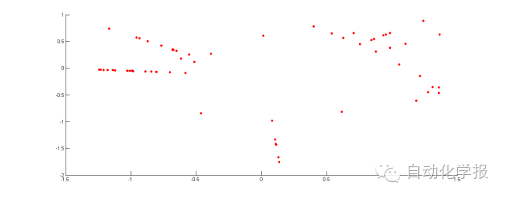
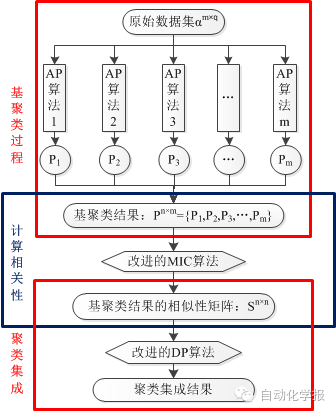
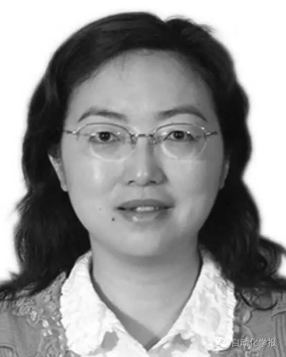

# 基于密度峰值的聚类集成

原创 自动化学报 2016-10-09 18:48 北京

> 原文地址: [https://mp.weixin.qq.com/s/z22OznqXdOC1\_KnopL4weQ](https://mp.weixin.qq.com/s/z22OznqXdOC1_KnopL4weQ)

聚类集成的目的是为了提高聚类结果的准确性，稳定性和鲁棒性。通过集成多个基聚类结果可以产生一个较优的结果。

本文在对各类已有的聚类集成算法和模型研究的基础上，分析基聚类算法对原始数据进行聚类后其数据结构上的改变。首先利用iris数据集进行例证，iris有150个数据点，每个数据点4种维度。实验中以AP算法作为基聚类器，运算获得基聚类结果。接着使用改进的最大信息系数（Rapid computation of the maximal information coefficient，RapidMic）算法获得基聚类结果的相似性矩阵。最后通过Isomap算法获得原始数据的基聚类结果的二维关系映射。将这些基聚类结果从150 维降到2 维之后，得到一个二维关系映射图，如图1所示。

图1 原始数据的基聚类结果的二维关系映射

观察图片可以发现，基聚类结果的二维映射以某种规律聚成了几类。由此推论，如果把基聚类结果看成是原始数据的新增属性，那么只使用这些新增属性就可以发现数据的密度关系。

本文随后提出了一个基于密度峰值（Density peaks，DP）的聚类集成模型。此模型同样使用AP算法作为基聚类器，利用RapidMic计算各基聚类结果之间的相关性，再使用这种相关性衡量原始数据在经过基聚类器聚类后相互之间的密度关系，最后使用改进的DP算法进行聚类集成。具体如图2所示。

图2 基于改进的DP算法的聚类集成过程

在20个实验数据集上与单纯的AP算法、CSPA、HGPA、MCLA、EM和QMI聚类集成算法以及K-means算法进行对比实验后发现，用改进的DP聚类集成算法处理数据集，可以获得最高的聚类准确率、纯度值，以及相对较小的调整秩次。

引用格式

褚睿鸿, 王红军, 杨燕, 李天瑞. 基于密度峰值的聚类集成. 自动化学报, 2016, 42(9): 1401-1412

作者简介

褚睿鸿 西南交通大学信息科学与技术学院硕士研究生. 2014 年获得西南交通大学信息科学与技术学院学士学位. 主要研究方向为集成学习, 数据挖掘.

E-mail: rhchu@my.swjtu.edu.cn

王红军 西南交通大学信息科学与技术学院副研究员. 2009 年获得四川大学计算机学院博士学位. 主要研究方向为机器学习, 集成学习与数据挖掘. 本文通信作者.

E-mail: wanghongjun@swjtu.edu.cn

杨燕 西南交通大学信息科学与技术学院教授. 2007 年在西南交通大学获得博士学位. 主要研究方向为数据挖掘, 集成学习, 云计算.

E-mail: yyang@swjtu.edu.cn

李天瑞 西南交通大学信息科学与技术学院教授. 主要研究方向为大数据, 云计算, 粗糙集与粒计算.

E-mail: trli@swjtu.edu.cn

欢迎扫描二维码、长按图片识别关注《自动化学报》中文版订阅号aas1963，服务号自动化学报和英文版服务号！

