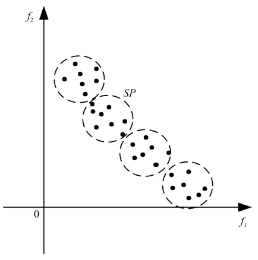
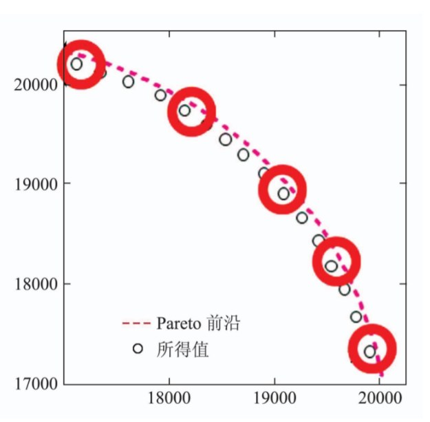
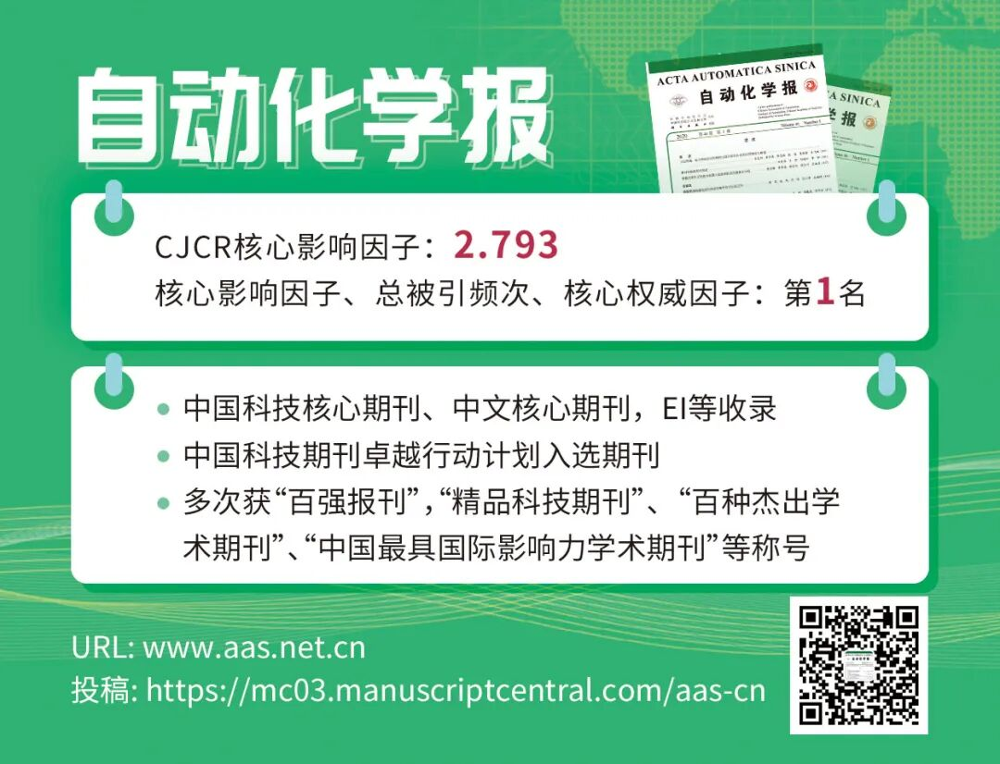
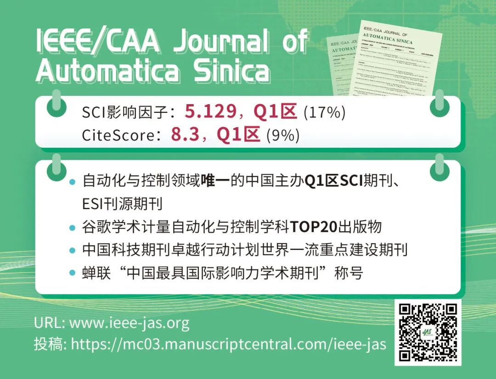
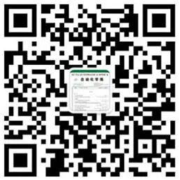

# 基于平均距离聚类的NSGA-Ⅱ

原创 自动化学报 自动化学报 2021-06-10 16:48 北京

> 原文地址: [https://mp.weixin.qq.com/s/GQM-E0Qi\_dXCmU-FVwVi-A](https://mp.weixin.qq.com/s/GQM-E0Qi_dXCmU-FVwVi-A)

**点击蓝字 ╳ 关注我们**

  

**多目标优化**是指：具有2-3个具有相互冲突目标的一类优化问题；在多目标优化中，不存在全局最优解，而是一组折中的Pareto解，其在目标空间中对应的映射称为Pareto前沿面。

  

崔志华, 张茂清, 常宇, 张江江, 王晖, 张文生. 基于平均距离聚类的NSGA-Ⅱ.自动化学报, 2021, 47(5): 1171-1182

http://www.aas.net.cn/cn/article/doi/10.16383/j.aas.c180540?viewType=HTML

  

不同于单目标优化问题, 多目标优化问题具有高复杂性、非线性和目标函数相互冲突等特点, 且不存在全局最优解, 而是一个最优解集。为了有效求解多目标优化问题, 学者们引入许多解决方法, 如加权和法、目标规划法和极大极小法等. 在具有一定先验知识前提下, 上述方法可以取得较好结果, 但它们通常只能获得一个Pareto 最优解。进化算法的出现为解决多目标优化问题开辟了新思路, 利用进化算法并行性、智能性、自适应性和自组织性, 多目标进化算法可以计算多个Pareto 最优解。

  

  

概括而言，常见的研究多目标优化问题的思路有以下三个方面：

（1）设计高效策略以减少目标函数个数。

（2）利用不同算法优点设计混合策略。

（3）针对求解问题特点设计高效策略。

  

NSGA-II是Deb 等在2002 年提出的多目标优化算法, 其具有较低计算复杂性且在相同时间内能获得较优的求解性能。为了进一步提升NSGA-II 性能, 近年来许多研究者尝试把聚类思想融入该算法中。本文受聚类思想启发, 针对算法多样性方面存在的缺陷，设计了新的平均距离聚类的多样性指标. 基于平均距离聚类多样性指标, 整个种群可被均匀划分成若干个小种群, 并可将NSGA-II 的选择和交叉算子等操作应用在小种群中, 从而保证算法所求结果均匀分布在Pareto 前沿面上。

  

  

  

**作者简介**

  

**崔志华**

太原科技大学教授，博士生导师，主要研究方向为智能计算, 随机算法和组合优化. 

E-mail: zhihua.cui@hotmail.com

  

**张茂清**

同济大学博士研究生，主要研究方向为高维多目标进化算法以及应用.

E-mail: maoqing\_zhang@163.com

  

**常  宇**

太原科技大学硕士研究生，主要研究方向为动态高维多目标优化等.

E-mail: YuChang78dd@163.com

  

**张江江**

太原科技大学硕士研究生，主要研究方向为高维多目标优化等.  

E-mail: jiangofyouth@163.com

  

**王  晖**

南昌工程学院副教授. 主要研究方向为进化计算, 群智能优化和大规模优化.

E-mail: huiwang@nit.edu.cn

  

**张文生**

中国科学院自动化研究所研究员. 主要研究方向为大数据知识挖掘, 人工智能, 机器学习, 嵌入式视频图像处理. 

E-mail: wensheng.zhang@ia.ac.cn

  

  

**期刊动态**

[《自动化学报》编辑部实习生招聘](http://mp.weixin.qq.com/s?__biz=MzI2NjA3MzM5MA==&mid=2649958966&idx=1&sn=4fef11c9e5d828f1961f8d6a54ecc447&chksm=f2942e77c5e3a761794f6181da8538975411290df13542ce66813b534b39b60ea77b886e4a45&scene=21#wechat_redirect)

[《自动化学报》致谢审稿人](http://mp.weixin.qq.com/s?__biz=MzI2NjA3MzM5MA==&mid=2649957872&idx=1&sn=e642c48a6d17dc0f99d2f3879446ecab&chksm=f29421b1c5e3a8a7b4e5cf8564d2f0713d3bcec5186ef4684875caf67dd096659450c96f31ce&scene=21#wechat_redirect)

[自动化学报蝉联百种中国杰出期刊称号，入选中国精品科技期刊](http://mp.weixin.qq.com/s?__biz=MzI2NjA3MzM5MA==&mid=2649957485&idx=1&sn=8af865466cb6f52b05a1e41af8549e71&chksm=f294202cc5e3a93a40b4850e6e0f0bccaf56c89591e049e9d98bfe9a598913f5d25e8ecfcf8d&scene=21#wechat_redirect)

[《自动化学报》挺进世界期刊影响力指数Q1区](http://mp.weixin.qq.com/s?__biz=MzI2NjA3MzM5MA==&mid=2649957452&idx=1&sn=c5fa8ac9c581e4ae3de2e7956e603dca&chksm=f294200dc5e3a91bb250e25fd6f7e47dc1114ad6fdf1762a7bfc440f789a059f1de455584e66&scene=21#wechat_redirect)

[《自动化学报》多名作者入选科睿唯安2020年度高被引科学家](http://mp.weixin.qq.com/s?__biz=MzI2NjA3MzM5MA==&mid=2649957295&idx=1&sn=597189346218d96d9906447a50281084&chksm=f29427eec5e3aef8d0662def8a0afcde2d2f3f828ae8208a52b14fc72169cedc5d81c06185a9&scene=21#wechat_redirect)

[自动化学报排名第一，被评定为中国中文权威期刊](https://mp.weixin.qq.com/s?__biz=MzI2NjA3MzM5MA==&mid=2649956509&idx=1&sn=1e39aaf65dc579606cf36258be8e1744&scene=21#wechat_redirect)

  

**热点文章**

[中医舌象分割技术研究进展: 方法、性能与展望](http://mp.weixin.qq.com/s?__biz=MzAwMzAzMDgxOA==&mid=2651071139&idx=1&sn=d00851cb35c6d4aff0b36a75cde68b7f&chksm=8131e8eeb64661f87053a2fabd389cfeab41d7d103502048a00b281f05cde290d27394f39543&scene=21#wechat_redirect)

[基于区块链的数字货币发展现状与展望](http://mp.weixin.qq.com/s?__biz=MzI2NjA3MzM5MA==&mid=2649958456&idx=1&sn=db1e69bbd69e864051158910b599e0a9&chksm=f2942c79c5e3a56f669395da520a1f215c6452cc8a0d40ca6e3b274b85e077c547bf4d85a8e5&scene=21#wechat_redirect)

[基于深度学习的表面缺陷检测方法综述](http://mp.weixin.qq.com/s?__biz=MzAwMzAzMDgxOA==&mid=2651070518&idx=1&sn=8097f7197598117c3b46d7d9dd984c85&chksm=8131ea7bb646636d9444a9d6f73eacacf11a22de2bc054e00941aa5bced3f7b2db0dd6326149&scene=21#wechat_redirect)

[比特驱动的瓦特变革—信息能源系统研究综述](http://mp.weixin.qq.com/s?__biz=MzAwMzAzMDgxOA==&mid=2651070474&idx=1&sn=bbfe03a0e9a8f97f46c87d75f466e7c2&chksm=8131ea47b646635104e90390e9a09f18947b3cd7d1bc9438dd4b4275f17db875abd2ab1a2849&scene=21#wechat_redirect)

[状态转移算法原理与应用](http://mp.weixin.qq.com/s?__biz=MzAwMzAzMDgxOA==&mid=2651069967&idx=1&sn=3fec83278b26be988d7a5fea928a69a9&chksm=8131d442b6465d54d02d3a0ae16b064548d496696b14906b9f6de6043645035ecd25f4f7b39b&scene=21#wechat_redirect)

[绿色能源互补智能电厂云控制系统研究](http://mp.weixin.qq.com/s?__biz=MzAwMzAzMDgxOA==&mid=2651069602&idx=1&sn=b50c1e8d5fd295dc2d98238c1d68ee42&chksm=8131d6efb6465ff9d162c0a8ff5aca0e6faa643e665e071c42484c4f1e61d951dd5851f346f1&scene=21#wechat_redirect)

[智能船舶综合能源系统及其分布式优化调度方法](http://mp.weixin.qq.com/s?__biz=MzAwMzAzMDgxOA==&mid=2651069520&idx=1&sn=8350658b7c26be6fdeab22034106ec66&chksm=8131d61db6465f0b6c2371721e55aec2e5e573eef4539d980fe768f3f0855242d0d4ff6e7d33&scene=21#wechat_redirect)

[孙长银, 吴国政, 王志衡等：自动化学科面临的挑战](http://mp.weixin.qq.com/s?__biz=MzAwMzAzMDgxOA==&mid=2651070248&idx=1&sn=a02af679240552bf79b3dd01100be89b&chksm=8131d565b6465c73532b22b11e92c8dd87b72d269f79fe53a2e3050fa996cc8ab1fec676659c&scene=21#wechat_redirect)

[值得收藏！SCI论文中的常用句式全总结](http://mp.weixin.qq.com/s?__biz=MzAwMzAzMDgxOA==&mid=2651069425&idx=1&sn=c945766f5d7f2ada8a217b981dcc734c&chksm=8131d1bcb64658aa80092eb53e1ead905ab02fc7a9f035e798e57d6407472ef688e8f7f0e831&scene=21#wechat_redirect)

[收藏！SCI论文经典词和常用句型汇总](http://mp.weixin.qq.com/s?__biz=MzAwMzAzMDgxOA==&mid=2651069036&idx=1&sn=961c952c84a07355dc70d4bb8291ce25&chksm=8131d021b6465937c80cf41a3118a5ad92a752cb3979f22d5964a741269a1df1987a37185a31&scene=21#wechat_redirect)

[吴国政等：浅析人工智能学科基金项目申请资助情况及展望](http://mp.weixin.qq.com/s?__biz=MzAwMzAzMDgxOA==&mid=2651068994&idx=1&sn=bca1ddc9774ad59ff1459a32883be60f&chksm=8131d00fb646591928654c4880aa609305efa30b538c0c431d8c8138df4401fcc87e80a131e0&scene=21#wechat_redirect)

  

**期刊目录**

[2021年第05期](http://mp.weixin.qq.com/s?__biz=MzI2NjA3MzM5MA==&mid=2649958886&idx=1&sn=ba599bc866e3eb23b0b8de0579956258&chksm=f2942da7c5e3a4b1fd1313e90d4f72354dd0de42cee19281f5c726978a841332622a0681d32c&scene=21#wechat_redirect)

[2021年第04期](http://mp.weixin.qq.com/s?__biz=MzI2NjA3MzM5MA==&mid=2649958569&idx=1&sn=ae33a7dcd6e2d66cae59932a1e99ce5e&chksm=f2942ce8c5e3a5fe7d94f6d809ecc492e83ebe118243f871cc4d82420c403784a01db82a93cb&scene=21#wechat_redirect)

[2021年第03期](http://mp.weixin.qq.com/s?__biz=MzI2NjA3MzM5MA==&mid=2649958419&idx=1&sn=b5d00eb294aa8c61a6fe4a0da8b461b9&chksm=f2942c52c5e3a544ca32e37d63f8ca879a64018d3fa5b25abd6bde1aeb582914f16e1e11182a&scene=21#wechat_redirect)

[2021年第02期](http://mp.weixin.qq.com/s?__biz=MzI2NjA3MzM5MA==&mid=2649958305&idx=1&sn=a701b9996478d2c09078a03f5b22d524&chksm=f29423e0c5e3aaf692be51b3905e1cbf4045c6df9664ce7d13459de3c0c61aa284b13eb502b9&scene=21#wechat_redirect)

[2021年第01期](http://mp.weixin.qq.com/s?__biz=MzI2NjA3MzM5MA==&mid=2649958084&idx=1&sn=24c140a6a1957eb7f4164689ed2840a5&chksm=f2942285c5e3ab93c5ed6127ad93e76ded82ae657ca79f7ead390387fbe2a72cb6df0ec6dcd2&scene=21#wechat_redirect)

[《自动化学报》2020年全年合集](http://mp.weixin.qq.com/s?__biz=MzI2NjA3MzM5MA==&mid=2649957972&idx=1&sn=1951847aacbcb7d22bdd2a46a79af871&chksm=f2942215c5e3ab03d070d8e52b8764b38036897c97b6a26c7a1f918c806b28edbe6c0fbf7ea9&scene=21#wechat_redirect)

[2020年第10期 工业人工智能专题](http://mp.weixin.qq.com/s?__biz=MzI2NjA3MzM5MA==&mid=2649957201&idx=1&sn=ab82a767bd716ab67fdf2942500d8b61&chksm=f2942710c5e3ae06b27f9e63a5e329a1123d90b051164e6b6123c500230541b1ed12d92abbfb&scene=21#wechat_redirect)

[2020年第09期 分布式信息能源系统理论与应用专题](http://mp.weixin.qq.com/s?__biz=MzI2NjA3MzM5MA==&mid=2649956412&idx=1&sn=8ebc13d63fd333ad85dbb8b5825df248&chksm=f294247dc5e3ad6ba297857a5b957e97cf499266c50318791fa8abd9432ecf1d9c3d9b287e36&scene=21#wechat_redirect)

[2019年第12期 智能轨道交通系统专刊](http://mp.weixin.qq.com/s?__biz=MzI2NjA3MzM5MA==&mid=2649955524&idx=1&sn=a76b97bf832e984f0155acc0fb367bc7&chksm=f2941885c5e391935c353c88072e806cb0b5b9b78b1f7b23b3c6f4b8c6a2c12f72557f87b56b&scene=21#wechat_redirect)  

[2019年第01期 信息物理融合系统理论与应用专刊](http://mp.weixin.qq.com/s?__biz=MzI2NjA3MzM5MA==&mid=2649955194&idx=2&sn=fb75bc8af9672922fa20efe2d30ff6c9&chksm=f2941f3bc5e3962db43689d03a54a0e40d83cb0e69fb9c48e87c0325b5bdf1b71028ebbbba0a&scene=21#wechat_redirect)

  

  

**长按二维码｜关注我们**

**IEEE/CAA Journal of Automatica Sinica (JAS)**

**长按二维码｜关注我们**

**《自动化学报》服务号**

**长按二维码｜关注我们**

**《自动化学报》订阅号**  

  

**联系我们**

**网站:** 

http://www.aas.net.cn

http://www.ieee-jas.org

**投稿:** 

https://mc03.manuscriptcentral.com/aas-cn   

https://mc03.manuscriptcentral.com/ieee-jas 

**电话:**  010-82544653（日常咨询和稿件处理） 

           010-82544677（录用后稿件处理）

**邮箱:**  aas@ia.ac.cn（日常咨询和稿件处理）  

           aas\_editor@ia.ac.cn（录用后稿件处理）

**博客:** 

http://blog.sina.com.cn/aaseditor 

  

**点击****阅读原文** **了解更多**