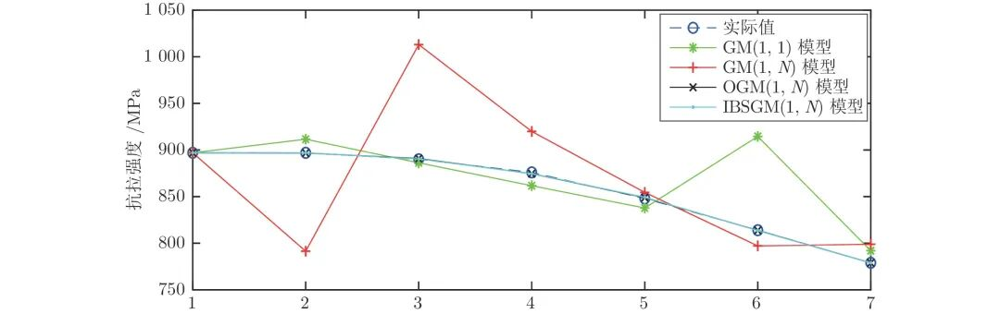
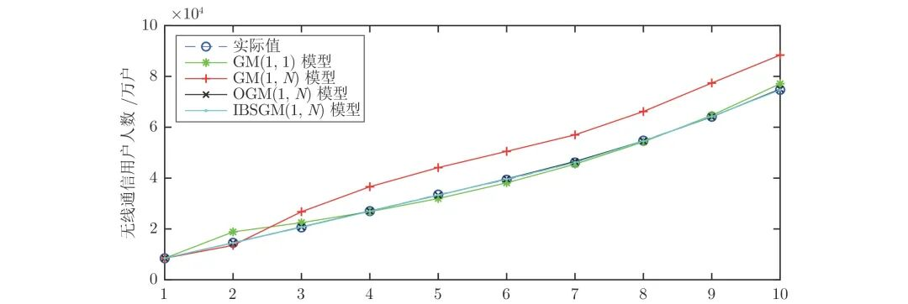
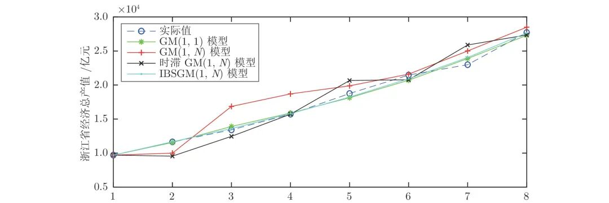
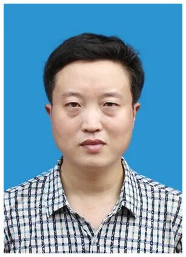

# 基于背景值和结构相容性改进的多维灰色预测模型

原创 自动化学报 自动化学报 2022-04-13 16:33 北京

> 原文地址: [https://mp.weixin.qq.com/s/9qAczC4ew9rvi\_TEtYCnUg](https://mp.weixin.qq.com/s/9qAczC4ew9rvi_TEtYCnUg)

**点击蓝字 关注我们**

  

**引****用本文**

  

缪燕子, 王志铭, 李守军, 代伟. 基于背景值和结构相容性改进的多维灰色预测模型. 自动化学报, 2022, 48(4): 1079−1090 doi: 10.16383/j.aas.c200780      

Miao Yan-Zi, Wang Zhi-Ming, Li Shou-Jun, Dai Wei. Improved multi-dimensional grey prediction model based on background value and structural compatibility. Acta Automatica Sinica, 2022, 48(4): 1079−1090 doi: 10.16383/j.aas.c200780  

http://www.aas.net.cn/cn/article/doi/10.16383/j.aas.c200780?viewType=HTML

  

**文章简介**

  

**关键词**

  

背景值优化, 结构相容性, 多维灰色预测模型, IBSGM(1, N)

  

**摘   要**

  

现有的多变量灰色预测模型的背景值估计误差及模型结构单一是导致该模型预测性能不稳定的重要因素, 致使该模型在实际预测领域中应用并不广泛. 本文通过分析背景值函数的几何意义, 结合积分几何面积公式, 提出一种改进的背景值优化方法, 使预测模型在背景值系数的选取上更加灵活.在此基础上, 模型中加入灰色作用量, 提出一种改进背景值及结构相容性的多维灰色预测模型(Improved background value and structure compatibility of grey prediction model, IBSGM(1, N)). 通过对模型参数的改变分析, 新模型理论上可达到与传统单变量和多变量灰色预测模型的兼容性. 为检验新模型的性能, 本文进行了三个案例对比分析, 实验结果表明, 与现有的灰色预测模型(Grey model, GM) GM(1, 1)和GM(1, N)相比较, 所提出的IBSGM(1, N)模型在背景值参数估计上误差明显减小, 结构相容性更强, 泛化性能更好, 具有更高的预测精度.

  

**引   言**

  

灰色预测模型(Grey model, GM)是灰色系统理论的基础和核心内容, 其研究重点在于解决小样本、贫信息的不确定性问题, 且灰色预测模型在众多领域都得到了广泛的运用. GM(1, 1)模型是灰色预测的核心内容, 是最简单、应用最广泛的单变量灰色预测模型. 但GM(1, 1)模型只包含一个因变量, 不考虑外部其他因素对系统发展的影响, 大量研究表明GM(1, 1)模型的性能不够稳定, 模拟精度不理想. 因此提出了一种具有一个因变量和N−1N−1个相关因素变量的多维灰色预测GM(1, N)模型. 但传统的GM(1, N)模型由于背景值表达式构造的不精确, 导致模型预测误差较大, 且当取N=1时, 其不能转化为对应的GM(1, 1)模型, 说明传统的GM(1, N)与GM(1, 1)模型在结构上是不相容的. 因此, 在某些情况下GM(1, N)模型的预测精度甚至会低于GM(1, 1)模型. 在考虑多变量预测的同时, 为了提高GM(1, N)模型的预测精度, 国内外学者针对模型的结构、参数优化、背景值的优化等方面进行了相关研究分析.

  

针对背景值优化的问题, 主要有插值法和拟合法等改进措施.为提高预测精度, 文献\[10\]通过Goldfeld-Quandt检验区分GM(1, 1)模型的异方差性, 并采用插值法对背景值进行了优化, 以此最小化原始序列平方误差之和的函数来构建其模型;文献\[11\]利用一次累加具有非齐次灰指数规律, 构建动态序列模型, 从积分几何意义的视角, 利用函数逼近的思想, 结合复化梯形公式改进模型背景值;文献\[12\]提出了一种优化背景值和调整初始系统参数的组合优化方法, 通过优化灰色微分方程中的背景值来模拟和预测无偏指数分布的序列;文献\[13\]提出一种寻找模型平均拟合误差(ARPE)最小值的方法, 采用粒子群优化算法对模型背景值系数进行优化, 当ARPE最小时的背景值系数取值即是模型的最优解, 但其优化是针对传统背景值表达式, 在背景值表达式构造上仍存在一定误差.

  

针对模型结构缺陷问题, 主要有基于智能算法的结构选择及参数和结构融合优化等方法. 文献\[14-16\]对初始条件、累加生成顺序、发展系数和背景值分布系数进行了参数优化, 研究结果表明上述参数的优化对提高多维灰色预测模型的性能有积极的作用, 但当N=1时, GM(1, N)模型仍然不能等价于GM(1, 1)模型, 意味着这些改进的灰色预测模型在结构相容性上仍存在缺陷;文献\[17\] 提出了一种基于数据算法自适应选择模型结构的灰色预测模型, 称为离散灰色多项式模型, 该模型具有代表最普遍的同构和非同构离散灰色模型的能力, 并且可以归纳出一些其他新颖的模型, 从而突出了模型与其结构之间的关系;文献\[18\]在模型中加入了相邻变量滞后项、线性校正项和随机扰动项, 其中线性校正项反映了因变量和自变量之间的线性关系, 消除了解释变量之间的多重共线性问题, 使模型的预测性能得到了显著的提高.

  

基于现有的文献我们发现传统GM(1, N)、GM(1, 1)模型在构造背景值表达式时存在一定误差, 且模型结构单一, 从而导致模型预测精度不高, 结构相容性不强等问题. 因此, 本文对以上两个问题进行了深入研究.

  

首先针对模型背景值的构造方法不准确, 考虑传统模型背景值表达式固定用几何梯形面积近似方程来表示, 而现有文献中的工作亦是基于该公式对参数进行优化, 未能从根本上减小误差.本文从背景值函数表达式的几何意义出发, 构造了一个新的背景值表达式, 并采用MATLAB数值分析对背景值系数的取值进行优化, 使背景值系数的取值更灵活, 减小了系统参数计算的误差, 进而提高模型的预测精度.其次针对模型结构的缺陷, 考虑传统灰色预测模型结构单一, 结构相容性弱, 泛化性能差, 虽然现有文献中对各种系统参数及结构参数有所改进, 但仍不能使模型具有较好的结构相容性. 本文在预测模型中加入了灰色作用量, 以反映自变量数据变换关系, 改善了模型的结构相容性, 提高模型的泛化能力, 使模型预测性能得到显著提高.

  

本文所提的改进背景值及结构相容性的多维灰色预测模型(Improved background value and structure compatibility of grey prediction model, IBSGM(1, N))解决了传统多变量灰色预测模型预测性能不稳定的问题, 该模型结构泛化能力强, 鲁棒性好, 适用于大部分多变量灰色预测系统. 同时, 本文突破了传统的模型改进思想, 有效解决了对系统参数优化的同时使模型结构泛化性提高的问题, 对多维灰色预测模型的改进方法上提供了新的思路.

  

图 3  例1中四种模型的模拟预测结果曲线图

  

图 4  例2中四种模型的模拟预测结果曲线图

  

图 5  例3中四种模型的模拟预测结果曲线图

  

请点击左下角“**阅读原文**”了解更多！

  

**作者简介**

**缪燕子**

中国矿业大学信息与控制工程学院教授. 主要研究方向为多传感器信息融合, 机器人智能感知与控制. 本文通信作者.

E-mail: myz@cumt.edu.cn

**王志铭**

中国矿业大学信息与控制工程学院硕士研究生, 2019年获中国矿业大学电气工程及其自动化学士学位. 主要研究方向为预测控制, 煤矿安全.

E-mail: 04151249@cumt.edu.cn

**李守军**

宿迁学院机电工程学院副教授. 主要研究方向为工业自动化, 人工智能与灰色系统理论.

E-mail: lishoujunbox@126.com

**代   伟**

中国矿业大学信息与控制工程学院教授. 主要研究方向为复杂工业过程建模, 运行优化与控制.

E-mail: weidai@cumt.edu.cn

  

**相关文章**

**（请向上滑动阅读）**

  

\[1\]   张熙来, 赵俭辉, 蔡波. 针对PM2.5单时间序列数据的动态调整预测模型. 自动化学报, 2018, 44(10): 1790-1798.

http://www.aas.net.cn/cn/article/doi/10.16383/j.aas.2017.c170026?viewType=HTML

  

\[2\]   陈宁, 彭俊洁, 王磊, 郭宇骞, 桂卫华. 模糊灰色认知网络的建模方法及应用. 自动化学报, 2018, 44(7): 1227-1236.

http://www.aas.net.cn/cn/article/doi/10.16383/j.aas.2017.c160578?viewType=HTML

  

\[3\]   李鹏, 刘思峰. 基于灰色关联分析和D-S证据理论的区间直觉模糊决策方法. 自动化学报, 2011, 37(8): 993-998.

http://www.aas.net.cn/cn/article/doi/10.3724/SP.J.1004.2011.00993?viewType=HTML

  

\[4\]   高迎彬, 徐中英. 基于加权矩阵的多维广义特征值并行分解算法. 自动化学报. doi: 10.16383/j.aas.c200399

http://www.aas.net.cn/cn/article/doi/10.16383/j.aas.c200399?viewType=HTML

  

\[5\]   潘红光, 高海南, 孙耀, 张英, 丁宝苍. 基于多优先级稳态优化的双层结构预测控制算法及软件实现. 自动化学报, 2014, 40(3): 405-414. doi: 10.3724/SP.J.1004.2014.00405

http://www.aas.net.cn/cn/article/doi/10.3724/SP.J.1004.2014.00405?viewType=HTML

  

\[6\]   邹涛, 魏峰, 张小辉. 工业大系统双层结构预测控制的集中优化与分散控制策略. 自动化学报, 2013, 39(8): 1366-1373. doi: 10.3724/SP.J.1004.2013.01366

http://www.aas.net.cn/cn/article/doi/10.3724/SP.J.1004.2013.01366?viewType=HTML

  

\[7\]   蔡星, 谢磊, 苏宏业, 古勇. 基于串联结构的分布式模型预测控制. 自动化学报, 2013, 39(5): 510-518. doi: 10.3724/SP.J.1004.2013.00510

http://www.aas.net.cn/cn/article/doi/10.3724/SP.J.1004.2013.00510?viewType=HTML

  

\[8\]   杨栋, 周秀玲, 郭平. 基于贝叶斯通用背景模型的图像标注. 自动化学报, 2013, 39(10): 1674-1680. doi: 10.3724/SP.J.1004.2013.01674

http://www.aas.net.cn/cn/article/doi/10.3724/SP.J.1004.2013.01674?viewType=HTML

  

\[9\]   邹涛, 李海强, 丁宝苍, 王丁丁. 多变量预测控制系统稳态解的相容性与唯一性分析. 自动化学报, 2013, 39(5): 519-529. doi: 10.3724/SP.J.1004.2013.00519

http://www.aas.net.cn/cn/article/doi/10.3724/SP.J.1004.2013.00519?viewType=HTML

  

\[10\]   单煜翔, 陈谐, 史永哲, 刘加. 基于扩展N元文法模型的快速语言模型预测算法. 自动化学报, 2012, 38(10): 1618-1626. doi: 10.3724/SP.J.1004.2012.01618

http://www.aas.net.cn/cn/article/doi/10.3724/SP.J.1004.2012.01618?viewType=HTML

  

\[11\]   王永忠, 梁彦, 潘泉, 程咏梅, 赵春晖. 基于自适应混合高斯模型的时空背景建模. 自动化学报, 2009, 35(4): 371-378. doi: 10.3724/SP.J.1004.2009.00371

http://www.aas.net.cn/cn/article/doi/10.3724/SP.J.1004.2009.00371?viewType=HTML

  

\[12\]   朱兴军, 孙吉贵, 张永刚, 李莹. 一种新的基于完全独立相容性的预处理技术. 自动化学报, 2009, 35(1): 71-76. doi: 10.3724/SP.J.1004.2009.00071

http://www.aas.net.cn/cn/article/doi/10.3724/SP.J.1004.2009.00071?viewType=HTML

  

\[13\]   朱兴军, 张永刚, 李莹, 张长胜. 多值传播的相容性技术. 自动化学报, 2009, 35(10): 1296-1301. doi: 10.3724/SP.J.1004.2009.01296

http://www.aas.net.cn/cn/article/doi/10.3724/SP.J.1004.2009.01296?viewType=HTML

  

\[14\]   于树友, 陈虹, 张鹏, 李学军. 一种基于LMI的非线性模型预测控制终端域优化方法. 自动化学报, 2008, 34(7): 798-804. doi: 10.3724/SP.J.1004.2008.00798

http://www.aas.net.cn/cn/article/doi/10.3724/SP.J.1004.2008.00798?viewType=HTML

  

\[15\]   方华京. 控制系统鲁棒故障检测的l1优化方法. 自动化学报, 2002, 28(4): 535-539.

http://www.aas.net.cn/cn/article/id/15566?viewType=HTML

  

\[16\]   王远钢, 郭治. 状态反馈中圆形极点与状态方差约束的相容性. 自动化学报, 2001, 27(2): 207-213.

http://www.aas.net.cn/cn/article/id/16129?viewType=HTML

  

\[17\]   张元林, 汪太鹏, 贾积身. n中取相邻n-1好的可修系统的可靠性分析. 自动化学报, 1997, 23(6): 807-811.

http://www.aas.net.cn/cn/article/id/16937?viewType=HTML

  

\[18\]   肖创柏, 罗晖, 李衍达. 基于OIVPM的特征值确定ARMA模型的结构. 自动化学报, 1996, 22(1): 68-73.

http://www.aas.net.cn/cn/article/id/17185?viewType=HTML

  

\[19\]   姚增起. 具有多种元件的N中取K容错系统及其可靠性. 自动化学报, 1992, 18(2): 249-251.

http://www.aas.net.cn/cn/article/id/14477?viewType=HTML

  

\[20\]   廖炯生. n中取相邻k系统可靠性及街灯照明系统维修策略. 自动化学报, 1992, 18(3): 343-347.

http://www.aas.net.cn/cn/article/id/14474?viewType=HTML

  

\[21\]   方华京, 涂健. l1鲁棒综合指标控制器的优化设计. 自动化学报, 1991, 17(3): 273-279.

http://www.aas.net.cn/cn/article/id/14600?viewType=HTML

  

\[22\]   程鹏. 配置特征结构的(n-l)阶补偿器. 自动化学报, 1988, 14(3): 234-236.

http://www.aas.net.cn/cn/article/id/14973?viewType=HTML

  

\[23\]   张珩. 参考模型阶数为1的MRAS综合. 自动化学报, 1985, 11(4): 429-432.

http://www.aas.net.cn/cn/article/id/15197?viewType=HTML

  

  

**近期文章**

[【热点专题】目标检测](http://mp.weixin.qq.com/s?__biz=MzI2NjA3MzM5MA==&mid=2649962259&idx=1&sn=97b0c31ec704211713ef8cba4bb51b01&chksm=f2943352c5e3ba44f2c7217cff60405765c6d67312beb6d07006155404bfc4b34268956697f5&scene=21#wechat_redirect)

[《自动化学报》2022年第03期目录分享](http://mp.weixin.qq.com/s?__biz=MzAwMzAzMDgxOA==&mid=2651075527&idx=1&sn=bc020c5fd09080243f7527610b003507&chksm=8131f98ab646709c2f485852b526989a3b9af5cc93e8afb508d9239b78176f49caa9807d6a8d&scene=21#wechat_redirect)

[2022斯坦福AI指数报告出炉！点击获取完整报告](http://mp.weixin.qq.com/s?__biz=MzAwMzAzMDgxOA==&mid=2651075236&idx=3&sn=1caed46e80f613c172a227ead8ddc1a3&chksm=8131f8e9b64671ffa8d6f7c8a36210fe1e262a66a42ab9a544e064d3c725b4a31274a4551750&scene=21#wechat_redirect)

[黄艳龙, 徐德, 谭民. 机器人运动轨迹的模仿学习综述](http://mp.weixin.qq.com/s?__biz=MzAwMzAzMDgxOA==&mid=2651075236&idx=1&sn=ec575c249f6e60709a32a7dfa6b55f37&chksm=8131f8e9b64671ffaf5de201407410a38735b35d7f4e6ab43eb05dac537068fb912ceef808c1&scene=21#wechat_redirect)

[CVPR 2022 | 自动化所新作速览！（上）](http://mp.weixin.qq.com/s?__biz=MzAwMzAzMDgxOA==&mid=2651075034&idx=2&sn=48b5232daaa7a51da96c3a7c87013e2d&chksm=8131fb97b6467281dc8e02749df8d0388f89d30e3b08f44d13c700169d1d7a22c4feef9f2dba&scene=21#wechat_redirect)

[CVPR 2022 | 自动化所新作速览！（下）](http://mp.weixin.qq.com/s?__biz=MzAwMzAzMDgxOA==&mid=2651075034&idx=3&sn=21833bb312bb0d9826c64c9fce068aa5&chksm=8131fb97b646728147f2bff58a04230d708d5a4537eb824656c2d54580b11f6a47b0eb30ade6&scene=21#wechat_redirect)

[直播回放分享 | 陈关荣教授：探索最优同步网络的拓扑结构](http://mp.weixin.qq.com/s?__biz=MzIxMjA5Njg2Nw==&mid=2649061608&idx=1&sn=1500a81260d8f5127b7cb7767c759fba&chksm=8f5a9ae4b82d13f201b714d8e96af9bbddf442bb7e10c97416fb925ab2170c05fa12010fb1d1&scene=21#wechat_redirect)

  

**热点文章**

[《自动化学报》2019年高关注论文](http://mp.weixin.qq.com/s?__biz=MzAwMzAzMDgxOA==&mid=2651073450&idx=1&sn=6f57bd0df73f259aa416575f1f69bdfb&chksm=8131e1e7b64668f1344de4acdef6148e8dcfa60c80e4f48e6cb1270558c2beade5601e92d05c&scene=21#wechat_redirect)

[《自动化学报》2021年热点文章回顾](http://mp.weixin.qq.com/s?__biz=MzAwMzAzMDgxOA==&mid=2651072577&idx=1&sn=4e6be077d7371c7d29d9a371d8defe19&chksm=8131e20cb6466b1aec2f3b8b1063d3be11725ca9a0c15785c3b42a638170e732acd0d8d345e0&scene=21#wechat_redirect)

[国家自然科学基金论文精选](http://mp.weixin.qq.com/s?__biz=MzI2NjA3MzM5MA==&mid=2649960308&idx=1&sn=1634c999f22588333537f13393403f9c&chksm=f2942b35c5e3a2232e86b51c2b7c8f37a4d3d7f858d370d76d5afd00567d7da6e9543476d120&scene=21#wechat_redirect)  

[国家重点研发计划论文精选](http://mp.weixin.qq.com/s?__biz=MzI2NjA3MzM5MA==&mid=2649960255&idx=1&sn=f48435928fd924134cb72014860b9d00&chksm=f2942b7ec5e3a26869da68a1419b3b40ca1e6cb98abf2e380d78a49ffb99c85991d76cc346b0&scene=21#wechat_redirect)

[中国科学院自动化研究所高层次人才招聘启事 | 长期有效](http://mp.weixin.qq.com/s?__biz=MzI2NjA3MzM5MA==&mid=2649959451&idx=1&sn=657b7e4aeeaa88114d5189641c5409dc&chksm=f294285ac5e3a14cd230a2b9678c32ba9bf92e8ffc9d61d506c5ffea2df793456dd37c2c6fb1&scene=21#wechat_redirect)

  

**期刊动态**

[自动化学报（英文版）和自动化学报入选计算领域高质量科技期刊T1类](http://mp.weixin.qq.com/s?__biz=MzAwMzAzMDgxOA==&mid=2651073859&idx=2&sn=7a9192717637dcf6cddb39ed961e8c3b&chksm=8131e70eb6466e188a123c504bdeba80c75681de4762f8685b3bf584bc33eb12362c70613b4e&scene=21#wechat_redirect)

[《自动化学报》编辑部防诈骗公告](http://mp.weixin.qq.com/s?__biz=MzAwMzAzMDgxOA==&mid=2651073517&idx=1&sn=c52de7c685e546af9faffc0cefab1c85&chksm=8131e1a0b64668b63ebaa68ea81cbaec3b94dc52ea8360821a0a49e67ae7e4b428a25d0f19c5&scene=21#wechat_redirect)

[《自动化学报》致谢审稿人](http://mp.weixin.qq.com/s?__biz=MzI2NjA3MzM5MA==&mid=2649961201&idx=1&sn=3142842d75c441ae860c1ecb313c7657&chksm=f29436b0c5e3bfa6c679210f60513eb1a7205dc20fe028f482bb593eac60427e4e56fba12493&scene=21#wechat_redirect)

[自动化学报多篇论文入选中国百篇最具影响国内论文和中国精品期刊顶尖论文](http://mp.weixin.qq.com/s?__biz=MzI2NjA3MzM5MA==&mid=2649961152&idx=1&sn=4a5e9e4b84879f4cde4e13a0ef97272c&chksm=f2943681c5e3bf97d7770c9623dac869b283b3ea83f3d320017974033e361d8b999134a8bdff&scene=21#wechat_redirect)

[自动化学报各项主要指标蝉联第1，再获百种中国杰出期刊称号](http://mp.weixin.qq.com/s?__biz=MzI2NjA3MzM5MA==&mid=2649960903&idx=1&sn=7da8b8a0167e16bcbaa1f00fbfb69782&chksm=f2943586c5e3bc9014f6d4fff7147b998ae42b4da452907e641e8029f296fd2413b4f17aef62&scene=21#wechat_redirect)

  

**期刊目录**

[2022年第03期](http://mp.weixin.qq.com/s?__biz=MzAwMzAzMDgxOA==&mid=2651075527&idx=1&sn=bc020c5fd09080243f7527610b003507&chksm=8131f98ab646709c2f485852b526989a3b9af5cc93e8afb508d9239b78176f49caa9807d6a8d&scene=21#wechat_redirect)

[2022年第02期](http://mp.weixin.qq.com/s?__biz=MzI2NjA3MzM5MA==&mid=2649961838&idx=1&sn=29334896aa0f372b70312250c75b6b20&chksm=f294312fc5e3b8392ffd49100eaba435bf48fa9234c5019fe7b16ed1e4ebef70be58691f3fb3&scene=21#wechat_redirect)

[2022年第01期](http://mp.weixin.qq.com/s?__biz=MzI2NjA3MzM5MA==&mid=2649961423&idx=1&sn=3b65958faa7c7f94c247f46dd72bd71e&chksm=f294378ec5e3be9825f860d132c36c97f3e877089449cb1fe85a6d1e7da9bd0e24795336bc54&scene=21#wechat_redirect)

[《自动化学报》2021年全年合集](http://mp.weixin.qq.com/s?__biz=MzAwMzAzMDgxOA==&mid=2651072770&idx=1&sn=7c531f7fa3bc390558fab15b339ce86e&chksm=8131e34fb6466a59ed079448fddda0fc9f97066460bff8f6835288003a1fba2812de383813c1&scene=21#wechat_redirect)

[《自动化学报》2020年全年合集](http://mp.weixin.qq.com/s?__biz=MzI2NjA3MzM5MA==&mid=2649957972&idx=1&sn=1951847aacbcb7d22bdd2a46a79af871&chksm=f2942215c5e3ab03d070d8e52b8764b38036897c97b6a26c7a1f918c806b28edbe6c0fbf7ea9&scene=21#wechat_redirect)

[2020年第10期 工业人工智能专题](http://mp.weixin.qq.com/s?__biz=MzI2NjA3MzM5MA==&mid=2649957201&idx=1&sn=ab82a767bd716ab67fdf2942500d8b61&chksm=f2942710c5e3ae06b27f9e63a5e329a1123d90b051164e6b6123c500230541b1ed12d92abbfb&scene=21#wechat_redirect)

[2020年第09期 分布式信息能源系统理论与应用专题](http://mp.weixin.qq.com/s?__biz=MzI2NjA3MzM5MA==&mid=2649956412&idx=1&sn=8ebc13d63fd333ad85dbb8b5825df248&chksm=f294247dc5e3ad6ba297857a5b957e97cf499266c50318791fa8abd9432ecf1d9c3d9b287e36&scene=21#wechat_redirect)

  

  

  

**长按二维码｜关注我们**

**IEEE/CAA Journal of Automatica Sinica (JAS)**

**长按二维码｜关注我们**

**《自动化学报》服务号**

**长按二维码｜关注我们**

**《自动化学报》订阅号**  

  

**联系我们**

**网站:** 

http://www.aas.net.cn

http://www.ieee-jas.net

**投稿:** 

https://mc03.manuscriptcentral.com/aas-cn   

https://mc03.manuscriptcentral.com/ieee-jas 

**电话:**

010-82544653（日常咨询和稿件处理） 

010-82544677（录用后稿件处理）

**邮箱:** 

aas@ia.ac.cn（日常咨询和稿件处理）  

aas\_editor@ia.ac.cn（录用后稿件处理）

**博客:** 

http://blog.sina.com.cn/aaseditor 

  

**↓ 点击下方 阅读原文 了解更多**