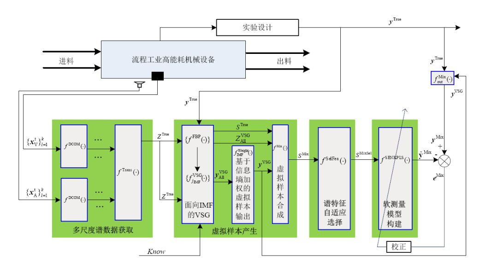
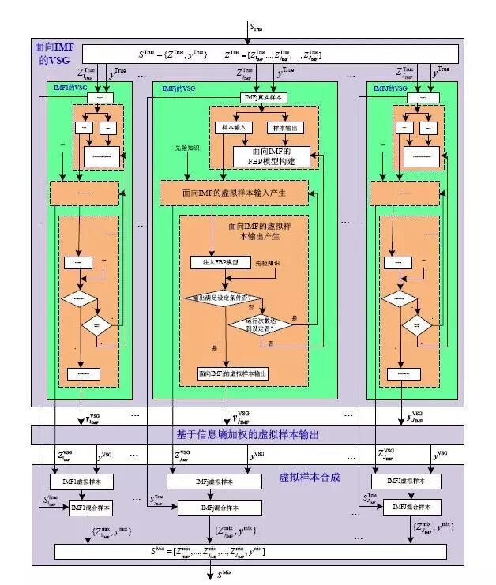
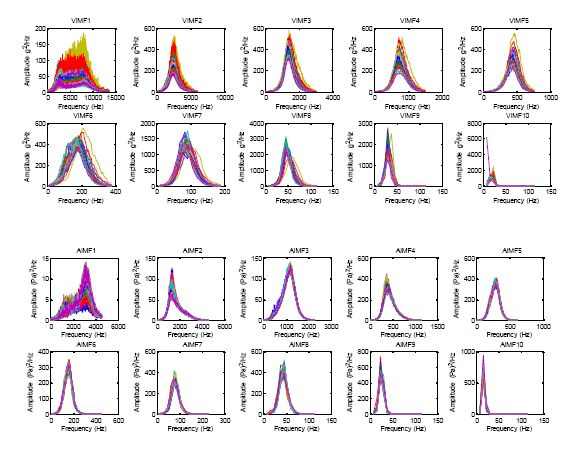
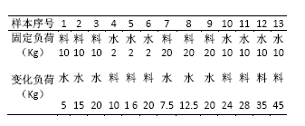
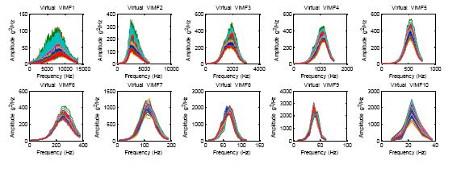
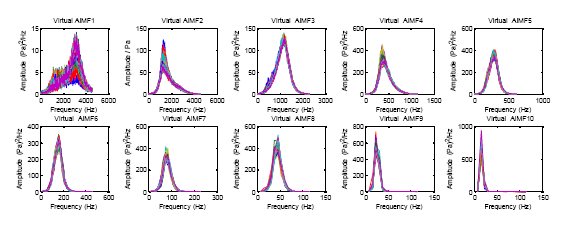
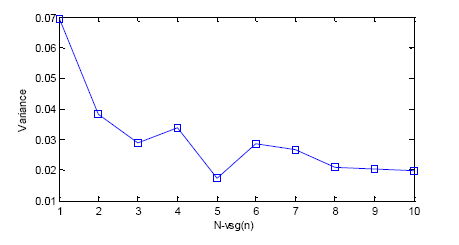

# 基于虚拟样本生成技术的多组分机械信号建模

原创 自动化学报 2018-11-01 09:00 北京

> 原文地址: [https://mp.weixin.qq.com/s/FJPqfwv9niqs\_LRrKMT5aw](https://mp.weixin.qq.com/s/FJPqfwv9niqs_LRrKMT5aw)

  

针对机械信号产生机理的复杂性导致模型解释性弱，以及工业过程连续不间断运行和机械设备旋转封闭的特殊性导致获取完备训练样本的经济性差和周期性长等问题，本文提出一种基于虚拟样本生成技术的多组分机械信号建模方法。

  

工业过程的优化运行控制需要准确检测与生产过程的质量、产量、能耗等指标密切相关的难以检测过程参数。由于流程工业过程的综合复杂特性，以及机械设备连续旋转和封闭运行的特点，其内部过程参数难以通过直接检测方式和建立机理模型计算得到。虽然运行专家可以依据多源信息和多年工作经验对所熟悉的机械设备内部的过程参数进行较为准确的估计，但专家经验的差异性和精力的有限性难以保证工业过程长期运行在优化状态。

  

机械振动和振声信号通常具有较强的多组分、非线性和非平稳等特性。基于这些信号进行难以检测过程参数软测量的首要难点问题是：如何从机械信号中提取模型的输入特征。

  

在实际工业应用过程中，难以检测过程参数建模经常遇到的更为棘手的难点是：如何获得能够覆盖多种工况和充足完备的建模样本。

  

面对基于多组分机械振动/振声信号的流程工业难以检测过程参数的软测量问题，有以下问题需要解决：

  

（1）如何将蕴含着丰富难以检测过程参数信息的多组分机械振动/振声信号自适应的分解为具有不同物理含义的不同组成成分，为构建寓意明确的软测量模型和探究旋转机械设备内部的工作机理与振动产生机理奠定基础；

  

（2）如何基于确定性的先验知识和非充足完备的真实训练样本提出适合于高维谱数据的(虚拟样本生成)VSG技术；

  

（3）针对基于多组分机械信号，在利用VSG构建虚拟样本输出时需要解决：如何依据不同时间尺度子信号的谱特征所构建的集成子模型对软测量模型预测输出的贡献率，对集成子模型的虚拟样本输出进行加权组合以获得统一的虚拟样本输出；

  

（4）如何选择有价值子信号及其高维频域特征，以及如何选择性融合多源多尺度谱特征和多工况样本，以便更有效的模拟工业现场运行专家的认知机制。

  

因此，基于多组分机械信号的软测量建模可以归结为一类针对多源多尺度高维谱数据的小样本建模问题。

  

基于VSG的多组分机械信号建模策略主要由：多尺度谱数据获取、虚拟样本产生、谱特征自适应选择和软测量模型构建共4个模块组成。

  

  

虚拟样本产生模块由面向IMF的VSG、基于信息墒加权的虚拟样本输出和虚拟样本合成共3个子模块组成。

  

将磨机旋转4个周期的信号进行EEMD分解，并将筒体振动和振声信号的IMF标记为振动IMF（Vibration VIMF）和振声IMF（Acoustic IMF）。对全部 IMF后进行HT变换，计算得到IMF边际谱。部分筒体振动和振声多尺度子信号的谱数据（IM1-IMF16）。

  

  

实验过程中4种工况下真实训练样本的分布。

  

  

针对CVR所产生的部分虚拟样本（VIMF1-10，AIMF1-10）的输入如图所示。

  

  

测试误差的方差与虚拟样本产生关键参数的关系。

  

  

该文的主要贡献是：首次提出基于VSG结合多组分信号自适应分解的多组分机械信号软测量建模策略，使得所提方法能够贴合工业实际，其中所包含的面向小样本高维谱数据的VSG技术具有较好的普适性；综合利用了多组分信号自适应分解、基于互信息的特征选择、基于遗传算法的核潜在模型选择性集成建模等技术，可以有效地结合特征选择和样本选择策略构建软测量模型，能够有效模拟工业现场运行专家的认知机制；对构建物理阐释明确的软测量模型和有效结合复杂工业过程机械设备的虚拟人工系统进行难以检测过程参数软测量具有重要的借鉴意义。

  

引用格式

汤健, 乔俊飞, 柴天佑, 刘卓, 吴志伟. 基于虚拟样本生成技术的多组分机械信号建模. 自动化学报, 2018, 44(9): 1569-1589.

  

作者简介

汤健，北京工业大学教授, 主要研究方向为复杂工业过程智能控制与建模, 数 据驱动软测量。 

E-mail: freeflytang@bjut.edu.cn

乔俊飞，北京工业大学教授. 主要研究方向为智能控制, 神经网络分析与设计.

E-mail: junfeq@bjut.edu.cn

柴天佑,中国工程院院士, 东北大学教授，IEEEFellow, IFAC Fellow, 欧亚科学院院士. 主要研究方向为自适应控制,智能解耦控制, 流程工业综合自动化理论、方法与技术。

E-mail:tychai@mail.neu.edu.cn

刘卓，博士，东北大学流程工业综合自动化国家重点实验室讲师，主要研究方向为复杂工业过程建模。

E-mail:liuzhuo@ise.neu.edu.cn

吴志伟，博士，东北大学流程工业综合自动化国家重点实验室,讲师，主要研究方向为复杂工业过程的智能优化控制.

E-mail: wuzhiwei2006@163.com

自动化

学报

**生成式对抗网络GAN技术与应用专刊**

[生成式对抗网络：从生成数据到创造智能](http://mp.weixin.qq.com/s?__biz=MzAwMzAzMDgxOA==&mid=2651063870&idx=1&sn=1e1d7562a4bbe4c31e2fdef4859c0bc4&chksm=8131cc73b6464565d9419524cd87b4bbe363384f0ba722017e91a49af4640d349403ea9a0ea6&scene=21#wechat_redirect)  

[人工智能研究的新前线：生成式对抗网络](http://mp.weixin.qq.com/s?__biz=MzAwMzAzMDgxOA==&mid=2651063920&idx=1&sn=9094936d46b4bab696df49c408fa1656&chksm=8131cc3db646452b0cba9ebdee9672b9ae010166a941ef19d5972616235193048a3346cf54f0&scene=21#wechat_redirect)  

[一种能量函数意义下的生成式对抗网络](http://mp.weixin.qq.com/s?__biz=MzAwMzAzMDgxOA==&mid=2651063930&idx=1&sn=8fc4569fbc51adb78002a6c492a7b58f&chksm=8131cc37b646452180ad8b4be28b69e9e1767c94cf2bf8b712074d8b26e72fffd95146d9fac5&scene=21#wechat_redirect)  

[协作式生成对抗网络](http://mp.weixin.qq.com/s?__biz=MzAwMzAzMDgxOA==&mid=2651063937&idx=1&sn=b3bb0ca500fa6f1e5b2d4fdc476187ed&chksm=8131ccccb64645daca101424f49facb82039d857908b8467fc5033a3b254fc348376128fef89&scene=21#wechat_redirect)  

[融合对抗学习的因果关系抽取](http://mp.weixin.qq.com/s?__biz=MzAwMzAzMDgxOA==&mid=2651063950&idx=1&sn=073948b72538b1547399cd7d3ba0b847&chksm=8131ccc3b64645d5c3c82fb7baa62c0cd2644c19f626a6a0904b6223bf155b8e77045006815a&scene=21#wechat_redirect)  

[基于生成对抗网络的多视图学习与重构算法](http://mp.weixin.qq.com/s?__biz=MzAwMzAzMDgxOA==&mid=2651063957&idx=1&sn=19964ffc71d7cb689887517b5d1bec12&chksm=8131ccd8b64645cee6db75a3910ee76a1bf2dab99af617044cfc2210d106ebc8c5eb7c88f7ba&scene=21#wechat_redirect)  

[基于生成对抗网络的低秩图像生成方法](http://mp.weixin.qq.com/s?__biz=MzAwMzAzMDgxOA==&mid=2651063961&idx=1&sn=8d6567b1750f5aa499007f17bed8e92b&chksm=8131ccd4b64645c2a898492cbb2eb4ed8272b4234bd1a08da279f17d6eb9884e0d4ace8f062c&scene=21#wechat_redirect)  

[基于条件深度卷积生成对抗网络的图像识别方法](http://mp.weixin.qq.com/s?__biz=MzAwMzAzMDgxOA==&mid=2651063972&idx=1&sn=b8bf8ae85b62f83e74d50f086ff6bc04&chksm=8131cce9b64645ff1ce4a10e6482d74876c664917a3ee821c11a72693cee3af1360b88d6fffe&scene=21#wechat_redirect)  

[基于生成式对抗网络的鲁棒人脸表情识别](http://mp.weixin.qq.com/s?__biz=MzAwMzAzMDgxOA==&mid=2651063980&idx=1&sn=ee5a109bc89e6b59dcf0db6359438be1&chksm=8131cce1b64645f7d5c0153e2fc3703abc37bc4edb3fc668efc90fd7433599ef40dcaa94e238&scene=21#wechat_redirect)  

[基于对抗训练策略的语言模型数据增强技术](http://mp.weixin.qq.com/s?__biz=MzAwMzAzMDgxOA==&mid=2651063984&idx=1&sn=6092ba309457e2810275069f4dfcef80&chksm=8131ccfdb64645ebb732eccf9f0fb0a81615f92a321d233837e60534ffaca0a352e6d81c97e5&scene=21#wechat_redirect)

[基于GAN技术的自能源混合建模与参数辨识方法-自能源，一场“草根能源”的盛宴](http://mp.weixin.qq.com/s?__biz=MzAwMzAzMDgxOA==&mid=2651063988&idx=1&sn=7c506b7a5c161d7c7b302a17ea28a097&chksm=8131ccf9b64645ef252f6078efb02f067d99a4d4d3cf020dfe8d21f85fb512835931dc11fbd7&scene=21#wechat_redirect)

[基于位错理论的距离正则化水平集图像分割算法](http://mp.weixin.qq.com/s?__biz=MzAwMzAzMDgxOA==&mid=2651063994&idx=1&sn=6e6e13de682aecbea7fec4ebbd4e4316&chksm=8131ccf7b64645e1c36dce0c5ba1a70ffcbf2f2ea25cc920c7ee6315227610c205029b5e0f67&scene=21#wechat_redirect)

[异质依存网络衰退特征与关键节点辨识](http://mp.weixin.qq.com/s?__biz=MzAwMzAzMDgxOA==&mid=2651064002&idx=1&sn=6b560d52462a2c2958004fb2e701d2c1&chksm=8131cc8fb6464599f19c7d08ce7a86b1638ad2542c79c16e178db90bee226be9c182cfba21cb&scene=21#wechat_redirect)

欢迎扫描二维码、长按图片识别关注《自动化学报》中文版订阅号aas1963，服务号自动化学报和英文版服务号！

JAS《自动化学报》（英文版）

自动化学报服务号

自动化学报订阅号

  

联系我们

Tel:  010-82544653（日常咨询和稿件处理） 

        010-82544677（录用后稿件处理）

Fax: 010-82544497

Email: aas@ia.ac.cn（日常咨询和稿件处理）

          aas\_editor@ia.ac.cn（录用后稿件处理）

http://www.aas.net.cn

点

这里“阅读原文”，查看更多