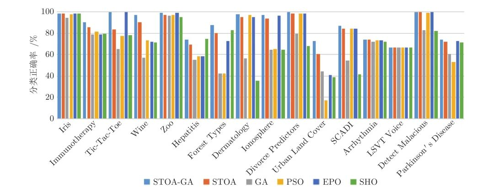
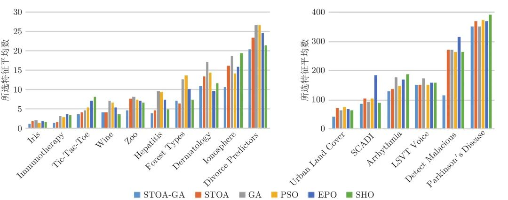

# 基于遗传乌燕鸥算法的同步优化特征选择

原创 自动化学报 自动化学报 2022-06-07 15:56 北京

> 原文地址: [https://mp.weixin.qq.com/s/IdIT6q5TOKb2mHKrck2zsQ](https://mp.weixin.qq.com/s/IdIT6q5TOKb2mHKrck2zsQ)

  

**点击蓝字  / 关注我们**

  

**引用本文**

贾鹤鸣, 李瑶, 孙康健. 基于遗传乌燕鸥算法的同步优化特征选择. 自动化学报, 2022, 48(6): 1601−1615 doi: 10.16383/j.aas.c200322

Jia He-Ming, Li Yao, Sun Kang-Jian. Simultaneous feature selection optimization based on hybrid sooty tern optimization algorithm and genetic algorithm. Acta Automatica Sinica, 2022, 48(6): 1601−1615 doi: 10.16383/j.aas.c200322

http://www.aas.net.cn/cn/article/doi/10.16383/j.aas.c200322?viewType=HTML

  

**文章简介**

  

**关键词**

  

乌燕鸥优化算法, 混合优化, 特征选择, 支持向量机, 数据分类

  

**摘   要**

  

针对传统支持向量机方法用于数据分类存在分类精度低的不足问题, 将支持向量机分类方法与特征选择同步结合, 并利用智能优化算法对算法参数进行优化研究. 首先将遗传算法(Genetic algorithm, GA)和乌燕鸥优化算法(Sooty tern optimization algorithm, STOA)进行混合, 先通过对平均适应度值进行评估, 当个体的适应度函数值小于平均值时采用遗传算法对其进行局部搜索的加强, 否则进行乌燕鸥本体优化过程, 同时将支持向量机内核函数和特征选择目标共同作为优化对象, 利用改进后的STOA-GA寻找最适应解, 获得所选的特征分类结果. 其次, 通过16组经典UCI数据集和实际乳腺癌数据集进行数据分类研究, 在最佳适应度值、所选特征个数、特异性、敏感性和算法耗时方面进行对比研究, 实验结果表明, 该算法可以更加准确地处理数据, 避免冗余特征干扰, 在数据挖掘领域具有更广阔的工程应用前景.

  

**引   言**

  

随着科技不断进步, 每个领域都会产生庞大而复杂的信息和数据, 为了处理如此繁杂的数据, 数据挖掘和机器学习相继出现. 在数据处理领域中, 数据分类是一项基本工作, 但是由于数据的庞大和复杂, 使得数据分类成为一项具有挑战的研究课题, 常见的数据分类方法有决策树法、朴素贝叶斯法、k-邻近值(k-nearest neighbor, KNN)和支持向量机(Support vector machine, SVM)等. 贾涛等提出了数据流决策树分类方法, 引入单分类和集成决策树模型有效地处理了概念漂移问题; 崔良中等选择了改进朴素贝叶斯算法来解决近来机器学习中的数据分类时间过长的问题; 王景文等选择KNN算法进行了数据预测和分类, 实现了对中医胃痛病的自动诊断, 对诊断病理起到了重要作用; 丁世涛等提出基于传统SVM的分类方法, 通过文本数据以标题为突破口实现快速分类, 提高了分类速度和分类精度. 上述论文着重研究了几种常见的数据分类方法的工程应用, 由于各类数据量庞大且冗杂导致数据分类领域面临较大的挑战, 因而许多学者将研究领域进一步推向如何更好更快地进行数据预处理, 将特征选择和分类方法结合从而提高分类准确度.

  

为了更好解决特征选择与分类方法结合的问题, 研究者们通过引入优化算法对SVM的内核参数寻优. Chapelle等提出了利用梯度下降法来选择SVM的参数, 为接下来对其参数进行优化的研究奠定了基础; 刘昌平等使用混沌优化的方法对SVM的参数进行优化, 得出最优解并增强了分类精度; 刘东平等通过对遗传算法的改进, 利用其交叉变异部分更好地对SVM内核参数进行优化, 达到了预期的实验效果; 王振武等将粒子群算法改进后应用到SVM参数优化上, 体现了融合优化与SVM方法结合的优越性; 石勇等提出非平行支持向量顺序回归模型, 能够更好地处理大规模数据. Yu等提出了双边跨域协同过滤的SVM分类方法, 通过集成内在用户和项目特征, 更好地在目标领域中构建分类的模型. 上述研究表明, 将优化算法融合至SVM中具有一定的效果, 但上述方法大多只是单一优化其内核参数并未从整体考虑数据相关性的问题.

  

因此, 近年来研究者也开始将特征选择与优化算法相结合, 提高精度并减少时间成本. Zhang等首次提出了多目标粒子群成本的特征选择方法, 告别了传统的单目标特征选择, 是一种极具竞争力的特征选择方法; 2017年, 文献\[13\]提出基于返回代价的二进制萤火虫的方法, 并将其应用到特征选择问题中, 有效地提高了分类精确度并减少了所选特征个数; 2018年, 张文杰等将遗传算法应用到大数据特征选择算法中, 提升了算法的搜索能力和获取特征的准确性; 2019年, 李炜等将改进的粒子群算法应用到特征选择当中, 有效地降低了学习算法的数据维度和计算成本; 同年, Jia等提出一种基于斑点鬣狗优化(Spotted hyena optimization, SHO)的特征选择算法, 该算法提高了特征选择精度同时解决了特征冗余的问题; Baliarsingh等也在2019年提出了基于帝企鹅优化算法(Emperor penguin optimization, EPO)应用在优化医疗数据的分类方法, 大大减少了数据繁杂难以处理的问题; 文献\[18\]提出了非负拉普拉斯嵌入引导子空间学习的无监督特征选择的方法, 由非负拉普拉斯嵌入生成高质量的伪类标签, 并利用伪类标签提供的判别信息, 发展局部结构保持的子空间学习来寻找最优特征子集. 受这些研究启发, 本文将有效的优化算法应用到特征选择当中, 筛选有效特征, 更好地分类实际工程中的数据.

  

从工程应用的角度出发, 为了进一步提高数据分类准确度, 应该考虑将SVM与特征选择相结合, 利用优化算法对二者同时优化. 齐子元等提出同步优化特征选择和SVM参数的方法, 克服了单独优化二者的缺陷, 但选用的优化方法过于陈旧, 因此性能有待于提升; 沈永良等则提出了将改进烟花算法应用到特征选择和SVM参数优化的方法, 但大多对低维数据进行改善, 对高维数据集的优势难以体现; Ibrahim等提出了基于蝗虫算法的同步优化方法, 但未对本身优化算法做出改进, 因此不能更加全面地应用到特征选择问题中.

  

由上述研究文献的分析可以看出, 选择合适的优化算法对SVM和特征选择进行同步优化是一个十分重要的研究问题, 而元启发式优化算法主要分为进化算法和群智能优化算法两类. 进化算法中以遗传算法(Genetic algorithm, GA)最为经典. 通过模仿自然界优胜劣汰的理念, 不断淘汰结果较差的解和有概率的交叉变异来更新最优解的位置; 群智能优化算法则是模拟行为聚集的种群觅食行为, 以粒子群优化算法(Particle swarm optimization, PSO)为代表, 它通过模仿鸟群飞行觅食的过程, 不断更新飞行速度和位置以搜索到最优解. 除此之外, 还有一些仿生算法也属于元启发式算法, 如鲸鱼优化算法, 该算法模仿座头鲸捕食过程, 利用独特的螺旋收敛方式模型不断靠近最优解. 上述几种典型的优化算法都能在一定程度上解决工程中最优解的求取问题, 但是由于工程问题的困难性和复杂性, 优化算法很难独立解决所有实际问题. 本文选择的乌燕鸥优化算法(Sooty tern optimization algorithm, STOA)也是如此, 虽然它具有较强的全局搜索能力和一定的收敛精度, 但根据没有免费的午餐定理可知, 没有任何一个优化算法可以独立解决所有实际问题, 单一优化算法优化能力尚有不足, 因此要想将优化算法更好地应用到实际问题上, 就必须对其进行二次优化和改进.

  

由于乌燕鸥算法已经具备良好的全局搜索能力, 所以对它的改进应当侧重于对其局部搜索能力的引导和改善. 遗传算法的主要特点是能够对结构对象进行直接操作、具有较好的并行性和局部优化能力, 同时它不需要特定的规则, 能够根据概率自适应地调整搜索方向, 因此近年来遗传算法在混合优化、机器学习、信号处理等领域得到了广泛的应用. 2019年, 唐晓娜等提出了混合粒子群优化遗传算法的混合方法, 用来对高分遥感影像进行预处理, 大大提高了其对城市用地信息的提取效果; 2020年, 卓雪雪等将蚁群算法和遗传算法结合并应用于求解旅行商问题中, 将遗传最主要的交叉部分引入到蚁群优化中, 解决了蚁群算法过早陷入局部最优解的问题, 并加快了算法的收敛速度. 由此可见遗传算法具有强大的局部搜索能力, 将它与其他局部搜索能力不足的算法融合, 便可以大大提高该类不足算法的收敛精度, 同时也可以更好地避免陷入局部最优的情况出现. 因此本文引入遗传算法, 解决了传统乌燕鸥算法局部搜索不足且容易陷入局部最优的问题.

  

综合上述分析可知, 本文主要创新研究工作如下: 首先, 本文根据平均适应度值概念提出遗传乌燕鸥算法, 相较于传统乌燕鸥优化算法, 具有更好的收敛能力和收敛速度; 其次, 基于本文遗传乌燕鸥算法, 将其和SVM及特征选择结合, 用STOA-GA同步优化SVM的C、ζ参数和二进制特征, 并且对经典UCI数据集进行测试, 解决了数据预处理中分类精度不高、冗余特征过多的问题, 可以有效完成数据分类工作; 最后, 将本文的特征选择模型应用到乳腺癌数据集中, 通过10次实验均入选的特征可以更好地辨别乳腺癌复发的主要因素, 为解决乳腺癌数据的预处理提供了理论依据, 使临床数据得到更妥善利用. 通过验证, 本文方法在数据预处理上确有较高的工程应用价值.

  

图 5  各算法分类精度平均值

  

图 6  各算法所选特征平均值

  

请点击左下角“**阅读原文**”了解更多！

  

**文章简介**

**贾鹤鸣**

三明学院信息工程学院教授. 主要研究方向为智能优化与图像处理和非线性控制理论与应用. 本文通信作者.

E-mail: jiaheminglucky99@126.com

**李   瑶**

东北林业大学机电工程学院硕士研究生. 主要研究方向为智能优化与特征选择.

E-mail: liyao@nefu.edu.cn

**孙康健**

东北林业大学机电工程学院硕士研究生. 主要研究方向为智能优化与特征选择.

E-mail: sunkangjian@nefu.edu.cn

  

**相关文章**

**（请向上滑动阅读）**

  

\[1\]  于洪, 何德牛, 王国胤, 李劼, 谢永芳. 大数据智能决策. 自动化学报, 2020, 46(5): 878-896. doi: 10.16383/j.aas.c180861

http://www.aas.net.cn/cn/article/doi/10.16383/j.aas.c180861?viewType=HTML

  

\[2\]  石勇, 李佩佳, 汪华东. L2损失大规模线性非平行支持向量顺序回归模型. 自动化学报, 2019, 45(3): 505-517. doi: 10.16383/j.aas.2018.c170438

http://www.aas.net.cn/cn/article/doi/10.16383/j.aas.2018.c170438?viewType=HTML

  

\[3\]  肖辉辉, 万常选, 段艳明, 谭黔林. 基于引力搜索机制的花朵授粉算法. 自动化学报, 2017, 43(4): 576-594. doi: 10.16383/j.aas.2017.c160146

http://www.aas.net.cn/cn/article/doi/10.16383/j.aas.2017.c160146?viewType=HTML

  

\[4\]  马炫, 李星, 唐荣俊, 刘庆. 一种求解符号回归问题的粒子群优化算法. 自动化学报, 2020, 46(8): 1714−1726 doi: 10.16383/j.aas.c180035

http://www.aas.net.cn/cn/article/doi/10.16383/j.aas.c180035?viewType=HTML

  

\[5\]  孙亮, 韩崇昭, 沈建京, 戴宁. 集成特征选择的广义粗集方法与多分类器融合. 自动化学报, 2008, 34(3): 298-304. doi: 10.3724/SP.J.1004.2008.00298

http://www.aas.net.cn/cn/article/doi/10.3724/SP.J.1004.2008.00298?viewType=HTML

  

\[6\]  孟琭, 杨旭. 目标跟踪算法综述. 自动化学报, 2019, 45(7): 1244-1260. doi: 10.16383/j.aas.c180277

http://www.aas.net.cn/cn/article/doi/10.16383/j.aas.c180277?viewType=HTML

  

\[7\]  陈龙, 刘全利, 王霖青, 赵珺, 王伟. 基于数据的流程工业生产过程指标预测方法综述. 自动化学报, 2017, 43(6): 944-954. doi: 10.16383/j.aas.2017.c170136

http://www.aas.net.cn/cn/article/doi/10.16383/j.aas.2017.c170136?viewType=HTML

  

\[8\]  南栋, 毕笃彦, 马时平, 凡遵林, 何林远. 基于分类学习的去雾后图像质量评价算法. 自动化学报, 2016, 42(2): 270-278. doi: 10.16383/j.aas.2016.c140854

http://www.aas.net.cn/cn/article/doi/10.16383/j.aas.2016.c140854?viewType=HTML

  

\[9\]  侯杰, 茅耀斌, 孙金生. 基于指数损失和0-1损失的在线Boosting算法. 自动化学报, 2014, 40(4): 635-642. doi: 10.3724/SP.J.1004.2014.00635

http://www.aas.net.cn/cn/article/doi/10.3724/SP.J.1004.2014.00635?viewType=HTML

  

\[10\]  张凯军, 梁循. 一种改进的显性多核支持向量机. 自动化学报, 2014, 40(10): 2288-2294. doi: 10.3724/SP.J.1004.2014.02288

http://www.aas.net.cn/cn/article/doi/10.3724/SP.J.1004.2014.02288?viewType=HTML

  

\[11\]  张景祥, 王士同, 邓赵红, 蒋亦樟, 李奕. 融合异构特征的子空间迁移学习算法. 自动化学报, 2014, 40(2): 236-246. doi: 10.3724/SP.J.1004.2014.00236

http://www.aas.net.cn/cn/article/doi/10.3724/SP.J.1004.2014.00236?viewType=HTML

  

\[12\]  李娟, 王宇平. 考虑局部均值和类全局信息的快速近邻原型选择算法. 自动化学报, 2014, 40(6): 1116-1125. doi: 10.3724/SP.J.1004.2014.01116

http://www.aas.net.cn/cn/article/doi/10.3724/SP.J.1004.2014.01116?viewType=HTML

  

\[13\]  陶剑文, 王士同. 领域适应核支持向量机. 自动化学报, 2012, 38(5): 797-811. doi: 10.3724/SP.J.1004.2012.00797

http://www.aas.net.cn/cn/article/doi/10.3724/SP.J.1004.2012.00797?viewType=HTML

  

\[14\]  刘建伟, 李双成, 罗雄麟. p范数正则化支持向量机分类算法. 自动化学报, 2012, 38(1): 76-87. doi: 10.3724/SP.J.1004.2012.00076

http://www.aas.net.cn/cn/article/doi/10.3724/SP.J.1004.2012.00076?viewType=HTML

  

\[15\]  张战成, 王士同, 钟富礼. 协作式整体和局部的分类机. 自动化学报, 2011, 37(10): 1256-1263. doi: 10.3724/SP.J.1004.2011.01256

http://www.aas.net.cn/cn/article/doi/10.3724/SP.J.1004.2011.01256?viewType=HTML

  

\[16\]  丁晓剑, 赵银亮. 偏置b对支持向量机分类问题泛化性能的影响. 自动化学报, 2011, 37(9): 1105-1113. doi: 10.3724/SP.J.1004.2011.01105

http://www.aas.net.cn/cn/article/doi/10.3724/SP.J.1004.2011.01105?viewType=HTML

  

\[17\]  徐丹蕾, 杜兰, 刘宏伟, 洪灵, 李彦兵. 一种基于变分相关向量机的特征选择和分类结合方法. 自动化学报, 2011, 37(8): 932-943. doi: 10.3724/SP.J.1004.2011.00932

http://www.aas.net.cn/cn/article/doi/10.3724/SP.J.1004.2011.00932?viewType=HTML

  

\[18\]  刘峤, 秦志光, 陈伟, 张凤荔. 基于零范数特征选择的支持向量机模型. 自动化学报, 2011, 37(2): 252-256. doi: 10.3724/SP.J.1004.2011.00252

http://www.aas.net.cn/cn/article/doi/10.3724/SP.J.1004.2011.00252?viewType=HTML

  

\[19\]  李钧涛, 贾英民. 用于微阵列分类的Huberized多类支持向量机. 自动化学报, 2010, 36(3): 399-405. doi: 10.3724/SP.J.1004/2010.00399

http://www.aas.net.cn/cn/article/doi/10.3724/SP.J.1004/2010.00399?viewType=HTML

  

\[20\]  易辉, 宋晓峰, 姜斌, 王定成. 基于结点优化的决策导向无环图支持向量机及其在故障诊断中的应用. 自动化学报, 2010, 36(3): 427-432. doi: 10.3724/SP.J.1004.2010.00427

http://www.aas.net.cn/cn/article/doi/10.3724/SP.J.1004.2010.00427?viewType=HTML

  

\[21\]  崔潇潇, 王贵锦, 林行刚. 基于Adaboost权值更新以及K-L距离的特征选择算法. 自动化学报, 2009, 35(5): 462-468. doi: 10.3724/SP.J.1004.2009.00462

http://www.aas.net.cn/cn/article/doi/10.3724/SP.J.1004.2009.00462?viewType=HTML

  

\[22\]  张学工. 关于统计学习理论与支持向量机. 自动化学报, 2000, 26(1): 32-42.

http://www.aas.net.cn/cn/article/id/14696?viewType=HTML

  

\[23\]  张鸿宾, 孙广煜. Tabu搜索在特征选择中的应用. 自动化学报, 1999, 25(4): 457-466.

http://www.aas.net.cn/cn/article/id/16707?viewType=HTML

  

\[24\]  章新华. 一种特征选择的动态规划方法. 自动化学报, 1998, 24(5): 675-680.

http://www.aas.net.cn/cn/article/id/16781?viewType=HTML

  

\[25\]  徐雷. 模拟退火组合优化法在模式识别中的若干应用. 自动化学报, 1989, 15(2): 114-121.

http://www.aas.net.cn/cn/article/id/14920?viewType=HTML

  

  

**近期文章**

[基于轮胎状态刚度预测的极限工况路径跟踪控制研究](http://mp.weixin.qq.com/s?__biz=MzAwMzAzMDgxOA==&mid=2651078406&idx=1&sn=8b5e13ba1fbc860b2d6d92007d179345&chksm=8131f54bb6467c5d558d1ebbb4284a903eea029458b76e3e041773b42465284ab401d28e694e&scene=21#wechat_redirect)

[基于多参数灵敏度分析与遗传优化的铁水质量无模型自适应控制](http://mp.weixin.qq.com/s?__biz=MzAwMzAzMDgxOA==&mid=2651078406&idx=2&sn=919e0ff02f38f7bca086867466a39225&chksm=8131f54bb6467c5d789d8bf33edd281094acde67c5c035df91a8d655c03c3e9f096b3a1c6d2e&scene=21#wechat_redirect)

[串行生产线中机器维修工人的任务分配问题研究](http://mp.weixin.qq.com/s?__biz=MzAwMzAzMDgxOA==&mid=2651078261&idx=1&sn=af3614da8d72cbe2e4f01ddebad97732&chksm=8131f438b6467d2e30070c37bdd4ca82a6fa414a2b26588dc0d0bfec42efea2b2729becd1fc0&scene=21#wechat_redirect)  

[参考点自适应调整下评价指标驱动的高维多目标进化算法](http://mp.weixin.qq.com/s?__biz=MzAwMzAzMDgxOA==&mid=2651078261&idx=2&sn=725096e30b6fa219dcadacd45e6ded10&chksm=8131f438b6467d2e16f74d001605e31d4ec852905a2f39385130867dd12d5f031bc836b611cf&scene=21#wechat_redirect)

[基于改进YOLOv3算法的公路车道线检测方法](http://mp.weixin.qq.com/s?__biz=MzAwMzAzMDgxOA==&mid=2651078200&idx=1&sn=4044a26db179fbfb3781438fc7d9057d&chksm=8131f475b6467d63cf97cea2ea58db3bdc8f9d6958896d95b9a9b3a44828946362c7d6891418&scene=21#wechat_redirect)  

[直播预告‖自动化前沿热点讲堂之第十七讲](http://mp.weixin.qq.com/s?__biz=MzAwMzAzMDgxOA==&mid=2651078200&idx=2&sn=27f5d791ac740f87f0bcf7854c03f466&chksm=8131f475b6467d6366df12dbeb2d11b026a233143ed5d6fd80e3174be2ca86878ec8b56d302c&scene=21#wechat_redirect)

[一种基于改进AOD-Net的航拍图像去雾算法](http://mp.weixin.qq.com/s?__biz=MzAwMzAzMDgxOA==&mid=2651078165&idx=1&sn=092f00bc0dba34c5fd7c160e233ee480&chksm=8131f458b6467d4e9899392d597abb82989303551eae58bd4b9ef5580623abe046b273fbdbb3&scene=21#wechat_redirect)

[基于多级动态主元分析的电熔镁炉异常工况诊断](http://mp.weixin.qq.com/s?__biz=MzAwMzAzMDgxOA==&mid=2651078165&idx=2&sn=8d9a1a97361f5aea0655ef0bad114d5d&chksm=8131f458b6467d4e7b8185944175b5670bf21736d9ace23f32c73febef9b17de59f87795ad2d&scene=21#wechat_redirect)

[一种针对德州扑克AI的对手建模与策略集成框架【视频】](http://mp.weixin.qq.com/s?__biz=MzAwMzAzMDgxOA==&mid=2651078084&idx=1&sn=66f75170f77cdae1de9f7957ab6211be&chksm=8131f789b6467e9ff292811301f7aa59da264c1ebe9d3e805181b338cd4a41fe839759bf9d7b&scene=21#wechat_redirect)

[量子线性卷积及其在图像处理中的应用](http://mp.weixin.qq.com/s?__biz=MzAwMzAzMDgxOA==&mid=2651078077&idx=1&sn=0f8e5cc62e1a4648057f27b196fb3de5&chksm=8131f7f0b6467ee681a9542faea153769e16a0ff1a0f59b513f32a8f3ca3f360b045ca89615d&scene=21#wechat_redirect)

[基于非线性干扰观测器的飞机全电刹车系统滑模控制设计](http://mp.weixin.qq.com/s?__biz=MzAwMzAzMDgxOA==&mid=2651078038&idx=1&sn=e5b2617763076b22acf9042cd66265c6&chksm=8131f7dbb6467ecd0c2f64516f6ec7bf689fa3108d330d2f7c99144380c33c5a21dcf835f48c&scene=21#wechat_redirect)

[基于多源数据的电网一次调频能力平行计算研究](http://mp.weixin.qq.com/s?__biz=MzAwMzAzMDgxOA==&mid=2651078038&idx=2&sn=045ef6ad8cbe1556d93b98b8d89b3c5f&chksm=8131f7dbb6467ecd07a70dd79508b11ee9328f05b029eccc17bf47bf9ae9ac8be75d3f0988e3&scene=21#wechat_redirect)

[作者识别研究综述](http://mp.weixin.qq.com/s?__biz=MzAwMzAzMDgxOA==&mid=2651077968&idx=1&sn=707a66d03d8fac053431dd0efb42ba5f&chksm=8131f71db6467e0b021bdcd1807f03d5cb334157f63461fedcc1bddf23947af1ca995f1987f3&scene=21#wechat_redirect)

[基于FPSO的电力巡检机器人的广义二型模糊逻辑控制](http://mp.weixin.qq.com/s?__biz=MzAwMzAzMDgxOA==&mid=2651077968&idx=2&sn=8f03d20c1eb55d908b0d625b5aee029f&chksm=8131f71db6467e0b9c1a043856fd0cd82d69fd878c95c2afe8fb14cda9ec4d2e06fa1cc4dd6c&scene=21#wechat_redirect)

[污水处理过程出水水质稀疏鲁棒建模](http://mp.weixin.qq.com/s?__biz=MzAwMzAzMDgxOA==&mid=2651077888&idx=1&sn=00ac4a402538e7d00e1e7728d3b91449&chksm=8131f74db6467e5bdc3b24d484092e79541739d5093d0913e2f430a0410d3305c80baf1059f7&scene=21#wechat_redirect)

[一类p规范型非线性系统预设性能有限时间H∞跟踪控制](http://mp.weixin.qq.com/s?__biz=MzAwMzAzMDgxOA==&mid=2651077888&idx=2&sn=86079f3d558330183997baa3fb6e40d8&chksm=8131f74db6467e5b532977ab27c179528aeebfe2c5956ae2ab2d3a291af9661c8b87f9dc2a1e&scene=21#wechat_redirect)

[基于自注意力模态融合网络的跨模态行人再识别方法研究](http://mp.weixin.qq.com/s?__biz=MzAwMzAzMDgxOA==&mid=2651077831&idx=1&sn=6a76db27f4c8f0f1b96e5b8c6771abeb&chksm=8131f68ab6467f9cd2a0f82cc7756e0501991992475ef16d1eadb77b3fb27ff72ec26342d4ae&scene=21#wechat_redirect)

[基于多相关HMT模型的DT CWT域数字水印算法](http://mp.weixin.qq.com/s?__biz=MzAwMzAzMDgxOA==&mid=2651077831&idx=2&sn=2c167c0a7155779ce961509e8dbedc79&chksm=8131f68ab6467f9cedcba9c6fce9d8d2fd00a89ec6f06c26b258aec8e9d98086ebd5d4d4ab14&scene=21#wechat_redirect)

[基于多阶运动参量的四旋翼无人机识别方法](http://mp.weixin.qq.com/s?__biz=MzAwMzAzMDgxOA==&mid=2651077767&idx=1&sn=587115a6ffee6f33a5113a392bafd18e&chksm=8131f6cab6467fdc113dfc124638e9f0c73bfc2cc606025b4bc5c630bd6c5569b8948c3a2bad&scene=21#wechat_redirect)

  

**热点文章**

[基于改进YOLOv3算法的公路车道线检测方法](http://mp.weixin.qq.com/s?__biz=MzAwMzAzMDgxOA==&mid=2651078200&idx=1&sn=4044a26db179fbfb3781438fc7d9057d&chksm=8131f475b6467d63cf97cea2ea58db3bdc8f9d6958896d95b9a9b3a44828946362c7d6891418&scene=21#wechat_redirect)  

[通信延时环境下异质网联车辆队列非线性纵向控制](http://mp.weixin.qq.com/s?__biz=MzAwMzAzMDgxOA==&mid=2651077767&idx=2&sn=d497bd4b45545cdc7584e9c9568ef4e0&chksm=8131f6cab6467fdc01f675bd4ea8b4823af1ff46862041b55d3b58ce8903265b6efd60bbc281&scene=21#wechat_redirect)

[图像异常检测研究现状综述](http://mp.weixin.qq.com/s?__biz=MzAwMzAzMDgxOA==&mid=2651077688&idx=1&sn=2535d4c0961f79a4e6e28fcec08d2fed&chksm=8131f675b6467f63e42dec407492be9cccdbf245e71dd2cd84b1d4af8072250b8b9f0f01329c&scene=21#wechat_redirect)

[迭代学习模型预测控制研究现状与挑战](http://mp.weixin.qq.com/s?__biz=MzAwMzAzMDgxOA==&mid=2651077623&idx=1&sn=1d8a9d2a39cab773fd8b49e8e73c55fd&chksm=8131f1bab64678ac33f4512961aa95fe90d40e9dbd6c4e13cad77295f4940b6aef050700caac&scene=21#wechat_redirect)

[2022年第05期](http://mp.weixin.qq.com/s?__biz=MzAwMzAzMDgxOA==&mid=2651077579&idx=1&sn=d2cf8dfd19e4104f5958b4ad6356239d&chksm=8131f186b6467890faae7fb5e1bdb23ca54b21a631ce9c32c47dc615ff926149628b9bf9b64b&scene=21#wechat_redirect)

[基于凸近似的避障原理及无人驾驶车辆路径规划模型预测算法](http://mp.weixin.qq.com/s?__biz=MzAwMzAzMDgxOA==&mid=2651077442&idx=1&sn=432dd266dbf5c99ca845248bb09df5c1&chksm=8131f10fb646781977984ae605369c8004b7c57f61747a28c49813698802554d4a11047abea0&scene=21#wechat_redirect)

[通信受限的多智能体系统二分实用一致性](http://mp.weixin.qq.com/s?__biz=MzAwMzAzMDgxOA==&mid=2651077321&idx=1&sn=02d81030a428cbb4275f4ff076068f08&chksm=8131f084b646799235c36b924d470f26f4e4da762c08d57e951613e4f74a57febdc8c03777c9&scene=21#wechat_redirect)

[【热点专题】多目标优化](http://mp.weixin.qq.com/s?__biz=MzI2NjA3MzM5MA==&mid=2649962438&idx=1&sn=83b21f7b6a63fc4e01c2f4718b2aae92&chksm=f2943387c5e3ba91ce32286c06f215a989233f55bbbd5c7d436a43c40615bb5ae208d0f0f228&scene=21#wechat_redirect)

[一种基于深度迁移学习的滚动轴承早期故障在线检测方法](http://mp.weixin.qq.com/s?__biz=MzAwMzAzMDgxOA==&mid=2651076931&idx=2&sn=128b1673843353529d8b130f372bb46f&chksm=8131f30eb6467a18e0f645b207ada16cd601b791297b32b1caccf72daa50b55063074ec4fdc3&scene=21#wechat_redirect)

[基于多智能体强化学习的乳腺癌致病基因预测](http://mp.weixin.qq.com/s?__biz=MzAwMzAzMDgxOA==&mid=2651076931&idx=1&sn=a62942cd056156ad5a885d6350e8b373&chksm=8131f30eb6467a18ffbee77b25fb9b0417b08918d3625d04c89a3a9bcb1490eece239c5fda25&scene=21#wechat_redirect)

[基于事件触发的离散MIMO系统自适应评判容错控制](http://mp.weixin.qq.com/s?__biz=MzAwMzAzMDgxOA==&mid=2651076863&idx=1&sn=aec9cf55a1b0b8eae741999601a8c6df&chksm=8131f2b2b6467ba4c20d388390d4ac191555e5d00d77f510f72af77359d18bdca5230ea52df0&scene=21#wechat_redirect)

[水下多机器人系统综述](http://mp.weixin.qq.com/s?__biz=MzAwMzAzMDgxOA==&mid=2651076668&idx=1&sn=b50e43710be8208fd711cd45943e95c0&chksm=8131f271b6467b675083610c925ce0d329e201ddab5c8e935eb266fbf41418395459fdd0618d&scene=21#wechat_redirect)

[基于事件触发二阶多智能体系统的固定时间比例一致性](http://mp.weixin.qq.com/s?__biz=MzAwMzAzMDgxOA==&mid=2651076637&idx=2&sn=fcf40a44a926c9034593207d6a614e95&chksm=8131f250b6467b46e70d4ef5f10226fbed60a0d12e327f83c793d86e7815ff00e4fcafcac295&scene=21#wechat_redirect)

[基于事件触发的分布式优化算法](http://mp.weixin.qq.com/s?__biz=MzAwMzAzMDgxOA==&mid=2651076142&idx=2&sn=b074793ec4be44ea08efb78617dcdcc0&chksm=8131fc63b6467575b7f6d698909e56be16089f8f56ca415294483ff6f40902c7546417f82531&scene=21#wechat_redirect)

  

**期刊动态**

[《自动化学报》多名作者入选爱思唯尔2021中国高被引学者](http://mp.weixin.qq.com/s?__biz=MzAwMzAzMDgxOA==&mid=2651076637&idx=1&sn=ee78f108cf0551024cb95c33241a5f1d&chksm=8131f250b6467b46c8d4af1bd63381328a80c65ade97a6daa97e3bb4538b39c6f761da238066&scene=21#wechat_redirect)

[自动化学报（英文版）和自动化学报入选计算领域高质量科技期刊T1类](http://mp.weixin.qq.com/s?__biz=MzAwMzAzMDgxOA==&mid=2651073859&idx=2&sn=7a9192717637dcf6cddb39ed961e8c3b&chksm=8131e70eb6466e188a123c504bdeba80c75681de4762f8685b3bf584bc33eb12362c70613b4e&scene=21#wechat_redirect)

[《自动化学报》编辑部防诈骗公告](http://mp.weixin.qq.com/s?__biz=MzAwMzAzMDgxOA==&mid=2651073517&idx=1&sn=c52de7c685e546af9faffc0cefab1c85&chksm=8131e1a0b64668b63ebaa68ea81cbaec3b94dc52ea8360821a0a49e67ae7e4b428a25d0f19c5&scene=21#wechat_redirect)

[《自动化学报》致谢审稿人](http://mp.weixin.qq.com/s?__biz=MzI2NjA3MzM5MA==&mid=2649961201&idx=1&sn=3142842d75c441ae860c1ecb313c7657&chksm=f29436b0c5e3bfa6c679210f60513eb1a7205dc20fe028f482bb593eac60427e4e56fba12493&scene=21#wechat_redirect)

[自动化学报多篇论文入选中国百篇最具影响国内论文和中国精品期刊顶尖论文](http://mp.weixin.qq.com/s?__biz=MzI2NjA3MzM5MA==&mid=2649961152&idx=1&sn=4a5e9e4b84879f4cde4e13a0ef97272c&chksm=f2943681c5e3bf97d7770c9623dac869b283b3ea83f3d320017974033e361d8b999134a8bdff&scene=21#wechat_redirect)

[自动化学报各项主要指标蝉联第1，再获百种中国杰出期刊称号](http://mp.weixin.qq.com/s?__biz=MzI2NjA3MzM5MA==&mid=2649960903&idx=1&sn=7da8b8a0167e16bcbaa1f00fbfb69782&chksm=f2943586c5e3bc9014f6d4fff7147b998ae42b4da452907e641e8029f296fd2413b4f17aef62&scene=21#wechat_redirect)

  

**期刊目录**

[2022年第05期](http://mp.weixin.qq.com/s?__biz=MzI2NjA3MzM5MA==&mid=2649962842&idx=1&sn=b91e3ab1206e29fdb9287ebbf7b07638&chksm=f2943d1bc5e3b40d9447d720203aca6ca2ae6662b85e3d9d5768c2da45df90cc31e49f895255&scene=21#wechat_redirect)

[2022年第04期](http://mp.weixin.qq.com/s?__biz=MzI2NjA3MzM5MA==&mid=2649962369&idx=1&sn=ae2c4584f8904be917b600e67005ae03&chksm=f29433c0c5e3bad6d78382b3c09015aadb09e040b8fc8c319c4f554fd592fe677797000340cd&scene=21#wechat_redirect)

[2022年第03期](http://mp.weixin.qq.com/s?__biz=MzAwMzAzMDgxOA==&mid=2651075527&idx=1&sn=bc020c5fd09080243f7527610b003507&chksm=8131f98ab646709c2f485852b526989a3b9af5cc93e8afb508d9239b78176f49caa9807d6a8d&scene=21#wechat_redirect)

[2022年第02期](http://mp.weixin.qq.com/s?__biz=MzI2NjA3MzM5MA==&mid=2649961838&idx=1&sn=29334896aa0f372b70312250c75b6b20&chksm=f294312fc5e3b8392ffd49100eaba435bf48fa9234c5019fe7b16ed1e4ebef70be58691f3fb3&scene=21#wechat_redirect)

[2022年第01期](http://mp.weixin.qq.com/s?__biz=MzI2NjA3MzM5MA==&mid=2649961423&idx=1&sn=3b65958faa7c7f94c247f46dd72bd71e&chksm=f294378ec5e3be9825f860d132c36c97f3e877089449cb1fe85a6d1e7da9bd0e24795336bc54&scene=21#wechat_redirect)

[《自动化学报》2021年全年合集](http://mp.weixin.qq.com/s?__biz=MzAwMzAzMDgxOA==&mid=2651072770&idx=1&sn=7c531f7fa3bc390558fab15b339ce86e&chksm=8131e34fb6466a59ed079448fddda0fc9f97066460bff8f6835288003a1fba2812de383813c1&scene=21#wechat_redirect)

[《自动化学报》2020年全年合集](http://mp.weixin.qq.com/s?__biz=MzI2NjA3MzM5MA==&mid=2649957972&idx=1&sn=1951847aacbcb7d22bdd2a46a79af871&chksm=f2942215c5e3ab03d070d8e52b8764b38036897c97b6a26c7a1f918c806b28edbe6c0fbf7ea9&scene=21#wechat_redirect)

[2020年第10期 工业人工智能专题](http://mp.weixin.qq.com/s?__biz=MzI2NjA3MzM5MA==&mid=2649957201&idx=1&sn=ab82a767bd716ab67fdf2942500d8b61&chksm=f2942710c5e3ae06b27f9e63a5e329a1123d90b051164e6b6123c500230541b1ed12d92abbfb&scene=21#wechat_redirect)

[2020年第09期 分布式信息能源系统理论与应用专题](http://mp.weixin.qq.com/s?__biz=MzI2NjA3MzM5MA==&mid=2649956412&idx=1&sn=8ebc13d63fd333ad85dbb8b5825df248&chksm=f294247dc5e3ad6ba297857a5b957e97cf499266c50318791fa8abd9432ecf1d9c3d9b287e36&scene=21#wechat_redirect)

  

  

**长按二维码｜关注我们**

**IEEE/CAA Journal of Automatica Sinica (JAS)**

**长按二维码｜关注我们**

**《自动化学报》服务号**

**长按二维码｜关注我们**

**《自动化学报》订阅号**  

  

**联系我们**

**网站:** 

http://www.aas.net.cn

http://www.ieee-jas.net

**投稿:** 

https://mc03.manuscriptcentral.com/aas-cn   

https://mc03.manuscriptcentral.com/ieee-jas 

**电话:**

010-82544653（日常咨询和稿件处理） 

010-82544677（录用后稿件处理）

**邮箱:** 

aas@ia.ac.cn（日常咨询和稿件处理）  

aas\_editor@ia.ac.cn（录用后稿件处理）

**博客:** 

http://blog.sina.com.cn/aaseditor 

  

**↓ 点击下方 阅读原文 了解更多**