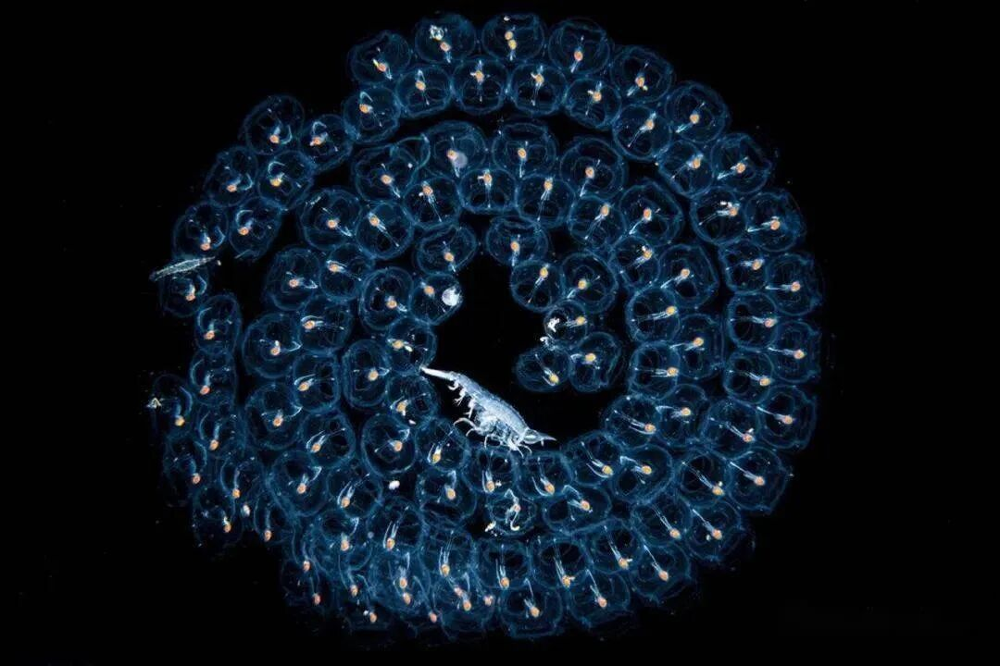
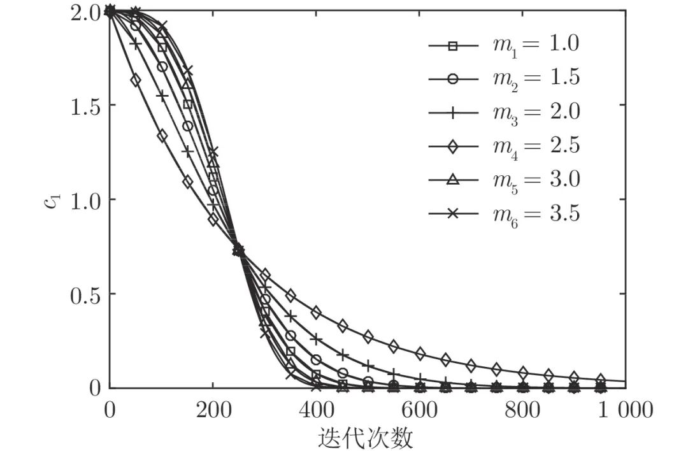
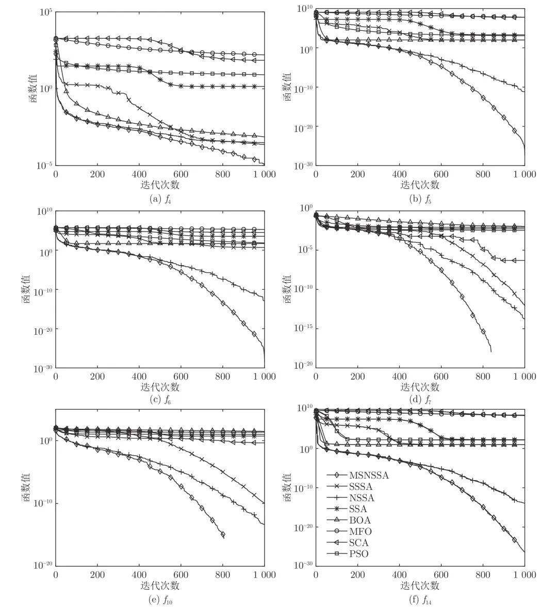

# 多子群的共生非均匀高斯变异樽海鞘群算法

原创 自动化学报 自动化学报 2022-05-09 16:00 北京

> 原文地址: [https://mp.weixin.qq.com/s/2mDWkQjUxQvHfgaEXyOofw](https://mp.weixin.qq.com/s/2mDWkQjUxQvHfgaEXyOofw)

**点击蓝字 关注我们**

✦

✦

摄影师：Chris Gug  

  

**引用本文**

✦

✦

✦

✦

  

陈忠云, 张达敏, 辛梓芸. 多子群的共生非均匀高斯变异樽海鞘群算法. 自动化学报, 2022, 48(5): 1307−1317 doi: 10.16383/j.aas.c190684

Chen Zhong-Yun, Zhang Da-Min, Xin Zi-Yun. Multi-subpopulation based symbiosis and non-uniform gaussian mutation salp swarm algorithm. Acta Automatica Sinica, 2022, 48(5): 1307−1317 doi: 10.16383/j.aas.c190684

http://www.aas.net.cn/cn/article/doi/10.16383/j.aas.c190684?viewType=HTML

  

**文章简介**

✦

✦

✦

✦

  

✦

**关键词**

✦

  

樽海鞘群算法, 多子群, 共生策略, 非均匀高斯变异, 函数优化

  

  

✦

**摘   要**

✦

  

针对樽海鞘群算法求解精度不高和收敛速度慢等缺点, 提出一种多子群的共生非均匀高斯变异樽海鞘群算法(Multi-subpopulation based symbiosis and non-uniform Gaussian mutation salp swarm algorithm, MSNSSA). 根据不同适应度值将樽海鞘链群分为三个子种群, 各个子种群分别进行领导者位置更新、追随者共生策略和链尾者非均匀高斯变异等操作. 使用统计分析、收敛速度分析、Wilcoxon检验、经典基准函数和CEC 2014函数的标准差来评估改进樽海鞘群算法的效率. 结果表明, 改进算法具有更好的寻优精度和收敛速度. 尤其在求解高维和多峰测试函数上, 改进算法拥有更好性能.

  

✦

**引   言**

✦

  

近年,元启发式算法作为一种有效的演化计算技术, 已受到众多学者的重视. 元启发式算法是指受到生物行为和物理现象的启发提出的一类算法, 其核心思想是实现搜索过程中随机性行为和局部搜索的平衡. 常用的元启发式算法包括粒子群算法(Particle swarm optimization, PSO)、正弦余弦算法(Sine cosine algorithm, SCA)、蝴蝶优化算法(Butterfly optimization algorithm, BOA)、飞蛾扑火优化算法(Moth-flame optimization algorithm, MFO)、大红斑蝶优化算法(Monarch butterfly optimization, MBO)、蚯蚓优化算法、大象放牧优化(Elephant herding optimization, EHO)等. 这些算法已成功应用于各种科学领域, 如过程控制、生物医学信号处理、图像处理以及许多其他工程设计问题.

  

樽海鞘群算法(Salp Swarm algorithm, SSA)是2017年由Mirjalili等提出的一种新型启发式智能算法. 樽海鞘群算法相对于粒子群算法等其他算法, 具有结构简单、参数少、容易实现等优点. 虽然樽海鞘群算法在求解大部分优化问题具有优越性, 但与其他群智能算法一样, 仍然存在求解精度低和收敛速度慢等缺陷. 文献\[9\]提出固定惯性权重, 可以加快搜索过程中的收敛速度, 并应用于特征选择问题. 文献\[10\]把樽海鞘群算法和混沌理论结合提出混沌樽海鞘群算法, 在解决特征提取问题时, 能发现最优特征子集, 最大程度地提高分类精度, 最小化所选特征的数目. 文献\[11\]提出采用子群规模调整, 每个子种群的大小随着进化的过程而逐渐增加, 有利于提高算法在初始阶段的探测能力和后期的开采能力. 文献\[12\]在算法中加入共享机制, 改进原始算法的随机追踪的位置更新公式, 降低搜索盲目性, 提高收敛速度. 文献\[13\]提出非均匀变异演化算法, 使个体能够跳出局部最优, 以克服早熟现象. 文献\[14\]通过高斯变异来增强蝙蝠算法种群的多样性.

  

为解决标准樽海鞘群算法存在的求解精度不高和收敛速度慢等问题, 本文提出了一种多子群的共生非均匀高斯变异樽海鞘群算法(Multi-subpopulation based symbiosis and non-uniform Gaussian mutation salp swarm algorithm, MSNSSA). 根据适应度值大小, 将种群分为领导者、追随者和链尾者三个子群. 首先对领导者位置更新公式中参数c1进行分析, 以更好平衡探索和开发能力; 然后对追随者位置更新公式采用共生策略, 增加与最优个体的交流, 增强局部开发能力; 最后链尾者更新使用非均匀高斯变异, 增强种群多样性. 通过求解14个典型测试函数和CEC 2014测试函数的最优解, 验证了改进算法MSNSSA的有效性和鲁棒性.

  

图 1  c\_1变化曲线

  

图 2  基准函数平均收敛曲线

  

请点击左下角“**阅读原文**”了解更多！

  

**作者简介**

✦

✦

✦

✦

  

**陈忠云**

贵州大学大数据与信息工程学院硕士研究生. 主要研究方向为智能优化算法和认知无线网络.

E-mail: chenzhongyun315@hotmail.com

**张达敏**

贵州大学大数据与信息工程学院教授. 主要研究方向为智能优化算法和认知无线网络. 本文通信作者.

E-mail: dmzhang@gzu.edu.cn

**辛梓芸**

贵州大学大数据与信息工程学院硕士研究生. 主要研究方向为智能优化算法和认知无线网络.

E-mail: muz\_e@sina.cn

  

**相关文章**

✦

✦

✦

✦

  

**（请向上滑动阅读）**

  

\[1\]  季新芳, 张勇, 巩敦卫, 郭一楠, 孙晓燕. 异构集成代理辅助的区间多模态粒子群优化算法. 自动化学报. doi: 10.16383/j.aas.c210223

http://www.aas.net.cn/cn/article/doi/10.16383/j.aas.c210223?viewType=HTML

  

\[2\]  邢致恺, 贾鹤鸣, 宋文龙. 基于莱维飞行樽海鞘群优化算法的多阈值图像分割. 自动化学报, 2021, 47(2): 363-377. doi: 10.16383/j.aas.c180140

http://www.aas.net.cn/cn/article/doi/10.16383/j.aas.c180140?viewType=HTML

  

\[3\]  龙文, 伍铁斌, 唐明珠, 徐明, 蔡绍洪. 基于透镜成像学习策略的灰狼优化算法. 自动化学报, 2020, 46(10): 2148-2164. doi: 10.16383/j.aas.c180695

http://www.aas.net.cn/cn/article/doi/10.16383/j.aas.c180695?viewType=HTML

  

\[4\]  马炫, 李星, 唐荣俊, 刘庆. 一种求解符号回归问题的粒子群优化算法. 自动化学报, 2020, 46(8): 1714-1726. doi: 10.16383/j.aas.c180035

http://www.aas.net.cn/cn/article/doi/10.16383/j.aas.c180035?viewType=HTML

  

\[5\]  乔俊飞, 李霏, 杨翠丽. 一种基于均匀分布策略的NSGAII算法. 自动化学报, 2019, 45(7): 1325-1334. doi: 10.16383/j.aas.c180085

http://www.aas.net.cn/cn/article/doi/10.16383/j.aas.c180085?viewType=HTML

  

\[6\]  董易, 施心陵, 王霞, 王耀民, 吕丹桔, 张松海, 李孙寸. 斐波那契树优化算法求解多峰函数全局最优解的可达性分析. 自动化学报, 2018, 44(9): 1679-1689. doi: 10.16383/j.aas.2017.c160703

http://www.aas.net.cn/cn/article/doi/10.16383/j.aas.2017.c160703?viewType=HTML

  

\[7\]  吴铁洲, 王越洋, 许玉姗, 郭林鑫, 石肖, 何淑婷. 基于PMP算法的HEV能量优化控制策略. 自动化学报, 2018, 44(11): 2092-2102. doi: 10.16383/j.aas.2017.c170176

http://www.aas.net.cn/cn/article/doi/10.16383/j.aas.2017.c170176?viewType=HTML

  

\[8\]  吕柏权, 张静静, 李占培, 刘廷章. 基于变换函数与填充函数的模糊粒子群优化算法. 自动化学报, 2018, 44(1): 74-86. doi: 10.16383/j.aas.2018.c160547

http://www.aas.net.cn/cn/article/doi/10.16383/j.aas.2018.c160547?viewType=HTML

  

\[9\]  王东风, 孟丽. 粒子群优化算法的性能分析和参数选择. 自动化学报, 2016, 42(10): 1552-1561. doi: 10.16383/j.aas.2016.c150774

http://www.aas.net.cn/cn/article/doi/10.16383/j.aas.2016.c150774?viewType=HTML

  

\[10\]  周晓君, 阳春华, 桂卫华, 董天雪. 带可变随机函数和变异算子的粒子群优化算法. 自动化学报, 2014, 40(7): 1339-1347. doi: 10.3724/SP.J.1004.2014.01339

http://www.aas.net.cn/cn/article/doi/10.3724/SP.J.1004.2014.01339?viewType=HTML

  

\[11\]  于坤杰, 王昕, 王振雷. 基于反馈的精英教学优化算法. 自动化学报, 2014, 40(9): 1976-1983. doi: 10.3724/SP.J.1004.2014.01976

http://www.aas.net.cn/cn/article/doi/10.3724/SP.J.1004.2014.01976?viewType=HTML

  

\[12\]  潘峰, 周倩, 李位星, 高琪. 标准粒子群优化算法的马尔科夫链分析. 自动化学报, 2013, 39(4): 381-389. doi: 10.3724/SP.J.1004.2013.00381

http://www.aas.net.cn/cn/article/doi/10.3724/SP.J.1004.2013.00381?viewType=HTML

  

\[13\]  郝志凯, 王硕, 谭民. 基于优化策略的混合定位算法. 自动化学报, 2010, 36(5): 711-719. doi: 10.3724/SP.J.1004.2010.00711

http://www.aas.net.cn/cn/article/doi/10.3724/SP.J.1004.2010.00711?viewType=HTML

  

\[14\]  潘峰, 陈杰, 辛斌, 张娟. 粒子群优化方法若干特性分析. 自动化学报, 2009, 35(7): 1010-1016. doi: 10.3724/SP.J.1004.2009.01010

http://www.aas.net.cn/cn/article/doi/10.3724/SP.J.1004.2009.01010?viewType=HTML

  

\[15\]  黄肖玲, 柴天佑. 粒子群优化算法在大型选矿企业原料采购计划中的应用. 自动化学报, 2009, 35(5): 632-636. doi: 10.3724/SP.J.1004.2009.00632

http://www.aas.net.cn/cn/article/doi/10.3724/SP.J.1004.2009.00632?viewType=HTML

  

\[16\]  吕强, 刘士荣, 邱雪娜. 基于信息素机制的粒子群优化算法的设计与实现. 自动化学报, 2009, 35(11): 1410-1419. doi: 10.3724/SP.J.1004.2009.01410

http://www.aas.net.cn/cn/article/doi/10.3724/SP.J.1004.2009.01410?viewType=HTML

  

\[17\]  钟一文, 蔡荣英. 求解二次分配问题的离散粒子群优化算法. 自动化学报, 2007, 33(8): 871-874. doi: 10.1360/aas-007-0871

http://www.aas.net.cn/cn/article/doi/10.1360/aas-007-0871?viewType=HTML

  

\[18\]  潘峰, 陈杰, 甘明刚, 蔡涛, 涂序彦. 粒子群优化算法模型分析. 自动化学报, 2006, 32(3): 368-377.

http://www.aas.net.cn/cn/article/id/15822?viewType=HTML

  

\[19\]  唐昊, 奚宏生, 殷保群. CTMDP基于随机平稳策略的仿真优化算法. 自动化学报, 2004, 30(2): 229-234.

http://www.aas.net.cn/cn/article/id/16186?viewType=HTML

  

\[20\]  李敏强, 寇纪淞. 多模态函数优化的协同多群体遗传算法. 自动化学报, 2002, 28(4): 497-504.

http://www.aas.net.cn/cn/article/id/15562?viewType=HTML

  

  

**近期文章**

✦

✦

✦

✦

  

[一种改进的特征子集区分度评价准则](http://mp.weixin.qq.com/s?__biz=MzAwMzAzMDgxOA==&mid=2651077115&idx=2&sn=f9e9063e82252dc6389f99cd9921b665&chksm=8131f3b6b6467aa0efe5b1d2a7898b081ad349d484ed7ce6603fd9dd2742bfd9afe599a49cf8&scene=21#wechat_redirect)

[基于多阶段注意力机制的多种导航传感器故障识别研究](http://mp.weixin.qq.com/s?__biz=MzAwMzAzMDgxOA==&mid=2651077115&idx=1&sn=cb5a0515e8ced5d96aec9aeee0c43906&chksm=8131f3b6b6467aa06f5244ad53639bb0452b6dfba6540ee50ea7d33b764e1e81fe712d58d371&scene=21#wechat_redirect)

[支持数据隐私保护的联邦深度神经网络模型研究](http://mp.weixin.qq.com/s?__biz=MzAwMzAzMDgxOA==&mid=2651077039&idx=1&sn=679f6b0a5a6a97ad2564e590bd534072&chksm=8131f3e2b6467af447638b7d6e7312046f128019c857cf8e79609736f5d57849cfa2c34f8ba4&scene=21#wechat_redirect)

[【热点专题】多目标优化](http://mp.weixin.qq.com/s?__biz=MzI2NjA3MzM5MA==&mid=2649962438&idx=1&sn=83b21f7b6a63fc4e01c2f4718b2aae92&chksm=f2943387c5e3ba91ce32286c06f215a989233f55bbbd5c7d436a43c40615bb5ae208d0f0f228&scene=21#wechat_redirect)

[联合样本输出与特征空间的半监督概念漂移检测法及其应用](http://mp.weixin.qq.com/s?__biz=MzAwMzAzMDgxOA==&mid=2651076994&idx=1&sn=4e40a43610e5879752437474d12ea2c8&chksm=8131f3cfb6467ad9f54ad169a3857897807584e30d02dbbf83c75664398d19992c1b95fb6be2&scene=21#wechat_redirect)

[面向行人重识别的局部特征研究进展、挑战与展望](http://mp.weixin.qq.com/s?__biz=MzAwMzAzMDgxOA==&mid=2651076994&idx=2&sn=2f1fe243ff0cc599548f9c1d238b4a59&chksm=8131f3cfb6467ad93a3228636e3780da17bb32b7383faa4e5746adab8a53db9281d1894c160c&scene=21#wechat_redirect)

[基于多智能体强化学习的乳腺癌致病基因预测](http://mp.weixin.qq.com/s?__biz=MzAwMzAzMDgxOA==&mid=2651076931&idx=1&sn=a62942cd056156ad5a885d6350e8b373&chksm=8131f30eb6467a18ffbee77b25fb9b0417b08918d3625d04c89a3a9bcb1490eece239c5fda25&scene=21#wechat_redirect)

[一种基于深度迁移学习的滚动轴承早期故障在线检测方法](http://mp.weixin.qq.com/s?__biz=MzAwMzAzMDgxOA==&mid=2651076931&idx=2&sn=128b1673843353529d8b130f372bb46f&chksm=8131f30eb6467a18e0f645b207ada16cd601b791297b32b1caccf72daa50b55063074ec4fdc3&scene=21#wechat_redirect)

[水下多机器人系统综述](http://mp.weixin.qq.com/s?__biz=MzAwMzAzMDgxOA==&mid=2651076668&idx=1&sn=b50e43710be8208fd711cd45943e95c0&chksm=8131f271b6467b675083610c925ce0d329e201ddab5c8e935eb266fbf41418395459fdd0618d&scene=21#wechat_redirect)

[《自动化学报》多名作者入选爱思唯尔2021中国高被引学者](http://mp.weixin.qq.com/s?__biz=MzAwMzAzMDgxOA==&mid=2651076637&idx=1&sn=ee78f108cf0551024cb95c33241a5f1d&chksm=8131f250b6467b46c8d4af1bd63381328a80c65ade97a6daa97e3bb4538b39c6f761da238066&scene=21#wechat_redirect)

[基于事件触发的离散MIMO系统自适应评判容错控制](http://mp.weixin.qq.com/s?__biz=MzAwMzAzMDgxOA==&mid=2651076863&idx=1&sn=aec9cf55a1b0b8eae741999601a8c6df&chksm=8131f2b2b6467ba4c20d388390d4ac191555e5d00d77f510f72af77359d18bdca5230ea52df0&scene=21#wechat_redirect)

[一种脑肢融合的神经康复训练在线评价与调整方法](http://mp.weixin.qq.com/s?__biz=MzAwMzAzMDgxOA==&mid=2651076801&idx=1&sn=01be1c22a480f6d2c52e4afcf7c173d8&chksm=8131f28cb6467b9af8e33ff70860ff2731c797d27cbbda568088b6d17a41ae07d38ebb59a0e5&scene=21#wechat_redirect)

[基于自适应LASSO先验的稀疏贝叶斯学习算法](http://mp.weixin.qq.com/s?__biz=MzAwMzAzMDgxOA==&mid=2651076733&idx=1&sn=01ccbc6fe6e387330aa93ae1a2a11953&chksm=8131f230b6467b260036bbc1efe3db2924397a4e7ba2f683e2e0c4819805906180d44529244a&scene=21#wechat_redirect)  

[眼动跟踪研究进展与展望](http://mp.weixin.qq.com/s?__biz=MzAwMzAzMDgxOA==&mid=2651076581&idx=1&sn=dab1369362bf1790033e5cf2f5736281&chksm=8131fda8b64674be08cbf0bf3bf5a928115b76ec24e8000cad36820b039d33dedba8a048210e&scene=21#wechat_redirect)

  

**热点文章**

✦

✦

✦

✦

  

[【热点专题】多目标优化](http://mp.weixin.qq.com/s?__biz=MzI2NjA3MzM5MA==&mid=2649962438&idx=1&sn=83b21f7b6a63fc4e01c2f4718b2aae92&chksm=f2943387c5e3ba91ce32286c06f215a989233f55bbbd5c7d436a43c40615bb5ae208d0f0f228&scene=21#wechat_redirect)

[基于事件触发的分布式优化算法](http://mp.weixin.qq.com/s?__biz=MzAwMzAzMDgxOA==&mid=2651076142&idx=2&sn=b074793ec4be44ea08efb78617dcdcc0&chksm=8131fc63b6467575b7f6d698909e56be16089f8f56ca415294483ff6f40902c7546417f82531&scene=21#wechat_redirect)

[一种针对德州扑克AI的对手建模与策略集成框架](http://mp.weixin.qq.com/s?__biz=MzAwMzAzMDgxOA==&mid=2651075800&idx=1&sn=9ab9006d50bb2513c49006b1c1431a3c&chksm=8131fe95b6467783eb58de5d7b1726ddcb881561603c76bdcefa44f4a9a9027afc37b1be979c&scene=21#wechat_redirect)

[工业铸件缺陷无损检测技术的应用进展与展望](http://mp.weixin.qq.com/s?__biz=MzAwMzAzMDgxOA==&mid=2651075561&idx=1&sn=afda9a46702ab802788e1c9fc67b5849&chksm=8131f9a4b64670b2c122efca37574a0dceda3582b0477845b80670246b4eb8befce2ae748dc1&scene=21#wechat_redirect)

[CVPR 2022 | 自动化所新作速览！（上）](http://mp.weixin.qq.com/s?__biz=MzAwMzAzMDgxOA==&mid=2651075034&idx=2&sn=48b5232daaa7a51da96c3a7c87013e2d&chksm=8131fb97b6467281dc8e02749df8d0388f89d30e3b08f44d13c700169d1d7a22c4feef9f2dba&scene=21#wechat_redirect)

[CVPR 2022 | 自动化所新作速览！（下）](http://mp.weixin.qq.com/s?__biz=MzAwMzAzMDgxOA==&mid=2651075034&idx=3&sn=21833bb312bb0d9826c64c9fce068aa5&chksm=8131fb97b646728147f2bff58a04230d708d5a4537eb824656c2d54580b11f6a47b0eb30ade6&scene=21#wechat_redirect)

[直播回放分享 | 陈关荣教授：探索最优同步网络的拓扑结构](http://mp.weixin.qq.com/s?__biz=MzIxMjA5Njg2Nw==&mid=2649061608&idx=1&sn=1500a81260d8f5127b7cb7767c759fba&chksm=8f5a9ae4b82d13f201b714d8e96af9bbddf442bb7e10c97416fb925ab2170c05fa12010fb1d1&scene=21#wechat_redirect)

[《自动化学报》2019年高关注论文](http://mp.weixin.qq.com/s?__biz=MzAwMzAzMDgxOA==&mid=2651073450&idx=1&sn=6f57bd0df73f259aa416575f1f69bdfb&chksm=8131e1e7b64668f1344de4acdef6148e8dcfa60c80e4f48e6cb1270558c2beade5601e92d05c&scene=21#wechat_redirect)

[《自动化学报》2021年热点文章回顾](http://mp.weixin.qq.com/s?__biz=MzAwMzAzMDgxOA==&mid=2651072577&idx=1&sn=4e6be077d7371c7d29d9a371d8defe19&chksm=8131e20cb6466b1aec2f3b8b1063d3be11725ca9a0c15785c3b42a638170e732acd0d8d345e0&scene=21#wechat_redirect)

[国家自然科学基金论文精选](http://mp.weixin.qq.com/s?__biz=MzI2NjA3MzM5MA==&mid=2649960308&idx=1&sn=1634c999f22588333537f13393403f9c&chksm=f2942b35c5e3a2232e86b51c2b7c8f37a4d3d7f858d370d76d5afd00567d7da6e9543476d120&scene=21#wechat_redirect)  

[国家重点研发计划论文精选](http://mp.weixin.qq.com/s?__biz=MzI2NjA3MzM5MA==&mid=2649960255&idx=1&sn=f48435928fd924134cb72014860b9d00&chksm=f2942b7ec5e3a26869da68a1419b3b40ca1e6cb98abf2e380d78a49ffb99c85991d76cc346b0&scene=21#wechat_redirect)

  

**期刊动态**

✦

✦

✦

✦

  

[《自动化学报》多名作者入选爱思唯尔2021中国高被引学者](http://mp.weixin.qq.com/s?__biz=MzAwMzAzMDgxOA==&mid=2651076637&idx=1&sn=ee78f108cf0551024cb95c33241a5f1d&chksm=8131f250b6467b46c8d4af1bd63381328a80c65ade97a6daa97e3bb4538b39c6f761da238066&scene=21#wechat_redirect)

[自动化学报（英文版）和自动化学报入选计算领域高质量科技期刊T1类](http://mp.weixin.qq.com/s?__biz=MzAwMzAzMDgxOA==&mid=2651073859&idx=2&sn=7a9192717637dcf6cddb39ed961e8c3b&chksm=8131e70eb6466e188a123c504bdeba80c75681de4762f8685b3bf584bc33eb12362c70613b4e&scene=21#wechat_redirect)

[《自动化学报》编辑部防诈骗公告](http://mp.weixin.qq.com/s?__biz=MzAwMzAzMDgxOA==&mid=2651073517&idx=1&sn=c52de7c685e546af9faffc0cefab1c85&chksm=8131e1a0b64668b63ebaa68ea81cbaec3b94dc52ea8360821a0a49e67ae7e4b428a25d0f19c5&scene=21#wechat_redirect)

[《自动化学报》致谢审稿人](http://mp.weixin.qq.com/s?__biz=MzI2NjA3MzM5MA==&mid=2649961201&idx=1&sn=3142842d75c441ae860c1ecb313c7657&chksm=f29436b0c5e3bfa6c679210f60513eb1a7205dc20fe028f482bb593eac60427e4e56fba12493&scene=21#wechat_redirect)

[自动化学报多篇论文入选中国百篇最具影响国内论文和中国精品期刊顶尖论文](http://mp.weixin.qq.com/s?__biz=MzI2NjA3MzM5MA==&mid=2649961152&idx=1&sn=4a5e9e4b84879f4cde4e13a0ef97272c&chksm=f2943681c5e3bf97d7770c9623dac869b283b3ea83f3d320017974033e361d8b999134a8bdff&scene=21#wechat_redirect)

[自动化学报各项主要指标蝉联第1，再获百种中国杰出期刊称号](http://mp.weixin.qq.com/s?__biz=MzI2NjA3MzM5MA==&mid=2649960903&idx=1&sn=7da8b8a0167e16bcbaa1f00fbfb69782&chksm=f2943586c5e3bc9014f6d4fff7147b998ae42b4da452907e641e8029f296fd2413b4f17aef62&scene=21#wechat_redirect)

  

**期刊目录**

✦

✦

✦

✦

  

[2022年第04期](http://mp.weixin.qq.com/s?__biz=MzI2NjA3MzM5MA==&mid=2649962369&idx=1&sn=ae2c4584f8904be917b600e67005ae03&chksm=f29433c0c5e3bad6d78382b3c09015aadb09e040b8fc8c319c4f554fd592fe677797000340cd&scene=21#wechat_redirect)

[2022年第03期](http://mp.weixin.qq.com/s?__biz=MzAwMzAzMDgxOA==&mid=2651075527&idx=1&sn=bc020c5fd09080243f7527610b003507&chksm=8131f98ab646709c2f485852b526989a3b9af5cc93e8afb508d9239b78176f49caa9807d6a8d&scene=21#wechat_redirect)

[2022年第02期](http://mp.weixin.qq.com/s?__biz=MzI2NjA3MzM5MA==&mid=2649961838&idx=1&sn=29334896aa0f372b70312250c75b6b20&chksm=f294312fc5e3b8392ffd49100eaba435bf48fa9234c5019fe7b16ed1e4ebef70be58691f3fb3&scene=21#wechat_redirect)

[2022年第01期](http://mp.weixin.qq.com/s?__biz=MzI2NjA3MzM5MA==&mid=2649961423&idx=1&sn=3b65958faa7c7f94c247f46dd72bd71e&chksm=f294378ec5e3be9825f860d132c36c97f3e877089449cb1fe85a6d1e7da9bd0e24795336bc54&scene=21#wechat_redirect)

[《自动化学报》2021年全年合集](http://mp.weixin.qq.com/s?__biz=MzAwMzAzMDgxOA==&mid=2651072770&idx=1&sn=7c531f7fa3bc390558fab15b339ce86e&chksm=8131e34fb6466a59ed079448fddda0fc9f97066460bff8f6835288003a1fba2812de383813c1&scene=21#wechat_redirect)

[《自动化学报》2020年全年合集](http://mp.weixin.qq.com/s?__biz=MzI2NjA3MzM5MA==&mid=2649957972&idx=1&sn=1951847aacbcb7d22bdd2a46a79af871&chksm=f2942215c5e3ab03d070d8e52b8764b38036897c97b6a26c7a1f918c806b28edbe6c0fbf7ea9&scene=21#wechat_redirect)

[2020年第10期 工业人工智能专题](http://mp.weixin.qq.com/s?__biz=MzI2NjA3MzM5MA==&mid=2649957201&idx=1&sn=ab82a767bd716ab67fdf2942500d8b61&chksm=f2942710c5e3ae06b27f9e63a5e329a1123d90b051164e6b6123c500230541b1ed12d92abbfb&scene=21#wechat_redirect)

[2020年第09期 分布式信息能源系统理论与应用专题](http://mp.weixin.qq.com/s?__biz=MzI2NjA3MzM5MA==&mid=2649956412&idx=1&sn=8ebc13d63fd333ad85dbb8b5825df248&chksm=f294247dc5e3ad6ba297857a5b957e97cf499266c50318791fa8abd9432ecf1d9c3d9b287e36&scene=21#wechat_redirect)

  

  

  

**长按二维码｜关注我们**

**IEEE/CAA Journal of Automatica Sinica (JAS)**

**长按二维码｜关注我们**

**《自动化学报》服务号**

**长按二维码｜关注我们**

**《自动化学报》订阅号**  

  

**联系我们**

**网站:** 

http://www.aas.net.cn

http://www.ieee-jas.net

**投稿:** 

https://mc03.manuscriptcentral.com/aas-cn   

https://mc03.manuscriptcentral.com/ieee-jas 

**电话:**

010-82544653（日常咨询和稿件处理） 

010-82544677（录用后稿件处理）

**邮箱:** 

aas@ia.ac.cn（日常咨询和稿件处理）  

aas\_editor@ia.ac.cn（录用后稿件处理）

**博客:** 

http://blog.sina.com.cn/aaseditor 

  

**↓ 点击下方 阅读原文 了解更多**