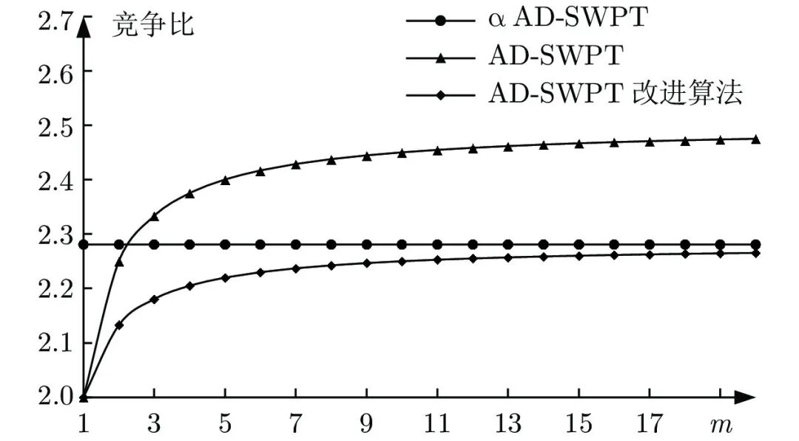

# 带有资源冲突的Seru在线并行调度算法

原创 自动化学报 自动化学报 2022-02-09 14:06 北京

> 原文地址: [https://mp.weixin.qq.com/s/N7RD5-EpY9NR2n3IGjyKjA](https://mp.weixin.qq.com/s/N7RD5-EpY9NR2n3IGjyKjA)

点击蓝字

关注我们

  

推荐一篇**Seru生产系统**方面的文章，希望您能喜欢！欢迎已经优先出版的作者给小编提供资料（请您向编辑部索要推送模板aaswkfb@ia.ac.cn），及时发布在我们的公众号上宣传。

  

**引用格式**

江煜舟, 李冬妮, 靳洪博, 殷勇. 带有资源冲突的Seru在线并行调度算法. 自动化学报, 2022, 48(2): 444−459 DOI: 10.16383/j.aas.c190698      

(Jiang Yu-Zhou, Li Dong-Ni, Jin Hong-Bo, Yin Yong. An online algorithm for parallel scheduling of serus with resource conflicts. Acta Automatica Sinica, 2022, 48(2): 444−459 DOI: 10.16383/j.aas.c190698)

http://www.aas.net.cn/cn/article/doi/10.16383/j.aas.c190698?viewType=HTML

  

**文章简介**

  

**关键词**

  

赛如生产系统, 在线调度, 竞争比, 实例归约, 总加权完工时间 

  

**摘  要**

  

随着大规模定制的市场需求日趋显著, 赛如生产系统(Seru production system, SPS)应运而生, 逐渐成为研究和应用领域的热点. 本文针对带有资源冲突的Seru在线并行调度问题进行研究, 即需要在有限的空间位置上安排随动态需求而构建的若干Seru, 以总加权完工时间最小为目标, 决策Seru的构建顺序及时间. 先基于平均延迟最短加权处理时间(Average delayed shortest weighted processing time, AD-SWPT)算法, 针对其竞争比不为常数的局限性, 引入调节参数, 得到竞争比为常数的无资源冲突的Seru在线并行调度算法. 接下来, 引入冲突处理机制, 得到有资源冲突的Seru在线并行调度算法, αAD-I (α-average delayed shortest weighted processing time-improved)算法, 特殊实例下可通过实例归约的方法证明其竞争比与无资源冲突的情况相同. 最后, 通过实验, 验证了在波动的市场环境下算法对于特殊实例与一般实例的优越性.  

  

**引  言**

  

随着大规模定制发展的趋势, 传统的生产系统, 如流水线(Flow line)、丰田生产系统(Toyota production system, TPS)、作业车间(Job shop)、单元制造系统(Cellular manufacturing system, CMS)等, 难以适应对动态不确定市场的快速响应需求, 赛如生产系统(Seru production system, SPS)应运而生.

  

Yin等的研究展示了传统生产系统转化为SPS的重要性, Liu等的研究也表明SPS具有传统生产系统难以企及的先进性和发展前景. 自二十世纪九十年代起, SPS已经逐渐被亚洲的众多电子企业采用, 如三星、佳能、LG、索尼、松下、富士通、NEC、富士康等.

  

SeruSeru代指SPS下的最小生产单元, 脱胎自基于精益(Lean)思想的装配流水线, 一个SeruSeru通常是生产一种或多种产品的装配单元, 包含若干设备和工人.

  

一个SPS至少包含一个SeruSeru. SPS中的每一个SeruSeru都能够频繁地在短时间内被重构, 这给SPS带来了极大的灵活性. 可以快速频繁地建立、改变、拆除和转化, 以响应频繁波动的市场需求.

  

SPS运作管理的基本原则为面向“组织”的准时生产原则(Just-in-time organisation system, JIT-OS), 是TPS传统的面向“物料”的准时生产原则(Just-in-time material system, JIT-MS)的延伸. JIT-MS指在合适的时间地点投入合适的物料, 强调的是物料. 而JIT-OS强调的是组织, 对应到SPS, 即在合适的时间地点构建合适的SeruSeru. 这让SPS可以通过调整生产组织结构快速获得相应的生产能力, 为重构的实施提供了有效的载体和途径.

  

SPS的运作可以被划分为SeruSeru构建与SeruSeru调度两个部分, SeruSeru构建指如何依据订单任务对人员进行分配与组合, SeruSeru调度指如何在有限的空间下安排各个SeruSeru的构建顺序及时间, 目前相关研究大都侧重于SeruSeru构建. 如Liu等提出的解决工人分配问题的三段式启发模型、Yu等提出的以产品流通时间和总劳动时间为目标的一种非支配排序遗传算法、Yu等结合局部搜索算法提出的第二代非支配排序遗传算法、吴旭辉等联合SeruSeru构建与订单分配提出的一种协同进化算法、贾凌云等与田云娜等对跨单元调度问题的研究等.

  

目前对SeruSeru调度这一方面的研究相对较少, 难以充分体现SPS调整结构的动态性, 但要想充分发挥出SPS的灵活性, 快速响应“小批量, 多品种”市场的动态变化, 在提高SeruSeru构建效率之外, 还需要考虑结构上的变化, 即SeruSeru调度. 如何在有限的位置上安排SeruSeru的构建顺序及时间也是SPS运作管理基本原则JIT-OS的一项重要内容.

  

据此, 本文对SeruSeru在线并行调度问题展开了研究, 该问题具体是指, 将随时间动态构建的n个SeruSeru安排到有限的m个位置上, 以总加权完工时间最小为目标, 在线决策各SeruSeru的构建顺序及时间. 同时, 考虑到具体的生产环境, 为了增强算法的实用性, 本文还将对带有资源冲突的SeruSeru在线并行调度问题进行讨论.

  

三个算法的竞争比

  

**作者简介**

**江煜舟**

北京理工大学计算机学院博士研究生. 主要研究方向为赛如生产智能优化.

E-mail: jiang\_yuzhou@163.com

**李冬妮**

北京理工大学计算机学院教授. 主要研究方向为智能优化与仿真计算, 智慧工厂与数字孪生. 本文通信作者.

E-mail: ldn@bit.edu.cn

**靳洪博**

北京理工大学计算机学院博士研究生. 主要研究方向为赛如生产智能优化.

E-mail: hb@bit.edu.cn

**殷  勇**

同志社大学商学院教授. 主要研究方向为赛如生产与工业 4.0.

E-mail: yyin@mail.doshisha.ac.jp

  

**相关文章**

  

**（请向上滑动阅读）**

  

\[1\]  赵晓丽, 宫华, 车平. 批处理机上具有两类释放时间的工件集竞争调度问题\[J\]. 自动化学报, 2020, 46(1): 168-177. doi: 10.16383/j.aas.2018.c170536    

http://www.aas.net.cn/cn/article/doi/10.16383/j.aas.2018.c170536?viewType=HTML

  

\[2\]  王永富, 马冰心, 柴天佑, 张晓宇. PEMFC空气供给系统的二型自适应模糊建模与过氧比控制\[J\]. 自动化学报, 2019, 45(5): 853-865. doi: 10.16383/j.aas.c180047  

http://www.aas.net.cn/cn/article/doi/10.16383/j.aas.c180047?viewType=HTML

  

\[3\]  吴旭辉, 杜劭峰, 郝慧慧, 于洋, 殷勇, 李冬妮. 一种基于协同进化的流水线向Seru系统转化方法. 自动化学报, 2018, 44(6): 1015-1027

http://www.aas.net.cn/cn/article/doi/10.16383/j.aas.2018.c160642?viewType=HTML

  

\[4\]  田云娜, 李冬妮, 刘兆赫, 郑丹. 一种基于动态决策块的超启发式跨单元调度方法. 自动化学报, 2016, 42(4): 524-534

http://www.aas.net.cn/cn/article/doi/10.16383/j.aas.2016.c150402?viewType=HTML

  

\[5\]  俞胜平, 柴天佑. 开工时间延迟下的炼钢-连铸生产重调度方法\[J\]. 自动化学报, 2016, 42(3): 358-374. doi: 10.16383/j.aas.2016.c150197  

http://www.aas.net.cn/cn/article/doi/10.16383/j.aas.2016.c150197?viewType=HTML

  

\[6\]  贾凌云, 李冬妮, 田云娜. 基于混合蛙跳和遗传规划的跨单元调度方法. 自动化学报, 2014, 40(5): 936-948

http://www.aas.net.cn/cn/article/doi/10.16383/j.aas.2015.c140455?viewType=HTML

  

\[7\]  王大志, 刘士新, 郭希旺. 求解总拖期时间最小化流水车间调度问题的多智能体进化算法\[J\]. 自动化学报, 2014, 40(3): 548-555. doi: 10.3724/SP.J.1004.2014.00548

http://www.aas.net.cn/cn/article/doi/10.3724/SP.J.1004.2014.00548?viewType=HTML

  

\[8\]  汤步洲, 王晓龙, 王轩. 置信度加权在线序列标注算法\[J\]. 自动化学报, 2011, 37(2): 188-195. doi: 10.3724/SP.J.1004.2011.00188    

http://www.aas.net.cn/cn/article/doi/10.3724/SP.J.1004.2011.00188?viewType=HTML

  

\[9\]  刘亮, 段纳, 解学军. 具有奇整数比次方的随机高阶非线性系统的输出反馈镇定\[J\]. 自动化学报, 2010, 36(6): 858-864. doi: 10.3724/SP.J.1004.2010.00858

http://www.aas.net.cn/cn/article/doi/10.3724/SP.J.1004.2010.00858?viewType=HTML

  

\[10\]  於春月, 王成恩, 曲蓉霞. 中厚板热轧生产调度优化方法\[J\]. 自动化学报, 2010, 36(2): 282-288. doi: 10.3724/SP.J.1004.2010.00282    

http://www.aas.net.cn/cn/article/doi/10.3724/SP.J.1004.2010.00282?viewType=HTML

  

\[11\]  赵君, 刘全利, 王伟. 冷轧生产调度模型及算法\[J\]. 自动化学报, 2008, 34(5): 565-573. doi: 10.3724/SP.J.1004.2008.00565    

http://www.aas.net.cn/cn/article/doi/10.3724/SP.J.1004.2008.00565?viewType=HTML

  

\[12\]  张居阳, 孙吉贵, 杨轻云. 半在线调度中约束求解算法研究\[J\]. 自动化学报, 2007, 33(7): 765-767. doi: 10.1360/aas-007-0765    

http://www.aas.net.cn/cn/article/doi/10.1360/aas-007-0765?viewType=HTML

  

\[13\]  赵玉芳, 唐立新. 极小化最大完工时间的单机连续型批调度问题\[J\]. 自动化学报, 2006, 32(5): 730-737. 

http://www.aas.net.cn/cn/article/id/13757?viewType=HTML

  

\[14\]  翟桥柱, 管晓宏, 郭燕, 孙岚, 范炜. 具有混合动态约束的生产系统优化调度新算法\[J\]. 自动化学报, 2004, 30(4): 539-546.    

http://www.aas.net.cn/cn/article/id/16199?viewType=HTML

  

\[15\]  赵传立, 张庆灵, 唐恒永. 具有线性恶化加工时间的调度问题\[J\]. 自动化学报, 2003, 29(4): 531-535.  

http://www.aas.net.cn/cn/article/id/13907?viewType=HTML

  

\[16\]  赵传立, 张庆灵, 唐恒永. 一类线性加工时间单机调度问题\[J\]. 自动化学报, 2003, 29(5): 703-708.    

http://www.aas.net.cn/cn/article/id/13882?viewType=HTML

  

\[17\]  蔡圣义, 何勇. 工件从大到小到达的带处理器费用的半在线调度算法\[J\]. 自动化学报, 2003, 29(6): 917-921.

http://www.aas.net.cn/cn/article/id/16430?viewType=HTML

  

请点击左下角“**阅读原文**”了解更多！

  

  

**期刊目录**

[2022年第01期](http://mp.weixin.qq.com/s?__biz=MzI2NjA3MzM5MA==&mid=2649961423&idx=1&sn=3b65958faa7c7f94c247f46dd72bd71e&chksm=f294378ec5e3be9825f860d132c36c97f3e877089449cb1fe85a6d1e7da9bd0e24795336bc54&scene=21#wechat_redirect)

[《自动化学报》2021年全年合集](http://mp.weixin.qq.com/s?__biz=MzAwMzAzMDgxOA==&mid=2651072770&idx=1&sn=7c531f7fa3bc390558fab15b339ce86e&chksm=8131e34fb6466a59ed079448fddda0fc9f97066460bff8f6835288003a1fba2812de383813c1&scene=21#wechat_redirect)

[《自动化学报》2020年全年合集](http://mp.weixin.qq.com/s?__biz=MzI2NjA3MzM5MA==&mid=2649957972&idx=1&sn=1951847aacbcb7d22bdd2a46a79af871&chksm=f2942215c5e3ab03d070d8e52b8764b38036897c97b6a26c7a1f918c806b28edbe6c0fbf7ea9&scene=21#wechat_redirect)

[2020年第10期 工业人工智能专题](http://mp.weixin.qq.com/s?__biz=MzI2NjA3MzM5MA==&mid=2649957201&idx=1&sn=ab82a767bd716ab67fdf2942500d8b61&chksm=f2942710c5e3ae06b27f9e63a5e329a1123d90b051164e6b6123c500230541b1ed12d92abbfb&scene=21#wechat_redirect)

[2020年第09期 分布式信息能源系统理论与应用专题](http://mp.weixin.qq.com/s?__biz=MzI2NjA3MzM5MA==&mid=2649956412&idx=1&sn=8ebc13d63fd333ad85dbb8b5825df248&chksm=f294247dc5e3ad6ba297857a5b957e97cf499266c50318791fa8abd9432ecf1d9c3d9b287e36&scene=21#wechat_redirect)

  

**热点文章**

[《自动化学报》2021年热点文章回顾](http://mp.weixin.qq.com/s?__biz=MzAwMzAzMDgxOA==&mid=2651072577&idx=1&sn=4e6be077d7371c7d29d9a371d8defe19&chksm=8131e20cb6466b1aec2f3b8b1063d3be11725ca9a0c15785c3b42a638170e732acd0d8d345e0&scene=21#wechat_redirect)

[国家自然科学基金论文精选](http://mp.weixin.qq.com/s?__biz=MzI2NjA3MzM5MA==&mid=2649960308&idx=1&sn=1634c999f22588333537f13393403f9c&chksm=f2942b35c5e3a2232e86b51c2b7c8f37a4d3d7f858d370d76d5afd00567d7da6e9543476d120&scene=21#wechat_redirect)

[国家重点研发计划论文精选](http://mp.weixin.qq.com/s?__biz=MzI2NjA3MzM5MA==&mid=2649960255&idx=1&sn=f48435928fd924134cb72014860b9d00&chksm=f2942b7ec5e3a26869da68a1419b3b40ca1e6cb98abf2e380d78a49ffb99c85991d76cc346b0&scene=21#wechat_redirect)

[中国科学院自动化研究所高层次人才招聘启事 | 长期有效](http://mp.weixin.qq.com/s?__biz=MzI2NjA3MzM5MA==&mid=2649959451&idx=1&sn=657b7e4aeeaa88114d5189641c5409dc&chksm=f294285ac5e3a14cd230a2b9678c32ba9bf92e8ffc9d61d506c5ffea2df793456dd37c2c6fb1&scene=21#wechat_redirect)

  

**期刊动态**

[《自动化学报》致谢审稿人](http://mp.weixin.qq.com/s?__biz=MzAwMzAzMDgxOA==&mid=2651072581&idx=1&sn=0015285a83a86dcc192171d7086a4411&chksm=8131e208b6466b1edc1882937de90bdd6ad081ae2635c48648c488d0e61c3adba04bd21f5e50&scene=21#wechat_redirect)

[自动化学报多篇论文入选中国百篇最具影响国内论文和中国精品期刊顶尖论文](http://mp.weixin.qq.com/s?__biz=MzI2NjA3MzM5MA==&mid=2649961152&idx=1&sn=4a5e9e4b84879f4cde4e13a0ef97272c&chksm=f2943681c5e3bf97d7770c9623dac869b283b3ea83f3d320017974033e361d8b999134a8bdff&scene=21#wechat_redirect)

[自动化学报各项主要指标蝉联第1，再获百种中国杰出期刊称号](http://mp.weixin.qq.com/s?__biz=MzAwMzAzMDgxOA==&mid=2651072451&idx=1&sn=4ec5101a4eef20c2fa0fe7303813f2b0&chksm=8131ed8eb6466498039e33d8fb1b621366c7fb8470e2ad9e46f875f06301ef8bc3691b903e96&scene=21#wechat_redirect)

[《自动化学报》发表文章入选第六届中国科协优秀科技论文](http://mp.weixin.qq.com/s?__biz=MzI2NjA3MzM5MA==&mid=2649960313&idx=1&sn=01b5a9defe9664ba4a0b8d7322e115d0&chksm=f2942b38c5e3a22e2c57edaa8667a27368ccfb595e6a372dfa85ff2a61329788870d77957a2f&scene=21#wechat_redirect)

[自动化学报（英文版）首届青年编委招募](http://mp.weixin.qq.com/s?__biz=MzI2NjA3MzM5MA==&mid=2649959475&idx=1&sn=e28ce2b8fa27ee4fb6a5c0c17e25dd25&chksm=f2942872c5e3a16438dbf45fd8091b643cd2bf50f0bab7092a6c5103d06cd4a16ebceb4db40a&scene=21#wechat_redirect)

  

  

**长按二维码｜关注我们**

**IEEE/CAA Journal of Automatica Sinica (JAS)**

**长按二维码｜关注我们**

**《自动化学报》服务号**

**长按二维码｜关注我们**

**《自动化学报》订阅号**  

  

**联系我们**

**网站:** 

http://www.aas.net.cn

http://www.ieee-jas.net

**投稿:** 

https://mc03.manuscriptcentral.com/aas-cn   

https://mc03.manuscriptcentral.com/ieee-jas 

**电话:**  010-82544653（日常咨询和稿件处理） 

           010-82544677（录用后稿件处理）

**邮箱:**  aas@ia.ac.cn（日常咨询和稿件处理）  

           aas\_editor@ia.ac.cn（录用后稿件处理）

**博客:** 

http://blog.sina.com.cn/aaseditor 

  

**↓ 点击下方 阅读原文 了解更多**