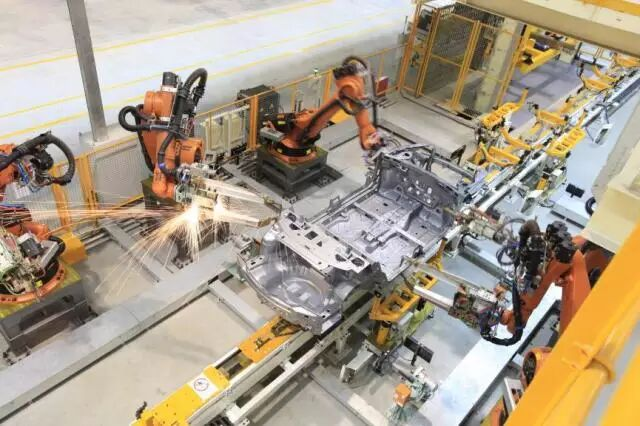
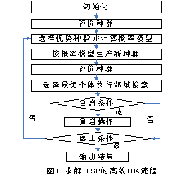
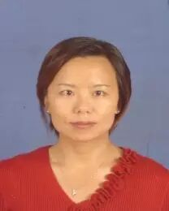
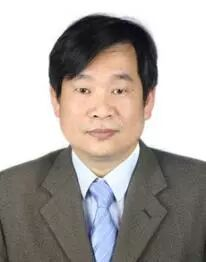

# 求解柔性流水车间调度问题的高效分布估算算法

原创 自动化学报 2017-03-30 09:04 北京

> 原文地址: [https://mp.weixin.qq.com/s/KcGcBx\_C-q\_B9berZc2pBA](https://mp.weixin.qq.com/s/KcGcBx_C-q_B9berZc2pBA)

柔性流水车间调度, 又称混合流水车间调度，广泛存在于机械、化工、物流、冶金、半导体、建筑、纺织、造纸等领域, 是流水车间调度问题的推广。以最小化最大完工时间为目标的柔性流水车间调度研究，是实现车间高效生产的重要措施。

研究背景

按照Graham的三元组表示方法, 该研究问题可以表示为EFm(r)||Cmax，它是典型的NP-难问题。求解该问题的算法有遗传算法、禁忌搜索、模拟退火、粒子群、类水流、蚁群算法以及分布估算算法等。分布估算算法具有超强的全局搜索能力，在求解该问题时展现了独特的优势，其求解性能高于人工免疫算法、遗传算法和量子免疫算法。因为基于排列的编码方法易于种群基因的各种进化操作，所以目前绝大多数的算法仍然采用这种编码方式。这种编码方式代表第一阶段的工件排序，然后采用先到先加工的排列规则和最先空闲机器优化规则，对后续阶段的工件排序和机器分配进行基因解码，获得调度方案。虽然这种规则解码能快速缩减搜索空间，但规则的贪婪性容易导致算法早熟，降低了算法的求解性能。

本文算法

为了高效地求解最小化最大完工时间的FFSP，本文重点研究EDA及其改进。首先，基于问题分析，构建了混合整数线性规划模型，使小规模问题能通过Cplex准确求解。其次，针对大规模问题，研究了高效分布估算算法，其求解流程见图：

（1）通过结合启发式规则与随机概率，设计FFSP的随机规则解码方法；

（2）通过把已定工件的概率补偿给可选工件，构建动态调整概率模型，提高EDA 算法的收敛速度和收敛质量；

（3）结合邻域搜索和重启机制构建了高效分布估算算法, 并通过正交实验校验EDA的最优参数组合。最后，通过算例和实例测试，验证了算法的高效性。

结论及展望

通过本文的研究，表明增加随机概率后的解码方法较之纯规则解码更易获得全局最优解，而高效EDA算法在求解质量和稳定性方面优于GA、GSA和原有EDA。同时，算例和实例的测试表明EDA 算法收敛速度快, 但易早熟，结合新颖高效智能算法来求解柔性流水车间调度仍然是一个可行研究领域。特别是结合工程需要, 寻找多约束, 如成组、成批、带No-idle 或No-wait 约束的柔性流水车间调度, 以及考虑能效或碳排放的FFSP 多目标调度是制造行业需重点关注的领域。

引用格式

王芳, 唐秋华, 饶运清, 张超勇, 张利平. 求解柔性流水车间调度问题的高效分布估算算法. 自动化学报, 2017, 43(2): 280-293

作者简介

王芳 武汉科技大学管理学院副教授, 华中科技大学机械科学与工程学院博士研究生. 分别于2002 年和2005 年获得西北工业大学学士和硕士学位. 主要研究方向为决策理论与方法, 调度优化与智能算法.

E-mail: wangfang79@wust.edu.cn

唐秋华 武汉科技大学机械自动化学院教授. 1992 年获得东北大学学士学位, 2000 年获得武汉科技大学硕士学位, 2005 年获得武汉理工大学博士学位. 主要研究方向为现代制造系统, 制造业信息化和工业工程. 本文通信作者.

E-mail: tangqiuhua@wust.edu.cn

饶运清 华中科技大学机械科学与工程学院教授. 1989 年获得华中科技大学机械制造专业学士学位, 1999 年获得该校机械制造及其自动化专业工学博士学位.主要研究方向为制造执行系统与数字化车间, 制造系统建模与运行优化.

E-mail: ryq@mail.hust.edu.cn

张超勇 华中科技大学机械科学与工程学院副教授. 1993 年获得天津科技大学学士学位, 1999 年获得北京科技大学硕士学位, 2007 年获得华中科技大学博士学位. 主要研究方向为制造系统运行优化, 可持续制造.

Email: zcyhust@hust.edu.cn

张利平 武汉科技大学机械自动化学院讲师. 2006 年获得三峡大学学士学位,2013 年获得华中科技大学博士学位. 主要研究方向为绿色制造, 生产调度, 智能算法.

E-mail: zhangliping@wust.edu.cn

微信服务号：自动化学报

微信订阅号：aas1963

新浪微博：自动化学报

新浪博客：Automation\_2011

联系我们：

Tel:  010-82544653（日常咨询和稿件处理） 

        010-82544677（录用后稿件处理）

Fax: 010-82544497

Email: aas@ia.ac.cn（日常咨询和稿件处理）

          aas\_editor@ia.ac.cn（录用后稿件处理）

http://www.aas.net.cn

