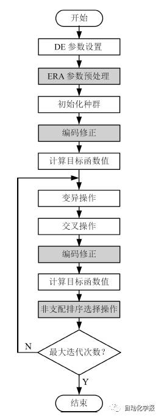

# 灾害应急管理——应急资源多目标分配

原创 自动化学报 2017-03-17 17:11 北京

> 原文地址: [https://mp.weixin.qq.com/s/QemCndxh-LtdoMKWkErEag](https://mp.weixin.qq.com/s/QemCndxh-LtdoMKWkErEag)

  

  

  

近年来, 地震、洪水、泥石流、台风等自然灾害对人类社会造成的损失越来越严重. 仅以2008年汶川7.9 级大地震为例，地震造成69225人死亡, 379640人受伤, 17939人失踪, 至少500万人无家可归, 经济损失达1000亿美元. 因此,灾害应急管理作为一门新兴的研究领域正引起各国政府和学者的高度关注。

应急资源分配

是应对灾害突发事件和开展灾害救援的基础, 作为灾害应急管理的核心环节,主要研究如何在灾害发生时迅速有效地利用智能决策理论和计算机辅助工具,高效合理地把各储备点的应急救援物资分配给各发放点, 最大程度地减少灾害带来的损失.

研究意义及难点

应急资源分配是一个极其复杂的组合优化问题，涉及多储备点、多发放点和多种救援物资以及可能引发的应急资源冲突. 因此, 如何实现应急资源冲突消解是一个值得深入研究而又极具应用价值的课题，其难点在于如何在储备点应急资源有限的情况下, 解决各发放点对关键应急资源的需求冲突问题.

针对这一难点问题，合肥工业大学计算机与信息学院蒋建国教授研究团队引入合作博弈论中的协作联盟概念以期实现多种救援力量的统筹调度和协同作战.在大规模自然灾害发生后, 各储备点为迅速响应灾害救援而快速结成动态协作联盟，称之为应急联盟。联盟中的储备点在各自的优势领域(如物资供给、医疗服务、救助设备等)为应急联盟贡献自己的核心应急资源, 相互联合起来实现优势互补和应急资源共享. 据此, 多储备点、多发放点、多种救援物资的应急资源分配问题转化非为每个发放点快速寻找应急联盟。

基于此，蒋建国教授等构建了考虑应急资源冲突消解的多储备点、多发放点、多种救援物资的应急资源多目标优化模型, 并设计基于非支配排序差异演化和编码修正机制的应急资源多目标分配的ERNS-DE算法。

ERNS-DE

该项研究从全局角度同时为多个发放点给出应急资源分配方案, 实现了一个储备点能同时为多个发放点协同配备应急资源, 而且不会产生任何应急资源冲突. 主要适用于灾害应急响应的中期和后期, 也适用于灾情稳定的应急响应初期.在应急资源受限情况下,可在一定程度上提高大规模应急资源分配的效率,为政府的应急决策提供更多合理可靠的选择.

引用格式

苏兆品, 张国富, 蒋建国, 岳峰, 张婷. 基于非支配排序差异演化的应急资源多目标分配算法. 自动化学报, 2017, 43(2): 195-214

作者简介

苏兆品 合肥工业大学计算机与信息学院副教授, IEEE 会员. 2008 年获得合肥工业大学计算机科学与技术专业博士学位. 主要研究方向为演化计算, 灾害应急决策, 多媒体安全.

E-mail: szp@hfut.edu.cn 

张国富 合肥工业大学计算机与信息学院副教授, 中国自动化学会、IEEE 会员. 2008 年获得合肥工业大学计算机科学与技术专业博士学位. 主要研究方向为计算智能, 多Agent 系统, 基于搜索的软件工程. 本文通信作者.

E-mail: zgf@hfut.edu.cn

蒋建国 合肥工业大学计算机与信息学院教授, 中国计算机学会高级会员. 1989年获得合肥工业大学信号、电路与系统专业硕士学位. 主要研究方向为分布式智能系统和数字图像处理与分析.

E-mail: jgjiang@hfut.edu.cn

岳峰 合肥工业大学科学技术研究院副研究员. 2015 年获得合肥工业大学计算机科学与技术专业博士学位. 主要研究方向为软件工程和演化计算.

E-mail: yuefeng@hfut.edu.cn

张婷 合肥工业大学计算机与信息学院硕士研究生. 2012 年获得佛山科学技术学院计算机科学与技术专业学士学位.主要研究方向为灾害应急决策和演化计算. 

E-mail: tzhang@mail.hfut.edu.cn

微信服务号：自动化学报

微信订阅号：aas1963

新浪微博：自动化学报

新浪博客：Automation\_2011

联系我们：

Tel:  010-82544653（日常咨询和稿件处理） 

        010-82544677（录用后稿件处理）

Fax: 010-82544497

Email: aas@ia.ac.cn（日常咨询和稿件处理）

          aas\_editor@ia.ac.cn（录用后稿件处理）

http://www.aas.net.cn

