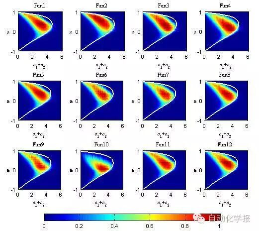
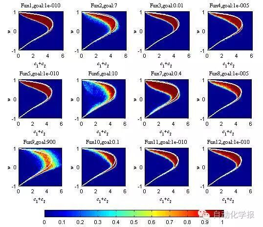
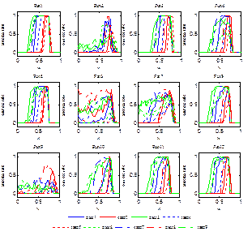

# 粒子群优化算法的性能分析和参数选择

原创 自动化学报 2016-10-31 16:41 北京

> 原文地址: [https://mp.weixin.qq.com/s/yuHBMFAf0M-xIqjInnVOwg](https://mp.weixin.qq.com/s/yuHBMFAf0M-xIqjInnVOwg)

粒子群优化算法(Particle swarm optimization, PSO)是由Kennedy和Eberhart于1995年提出的一种群智能优化算法。PSO结构简单，易于实现，且不需要借助问题的特征信息，在多种领域得到了非常广泛的应用。在PSO中，可调参数w、c1和c2对算法性能的影响较大。然而单独依靠调整某一个参数，并不能在种群的局部开发能力(exploitation ability)和全局探索能力(exploration ability)之间进行平衡。事实上，各个参数之间需要相互配合，才能够达到预定的效果。本文基于在感兴趣的参数范围内进行的优化测试实验数据，考察了参数设置方式对算法性能的影响，分别推荐了一组固定和时变的参数值。

不同的参数组合下，粒子的轨迹形式是不同的，决定了粒子探索能力的大小。在种群进化过程中的第t代，若粒子能够找到比t－1代的全局最优解更好的解，那么则认为粒子具有一定的探索能力。而粒子的探索能力与算法的性能是紧密相关的。基于12个常见的基准函数，对不同参数下粒子的探索能力和算法的成功率进行了实验研究，结果分别如图1和图2所示。

图1 粒子探索能力与参数的关系

图2 算法成功率与参数的关系

图3  变化的c1、c2取值策略对算法成功率的影响

将图1与图2对比可以看到，图1和图2并不是完全对应的。图1中展示的粒子的探索能力为粒子的局部探索能力和全局探索能力的总和，而不同的函数具有不同的特性，对群体的局部探索能力和全局探索能力的要求是不同的。虽然总的探索能力与寻优性能并不是完全对应的，但是，没有探索能力的参数区域，基本上是不可取的。依据实验结果，推荐了一组固定参数值，与现有固定参数的设置方式对比可得：无论c1和c2是否相等，采用c1和c2定值的调节算法在算法性能上是有局限性的。为了进一步提高算法的性能，同样基于12个常用测试函数观察了在迭代的过程中，w保持固定值，而c1和c2按照不同的方式变化时对算法性能的影响，结果如图3所示。依据运行结果给出了时变参数的设置方式：w=0.68，c1在迭代过程中由2.5线性减小到0.5，c2由0.5线性增加到2.5。在CEC2015测试函数上的运行结果验证了本文给出参数设置方式的有效性。

引用格式

王东风, 孟丽. 粒子群优化算法的性能分析和参数选择. 自动化学报, 2016, 42(10): 1552-1561

作者简介

王东风 博士, 华北电力大学控制与计算机工程学院教授. 主要研究方向为群智能优化算法和智能控制.

E-mail: wangdongfeng@ncepu.edu.cn

孟丽 华北电力大学控制与计算机工程学院博士研究生. 主要研究方向为智能优化算法及其应用. 本文通信作者.

E-mail: mengli2014@163.com

欢迎扫描二维码、长按图片识别关注《自动化学报》中文版订阅号aas1963，服务号自动化学报和英文版服务号！

