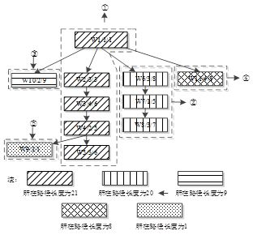
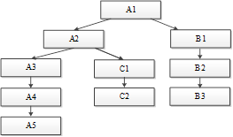
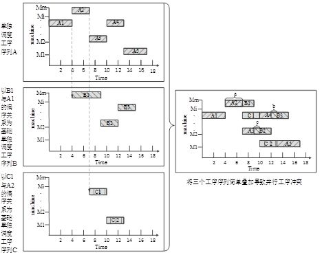
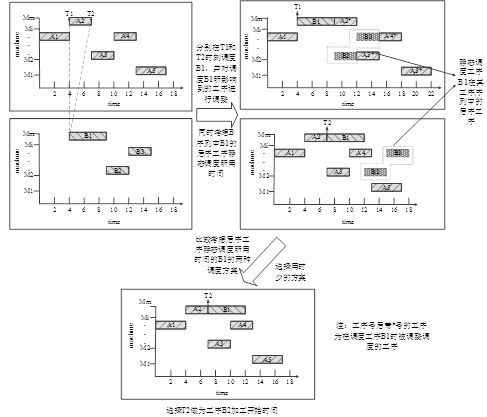

# 考虑后续工序的择时综合调度算法

原创 自动化学报 2018-03-14 09:00 北京

> 原文地址: [https://mp.weixin.qq.com/s/kqzCYChwxsg-yUFP5XuaBw](https://mp.weixin.qq.com/s/kqzCYChwxsg-yUFP5XuaBw)

“

传统车间调度一般分为Flow-shop（大批量相同产品采取的流水调度）调度和Job-shop（多品种小批量产品采取的车间调度）调度，两类调度中产品均采用先加工后装配的制造方式。这种生产方式在大规模生产时代比较常见。原因是订单中产品数量较大，集中生产会产生大量库存，使得生产活动与装配活动之间存在大量并行时间，从而缩短产品生产周期。然而当今社会对产品的需求不断向个性化、多样化转变，多品种小批量，甚至单件产品的定单越来越多，产品库存极少甚至无库存，先加工后装配必然割裂产品加工和装配内在的并行关系。2002年谢志强等提出综合调度问题，该问题将产品的加工活动与装配活动同时进行考虑，弥补了job-shop与flow-shop问题在处理少量产品定单时的缺陷，为单件小批定单的调度优化问题提供了切实可行的解决方案。

目前综合调度算法存在的缺陷为：调度时不能兼顾产品工艺树中并行工序的并行性和串行工序之间紧密度。针对这一问题提出考虑后续工序的择时综合调度算法。该算法提出工序序列排序策略，从工艺树的整体结构出发，将其划分成若干内部工序只具有串行关系的工序序列，并按路径长度从长到短的顺序确定其调度次序。

图1 工序序列排序策略序列划分示意图

提出择时调度策略和考虑后续工序策略，根据工艺树自身特点，从来自不同工序序列的并行工序的不同组合方案中，选择最接近调度目标的方案作为工序调度方案，若该工序调度方案不唯一，则在其中选择该工序加工开始时间最早的调度方案。

图2 产品加工工艺树

图3 调度思想示意图1

本文算法中共涉及到1个主要策略，分别为：工序序列排序策略和考虑后续工序的择时策略。2个策略彼此串行执行，其中复杂度最大者将作为本算法的复杂度。工序序列排序策略的算法时间复杂度为(nl-1)\*(N-1+ nl-1)，即O(N\*nl)；考虑后续工序的择时策略算法时间复杂度为n2\*O(N2)。本文算法的时间复杂度取上述各项策略复杂度的最大值，为O(n2\* N2)。

图4 调度思想示意图2

考虑后续工序的择时综合调度算法通过提出的3个策略达到了优化综合调度的目的，主要结论如下：工序序列排序策略从工艺树的整体结构出发安排工序的调度顺序，提高了串行工序的紧密度；择时调度策略扩大了问题的解空间，调度时结合工艺树自身特点灵活选择工序加工开始时间，兼顾了并行工序的并行性和串行工序的紧密度；考虑后续工序策略在择时调度策略基础上补充考虑未调度工序，进一步提高了择时调度策略的精确度；算法时间复杂度不超过三次多项式。综上所述，本文算法为解决一般综合调度问题提供了新的启示，并为进一步的深入研究拓展了思路、奠定了基础，具有一定的理论和实际意义。

引用格式

谢志强, 张晓欢, 辛宇, 杨静. 考虑后续工序的择时综合调度算法. 自动化学报, 2018, 44(2): 344-362.

作者简介

谢志强，博士,教授,博士生导师,CCF高级会员.主要研究方向为企业智能计算与调度系统,数据处理,网络优化.本文通信作者.

E-mail: xiezhiqiang@hrbust.edu.cn

张晓欢，哈尔滨理工大学博士研究生.CCF会员.主要研究方向为企业智能计算.

E-mail:huanhuan291@ 126.com

辛宇，博士，讲师.主要研究方向为数据库与知识工程.

E-mail:xinyu@hrbeu.edu.cn

杨静，博士,教授,博士生导师,CCF高级会员.主要研究方向为数据与知识工程、数据挖掘、隐私保护、软件理论等.

E-mail: yangjing@hrbeu.edu.cn

**简**

**讯**

欢迎扫描二维码、长按图片识别关注《自动化学报》中文版订阅号aas1963，服务号自动化学报和英文版服务号！

JAS《自动化学报》（英文版）

自动化学报服务号

自动化学报订阅号

  

联系我们

Tel:  010-82544653（日常咨询和稿件处理） 

        010-82544677（录用后稿件处理）

Fax: 010-82544497

Email: aas@ia.ac.cn（日常咨询和稿件处理）

          aas\_editor@ia.ac.cn（录用后稿件处理）

http://www.aas.net.cn

更多精彩内容，尽在阅读原文