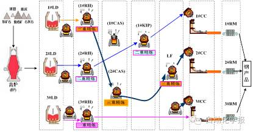
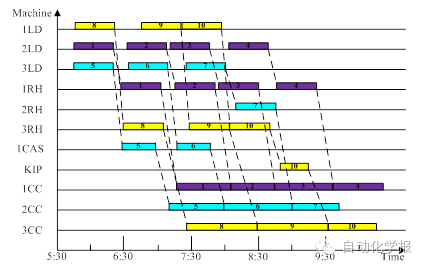
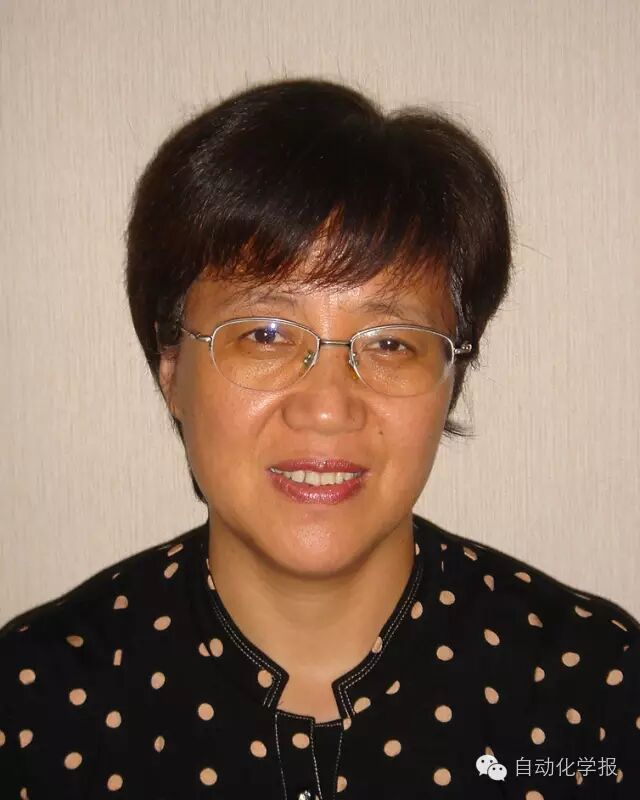
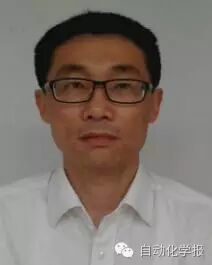
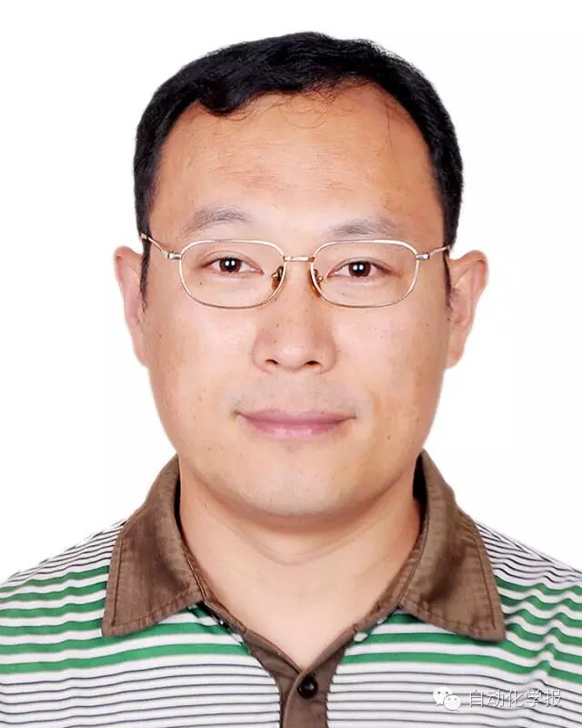

# 面向炼钢—连铸调度过程的两阶段优化模型与算法

原创 自动化学报 2016-12-06 15:58 北京

> 原文地址: [https://mp.weixin.qq.com/s/EnmGSAsNVjkw0NicwGYwSg](https://mp.weixin.qq.com/s/EnmGSAsNVjkw0NicwGYwSg)

现代化大型钢铁企业的炼钢-连铸生产过程都是由多台转炉、多台精炼炉、多台连铸和多重精炼方式构成，这种多设备的复杂生产工艺过程给调度的排产与决策带来了难度. 难度之一是钢铁企业生产过程是在高温、高能耗下进行的，工序之间的物流要求衔接紧密，在各工序的设备上要准时加工，以减少钢水的温降，降低能耗. 这决定了钢铁行业比其他制造业的调度精度要求高，调度速度要求快，调度难度会更大. 其二，大型钢铁企业的调度过程涉及多设备、多目标、多约束等调度要素，且离散和连续变量相混杂，采用常规建模方法难以满足现场对调度的精度及排产速度的需求.

近几年，国内外学者们开始对多台转炉、精炼炉对多台连铸机，多重精炼方式的调度问题进行了研究，并取得了一些成果. 这些成果多数是先建立分段模型或混合整数规划模型，再采用经典优化方法、启发式方法或智能优化方法对模型进行求解，得到相应的调度结果.经典优化方法通常在求解精度上能达到现场满意的效果，但当规模超过45个炉次时，求解的速度也难以满足现场要求；启发式方法能满足求解速度要求，但不能保证解的最优性；智能优化方法初始种群都是随机生成的，参数设置多数凭经验给出，没有理论依据，导致调度解的鲁棒性较差. 所以，研究符合现场实际，在时间和解的精度上均能满足现场要求的实用调度方法具有重要的现实意义.

图 1 为国内某大型钢厂生产过程所使用的设备和生产工艺过程.首先将高炉中的铁水包注入到铁水包中（鱼雷罐）送到炼钢厂种，并倒入转炉设备中进行吹炼。吹炼的过程是把高温条件下的铁水进一步冶炼为含碳量更低的钢水. 吹炼结束后将转炉中的钢水倒入准备好的钢包中，由指定的台车和行车将装有钢水的钢包送到相应的精炼设备上进行精炼. 精炼是将转炉冶炼的普通钢水继续进行脱碳、去硫和去除杂质等处理，使普通钢水变成优质钢水. 精炼处理结束后，再由指定的台车和行车将钢水包吊运到指定的连铸机前，并倒入对应的中间包中. 中间包的钢水不断进入结晶器中，通过结晶振动冷却后，从连铸机拉出板坯. 板坯经轧机（直轧/冷轧）轧成各种钢材产品以供销售。

图1 炼钢-连铸生产工艺过程

本文以该大型钢铁企业多台转炉、多台精炼炉对多台连铸机的复杂生产线为研究对象，针对其调度过程涉及多设备、多目标、多约束等调度要素，且离散和连续变量混杂的特征，提出了一种新型的炼钢-连铸调度过程两阶段优化建模方法. 首先，证明了炉次从炼钢到连铸总等待时间最小的调度目标与该炉次在转炉开始作业时间最大是等价的事实，并以离散型的设备变量为决策变量，以转炉开始作业时间最大为动态规划最优指标，建立设备指派多阶段动态规划基本方程和设备指派优化模型；然后，以炉次在设备开始作业时间的连续型变量为决策变量，并将准时开浇的非线性调度指标转化成与之等价的线性优化目标，以在同一台连铸机上浇铸的炉次之间断浇的时间间隔最小、钢包在设备之间的冗余等待时间最小、提前与滞后理想开浇时间的时间间隔最小为目标, 建立线性规划冲突解消模型.通过对两阶段优化模型进行求解得到图2所示的调度结果.工业实验表明本文的优化建模方法无论在调度的精度和求解速度上均能达到现场要求。

图2 冲突解消后的调度甘特图

引用格式

王秀英, 冯惠, 任志考, 周艳平. 面向炼钢—连铸调度过程的两阶段优化模型与算法. 自动化学报, 2016, 42(11): 1702-1710

作者简介

王秀英 青岛科技大学信息科学技术学院教授.2012年获东北大学博士学位, 主要研究方向生产计划与调度理论和方法,智能优化算法.

E-mail: bywxy@126.com

冯惠 青岛科技大学信息科学技术学院硕士研究生.主要研究方向为智能优化算法、生产计划与生产调度.

E-mail:huifeng0411@163.com

任志考 青岛科技大学信息科学技术学院副教授,主要研究方向为智能优化算法,无线网络技术, 机器人通信以及云服务技术.

E-mail:rzk\_888@163.com

周艳平 青岛科技大学信息科学技术学院副教授.分别于2003年和2013年在青岛科技大学和华东理工大学获得硕士和博士学位.主要研究方向为智能优化算法、生产计划与生产调度.

E-mail:zypweb@163.com

欢迎扫描二维码、长按图片识别关注《自动化学报》中文版订阅号aas1963，服务号自动化学报和英文版服务号！

