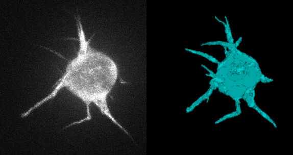
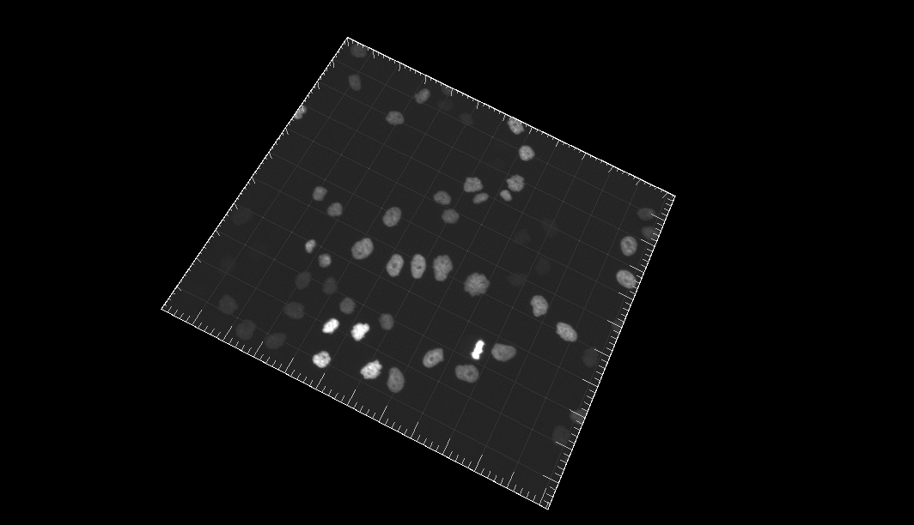
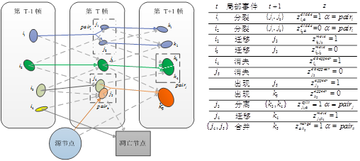
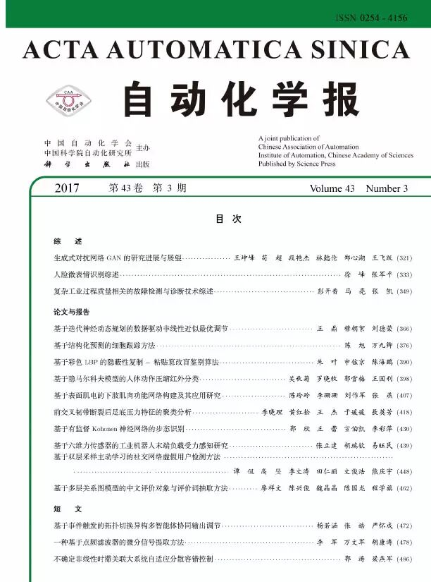
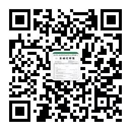

# 一种有效的细胞检测与跟踪方法

原创 自动化学报 2017-04-10 12:34 北京

> 原文地址: [https://mp.weixin.qq.com/s/Yze3wtj5yFv2COwNctwxWw](https://mp.weixin.qq.com/s/Yze3wtj5yFv2COwNctwxWw)

了解细胞活动及其生存环境是解开许多未知的生命活动与疾病机理的关键。目前，通过显微镜获得细胞时延图片序列，并对其中的细胞进行检测和跟踪仍是研究细胞活动的主要手段之一，在癌症研究、胚胎发育过程认知、干细胞培养等生物学和医学领域具有广泛的应用。

传统的人工跟踪方法在处理大规模图片序列时代价过高，而且容易出错，因此具有高处理能力的自动细胞跟踪技术正成为这一领域的迫切需求。而细胞数目庞大、形态复杂，可能存在密集堆叠，还具有迁移运动、有丝分裂、凋亡、新生等多种细胞活动，这使得细胞跟踪与传统的多目标跟踪应用，如行人跟踪，有着较大的区别。主要体现在以下几个方面：

对象数目与外观描述

细胞跟踪问题中，输入的细胞图像序列往往达到数百帧，每一帧的细胞个数多达百个甚至上千个，目标对象数量巨大，有时还会存在密集的重叠。而且不同细胞之间外观差异小，行人跟踪中常用的重要外观特征——颜色特征，在细胞跟踪中几乎无法发挥作用。

复杂的细胞活动

观测视域内的活细胞通常具有迁移运动、有丝分裂、凋亡和新生等多种细胞活动。这些复杂的细胞活动进一步增加了细胞跟踪的难度。

来自分割中的误差传递

以应用最为广泛的数据关联模型为例，我们需要先对细胞图像序列进行目标检测和细胞分割。分割误差是难以避免的，欠分割会导致检测到的细胞数目比真实的要少，在跟踪阶段出现轨迹遗漏；过分割会导致检测到的细胞数目多于实际数目，在跟踪阶段出现轨迹冗余。这种由分割精度造成的跟踪误差称之为“误差传递”(error propagation)，误差传递使得跟踪阶段还没有开始就已经存在“先天不足”问题。

本文提出一种新的多细胞联合检测与跟踪方法，通过椭圆拟合构建细胞观测假说的完备集合，定义了多种局部事件来描述细胞的行为以及检测阶段可能出现的错误，示意图如下。

通过引入相应的标签变量，将细胞跟踪建模为结构化预测问题，通过求解一个带约束的整数规划问题得到细胞轨迹的全局最优解。针对结构化预测模型中的参数学习问题，本文采用Block-coordinate Frank-Wolfe优化算法根据给定的训练样本求解模型的最优参数，同时给出了该算法的非线性核化版本。本文在多个公开数据集上对提出的算法进行了验证，结果表明，本文的实验表现相比于传统算法有着显著的提升。

引用格式

陈旭, 万九卿. 基于结构化预测的细胞跟踪方法. 自动化学报, 2017, 43(3): 376-389

作者简介

陈旭 北京航空航天大学自动化科学与电气工程学院硕士研究生。主要研究方向为数字图像处理和目标跟踪。

E-mail:xchen0530@163.com

万九卿 北京航空航天大学自动化科学与电气工程学院副教授。主要研究方向为信号/图像/视频处理、统计推理与机器学习、目标检测、跟踪与识别、复杂系统故障诊断与健康管理。

E-mail:wanjiuqing@buaa.edu.cn

联系我们：

Tel:  010-82544653

      （日常咨询和稿件处理）   

        010-82544677

      （录用后稿件处理）

Fax: 010-82544497

Email: aas@ia.ac.cn

      （日常咨询和稿件处理）

          aas\_editor@ia.ac.cn

      （录用后稿件处理）

http://www.aas.net.cn

微信服务号：自动化学报

微信订阅号：aas1963

新浪微博：自动化学报

新浪博客：Automation\_2011

