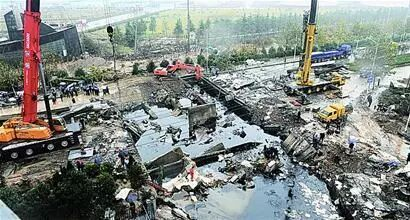
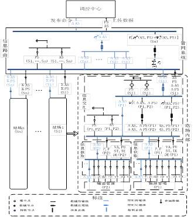
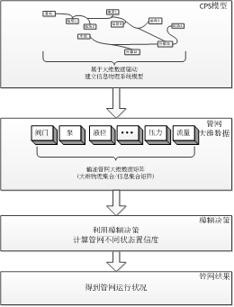

# 东北大学孙秋野教授等|基于大维数据驱动的油气管网泄漏监控模糊决策方法

原创 自动化学报 2017-12-13 17:19 北京

> 原文地址: [https://mp.weixin.qq.com/s/5PhQ25LZDCsOmyIACcmM2g](https://mp.weixin.qq.com/s/5PhQ25LZDCsOmyIACcmM2g)

管道运输是我国油气输送的主要运输方式之一.由于受到管道老化、碰撞及人为破坏等因素的影响,管道破裂污染环境的事件时有发生.因此，在油气管道的安全运行管理中，如果能够对泄漏做到早发现、早处理，就可以减少因泄漏带来的经济损失、环境污染以及社会不良影响.

目

前随着管网的规模不断扩大以及多种类型设备的投入运行,使得管网的结构复杂性和运行不确定性大大增加,信息错综复杂.此外由于泵的启停、阀门的开关等引起管道拓扑结构发生变化时,也会使压力、流量、输差等表征管道运行信息发生改变，因此单纯采用信息数据建模判断管网泄漏的方法就会呈现出误判率高的特点.

因此为了有效地建立输油管网的物理拓扑结构和表征管网运行状态的压力和流量等信息之间的对应关系,本文将复杂油气管网建模成信息物理系统,在保证逻辑完整性和功能完整性的前提下,从数据流的角度对输油管网系统建立多数据映射的数据流模型,如图1所示.

图1 基于数据驱动的管道管网信息物理系统模型

当管道管网信息物理系统模型建立后,为了实时判断管道管网的运行状态, 通过管网的大维物理数据和信息数据矩阵的谱分布函数以及圆环变化情况作为模糊决策的条件对管网运行情况进行判断,具体流程如图2所示.

图2 管网系统检测示意图

最后通过一系列不同情况的仿真及测试说明，当油气管网数据出现异常情况时,本文提出的方法能够及时地检测异常情况并进行报警.

引用格式

马大中, 胡旭光, 孙秋野. 基于大维数据驱动的油气管网泄漏监控模糊决策方法. 自动化学报, 2017, 43(8): 1370-1382

作者简介

马大中 东北大学信息科学与工程学院副教授. 主要研究方向为故障诊断, 容错控制, 能源管理系统以及分布式发电系统、微网和能源互联网的优化与控制. 本文通信作者. 

E-mail: madazhong@ise.neu.edu.cn

胡旭光 东北大学信息科学与工程学院博士研究生. 主要研究方向为基于数据驱动的故障诊断, 信息物理系统的建模及优化控制. 

E-mail: 1501004@stu.neu.edu.cn 

孙秋野 东北大学信息科学与工程学院教授. 主要研究方向为网络控制技术, 分布式控制技术, 分布式优化分析及其在能源互联网, 微网, 配电网等领域相关应用. 

E-mail: sunqiuye@mail.neu.edu.cn

欢迎扫描二维码、长按图片识别关注《自动化学报》中文版订阅号aas1963，服务号自动化学报和英文版服务号！

JAS《自动化学报》（英文版）

自动化学报服务号

自动化学报订阅号

  

联系我们

Tel:  010-82544653（日常咨询和稿件处理） 

        010-82544677（录用后稿件处理）

Fax: 010-82544497

Email: aas@ia.ac.cn（日常咨询和稿件处理）

          aas\_editor@ia.ac.cn（录用后稿件处理）

http://www.aas.net.cn

  

点击阅读原文查看更多