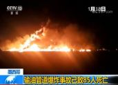
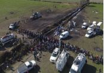
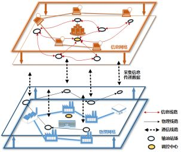

# 东北大学孙秋野教授等：基于数据特征融合的管网信息物理异常诊断方法

原创 自动化学报 2019-04-22 17:30 北京

> 原文地址: [https://mp.weixin.qq.com/s/4OZ6zPmd\_EKXrc6rvOVMNQ](https://mp.weixin.qq.com/s/4OZ6zPmd_EKXrc6rvOVMNQ)

输油管网信息物理异常诊断是指：通过对输油管网设备采集数据的分析，完成管网运行状态的有效判断，并且及时发现信息网络中的传输中断或者错误异常，保证输油管网的安全运行。

  

马大中, 胡旭光, 孙秋野, 郑君, 王睿. 基于数据特征融合的管网信息物理异常诊断方法. 自动化学报, 2019, 45(1): 163-173.

  

管道运输，由于其具有运量大、密闭性好、安全系数高等优点，已经成为油品输送的主要运输方式之一。由于输油管道破裂会导致企业蒙受重大经济损失、造成严重环境污染以及社会不良影响，因此各国政府已经采取不同措施打击“偷油”现象。但是犯罪分子受到利益驱使，油品偷盗事件仍时有发生。如图1所示，在2019年1月18日，墨西哥中部伊达尔戈州一处输油管道遭到非法切割，不法分子实施“偷油”。并且在未及时发现和处理偷盗行为的情况下发生爆炸，截止到1月20日已造成85人死亡，58人受伤。从该事故造成的严重后果可以看出，作为工业信息物理系统的典型应用，输油管网系统的异常诊断具有重要意义，及时诊断出异常情况能够避免重大安全事故的发生。

  

(a)爆炸事故报道

(b)爆炸事故现场

(c)爆炸管道航拍

图1墨西哥管道爆炸事故

  

**输油管网信息物理异常诊断面临的挑战？**输油管网系统的异常诊断，主要分为物理异常和信息异常。在管网输送油品到各个站场时，管网调控中心及相应站场会对站内阀门、主输泵等设备进行操作，由于此类操作有时会使管网数据产生类似泄漏情况的变化，并且可能会传播到管网沿线其他站场，因此如何区分工况调整和泄漏情况是管网信息物理异常面临的第一个挑战。此外，有时会因管道泄漏异常变化程度较小而难以发觉，所以针对微小泄漏变化的检测又是亟需解决的挑战之一。

  

相较于物理网络，信息网络的功能不断升级改造使得管网系统的可观测性不断增强，管网系统的功能和作用范围得到极大扩展。但是与此同时，信息网络也增加了管网系统的复杂性和不确定性，给管网系统带来新的安全问题。信息网络异常会导致管网系统设备失去控制造成甩泵、阀门关断等紧急运行情况，如果处置不当甚至会诱发连锁故障使得管网全线停输。因此，如何在管网实时运行过程中找到合适的方法完成信息异常检测，也是管网异常诊断面临的挑战。

  

**如何构建管网信息物理异常诊断结构？**随着信息和通信技术的不断进步与发展,输油管网系统已经从管道自动化网络发展成融合管道设备、通信体系以及信息网络的复杂智能化网络体系。本文从物理信息融合交互角度对管网的数据结构进行划分，具体结构如图2所示。在物理网络中，节点表示实际存在的数据站场并且通过长距离密闭输油管道实现油品的输送。多元信息网络是由实际物理设备采集到的实时信息数据构成，实时反映站场数据流情况。

  

图2管网信息物理系统结构

  

**如何利用管网海量数据实现异常诊断？**在所建立管网结构的基础上，本文提出一种基于数据特征融合的管网信息物理异常诊断方法。首先针对管网系统的海量信息数据，采用随机矩阵谱理论实现数据特征的构建。然后采用集中-分布协同检测形式完成对管网异常情况的诊断。在通过信息增维协方差矩阵最大特征值完成管网异常类型情况(物理异常和信息异常)检测和分析的基础上，进而根据矩阵最大特征向量映射的图像实现对物理异常(工况调整和泄漏)的分析。

  

最后通过一系列不同情况的仿真测试说明，当输油管网的测量数据出现不同程度的变化时，本文提出的方法均能够及时地感知数据情况，检测不同的异常情况并实现准确分类。同时该方法已在全国部分成品油管网得到应用，实际运行效果良好。

  

作者简介

马大中, 东北大学信息科学与工程学院副教授. 主要研究方向为故障诊断, 容错控制, 能源管理系统, 分布式发电系统、微网和能源互联网的优化与控制. 本文通信作者. 

E-mail: madazhong@ise.neu.edu.cn

胡旭光, 东北大学信息科学与工程学院博士研究生. 主要研究方向为基于数据驱动的故障诊断, 信息物理系统的建模及优化控制. 

E-mail: 1501004@stu.neu.edu.cn

孙秋野, 东北大学信息科学与工程学院教授. 主要研究方向为网络控制技术, 分布式控制技术, 分布式优化分析及其在能源互联网, 微网, 配电网等领域相关应用. 

E-mail: sunqiuye@mail.neu.edu.cn 

郑君, 东北大学信息科学与工程学院硕士研究生. 主要研究方向为基于机器学习的综合能源系统故障检测与诊断. 

E-mail: ZJ623928036@163.com

王睿, 东北大学信息科学与工程学院博士研究生. 2016年于东北大学获得电气工程及其自动化专业学士学位. 主要研究方向为能源互联网中分布式电源的协同优化及其电磁时间尺度稳定性分析. 

E-mail: 1610232@stu.neu.edu.cn

自动化

学报

**信息物理融合系统理论与应用专刊**

[信息物理融合系统理论与应用专刊序言](http://mp.weixin.qq.com/s?__biz=MzAwMzAzMDgxOA==&mid=2651064291&idx=1&sn=4da1e829cb5a537b55dfb6cba8cb3c3d&chksm=8131cdaeb64644b878bf01b39d1a0ca987534b51b11ad7731cac3244dadbb3d36be3ec22cc0c&scene=21#wechat_redirect)

[工业网络系统的感知-传输-控制一体化:挑战和进展](http://mp.weixin.qq.com/s?__biz=MzAwMzAzMDgxOA==&mid=2651064296&idx=1&sn=af7524600c45518a394580467c4904e0&chksm=8131cda5b64644b3256cdab623b7659847c9762f3c726b3e23b53a07f5fe5ddbd946f3f9aef0&scene=21#wechat_redirect)  

[信息物理系统技术综述](http://mp.weixin.qq.com/s?__biz=MzAwMzAzMDgxOA==&mid=2651064319&idx=1&sn=b6a9e44bab786498fddb75b5f6bbe1eb&chksm=8131cdb2b64644a49e2329de3a8721e5eb860d058563e038876316151cbebe7b61904028b862&scene=21#wechat_redirect)  

[多时空尺度的风力发电预测方法综述](http://mp.weixin.qq.com/s?__biz=MzAwMzAzMDgxOA==&mid=2651064323&idx=1&sn=fd00093932e56ef5f4f2e38dbc0b29e2&chksm=8131c24eb6464b58d305023f3faa393cb94fb89b5e5aeccfd23f37697521e916069594b29b9a&scene=21#wechat_redirect)  

[面向电力信息物理系统的虚假数据注入攻击研究综述](http://mp.weixin.qq.com/s?__biz=MzAwMzAzMDgxOA==&mid=2651064332&idx=1&sn=69371ccf017fd66a309407e580c4470a&chksm=8131c241b6464b57e1f6aee6b1690e56ed93ed0bf7c80e912336976954922cabcd7f8f964a69&scene=21#wechat_redirect)  

[信息物理融合的智慧能源系统多级对等协同优化](http://mp.weixin.qq.com/s?__biz=MzAwMzAzMDgxOA==&mid=2651064339&idx=1&sn=00ba84e37be296a07f02ccec9ee7bda0&chksm=8131c25eb6464b48eb09906290aa2dd9488c8b72c3ab4ac14f84c783294e06a9ec762ccdb6b2&scene=21#wechat_redirect)  

[基于贝叶斯序贯博弈模型的智能电网信息物理安全分析](http://mp.weixin.qq.com/s?__biz=MzAwMzAzMDgxOA==&mid=2651064352&idx=1&sn=3ee773694ee5d8d7db714003997b4ce0&chksm=8131c26db6464b7b15122d1950b27cf4cba93996afff47290267250913c8f730bc8e2732b272&scene=21#wechat_redirect)  

[网络攻击下信息物理融合电力系统的弹性事件触发控制](http://mp.weixin.qq.com/s?__biz=MzAwMzAzMDgxOA==&mid=2651064381&idx=1&sn=cdfd94ee2f6962583c79fc39e328b7f9&chksm=8131c270b6464b66d903a73118f04dcb54bb263409f49635cfc306fba7e98af3b899a6f31255&scene=21#wechat_redirect)  

[拒绝服务攻击下基于UKF的智能电网动态状态估计研究](http://mp.weixin.qq.com/s?__biz=MzAwMzAzMDgxOA==&mid=2651064388&idx=1&sn=b64eb668c35b5237272102ba10afc028&chksm=8131c209b6464b1f97c38301a9ee3905b390267216f96792c0db3fbcb75d5103077c8c03f724&scene=21#wechat_redirect)  

[智能交通信息物理融合云控制系统](http://mp.weixin.qq.com/s?__biz=MzAwMzAzMDgxOA==&mid=2651064393&idx=1&sn=0039e3cb167520c5492cee3b17918184&chksm=8131c204b6464b12c92da88f7ea33b88a8c63fc37883f6d0d9a6b00a04c76e01f88a76920394&scene=21#wechat_redirect)  

[东北大学郭戈教授等：交通信息物理系统中的车辆协同运行优化调度](http://mp.weixin.qq.com/s?__biz=MzAwMzAzMDgxOA==&mid=2651064404&idx=1&sn=803628dc5b258cd6a76ac7ff6b94ecad&chksm=8131c219b6464b0f553affb02ef8b0cbb4a342946f8ead11e94f4e8489d02926c5401b9c1029&scene=21#wechat_redirect)  

[北交唐涛教授等：基于二维结构熵的CBTC系统信息安全风险评估方法](http://mp.weixin.qq.com/s?__biz=MzAwMzAzMDgxOA==&mid=2651064409&idx=1&sn=cd24c6fa49d24e4f082104eba0666e75&chksm=8131c214b6464b027ce79d3a8813760512098a3dea1ed80195cffbbbb787b475196ce4e56c44&scene=21#wechat_redirect)  

  

**自动化科学与技术未来发展专刊**

[自动化科学与技术未来发展专刊](http://mp.weixin.qq.com/s?__biz=MzAwMzAzMDgxOA==&mid=2651064147&idx=1&sn=327b3991ea3e77cbcf4d980323c7f82a&chksm=8131cd1eb64644083d7138ddf86b40542952eed2bb5bc1422e1f36ec54d4603a1ccf231fc6ef&scene=21#wechat_redirect)  

[陈杰院士等：自动化科学与技术未来发展专刊序言](http://mp.weixin.qq.com/s?__biz=MzAwMzAzMDgxOA==&mid=2651064125&idx=1&sn=719f1a79512837b53e30b629a71cb13c&chksm=8131cd70b64644668547da0629266b323cc8eb363958689b74964fe4451f1c6d2033a6e0d8ba&scene=21#wechat_redirect)  

[柴天佑院士：自动化科学与技术发展方向](http://mp.weixin.qq.com/s?__biz=MzAwMzAzMDgxOA==&mid=2651064125&idx=2&sn=a21645cfef86f1fe6892ca9b69683865&chksm=8131cd70b6464466988712c4ac5ef9b7e4f8aee6414de2dc56a14f61f08fecbbe03ef048e4c5&scene=21#wechat_redirect)  

[东北大学丁进良教授等：复杂工业过程智能优化决策系统的现状与展望](http://mp.weixin.qq.com/s?__biz=MzAwMzAzMDgxOA==&mid=2651064151&idx=1&sn=2c6b2ef1a6178d340d8b10083699c62c&chksm=8131cd1ab646440cb51478ad8d204a9dc6c1450a09340a10333eef2c55ae88e0163a6ea99c53&scene=21#wechat_redirect)  

[美国南加州大学秦泗钊教授等：数据驱动的工业过程运行监控与自优化研究展望](http://mp.weixin.qq.com/s?__biz=MzAwMzAzMDgxOA==&mid=2651064163&idx=1&sn=edd98909d12c4ebaae5222a64b79440e&chksm=8131cd2eb64644384d2d7d3fce1edf2debdd8328ac63262e2d698a3f0192a6c91c898ba28f49&scene=21#wechat_redirect)  

[桂卫华院士等：铝电解生产智能优化制造研究综述](http://mp.weixin.qq.com/s?__biz=MzAwMzAzMDgxOA==&mid=2651064156&idx=1&sn=657a5cfaca9a69ab7d630bd3f949ae4d&chksm=8131cd11b64644070005198101ade827f94912bd46c6a2b3d1d2ec50e42cfea45d2c7105b5ee&scene=21#wechat_redirect)  

[北工大乔俊飞教授等：城市污水处理过程异常工况识别和抑制研究](http://mp.weixin.qq.com/s?__biz=MzAwMzAzMDgxOA==&mid=2651064167&idx=1&sn=7acd6f8fddecb189d52dfced142b3758&chksm=8131cd2ab646443ce7791a9c38f40e5cebe15018442874148e216580934b32508f7cfab28b2f&scene=21#wechat_redirect)

[北理孙健教授、邓方教授和陈杰院士：陆用运动体控制系统发展现状与趋势](http://mp.weixin.qq.com/s?__biz=MzAwMzAzMDgxOA==&mid=2651064172&idx=1&sn=de6c39a807bc6cf3c86ed92691f2e74a&chksm=8131cd21b64644371c7382e9f44d84a777e616956035af1926bbf63d233dce4243d9d20096a2&scene=21#wechat_redirect)  

[中科院自动化所侯增广研究员等：康复辅助机器人及其物理人机交互方法](http://mp.weixin.qq.com/s?__biz=MzAwMzAzMDgxOA==&mid=2651064187&idx=1&sn=5d397da5ebb4c31840db0043b85580f8&chksm=8131cd36b64644203ab4079f881b673207b0896f587a22abdada7f3e64882b8cf44639631a0e&scene=21#wechat_redirect)

  

**生成式对抗网络GAN技术与应用专刊**

[生成式对抗网络：从生成数据到创造智能](http://mp.weixin.qq.com/s?__biz=MzAwMzAzMDgxOA==&mid=2651063870&idx=1&sn=1e1d7562a4bbe4c31e2fdef4859c0bc4&chksm=8131cc73b6464565d9419524cd87b4bbe363384f0ba722017e91a49af4640d349403ea9a0ea6&scene=21#wechat_redirect)  

[人工智能研究的新前线：生成式对抗网络](http://mp.weixin.qq.com/s?__biz=MzAwMzAzMDgxOA==&mid=2651063920&idx=1&sn=9094936d46b4bab696df49c408fa1656&chksm=8131cc3db646452b0cba9ebdee9672b9ae010166a941ef19d5972616235193048a3346cf54f0&scene=21#wechat_redirect)  

[一种能量函数意义下的生成式对抗网络](http://mp.weixin.qq.com/s?__biz=MzAwMzAzMDgxOA==&mid=2651063930&idx=1&sn=8fc4569fbc51adb78002a6c492a7b58f&chksm=8131cc37b646452180ad8b4be28b69e9e1767c94cf2bf8b712074d8b26e72fffd95146d9fac5&scene=21#wechat_redirect)  

[协作式生成对抗网络](http://mp.weixin.qq.com/s?__biz=MzAwMzAzMDgxOA==&mid=2651063937&idx=1&sn=b3bb0ca500fa6f1e5b2d4fdc476187ed&chksm=8131ccccb64645daca101424f49facb82039d857908b8467fc5033a3b254fc348376128fef89&scene=21#wechat_redirect)  

[融合对抗学习的因果关系抽取](http://mp.weixin.qq.com/s?__biz=MzAwMzAzMDgxOA==&mid=2651063950&idx=1&sn=073948b72538b1547399cd7d3ba0b847&chksm=8131ccc3b64645d5c3c82fb7baa62c0cd2644c19f626a6a0904b6223bf155b8e77045006815a&scene=21#wechat_redirect)  

[基于生成对抗网络的多视图学习与重构算法](http://mp.weixin.qq.com/s?__biz=MzAwMzAzMDgxOA==&mid=2651063957&idx=1&sn=19964ffc71d7cb689887517b5d1bec12&chksm=8131ccd8b64645cee6db75a3910ee76a1bf2dab99af617044cfc2210d106ebc8c5eb7c88f7ba&scene=21#wechat_redirect)  

[基于生成对抗网络的低秩图像生成方法](http://mp.weixin.qq.com/s?__biz=MzAwMzAzMDgxOA==&mid=2651063961&idx=1&sn=8d6567b1750f5aa499007f17bed8e92b&chksm=8131ccd4b64645c2a898492cbb2eb4ed8272b4234bd1a08da279f17d6eb9884e0d4ace8f062c&scene=21#wechat_redirect)  

[基于条件深度卷积生成对抗网络的图像识别方法](http://mp.weixin.qq.com/s?__biz=MzAwMzAzMDgxOA==&mid=2651063972&idx=1&sn=b8bf8ae85b62f83e74d50f086ff6bc04&chksm=8131cce9b64645ff1ce4a10e6482d74876c664917a3ee821c11a72693cee3af1360b88d6fffe&scene=21#wechat_redirect)  

[基于生成式对抗网络的鲁棒人脸表情识别](http://mp.weixin.qq.com/s?__biz=MzAwMzAzMDgxOA==&mid=2651063980&idx=1&sn=ee5a109bc89e6b59dcf0db6359438be1&chksm=8131cce1b64645f7d5c0153e2fc3703abc37bc4edb3fc668efc90fd7433599ef40dcaa94e238&scene=21#wechat_redirect)  

[基于对抗训练策略的语言模型数据增强技术](http://mp.weixin.qq.com/s?__biz=MzAwMzAzMDgxOA==&mid=2651063984&idx=1&sn=6092ba309457e2810275069f4dfcef80&chksm=8131ccfdb64645ebb732eccf9f0fb0a81615f92a321d233837e60534ffaca0a352e6d81c97e5&scene=21#wechat_redirect)

[基于GAN技术的自能源混合建模与参数辨识方法-自能源，一场“草根能源”的盛宴](http://mp.weixin.qq.com/s?__biz=MzAwMzAzMDgxOA==&mid=2651063988&idx=1&sn=7c506b7a5c161d7c7b302a17ea28a097&chksm=8131ccf9b64645ef252f6078efb02f067d99a4d4d3cf020dfe8d21f85fb512835931dc11fbd7&scene=21#wechat_redirect)

[基于位错理论的距离正则化水平集图像分割算法](http://mp.weixin.qq.com/s?__biz=MzAwMzAzMDgxOA==&mid=2651063994&idx=1&sn=6e6e13de682aecbea7fec4ebbd4e4316&chksm=8131ccf7b64645e1c36dce0c5ba1a70ffcbf2f2ea25cc920c7ee6315227610c205029b5e0f67&scene=21#wechat_redirect)

[异质依存网络衰退特征与关键节点辨识](http://mp.weixin.qq.com/s?__biz=MzAwMzAzMDgxOA==&mid=2651064002&idx=1&sn=6b560d52462a2c2958004fb2e701d2c1&chksm=8131cc8fb6464599f19c7d08ce7a86b1638ad2542c79c16e178db90bee226be9c182cfba21cb&scene=21#wechat_redirect)

  

欢迎扫描二维码、长按图片识别关注《自动化学报》中文版订阅号aas1963，服务号自动化学报和英文版服务号！

JAS《自动化学报》（英文版）

自动化学报服务号

自动化学报订阅号

  

联系我们

Tel:  010-82544653（日常咨询和稿件处理） 

        010-82544677（录用后稿件处理）

Fax: 010-82544497

Email: aas@ia.ac.cn（日常咨询和稿件处理）

          aas\_editor@ia.ac.cn（录用后稿件处理）

http://www.aas.net.cn

点

这里“阅读原文”，查看更多