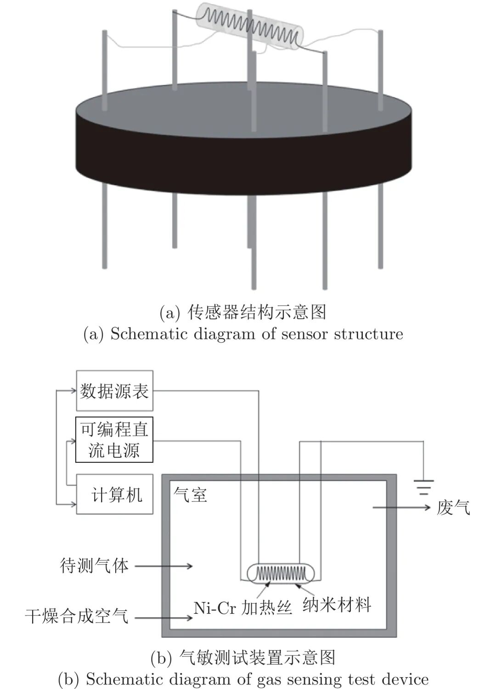
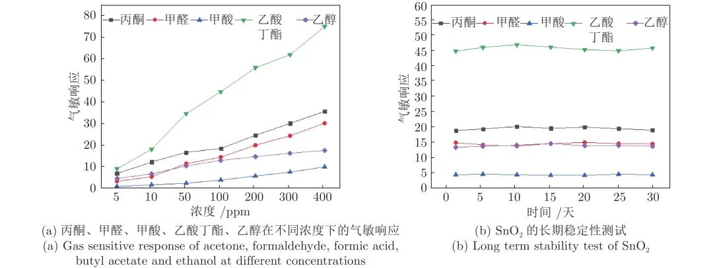

# 二氧化锡传感器对挥发性有机物的动态测试方法研究

原创 自动化学报 自动化学报 2022-03-17 16:05 北京

> 原文地址: [https://mp.weixin.qq.com/s/qLyglRnWILRLRcf29weNzg](https://mp.weixin.qq.com/s/qLyglRnWILRLRcf29weNzg)

**点击蓝字 关注我们**

  

**引****用本文**

  

孟凡利, 季瀚洋, 苑振宇, 张华, 王稼鹏. 二氧化锡传感器对挥发性有机物的动态测试方法研究. 自动化学报, 2022, 48(3): 926−934 doi: 10.16383/j.aas.c190561

Meng Fan-Li, Ji Han-Yang, Yuan Zhen-Yu, Zhang Hua, Wang Jia-Peng. Study on dynamic testing method of volatile organic compounds by tin dioxide sensor. Acta Automatica Sinica, 2022, 48(3): 926−934 doi: 10.16383/j.aas.c190561

http://www.aas.net.cn/cn/article/doi/10.16383/j.aas.c190561?viewType=HTML

  

**文章简介**

  

**关键词**

  

半导体气体传感器, 静态性能指标, 动态响应信号, 响应时间, 功耗

  

**摘   要**

  

温度调制的动态测试是解决金属氧化物传感器选择性差的一种常用方法, 但至今尚未有明确的方法控制动态响应信号的波形以达到预期期望. 本文首先从静态测试的角度出发, 描述了静态性能指标与动态响应信号的对应关系, 提出了适合于动态测试的半导体传感器的选择方法. 然后以矩形波为例, 通过对其周期、占空比、工作温度范围的调整, 在不降低动态响应信号品质的前提下, 缩短在实际应用中的响应时间和功耗. 最后, 利用支持向量机算法验证了动态响应信号的品质, 在不同种类不同浓度的气体中, 识别率高达100%.

  

**引   言**

  

随着社会经济的迅速发展, 工业生产能力增强, 便利了我们的生活. 但与此同时, 工业生产、汽车尾气、食品加工等所产生的废气也带来了严重的环境污染问题. 其中的挥发性有机化合物(Volatile organic compounds, VOCs)是导致酸雨、雾霾等的主要原因, 也给人的生理健康带来了极大的危害. 杨威结合国内外的VOCs研究现状, 对大连市的VOCs排放及治理对策进行了详细阐述. 指出了VOCs污染的治理刻不容缓, 对VOCs种类和浓度的监测成为首要问题. 此外在医疗健康、食品行业和智能家居等行业, VOCs 的痕量检测也起着至关重要的作用.

  

长期以来, 半导体传感器由于方案成熟、灵敏度高、响应速度快且制作简单, 在VOCs 检测方面得到了广泛的应用. 在半导体传感器领域, 气敏响应是判断气体的种类和浓度的重要指标. 然而, 除了少数仅对某种气体响应的传感器之外, 大多数传感器可以同时对多种气体产生响应. 在不同种类不同浓度气体中有相同的气敏响应, 即具有较差的选择性, 这成为制约其发展的瓶颈. 即便是具有良好选择性的只对某种气体响应的传感器, 也无法适应复杂环境多种气体的检测. 为此, 我们尝试使用动态测试方法来提高选择性, 并利用传感器对多种气体都有响应的特性, 增加输出信号的信息量, 从而辨别不同种类不同浓度的气体. 但从目前动态测试的发展水平来看, 由于半导体气体传感器的敏感机理和建模研究一直是一个难点, 而温度调制下的气体传感器的动态响应信号和提取的特征参数的物理意义不明确, 导致气体传感器响应模型的建立和温度调制模式的优化困难. 基于目前的研究现状, 以及对静态性能指标的研究, 阐述了静态性能指标与动态测试信号的对应关系, 提出了在动态测试中选取合适传感器的方法.

  

目前的动态测试方法主要是周期性循环加热波方法, 有部分文献在周期性循环加热波方法的基础上研究了多级伪随机序列、自适应式温度调制方法. 在周期性循环加热波方法中, 使用调制波形以矩形波为主. 为此本文探究了静态响应时间、最佳工作温度指标、不同温度的气敏响应和传感器的复现性与动态响应信号的关系, 提出了适合于动态测试的半导体传感器的选择方法; 以矩形波为例研究了周期、占空比、工作温度范围对动态响应信号的影响, 在不降低动态响应信号品质的前提下, 缩短在实际应用中的响应时间和功耗; 结合支持向量机(Support vector machine, SVM)算法实现了对不同浓度的丙酮、甲醛、甲酸、乙酸丁酯和乙醇的分类识别.

  

图 1  传感器结构示意图和气敏测试装置示意图

  

图 4  丙酮、甲醛、甲酸、乙酸丁酯、乙醇在不同浓度下的气敏响应和SnO2的长期稳定性测试

  

请点击左下角“**阅读原文**”了解更多！

  

**作者简介**

**孟凡利**

东北大学信息科学与工程学院教授. 2009年获中国科学技术大学博士学位. 主要研究方向为传感材料和纳米传感器. 《Micro & Nano Letters》 和 《Journal of Sensors》 副主编.

E-mail: mengfanli@ise.neu.edu.cn

**季瀚洋**

东北大学信息科学与工程学院硕士研究生. 2018年6月获得山东建筑大学工学和艺术学双学士学位. 主要研究方向为半导体传感器的温度调制动态测试方法.

E-mail: jihy1996@sina.cn

**苑振宇**

东北大学信息科学与工程学院副教授. 2014年获哈尔滨工业大学博士学位. 主要研究方向为纳米结构气体传感器和微机电系统.

E-mail: yuanzhenyu@ise.neu.edu.cn

**张   华**

东北大学信息科学与工程学院副教授. 2007年获东北大学博士学位. 主要研究方向为智能信息的处理、分析和识别.

E-mail: zhanghua@ise.neu.edu.cn

**王稼鹏**

2019 年获得东北大学工学学士学位. 主要研究方向为半导体传感器的温度调制动态测试方法.

E-mail: wjp19961028@163.com

  

**相关文章**

**（请向上滑动阅读）**

  

\[1\]  梁正平, 李辉才, 王志强, 胡凯峰, 朱泽轩. 自适应变化响应的动态多目标进化算法. 自动化学报. doi: 10.16383/j.aas.c210121

http://www.aas.net.cn/cn/article/doi/10.16383/j.aas.c210121?viewType=HTML

  

\[2\]  殷翔, 刘峰, 佘锦华. 脉冲控制扩展定理及应用. 自动化学报, 2020, 46(1): 58-67. doi: 10.16383/j.aas.c180059

http://www.aas.net.cn/cn/article/doi/10.16383/j.aas.c180059?viewType=HTML

  

\[3\]  郭子杰, 白伟伟, 周琪, 鲁仁全. 基于性能指标约束的一类输入死区非线性系统最优控制. 自动化学报, 2019, 45(11): 2128-2136. doi: 10.16383/j.aas.c190414

http://www.aas.net.cn/cn/article/doi/10.16383/j.aas.c190414?viewType=HTML

  

\[4\]  王振华, RODRIGUES Mickael, THEILLIOL Didier, 沈毅. 离散时间线性时变系统的传感器故障估计滤波器设计. 自动化学报, 2014, 40(10): 2364-2369. doi: 10.3724/SP.J.1004.2014.02364

http://www.aas.net.cn/cn/article/doi/10.3724/SP.J.1004.2014.02364?viewType=HTML

  

\[5\]  罗旭, 柴利, 杨君. 无线传感器网络下静态水体中的近岸污染源定位. 自动化学报, 2014, 40(5): 849-861. doi: 10.3724/SP.J.1004.2014.00849

http://www.aas.net.cn/cn/article/doi/10.3724/SP.J.1004.2014.00849?viewType=HTML

  

\[6\]  魏国, 刘剑, 孙金玮, 孙圣和. 基于LS-SVM的非线性多功能传感器信号重构方法研究. 自动化学报, 2008, 34(8): 869-875. doi: 10.3724/SP.J.1004.2008.00869

http://www.aas.net.cn/cn/article/doi/10.3724/SP.J.1004.2008.00869?viewType=HTML

  

\[7\]  杨小军, 邢科义, 施坤林, 潘泉. 传感器网络下机动目标动态协同跟踪算法. 自动化学报, 2007, 33(10): 1029-1035. doi: 10.1360/aas-007-1029

http://www.aas.net.cn/cn/article/doi/10.1360/aas-007-1029?viewType=HTML

  

\[8\]  丁宝苍, 杨鹏. 基于标称性能指标的离线鲁棒预测控制器综合. 自动化学报, 2006, 32(2): 304-310.

http://www.aas.net.cn/cn/article/id/16042?viewType=HTML

  

\[9\]  薛振框, 李少远. 一种基于加权性能指标的多模型辨识算法及其在热工过程中的应用. 自动化学报, 2005, 31(3): 470-474.

http://www.aas.net.cn/cn/article/id/15861?viewType=HTML

  

\[10\]  罗本成, 原魁, 陈晋龙, 朱海兵. 一种基于不确定分析的多传感器信息动态融合方法. 自动化学报, 2004, 30(3): 407-415.

http://www.aas.net.cn/cn/article/id/16333?viewType=HTML

  

\[11\]  文成林, 周东华, 潘泉, 张洪才. 多尺度动态模型单传感器动态系统分布式信息融合. 自动化学报, 2001, 27(2): 158-165.

http://www.aas.net.cn/cn/article/id/16127?viewType=HTML

  

\[12\]  张卫东, 许晓鸣, 何星. 给定值和干扰响应解耦的新型控制器设计. 自动化学报, 2001, 27(1): 103-107.

http://www.aas.net.cn/cn/article/id/16548?viewType=HTML

  

\[13\]  王广雄, 何朕. H∞最优性能指标的连续性问题. 自动化学报, 2001, 27(1): 98-102.

http://www.aas.net.cn/cn/article/id/16124?viewType=HTML

  

\[14\]  徐科军, 李成, 朱志能, 刘家军. 机器人腕力传感器动态响应的实时补偿. 自动化学报, 2001, 27(5): 705-709.

http://www.aas.net.cn/cn/article/id/16148?viewType=HTML

  

\[15\]  李卫东, 高黛陵, 吴麒. 抽取对象输出响应特征设计控制器的新方法. 自动化学报, 1997, 23(5): 664-667.

http://www.aas.net.cn/cn/article/id/16958?viewType=HTML

  

\[16\]  王永骥, 徐桂英, 涂健. l∞范数性能指标预测控制研究. 自动化学报, 1995, 21(3): 366-369.

http://www.aas.net.cn/cn/article/id/13969?viewType=HTML

  

\[17\]  刘思行, 张炎华, 周兆英. 具有可变性能指标的自校正自适应控制理论的研究. 自动化学报, 1994, 20(1): 91-96.

http://www.aas.net.cn/cn/article/id/14153?viewType=HTML

  

\[18\]  汪自勤, 宋文忠, 冯纯伯. 一种计算性能指标对路径概率灵敏性的新方法. 自动化学报, 1992, 18(1): 64-69.

http://www.aas.net.cn/cn/article/id/14512?viewType=HTML

  

\[19\]  杨学实, 王侠超. 发汗控制动态响应数值分析. 自动化学报, 1988, 14(3): 184-190.

http://www.aas.net.cn/cn/article/id/14982?viewType=HTML

  

\[20\]  马润津, 汪芳子. 在弹射加速度作用下人体动态响应的数学模型辨识. 自动化学报, 1983, 9(2): 127-131.

http://www.aas.net.cn/cn/article/id/15358?viewType=HTML

  

**近期文章**

[直播回放分享 | 陈关荣教授：探索最优同步网络的拓扑结构](http://mp.weixin.qq.com/s?__biz=MzIxMjA5Njg2Nw==&mid=2649061608&idx=1&sn=1500a81260d8f5127b7cb7767c759fba&chksm=8f5a9ae4b82d13f201b714d8e96af9bbddf442bb7e10c97416fb925ab2170c05fa12010fb1d1&scene=21#wechat_redirect)

[人生跑马灯？人类首次同步测量大脑濒死状态](http://mp.weixin.qq.com/s?__biz=MzAwMzAzMDgxOA==&mid=2651074149&idx=2&sn=60d48feaa01d160092c19a91e1314db7&chksm=8131e428b6466d3e1e8f835c506ae7faf61e8b66d94fc1dd027a089e075f82078ce5422a0a13&scene=21#wechat_redirect)

[自动化学报（英文版）和自动化学报入选计算领域高质量科技期刊T1类](http://mp.weixin.qq.com/s?__biz=MzAwMzAzMDgxOA==&mid=2651073859&idx=2&sn=7a9192717637dcf6cddb39ed961e8c3b&chksm=8131e70eb6466e188a123c504bdeba80c75681de4762f8685b3bf584bc33eb12362c70613b4e&scene=21#wechat_redirect)

[AI黑科技：马赛克加密被破解了！](http://mp.weixin.qq.com/s?__biz=MzAwMzAzMDgxOA==&mid=2651073824&idx=2&sn=0c15fef01cd893210bef1cceece5d49d&chksm=8131e76db6466e7b1c78884be8517733101cbe37b5a2fd95f4d4df6b569956c0dc5598435eb4&scene=21#wechat_redirect)

[Nature：当AI学会控制核聚变反应堆](http://mp.weixin.qq.com/s?__biz=MzAwMzAzMDgxOA==&mid=2651073629&idx=2&sn=b298f9f715cc9a6a38a54f36aea98171&chksm=8131e610b6466f06072ffe4dcfb213dde209f893bd3071cd4cbca8ba9a6484334028a3aae92a&scene=21#wechat_redirect)

[《自动化学报》编辑部防诈骗公告](http://mp.weixin.qq.com/s?__biz=MzAwMzAzMDgxOA==&mid=2651073517&idx=1&sn=c52de7c685e546af9faffc0cefab1c85&chksm=8131e1a0b64668b63ebaa68ea81cbaec3b94dc52ea8360821a0a49e67ae7e4b428a25d0f19c5&scene=21#wechat_redirect)

[中国科学院自动化研究所“海外优青”项目招聘启事](http://mp.weixin.qq.com/s?__biz=MzAwMzAzMDgxOA==&mid=2651073629&idx=3&sn=704a900c277b3224dfa9745d2ccc8c24&chksm=8131e610b6466f06329a900636c1bf894d6a890b89d114bbd9faf5f9a8132a73a228e7c3aeac&scene=21#wechat_redirect)

[“诺奖风向标”斯隆奖2022名单出炉！27位华人学者入选](http://mp.weixin.qq.com/s?__biz=MzAwMzAzMDgxOA==&mid=2651073517&idx=2&sn=5ed3a30328a9f41bd43999c1592469b8&chksm=8131e1a0b64668b687601773f8d9d6960344a59a62e83dede480b768fad7375bc5329cfcebdc&scene=21#wechat_redirect)

[Nature封面：人类又输给了AI，赛车AI击败人类顶级车手！](http://mp.weixin.qq.com/s?__biz=MzAwMzAzMDgxOA==&mid=2651073362&idx=2&sn=e9a5d620fd2afa6af2c13d9c695e54a7&chksm=8131e11fb64668099fa52873d8df2f3a91c3244972da7d10cbf7c234c8b95b70954e1f2affab&scene=21#wechat_redirect)

  

**热点文章**

[《自动化学报》2019年高关注论文](http://mp.weixin.qq.com/s?__biz=MzAwMzAzMDgxOA==&mid=2651073450&idx=1&sn=6f57bd0df73f259aa416575f1f69bdfb&chksm=8131e1e7b64668f1344de4acdef6148e8dcfa60c80e4f48e6cb1270558c2beade5601e92d05c&scene=21#wechat_redirect)

[《自动化学报》2021年热点文章回顾](http://mp.weixin.qq.com/s?__biz=MzAwMzAzMDgxOA==&mid=2651072577&idx=1&sn=4e6be077d7371c7d29d9a371d8defe19&chksm=8131e20cb6466b1aec2f3b8b1063d3be11725ca9a0c15785c3b42a638170e732acd0d8d345e0&scene=21#wechat_redirect)

[国家自然科学基金论文精选](http://mp.weixin.qq.com/s?__biz=MzI2NjA3MzM5MA==&mid=2649960308&idx=1&sn=1634c999f22588333537f13393403f9c&chksm=f2942b35c5e3a2232e86b51c2b7c8f37a4d3d7f858d370d76d5afd00567d7da6e9543476d120&scene=21#wechat_redirect)  

[国家重点研发计划论文精选](http://mp.weixin.qq.com/s?__biz=MzI2NjA3MzM5MA==&mid=2649960255&idx=1&sn=f48435928fd924134cb72014860b9d00&chksm=f2942b7ec5e3a26869da68a1419b3b40ca1e6cb98abf2e380d78a49ffb99c85991d76cc346b0&scene=21#wechat_redirect)

[中国科学院自动化研究所高层次人才招聘启事 | 长期有效](http://mp.weixin.qq.com/s?__biz=MzI2NjA3MzM5MA==&mid=2649959451&idx=1&sn=657b7e4aeeaa88114d5189641c5409dc&chksm=f294285ac5e3a14cd230a2b9678c32ba9bf92e8ffc9d61d506c5ffea2df793456dd37c2c6fb1&scene=21#wechat_redirect)

  

**期刊动态**

[自动化学报（英文版）和自动化学报入选计算领域高质量科技期刊T1类](http://mp.weixin.qq.com/s?__biz=MzAwMzAzMDgxOA==&mid=2651073859&idx=2&sn=7a9192717637dcf6cddb39ed961e8c3b&chksm=8131e70eb6466e188a123c504bdeba80c75681de4762f8685b3bf584bc33eb12362c70613b4e&scene=21#wechat_redirect)

[《自动化学报》编辑部防诈骗公告](http://mp.weixin.qq.com/s?__biz=MzAwMzAzMDgxOA==&mid=2651073517&idx=1&sn=c52de7c685e546af9faffc0cefab1c85&chksm=8131e1a0b64668b63ebaa68ea81cbaec3b94dc52ea8360821a0a49e67ae7e4b428a25d0f19c5&scene=21#wechat_redirect)

[《自动化学报》致谢审稿人](http://mp.weixin.qq.com/s?__biz=MzI2NjA3MzM5MA==&mid=2649961201&idx=1&sn=3142842d75c441ae860c1ecb313c7657&chksm=f29436b0c5e3bfa6c679210f60513eb1a7205dc20fe028f482bb593eac60427e4e56fba12493&scene=21#wechat_redirect)

[自动化学报多篇论文入选中国百篇最具影响国内论文和中国精品期刊顶尖论文](http://mp.weixin.qq.com/s?__biz=MzI2NjA3MzM5MA==&mid=2649961152&idx=1&sn=4a5e9e4b84879f4cde4e13a0ef97272c&chksm=f2943681c5e3bf97d7770c9623dac869b283b3ea83f3d320017974033e361d8b999134a8bdff&scene=21#wechat_redirect)

[自动化学报各项主要指标蝉联第1，再获百种中国杰出期刊称号](http://mp.weixin.qq.com/s?__biz=MzI2NjA3MzM5MA==&mid=2649960903&idx=1&sn=7da8b8a0167e16bcbaa1f00fbfb69782&chksm=f2943586c5e3bc9014f6d4fff7147b998ae42b4da452907e641e8029f296fd2413b4f17aef62&scene=21#wechat_redirect)

[《自动化学报》发表文章入选第六届中国科协优秀科技论文](http://mp.weixin.qq.com/s?__biz=MzI2NjA3MzM5MA==&mid=2649960313&idx=1&sn=01b5a9defe9664ba4a0b8d7322e115d0&chksm=f2942b38c5e3a22e2c57edaa8667a27368ccfb595e6a372dfa85ff2a61329788870d77957a2f&scene=21#wechat_redirect)

[自动化学报（英文版）首届青年编委招募](http://mp.weixin.qq.com/s?__biz=MzI2NjA3MzM5MA==&mid=2649959475&idx=1&sn=e28ce2b8fa27ee4fb6a5c0c17e25dd25&chksm=f2942872c5e3a16438dbf45fd8091b643cd2bf50f0bab7092a6c5103d06cd4a16ebceb4db40a&scene=21#wechat_redirect)

  

**期刊目录**

[2022年第02期](http://mp.weixin.qq.com/s?__biz=MzI2NjA3MzM5MA==&mid=2649961838&idx=1&sn=29334896aa0f372b70312250c75b6b20&chksm=f294312fc5e3b8392ffd49100eaba435bf48fa9234c5019fe7b16ed1e4ebef70be58691f3fb3&scene=21#wechat_redirect)

[2022年第01期](http://mp.weixin.qq.com/s?__biz=MzI2NjA3MzM5MA==&mid=2649961423&idx=1&sn=3b65958faa7c7f94c247f46dd72bd71e&chksm=f294378ec5e3be9825f860d132c36c97f3e877089449cb1fe85a6d1e7da9bd0e24795336bc54&scene=21#wechat_redirect)

[《自动化学报》2021年全年合集](http://mp.weixin.qq.com/s?__biz=MzAwMzAzMDgxOA==&mid=2651072770&idx=1&sn=7c531f7fa3bc390558fab15b339ce86e&chksm=8131e34fb6466a59ed079448fddda0fc9f97066460bff8f6835288003a1fba2812de383813c1&scene=21#wechat_redirect)

[《自动化学报》2020年全年合集](http://mp.weixin.qq.com/s?__biz=MzI2NjA3MzM5MA==&mid=2649957972&idx=1&sn=1951847aacbcb7d22bdd2a46a79af871&chksm=f2942215c5e3ab03d070d8e52b8764b38036897c97b6a26c7a1f918c806b28edbe6c0fbf7ea9&scene=21#wechat_redirect)

[2020年第10期 工业人工智能专题](http://mp.weixin.qq.com/s?__biz=MzI2NjA3MzM5MA==&mid=2649957201&idx=1&sn=ab82a767bd716ab67fdf2942500d8b61&chksm=f2942710c5e3ae06b27f9e63a5e329a1123d90b051164e6b6123c500230541b1ed12d92abbfb&scene=21#wechat_redirect)

[2020年第09期 分布式信息能源系统理论与应用专题](http://mp.weixin.qq.com/s?__biz=MzI2NjA3MzM5MA==&mid=2649956412&idx=1&sn=8ebc13d63fd333ad85dbb8b5825df248&chksm=f294247dc5e3ad6ba297857a5b957e97cf499266c50318791fa8abd9432ecf1d9c3d9b287e36&scene=21#wechat_redirect)

  

  

  

**长按二维码｜关注我们**

**IEEE/CAA Journal of Automatica Sinica (JAS)**

**长按二维码｜关注我们**

**《自动化学报》服务号**

**长按二维码｜关注我们**

**《自动化学报》订阅号**  

  

**联系我们**

**网站:** 

http://www.aas.net.cn

http://www.ieee-jas.net

**投稿:** 

https://mc03.manuscriptcentral.com/aas-cn   

https://mc03.manuscriptcentral.com/ieee-jas 

**电话:**

010-82544653（日常咨询和稿件处理） 

010-82544677（录用后稿件处理）

**邮箱:** 

aas@ia.ac.cn（日常咨询和稿件处理）  

aas\_editor@ia.ac.cn（录用后稿件处理）

**博客:** 

http://blog.sina.com.cn/aaseditor 

  

**↓ 点击下方 阅读原文 了解更多**