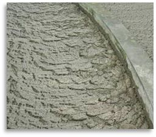
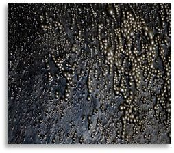
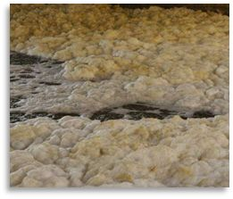
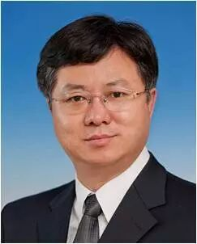

# 北工大乔俊飞教授等：城市污水处理过程异常工况识别和抑制研究

原创 自动化学报 2018-12-13 17:00 北京

> 原文地址: [https://mp.weixin.qq.com/s/dN5d3erc0iy2oygyFDmyig](https://mp.weixin.qq.com/s/dN5d3erc0iy2oygyFDmyig)

近年来，我国大力推进城市污水处理厂建设及其相关技术开发应用，有效的提升了我国污水处理率。但是我国城市污水处理厂的运行状况却不容乐观，异常工况已成为困扰我国城市污水处理厂运营和发展的主要瓶颈。

  

  

韩红桂, 伍小龙, 张璐, 乔俊飞. 城市污水处理过程异常工况识别和抑制研究. 自动化学报, 2018, 44(11): 1971-1984

  

城市污水处理过程由于进水流量、进水成份、污染物种类、有机物浓度等被动接受，系统始终运行在非平稳状态，导致污泥膨胀等异常工况频发。常见的异常工况包括：

  

1) 污泥膨胀，该现象的发生将导致出水水质恶化，而且污泥持续流失会使曝气池内的微生物数量锐减，使之不能有效降解污染物，从而导致整个系统的性能下降，甚至崩溃；

  

2) 泡沫，该异常将导致二沉池中污泥不易沉降，降低污泥的沉淀性能，使出水水质恶化，严重时会溢出曝气池，同时伴随刺激性气味，给污水处理厂的运行和管理带来很多麻烦；

  

3) 浮渣，该异常一方面将导致曝气池处于严重的缺氧或厌氧状态，另一方出现的浮渣也极易导致堵塞现象，甚至影响设备的正常运转。

  

异常工况一旦发生，会降低污水处理效率，引起出水水质超标等问题，严重时造成污水处理过程崩溃，引发事故。因此，降低异常工况发生率、保证城市污水处理过程安全平稳运行，是城市污水处理过程亟待解决的难题

  

及时有效的预防和抑制污水处理过程异常工况是保障城市污水处理过程安全平稳运行的重要一环。近年来，国内外对城市污水处理厂异常工况的识别和抑制方法投入了大量研究，旨在预防和抑制异常工况的发生，确保污水处理厂安全稳定运行。经过多年的努力，污水处理过程自动化技术取得一系列重要突破，先进的控制技术已经开始在城市污水处理异常工况识别和抑制中得到应用。例如，在识别方面，采用图像识别微生物状态、荧光原位杂交(FISH)等机理方法，以及利用隐马尔可夫模型、神经网络等数据驱动方法识别异常工况特征指数等；在抑制方面，采用添加剂法、增设工艺环节等机理方法，以及采用基于经典控制和智能控制的过程调控方法等。

  

如何提高城市污水处理异常工况的识别与抑制水平？

目前先进的城市污水处理异常工况识别与抑制方法不断地降低异常工况的发生率，保障了污水处理过程运行的安全平稳。然而，这方法在实际应用过程中还存在诸多问题未能解决，制约了异常工况的识别与抑制水平，**其中的问题包括**：

  

1) 先进识别和抑制技术依赖于结构固定化模型设计，包括软测量模型和智能控制辨识模型；

2) 以先进的识别和抑制技术功能单一；

3) 识别和抑制方法的可靠性不足且评价困难；

4) 抑制方法的精确指导信息获取困难。

  

为此，需要从根本上解决方法中存在的问题，相应的**解决思路**有：

  

1) 提高软测量模型和智能控制辨识模型自身的适应能力，也即设法随着污水处理水质成分、工况环境等的变化，不断调整软测量模型和智能控制器模型自身结构和参数，从而保持辨识和控制过程的精确性；

2) 根据需求和异常工况的特性，个性化识别和抑制方法，提高识别和抑制的精细程度，也即在识别和抑制过程中，针对不同类型、不同严重程度、不同范围等特征的异常工况，根据实际需求和污水处理建设与运营信息，给不同的异常工况划分类别、类型、优先级等，同时匹配和制定相应的抑制措施；

3) 鉴于污水处理过程存在丰富的先验知识，融入知识经验可提高异常工况识别和抑制的完备性和可靠性，构建合理的验证模型和评价体系；

4)采用优化算法和知识推理方法等为异常工况抑制提供的精确指导信息。

  

总之，对污水处理异常工况识别和抑制而言，目前存在着在污水处理工况环境和水质多变情况下软测量模型和智能控制模型的结构自组织问题、在多类型和多需求异常工况识别和抑制精细化分级和匹配问题、异常工况识别和抑制方法可靠性不高和评价难以及精确指导信息难以获取等难题，这些问题对于实施异常工况识别和抑制至关重要，需要尽快加以研究，得出有效的结果。

  

此外，随着自动化、人工智能等技术的发展，污水处理厂将走向自动化、智能化和无人化。可以预见未来城市污水处理过程不仅能够解决当前异常工况识别与抑制的主要问题，还将结合信息处理、推理预测、仿真及多媒体技术，全面展示实际污水处理处理过程的运行概况，给出异常工况发生分析与预警，提供合理的抑制策略，保证污水处理效果、安全可靠生产等目标，并取得较好的社会效益和经济效益。

  

**作者简介**

  

韩红桂, 北京工业大学信息学部教授，主要研究方向为城市污水处理过程智能优化控制，神经网络结构设计与优化，本文通信作者。

E-mail: rechardhan@bjut.edu.cn。

伍小龙，北京工业大学信息学部博士研究生，2012年获得北京工业大学控制科学与工程硕士学位，主要研究方向为城市污水处理过程智能自组织控制。

E-mail: lewis\_wxl@sina.com。

张璐，北京工业大学信息学部博士研究生，2014年获得菏泽学院控制科学与工程学士学位，主要研究方向为城市污水处理过程多目标智能优化控制。

E-mail: zhlulu1991@163.com。

乔俊飞，北京工业大学信息学部教授，主要研究方向为城市污水处理过程智能优化控制,神经网络结构设计与优化。

E-mail: junfeq@bjut.edu.cn

自动化

学报

**自动化科学与技术未来发展专刊**

[自动化科学与技术未来发展专刊](http://mp.weixin.qq.com/s?__biz=MzAwMzAzMDgxOA==&mid=2651064147&idx=1&sn=327b3991ea3e77cbcf4d980323c7f82a&chksm=8131cd1eb64644083d7138ddf86b40542952eed2bb5bc1422e1f36ec54d4603a1ccf231fc6ef&scene=21#wechat_redirect)  

[陈杰院士等：自动化科学与技术未来发展专刊序言](http://mp.weixin.qq.com/s?__biz=MzAwMzAzMDgxOA==&mid=2651064125&idx=1&sn=719f1a79512837b53e30b629a71cb13c&chksm=8131cd70b64644668547da0629266b323cc8eb363958689b74964fe4451f1c6d2033a6e0d8ba&scene=21#wechat_redirect)  

[柴天佑院士：自动化科学与技术发展方向](http://mp.weixin.qq.com/s?__biz=MzAwMzAzMDgxOA==&mid=2651064125&idx=2&sn=a21645cfef86f1fe6892ca9b69683865&chksm=8131cd70b6464466988712c4ac5ef9b7e4f8aee6414de2dc56a14f61f08fecbbe03ef048e4c5&scene=21#wechat_redirect)  

[东北大学丁进良教授等：复杂工业过程智能优化决策系统的现状与展望](http://mp.weixin.qq.com/s?__biz=MzAwMzAzMDgxOA==&mid=2651064151&idx=1&sn=2c6b2ef1a6178d340d8b10083699c62c&chksm=8131cd1ab646440cb51478ad8d204a9dc6c1450a09340a10333eef2c55ae88e0163a6ea99c53&scene=21#wechat_redirect)  

[桂卫华院士等：铝电解生产智能优化制造研究综述](http://mp.weixin.qq.com/s?__biz=MzAwMzAzMDgxOA==&mid=2651064156&idx=1&sn=657a5cfaca9a69ab7d630bd3f949ae4d&chksm=8131cd11b64644070005198101ade827f94912bd46c6a2b3d1d2ec50e42cfea45d2c7105b5ee&scene=21#wechat_redirect)

[美国南加州大学秦泗钊教授等：数据驱动的工业过程运行监控与自优化研究展望](http://mp.weixin.qq.com/s?__biz=MzAwMzAzMDgxOA==&mid=2651064163&idx=1&sn=edd98909d12c4ebaae5222a64b79440e&chksm=8131cd2eb64644384d2d7d3fce1edf2debdd8328ac63262e2d698a3f0192a6c91c898ba28f49&scene=21#wechat_redirect)

欢迎扫描二维码、长按图片识别关注《自动化学报》中文版订阅号aas1963，服务号自动化学报和英文版服务号！

JAS《自动化学报》（英文版）

自动化学报服务号

自动化学报订阅号

  

联系我们

Tel:  010-82544653（日常咨询和稿件处理） 

        010-82544677（录用后稿件处理）

Fax: 010-82544497

Email: aas@ia.ac.cn（日常咨询和稿件处理）

          aas\_editor@ia.ac.cn（录用后稿件处理）

http://www.aas.net.cn

点

这里“阅读原文”，查看更多