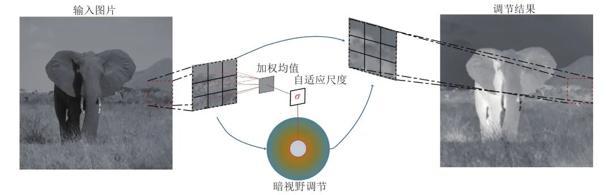
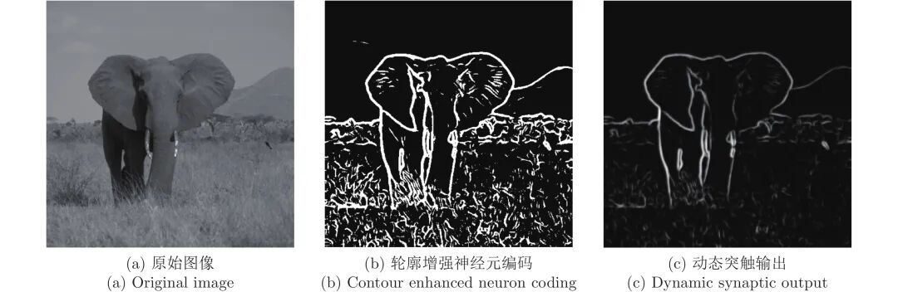

# 基于主视通路结构分级响应模型的轮廓检测方法

原创 自动化学报 自动化学报 2022-03-07 17:04 北京

> 原文地址: [https://mp.weixin.qq.com/s/tyjw-mThK3Rg8Gms5jwjvA](https://mp.weixin.qq.com/s/tyjw-mThK3Rg8Gms5jwjvA)

**点击蓝字 关注我们**

  

**引****用本文**

  

陈树楠, 范影乐, 房涛, 武薇. 基于主视通路结构分级响应模型的轮廓检测方法. 自动化学报, 2022, 48(3): 820−833 doi: 10.16383/j.aas.c200046

Chen Shu-Nan, Fan Ying-Le, Fang Tao, Wu Wei. A contour detection method based on hierarchical structure response model in primary visual pathway. Acta Automatica Sinica, 2022, 48(3): 820−833 doi: 10.16383/j.aas.c200046 http://www.aas.net.cn/cn/article/doi/10.16383/j.aas.c200046?viewType=HTML

  

**文章简介**

  

**关键词**

  

轮廓检测, 暗视野调节, 微动整合, 动态关联

  

**摘   要**

  

基于视通路结构分级响应与动态传递的方式, 本文提出了一种图像轮廓检测的新方法. 针对视网膜感光细胞的暗视觉特性, 建立亮度自适应的暗视野调节模型, 利用多尺度经典感受野的方位选择性, 构建高级轮廓与全局轮廓的检测路径; 模拟外侧膝状体(Lateral geniculate nucleus, LGN)细胞特性对信息进行纹理稀疏编码, 并结合非经典感受野的侧抑制作用抑制背景强纹理; 另外在LGN区提出微动整合机制, 减少纹理冗余信息, 再经适应性突触实现信息关联传递; 最后将初级轮廓响应跨视区前馈至V1区并经全局轮廓修正后, 与高级轮廓响应实现快速融合. 分别以RuG40、BSDS500图像库中的自然图像作为实验数据, 检测结果与基准轮廓图的平均最优P指标分别为0.50、0.32, 结果表明本方法能更有效地区分轮廓与纹理边缘, 凸显主体轮廓. 本文利用视神经细胞的内在机制以及神经信息的动态传递过程实现图像轮廓信息的编码与检测, 也为研究后续高级视皮层的视觉感知提供了新思路.

  

**引   言**

  

轮廓信息作为图像目标的一种低维视觉特征, 不仅将显著影响到后续图像分析和理解的准确性, 而且对从输入层级降低系统的复杂性也具有重要意义.

  

以Canny等算子为代表的传统轮廓检测方法, 通常关注于以滑窗为基础的局部邻域梯度特征, 具有较好的数学意义可解释性以及检测效率. 但由于其在分离目标与背景像素时, 忽视了视觉机制在空间关系描述中的重要作用, 因此在对具有纹理背景干扰的图像目标轮廓定位时, 尤其是对于弱对比度图像, 经纹理抑制后将会丢失大量真实轮廓信息.

  

随着视觉生理实验及计算神经的发展, 在视通路对视觉信息流的传递和处理过程中, 各种视觉机制被陆续得到验证和应用. 例如有研究考虑视觉神经元非经典感受野(non-classical receptive field)对经典感受野(classical receptive field)的调节作用, 通过Gabor滤波器对图像进行不同尺度空间的纹理过滤; 还有研究根据还有研究根据视网膜感受野X-Y通道特性, 分别利用线性与非线性调制感受野外周区的侧抑制作用, 强化轮廓特征信息; 但上述方法都仅从单一感受野特性出发, 难以区分主体弱边缘与背景纹理噪声; 因此有研究进一步模拟初级视通路, 例如对图像时空信息和冗余度进行编码, 强化轮廓信息并提高检测鲁棒性; 也有研究从神经脉冲发放角度出发, 对接收刺激进行HH神经元模型编码, 分别经ON和OFF型感受野作用后, 选取6个方向描述视觉皮层的方向选择性, 在信号传递过程中引入突触的动态可塑性对刺激响应的影响, 最终融合得到最优方位图轮廓特征; 此外还有研究在视觉系统中引入先验滤波以减少信息传递时间, 并利用神经元的相关性以及稀疏编码去除冗余噪声信息, 提高轮廓检测准确性. 上述基于视觉通路的神经计算模型的轮廓提取方法对视觉刺激进行递进加工, 在检测效果上得到了明显的提升, 但必须需要指出的是它们通常只考虑视觉信息流在初级视通路上的串行层级传递过程, 弱化了在单一节点上的多级处理能力, 而且忽略或简化了前级节点对视皮层区的跨视区调制作用, 从而割裂了主体细节与显著特征的关系.

  

据目前的生理实验证明, 初级视通路各节点的感受野尺寸以及作用强度等特性并不完全相同, 而且传递过程中不仅存在着稀疏性处理、视觉信息整合等多级加工环节, 还存在分支路径以保证视觉信息流的快速感知. 因此本文基于视觉信息流的传递路径, 模拟上述主视通路各环节对信息的编码处理, 分别利用暗视觉适应性调节、神经稀疏性编码、微动响应整合、突触动态传递以及视觉信息流前馈投射传递等视觉机制, 提出了一种新的结构分级响应计算模型, 对自然场景下的目标主体轮廓进行获取. 首先模拟视网膜对视觉信息的暗视野自适应调节机制, 利用其对暗视野的敏锐感知作用加强对图像暗边缘的相对响应强度, 并根据神经节细胞的经典感受野的方向选择特性获取初级轮廓信息; 其次参考外侧膝状体(Lateral geniculate nucleus, LGN)功能, 提出一种将非经典感受野侧抑制与信息稀疏编码相结合的纹理抑制方法, 实现在初级轮廓响应保留更多细节的前提下增强对背景强纹理的抑制效果, 并探究其对微动信息的整合作用, 随后采用动态突触将脉冲响应传递至V1区, 构建成LGN与初级视皮层的动态信息关联模型; 最后提出一种新的视觉融合感知方案, 利用跨视区的神经响应前馈机制对初级轮廓进行修正后, 将两者在初级视皮层区快速融合实现显著轮廓的检测与提取.

  

图 1  暗视野调节过程示意图

  

图 2  动态过程编码示意图

  

请点击左下角“**阅读原文**”了解更多！

  

**作者简介**

**陈树楠**

杭州电子科技大学自动化学院硕士研究生. 2018年获得杭州电子科技大学学士学位. 主要研究方向为计算机视觉, 图像处理.

E-mail: 13616821889@163.com

**范影乐**

杭州电子科技大学自动化学院教授. 2001年获得浙江大学博士学位. 主要研究方向为神经信息学, 机器视觉与机器学习. 本文通信作者.

E-mail: fan@hdu.edu.cn

**房   涛**

杭州电子科技大学自动化学院博士研究生. 2015年获得华北水利水电大学学士学位. 主要研究方向为模式识别, 生物启发类算法研究.

E-mail: tfyzft@foxmail.com

**武   薇**

杭州电子科技大学自动化学院讲师. 2012年获得浙江大学博士学位. 主要研究方向为医学信息学, 计算机图像处理. 

E-mail: ww@hdu.edu.cn

  

**相关文章**

**（请向上滑动阅读）**

  

\[1\]  钟凯, 韩敏, 韩冰. 基于动态特性描述的变量加权型分散式故障检测方法. 自动化学报, 2021, 47(9): 2205-2213. doi: 10.16383/j.aas.c180276

http://www.aas.net.cn/cn/article/doi/10.16383/j.aas.c180276?viewType=HTML

  

\[2\]  杜大军, 张竞帆, 张长达, 费敏锐, YANGTai-Cheng. 动态水印攻击检测方法的鲁棒性研究. 自动化学报. doi: 10.16383/j.aas.c200614

http://www.aas.net.cn/cn/article/doi/10.16383/j.aas.c200614?viewType=HTML

  

\[3\]  张明琦, 范影乐, 武薇. 基于初级视通路视觉感知机制的轮廓检测方法. 自动化学报, 2020, 46(2): 264-273. doi: 10.16383/j.aas.2018.c170688

http://www.aas.net.cn/cn/article/doi/10.16383/j.aas.2018.c170688?viewType=HTML

  

\[4\]  刘强, 方彤, 董一凝, 秦泗钊. 基于动态建模与重构的列车轴承故障检测和定位. 自动化学报, 2019, 45(12): 2233-2241. doi: 10.16383/j.aas.c190247

http://www.aas.net.cn/cn/article/doi/10.16383/j.aas.c190247?viewType=HTML

  

\[5\]  王学伟, 王婧, 王琳, 袁瑞铭. 畸变波形m序列动态测试信号建模与电能量值压缩检测方法. 自动化学报, 2018, 44(6): 1053-1061. doi: 10.16383/j.aas.2017.c160567

http://www.aas.net.cn/cn/article/doi/10.16383/j.aas.2017.c160567?viewType=HTML

  

\[6\]  齐美彬, 岳周龙, 疏坤, 蒋建国. 基于广义关联聚类图的分层关联多目标跟踪. 自动化学报, 2017, 43(1): 152-160. doi: 10.16383/j.aas.2017.c150519

http://www.aas.net.cn/cn/article/doi/10.16383/j.aas.2017.c150519?viewType=HTML

  

\[7\]  王鼎, 穆朝絮, 刘德荣. 基于迭代神经动态规划的数据驱动非线性近似最优调节. 自动化学报, 2017, 43(3): 366-375. doi: 10.16383/j.aas.2017.c160272

http://www.aas.net.cn/cn/article/doi/10.16383/j.aas.2017.c160272?viewType=HTML

  

\[8\]  蒋朝辉, 吴巧群, 桂卫华, 阳春华, 谢永芳. 基于分数阶的多向微分算子的高炉料面轮廓自适应检测. 自动化学报, 2017, 43(12): 2115-2126. doi: 10.16383/j.aas.2017.c160621

http://www.aas.net.cn/cn/article/doi/10.16383/j.aas.2017.c160621?viewType=HTML

  

\[9\]  谢昭, 童昊浩, 孙永宣, 吴克伟. 一种仿生物视觉感知的视频轮廓检测方法. 自动化学报, 2015, 41(10): 1814-1824. doi: 10.16383/j.aas.2015.c150018

http://www.aas.net.cn/cn/article/doi/10.16383/j.aas.2015.c150018?viewType=HTML

  

\[10\]  林煜东, 和红杰, 陈帆, 尹忠科. 基于轮廓几何稀疏表示的刚性目标模型及其分级检测算法. 自动化学报, 2015, 41(4): 843-853. doi: 10.16383/j.aas.2015.c130431

http://www.aas.net.cn/cn/article/doi/10.16383/j.aas.2015.c130431?viewType=HTML

  

\[11\]  杨玉珍, 刘培玉, 费绍栋, 张成功. 融合扩展信息瓶颈理论的话题关联检测方法研究. 自动化学报, 2014, 40(3): 471-479. doi: 10.3724/SP.J.1004.2014.00471

http://www.aas.net.cn/cn/article/doi/10.3724/SP.J.1004.2014.00471?viewType=HTML

  

\[12\]  张桂梅, 张松, 储珺. 一种新的基于局部轮廓特征的目标检测方法. 自动化学报, 2014, 40(10): 2346-2355. doi: 10.3724/SP.J.1004.2014.02346

http://www.aas.net.cn/cn/article/doi/10.3724/SP.J.1004.2014.02346?viewType=HTML

  

\[13\]  赵丛然, 解学军. 具有 iISS 逆动态的非线性系统的输出反馈调节. 自动化学报, 2012, 38(5): 865-869. doi: 10.3724/SP.J.1004.2012.00865

http://www.aas.net.cn/cn/article/doi/10.3724/SP.J.1004.2012.00865?viewType=HTML

  

\[14\]  段纳, 解学军. 具有iISS未建模动态的非线性系统的状态反馈调节. 自动化学报, 2010, 36(7): 1033-1036. doi: 10.3724/SP.J.1004.2010.01033

http://www.aas.net.cn/cn/article/doi/10.3724/SP.J.1004.2010.01033?viewType=HTML

  

\[15\]  杨丹, 王洪星, 张小洪, 闫卫杰. 轮廓曲线的LoG变换及图像共变区域的检测. 自动化学报, 2010, 36(6): 817-822. doi: 10.3724/SP.J.1004.2010.00817

http://www.aas.net.cn/cn/article/doi/10.3724/SP.J.1004.2010.00817?viewType=HTML

  

\[16\]  苗宇, 苏宏业, 褚健. 非线性动态系统中迭代的同步数据协调与显著误差检测的支持向量回归方法. 自动化学报, 2009, 35(6): 707-716. doi: 10.3724/SP.J.1004.2009.00707

http://www.aas.net.cn/cn/article/doi/10.3724/SP.J.1004.2009.00707?viewType=HTML

  

\[17\]  闫雪华, 解学军, 刘海宽. 具有iISS逆动态非线性系统的分散自适应调节. 自动化学报, 2008, 34(2): 167-171. doi: 10.3724/SP.J.1004.2008.00167

http://www.aas.net.cn/cn/article/doi/10.3724/SP.J.1004.2008.00167?viewType=HTML

  

\[18\]  朱建栋, 程兆林. 经输出动态反馈的非线性奇异系统输出调节问题. 自动化学报, 2003, 29(1): 80-85.

http://www.aas.net.cn/cn/article/id/16602?viewType=HTML

  

\[19\]  胡峰, 孙国基, 黄刘生. 动态系统输入环节突发性故障的检测与辨识. 自动化学报, 2002, 28(6): 881-887.

http://www.aas.net.cn/cn/article/id/15625?viewType=HTML

  

\[20\]  张军英, 许进, 保铮. Hopfield网的关联分析. 自动化学报, 1997, 23(4): 446-454.

http://www.aas.net.cn/cn/article/id/17010?viewType=HTML

  

  

**近期文章**

[人生跑马灯？人类首次同步测量大脑濒死状态](http://mp.weixin.qq.com/s?__biz=MzAwMzAzMDgxOA==&mid=2651074149&idx=2&sn=60d48feaa01d160092c19a91e1314db7&chksm=8131e428b6466d3e1e8f835c506ae7faf61e8b66d94fc1dd027a089e075f82078ce5422a0a13&scene=21#wechat_redirect)

[自动化学报（英文版）和自动化学报入选计算领域高质量科技期刊T1类](http://mp.weixin.qq.com/s?__biz=MzAwMzAzMDgxOA==&mid=2651073859&idx=2&sn=7a9192717637dcf6cddb39ed961e8c3b&chksm=8131e70eb6466e188a123c504bdeba80c75681de4762f8685b3bf584bc33eb12362c70613b4e&scene=21#wechat_redirect)

[AI黑科技：马赛克加密被破解了！](http://mp.weixin.qq.com/s?__biz=MzAwMzAzMDgxOA==&mid=2651073824&idx=2&sn=0c15fef01cd893210bef1cceece5d49d&chksm=8131e76db6466e7b1c78884be8517733101cbe37b5a2fd95f4d4df6b569956c0dc5598435eb4&scene=21#wechat_redirect)

[Nature：当AI学会控制核聚变反应堆](http://mp.weixin.qq.com/s?__biz=MzAwMzAzMDgxOA==&mid=2651073629&idx=2&sn=b298f9f715cc9a6a38a54f36aea98171&chksm=8131e610b6466f06072ffe4dcfb213dde209f893bd3071cd4cbca8ba9a6484334028a3aae92a&scene=21#wechat_redirect)

[《自动化学报》编辑部防诈骗公告](http://mp.weixin.qq.com/s?__biz=MzAwMzAzMDgxOA==&mid=2651073517&idx=1&sn=c52de7c685e546af9faffc0cefab1c85&chksm=8131e1a0b64668b63ebaa68ea81cbaec3b94dc52ea8360821a0a49e67ae7e4b428a25d0f19c5&scene=21#wechat_redirect)

[中国科学院自动化研究所“海外优青”项目招聘启事](http://mp.weixin.qq.com/s?__biz=MzAwMzAzMDgxOA==&mid=2651073629&idx=3&sn=704a900c277b3224dfa9745d2ccc8c24&chksm=8131e610b6466f06329a900636c1bf894d6a890b89d114bbd9faf5f9a8132a73a228e7c3aeac&scene=21#wechat_redirect)

[“诺奖风向标”斯隆奖2022名单出炉！27位华人学者入选](http://mp.weixin.qq.com/s?__biz=MzAwMzAzMDgxOA==&mid=2651073517&idx=2&sn=5ed3a30328a9f41bd43999c1592469b8&chksm=8131e1a0b64668b687601773f8d9d6960344a59a62e83dede480b768fad7375bc5329cfcebdc&scene=21#wechat_redirect)

[Nature封面：人类又输给了AI，赛车AI击败人类顶级车手！](http://mp.weixin.qq.com/s?__biz=MzAwMzAzMDgxOA==&mid=2651073362&idx=2&sn=e9a5d620fd2afa6af2c13d9c695e54a7&chksm=8131e11fb64668099fa52873d8df2f3a91c3244972da7d10cbf7c234c8b95b70954e1f2affab&scene=21#wechat_redirect)

  

**热点文章**

[《自动化学报》2019年高关注论文](http://mp.weixin.qq.com/s?__biz=MzAwMzAzMDgxOA==&mid=2651073450&idx=1&sn=6f57bd0df73f259aa416575f1f69bdfb&chksm=8131e1e7b64668f1344de4acdef6148e8dcfa60c80e4f48e6cb1270558c2beade5601e92d05c&scene=21#wechat_redirect)

[《自动化学报》2021年热点文章回顾](http://mp.weixin.qq.com/s?__biz=MzAwMzAzMDgxOA==&mid=2651072577&idx=1&sn=4e6be077d7371c7d29d9a371d8defe19&chksm=8131e20cb6466b1aec2f3b8b1063d3be11725ca9a0c15785c3b42a638170e732acd0d8d345e0&scene=21#wechat_redirect)

[国家自然科学基金论文精选](http://mp.weixin.qq.com/s?__biz=MzI2NjA3MzM5MA==&mid=2649960308&idx=1&sn=1634c999f22588333537f13393403f9c&chksm=f2942b35c5e3a2232e86b51c2b7c8f37a4d3d7f858d370d76d5afd00567d7da6e9543476d120&scene=21#wechat_redirect)  

[国家重点研发计划论文精选](http://mp.weixin.qq.com/s?__biz=MzI2NjA3MzM5MA==&mid=2649960255&idx=1&sn=f48435928fd924134cb72014860b9d00&chksm=f2942b7ec5e3a26869da68a1419b3b40ca1e6cb98abf2e380d78a49ffb99c85991d76cc346b0&scene=21#wechat_redirect)

[中国科学院自动化研究所高层次人才招聘启事 | 长期有效](http://mp.weixin.qq.com/s?__biz=MzI2NjA3MzM5MA==&mid=2649959451&idx=1&sn=657b7e4aeeaa88114d5189641c5409dc&chksm=f294285ac5e3a14cd230a2b9678c32ba9bf92e8ffc9d61d506c5ffea2df793456dd37c2c6fb1&scene=21#wechat_redirect)

  

**期刊动态**

[自动化学报（英文版）和自动化学报入选计算领域高质量科技期刊T1类](http://mp.weixin.qq.com/s?__biz=MzAwMzAzMDgxOA==&mid=2651073859&idx=2&sn=7a9192717637dcf6cddb39ed961e8c3b&chksm=8131e70eb6466e188a123c504bdeba80c75681de4762f8685b3bf584bc33eb12362c70613b4e&scene=21#wechat_redirect)

[《自动化学报》编辑部防诈骗公告](http://mp.weixin.qq.com/s?__biz=MzAwMzAzMDgxOA==&mid=2651073517&idx=1&sn=c52de7c685e546af9faffc0cefab1c85&chksm=8131e1a0b64668b63ebaa68ea81cbaec3b94dc52ea8360821a0a49e67ae7e4b428a25d0f19c5&scene=21#wechat_redirect)

[《自动化学报》致谢审稿人](http://mp.weixin.qq.com/s?__biz=MzI2NjA3MzM5MA==&mid=2649961201&idx=1&sn=3142842d75c441ae860c1ecb313c7657&chksm=f29436b0c5e3bfa6c679210f60513eb1a7205dc20fe028f482bb593eac60427e4e56fba12493&scene=21#wechat_redirect)

[自动化学报多篇论文入选中国百篇最具影响国内论文和中国精品期刊顶尖论文](http://mp.weixin.qq.com/s?__biz=MzI2NjA3MzM5MA==&mid=2649961152&idx=1&sn=4a5e9e4b84879f4cde4e13a0ef97272c&chksm=f2943681c5e3bf97d7770c9623dac869b283b3ea83f3d320017974033e361d8b999134a8bdff&scene=21#wechat_redirect)

[自动化学报各项主要指标蝉联第1，再获百种中国杰出期刊称号](http://mp.weixin.qq.com/s?__biz=MzI2NjA3MzM5MA==&mid=2649960903&idx=1&sn=7da8b8a0167e16bcbaa1f00fbfb69782&chksm=f2943586c5e3bc9014f6d4fff7147b998ae42b4da452907e641e8029f296fd2413b4f17aef62&scene=21#wechat_redirect)

[《自动化学报》发表文章入选第六届中国科协优秀科技论文](http://mp.weixin.qq.com/s?__biz=MzI2NjA3MzM5MA==&mid=2649960313&idx=1&sn=01b5a9defe9664ba4a0b8d7322e115d0&chksm=f2942b38c5e3a22e2c57edaa8667a27368ccfb595e6a372dfa85ff2a61329788870d77957a2f&scene=21#wechat_redirect)

[自动化学报（英文版）首届青年编委招募](http://mp.weixin.qq.com/s?__biz=MzI2NjA3MzM5MA==&mid=2649959475&idx=1&sn=e28ce2b8fa27ee4fb6a5c0c17e25dd25&chksm=f2942872c5e3a16438dbf45fd8091b643cd2bf50f0bab7092a6c5103d06cd4a16ebceb4db40a&scene=21#wechat_redirect)

  

**期刊目录**

[2022年第02期](http://mp.weixin.qq.com/s?__biz=MzI2NjA3MzM5MA==&mid=2649961838&idx=1&sn=29334896aa0f372b70312250c75b6b20&chksm=f294312fc5e3b8392ffd49100eaba435bf48fa9234c5019fe7b16ed1e4ebef70be58691f3fb3&scene=21#wechat_redirect)

[2022年第01期](http://mp.weixin.qq.com/s?__biz=MzI2NjA3MzM5MA==&mid=2649961423&idx=1&sn=3b65958faa7c7f94c247f46dd72bd71e&chksm=f294378ec5e3be9825f860d132c36c97f3e877089449cb1fe85a6d1e7da9bd0e24795336bc54&scene=21#wechat_redirect)

[《自动化学报》2021年全年合集](http://mp.weixin.qq.com/s?__biz=MzAwMzAzMDgxOA==&mid=2651072770&idx=1&sn=7c531f7fa3bc390558fab15b339ce86e&chksm=8131e34fb6466a59ed079448fddda0fc9f97066460bff8f6835288003a1fba2812de383813c1&scene=21#wechat_redirect)

[《自动化学报》2020年全年合集](http://mp.weixin.qq.com/s?__biz=MzI2NjA3MzM5MA==&mid=2649957972&idx=1&sn=1951847aacbcb7d22bdd2a46a79af871&chksm=f2942215c5e3ab03d070d8e52b8764b38036897c97b6a26c7a1f918c806b28edbe6c0fbf7ea9&scene=21#wechat_redirect)

[2020年第10期 工业人工智能专题](http://mp.weixin.qq.com/s?__biz=MzI2NjA3MzM5MA==&mid=2649957201&idx=1&sn=ab82a767bd716ab67fdf2942500d8b61&chksm=f2942710c5e3ae06b27f9e63a5e329a1123d90b051164e6b6123c500230541b1ed12d92abbfb&scene=21#wechat_redirect)

[2020年第09期 分布式信息能源系统理论与应用专题](http://mp.weixin.qq.com/s?__biz=MzI2NjA3MzM5MA==&mid=2649956412&idx=1&sn=8ebc13d63fd333ad85dbb8b5825df248&chksm=f294247dc5e3ad6ba297857a5b957e97cf499266c50318791fa8abd9432ecf1d9c3d9b287e36&scene=21#wechat_redirect)

  

  

  

**长按二维码｜关注我们**

**IEEE/CAA Journal of Automatica Sinica (JAS)**

**长按二维码｜关注我们**

**《自动化学报》服务号**

**长按二维码｜关注我们**

**《自动化学报》订阅号**  

  

**联系我们**

**网站:** 

http://www.aas.net.cn

http://www.ieee-jas.net

**投稿:** 

https://mc03.manuscriptcentral.com/aas-cn   

https://mc03.manuscriptcentral.com/ieee-jas 

**电话:**

010-82544653（日常咨询和稿件处理） 

010-82544677（录用后稿件处理）

**邮箱:** 

aas@ia.ac.cn（日常咨询和稿件处理）  

aas\_editor@ia.ac.cn（录用后稿件处理）

**博客:** 

http://blog.sina.com.cn/aaseditor 

  

**↓ 点击下方 阅读原文 了解更多**