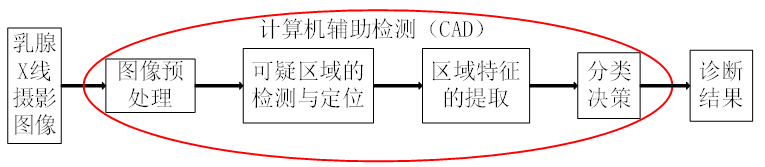
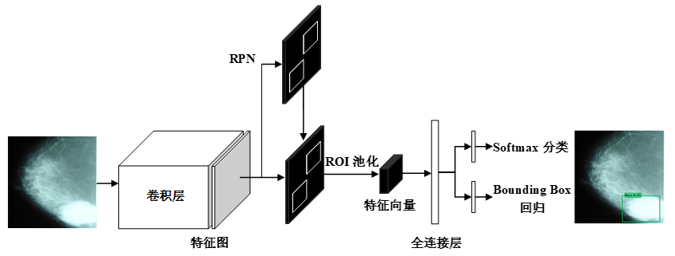
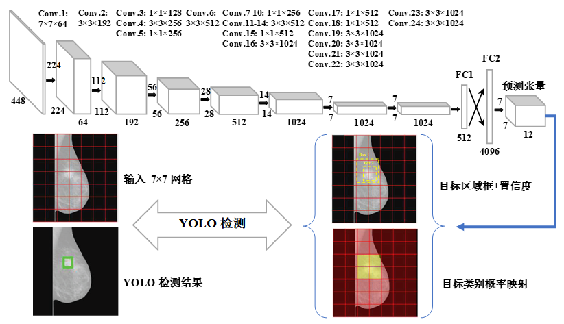
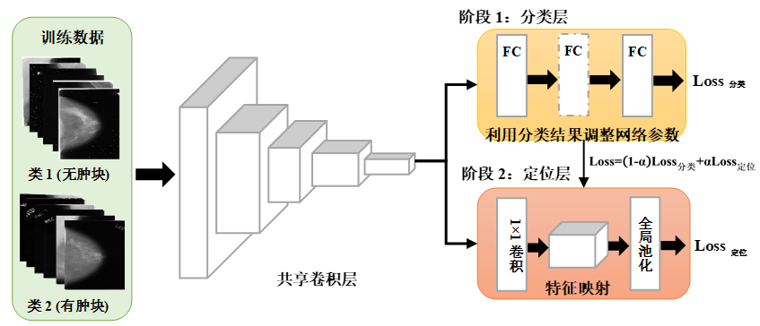
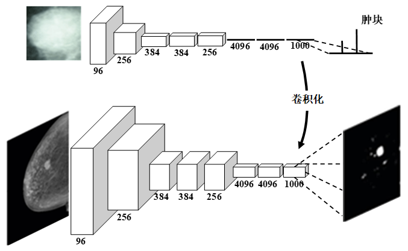
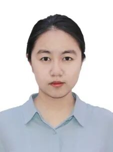
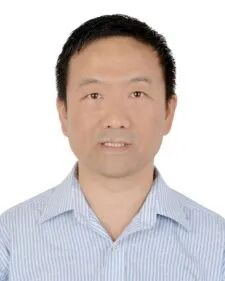

# 基于乳腺X线摄影的肿块检测综述

原创 自动化学报 自动化学报 2021-04-30 09:06 北京

> 原文地址: [https://mp.weixin.qq.com/s/gS7m-qFQmjfd8lhNCtdwlg](https://mp.weixin.qq.com/s/gS7m-qFQmjfd8lhNCtdwlg)

**点击蓝字**

**关注我们**

  

**乳腺X线摄影检查**是指：利用X线摄影对乳腺组织进行影像学检查，对呈现的异常乳腺组织进行筛查和诊断，乳腺X线摄影在乳腺癌早期诊断方面取得较为满意的结果。目前，已成为乳腺疾病首选的影像诊断手段，用于对适龄女性的乳腺普查。

  

王俊茜, 徐勇, 孙利雷, 蒲祖辉. 基于乳腺X线摄影的肿块检测综述.自动化学报, 2021, 47(4): 747-764

_http://www.aas.net.cn/cn/article/doi/10.16383/j.aas.c180662?viewType=HTML_

  

乳腺癌已成为全球女性发病率最高的恶性肿瘤，是危害女性健康的“第一杀手”。至今为止，诱发乳腺癌的确切致病因素仍尚未完全清楚，但通过对适龄女性进行早期和定期的乳腺疾病筛查，及时对异常组织进行诊断与治疗是控制乳腺癌死亡率最为有效的方法。在临床应用中，乳腺癌的X线摄影直接征象为钙化和肿块。现阶段，对乳腺X线摄影中钙化点的检测技术已经相当成熟, 但对肿块区域的检测和分类依旧是一项具有挑战性的任务。

  

目前, 我国主要使用人工筛查的方式对乳腺 X 线摄影进行分析。但由于医生经验水平存在差异、乳腺X线摄影成像特点和受检者乳腺组织密度的不同等综合因素影响，难以将乳腺病变情况进行统一的标准化分析，易出现漏检和误诊。为此, 在临床应用中，借助计算机视觉分析技术, 实现基于医学图像的乳腺癌自动分析系统能够在一定程度上减少对医生经验水平的依赖，提高乳腺 X 线摄影分析的一致性，为医生提供有效的参考意见, 已成为医学工作者提升诊断效率的广泛需求。因此，运用先进计算机视觉技术对医学图像进行自动分析，协助医生诊断病情是计算机领域与医学领域共同研究的重点。

  

计算机辅助检测与诊断技术通过利用医学图像处理技术以及其他可能的生理、生化手段, 结合计算机技术对医学图像和检验数据进行分析, 实现自动检测病灶区域以及对病灶性质给予合理性分析和预诊断, 辅助医生提高对疾病诊断的准确率。计算机辅助检测与诊断技术的出现可以有效地缓解医生的工作压力, 提高医生诊断的敏感性和特异性。基于乳腺X线摄影的计算机辅助检测与诊断系统的主要研究内容涵盖：图像的预处理、可疑区域的检测与定位、区域特征提取和分类决策，如图1所示。在医生临床观察与诊断和计算机辅助检测与诊断分析中对可疑区域的检测和定位是研究的重点和难点。因此，本文针对乳腺X线摄影中可疑区域的检测与定位的已有方法进行介绍和总结。

  

_图1  基于乳腺X线摄影的计算机辅助检测与诊断系统框架_

  

_图2  基于候选框的乳腺肿块检测任务结构示意图_

  

_图3  基于回归的乳腺肿块检测任务结构示意图_

  

_图4  基于弱监督和自迁移学习的乳腺肿块定位任务结构示意图_

  

_图5  基于全卷积网络的乳腺肿块检测和分割任务结构示意图_

  

**如何提高基于乳腺X线摄影的肿块检测性能？**

  

目前，主要通过提升对疑似肿块区域的特征表示方法来实现。基于传统的人工特征设计的乳腺肿块检测与分割方法以提取丰富、准确特征为前提，不需要复杂的训练过程，快速实现特征计算和结果预测, 具有较强的可解释性。但传统方法只局限于提取疑似肿块区域的浅层特征, 往往只适用于检测某种具有显著性特征的乳腺肿块，在实际临床应用中，对变化多样的乳腺肿块特征的表示不具备良好的鲁棒性，检测模型的泛化能力很差。

  

基于深度学习的特征表达具有强大的数据描述能力，其在识别精度和模型泛化能力方面比传统方法更胜一筹。相比于传统乳腺肿块检测与分割方法，基于深度学习的乳腺肿块检测方法更适应在实际诊疗场景中变化多样的乳腺肿块检测任务。具体的优势可以概括如下：

  

1) 可以实现端到端的训练，节省了人工挑选特征的烦恼；

  

2) 通过构建具有多个分层结构的学习模型，逐步提取由浅层特征到高层抽象语义特征表示；

  

3) 利用多层非线性映射的方式尽可能的挖掘具有鉴别性的潜在特征。

目前，基于乳腺X线摄影的肿块检测研究还处于探索阶段。因此，本文对近几年提出的基于全乳腺 X 线摄影中肿块检测方法分别从基于传统的乳腺肿块检测与分割和基于深度学习的乳腺肿块检测两个方面进行了归纳和总结。其中，对利用深度学习方法实现的乳腺 X 线摄影的肿块检测，本文整理了从2015年至2018年利用深度学习方法探究基于乳腺 X 线摄影中肿块检测任务的相关文献。根据文献中使用的不同目标检测策略，文本将基于深度学习实现乳腺X线摄影的肿块检测方法归纳为如下4种：基于候选框的乳腺肿块检测方法、基于回归的乳腺肿块检测方法、基于弱监督学习的乳腺肿块定位方法和基全卷积网络的乳腺肿块检测方法，如图2-5所示。并对各类方法中存在的优缺点进行分析，同时对未来可能的发展方向进行了深入探讨。我们相信，通过深度学习方法的不断改进、医学图像采集技术的不断提升和标记样本集数量的不断增长，未来基于乳腺X线摄影的乳腺肿块检测方法将越来越完善。

  

  

**●** **作者简介****●**

**王俊茜**

哈尔滨工业大学（深圳）计算机科学与技术学院生物计算研究中心博士研究生。2018年获得哈尔滨工业大学计算机科学与技术专业工学硕士学位。主要研究方向为模式识别，计算机视觉，深度学习与医学图像处理。

E-mail: wangjunqian@stu.hit.edu.cn；wangjunqian1993@163.com

  

**徐  勇**

哈尔滨工业大学（深圳）计算机科学与技术学院生物计算研究中心教授。2005年获得南京理工大学模式识别与智能系统专业工学博士学位。研究方向为模式识别，计算机视觉，深度学习，生物特征识别，医学图像处理与生物信息学。本文通信作者。

E-mail: laterfall@hit.edu.cn

  

**孙利雷**

贵州大学计算机科学与技术学院博士研究生。2016年获得贵州大学计算机技术专业工程硕士学位。主要研究方向为模式识别、医学图像处理。

E-mail: sunlileisun@163.com

  

**蒲祖辉**

临床医学博士，副主任医师，深圳市第二人民医院（深圳大学第一附属医院）放射科。主要研究方向为肿瘤学，循证医学，人工智能。

E-mail: pupeter190@163.com

  

**相关文章**

[结合MRF能量和模糊速度的乳腺癌图像分割方法](http://mp.weixin.qq.com/s?__biz=MzAwMzAzMDgxOA==&mid=2651066272&idx=1&sn=6b73eeed07bb342e88b6e844d4b05719&chksm=8131c5edb6464cfbb86583bf20f419bdefd1709d499936dc80bebafb9c92d2b322b45d2a4a50&scene=21#wechat_redirect)

  

**期刊目录**

[2021年第04期](http://mp.weixin.qq.com/s?__biz=MzI2NjA3MzM5MA==&mid=2649958569&idx=1&sn=ae33a7dcd6e2d66cae59932a1e99ce5e&chksm=f2942ce8c5e3a5fe7d94f6d809ecc492e83ebe118243f871cc4d82420c403784a01db82a93cb&scene=21#wechat_redirect)

[2021年第03期](http://mp.weixin.qq.com/s?__biz=MzI2NjA3MzM5MA==&mid=2649958419&idx=1&sn=b5d00eb294aa8c61a6fe4a0da8b461b9&chksm=f2942c52c5e3a544ca32e37d63f8ca879a64018d3fa5b25abd6bde1aeb582914f16e1e11182a&scene=21#wechat_redirect)

[2021年第02期](http://mp.weixin.qq.com/s?__biz=MzI2NjA3MzM5MA==&mid=2649958305&idx=1&sn=a701b9996478d2c09078a03f5b22d524&chksm=f29423e0c5e3aaf692be51b3905e1cbf4045c6df9664ce7d13459de3c0c61aa284b13eb502b9&scene=21#wechat_redirect)

[2021年第01期](http://mp.weixin.qq.com/s?__biz=MzI2NjA3MzM5MA==&mid=2649958084&idx=1&sn=24c140a6a1957eb7f4164689ed2840a5&chksm=f2942285c5e3ab93c5ed6127ad93e76ded82ae657ca79f7ead390387fbe2a72cb6df0ec6dcd2&scene=21#wechat_redirect)

[《自动化学报》2020年全年合集](http://mp.weixin.qq.com/s?__biz=MzI2NjA3MzM5MA==&mid=2649957972&idx=1&sn=1951847aacbcb7d22bdd2a46a79af871&chksm=f2942215c5e3ab03d070d8e52b8764b38036897c97b6a26c7a1f918c806b28edbe6c0fbf7ea9&scene=21#wechat_redirect)

[2020年第10期 工业人工智能专题](http://mp.weixin.qq.com/s?__biz=MzI2NjA3MzM5MA==&mid=2649957201&idx=1&sn=ab82a767bd716ab67fdf2942500d8b61&chksm=f2942710c5e3ae06b27f9e63a5e329a1123d90b051164e6b6123c500230541b1ed12d92abbfb&scene=21#wechat_redirect)

[2020年第09期 分布式信息能源系统理论与应用专题](http://mp.weixin.qq.com/s?__biz=MzI2NjA3MzM5MA==&mid=2649956412&idx=1&sn=8ebc13d63fd333ad85dbb8b5825df248&chksm=f294247dc5e3ad6ba297857a5b957e97cf499266c50318791fa8abd9432ecf1d9c3d9b287e36&scene=21#wechat_redirect)

[2019年第12期 智能轨道交通系统专刊](http://mp.weixin.qq.com/s?__biz=MzI2NjA3MzM5MA==&mid=2649955524&idx=1&sn=a76b97bf832e984f0155acc0fb367bc7&chksm=f2941885c5e391935c353c88072e806cb0b5b9b78b1f7b23b3c6f4b8c6a2c12f72557f87b56b&scene=21#wechat_redirect)  

[2019年第01期 信息物理融合系统理论与应用专刊](http://mp.weixin.qq.com/s?__biz=MzI2NjA3MzM5MA==&mid=2649955194&idx=2&sn=fb75bc8af9672922fa20efe2d30ff6c9&chksm=f2941f3bc5e3962db43689d03a54a0e40d83cb0e69fb9c48e87c0325b5bdf1b71028ebbbba0a&scene=21#wechat_redirect)

  

**热点文章**

[基于区块链的数字货币发展现状与展望](http://mp.weixin.qq.com/s?__biz=MzI2NjA3MzM5MA==&mid=2649958456&idx=1&sn=db1e69bbd69e864051158910b599e0a9&chksm=f2942c79c5e3a56f669395da520a1f215c6452cc8a0d40ca6e3b274b85e077c547bf4d85a8e5&scene=21#wechat_redirect)

[基于深度学习的表面缺陷检测方法综述](http://mp.weixin.qq.com/s?__biz=MzAwMzAzMDgxOA==&mid=2651070518&idx=1&sn=8097f7197598117c3b46d7d9dd984c85&chksm=8131ea7bb646636d9444a9d6f73eacacf11a22de2bc054e00941aa5bced3f7b2db0dd6326149&scene=21#wechat_redirect)

[比特驱动的瓦特变革—信息能源系统研究综述](http://mp.weixin.qq.com/s?__biz=MzAwMzAzMDgxOA==&mid=2651070474&idx=1&sn=bbfe03a0e9a8f97f46c87d75f466e7c2&chksm=8131ea47b646635104e90390e9a09f18947b3cd7d1bc9438dd4b4275f17db875abd2ab1a2849&scene=21#wechat_redirect)

[状态转移算法原理与应用](http://mp.weixin.qq.com/s?__biz=MzAwMzAzMDgxOA==&mid=2651069967&idx=1&sn=3fec83278b26be988d7a5fea928a69a9&chksm=8131d442b6465d54d02d3a0ae16b064548d496696b14906b9f6de6043645035ecd25f4f7b39b&scene=21#wechat_redirect)

[绿色能源互补智能电厂云控制系统研究](http://mp.weixin.qq.com/s?__biz=MzAwMzAzMDgxOA==&mid=2651069602&idx=1&sn=b50c1e8d5fd295dc2d98238c1d68ee42&chksm=8131d6efb6465ff9d162c0a8ff5aca0e6faa643e665e071c42484c4f1e61d951dd5851f346f1&scene=21#wechat_redirect)

[智能船舶综合能源系统及其分布式优化调度方法](http://mp.weixin.qq.com/s?__biz=MzAwMzAzMDgxOA==&mid=2651069520&idx=1&sn=8350658b7c26be6fdeab22034106ec66&chksm=8131d61db6465f0b6c2371721e55aec2e5e573eef4539d980fe768f3f0855242d0d4ff6e7d33&scene=21#wechat_redirect)

[孙长银, 吴国政, 王志衡等：自动化学科面临的挑战](http://mp.weixin.qq.com/s?__biz=MzAwMzAzMDgxOA==&mid=2651070248&idx=1&sn=a02af679240552bf79b3dd01100be89b&chksm=8131d565b6465c73532b22b11e92c8dd87b72d269f79fe53a2e3050fa996cc8ab1fec676659c&scene=21#wechat_redirect)

[值得收藏！SCI论文中的常用句式全总结](http://mp.weixin.qq.com/s?__biz=MzAwMzAzMDgxOA==&mid=2651069425&idx=1&sn=c945766f5d7f2ada8a217b981dcc734c&chksm=8131d1bcb64658aa80092eb53e1ead905ab02fc7a9f035e798e57d6407472ef688e8f7f0e831&scene=21#wechat_redirect)

[收藏！SCI论文经典词和常用句型汇总](http://mp.weixin.qq.com/s?__biz=MzAwMzAzMDgxOA==&mid=2651069036&idx=1&sn=961c952c84a07355dc70d4bb8291ce25&chksm=8131d021b6465937c80cf41a3118a5ad92a752cb3979f22d5964a741269a1df1987a37185a31&scene=21#wechat_redirect)

[吴国政等：浅析人工智能学科基金项目申请资助情况及展望](http://mp.weixin.qq.com/s?__biz=MzAwMzAzMDgxOA==&mid=2651068994&idx=1&sn=bca1ddc9774ad59ff1459a32883be60f&chksm=8131d00fb646591928654c4880aa609305efa30b538c0c431d8c8138df4401fcc87e80a131e0&scene=21#wechat_redirect)

[段广仁院士：高阶系统方法—Ⅲ. 能观性与观测器设计](http://mp.weixin.qq.com/s?__biz=MzI2NjA3MzM5MA==&mid=2649956510&idx=1&sn=7aa3652a7908ccd9621b47023dc25103&chksm=f29424dfc5e3adc938a51b7b1620a6f47911c974153f94b2c38cfdc37536b750195fbc4be8a4&scene=21#wechat_redirect)

[段广仁院士：高阶系统方法— II. 能控性与全驱性](http://mp.weixin.qq.com/s?__biz=MzI2NjA3MzM5MA==&mid=2649956009&idx=1&sn=d887902e385f28ddea0fcb569208bb86&chksm=f2941ae8c5e393feccb4347c9a3afbe191007f67323747782405b9ca5c754ba6e16017557786&scene=21#wechat_redirect)

[段广仁院士：高阶系统方法— I. 全驱系统与参数化设计](http://mp.weixin.qq.com/s?__biz=MzI2NjA3MzM5MA==&mid=2649955943&idx=1&sn=7d2e161c5d48ea877709b94ef706a3af&chksm=f2941a26c5e3933077b5c9ef2cf38af1087f3f074454251d441433f1c53861ddd85386b7a260&scene=21#wechat_redirect)

[陈虹教授等：智能时代的汽车控制](http://mp.weixin.qq.com/s?__biz=MzAwMzAzMDgxOA==&mid=2651065976&idx=1&sn=d6daa2fafd8e723a0238c5566cf1641c&chksm=8131c435b6464d23449b163afedd37f20a5d7598fe6684c6b011d19554e0ed38ef031fbf2ec9&scene=21#wechat_redirect)

[科研必备！盘点常用文献管理工具](http://mp.weixin.qq.com/s?__biz=MzI2NjA3MzM5MA==&mid=2649956322&idx=1&sn=aa1f98bb307dda70981e073546c973c4&chksm=f2941ba3c5e392b58981c27b2ea1334ef149e0b9eb126ac62453537db789a694cc35f72cac09&scene=21#wechat_redirect)

[吴子牛教授: 浅谈论文写作](http://mp.weixin.qq.com/s?__biz=MzI2NjA3MzM5MA==&mid=2649955566&idx=1&sn=3df5d36d46f533cae96361a987e914db&chksm=f29418afc5e391b97525c9f5193e21d92517dc58041e51509d0e5fb7f25938a7e601e414e46b&scene=21#wechat_redirect)

[刘洋教授: 浅谈研究生学位论文选题方法](http://mp.weixin.qq.com/s?__biz=MzI2NjA3MzM5MA==&mid=2649955575&idx=1&sn=b0cba28d16eb2af6672862064dca2ac8&chksm=f29418b6c5e391a0af6810385fdc25c36fade0562348469a5b28195b9c46309ee1c7b873c280&scene=21#wechat_redirect)

[张军平教授: 论文选题与写作](http://mp.weixin.qq.com/s?__biz=MzI2NjA3MzM5MA==&mid=2649955604&idx=1&sn=1b2dab0efab5528e57ce3b80a69f70e0&chksm=f2941955c5e390434fb1bc78bbd754f6209f2c75ba841c3023aadf8681c4f6b6784cf3f2af84&scene=21#wechat_redirect)

  

**期刊动态**

[《自动化学报》致谢审稿人](http://mp.weixin.qq.com/s?__biz=MzI2NjA3MzM5MA==&mid=2649957872&idx=1&sn=e642c48a6d17dc0f99d2f3879446ecab&chksm=f29421b1c5e3a8a7b4e5cf8564d2f0713d3bcec5186ef4684875caf67dd096659450c96f31ce&scene=21#wechat_redirect)

[自动化学报蝉联百种中国杰出期刊称号，入选中国精品科技期刊](http://mp.weixin.qq.com/s?__biz=MzI2NjA3MzM5MA==&mid=2649957485&idx=1&sn=8af865466cb6f52b05a1e41af8549e71&chksm=f294202cc5e3a93a40b4850e6e0f0bccaf56c89591e049e9d98bfe9a598913f5d25e8ecfcf8d&scene=21#wechat_redirect)

[《自动化学报》挺进世界期刊影响力指数Q1区](http://mp.weixin.qq.com/s?__biz=MzI2NjA3MzM5MA==&mid=2649957452&idx=1&sn=c5fa8ac9c581e4ae3de2e7956e603dca&chksm=f294200dc5e3a91bb250e25fd6f7e47dc1114ad6fdf1762a7bfc440f789a059f1de455584e66&scene=21#wechat_redirect)

[《自动化学报》多名作者入选科睿唯安2020年度高被引科学家](http://mp.weixin.qq.com/s?__biz=MzI2NjA3MzM5MA==&mid=2649957295&idx=1&sn=597189346218d96d9906447a50281084&chksm=f29427eec5e3aef8d0662def8a0afcde2d2f3f828ae8208a52b14fc72169cedc5d81c06185a9&scene=21#wechat_redirect)

[自动化学报排名第一，被评定为中国中文权威期刊](https://mp.weixin.qq.com/s?__biz=MzI2NjA3MzM5MA==&mid=2649956509&idx=1&sn=1e39aaf65dc579606cf36258be8e1744&scene=21#wechat_redirect)

  

  

  

**长按二维码｜关注我们**

**IEEE/CAA Journal of Automatica Sinica (JAS)**

**长按二维码｜关注我们**

**《自动化学报》服务号**

**长按二维码｜关注我们**

**《自动化学报》订阅号**  

  

**联系我们**

**网站:** 

http://www.aas.net.cn

http://www.ieee-jas.org

**投稿:** 

https://mc03.manuscriptcentral.com/aas-cn   

https://mc03.manuscriptcentral.com/ieee-jas 

**电话:**  010-82544653（日常咨询和稿件处理） 

           010-82544677（录用后稿件处理）

**邮箱:**  aas@ia.ac.cn（日常咨询和稿件处理）  

           aas\_editor@ia.ac.cn（录用后稿件处理）

**博客:** 

http://blog.sina.com.cn/aaseditor 

  

**点击****阅读原文** **了解更多**