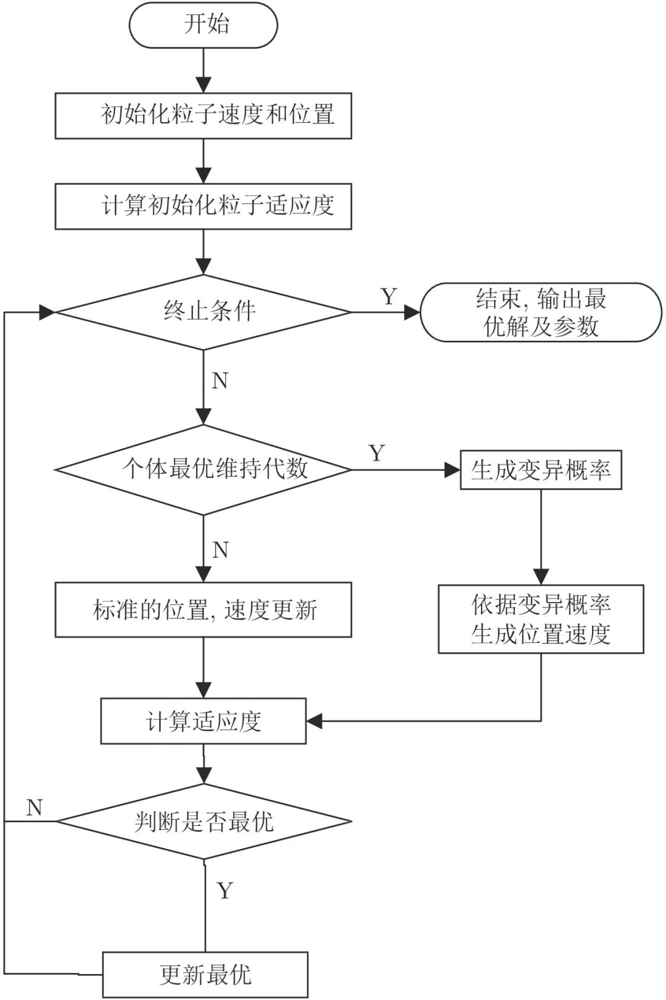
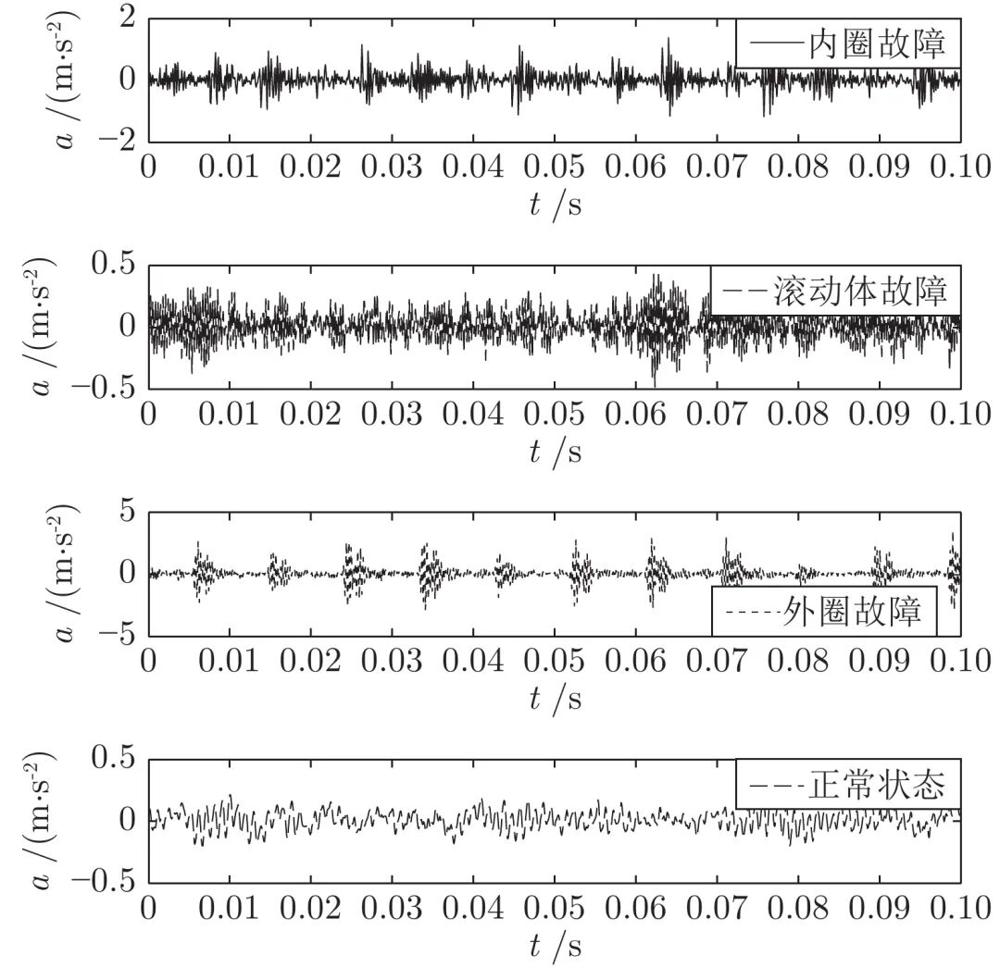
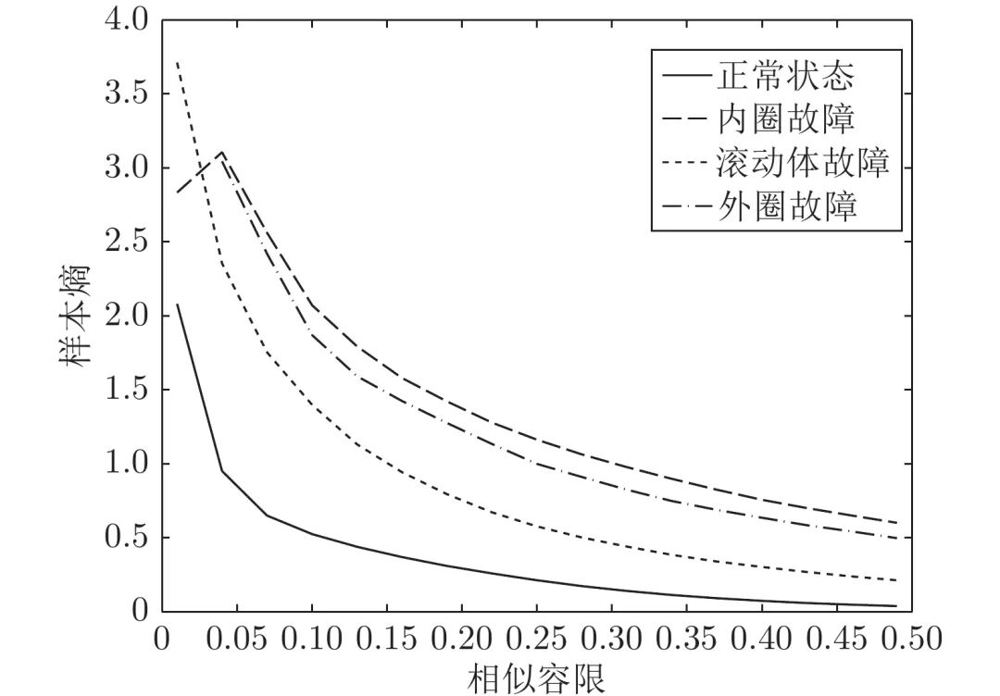

# 基于参数优化VMD和样本熵的滚动轴承故障诊断

原创 自动化学报 自动化学报 2022-03-04 17:01 北京

> 原文地址: [https://mp.weixin.qq.com/s/cUO0R4WD7zNvl3XflEqotw](https://mp.weixin.qq.com/s/cUO0R4WD7zNvl3XflEqotw)

**点击蓝字 关注我们**

  

**引****用本文**

  

刘建昌, 权贺, 于霞, 何侃, 李镇华. 基于参数优化VMD和样本熵的滚动轴承故障诊断. 自动化学报, 2022, 48(3): 808−819 doi: 10.16383/j.aas.c190345

Liu Jian-Chang, Quan He, Yu Xia, He Kan, Li Zhen-Hua. Rolling bearing fault diagnosis based on parameter optimization VMD and sample entropy. Acta Automatica Sinica, 2022, 48(3): 808−819 doi: 10.16383/j.aas.c190345    

http://www.aas.net.cn/cn/article/doi/10.16383/j.aas.c190345?viewType=HTML

  

**文章简介**

  

**关键词**

  

变分模态分解, 参数优化, 遗传变异粒子群, 样本熵, 故障诊断

  

**摘   要**

  

针对滚动轴承故障特征提取不丰富而导致的诊断识别率低的情况, 提出了基于参数优化变分模态分解(Variational mode decomposition, VMD)和样本熵的特征提取方法, 采用支持向量机(Support vector machine, SVM)进行故障识别. VMD方法的分解效果受限于分解个数和惩罚因子的选取, 本文分析了这两个影响参数选取的不规律性, 采用遗传变异粒子群算法进行参数优化, 利用参数优化的VMD方法处理故障信号. 样本熵在衡量滚动轴承振动信号的复杂度时, 得到的熵值并不总是和信号的复杂度相关, 故结合滚动轴承的故障机理, 提出基于滚动轴承故障机理的样本熵, 此样本熵衡量振动信号的复杂度与机理分析的结果一致. 仿真实验表明, 利用本文提出的特征提取方法, 滚动轴承的故障诊断准确率有明显的提高.

  

**引   言**

  

滚动轴承是旋转机械设备的关键零件, 及时、正确地诊断滚动轴承的状态对整个设备来说至关重要. 滚动轴承故障诊断的流程分为3部分: 信号处理、特征提取和诊断识别. 由于设备运行环境噪声的干扰, 通过传感器获得的信号包含大量冗余信号, 这就需要借助信号处理技术去除嘈杂的冗余信号, 提取出故障特征. 故信号处理和特征提取部分是整个诊断流程的关键.

  

Liu 等利用经验模态分解 (Empirical mode decomposition, EMD) 和相应的 Hilbert 谱进行齿轮箱故障诊断, 与连续小波变换相比诊断正确率有明显提升; 程军圣等提出了一种基于内禀模态 (Intrinsic mode function, IMF) 奇异值分解和支持向量机 (Support vector machine, SVM) 的故障诊断方法, 采用 EMD 方法对振动信号进行分解, 得到若干个内禀模态分量形成特征向量矩阵, 对该矩阵进行奇异值分解, 提取其奇异值作为故障特征向量, 并根据 SVM 分类器的输出结果来判断故障类型. 针对 EMD 方法存在过包络、欠包络、模态混淆和端点效应等问题, Smith 于 2005 年提出了一种新的自适应信号分解方法 —— 局部均值分解 (Local mean decomposition, LMD) 方法. Li 等研究了 LMD 方法, 并在电机轴承故障诊断中进行了试验. LMD 方法避免了过包络问题, 减小了模态混淆和端点效应, 但是与 EMD 一样, 两者都属于递归模式分解, 误差会在分解过程逐渐积累, 后续很多学者都在其基础上作了改进, 但无法从根本上解决模态混淆和端点效应问题. Dragomiretskiy 等\[8\]于 2014 年提出一种新型的可变尺度的处理方法 —— 变分模态分解 (Variational mode decomposition, VMD) 方法. 与 EMD 和 LMD 方法的递归模式不同, 作为新型的自适应信号处理方法, VMD 方法引入变分模型, 将信号的分解转换为约束模型最优解的寻优问题, 可以避免端点效应、抑制模态混淆, 并且具有很高的分解效率.

  

样本熵是 Richman 等于 2000 年提出的一种度量时间序列复杂度的方法, 与近似熵物理意义类似, 都是衡量当维数变化时时间序列所产生的新模式概率的大小. 评判原则为: 时间序列越复杂, 产生新模式的概率就越大, 对应的熵值也越大; 相反, 若时间序列自我相似性越高, 则样本熵值越小. 由于啮合尺度的变化, 滚动轴承在发生故障时振动状态会发生变化, 即产生新的调幅−调频信号, 故可以借助样本熵计算该状态下滚动轴承的信号复杂度, 赵志宏等也将样本熵运用在机械故障诊断上, 取得了较好的效果; Marwaha 等借助样本熵量化心脏变异性时间序列的复杂度时, 发现样本熵的评判结果与实际不符, 并根据心脏跳动序列特点提出改进的样本熵, 改 进后的样本熵评判结果较为合理. 此外, 谱峭度指标、能量熵和稀疏残差距离等作为故障特征在故障诊断中应用也较为广泛.

  

在信号处理和构建特征向量的基础上, 合适的选择诊断方法也尤为重要. 人工神经网络具有很强的自组织、自学习能力, 在滚动轴承的故障诊断中应用较多. 但构建合适的神经网络模型需要大量的故障样本数据, 这也限制了人工神经网络在滚动轴承故障诊断领域的发展. SVM 是 Vapnik 在统计学习理论基础上提出的一种通用学习方法. 作为经典的分类算法, SVM 在解决小样本和非线性问题中有独特的优势, 已经广泛应用于故障诊断和模式识别等众多领域.在非线性问题上, SVM 引入惩罚参数和核函数将其转化为高维空间的线性问题, 进而实现有效分类, 但选择不同的惩罚参数和核函数, SVM 的分类精度也相差较大, 目前较多学者采用智能优化算法进行多核支持向量机研究. Tipping 于 2001 年提出的相关向量机 (Relevance vector machine, RVM) 是基于贝叶斯框架的机器学习算法. 较 SVM 而言, 具有参数设置更为简单、稀疏度更高、基函数不受 Mercer 条件限制等优点, 高明哲等也在 RVM 的基础上提出基于多核多分类相关向量机 (Multi-kernel learning multi-class relevance vector machine, MKL-mRVM) 的模拟电路故障诊断方法. Breiman 于 2001 年提出随机森林算法 (Random forest, RF), 该算法是基于决策树的一种组合分类器. RF 通过 Bootsrap 重抽样方法抽取样本, 对每个样本进行决策树建模, 最终通过多棵决策树的预测, 并采用投票机制得到预测结果, 弥补了 SVM 处理大样本数据时能力不足的缺点, 目前在生物、故障诊断和临床医学等领域广泛应用. Waljee 等使用逻辑回归和 RF 建立预测模型, 该模型大大提高了预测炎症性肠病 (Inflammatory bowel disease, IBD) 相关住院和使用门诊类固醇的能力, 可用于区分高风险和低风险疾病发作的患者, 实现个性化治疗. 同样在 IBD 疾病领域, Waljee 等借助 RF 建立预测模型, 实现在临床护理中识别使用硫嘌呤的 IBD 患者, 可以预测客观缓解率. 张西宁等利用多维缩放法对滚动轴承的故障特征集进行降维, 采用随机森林对降维后的故障特征进行诊断识别, 较使用原始特征集的随机森林平均准确率有明显提高. 本文以滚动轴承为背景, 样本数据较小, 故选择经典的 SVM 分类器作为诊断方法.

  

针对滚动轴承故障特征提取不丰富而导致诊断识别率低的情况, 本文提出基于参数优化 VMD 和样本熵的特征提取方法, 参数优化的 VMD 方法分解原始振动信号得到本征模态分量 (Intrinsic mode function, IMF), 提取各 IMF 分量的样本熵可以反映振动信号丰富的故障特征, 并采用 SVM 进行故障识别. VMD 方法的分解效果受限于惩罚因子和分解个数的选择, 本文分析了这两个影响参数选取的不规律性, 采用遗传变异粒子群算法进行参数优化, 利用参数优化的 VMD 方法分解振动信号. 样本熵在衡量滚动轴承振动信号的复杂度时具有一定的局限性, 即熵值的大小并不总是与信号的复杂度相关. 本文分析了滚动轴承的故障机理, 提出基于滚动轴承故障机理的样本熵算法, 此样本熵算法衡量振动信号的复杂度与机理分析的结果一致. 仿真实验表明, 基于参数优化 VMD 和样本熵的特征提取方法可以提高滚动轴承故障诊断的准确率.

  

本文结构安排如下: 第 1 节介绍 VMD 方法的分解原理, 分析参数设置对其分解效果的影响; 第 2 节采用遗传变异粒子群算法进行参数优化, 获取最优参数组合; 第 3 节分析样本熵在衡量滚动轴承振动信号复杂度时的局限性, 提出基于滚动轴承故障机理的样本熵算法; 第 4 节阐述基于参数优化 VMD 和样本熵的滚动轴承故障诊断步骤, 并在第 5 节进行仿真实验; 第 6 节对全文进行总结.

  

图 4  基于遗传变异粒子群算法的参数优化流程

  

图 5  4种状态的振动信号

  

图 6  样本熵的变化曲线

  

请点击左下角“**阅读原文**”了解更多！

  

**作者简介**

**刘建昌**

东北大学信息科学与工程学院教授. 主要研究方向为控制理论与控制工程, 故障诊断. 

E-mail: liujianchang@ise.neu.edu.cn

**权   贺**

东北大学信息科学与工程学院硕士研究生. 2017年获得哈尔滨理工大学自动化学院学士学位. 主要研究方向为电机的故障诊断. 本文通信作者.

E-mail: quanhee@163.com

**于   霞**

东北大学信息科学与工程学院讲师. 主要研究方向为复杂系统建模与控制, 传感器故障监测与诊断.

E-mail: yuxia@ise.neu.edu.cn

**何   侃**

华为技术有限公司软件开发工程师. 2019年获得东北大学硕士学位. 主要研究方向为电机的故障诊断.

E-mail: hekan940112@gmail.com

**李镇华**

东北大学信息科学与工程学院硕士研究生. 2017年获得哈尔滨理工大学自动化学院学士学位. 主要研究方向为切换系统的控制设计, 时滞系统.

E-mail: lizhenhuagd@163.com

  

**相关文章**

**（请向上滑动阅读）**

  

\[1\]  王闯, 韩非, 申雨轩, 李学贵, 董宏丽. 基于事件触发的全信息粒子群优化器及其应用. 自动化学报. doi: 10.16383/j.aas.c200621

http://www.aas.net.cn/cn/article/doi/10.16383/j.aas.c200621?viewType=HTML

  

\[2\]  刘继, 张小平, 张瑞瑞. 基于FTC的BBMC调速控制策略及参数优化. 自动化学报, 2020, 46(2): 332-341. doi: 10.16383/j.aas.c180767

http://www.aas.net.cn/cn/article/doi/10.16383/j.aas.c180767?viewType=HTML

  

\[3\]  郭小萍, 刘诗洋, 李元. 基于稀疏残差距离的多工况过程故障检测方法研究. 自动化学报, 2019, 45(3): 618-625. doi: 10.16383/j.aas.c170389

http://www.aas.net.cn/cn/article/doi/10.16383/j.aas.c170389?viewType=HTML

  

\[4\]  高明哲, 许爱强, 唐小峰. 基于多核多分类相关向量机的模拟电路故障诊断方法. 自动化学报, 2019, 45(02): 203-213. doi: 10.16383/j.aas.2017.c160779

http://www.aas.net.cn/cn/article/doi/10.16383/j.aas.2017.c160779?viewType=HTML

  

\[5\]  周东华, 史建涛, 何潇. 动态系统间歇故障诊断技术综述. 自动化学报, 2014, 40(2): 161-171. doi: 10.3724/SP.J.1004.2014.00161

http://www.aas.net.cn/cn/article/doi/10.3724/SP.J.1004.2014.00161?viewType=HTML

  

\[6\]  周东华, 刘洋, 何潇. 闭环系统故障诊断技术综述. 自动化学报, 2013, 39(11): 1933-1943. doi: 10.3724/SP.J.1004.2013.01933

http://www.aas.net.cn/cn/article/doi/10.3724/SP.J.1004.2013.01933?viewType=HTML

  

\[7\]  文成林, 胡玉成. 基于信息增量矩阵的故障诊断方法. 自动化学报, 2012, 38(5): 832-840. doi: 10.3724/SP.J.1004.2012.00832

http://www.aas.net.cn/cn/article/doi/10.3724/SP.J.1004.2012.00832?viewType=HTML

  

\[8\]  康琦, 汪镭, 安静, 吴启迪. 基于近似动态规划的微粒群系统参数优化研究. 自动化学报, 2010, 36(8): 1171-1181. doi: 10.3724/SP.J.1004.2010.01171

http://www.aas.net.cn/cn/article/doi/10.3724/SP.J.1004.2010.01171?viewType=HTML

  

\[9\]  易辉, 宋晓峰, 姜斌, 王定成. 基于结点优化的决策导向无环图支持向量机及其在故障诊断中的应用. 自动化学报, 2010, 36(3): 427-432. doi: 10.3724/SP.J.1004.2010.00427

http://www.aas.net.cn/cn/article/doi/10.3724/SP.J.1004.2010.00427?viewType=HTML

  

\[10\]  周东华, 胡艳艳. 动态系统的故障诊断技术. 自动化学报, 2009, 35(6): 748-758. doi: 10.3724/SP.J.1004.2009.00748

http://www.aas.net.cn/cn/article/doi/10.3724/SP.J.1004.2009.00748?viewType=HTML

  

\[11\]  甄子洋, 王道波, 王志胜. 基于蚁群优化算法的精密伺服转台故障诊断方法. 自动化学报, 2009, 35(6): 780-784. doi: 10.3724/SP.J.1004.2009.00780

http://www.aas.net.cn/cn/article/doi/10.3724/SP.J.1004.2009.00780?viewType=HTML

  

\[12\]  段琢华, 蔡自兴, 于金霞. 不完备多模型混合系统故障诊断的粒子滤波算法. 自动化学报, 2008, 34(5): 581-587. doi: 10.3724/SP.J.1004.2008.00581

http://www.aas.net.cn/cn/article/doi/10.3724/SP.J.1004.2008.00581?viewType=HTML

  

\[13\]  程军圣, 于德介, 杨宇. 基于内禀模态奇异值分解和支持向量机的故障诊断方法. 自动化学报, 2006, 32(3): 475-480.

http://www.aas.net.cn/cn/article/id/15840?viewType=HTML

  

\[14\]  萧德云, 莫以为. 基于混合系统状态估计的故障诊断. 自动化学报, 2004, 30(6): 980-985.

http://www.aas.net.cn/cn/article/id/16281?viewType=HTML

  

\[15\]  吕琛, 王桂增, 邱庆刚. 基于声信号小波包分析的故障诊断. 自动化学报, 2004, 30(4): 554-559.

http://www.aas.net.cn/cn/article/id/16284?viewType=HTML

  

\[16\]  刘开第, 曹庆奎, 庞彦军. 基于未确知集合的故障诊断方法. 自动化学报, 2004, 30(5): 747-756.

http://www.aas.net.cn/cn/article/id/16246?viewType=HTML

  

\[17\]  陈玉东, 翁正新, 施颂椒. 基于LMI的非线性差分-代数系统的鲁棒故障诊断. 自动化学报, 2004, 30(1): 57-63.

http://www.aas.net.cn/cn/article/id/16347?viewType=HTML

  

\[18\]  宋华, 张洪钺. 模糊非线性奇偶方程故障诊断方法. 自动化学报, 2003, 29(6): 965-970.

http://www.aas.net.cn/cn/article/id/16497?viewType=HTML

  

\[19\]  莫以为, 萧德云. 基于粒子滤波算法的混合系统监测与诊断. 自动化学报, 2003, 29(5): 641-648.

http://www.aas.net.cn/cn/article/id/13893?viewType=HTML

  

\[20\]  马智明, 阳宪惠. 采用主元分析的过程故障诊断方法. 自动化学报, 2000, 26(增刊B): 125-129.

http://www.aas.net.cn/cn/article/id/16497?viewType=HTML

  

\[21\]   陈金水, 孙优贤. 系统存在参数摄动时基于二次规划的一种故障诊断算法. 自动化学报, 1997, 23(1): 77-80.

http://www.aas.net.cn/cn/article/id/17084?viewType=HTML

  

\[22\]  周东华, 孙优贤, 席裕庚, 张钟俊. 一类非线性系统参数偏差型故障的实时检测与诊断. 自动化学报, 1993, 19(2): 184-189.

http://www.aas.net.cn/cn/article/id/14266?viewType=HTML

  

**近期文章**

[人生跑马灯？人类首次同步测量大脑濒死状态](http://mp.weixin.qq.com/s?__biz=MzAwMzAzMDgxOA==&mid=2651074149&idx=2&sn=60d48feaa01d160092c19a91e1314db7&chksm=8131e428b6466d3e1e8f835c506ae7faf61e8b66d94fc1dd027a089e075f82078ce5422a0a13&scene=21#wechat_redirect)

[自动化学报（英文版）和自动化学报入选计算领域高质量科技期刊T1类](http://mp.weixin.qq.com/s?__biz=MzAwMzAzMDgxOA==&mid=2651073859&idx=2&sn=7a9192717637dcf6cddb39ed961e8c3b&chksm=8131e70eb6466e188a123c504bdeba80c75681de4762f8685b3bf584bc33eb12362c70613b4e&scene=21#wechat_redirect)

[AI黑科技：马赛克加密被破解了！](http://mp.weixin.qq.com/s?__biz=MzAwMzAzMDgxOA==&mid=2651073824&idx=2&sn=0c15fef01cd893210bef1cceece5d49d&chksm=8131e76db6466e7b1c78884be8517733101cbe37b5a2fd95f4d4df6b569956c0dc5598435eb4&scene=21#wechat_redirect)

[Nature：当AI学会控制核聚变反应堆](http://mp.weixin.qq.com/s?__biz=MzAwMzAzMDgxOA==&mid=2651073629&idx=2&sn=b298f9f715cc9a6a38a54f36aea98171&chksm=8131e610b6466f06072ffe4dcfb213dde209f893bd3071cd4cbca8ba9a6484334028a3aae92a&scene=21#wechat_redirect)

[《自动化学报》编辑部防诈骗公告](http://mp.weixin.qq.com/s?__biz=MzAwMzAzMDgxOA==&mid=2651073517&idx=1&sn=c52de7c685e546af9faffc0cefab1c85&chksm=8131e1a0b64668b63ebaa68ea81cbaec3b94dc52ea8360821a0a49e67ae7e4b428a25d0f19c5&scene=21#wechat_redirect)

[中国科学院自动化研究所“海外优青”项目招聘启事](http://mp.weixin.qq.com/s?__biz=MzAwMzAzMDgxOA==&mid=2651073629&idx=3&sn=704a900c277b3224dfa9745d2ccc8c24&chksm=8131e610b6466f06329a900636c1bf894d6a890b89d114bbd9faf5f9a8132a73a228e7c3aeac&scene=21#wechat_redirect)

[“诺奖风向标”斯隆奖2022名单出炉！27位华人学者入选](http://mp.weixin.qq.com/s?__biz=MzAwMzAzMDgxOA==&mid=2651073517&idx=2&sn=5ed3a30328a9f41bd43999c1592469b8&chksm=8131e1a0b64668b687601773f8d9d6960344a59a62e83dede480b768fad7375bc5329cfcebdc&scene=21#wechat_redirect)

[Nature封面：人类又输给了AI，赛车AI击败人类顶级车手！](http://mp.weixin.qq.com/s?__biz=MzAwMzAzMDgxOA==&mid=2651073362&idx=2&sn=e9a5d620fd2afa6af2c13d9c695e54a7&chksm=8131e11fb64668099fa52873d8df2f3a91c3244972da7d10cbf7c234c8b95b70954e1f2affab&scene=21#wechat_redirect)

  

**热点文章**

[《自动化学报》2019年高关注论文](http://mp.weixin.qq.com/s?__biz=MzAwMzAzMDgxOA==&mid=2651073450&idx=1&sn=6f57bd0df73f259aa416575f1f69bdfb&chksm=8131e1e7b64668f1344de4acdef6148e8dcfa60c80e4f48e6cb1270558c2beade5601e92d05c&scene=21#wechat_redirect)

[《自动化学报》2021年热点文章回顾](http://mp.weixin.qq.com/s?__biz=MzAwMzAzMDgxOA==&mid=2651072577&idx=1&sn=4e6be077d7371c7d29d9a371d8defe19&chksm=8131e20cb6466b1aec2f3b8b1063d3be11725ca9a0c15785c3b42a638170e732acd0d8d345e0&scene=21#wechat_redirect)

[国家自然科学基金论文精选](http://mp.weixin.qq.com/s?__biz=MzI2NjA3MzM5MA==&mid=2649960308&idx=1&sn=1634c999f22588333537f13393403f9c&chksm=f2942b35c5e3a2232e86b51c2b7c8f37a4d3d7f858d370d76d5afd00567d7da6e9543476d120&scene=21#wechat_redirect)  

[国家重点研发计划论文精选](http://mp.weixin.qq.com/s?__biz=MzI2NjA3MzM5MA==&mid=2649960255&idx=1&sn=f48435928fd924134cb72014860b9d00&chksm=f2942b7ec5e3a26869da68a1419b3b40ca1e6cb98abf2e380d78a49ffb99c85991d76cc346b0&scene=21#wechat_redirect)

[中国科学院自动化研究所高层次人才招聘启事 | 长期有效](http://mp.weixin.qq.com/s?__biz=MzI2NjA3MzM5MA==&mid=2649959451&idx=1&sn=657b7e4aeeaa88114d5189641c5409dc&chksm=f294285ac5e3a14cd230a2b9678c32ba9bf92e8ffc9d61d506c5ffea2df793456dd37c2c6fb1&scene=21#wechat_redirect)

  

**期刊动态**

[自动化学报（英文版）和自动化学报入选计算领域高质量科技期刊T1类](http://mp.weixin.qq.com/s?__biz=MzAwMzAzMDgxOA==&mid=2651073859&idx=2&sn=7a9192717637dcf6cddb39ed961e8c3b&chksm=8131e70eb6466e188a123c504bdeba80c75681de4762f8685b3bf584bc33eb12362c70613b4e&scene=21#wechat_redirect)

[《自动化学报》编辑部防诈骗公告](http://mp.weixin.qq.com/s?__biz=MzAwMzAzMDgxOA==&mid=2651073517&idx=1&sn=c52de7c685e546af9faffc0cefab1c85&chksm=8131e1a0b64668b63ebaa68ea81cbaec3b94dc52ea8360821a0a49e67ae7e4b428a25d0f19c5&scene=21#wechat_redirect)

[《自动化学报》致谢审稿人](http://mp.weixin.qq.com/s?__biz=MzI2NjA3MzM5MA==&mid=2649961201&idx=1&sn=3142842d75c441ae860c1ecb313c7657&chksm=f29436b0c5e3bfa6c679210f60513eb1a7205dc20fe028f482bb593eac60427e4e56fba12493&scene=21#wechat_redirect)

[自动化学报多篇论文入选中国百篇最具影响国内论文和中国精品期刊顶尖论文](http://mp.weixin.qq.com/s?__biz=MzI2NjA3MzM5MA==&mid=2649961152&idx=1&sn=4a5e9e4b84879f4cde4e13a0ef97272c&chksm=f2943681c5e3bf97d7770c9623dac869b283b3ea83f3d320017974033e361d8b999134a8bdff&scene=21#wechat_redirect)

[自动化学报各项主要指标蝉联第1，再获百种中国杰出期刊称号](http://mp.weixin.qq.com/s?__biz=MzI2NjA3MzM5MA==&mid=2649960903&idx=1&sn=7da8b8a0167e16bcbaa1f00fbfb69782&chksm=f2943586c5e3bc9014f6d4fff7147b998ae42b4da452907e641e8029f296fd2413b4f17aef62&scene=21#wechat_redirect)

[《自动化学报》发表文章入选第六届中国科协优秀科技论文](http://mp.weixin.qq.com/s?__biz=MzI2NjA3MzM5MA==&mid=2649960313&idx=1&sn=01b5a9defe9664ba4a0b8d7322e115d0&chksm=f2942b38c5e3a22e2c57edaa8667a27368ccfb595e6a372dfa85ff2a61329788870d77957a2f&scene=21#wechat_redirect)

[自动化学报（英文版）首届青年编委招募](http://mp.weixin.qq.com/s?__biz=MzI2NjA3MzM5MA==&mid=2649959475&idx=1&sn=e28ce2b8fa27ee4fb6a5c0c17e25dd25&chksm=f2942872c5e3a16438dbf45fd8091b643cd2bf50f0bab7092a6c5103d06cd4a16ebceb4db40a&scene=21#wechat_redirect)

  

**期刊目录**

[2022年第02期](http://mp.weixin.qq.com/s?__biz=MzI2NjA3MzM5MA==&mid=2649961838&idx=1&sn=29334896aa0f372b70312250c75b6b20&chksm=f294312fc5e3b8392ffd49100eaba435bf48fa9234c5019fe7b16ed1e4ebef70be58691f3fb3&scene=21#wechat_redirect)

[2022年第01期](http://mp.weixin.qq.com/s?__biz=MzI2NjA3MzM5MA==&mid=2649961423&idx=1&sn=3b65958faa7c7f94c247f46dd72bd71e&chksm=f294378ec5e3be9825f860d132c36c97f3e877089449cb1fe85a6d1e7da9bd0e24795336bc54&scene=21#wechat_redirect)

[《自动化学报》2021年全年合集](http://mp.weixin.qq.com/s?__biz=MzAwMzAzMDgxOA==&mid=2651072770&idx=1&sn=7c531f7fa3bc390558fab15b339ce86e&chksm=8131e34fb6466a59ed079448fddda0fc9f97066460bff8f6835288003a1fba2812de383813c1&scene=21#wechat_redirect)

[《自动化学报》2020年全年合集](http://mp.weixin.qq.com/s?__biz=MzI2NjA3MzM5MA==&mid=2649957972&idx=1&sn=1951847aacbcb7d22bdd2a46a79af871&chksm=f2942215c5e3ab03d070d8e52b8764b38036897c97b6a26c7a1f918c806b28edbe6c0fbf7ea9&scene=21#wechat_redirect)

[2020年第10期 工业人工智能专题](http://mp.weixin.qq.com/s?__biz=MzI2NjA3MzM5MA==&mid=2649957201&idx=1&sn=ab82a767bd716ab67fdf2942500d8b61&chksm=f2942710c5e3ae06b27f9e63a5e329a1123d90b051164e6b6123c500230541b1ed12d92abbfb&scene=21#wechat_redirect)

[2020年第09期 分布式信息能源系统理论与应用专题](http://mp.weixin.qq.com/s?__biz=MzI2NjA3MzM5MA==&mid=2649956412&idx=1&sn=8ebc13d63fd333ad85dbb8b5825df248&chksm=f294247dc5e3ad6ba297857a5b957e97cf499266c50318791fa8abd9432ecf1d9c3d9b287e36&scene=21#wechat_redirect)

  

  

  

**长按二维码｜关注我们**

**IEEE/CAA Journal of Automatica Sinica (JAS)**

**长按二维码｜关注我们**

**《自动化学报》服务号**

**长按二维码｜关注我们**

**《自动化学报》订阅号**  

  

**联系我们**

**网站:** 

http://www.aas.net.cn

http://www.ieee-jas.net

**投稿:** 

https://mc03.manuscriptcentral.com/aas-cn   

https://mc03.manuscriptcentral.com/ieee-jas 

**电话:**  

010-82544653（日常咨询和稿件处理） 

010-82544677（录用后稿件处理）

**邮箱:**  

aas@ia.ac.cn（日常咨询和稿件处理）  

aas\_editor@ia.ac.cn（录用后稿件处理）

**博客:** 

http://blog.sina.com.cn/aaseditor 

  

**↓ 点击下方 阅读原文 了解更多**