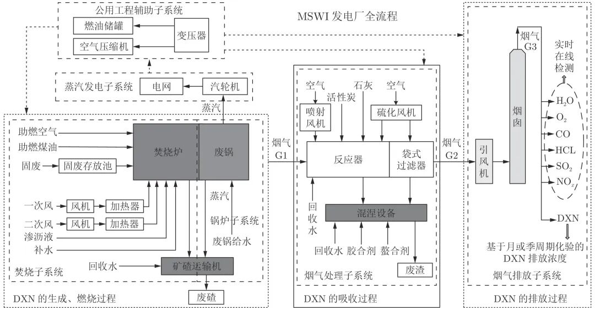
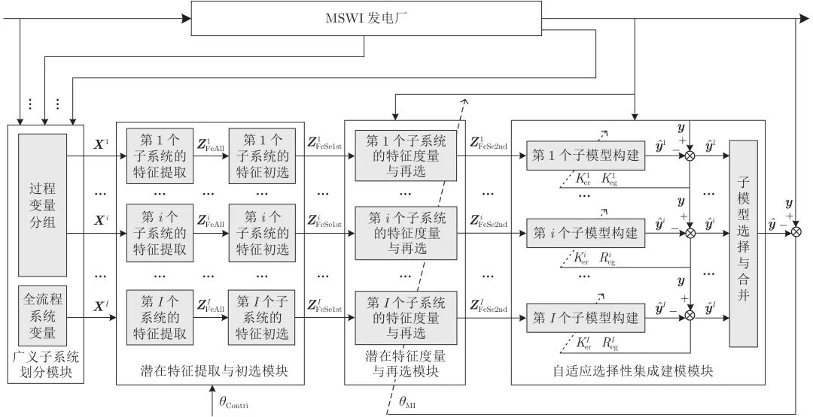

# 基于潜在特征选择性集成建模的二噁英排放浓度软测量

原创 自动化学报 自动化学报 2022-04-21 17:16 北京

> 原文地址: [https://mp.weixin.qq.com/s/s1g\_cdKwUn3vTahWBSi59A](https://mp.weixin.qq.com/s/s1g_cdKwUn3vTahWBSi59A)

**点击蓝字|关注我们**

  

  

**引用本文**

  

汤健, 乔俊飞, 郭子豪. 基于潜在特征选择性集成建模的二噁英排放浓度软测量. 自动化学报, 2022, 48(1): 223−238 doi: 10.16383/j.aas.c190254

Tang Jian, Qiao Jun-Fei, Guo Zi-Hao. Dioxin emission concentration soft measurement based on multi-source latent feature selective ensemble modeling for municipal solid waste incineration process. Acta Automatica Sinica, 2022, 48(1): 223−238 doi: 10.16383/j.aas.c190254

http://www.aas.net.cn/cn/article/doi/10.16383/j.aas.c190254?viewType=HTML

  

**文章简介**

  

**关键词**

  

城市固废焚烧, 二噁英, 多源潜在特征, 最小二乘−支持向量机, 选择性集成建模

  

**摘   要**

  

二噁英(Dioxin，DXN)是导致城市固废焚烧(Municipal solid waste incineration, MSWI)建厂存在“邻避现象”的主要原因之一. 工业现场多采用离线化验手段检测DXN浓度, 难以满足污染物减排控制的需求. 针对上述问题, 本文提出了基于潜在特征选择性集成(Selective ensemble, SEN)建模的DXN排放浓度软测量方法. 首先, 采用主元分析(Principal component analysis, PCA)分别提取依据工艺阶段子系统及全流程系统过程变量的潜在特征, 并依据预设贡献率阈值进行特征初选; 接着, 采用互信息(Mutual information, MI)度量初选特征与DXN间的相关性, 并自适应确定再选的上下限及阈值; 最后, 采用具有超参数自适应选择机制的最小二乘−支持向量机(Least squares — support vector machine, LS-SVM)算法建立多源特征的候选子模型, 基于分支定界(Branch and bound, BB)优化和预测误差信息熵加权算法进行集成子模型的优化选择和加权组合, 进而得到软测量模型. 基于某MSWI焚烧厂DXN检测数据仿真验证了所提方法的有效性.

  

**引   言**

  

如何基于运行优化控制策略降低复杂工业过程的能源消耗和污染排放, 是国内外流程工业企业所面临的急需解决难题. 焚烧是进行城市固废(Municipal solid waste, MSW)处理的主要技术手段. 对于发展中国家的MSW焚烧(MSW incineration, MSWI)企业, 最为紧迫的问题是如何降低焚烧造成的污染排放, 其中急需在线监视和优化控制的是造成焚烧建厂“邻避现象(Not in my backyard, NIMBY)” (指居民或单位因担心垃圾场、核电厂、殡仪馆类的建设项目对身体健康、环境质量和资产价值等带来负面影响而激发的嫌恶情结, 滋生“不要建在我家后院”的心理, 并采取强烈、坚决, 甚至高度情绪化的集体反对和抗争行为)主要原因之一的剧毒物质二噁英(Dioxin, DXN)的排放浓度. MSWI企业当前主要关注如何基于优化的运行参数实现DXN排放的最小化. 目前, 除配套先进的尾气处理装置外, 普遍采用“3T1E”准则间接控制DXN排放, 即: 焚烧炉内高于850 ℃的温度(Temperature, T)、超过2 秒(Time, T)的烟气停留时间、较大的湍流程度(Turbulence, T)和合适的过量空气系数(Excess oxygen, E). 当前MSWI企业难以进行以降低DXN排放为直接目标的运行优化和反馈控制, 其主要原因是: 1) DXN排放浓度的机理模型难以构建; 2) 以月或季为周期的离线直接检测焚烧尾气方式不能提供实时反馈的DXN排放浓度值. 近年来的研究热点是基于指示物/关联物对DXN排放进行在线间接检测, 但这些方法固有的设备复杂、造价昂贵、检测滞后等原因导致其难以用于MSWI过程的运行优化和反馈控制.

  

数据驱动软测量技术可用于需要离线化验的难以检测参数(如本文中的二噁英)的在线估计. MSWI过程包括固废焚烧、蒸汽发电、烟气处理及尾气排放等多个阶段, 其所包含的数百维过程变量间具有较大的冗余性与互补性; 显然, 这些不同阶段与DXN的产生、燃烧、吸收、再合成等过程相关, 有必要结合工艺过程划分为不同阶段子系统以便于能够量化表征对DXN排放浓度软测量的贡献度, 同时能够保留全部过程变量, 进而避免有用过程变量的缺失. 因此, 依据MSWI过程的特点, 可将DXN排放浓度软测量归结为一类面向小样本高维数据的建模问题. 文献\[18\]指出, 模型输入维数和低价值训练样本的增加使得获取完备训练样本的难度增大. 文献\[19\]定义了维数约简后的建模样本与约简特征之比, 指出该值应满足构建鲁棒学习模型的需求. 因此, 针对MSWI过程具有小样本高维特性的DXN排放建模数据进行维数约简是必要的.

  

目前较为常用的方法是基于机理或经验通过特征选择实现维数约简. 以依据经验选择的部分过程变量为输入, 文献\[20-21\]通过采用多年前欧美研究机构所收集的少量样本, 基于线性回归、人工神经网络(Artificial neural network, ANN)等算法构建DXN排放浓度软测量模型. 近年来, 我国台湾地区针对实际焚烧过程, 首先初选部分过程变量, 再结合相关性分析和主元分析(Principal component analysis, PCA)进行特征选择, 最后基于BP神经网络(Back propagation neural network, BPNN)进行DXN排放浓度建模; 但BPNN具有易陷入局部最小、易过拟合和面向小样本数据建模泛化性能差等缺点. 理论上, 基于结构风险最小化准则的支持向量机(Support vector machine, SVM)算法能够有效建模小样本数据, 但其需求解二次规划(Quadratic programming, QP)问题且超参数难以自适应选择. 最小二乘−支持向量机(Least squares SVM, LS-SVM)通过求解线性等式克服QP问题, 其超参数可通过优化算法得到, 但耗时且只能得到次优解. 上述方法均以部分过程变量为输入构建传统单模型, 其泛化性有待于提高, 并且难以表征MSWI不同工艺阶段对DXN模型的贡献率. 此外, 上述研究也缺少对LS-SVM超参数的自适应选择机制.

  

针对工业过程机理复杂性难以有效地进行特征选择以及变量间具有的强共线性, 能够提取高维数据蕴含变化的主元分析(PCA)是工业过程难以检测参数软测量中较为常用的潜在特征提取方法, 但贡献率低的主元建模会降低预测稳定性. 此外, 基于上述非监督方法所提取的蕴含原始过程变量主要变化的潜在特征与难测参数间的相关性却可能较弱. 因此, 有必要对贡献率满足要求的潜在变量进行再次选择.

  

此外, 针对MSWI过程的不同阶段子系统和全流程系统所提取的潜在特征可视为表征不同局部和全局特性的多源信息. 理论和经验分析表明, 面向多源信息采用选择性集成(Selective ensemble, SEN)机制构建的软测量模型具有更佳的稳定性和鲁棒性. 文献\[31\]综述了集成子模型多样性的构造策略, 指出训练样本重采样包括划分训练样本(样本空间)、划分或变换特征变量(特征空间)等, 基于特征空间的集成构造策略在模型预测性能上较优. 针对小样本多源高维谱数据, Tang等提出基于选择性融合多源特征和多工况样本的SEN潜结构映射模型. 文献\[32-33\]提出了基于随机采样样本空间的SEN神经网络模型和潜结构映射模型. 文献\[34\]提出基于子空间的集成学习通用框架. 文献\[35\]提出了在特征子空间内随机采样样本空间的面向多尺度机械信号的双层SEN潜结构映射模型. 文献\[36\]提出的SEN神经网络模型分别构建候选子模型和选择集成子模型及计算其权重. 但上述方法均未进行模型参数自适应机制的研究. 采用与文献\[20\]相同的建模数据, 文献\[37\]提出了基于候选超参数的SEN建模方法, 但该方法难以描述当前实际MSWI过程的真实特性, 并且难以有效表征DXN生成、燃烧、吸附和排放过程的多阶段特性.

  

综上可知, 依据MSWI过程的多阶段特性对不同阶段子系统进行非监督潜在特征的提取与度量, 构建具有自适应超参数选择和SEN机制的DXN排放浓度软测量模型的研究还未见报道. 因此, 本文所提的基于潜在特征SEN的DXN排放浓度软测量方法的创新点表现在: 

  

1)采用PCA提取依工艺流程划分阶段子系统和MSWI全流程系统的潜在特征, 并依据预设的主元贡献率阈值进行多源潜在特征初选, 保证预测稳定性和避免特征选择不当造成的信息损失; 

  

2)采用互信息(Mutual information, MI)度量初选潜在特征并进行选择以保证再选潜在特征与DXN间的相关性, 自适应确定多源潜在特征再选的上下限及阈值; 

  

3)采用具有超参数自适应选择机制的LS-SVM算法和自适应确定集成子模型尺寸、集成子模型及其加权系数的SEN机制构建DXN排放浓度软测量模型, 确保具有互补特性的最佳子系统能够选择性融合.

  

图 1  基于DXN视角的MSWI过程描述

  

图 2  基于潜在特征SEN建模的DXN排放浓度软测量策略

  

请点击左下角“**阅读原文**”了解更多！

  

**作者简介**

**汤   健**

北京工业大学教授. 主要研究方向为小样本数据建模, 城市固废处理过程智能控制. 本文通信作者.

E-mail: freeflytang@bjut.edu.cn

**乔俊飞**

北京工业大学信息学部教授. 主要研究方向为污水处理过程智能控制, 神经网络结构设计与优化.

E-mail: junfeq@bjut.edu.cn

**郭子豪**

北京工业大学信息学部硕士研究生. 主要研究方向为高维小样本数据的特征建模, 固废处理过程难测参数软测量.

E-mail: miller94@163.com

  

**相关文章**

**（请向上滑动阅读）**

  

\[1\]  柴天佑. 复杂工业过程运行优化与反馈控制. 自动化学报, 2013, 39(11): 1744-1757. doi: 10.3724/SP.J.1004.2013.01744

http://www.aas.net.cn/cn/article/doi/10.3724/SP.J.1004.2013.01744?viewType=HTML

  

\[2\]  汤健, 乔俊飞, 柴天佑, 刘卓, 吴志伟. 基于虚拟样本生成技术的多组分机械信号建模. 自动化学报, 2018, 44(9): 1569-1589. doi: 10.16383/j.aas.2017.c170204

http://www.aas.net.cn/cn/article/doi/10.16383/j.aas.2017.c170204?viewType=HTML

  

\[3\]  郭海涛, 汤健, 丁海旭, 乔俊飞. 基于混合数据增强的MSWI过程燃烧状态识别. 自动化学报. doi: 10.16383/j.aas.c210843

http://www.aas.net.cn/cn/article/doi/10.16383/j.aas.c210843?viewType=HTML

  

\[4\]  刘卓, 汤健, 柴天佑, 余文. 基于多模态特征子集选择性集成建模的磨机负荷参数预测方法. 自动化学报, 2021, 47(8): 1921-1931. doi: 10.16383/j.aas.c190735

http://www.aas.net.cn/cn/article/doi/10.16383/j.aas.c190735?viewType=HTML

  

\[5\]  孙子健, 汤健, 乔俊飞. 联合样本输出与特征空间的半监督概念漂移检测法及其应用. 自动化学报. doi: 10.16383/j.aas.c200984

http://www.aas.net.cn/cn/article/doi/10.16383/j.aas.c200984?viewType=HTML

  

\[6\]  乔俊飞, 郭子豪, 汤健. 面向城市固废焚烧过程的二噁英排放浓度检测方法综述. 自动化学报, 2020, 46(6): 1063-1089. doi: 10.16383/j.aas.c190005

http://www.aas.net.cn/cn/article/doi/10.16383/j.aas.c190005?viewType=HTML

  

\[7\]  马跃峰, 梁循, 周小平. 一种基于全局代表点的快速最小二乘支持向量机稀疏化算法. 自动化学报, 2017, 43(1): 132-141. doi: 10.16383/j.aas.2017.c150720

http://www.aas.net.cn/cn/article/doi/10.16383/j.aas.2017.c150720?viewType=HTML

  

\[8\]  王琴, 沈远彤. 基于压缩感知的多尺度最小二乘支持向量机. 自动化学报, 2016, 42(4): 631-640. doi: 10.16383/j.aas.2016.c150296

http://www.aas.net.cn/cn/article/doi/10.16383/j.aas.2016.c150296?viewType=HTML

  

\[9\]  汤健, 柴天佑, 丛秋梅, 苑明哲, 赵立杰, 刘卓, 余文. 基于EMD和选择性集成学习算法的磨机负荷参数软测量. 自动化学报, 2014, 40(9): 1853-1866. doi: 10.3724/SP.J.1004.2014.01853

http://www.aas.net.cn/cn/article/doi/10.3724/SP.J.1004.2014.01853?viewType=HTML

  

\[10\]  孙明轩, 毕宏博. 学习辨识:最小二乘算法及其重复一致性. 自动化学报, 2012, 38(5): 698-706. doi: 10.3724/SP.J.1004.2012.00698

http://www.aas.net.cn/cn/article/doi/10.3724/SP.J.1004.2012.00698?viewType=HTML

  

\[11\]  刘峤, 秦志光, 陈伟, 张凤荔. 基于零范数特征选择的支持向量机模型. 自动化学报, 2011, 37(2): 252-256. doi: 10.3724/SP.J.1004.2011.00252

http://www.aas.net.cn/cn/article/doi/10.3724/SP.J.1004.2011.00252?viewType=HTML

  

\[12\]  李妍, 毛志忠, 王琰. 基于偏差补偿递推最小二乘的Hammerstein-Wiener模型辨识. 自动化学报, 2010, 36(1): 163-168. doi: 10.3724/SP.J.1004.2010.00163

http://www.aas.net.cn/cn/article/doi/10.3724/SP.J.1004.2010.00163?viewType=HTML

  

\[13\]  王雪松, 田西兰, 程玉虎, 易建强. 基于协同最小二乘支持向量机的Q学习. 自动化学报, 2009, 35(2): 214-219. doi: 10.3724/SP.J.1004.2009.00214

http://www.aas.net.cn/cn/article/doi/10.3724/SP.J.1004.2009.00214?viewType=HTML

  

\[14\]  张勇, 杨慧中. 有色噪声干扰输出误差系统的偏差补偿递推最小二乘辨识方法. 自动化学报, 2007, 33(10): 1053-1060. doi: 10.1360/aas-007-1053

http://www.aas.net.cn/cn/article/doi/10.1360/aas-007-1053?viewType=HTML

  

\[15\]  颜学峰. 基于径基函数-加权偏最小二乘回归的干点软测量. 自动化学报, 2007, 33(2): 193-196. doi: 10.1360/aas-007-0193

http://www.aas.net.cn/cn/article/doi/10.1360/aas-007-0193?viewType=HTML

  

\[16\]  李丽娟, 苏宏业, 褚健. 基于在线最小二乘支持向量机的广义预测控制. 自动化学报, 2007, 33(11): 1182-1188. doi: 10.1360/aas-007-1182

http://www.aas.net.cn/cn/article/doi/10.1360/aas-007-1182?viewType=HTML

  

\[17\]  赵龙, 陈哲. 新型联邦最小二乘滤波算法及应用. 自动化学报, 2004, 30(6): 897-904.

http://www.aas.net.cn/cn/article/id/16261?viewType=HTML

  

\[18\]  李松涛, 张长水, 荣钢, 边肇祺, Dongming Zhao. 一种基于最小二乘估计的深度图像曲面拟合方法. 自动化学报, 2002, 28(2): 310-313.

http://www.aas.net.cn/cn/article/id/15521?viewType=HTML

  

\[19\]  丁锋, 丁韬, 萧德云, 杨家本. 时变系统有限数据窗最小二乘辨识的有界收敛性. 自动化学报, 2002, 28(5): 754-761.

http://www.aas.net.cn/cn/article/id/15568?viewType=HTML

  

\[20\]  王晓, 韩崇昭, 万百五. 两种新的有效的非线性系统最小二乘辨识算法. 自动化学报, 1998, 24(1): 95-101.

http://www.aas.net.cn/cn/article/id/16914?viewType=HTML

  

\[21\]  罗贵明. 基于最小二乘算法的最优适应控制器. 自动化学报, 1996, 22(1): 79-84.

http://www.aas.net.cn/cn/article/id/17187?viewType=HTML

  

\[22\]  孟晓风, 王行仁, 黄俊钦. 最小二乘估计的HOUSEHOLDER变换快速递推算法. 自动化学报, 1994, 20(1): 20-28.

http://www.aas.net.cn/cn/article/id/14159?viewType=HTML

  

**近期文章**

  

[《自动化学报》2022年第04期目录分享](http://mp.weixin.qq.com/s?__biz=MzAwMzAzMDgxOA==&mid=2651076245&idx=1&sn=8380ebbcbf0ae69c0ad2f7fb428e8303&chksm=8131fcd8b64675cec8932335d68b6f0aa193141095c345d64d2de1dbc28abe1b36a63d742966&scene=21#wechat_redirect)

[【热点专题】目标检测](http://mp.weixin.qq.com/s?__biz=MzI2NjA3MzM5MA==&mid=2649962259&idx=1&sn=97b0c31ec704211713ef8cba4bb51b01&chksm=f2943352c5e3ba44f2c7217cff60405765c6d67312beb6d07006155404bfc4b34268956697f5&scene=21#wechat_redirect)

[基于事件触发的分布式优化算法](http://mp.weixin.qq.com/s?__biz=MzAwMzAzMDgxOA==&mid=2651076142&idx=2&sn=b074793ec4be44ea08efb78617dcdcc0&chksm=8131fc63b6467575b7f6d698909e56be16089f8f56ca415294483ff6f40902c7546417f82531&scene=21#wechat_redirect)

[一种针对德州扑克AI的对手建模与策略集成框架](http://mp.weixin.qq.com/s?__biz=MzAwMzAzMDgxOA==&mid=2651075800&idx=1&sn=9ab9006d50bb2513c49006b1c1431a3c&chksm=8131fe95b6467783eb58de5d7b1726ddcb881561603c76bdcefa44f4a9a9027afc37b1be979c&scene=21#wechat_redirect)

[工业铸件缺陷无损检测技术的应用进展与展望](http://mp.weixin.qq.com/s?__biz=MzAwMzAzMDgxOA==&mid=2651075561&idx=1&sn=afda9a46702ab802788e1c9fc67b5849&chksm=8131f9a4b64670b2c122efca37574a0dceda3582b0477845b80670246b4eb8befce2ae748dc1&scene=21#wechat_redirect)

[《自动化学报》2022年第03期目录分享](http://mp.weixin.qq.com/s?__biz=MzAwMzAzMDgxOA==&mid=2651075527&idx=1&sn=bc020c5fd09080243f7527610b003507&chksm=8131f98ab646709c2f485852b526989a3b9af5cc93e8afb508d9239b78176f49caa9807d6a8d&scene=21#wechat_redirect)

[2022斯坦福AI指数报告出炉！点击获取完整报告](http://mp.weixin.qq.com/s?__biz=MzAwMzAzMDgxOA==&mid=2651075236&idx=3&sn=1caed46e80f613c172a227ead8ddc1a3&chksm=8131f8e9b64671ffa8d6f7c8a36210fe1e262a66a42ab9a544e064d3c725b4a31274a4551750&scene=21#wechat_redirect)

[黄艳龙, 徐德, 谭民. 机器人运动轨迹的模仿学习综述](http://mp.weixin.qq.com/s?__biz=MzAwMzAzMDgxOA==&mid=2651075236&idx=1&sn=ec575c249f6e60709a32a7dfa6b55f37&chksm=8131f8e9b64671ffaf5de201407410a38735b35d7f4e6ab43eb05dac537068fb912ceef808c1&scene=21#wechat_redirect)

  

**热点文章**

  

[CVPR 2022 | 自动化所新作速览！（上）](http://mp.weixin.qq.com/s?__biz=MzAwMzAzMDgxOA==&mid=2651075034&idx=2&sn=48b5232daaa7a51da96c3a7c87013e2d&chksm=8131fb97b6467281dc8e02749df8d0388f89d30e3b08f44d13c700169d1d7a22c4feef9f2dba&scene=21#wechat_redirect)

[CVPR 2022 | 自动化所新作速览！（下）](http://mp.weixin.qq.com/s?__biz=MzAwMzAzMDgxOA==&mid=2651075034&idx=3&sn=21833bb312bb0d9826c64c9fce068aa5&chksm=8131fb97b646728147f2bff58a04230d708d5a4537eb824656c2d54580b11f6a47b0eb30ade6&scene=21#wechat_redirect)

[直播回放分享 | 陈关荣教授：探索最优同步网络的拓扑结构](http://mp.weixin.qq.com/s?__biz=MzIxMjA5Njg2Nw==&mid=2649061608&idx=1&sn=1500a81260d8f5127b7cb7767c759fba&chksm=8f5a9ae4b82d13f201b714d8e96af9bbddf442bb7e10c97416fb925ab2170c05fa12010fb1d1&scene=21#wechat_redirect)

[《自动化学报》2019年高关注论文](http://mp.weixin.qq.com/s?__biz=MzAwMzAzMDgxOA==&mid=2651073450&idx=1&sn=6f57bd0df73f259aa416575f1f69bdfb&chksm=8131e1e7b64668f1344de4acdef6148e8dcfa60c80e4f48e6cb1270558c2beade5601e92d05c&scene=21#wechat_redirect)

[《自动化学报》2021年热点文章回顾](http://mp.weixin.qq.com/s?__biz=MzAwMzAzMDgxOA==&mid=2651072577&idx=1&sn=4e6be077d7371c7d29d9a371d8defe19&chksm=8131e20cb6466b1aec2f3b8b1063d3be11725ca9a0c15785c3b42a638170e732acd0d8d345e0&scene=21#wechat_redirect)

[国家自然科学基金论文精选](http://mp.weixin.qq.com/s?__biz=MzI2NjA3MzM5MA==&mid=2649960308&idx=1&sn=1634c999f22588333537f13393403f9c&chksm=f2942b35c5e3a2232e86b51c2b7c8f37a4d3d7f858d370d76d5afd00567d7da6e9543476d120&scene=21#wechat_redirect)  

[国家重点研发计划论文精选](http://mp.weixin.qq.com/s?__biz=MzI2NjA3MzM5MA==&mid=2649960255&idx=1&sn=f48435928fd924134cb72014860b9d00&chksm=f2942b7ec5e3a26869da68a1419b3b40ca1e6cb98abf2e380d78a49ffb99c85991d76cc346b0&scene=21#wechat_redirect)

  

**期刊动态**

  

[自动化学报（英文版）和自动化学报入选计算领域高质量科技期刊T1类](http://mp.weixin.qq.com/s?__biz=MzAwMzAzMDgxOA==&mid=2651073859&idx=2&sn=7a9192717637dcf6cddb39ed961e8c3b&chksm=8131e70eb6466e188a123c504bdeba80c75681de4762f8685b3bf584bc33eb12362c70613b4e&scene=21#wechat_redirect)

[《自动化学报》编辑部防诈骗公告](http://mp.weixin.qq.com/s?__biz=MzAwMzAzMDgxOA==&mid=2651073517&idx=1&sn=c52de7c685e546af9faffc0cefab1c85&chksm=8131e1a0b64668b63ebaa68ea81cbaec3b94dc52ea8360821a0a49e67ae7e4b428a25d0f19c5&scene=21#wechat_redirect)

[《自动化学报》致谢审稿人](http://mp.weixin.qq.com/s?__biz=MzI2NjA3MzM5MA==&mid=2649961201&idx=1&sn=3142842d75c441ae860c1ecb313c7657&chksm=f29436b0c5e3bfa6c679210f60513eb1a7205dc20fe028f482bb593eac60427e4e56fba12493&scene=21#wechat_redirect)

[自动化学报多篇论文入选中国百篇最具影响国内论文和中国精品期刊顶尖论文](http://mp.weixin.qq.com/s?__biz=MzI2NjA3MzM5MA==&mid=2649961152&idx=1&sn=4a5e9e4b84879f4cde4e13a0ef97272c&chksm=f2943681c5e3bf97d7770c9623dac869b283b3ea83f3d320017974033e361d8b999134a8bdff&scene=21#wechat_redirect)

[自动化学报各项主要指标蝉联第1，再获百种中国杰出期刊称号](http://mp.weixin.qq.com/s?__biz=MzI2NjA3MzM5MA==&mid=2649960903&idx=1&sn=7da8b8a0167e16bcbaa1f00fbfb69782&chksm=f2943586c5e3bc9014f6d4fff7147b998ae42b4da452907e641e8029f296fd2413b4f17aef62&scene=21#wechat_redirect)

  

**期刊目录**

  

[2022年第04期](http://mp.weixin.qq.com/s?__biz=MzI2NjA3MzM5MA==&mid=2649962369&idx=1&sn=ae2c4584f8904be917b600e67005ae03&chksm=f29433c0c5e3bad6d78382b3c09015aadb09e040b8fc8c319c4f554fd592fe677797000340cd&scene=21#wechat_redirect)

[2022年第03期](http://mp.weixin.qq.com/s?__biz=MzAwMzAzMDgxOA==&mid=2651075527&idx=1&sn=bc020c5fd09080243f7527610b003507&chksm=8131f98ab646709c2f485852b526989a3b9af5cc93e8afb508d9239b78176f49caa9807d6a8d&scene=21#wechat_redirect)

[2022年第02期](http://mp.weixin.qq.com/s?__biz=MzI2NjA3MzM5MA==&mid=2649961838&idx=1&sn=29334896aa0f372b70312250c75b6b20&chksm=f294312fc5e3b8392ffd49100eaba435bf48fa9234c5019fe7b16ed1e4ebef70be58691f3fb3&scene=21#wechat_redirect)

[2022年第01期](http://mp.weixin.qq.com/s?__biz=MzI2NjA3MzM5MA==&mid=2649961423&idx=1&sn=3b65958faa7c7f94c247f46dd72bd71e&chksm=f294378ec5e3be9825f860d132c36c97f3e877089449cb1fe85a6d1e7da9bd0e24795336bc54&scene=21#wechat_redirect)

[《自动化学报》2021年全年合集](http://mp.weixin.qq.com/s?__biz=MzAwMzAzMDgxOA==&mid=2651072770&idx=1&sn=7c531f7fa3bc390558fab15b339ce86e&chksm=8131e34fb6466a59ed079448fddda0fc9f97066460bff8f6835288003a1fba2812de383813c1&scene=21#wechat_redirect)

[《自动化学报》2020年全年合集](http://mp.weixin.qq.com/s?__biz=MzI2NjA3MzM5MA==&mid=2649957972&idx=1&sn=1951847aacbcb7d22bdd2a46a79af871&chksm=f2942215c5e3ab03d070d8e52b8764b38036897c97b6a26c7a1f918c806b28edbe6c0fbf7ea9&scene=21#wechat_redirect)

[2020年第10期 工业人工智能专题](http://mp.weixin.qq.com/s?__biz=MzI2NjA3MzM5MA==&mid=2649957201&idx=1&sn=ab82a767bd716ab67fdf2942500d8b61&chksm=f2942710c5e3ae06b27f9e63a5e329a1123d90b051164e6b6123c500230541b1ed12d92abbfb&scene=21#wechat_redirect)

[2020年第09期 分布式信息能源系统理论与应用专题](http://mp.weixin.qq.com/s?__biz=MzI2NjA3MzM5MA==&mid=2649956412&idx=1&sn=8ebc13d63fd333ad85dbb8b5825df248&chksm=f294247dc5e3ad6ba297857a5b957e97cf499266c50318791fa8abd9432ecf1d9c3d9b287e36&scene=21#wechat_redirect)

  

  

  

**长按二维码｜关注我们**

**IEEE/CAA Journal of Automatica Sinica (JAS)**

**长按二维码｜关注我们**

**《自动化学报》服务号**

**长按二维码｜关注我们**

**《自动化学报》订阅号**  

  

**联系我们**

**网站:** 

http://www.aas.net.cn

http://www.ieee-jas.net

**投稿:** 

https://mc03.manuscriptcentral.com/aas-cn   

https://mc03.manuscriptcentral.com/ieee-jas 

**电话:**

010-82544653（日常咨询和稿件处理）           

010-82544677（录用后稿件处理）

**邮箱:** 

aas@ia.ac.cn（日常咨询和稿件处理）

aas\_editor@ia.ac.cn（录用后稿件处理）

**博客:** 

http://blog.sina.com.cn/aaseditor 

  

**点击****阅读原文** **了解更多**