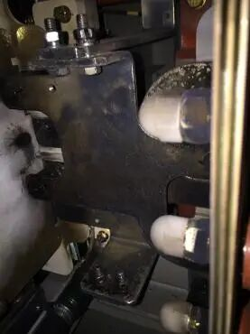
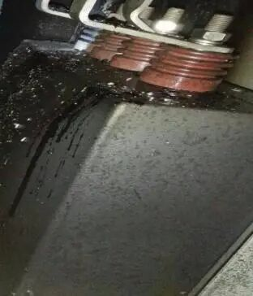
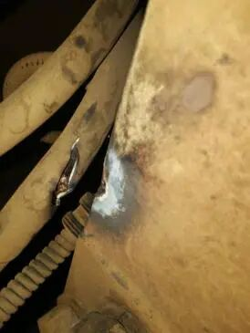
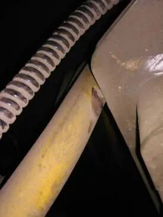
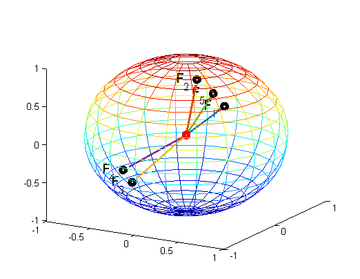
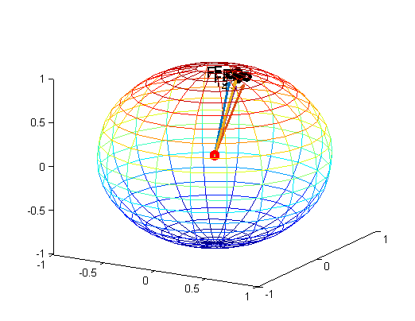
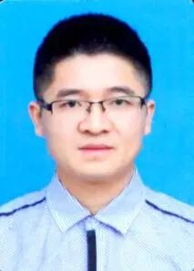
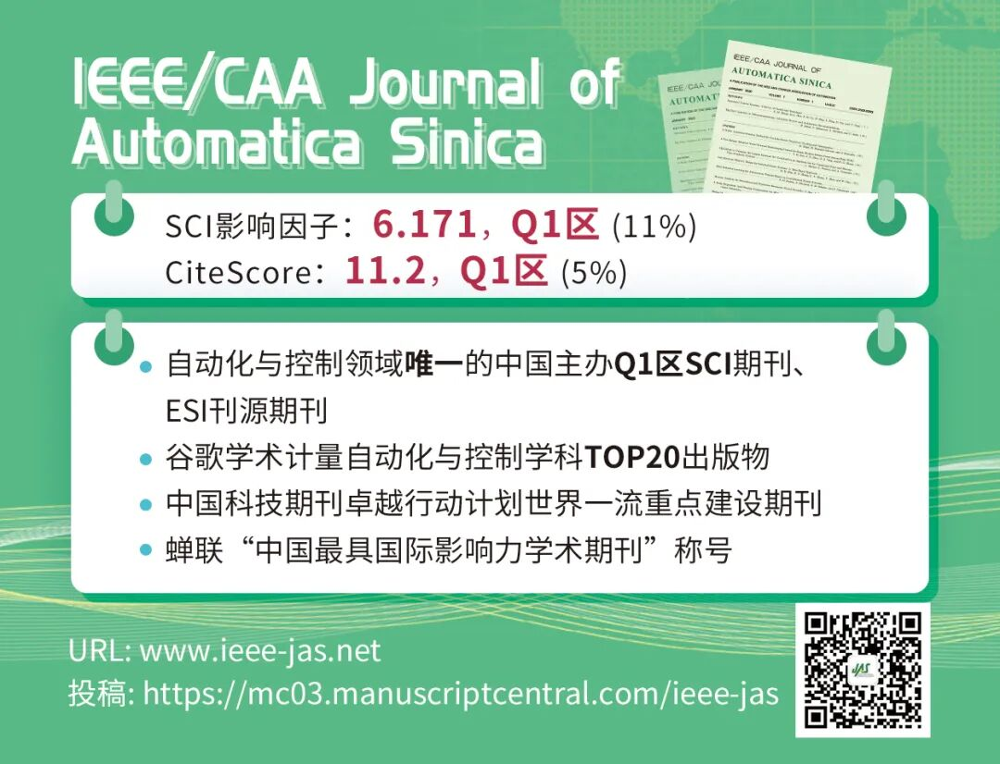

# 基于特征相关性的牵引系统主回路接地故障诊断

原创 自动化学报 自动化学报 2021-08-20 14:46 北京

> 原文地址: [https://mp.weixin.qq.com/s/bp6Tt22vg2o6eEI4jVUnqQ](https://mp.weixin.qq.com/s/bp6Tt22vg2o6eEI4jVUnqQ)

**点击蓝字|关注我们**

  

**牵引系统主回路接地故障**是指：机车或动车组牵引传动系统的主电路相关零部件及其线路在列车运行过程中，由于部件损坏、振动摩擦、电缆老化等原因造成的非正常接地。

  

陈志文,  李学明,  徐绍龙,  彭涛,  阳春华,  桂卫华.  基于特征相关性的牵引系统主回路接地故障诊断.  自动化学报,  2021,  47(7): 1516−1529

_http://www.aas.net.cn/cn/article/doi/10.16383/j.aas.c190588?viewType=HTML_

  

高速铁路的快速发展带动着机车车辆技术的快速升级换代，列车结构越来越复杂，可靠性等要求也越来越高。由于牵引传动系统装置运行环境复杂，腐蚀，温度，湿度以及电浪涌，静电等因素都会影响其运行状态，极易发生故障，且大多数故障无法通过定期维修的方式来消除。如果机车在运行途中发生了故障，最优解决方案是能进行在线诊断，定位出故障原因，并执行适当的隔离保护策略。如未能及时诊断出故障原因并排除故障，将会造成行车事故，延误列车的正常运行，影响整个线路及至全路的运输秩序，严重时会造成安全性事故。

  

在牵引系统的众多典型故障之中，主回路接地是最常见的故障之一。一般而言，一点接地并不会带来什么危害，对系统的正常工作不会有太大的影响，但两点或多点接地，就可能产生很大的短路电流，造成电传动系统部件的烧损，严重情况下甚至会导致机破。此外，不同接地点对系统影响不同，控制系统应采取不同的保护动作以提高机车动车的可用性。因此，若能实现主回路各接地点的精确诊断将会提高机车和动车的安全性和可用性，极大提升故障检修效率，降低维护成本。

  

_图1  现场典型主回路接地故障图示_

  

目前接地故障一般是基于硬件接地检测电路，采用简单的上下限超限报警方式实现接地检测，或者基于单一指标，不能准确区分具体故障点（整流侧，直流环节或逆变侧），不利于现场故障排查。本文作者之前提出了基于传统典型相关分析（CCA）方法的诊断策略，该方法考虑测量数据之间的相关性，但由于各测量数据多为含高频噪声的交流信号，直接利用其测量数据进行残差和故障方向信号计算时，故障隔离效果欠佳，且对数据平稳性要求较高。

  

本文主要的创新点是：(1) 分析采样信号在不同典型故障类型时的特征规律，计算故障特征变量；(2) 提出一种基于特征相关性的牵引系统主回路接地故障诊断方法。具体地，分析故障特征变量，提取故障特征指标，通过特征相关性分析，构建残差发生器和提取残差方向用于故障检测和故障隔离，提升了测量噪声大和暂态存在工况时的故障诊断性能，并且所提方法无需新增硬件；(3)通过现场数据试验表明，所提方法能快速检测与隔离故障，与现有车载方法和传统CCA方法相比，在存在测量噪声和暂态工况时能实现更加准确的故障定位，验证了所提方法的有效性和可行性。

  

_(a) 本文所提方法_

_(b) 传统CCA方法_

_图2 故障隔离效果对比_

  

  

**作者简介**

  

**陈志文**

中南大学自动化学院副教授. 2016年于德国杜伊斯堡-埃森大学获博士学位.主要研究方向为复杂系统故障诊断,机器学习及其在工业中应用.

E-mail: zhiwen.chen@csu.edu.cn

  

**李学明**

株洲中车时代电气股份有限公司高级工程师. 2011年于中南大学获硕士士学位. 主要研究方向为牵引传动系统控制、故障诊断与预测. 本文通信作者.

E-mail: lxm\_hnu@163.com

  

**徐绍龙**

株洲中车时代电气股份有限公司高级工程师. 2016年于浙江大学获硕士士学位. 主要研究方向为牵引传动系统控制、故障诊断与健康管理.

E-mail: xusl@csrzic.com

  

**彭  涛**

中南大学自动化学院教授. 2005年于中南大学获博士学位. 主要研究方向为复杂系统的故障诊断与容错控制

E-mail: pandtao@csu.edu.cn

  

**阳春华**

中南大学自动化学院教授. 主要研究方向为复杂工业过程建模与优化, 故障诊断与智能化系统.

E-mail: ychh@csu.edu.cn

  

**桂卫华**

中国工程院院士、中南大学自动化学院教授. 主要研究方向为复杂工业过程建模, 优化与控制应用和知识自动化.

E-mail: gwh@csu.edu.cn

  

  

**期刊目录**

[2021年第07期](http://mp.weixin.qq.com/s?__biz=MzI2NjA3MzM5MA==&mid=2649959756&idx=1&sn=7e5985469c10d03031de1d44d2b2c258&chksm=f294290dc5e3a01b626b4300d9f444cb8de1bea7ba390f12e835b4d3373e49c1c23dd11c8959&scene=21#wechat_redirect)

[2021年第06期](http://mp.weixin.qq.com/s?__biz=MzI2NjA3MzM5MA==&mid=2649959156&idx=1&sn=5fbd7f8c73b2ec6e4c21136bff39e716&chksm=f2942eb5c5e3a7a3a94c8be799a10e43dd60f7255a10f8c850d62bd5bdada5bb7d1acc29e1a1&scene=21#wechat_redirect)

[2021年第05期](http://mp.weixin.qq.com/s?__biz=MzI2NjA3MzM5MA==&mid=2649958886&idx=1&sn=ba599bc866e3eb23b0b8de0579956258&chksm=f2942da7c5e3a4b1fd1313e90d4f72354dd0de42cee19281f5c726978a841332622a0681d32c&scene=21#wechat_redirect)

[2021年第04期](http://mp.weixin.qq.com/s?__biz=MzI2NjA3MzM5MA==&mid=2649958569&idx=1&sn=ae33a7dcd6e2d66cae59932a1e99ce5e&chksm=f2942ce8c5e3a5fe7d94f6d809ecc492e83ebe118243f871cc4d82420c403784a01db82a93cb&scene=21#wechat_redirect)

[2021年第03期](http://mp.weixin.qq.com/s?__biz=MzI2NjA3MzM5MA==&mid=2649958419&idx=1&sn=b5d00eb294aa8c61a6fe4a0da8b461b9&chksm=f2942c52c5e3a544ca32e37d63f8ca879a64018d3fa5b25abd6bde1aeb582914f16e1e11182a&scene=21#wechat_redirect)

[2021年第02期](http://mp.weixin.qq.com/s?__biz=MzI2NjA3MzM5MA==&mid=2649958305&idx=1&sn=a701b9996478d2c09078a03f5b22d524&chksm=f29423e0c5e3aaf692be51b3905e1cbf4045c6df9664ce7d13459de3c0c61aa284b13eb502b9&scene=21#wechat_redirect)

[2021年第01期](http://mp.weixin.qq.com/s?__biz=MzI2NjA3MzM5MA==&mid=2649958084&idx=1&sn=24c140a6a1957eb7f4164689ed2840a5&chksm=f2942285c5e3ab93c5ed6127ad93e76ded82ae657ca79f7ead390387fbe2a72cb6df0ec6dcd2&scene=21#wechat_redirect)

[《自动化学报》2020年全年合集](http://mp.weixin.qq.com/s?__biz=MzI2NjA3MzM5MA==&mid=2649957972&idx=1&sn=1951847aacbcb7d22bdd2a46a79af871&chksm=f2942215c5e3ab03d070d8e52b8764b38036897c97b6a26c7a1f918c806b28edbe6c0fbf7ea9&scene=21#wechat_redirect)

[2020年第10期 工业人工智能专题](http://mp.weixin.qq.com/s?__biz=MzI2NjA3MzM5MA==&mid=2649957201&idx=1&sn=ab82a767bd716ab67fdf2942500d8b61&chksm=f2942710c5e3ae06b27f9e63a5e329a1123d90b051164e6b6123c500230541b1ed12d92abbfb&scene=21#wechat_redirect)

[2020年第09期 分布式信息能源系统理论与应用专题](http://mp.weixin.qq.com/s?__biz=MzI2NjA3MzM5MA==&mid=2649956412&idx=1&sn=8ebc13d63fd333ad85dbb8b5825df248&chksm=f294247dc5e3ad6ba297857a5b957e97cf499266c50318791fa8abd9432ecf1d9c3d9b287e36&scene=21#wechat_redirect)

[2019年第12期 智能轨道交通系统专刊](http://mp.weixin.qq.com/s?__biz=MzI2NjA3MzM5MA==&mid=2649955524&idx=1&sn=a76b97bf832e984f0155acc0fb367bc7&chksm=f2941885c5e391935c353c88072e806cb0b5b9b78b1f7b23b3c6f4b8c6a2c12f72557f87b56b&scene=21#wechat_redirect)  

[2019年第01期 信息物理融合系统理论与应用专刊](http://mp.weixin.qq.com/s?__biz=MzI2NjA3MzM5MA==&mid=2649955194&idx=2&sn=fb75bc8af9672922fa20efe2d30ff6c9&chksm=f2941f3bc5e3962db43689d03a54a0e40d83cb0e69fb9c48e87c0325b5bdf1b71028ebbbba0a&scene=21#wechat_redirect)

  

**热点文章**

[中国科学院自动化研究所高层次人才招聘启事 | 长期有效](http://mp.weixin.qq.com/s?__biz=MzI2NjA3MzM5MA==&mid=2649959451&idx=1&sn=657b7e4aeeaa88114d5189641c5409dc&chksm=f294285ac5e3a14cd230a2b9678c32ba9bf92e8ffc9d61d506c5ffea2df793456dd37c2c6fb1&scene=21#wechat_redirect)

[基于平均距离聚类的NSGA-Ⅱ](http://mp.weixin.qq.com/s?__biz=MzAwMzAzMDgxOA==&mid=2651071210&idx=1&sn=4d6b03f3de40972233111d419f661a7f&chksm=8131e8a7b64661b1424c2caf619bf0248ac2a6fc698d537144080a1fc0310efc4fdd92eade30&scene=21#wechat_redirect)

[传感器饱和的非线性网络化系统模糊H∞滤波](http://mp.weixin.qq.com/s?__biz=MzAwMzAzMDgxOA==&mid=2651071175&idx=1&sn=e78285c311fde57d52c77b70d146610f&chksm=8131e88ab646619ca999f197a1aeb6c3f04a6837f2a6df0cd45fe4439799fba5f9612ccd237b&scene=21#wechat_redirect)

[中医舌象分割技术研究进展: 方法、性能与展望](http://mp.weixin.qq.com/s?__biz=MzAwMzAzMDgxOA==&mid=2651071139&idx=1&sn=d00851cb35c6d4aff0b36a75cde68b7f&chksm=8131e8eeb64661f87053a2fabd389cfeab41d7d103502048a00b281f05cde290d27394f39543&scene=21#wechat_redirect)

[基于区块链的数字货币发展现状与展望](http://mp.weixin.qq.com/s?__biz=MzI2NjA3MzM5MA==&mid=2649958456&idx=1&sn=db1e69bbd69e864051158910b599e0a9&chksm=f2942c79c5e3a56f669395da520a1f215c6452cc8a0d40ca6e3b274b85e077c547bf4d85a8e5&scene=21#wechat_redirect)

[基于深度学习的表面缺陷检测方法综述](http://mp.weixin.qq.com/s?__biz=MzAwMzAzMDgxOA==&mid=2651070518&idx=1&sn=8097f7197598117c3b46d7d9dd984c85&chksm=8131ea7bb646636d9444a9d6f73eacacf11a22de2bc054e00941aa5bced3f7b2db0dd6326149&scene=21#wechat_redirect)

[比特驱动的瓦特变革—信息能源系统研究综述](http://mp.weixin.qq.com/s?__biz=MzAwMzAzMDgxOA==&mid=2651070474&idx=1&sn=bbfe03a0e9a8f97f46c87d75f466e7c2&chksm=8131ea47b646635104e90390e9a09f18947b3cd7d1bc9438dd4b4275f17db875abd2ab1a2849&scene=21#wechat_redirect)

[状态转移算法原理与应用](http://mp.weixin.qq.com/s?__biz=MzAwMzAzMDgxOA==&mid=2651069967&idx=1&sn=3fec83278b26be988d7a5fea928a69a9&chksm=8131d442b6465d54d02d3a0ae16b064548d496696b14906b9f6de6043645035ecd25f4f7b39b&scene=21#wechat_redirect)

[绿色能源互补智能电厂云控制系统研究](http://mp.weixin.qq.com/s?__biz=MzAwMzAzMDgxOA==&mid=2651069602&idx=1&sn=b50c1e8d5fd295dc2d98238c1d68ee42&chksm=8131d6efb6465ff9d162c0a8ff5aca0e6faa643e665e071c42484c4f1e61d951dd5851f346f1&scene=21#wechat_redirect)

[智能船舶综合能源系统及其分布式优化调度方法](http://mp.weixin.qq.com/s?__biz=MzAwMzAzMDgxOA==&mid=2651069520&idx=1&sn=8350658b7c26be6fdeab22034106ec66&chksm=8131d61db6465f0b6c2371721e55aec2e5e573eef4539d980fe768f3f0855242d0d4ff6e7d33&scene=21#wechat_redirect)

[值得收藏！SCI论文中的常用句式全总结](http://mp.weixin.qq.com/s?__biz=MzAwMzAzMDgxOA==&mid=2651069425&idx=1&sn=c945766f5d7f2ada8a217b981dcc734c&chksm=8131d1bcb64658aa80092eb53e1ead905ab02fc7a9f035e798e57d6407472ef688e8f7f0e831&scene=21#wechat_redirect)

[收藏！SCI论文经典词和常用句型汇总](http://mp.weixin.qq.com/s?__biz=MzAwMzAzMDgxOA==&mid=2651069036&idx=1&sn=961c952c84a07355dc70d4bb8291ce25&chksm=8131d021b6465937c80cf41a3118a5ad92a752cb3979f22d5964a741269a1df1987a37185a31&scene=21#wechat_redirect)

  

**期刊动态**

[《自动化学报》9篇文章入选2020“领跑者5000”顶尖论文](http://mp.weixin.qq.com/s?__biz=MzI2NjA3MzM5MA==&mid=2649959410&idx=1&sn=e3e8ba749a1d075423a5c46328f812d8&chksm=f2942fb3c5e3a6a5beba9f59644c661a4d2ee623378551fa3a6fcfbce271868529d2cb149ff8&scene=21#wechat_redirect)

[JAS最新影响因子6.171，排名世界第7](http://mp.weixin.qq.com/s?__biz=MzI2NjA3MzM5MA==&mid=2649959382&idx=1&sn=f0ab35e9db7f66b68ccc1e4cca1b9dae&chksm=f2942f97c5e3a6813143ad6bc478369124d0ec36fea79d7af93c021b51ef225616b0ebf339bd&scene=21#wechat_redirect)

[自动化学报编委金耀初教授当选欧洲科学院院士](http://mp.weixin.qq.com/s?__biz=MzAwMzAzMDgxOA==&mid=2651071272&idx=1&sn=41781c579c3615bb9dabb0e76a7993c4&chksm=8131e965b6466073f1a2e1277370ae00938fa60eb98ab400aaaa847aba15c6b91ebe79ecedc0&scene=21#wechat_redirect)

[JAS编委韩清龙教授当选欧洲科学院院士](http://mp.weixin.qq.com/s?__biz=MzI2NjA3MzM5MA==&mid=2649959352&idx=1&sn=dc42494191ad7dcc1b5e705bb204cfeb&chksm=f2942ff9c5e3a6ef3f86e420859dd8fadb7ad3e11625cba02fecab4449d5b1f3e2511472dd55&scene=21#wechat_redirect)

[JAS副主编姜钟平教授当选欧洲科学院院士](http://mp.weixin.qq.com/s?__biz=MzAwMzAzMDgxOA==&mid=2651071275&idx=1&sn=032005e63b6626596afe850f7562fee3&chksm=8131e966b646607008f227c917a6028bc05d62d8c2d1da68b939497fb52b5fcd82d5b2f7e441&scene=21#wechat_redirect)

[JAS副主编刘德荣教授当选为欧洲科学院外籍院士](http://mp.weixin.qq.com/s?__biz=MzI2NjA3MzM5MA==&mid=2649959324&idx=1&sn=bbc81384a97a28c9df3ea612f5b666d2&chksm=f2942fddc5e3a6cb3182c229b8da44cdb07f4ecefa3a95626845625d06c7ff57217da7405b4b&scene=21#wechat_redirect)

[《自动化学报》致谢审稿人](http://mp.weixin.qq.com/s?__biz=MzI2NjA3MzM5MA==&mid=2649957872&idx=1&sn=e642c48a6d17dc0f99d2f3879446ecab&chksm=f29421b1c5e3a8a7b4e5cf8564d2f0713d3bcec5186ef4684875caf67dd096659450c96f31ce&scene=21#wechat_redirect)

[自动化学报蝉联百种中国杰出期刊称号，入选中国精品科技期刊](http://mp.weixin.qq.com/s?__biz=MzI2NjA3MzM5MA==&mid=2649957485&idx=1&sn=8af865466cb6f52b05a1e41af8549e71&chksm=f294202cc5e3a93a40b4850e6e0f0bccaf56c89591e049e9d98bfe9a598913f5d25e8ecfcf8d&scene=21#wechat_redirect)

[《自动化学报》挺进世界期刊影响力指数Q1区](http://mp.weixin.qq.com/s?__biz=MzI2NjA3MzM5MA==&mid=2649957452&idx=1&sn=c5fa8ac9c581e4ae3de2e7956e603dca&chksm=f294200dc5e3a91bb250e25fd6f7e47dc1114ad6fdf1762a7bfc440f789a059f1de455584e66&scene=21#wechat_redirect)

[《自动化学报》多名作者入选科睿唯安2020年度高被引科学家](http://mp.weixin.qq.com/s?__biz=MzI2NjA3MzM5MA==&mid=2649957295&idx=1&sn=597189346218d96d9906447a50281084&chksm=f29427eec5e3aef8d0662def8a0afcde2d2f3f828ae8208a52b14fc72169cedc5d81c06185a9&scene=21#wechat_redirect)

[自动化学报排名第一，被评定为中国中文权威期刊](https://mp.weixin.qq.com/s?__biz=MzI2NjA3MzM5MA==&mid=2649956509&idx=1&sn=1e39aaf65dc579606cf36258be8e1744&scene=21#wechat_redirect)

  

  

**长按二维码｜关注我们**

**IEEE/CAA Journal of Automatica Sinica (JAS)**

**长按二维码｜关注我们**

**《自动化学报》服务号**

**长按二维码｜关注我们**

**《自动化学报》订阅号**  

  

**联系我们**

**网站:** 

http://www.aas.net.cn

http://www.ieee-jas.net

**投稿:** 

https://mc03.manuscriptcentral.com/aas-cn   

https://mc03.manuscriptcentral.com/ieee-jas 

**电话:**  010-82544653（日常咨询和稿件处理） 

           010-82544677（录用后稿件处理）

**邮箱:**  aas@ia.ac.cn（日常咨询和稿件处理）  

           aas\_editor@ia.ac.cn（录用后稿件处理）

**博客:** 

http://blog.sina.com.cn/aaseditor 

  

**点击****阅读原文** **了解更多**