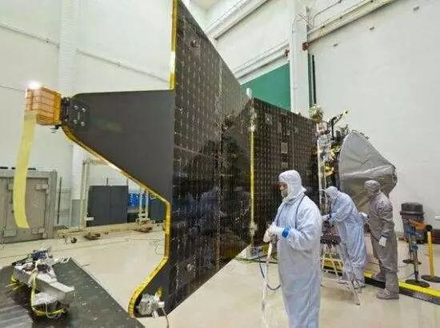

# 复杂动态系统的实际非完全失效故障的可诊断性评估

原创 自动化学报 2018-01-22 17:52 北京

> 原文地址: [https://mp.weixin.qq.com/s/LtNsvmR7BHJQfxm85nU1xg](https://mp.weixin.qq.com/s/LtNsvmR7BHJQfxm85nU1xg)

提到经典电影《千钧一发》，想必许多影迷都会迫不及待地向别人分享自己的感受。在那个虚拟的世界中，人们对基因的研究取得了突破性的进展，几乎每个新生儿在出生时都接受了基因工程的“加工”。通过改良基因，使出生的人在未来的生活中具有更强的环境适应能力和生存能力。这在现在看来也是一件很难想象的事情，即使不考虑该举措背后所可能存在的伦理道德等问题，单从科学技术的角度而言，可靠地、大范围地对新生儿进行基因“加工”依然是难以实现的。然而，对于控制系统而言，基因“加工”并不是什么天方夜谭。

千钧一发（Gattaca）

随着工业技术的不断发展，人们对控制系统的安全性提出了更高的要求。这里以航天器控制系统为例。一方面, 由于航天器规模复杂、运行环境恶劣, 大大地提高了其在轨故障的概率；另一方面, 航天器研究及制造成本高昂，目前大部分航天器发生故障后均难以维修，一旦发生故障, 将造成巨大的经济损失。因此，如何提高系统的使用寿命、安全性和运行质量，降低故障风险成为了学者们关注的重点内容，而提高系统的故障诊断能力则是其中一个有效的手段。

NASA maven航天器装配

故障可诊断性是表征控制系统诊断故障能力的结构属性，它为提高系统故障诊断能力提供了新的思路。通过对可诊断性进行分析，在航天器系统设计阶段对系统结构、配置进行优化，一方面可以使系统在设计完成时便具有较高的故障可诊断性, 从根本上提高系统的故障诊断能力；另一方面，可以有效地优化航天器冗余分配效率，提高资源利用率。换句话说，与影片中对新生儿进行“基因加工”的思路相同，若是系统设计人员在设计过程中便将可诊断性视为设计指标之一，则可以使得系统“天生”就具有较强的反映故障信息的能力，大大提高系统的“生存能力”。

除此之外, 若将可诊断性评价纳入诊断算法的设计阶段, 利用可诊断性评价结果指导诊断算法设计, 则可以降低诊断算法的设计难度，有效地对算法的诊断代价与诊断性能进行权衡, 并通过设计合适的残差, 更加有针对性地实现算法优化，从而进一步提高系统运行的安全性。

综上所述，可诊断性设计可以有效地提高系统运行安全性，而其中可诊断性评价又是可诊断性设计的前提条件。因此，许多学者们对可诊断性评价进行了深入研究，并获得了大量的成果。然而，通过分析发现，现有的实际系统故障诊断量化评价方法均没有考虑系统非完全失效故障 (Loss of Effect, LOE) 的情况。实际上，系统非完全失效故障是实际控制系统特别是航天器系统中一类具有代表性的故障。因此，研究非完全失效故障的可诊断性评价具有工程针对性意义；同时，相对于加性故障, 非完全失效故障的可检测性与可隔离性具有特殊的性质，所以研究实际系统的非完全失效故障诊断量化评价方法具有重要的理论意义。

本文将状态空间描述的动态系统转换为时间堆栈动态模型，使故障的可诊断性评估分析问题转化为多元分布的相似度问题，并利用巴氏距离量化不同多元分布之间的相似度，给出了非完全失效故障的可诊断性评价准则。最后通过仿真实例验证评价方法的有效性。

引用格式

符方舟, 王大轶, 李文博. 复杂动态系统的实际非完全失效故障的可诊断性评估. 自动化学报, 2017, 43(11): 1941-1949

作者简介

符方舟 北京控制工程研究所博士生. 2015 年获得哈尔滨工业大学深圳研究生院硕士学位. 主要研究方向为控制系统的故障诊断, 可诊断性评价.

E-mail: fizssg@163.com 

王大轶 北京空间飞行器总体设计部研究员. 主要研究方向为航天器的自主制导、导航与控制, 故障诊断与容错控制.

E-mail: dayiwang@163.com 

李文博 北京控制工程研究所高级工程师. 2012 年获得哈尔滨工业大学博士学位. 主要研究方向为故障诊断与容错控制, 卫星控制系统的可诊断性评价与设计.

E-mail: liwenbo\_bice@163.com

欢迎扫描二维码、长按图片识别关注《自动化学报》中文版订阅号aas1963，服务号自动化学报和英文版服务号！

JAS《自动化学报》（英文版）

自动化学报服务号

自动化学报订阅号

  

联系我们

Tel:  010-82544653（日常咨询和稿件处理） 

        010-82544677（录用后稿件处理）

Fax: 010-82544497

Email: aas@ia.ac.cn（日常咨询和稿件处理）

          aas\_editor@ia.ac.cn（录用后稿件处理）

http://www.aas.net.cn

  

点击阅读原文查看更多