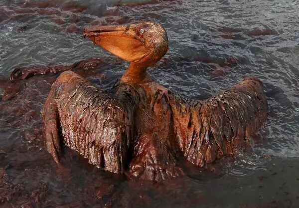
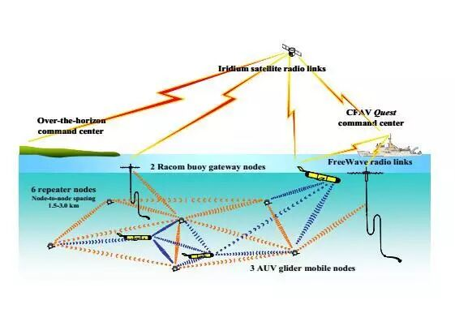

# 未来海上溢油污染的卫士—海洋立体检测网络

原创 自动化学报 2017-07-12 16:18 北京

> 原文地址: [https://mp.weixin.qq.com/s/YghzTZcLXlH9Sdiyy3VZhw](https://mp.weixin.qq.com/s/YghzTZcLXlH9Sdiyy3VZhw)

王兴凯,郭淘沙,郭戈

大连海事大学自动化系

海洋环境检测不仅对海洋环境、海洋生物和生态系统保护具有重要意义，也是地球大气、陆地水资源及生态系统安全的重要保障。海洋环境立体检测作为重要的前沿技术，是国家大力培育和发展的战略新兴技术\[1\]-\[3\]。

图1. 溢油事故后的海面及受害的海鸟

溢油危害严重

全球范围内的海上油气泄漏事故频发，不仅严重污染水域生态环境，危及陆地水资源和生物安全（见图1），而且造成巨大经济损失，甚至影响人类健康和生命安全。其中，2010年墨西哥湾钻井平台原油泄漏事故造成数百亿美元的经济损失，污染了5180余平方公里的海洋水域。

虽然海水对污染有自净化能力，但海上油膜会大大降低海水与大气的氧气交换，从而影响海水净化，破坏海洋生态平衡。因此，一次大的溢油事故造成的影响会延续十几年甚至更长的时间。

我国现状堪忧

我国急需油气泄漏监测及跟踪技术。首先，我国海域面积广，从事海上石油钻探、开采及运输作业的设施设备数量庞大，且数千公里的海岸线上分布有大量的储油设备，泄漏爆炸事故时有发生。其次，我国海洋油气产业近年来高速发展，海洋原油开采进入高速发展时期\[4\]，但五分之四左右的产量来自七十多年前开发的油气田，随着海上油气勘探开发规模的扩大、初期设备设施的老化以及钻探深度的不断增长，海上溢油事件的发生呈逐年上升态势。

目前，钻井平台等海上作业平台油气泄漏的监测主要依赖人工定期水下巡检或机器人定期巡检，很难及早发现微小的油气泄漏源。如果能对海洋油气作业平台及其设施和周边海域进行全天候在线监测，及早发现油气泄漏风险或安全威胁，就能及时采取防范或补救措施，从而避免发生大规模油气泄漏事故，防止由此导致巨大的经济损失和严重的海洋环境污染。可惜海洋油气水下泄漏早期在线监测和预报研究才刚刚起步，还没有行之有效的技术。

海面溢油监测

海洋溢油监测研究已有几十年的历史，主要侧重于海面溢油监测、油污回收及生态修复等技术\[5\]-\[8\]。传统的海洋溢油监测系统依靠水面、空中及水下独立设备采集监测区域的数据，并通过卫星通信或水下电缆发送到岸上基站或船上设备。现有的海面溢油监测技术主要包括卫星遥感监测、航空遥感监测、船舶遥感监测、CCTV监测和浮标跟踪等。卫星遥感和航空遥感溢油监测是发达国家最普遍采用的技术，但卫星遥感监测重复观测周期长，空间分辨率低，具有一定局限性；而航空遥感和雷达监测费用高，且易受天气因素和环境条件影响，在雾霾等恶劣条件下无法实施。船载溢油监测设备虽然可以在夜间监测溢油状况，但让工作人员进行夜间巡航不现实，因此常用于白天巡视监测以及溢油事故发生后的跟踪监测。固定点CCTV监测和浮标监测等技术受到位置所限，监测范围相对较小。

现有的溢油监测技术具有如下缺点：（1）依靠海上浮标、潜标、岸基台站可以对海洋的有限点面或层次进行连续的监测，但无法监测站点以外更大面积的海面或水下；（2）借助船舶及船载设备可在预定海域进行有限时空覆盖的监测，但人力物力成本高，无法进行长期、连续观测；（3）利用海洋遥感技术，通过卫星或飞机可以对海面环境进行宏观大尺度、快速的动态观测，但同样受工作时间和天气条件的限制，同时也无法监测水下作业平台的早期原油泄漏。

因此，已有的溢油监测技术只能应用于在大规模油气泄漏导致海面出现大面积浮油之后，不能发现早期、小范围泄漏事故，也无法对溢油分布状态及其漂移情况实施跟踪监测，更无法对可能发生泄露的重点区域实施长期在线监测，以提供早期溢油预警从而及时消除溢油隐患，避免重大溢油事故所造成的巨大生态破坏和经济损失。

水下泄漏监测

相对于海面浮油监测已形成较为成熟的技术体系，水下油气泄漏监测和预报研究刚刚起步，受到越来越多的关注。2010年，挪威Stinger公司与海洋油气开采企业联合启动了LeakRoV项目，以研究水下油气泄漏监测机制，该项目评估了现有的水下油气泄漏探测传感器的性能，并研发了新型监测技术。目前，水下油气泄漏监测研究多侧重于水下泄漏的数值化建模与模拟、基于水下自主航行器（AUV）的泄漏点检测、海底管道溢油在水体中的扩散过程、海底沉船溢油轨迹及扩散等进行建模和数值模拟\[9,10\]、基于专用网络的水下扩散源估计、定位及跟踪\[11\]\[12\]、油气泄漏的三维分布\[13\]以及基于图像处理和机器学习的水下溢油检测与分析系统\[14\]等。

近年来，低成本、低能耗的传感网络技术为水下油气泄漏监测提供了新的手段。通过水声通信或光通信系统联网的传感器配合水下自主航行器AUV，形成动态监测网络，按规划的监测取样路径进行立体大范围重复观测，是水下环境实时信息采集和监测的理想选择。美国海军在80年代就开发部署了无线水下设备网络Seaweb\[16\]，包括自主水下航行器、滑翔机、浮标、回声器以及船舶等，设备之间通过声纳、无线电和卫星通道通信（见图2）。2012年美国斯蒂文森理工学院的研究人员在美国自然科学基金的资助下，提出基于异构海洋机器人网络进行水下溢油监测与跟踪的构想，文献\[15\]提出利用传感器网络进行水下油气管道安全监测的思路。目前尚无投入运行的水下油气泄漏监测网络系统，相关基础理论和方法体系也有待完善。

图2. 东墨西哥湾的Seaweb网络 

机遇与挑战

基于水下立体检测网络可对海上油气作业平台及周边海域进行实时监测，及早确定泄漏征兆或泄漏源。通过在水下不同深度及水面布设监测节点对油气泄漏风险进行监测和跟踪，可更好地掌握溢油在水下及水面的扩散规律，从而在溢油发生及扩散之初就采取补救措施，降低溢油对生态环境可能造成的污染和由此导致的经济损失。这样的监测网络还可为海上作业平台及周边海域提供长期在线监测，形成功能完善的水下-海面-空中一体化海洋检测技术。

基于海上立体检测网络的油气泄漏监测也面临诸多困难和挑战\[17\]\[18\]，主要技术挑战总结如下：

（1）声学通信带宽很窄，数据传输速率低，传输延时可达无线电通信延时的万倍以上，且海域的温度和盐度变化影响声速和检测性能。

（2）声通信节点的相对运动会导致显著的多普勒效应。

（3）传感器不便频繁充电，因此要求其上的数据处理、通信、定位等算法简单高效，保证低能耗。

（4）声波在海面和海底的反射会导致多通道传输效应，且反射特性随海水温差和盐度而变化，因此，声通信链路质量差、误码率高。

可见，水下油气泄漏监测网络的研究极具挑战性，具有重大的研究价值。

参考文献

\[1\].国家中长期科学和技术发展规划刚要（2006-2020）。http://www.most.gov.cn/kjgh/kjghzcq/  

\[2\].国家“十二五”科学和技术发展规划。http://www.most.gov.cn/kjgh/

\[3\].国家“十二五”海洋科学和技术发展规划刚要。http://www.soa.gov.cn/soa/management/science/

\[4\].国家海洋局. 中国海洋经济发展报告. http://www.soa.gov.cn/.

\[5\].S. Singha, R. Ressel, D. Velotto and S. Lehner. A combination of traditional and polarimetric features for oil spill detection using TerraSAR-X. IEEE Journal of Selected Topics in Applied Earth Observations and Remote Sensing, 9(11): 4979-4990, 2016.

\[6\].S. Skrunes, C. Brekke, C. E. Jones and B. Holt. A multisensor comparison of experimental oil spills in polarimetric SAR for high wind conditions. IEEE Journal of Selected Topics in Applied Earth Observations and Remote Sensing, 9(11): 4948-4961, 2016.

\[7\].Y. Jing, J. An and Z. Liu. A novel edge detection algorithm based on global minimization active contour model for oil slick infrared aerial image. IEEE Transactions on Geoscience and Remote Sensing, 49(6): 2005-2013, 2011.

\[8\].B. G. Gautama, N. Longepe, R. Fablet and G. Mercier. Assimilative 2-D Lagrangian transport model for the estimation of oil leakage parameters from SAR images: application to the Montara oil spill. IEEE Journal of Selected Topics in Applied Earth Observations and Remote Sensing, 9(11): 4962-4969, 2016.

\[9\].Monika Kollo, Janek Laanearu, Kristjan Tabri. Hydraulic modelling of oil spill through submerged orifices in damaged ship hulls. Ocean Engineering, 130(15): 385-397, 2017.

\[10\].Weijun Guo, Guoxiang Wu, Meirong Jiang. A modified probabilistic oil spill model and its application to the Dalian New Port accident. Ocean Engineering, 121(15): 291-300, 2016.

\[11\].Kamrul Hakim, Sudharman K. Jayaweera and Georges El-Howayek, Ad-hoc Wireless Sensor Network Based Underwater Diffusive Source Localization. Proc. Int. Conf. Intelligent and Advanced Systems, 610-615, 2012.

\[12\].James C. Kinsey, Dana R. Yoerger, Michael V. Jakuba, Rich Camilli. Assessing the Deepwater Horizon Oil Spill with the Sentry Autonomous Underwater Vehicle. Proc. IEEE/RSJ Int. Conf. Intelligent Robots and Systems, 261-267, 2011.

\[13\].Hidetaka Senga, Naomi Kato, Lubin Yu. Verification Experiments of Sail Control Effects on Tracking Oil Spill. ??????

\[14\].Sergiy Fefilatyev, Kurt Kramer, Lawrence Hall, Dmitry Goldgof, Rangachar Kasturi. Detection of Anomalous Particles from the Deepwater Horizon Oil Spill Using the SIPPER3 Underwater Imaging Platform. Proc. IEEE Int. Conf. Data Mining Workshops, 41-48, 2011.

\[15\].Nader Mohamed, Imad Jawhar, Jameela Al-Jaroodi, and Liren Zhang. Monitoring Underwater Pipelines Using Sensor Networks. Proc. IEEE Int. Conf. High Performance Computing and Communications, 346-353, 2010.

\[16\].Rice J, Green D. Underwater acoustic communications and networks for the US Navy’s Seaweb program. Proc. IEEE Int. Conf. Sensor Technologies and Applications. Piscataway, NJ: 2008: 715-722.

\[17\].J. Heidemann, W. Ye, J. Wills, A. Syed, and Y. Li, “Research challenges and applications for underwater sensor networking,” Proc. IEEE Wireless Communications and Networking Conference, Las Vegas, 2006.

\[18\].M. Stojanovic and J. Preisig, “Underwater acoustic communication channels: Propagation models and statistical characterization,” IEEE Commun. Mag., vol. 47 , no. 1, pp. 84-89, 2009.

欢迎扫描二维码、长按图片识别关注《自动化学报》中文版订阅号aas1963，服务号自动化学报和英文版服务号！

JAS《自动化学报》（英文版）

自动化学报服务号

自动化学报订阅号

  

联系我们

Tel:  010-82544653（日常咨询和稿件处理） 

        010-82544677（录用后稿件处理）

Fax: 010-82544497

Email: aas@ia.ac.cn（日常咨询和稿件处理）

          aas\_editor@ia.ac.cn（录用后稿件处理）

http://www.aas.net.cn