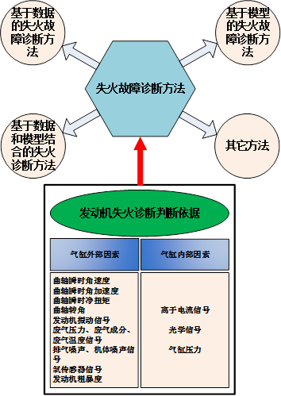
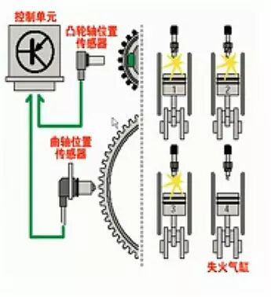
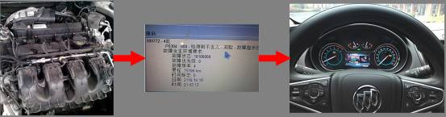

# 汽车发动机失火故障诊断方法研究综述

原创 自动化学报 2017-05-08 17:45 北京

> 原文地址: [https://mp.weixin.qq.com/s/sDRScxNxpmFhQYV-Tbx4HA](https://mp.weixin.qq.com/s/sDRScxNxpmFhQYV-Tbx4HA)

点击上方蓝色文字关注↑↑↑↑↑

  

失火故障诊断是汽车车载诊断系统(On-Board Diagnostic, OBD)的重要组成部分，其直接关系到车辆行驶过程中的排放、燃油消耗和发动机损伤。因此，研究发动机失火故障诊断具有重要的实践意义。

  

重庆邮电大学郑太雄教授团队最新文章“汽车发动机失火故障诊断方法研究综述”。如图1所示，文章主要探索了汽车发动机失火故障诊断的判断依据和方法分类，失火判断依据的研究为失火故障诊断方法的实现打下了坚实的基础。同时对近年来国内外关于失火诊断方法的研究工作进行了系统性的总结和分析，重点介绍了汽车发动机失火故障诊断的判别依据、失火诊断方法分类、观测器设计等问题。最后对失火故障诊断的未来发展作了几点展望。

图1 失火故障诊断

失火原因分析

  

如图2所示便是发动机失火故障发生时的实际情景图。当失火故障发生时，汽车动力性能将大幅度降低，并将损坏催化转化器，诱导废气排放量增加。而在实际工况中，引起失火的因素颇多，根据发动机工作循环必备的几个基本条件，如空气、燃料、压缩和火花，发动机失火原因大致包括以下几个方面：(i) 燃油质量不良、积炭、机油黏度高；(ii) 射频干扰（音响、无线电通信设备等）；(iii) 废气再循环阀卡死在开启位置；(iv) 点火系统不良；(v) 燃油供给不足以及(vi) 发动机机械问题等。因此，发动机失火故障诊断具有很大的挑战，而本文以此为基础，结合复杂的实际路况，研究总结了失火故障的判断依据和方法，其意义重大，为失火故障诊断方法应用于实际发动机失火故障诊断奠定了理论基础。

图2 失火故障示意图

  

失火故障诊断

  

如图3所示，失火故障诊断可实现一个完整的过程：发动机存在失火故障—OBD故障码产生—失火故障提醒和信息展示。从失火故障发生到故障识别，再到故障提醒，整个过程为汽车发动机的工作状态获悉具有极强的参考作用，让驾驶员时刻知晓发动机所处的工作状态，并在失火故障发生时能及时采取相应的措施。

图3 失火故障诊断实际应用过程

  

小结

  

而从实际的角度出发，国内外汽车厂商对汽车发动机失火故障诊断问题解决方案的需求也存在多方面考虑，包括失火检测的实时性问题、车载端的失火检测器定位失火气缸功能、不同汽车不同工况下的具体失火原因复杂等。论文也对这些方面的问题进行了讨论，并从多个角度对失火故障诊断方法的实现进行了对比分析和总结。同时，随着排放标准的日益严格以及检测手段的不断进步，新的失火故障诊断方法不断涌现，取得了许多新的研究成果，为此，我们是有必要地将近些年汽车发动机失火故障诊断方法的主要进展和部分有代表性的研究成果进行介绍，为从事汽车发动机失火故障诊断研究与应用的科研和技术人员提供参考。

引用格式

  

郑太雄, 张瑜, 李永福. 汽车发动机失火故障诊断方法研究综述. 自动化学报, 2017, 43(4): 509-527

作者简介

郑太雄 重庆邮电大学教授，博士。主要研究方向为汽车电子。E-mail: zhengtx@cqupt.edu.cn  

  

张瑜 重庆邮电大学硕士研究生。主要研究方向为汽车发动机失火故障诊断。E-mail: zhangycqupt@163.com  

  

李永福 重庆邮电大学副教授，博士，普渡大学博士后。主要研究方向为车联网与智能交通、汽车电子和控制理论与应用。本文通信作者。E-mail: laf1212@163.com

  

热点文章推荐

[刘德荣教授最新力作：基于迭代神经动态规划的数据驱动非线性近似最优调节](http://mp.weixin.qq.com/s?__biz=MzAwMzAzMDgxOA==&mid=2651063208&idx=1&sn=618cd7625c1adeacfca25703ba35719e&chksm=8131c9e5b64640f3b24a3429862e7fbca69e09f0f7196f8f41784fc253dede1725aa43d9569a&scene=21#wechat_redirect)  

[人脸微表情识别：一颦一笑皆线索](http://mp.weixin.qq.com/s?__biz=MzAwMzAzMDgxOA==&mid=2651063205&idx=1&sn=aa6d7e2ace55f17222c99ae66cf342fb&chksm=8131c9e8b64640fe4e3115e56a9e04dc51a6067decafbc6246b676af4cffcee6646890e2a6a0&scene=21#wechat_redirect)  

[生成式对抗网络GAN的研究进展与展望](http://mp.weixin.qq.com/s?__biz=MzAwMzAzMDgxOA==&mid=2651063183&idx=1&sn=64a05ba464c29d32ec5e09c960aa0b2e&chksm=8131c9c2b64640d4362611c24d5dc8cf0d614ad4cce783ba6c7ee0abfb1053e12abde1a8fa7a&scene=21#wechat_redirect)  

[平行机器人与平行无人系统——智能无人载具的研究新进展](http://mp.weixin.qq.com/s?__biz=MzAwMzAzMDgxOA==&mid=2651063159&idx=1&sn=85511333c6ef151772c12f1ce1865ea8&chksm=8131c93ab646402c2a88349b771786364392abd4b017986beb891cef5389fab360ca149551a9&scene=21#wechat_redirect)  

[自动化学报|高被引学者张化光带您走近能源互联网](http://mp.weixin.qq.com/s?__biz=MzAwMzAzMDgxOA==&mid=2651063148&idx=1&sn=64a14f3d1c92fd29267cc1bf3bf1cd99&chksm=8131c921b646403797f9a68c5a8a96bd1a5aa14eaa0b138bc66f1f56836dcbd2614ef0e11eb0&scene=21#wechat_redirect)  

  

欢迎扫描二维码、长按图片识别关注《自动化学报》中文版订阅号aas1963，服务号自动化学报和英文版服务号！

  

  

  

**JAS《自动化学报》（英文版）** 

  

  

  

**自动化学报服务号** 

  

  

  

**自动化学报订阅号** 

  

联系我们：

Tel:  010-82544653（日常咨询和稿件处理） 

        010-82544677（录用后稿件处理）

Fax: 010-82544497

Email: aas@ia.ac.cn（日常咨询和稿件处理）

          aas\_editor@ia.ac.cn（录用后稿件处理）

http://www.aas.net.cn

点击“阅读原文”