# 结合特征筛选与二次定位的快速压缩跟踪算法

原创 自动化学报 2016-10-09 18:48 北京

> 原文地址: [https://mp.weixin.qq.com/s/nmkfjBAdxr6xaEtUTgapbg](https://mp.weixin.qq.com/s/nmkfjBAdxr6xaEtUTgapbg)

针对二元分类的单目标跟踪问题，本文提出一种结合特征筛选与二次定位的快速压缩跟踪算法 (Fast compressive tracking algorithm combin-ing feature selection with secondary localization，FSSL-CT)。该算法的准确性、稳定性和抗遮挡能力更好，且能够达到实时性。 

本文算法的核心思路如下：

1\. 采用划分子区域的方法分散特征，提高抗遮挡性能。 共划分五个子区域，模板如图1所示。图2是特征降维的示意图，在子区域内提取的特征经过降维即可得到压缩特征。

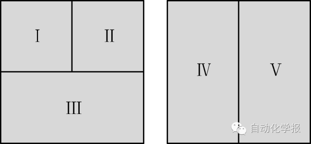

图1 子区域模板

Fig. 1 Sub-region template

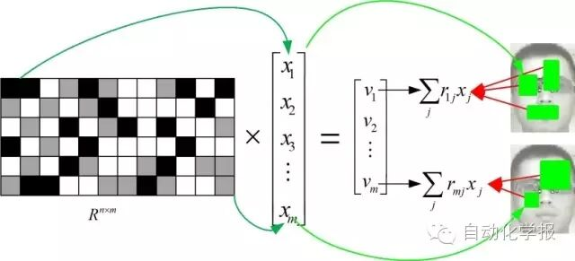

图2 降维示意图

Fig. 2 The diagram of dimensionality reduction

2\. 对正、负类中的特征分布，用自适应学习率结合正类阈值进行更新，使更新后的分布更能反映正、负类中特征的真实分布，保证分类器分类的准确性。 

3\. 在跟踪的不同阶段，采用不同的采样半径和采样间隔采集样本，从所有特征中筛选出不同数量的优质特征加权构建分类器，以有效地提高跟踪速度。 具体过程如图3所示。

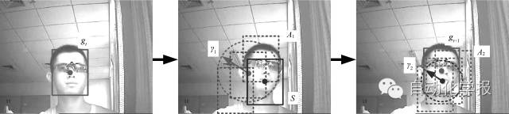

图3 二次定位示意图

Fig. 3 The diagram of secondary localization

实验部分：

本文选取 8 个公共测试序列和 4 个自制的红外测试序列，与两种当前主流的方法进行对比实验，这些序列包含光照变化、遮挡和姿态变化等具有挑战性的因素。实验结果表明，FSSL-CT算法的准确性、稳定性和抗遮挡能力更好，能够实现实时跟踪。部分跟踪效果图如图4~8所示。

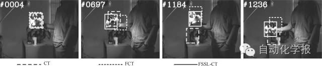

图4 Sylvester (第4、697、1184、1236帧)

Fig. 4 Sylvester (Frames 4、697、1184、1236)

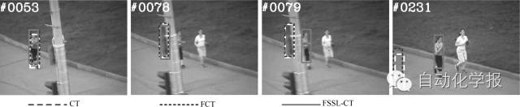

图5 Jogging (第53、78、79、231帧)

Fig. 5 Jogging (Frames 53、78、79、231)

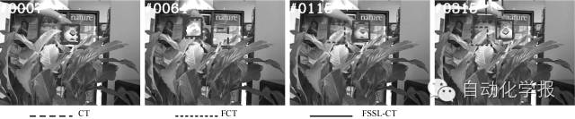

图6 Tiger1 (第7、64、115、315帧)

Fig. 6 Tiger1 (Frames 7、64、115、315)

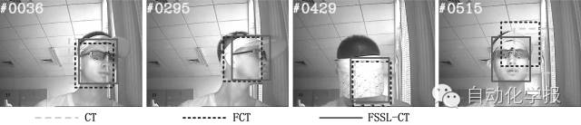

图7 Hat (第36、295、429、515帧)

Fig. 7 Hat (Frames 36、295、429、515)

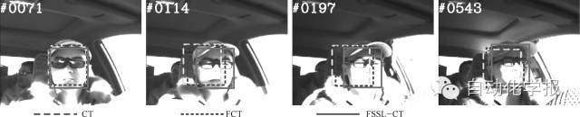

图8 DayLight1 (第71、114、197、543帧)

Fig. 8 DayLight1 (Frames 71、114、197、543)

引用格式

耿磊, 王学彬, 肖志涛, 张芳, 吴骏, 李月龙, 苏静静. 结合特征筛选与二次定位的快速压缩跟踪算法. 自动化学报,2016, 42(9): 1421-1431

作者简介

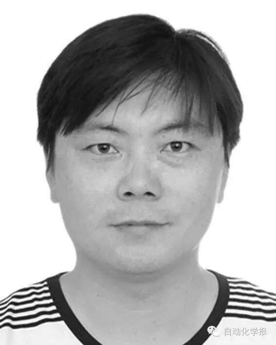

耿磊 天津工业大学电子与信息工程学院副教授. 2012 年获得天津大学精密仪器与光电子工程学院博士学位. 主要研究方向为图像处理与模式识别, 智能信号处理技术与系统, DSP 系统研发.

E-mail: genglei@tjpu.edu.cn

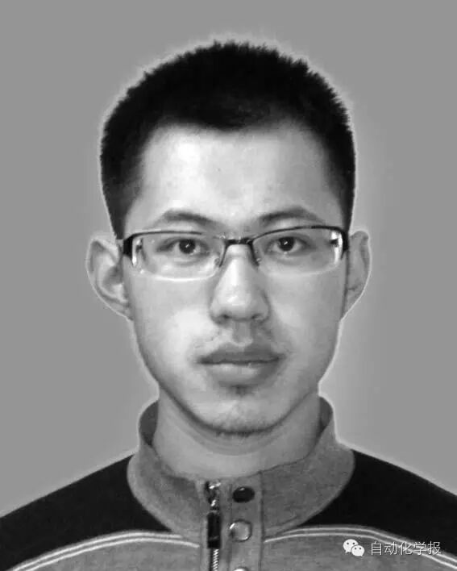

王学彬 天津工业大学电子信息与工程学院硕士研究生. 2013 年获得天津工业大学电子信息工程专业学士学位. 主要研究方向为模式识别, 机器学习.

E-mail: wangxuebin2014@sina.com

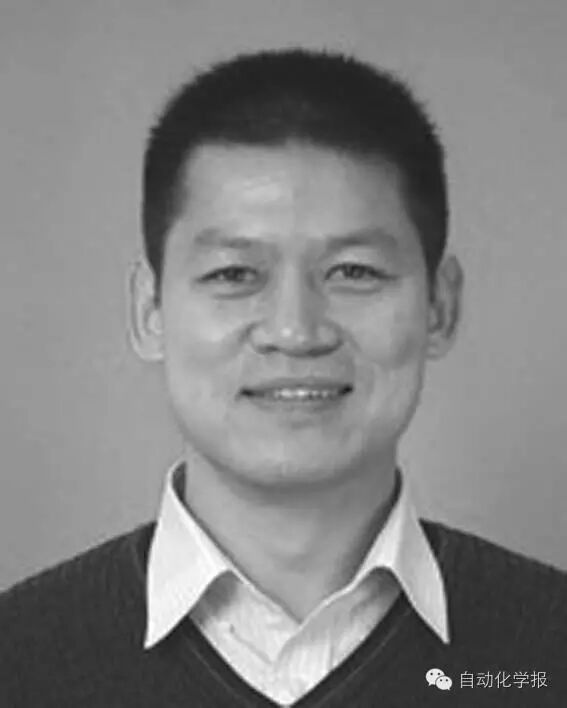

肖志涛 天津工业大学电子与信息工程学院教授. 2003 年获得天津大学电子信息工程学院博士学位. 主要研究方向为智能信号处理, 图像处理与模式识别. 本文通信作者.

E-mail: xiaozhitao@tjpu.edu.cn

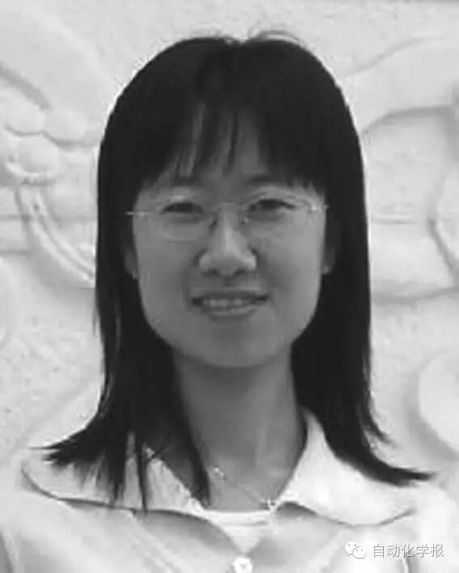

张芳 天津工业大学电子与信息工程学院副教授. 2009 年获得天津大学精密仪器与光电子工程学院博士学位. 主要研究方向为图像处理与模式识别, 光学干涉测量技术.

E-mail: hhzhangfang@126.com

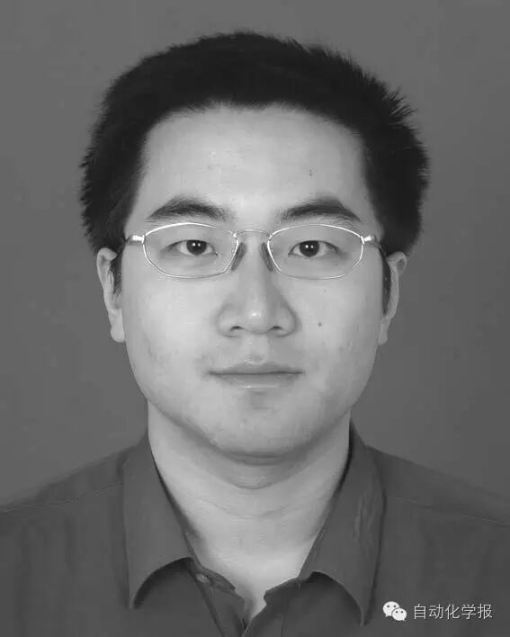

吴骏 天津工业大学电子与信息工程学院副教授. 2007 年获得天津大学电子信息工程学院博士学位. 主要研究方向为图像处理与模式识别, 人工神经网络.

E-mail: zhenkongwujun@163.com

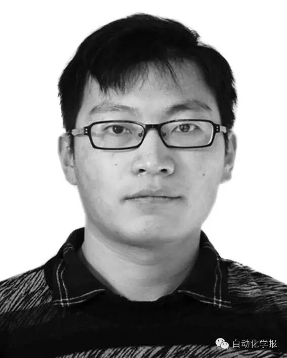

李月龙 天津工业大学计算机科学与软件学院副教授. 2012 年获得北京大学信息科学技术学院计算机专业博士学位,2015 年英国约克大学公派访问学者. 主要研究方向为计算机视觉, 模式识别, 轮廓提取, 人脸识别.

E-mail: liyuelong@pku.edu.cn

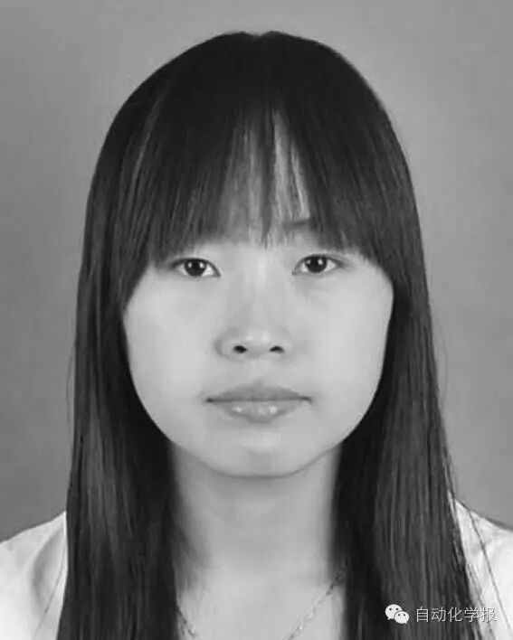

苏静静 天津工业大学硕士研究生.2014 年获得北华航天工业学院电子与信息工程专业学士学位. 主要研究方向为模式识别, 机器学习.

E-mail: 1065250074@qq.com

欢迎扫描二维码、长按图片识别关注《自动化学报》中文版订阅号aas1963，服务号自动化学报和英文版服务号！

