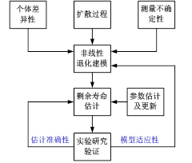

# 考虑不确定测量和个体差异的非线性随机退化系统剩余寿命估计

原创 自动化学报 2017-03-24 14:29 北京

> 原文地址: [https://mp.weixin.qq.com/s/9wU6Wq33WxSVtRrGVgOP2w](https://mp.weixin.qq.com/s/9wU6Wq33WxSVtRrGVgOP2w)

在预测与健康管理技术中，准确预测系统剩余寿命是能否做出正确维护决策的关键和前提，也是工程实践的重难点问题。对于复杂随机退化设备，随机多变的退化演变规律一般难以机理建模，而传统的基于寿命数据的方法对于小样本、高成本的设备则难以实施。因此，基于状态监测数据进行退化建模和剩余寿命预测，进而实现管理决策的技术成为了当前可靠性工程领域的热点。

在工程实际中，由于系统与系统之间的差异、经历的不同环境，退化信号一般具有非线性和随机性特征，例如，金属疲劳裂纹增长、陀螺仪精度降低和锂电池容量减小等。因此，对于随机退化系统，要得到其确定的剩余寿命估计是非常困难的，而通过概率密度函数来表示则更为合理且是管理决策所需要的。然而，不确定性测量和系统间的个体差异性广泛存在于系统的退化过程中，导致系统寿命的不确定性。如何将不确定测量和个体差异性的影响融入到剩余寿命分布中，实现对此类非线性随机退化系统更准确的剩余寿命预测，是值得研究的现实问题，且尚未解决。

基于退化建模的方法进行剩余寿命估计与传统基于历史寿命数据的方法相比，无论从经济性还是安全性上都表现出更大的优势。其中，针对非线性随机退化过程现有文献大多采用如下方法：

1）假设存在某些针对退化数据的转换技术（如对数变换、时间尺度变换等），将非线性特征的数据转换为近似线性的数据，再利用线性随机过程进行建模，但并不是所有非线性退化过程都可以转换为线性过程。

2）采用蒙特卡洛方法和粒子滤波方法估计出非线性退化过程的剩余寿命，但此类方法只能得到近似数值解，并不能获取健康管理所需的概率密度函数的解析解。

3）通过对非线性随机模型的时间-空间变换，将非线性随机过程首达固定失效阈值的问题转换为标准Brown运动首达时变边界问题，进而得到剩余寿命分布的解析渐进解，但该方法未同时考虑个体差异下和不确定测量对剩余寿命估计的影响。

本文

针对非线性随机退化系统，在非线性随机模型的时间-空间变换的基础上，提出了一种同时考虑不确定测量和个体差异的非线性退化过程建模和剩余寿命估计方法。具体如图所示。首先，基于扩散过程建立了一般化的非线性退化模型，该模型不仅能够描述退化过程的非线性，而且能体现不同系统退化的差异性和测量误差导致的测量不确定性。然后推导了同时考虑不确定测量与个体差异下的剩余寿命分布。进一步，利用极大似然估计得到模型参数初值，再通过建立的状态空间模型和Kalman滤波技术对漂移系数进行自适应估计。最后，将所提方法应用于疲劳裂纹和陀螺仪的监测数据，结果表明本文方法显著优于仅考虑不确定测量或仅考虑个体差异的寿命估计方法，具有潜在的工程应用价值。

引用格式

郑建飞, 胡昌华, 司小胜, 张正新, 张鑫. 考虑不确定测量和个体差异的非线性随机退化系统剩余寿命估计. 自动化学报, 2017, 43(2): 259-270

作者简介

郑建飞 火箭军工程大学控制工程系博士研究生. 主要研究方向为预测与健康管理, 可靠性和预测维护.

E-mail: zjf302@126.com

胡昌华 火箭军工程大学控制工程系教授. 主要研究方向为故障诊断, 可靠性工程. 本文通信作者.

E-mail: hch6603@263.net

司小胜 火箭军工程大学控制工程系讲师. 主要研究方向为预测与健康管理，剩余寿命估计和可靠性.

E-mail: sxs09@mails.tsinghua.edu.cn

张正新 火箭军工程大学控制工程系博士研究生. 主要研究方向为预测与健康管理, 预测维护和寿命估计.

E-mail: zhangzhengxin13@gmail.com

张鑫 火箭军工程大学控制工程系博士研究生. 主要研究方向为故障诊断技术与寿命预测.

E-mail: 15691867358@163.com

微信服务号：自动化学报

微信订阅号：aas1963

新浪微博：自动化学报

新浪博客：Automation\_2011

联系我们：

Tel:  010-82544653（日常咨询和稿件处理） 

        010-82544677（录用后稿件处理）

Fax: 010-82544497

Email: aas@ia.ac.cn（日常咨询和稿件处理）

          aas\_editor@ia.ac.cn（录用后稿件处理）

http://www.aas.net.cn

