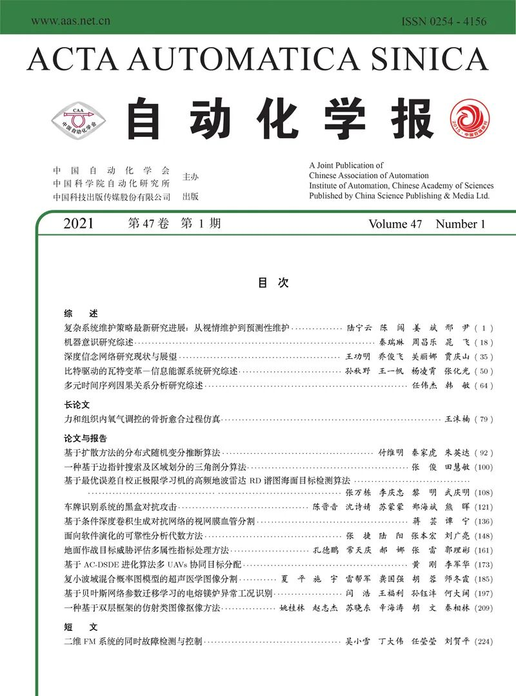
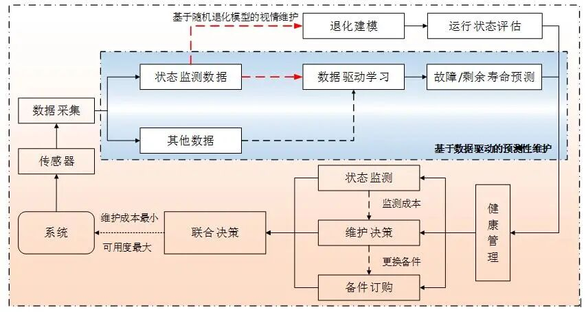
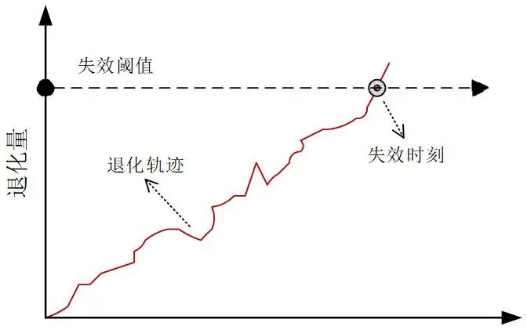
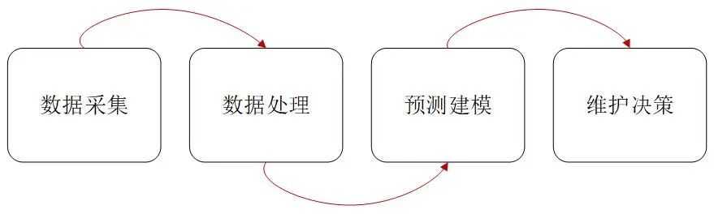
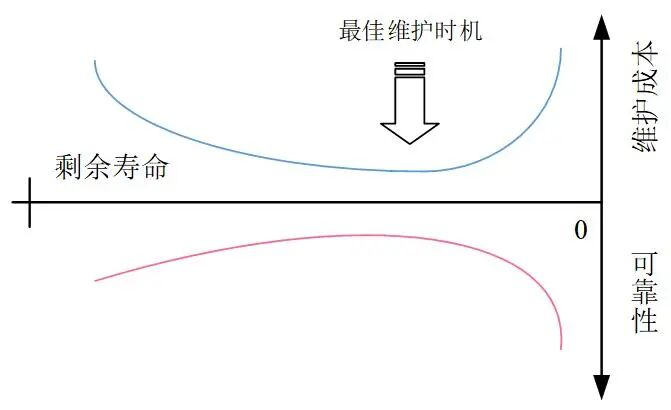
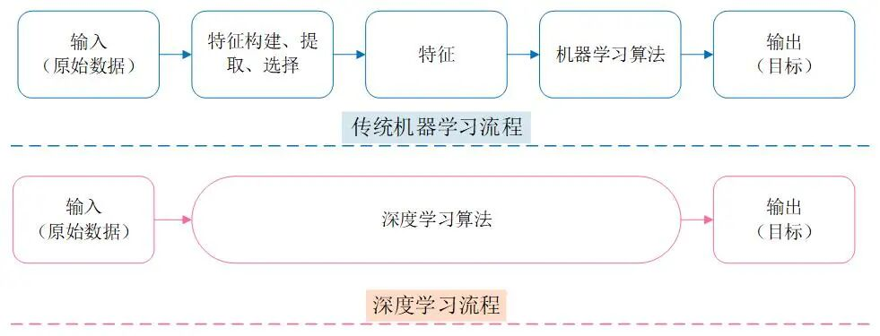

# 陆宁云, 姜斌等：复杂系统维护策略最新研究进展: 从视情维护到预测性维护

原创 自动化学报 自动化学报 2021-02-05 16:22 北京

> 原文地址: [https://mp.weixin.qq.com/s/FswYOggE\_aIDN4NvHs1jmQ](https://mp.weixin.qq.com/s/FswYOggE_aIDN4NvHs1jmQ)

**点击蓝字**

**关注我们**

  

在今年的**第1期中包含****5篇综述，1篇长论文**，大概是除去专刊以外含金量最高的一期，强力推荐您阅读！本文推介的是第一篇综述。

  

陆宁云, 陈闯, 姜斌, 邢尹. 复杂系统维护策略最新研究进展: 从视情维护到预测性维护. 自动化学报, 2021, 47(1): 1−17

_http://www.aas.net.cn/cn/article/doi/10.16383/j.aas.c200227?viewType=HTML_

**第1期 重点推介文章**

  

**综述**

陆宁云, 陈闯, 姜斌, 邢尹. 复杂系统维护策略最新研究进展: 从视情维护到预测性维护. 自动化学报, 2021, 47(1): 1−17  

http://www.aas.net.cn/cn/article/doi/10.16383/j.aas.c200227?viewType=HTML 

  

秦瑞琳, 周昌乐, 晁飞. 机器意识研究综述. 自动化学报, 2021, 47(1): 18−34  

http://www.aas.net.cn/cn/article/doi/10.16383/j.aas.c200043?viewType=HTML 

  

王功明, 乔俊飞, 关丽娜, 贾庆山.深度信念网络研究现状与展望.自动化学报, 2021, 47(1): 35-49  

http://www.aas.net.cn/cn/article/doi/10.16383/j.aas.c190102?viewType=HTML 

  

孙秋野, 王一帆, 杨凌霄, 张化光. 比特驱动的瓦特变革—信息能源系统研究综述. 自动化学报, 2021, 47(1): 50−63  

http://www.aas.net.cn/cn/article/doi/10.16383/j.aas.c200634?viewType=HTML 

  

任伟杰, 韩敏. 多元时间序列因果关系分析研究综述. 自动化学报, 2021, 47(1): 64−78

http://www.aas.net.cn/cn/article/doi/10.16383/j.aas.c180189?viewType=HTML 

  

**长论文**

  

王沫楠.力和组织内氧气调控的骨折愈合过程仿真.自动化学报, 2021, 47(1): 79-91  

http://www.aas.net.cn/cn/article/doi/10.16383/j.aas.c180428?viewType=HTML 

  

**（点击封面，了解更多）**  

  

**复杂系统维护策略最新研究进展: 从视情维护到预测性维护**

  

**维护决策：**维护是为保持或恢复系统处于能执行规定功能的状态所进行的所有技术和管理。对于已发生或可能发生异常的系统，不但需要采取维护，还需要研究如何在维护成本、资源损耗与生产效益之间决策出最优平衡点，由此确定效率最高的维护方式，以达到减少损失、提高可靠性等目的。

  

陆宁云, 陈闯, 姜斌, 邢尹. 复杂系统维护策略最新研究进展: 从视情维护到预测性维护. 自动化学报, 2021, 47(1): 1−17

_http://www.aas.net.cn/cn/article/doi/10.16383/j.aas.c200227?viewType=HTML_

  

对于复杂、可修复的工程系统，设备维护是确保系统安全性、可靠性、可用性的重要手段之一。系统维护策略已经历修复性维护、定时维护、视情维护等多种维护策略。其中，视情维护是目前最受关注的维护策略，它通过收集和评估系统的实时状态信息进行维护决策，具有全寿命周期内系统可靠性高、运营维护成本低等优点。

  

根据决策支持技术的不同，视情维护可以划分为：

1）基于随机退化模型的视情维护；

2）基于数据驱动的预测性维护。

  

_图1  系统视情维护决策的全过程_

  

**1\. 基于随机退化模型的视情维护**

  

基于随机退化模型的视情维护主要利用数理统计以及随机过程的相关知识，建立随机过程模型来描述系统性能退化轨迹，并通过收集和评估系统实时状态信息进行维护决策。

  

_图2  退化过程及失效阈值失效示意图_

  

 当无法获得系统退化状态的精确测量值时，通常采用离散状态建模手段，如马尔科夫过程模型。基于马尔科夫过程的退化建模具有如下几个特点：

  

1）马尔科夫模型能够模拟许多系统的设计及其故障场景；

2）马尔科夫模型开发时计算效率高；

3）马尔科夫模型适用于不完整的数据集，决策中能够很好地处理不确定因素。

  

如果系统状态随着时间的不断推移具有连续退化特性，且系统具有实时可观测的状态量，则应使用连续状态退化模型描述其退化过程。现有文献中主要涉及三种连续状态退化模型：伽玛过程、维纳过程和逆高斯过程。

  

伽玛过程模型于1975年被引入可靠性领域，当退化过程具有不确定、非递减特征时，可将其视为伽玛过程。伽玛过程在视情维护中得到广泛应用的主要优势在于：

  

1）伽玛过程便于数学上的分析和计算；

2）伽玛过程适用于建模随时间逐渐累积的渐进式损伤，例如，磨损、疲劳、腐蚀、裂纹增长、蠕变和膨胀等；

3）伽玛过程模型的包容性较好，可与灰色模型、极大似然估计、矩估计、贝叶斯理论以及专家知识等多种方法结合使用。

  

维纳过程是一种重要的独立增量过程模型，适合描述系统性能随时间推移非单调退化的过程.。由于维纳过程模型能够描述多种典型产品的退化过程，并且具有良好的计算性质，因而逐渐成为视情维护领域最常用的退化模型之一。基于维纳过程的退化建模优势在于：

  

1）维纳过程源于带有线性漂移项的布朗运动，能够描述非单调的退化过程，以及实际退化中的“自愈”现象；

2）维纳过程的增量服从高斯分布，不仅有利于模型参数的估计，而且为剩余寿命解析概率分布的推导提供了有力保证；

3）维纳过程也便于数学上的分析和计算。

  

和伽玛过程相类似，逆高斯过程也适合对具有单调退化轨迹的系统进行建模。然而，由于逆高斯过程不像伽玛过程那样有直观的物理可解释性，并未在系统退化建模领域得到广泛研究与应用。

  

**2\. 基于数据驱动的预测性维护**

  

基于数据驱动的预测性维护可以不依赖于系统的退化机理模型，其决策信息也不局限于系统的状态监测数据，而是通过挖掘系统健康状态相关的“大数据”，获得设备剩余使用寿命等更准确的系统维护决策信息，从而实现更为行之有效的维护策略，以减少机器停机时间，改善生产流程。

  

_图3  数据驱动预测性维护的一般步骤_

  

基于数据驱动的预测性维护流程主要包括数据采集、数据处理、预测建模和维护决策四个步骤。其中，预测建模是整个过程的关键步骤，它为维护决策提供了重要输入信息，预测信息的准确与否直接影响到维护策略的制定效果。对于数据驱动的预测建模，机器学习及其在此基础上发展而来的深度学习是主流的技术。

  

_图4  在线寿命预测与维护决策之间的关系_

  

机器学习（如逻辑回归、人工神经网络、支持向量机、决策树、随机森林等）在预测性维护中的研究，具备如下特点：

  

1）机器学习模型较为简单，容易根据实际设计要求进行更改；

2）机器学习模型对计算机硬件要求不高，计算成本低；

3）机器学习模型的超参数调整技术较为成熟；

4）机器学习算法中涉及直接的特征工程技术，而这些特征提取算法很容易解释和理解。

  

随着大数据时代的来临，系统装备运行状态的监测数据呈现出容量大、多样性强、产生速度快等特点。传统的浅层机器学习算法很大程度上依赖于专家经验知识和信号处理技术，难以处理这些海量监测数据。而最近发展起来的深度学习技术能够在没有信号处理专业知识的情况下自动提取和构造有用信息，为海量监测数据的处理提供了一种解决思路。

  

_图5  传统机器学习和深度学习流程_

  

深度学习（如深度置信网络、卷积神经网络、递归神经网络等）在预测性维护中的研究，具备如下特点：

  

1）深度学习属于端到端的学习，不需要手动设计特征，方便快捷；

2）深度学习技术可以更容易地适应不同的领域和应用，对复杂动态系统的建模表现出了强大优势；

3）深度学习高度依赖数据，数据量越大，它的表现就越好。

  

**3\. 未来展望**

  

当前，视情维护和预测性维护仍然属于战略新兴方法，仍然存在一些明显的挑战性问题亟待解决。具体概括如下：

  

1）数据的有效性；

2）面向视情维护的友好实用的计算机程序开发；

3）考虑相互影响的多部件系统的视情维护决策研究；

4）考虑人为因素的视情维护决策优化研究；

5）基于深度学习和退化过程模型的融合技术研究；

6）状态监测、寿命预测和维护决策的联合研究。

  

从工程实践的角度，前两个问题深刻制约着视情维护决策理论方法向工程实践的转化。从理论研究的角度，后四个问题则制约着所提出的视情维护决策方法在电气、电子、机电产品等复杂、敏感系统中的适用性情况。

  

**作者简介**

  

**陆宁云**

南京航空航天大学自动化学院教授。主要研究方向为过程监测、故障诊断、预测维护理论与应用。本文通信作者。

E-mail: luningyun@nuaa.edu.cn

  

**陈  闯**

南京航空航天大学自动化学院博士研究生。主要研究方向为基于数据驱动的故障预测与健康管理。

E-mail: chenchuang@nuaa.edu.cn

  

**姜  斌**

南京航空航天大学自动化学院教授。主要研究方向为智能故障诊断与容错控制及其在飞机、卫星和高速列车上的应用。

E-mail: binjiang@nuaa.edu.cn

  

**邢  尹**

河海大学地球科学与工程学院博士研究生。主要研究方向为基于数据驱动的滑坡灾害预测。

E-mail: xingyincc@163.com

  

**热点文章**

[孙长银, 吴国政, 王志衡等：自动化学科面临的挑战](http://mp.weixin.qq.com/s?__biz=MzAwMzAzMDgxOA==&mid=2651070248&idx=1&sn=a02af679240552bf79b3dd01100be89b&chksm=8131d565b6465c73532b22b11e92c8dd87b72d269f79fe53a2e3050fa996cc8ab1fec676659c&scene=21#wechat_redirect)

[值得收藏！SCI论文中的常用句式全总结](http://mp.weixin.qq.com/s?__biz=MzAwMzAzMDgxOA==&mid=2651069425&idx=1&sn=c945766f5d7f2ada8a217b981dcc734c&chksm=8131d1bcb64658aa80092eb53e1ead905ab02fc7a9f035e798e57d6407472ef688e8f7f0e831&scene=21#wechat_redirect)

[收藏！SCI论文经典词和常用句型汇总](http://mp.weixin.qq.com/s?__biz=MzAwMzAzMDgxOA==&mid=2651069036&idx=1&sn=961c952c84a07355dc70d4bb8291ce25&chksm=8131d021b6465937c80cf41a3118a5ad92a752cb3979f22d5964a741269a1df1987a37185a31&scene=21#wechat_redirect)

[吴国政等：浅析人工智能学科基金项目申请资助情况及展望](http://mp.weixin.qq.com/s?__biz=MzAwMzAzMDgxOA==&mid=2651068994&idx=1&sn=bca1ddc9774ad59ff1459a32883be60f&chksm=8131d00fb646591928654c4880aa609305efa30b538c0c431d8c8138df4401fcc87e80a131e0&scene=21#wechat_redirect)

[段广仁院士：高阶系统方法—Ⅲ. 能观性与观测器设计](http://mp.weixin.qq.com/s?__biz=MzI2NjA3MzM5MA==&mid=2649956510&idx=1&sn=7aa3652a7908ccd9621b47023dc25103&chksm=f29424dfc5e3adc938a51b7b1620a6f47911c974153f94b2c38cfdc37536b750195fbc4be8a4&scene=21#wechat_redirect)

[段广仁院士：高阶系统方法— II. 能控性与全驱性](http://mp.weixin.qq.com/s?__biz=MzI2NjA3MzM5MA==&mid=2649956009&idx=1&sn=d887902e385f28ddea0fcb569208bb86&chksm=f2941ae8c5e393feccb4347c9a3afbe191007f67323747782405b9ca5c754ba6e16017557786&scene=21#wechat_redirect)

[段广仁院士：高阶系统方法— I. 全驱系统与参数化设计](http://mp.weixin.qq.com/s?__biz=MzI2NjA3MzM5MA==&mid=2649955943&idx=1&sn=7d2e161c5d48ea877709b94ef706a3af&chksm=f2941a26c5e3933077b5c9ef2cf38af1087f3f074454251d441433f1c53861ddd85386b7a260&scene=21#wechat_redirect)

[陈虹教授等：智能时代的汽车控制](http://mp.weixin.qq.com/s?__biz=MzAwMzAzMDgxOA==&mid=2651065976&idx=1&sn=d6daa2fafd8e723a0238c5566cf1641c&chksm=8131c435b6464d23449b163afedd37f20a5d7598fe6684c6b011d19554e0ed38ef031fbf2ec9&scene=21#wechat_redirect)

[科研必备！盘点常用文献管理工具](http://mp.weixin.qq.com/s?__biz=MzI2NjA3MzM5MA==&mid=2649956322&idx=1&sn=aa1f98bb307dda70981e073546c973c4&chksm=f2941ba3c5e392b58981c27b2ea1334ef149e0b9eb126ac62453537db789a694cc35f72cac09&scene=21#wechat_redirect)

[吴子牛教授: 浅谈论文写作](http://mp.weixin.qq.com/s?__biz=MzI2NjA3MzM5MA==&mid=2649955566&idx=1&sn=3df5d36d46f533cae96361a987e914db&chksm=f29418afc5e391b97525c9f5193e21d92517dc58041e51509d0e5fb7f25938a7e601e414e46b&scene=21#wechat_redirect)

[刘洋教授: 浅谈研究生学位论文选题方法](http://mp.weixin.qq.com/s?__biz=MzI2NjA3MzM5MA==&mid=2649955575&idx=1&sn=b0cba28d16eb2af6672862064dca2ac8&chksm=f29418b6c5e391a0af6810385fdc25c36fade0562348469a5b28195b9c46309ee1c7b873c280&scene=21#wechat_redirect)

[张军平教授: 论文选题与写作](http://mp.weixin.qq.com/s?__biz=MzI2NjA3MzM5MA==&mid=2649955604&idx=1&sn=1b2dab0efab5528e57ce3b80a69f70e0&chksm=f2941955c5e390434fb1bc78bbd754f6209f2c75ba841c3023aadf8681c4f6b6784cf3f2af84&scene=21#wechat_redirect)

[【热点综述】2019年综述TOP20](http://mp.weixin.qq.com/s?__biz=MzI2NjA3MzM5MA==&mid=2649955584&idx=1&sn=b6460d48b4c365e8062c2b45bbcf8e38&chksm=f2941941c5e390574162e362028c22a441fa00ffbc0634599685c34f8a3a3446eaf90b8c0723&scene=21#wechat_redirect)

[【热点综述】2019年最新文章](http://mp.weixin.qq.com/s?__biz=MzI2NjA3MzM5MA==&mid=2649955359&idx=1&sn=cd768b5f2572472b6465c3f06b21a803&chksm=f294185ec5e3914807e5a5c9ec3143c15eb94a38ae51f5608acbc21b9b16cd20da65649401e0&scene=21#wechat_redirect)

[国家科技重大专项&重点研发计划等资助论文精选](http://mp.weixin.qq.com/s?__biz=MzI2NjA3MzM5MA==&mid=2649955416&idx=1&sn=152515bf1cc9800199a8da3d456f6b54&chksm=f2941819c5e3910ff3f98d74e2aae494046b5dbb6f6096c3d5c0c3d5ba134cf10f5e7af5bb86&scene=21#wechat_redirect)

[国家自然科学基金资助论文精选（二）](http://mp.weixin.qq.com/s?__biz=MzI2NjA3MzM5MA==&mid=2649955406&idx=2&sn=be8a73e34b097480f593ad399d4ce4d1&chksm=f294180fc5e39119440ddd930d887fd848daf3104587519b2295e2e32d97a5cb9cfd7f4e7bc3&scene=21#wechat_redirect)

[国家自然科学基金资助论文精选（一）](http://mp.weixin.qq.com/s?__biz=MzI2NjA3MzM5MA==&mid=2649955406&idx=1&sn=3c905081a57f1deb156b9f6f12b57a56&chksm=f294180fc5e3911966de31a290e784e8d5856902968fb29b3d3242a2e2d26104d526d217c79b&scene=21#wechat_redirect)  

[【前沿速递】机器人领域热点综述](http://mp.weixin.qq.com/s?__biz=MzI2NjA3MzM5MA==&mid=2649955259&idx=1&sn=c6aaf28c985bc4535380e5e774cac040&chksm=f2941ffac5e396ec6562e95c6ab505f84a1ad6f6f3f558a1a13abe94ec0a3db42a984830dec8&scene=21#wechat_redirect)

[【好文推荐】智能交通文集](http://mp.weixin.qq.com/s?__biz=MzI2NjA3MzM5MA==&mid=2649955221&idx=1&sn=9fc1c9e36a890e83da22882421bd8a14&chksm=f2941fd4c5e396c2bd720a9d9e007ffb1e8dd88fde551cfa3b5a41a527458ebc340522a4b669&scene=21#wechat_redirect)

[【热点专题】流程工业自动化](http://mp.weixin.qq.com/s?__biz=MzI2NjA3MzM5MA==&mid=2649955342&idx=1&sn=0301d93b276aaaf27fe36d71ee2c841d&chksm=f294184fc5e391596cf037d93097ab69ee48b5a3c36c5fd5dfdaa14a302c445a9ec4cf9dab11&scene=21#wechat_redirect)[专题](http://mp.weixin.qq.com/s?__biz=MzI2NjA3MzM5MA==&mid=2649955342&idx=1&sn=0301d93b276aaaf27fe36d71ee2c841d&chksm=f294184fc5e391596cf037d93097ab69ee48b5a3c36c5fd5dfdaa14a302c445a9ec4cf9dab11&scene=21#wechat_redirect)  

[【热点专题】数据驱动控制、学习及优化专题](http://mp.weixin.qq.com/s?__biz=MzI2NjA3MzM5MA==&mid=2649955310&idx=1&sn=9565312b88fe3ed17b199d148f22f191&chksm=f2941fafc5e396b93c014d1ab5d33c8f1da2a2d293843bcb814d5131b29677dfd4e38ff5699d&scene=21#wechat_redirect)

[【热点专题】模糊系统专题](https://mp.weixin.qq.com/s?__biz=MzI2NjA3MzM5MA==&mid=2649955382&idx=1&sn=07f211b9dd9d8c222f96d59f9960fd4f&chksm=f2941877c5e3916198db46714ecd96c3273dc248fa10dc75f84212a2531159e31f25f40c73c2&scene=21&token=684109038&lang=zh_CN#wechat_redirect)

  

**期刊目录**

[2021年第01期](http://mp.weixin.qq.com/s?__biz=MzI2NjA3MzM5MA==&mid=2649958084&idx=1&sn=24c140a6a1957eb7f4164689ed2840a5&chksm=f2942285c5e3ab93c5ed6127ad93e76ded82ae657ca79f7ead390387fbe2a72cb6df0ec6dcd2&scene=21#wechat_redirect)

[《自动化学报》2020年全年合集](http://mp.weixin.qq.com/s?__biz=MzI2NjA3MzM5MA==&mid=2649957972&idx=1&sn=1951847aacbcb7d22bdd2a46a79af871&chksm=f2942215c5e3ab03d070d8e52b8764b38036897c97b6a26c7a1f918c806b28edbe6c0fbf7ea9&scene=21#wechat_redirect)

[2020年第10期 工业人工智能专题](http://mp.weixin.qq.com/s?__biz=MzI2NjA3MzM5MA==&mid=2649957201&idx=1&sn=ab82a767bd716ab67fdf2942500d8b61&chksm=f2942710c5e3ae06b27f9e63a5e329a1123d90b051164e6b6123c500230541b1ed12d92abbfb&scene=21#wechat_redirect)

[2020年第09期 分布式信息能源系统理论与应用专题](http://mp.weixin.qq.com/s?__biz=MzI2NjA3MzM5MA==&mid=2649956412&idx=1&sn=8ebc13d63fd333ad85dbb8b5825df248&chksm=f294247dc5e3ad6ba297857a5b957e97cf499266c50318791fa8abd9432ecf1d9c3d9b287e36&scene=21#wechat_redirect)

[2019年第12期 智能轨道交通系统专刊](http://mp.weixin.qq.com/s?__biz=MzI2NjA3MzM5MA==&mid=2649955524&idx=1&sn=a76b97bf832e984f0155acc0fb367bc7&chksm=f2941885c5e391935c353c88072e806cb0b5b9b78b1f7b23b3c6f4b8c6a2c12f72557f87b56b&scene=21#wechat_redirect)  

[2019年第01期 信息物理融合系统理论与应用专刊](http://mp.weixin.qq.com/s?__biz=MzI2NjA3MzM5MA==&mid=2649955194&idx=2&sn=fb75bc8af9672922fa20efe2d30ff6c9&chksm=f2941f3bc5e3962db43689d03a54a0e40d83cb0e69fb9c48e87c0325b5bdf1b71028ebbbba0a&scene=21#wechat_redirect)

  

**期刊动态**

[《自动化学报》致谢审稿人](http://mp.weixin.qq.com/s?__biz=MzI2NjA3MzM5MA==&mid=2649957872&idx=1&sn=e642c48a6d17dc0f99d2f3879446ecab&chksm=f29421b1c5e3a8a7b4e5cf8564d2f0713d3bcec5186ef4684875caf67dd096659450c96f31ce&scene=21#wechat_redirect)

[自动化学报蝉联百种中国杰出期刊称号，入选中国精品科技期刊](http://mp.weixin.qq.com/s?__biz=MzI2NjA3MzM5MA==&mid=2649957485&idx=1&sn=8af865466cb6f52b05a1e41af8549e71&chksm=f294202cc5e3a93a40b4850e6e0f0bccaf56c89591e049e9d98bfe9a598913f5d25e8ecfcf8d&scene=21#wechat_redirect)

[《自动化学报》挺进世界期刊影响力指数Q1区](http://mp.weixin.qq.com/s?__biz=MzI2NjA3MzM5MA==&mid=2649957452&idx=1&sn=c5fa8ac9c581e4ae3de2e7956e603dca&chksm=f294200dc5e3a91bb250e25fd6f7e47dc1114ad6fdf1762a7bfc440f789a059f1de455584e66&scene=21#wechat_redirect)

[《自动化学报》多名作者入选科睿唯安2020年度高被引科学家](http://mp.weixin.qq.com/s?__biz=MzI2NjA3MzM5MA==&mid=2649957295&idx=1&sn=597189346218d96d9906447a50281084&chksm=f29427eec5e3aef8d0662def8a0afcde2d2f3f828ae8208a52b14fc72169cedc5d81c06185a9&scene=21#wechat_redirect)

[自动化学报排名第一，被评定为中国中文权威期刊](https://mp.weixin.qq.com/s?__biz=MzI2NjA3MzM5MA==&mid=2649956509&idx=1&sn=1e39aaf65dc579606cf36258be8e1744&scene=21#wechat_redirect)

  

  

**长按二维码｜关注我们**

**IEEE/CAA Journal of Automatica Sinica (JAS)**

**长按二维码｜关注我们**

**《自动化学报》服务号**

**长按二维码｜关注我们**

**《自动化学报》订阅号**  

  

**联系我们**

**网站:** 

http://www.aas.net.cn

http://www.ieee-jas.org

**投稿:** 

https://mc03.manuscriptcentral.com/aas-cn   

https://mc03.manuscriptcentral.com/ieee-jas 

**电话:**  010-82544653（日常咨询和稿件处理） 

           010-82544677（录用后稿件处理）

**邮箱:**  aas@ia.ac.cn（日常咨询和稿件处理）  

           aas\_editor@ia.ac.cn（录用后稿件处理）

**博客:** 

http://blog.sina.com.cn/aaseditor 

  

**↓ 点击下方 阅读原文 了解更多**