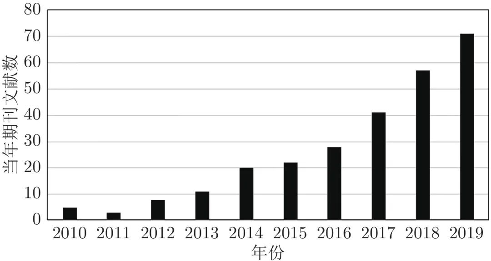
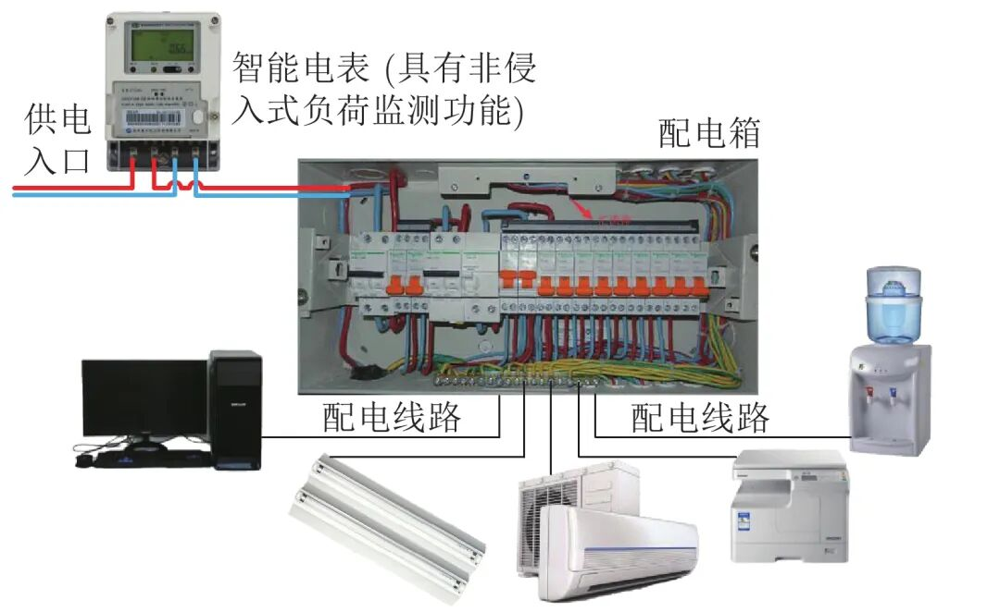
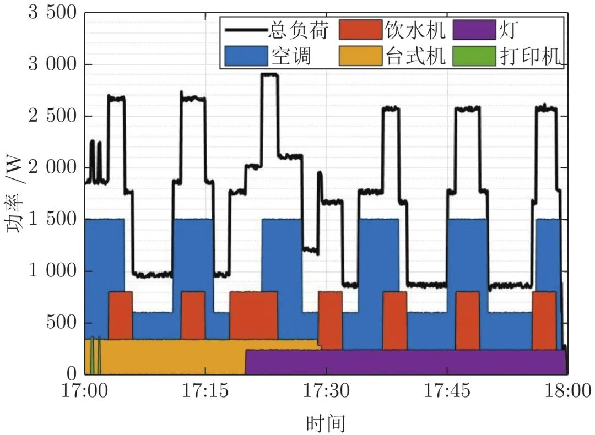
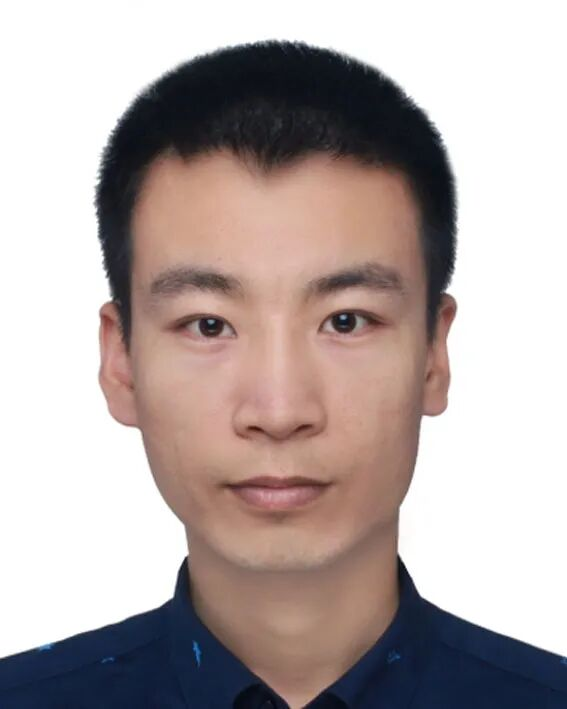
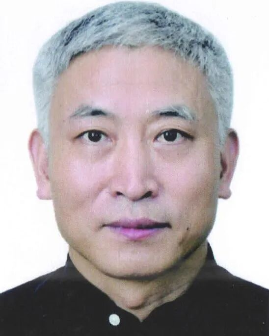
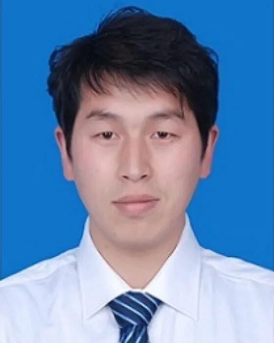
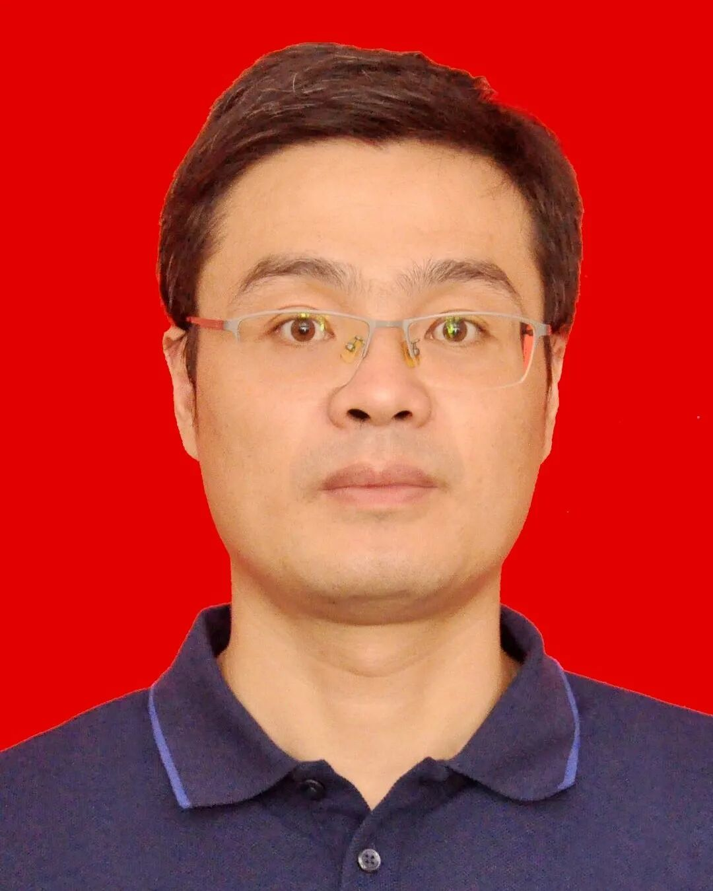

# 非侵入式负荷监测综述

原创 自动化学报 自动化学报 2022-02-23 17:03 北京

> 原文地址: [https://mp.weixin.qq.com/s/KVl-qv1Bgh7imRH3AJRydw](https://mp.weixin.qq.com/s/KVl-qv1Bgh7imRH3AJRydw)

**点击蓝字 关注我们**

  

**引****用本文**

  

邓晓平, 张桂青, 魏庆来, 彭伟, 李成栋. 非侵入式负荷监测综述. 自动化学报, 2022, 48(3): 644−663. doi: 10.16383/j.aas.c200270   

Deng Xiao-Ping, Zhang Gui-Qing, Wei Qing-Lai, Peng Wei, Li Cheng-Dong. A survey on the non-intrusive load monitoring. Acta Automatica Sinica, 2022, 48(3): 644−663. doi: 10.16383/j.aas.c200270

http://www.aas.net.cn/cn/article/doi/10.16383/j.aas.c200270?viewType=HTML

  

**文章简介**

  

**关键词**

  

非侵入式负荷监测, 负荷分解, 特征提取, 隐马尔科夫模型, 深度学习

  

**摘   要**

  

非侵入式负荷监测通过对总负荷电表数据进行分析处理, 能够实现对各个用电设备及其工作状态的辨识, 可广泛应用于建筑节能、智慧城市、智能电网等领域. 近年来, 随着智能电表的大规模部署以及各类机器学习算法的广泛应用, 非侵入式负荷监测引起了学术界与工业界的共同关注. 本文对非侵入式负荷监测方面的研究进行综述. 首先提炼非侵入式负荷监测的问题模型及基本框架; 然后分别对非侵入式负荷监测的数据采集与预处理过程、负荷分解模型与方法、常用数据集及评估指标进行归纳总结; 最后, 对目前研究中存在的挑战进行分析, 并对未来的研究方向进行展望.

  

**引   言**

  

非侵入式负荷监测(Non-intrusive load monitoring, NILM)也称为负荷分解(Load disaggregation), 其通过对某一特定区域的总电表数据进行分析, 可获取该范围内各用电负荷的相关信息, 如负荷的数量、各负荷的类别、所处工作状态以及对应的能耗使用情况等. 相对于传统监测方式, 非侵入式负荷监测不需要为用户的每个用电设备安装测量装置便能获得各个用电设备的运行情况, 一方面节省了传感设备的购置费用; 另一方面免去了对现有用电设备线路逐一改造及维护的麻烦, 是一种便捷、成本低、通用性强的监测方式. 同时, 它在一定程度上也实现了对用户隐私的保护. 非侵入式负荷监测得到的信息对于各用电参与方都有很大的实用价值. 对于普通用户, 如果通过负荷监测获取的设备详情可以及时得到反馈, 将有助于引导用户合理用电, 从而实现节能降耗, 节省电费开支. 对于电力公司, 非侵入式负荷监测在不明显提高投入的前提下, 可实现负荷各组成成分的细粒度感知, 提升电力系统负荷预测准确度, 提高电网的安全性及经济性, 还有助于更精准地对用户行为进行建模, 实现对用户的差异化、精准化服务. 对于用电设备制造商, 非侵入式负荷监测所提供的设备状态及对应的能耗信息, 能够为设备故障诊断提供依据或进一步实现对设备的预测性维护. 非侵入式负荷监测属于计算机、通信、电子与电气工程等学科的交叉应用, 可广泛应用于建筑节能、智慧城市、智能电网等领域.

  

近年来, 智能电表已经在世界各地得到广泛部署. 据统计数据显示, 截止到2016年底, 英国、美国和中国已经部署的智能电表数量已经分别达到290万、7200万和9600万台. 大规模部署的电表及其对应的通信网络与数据管理系统共同构成了面向用电的高级量测体系(Advanced metering infrastructure, AMI), 为海量细粒度电力消耗数据的采集、存储与管理提供了基础. 同时, 随着大数据分析、机器学习等技术的成熟应用, 电表数据中所蕴含的信息价值将能得到更为充分发挖掘, 而不仅限于传统的电费计量. 所以, 非侵入式负荷监测得到了工业界和学术界的广泛关注, 目前已经成为人工智能技术在建筑、电力等相关行业应用的研究热点.

  

为了对非侵入式负荷监测目前已有的研究情况进行全面而系统的总结, 我们使用WoS (Web of science)文献数据库查询了近10年来以非侵入式负荷监测为研究主题的相关文献, 其检索式为: TS = (“NILM” OR “NIALM” OR “Load Disaggregation” OR “Energy Disaggregation” OR “Non-Intrusive Load Monitoring” OR “Non-Intrusive Appliance Load Monitoring” OR “Nonintrusive Load Monitoring” OR “Nonintrusive Appliance Load Monitoring”) AND SU = (“Engineering” OR “Construction & Building Technology” OR “Electric \*” OR “ Computer \*” OR “Energy \*”) NOT SU = (“Chemistry \*” OR “Materials \*” OR “Health\*” OR “Medicine\*” OR “Optics\*” OR “Physics\*”). 检索命中文献728篇, 其中期刊论文266篇, 每年录入的期刊论文数量分布如图1所示.

  

图 1  WoS数据库中相关期刊论文数量分布(2010 ~ 2019)

  

从 图1中可以看出近10年来该领域的研究基本呈现不断增长态势, 尤其是从2015年开始, 新的研究成果大量发布. 其主要原因, 一方面是以AlexNet在2012年的ImageNet比赛中夺冠为标志, 激发了广大研究者使用机器学习相关算法尤其是深度学习方法进行数据处理的兴趣; 另一方面是自2011年该领域的第一个公开数据集 —— 参考用能分解数据集(Reference energy disaggregation dataset, REDD)发布后, 多个用于非侵入式负荷监测的公开数据集陆续发布, 为该领域的研究提供了数据基础.

  

不同行业领域的负荷组成及特性存在较大差异, 非侵入式负荷监测的应用场景划分可划分为工业、商用、住宅等几类. 其中住宅场景的应用模式相对固定、非侵入式监测需求相对明确, 目前已有的研究多集中于这一场景. 图2是一个用于办公室环境的非侵入式负荷监测系统, 图3给出了此系统对应的负荷分解示意图.

  

图 2  典型的非侵入式负荷监测系统框图

  

图 3  非侵入式负荷监测结果示意图

  

非侵入式负荷监测的挑战在于基于现有电表数据设计可广泛适用于不同场景的实时负荷分解算法. 尽管许多研究者在提升准确度、降低计算量、增强算法鲁棒性等方面做了大量的工作, 但由于用电负荷种类多样、各行业负荷组成各不相同、参数采集类型及时间精度各有差异、监测设备计算能力有限等因素, 非侵入式负荷监测在国内尚未得到成熟应用, 还存在不少挑战需要进一步研究克服.

  

本文对目前已有的非侵入式负荷监测方法及技术进行综述. 第1节提炼非侵入式负荷监测的问题模型并给出总体处理框架. 第2节介绍用于非侵入式负荷监测的数据采集与预处理过程, 分别对数据采集、事件检测及特征提取的方法进行梳理. 第3节总结现有的各类负荷分解模型及算法, 重点分析近五年来基于深度学习方法的研究进展. 第4节给出非侵入式负荷监测算法常用的评估指标. 第5节对有代表性的几个非侵入式负荷监测公开数据集进行汇总. 第6节对目前研究存在的问题进行分析总结, 并对未来的研究方向进行展望.

  

请点击左下角“**阅读原文**”了解更多！

  

**作者简介**

**邓晓平**

山东建筑大学信息与电气工程学院讲师. 2008年和2013年分别获武汉大学电子信息科学与技术学士学位和通信与信息系统博士学位. 主要研究方向为通信信号处理与时序信号分析.

E-mail: dengxiaoping19@sdjzu.edu.cn

**张桂青**

山东建筑大学信息与电气工程学院教授. 1986年获山东建筑大学学士学位, 2002年获西安交通大学博士学位. 主要研究方向包括智能控制方法、智能建筑、智能家居及物联网.

E-mail: qqzhang@sdjzu.edu.cn

**魏庆来**

中国科学院自动化研究所复杂系统管理与控制国家重点实验室副主任、研究员. 2009年获东北大学控制理论与控制工程专业博士学位. 主要从事智能控制、人工智能、自学习系统、自适应动态规划、自适应最优控制、数据驱动控制、神经网络控制、工业控制系统优化、智能电网等方面的研究工作.

E-mail: qinglai.wei@ia.ac.cn

**彭   伟**

山东建筑大学信息与电气工程学院讲师. 2015年获山东建筑大学硕士学位, 2018年获山东大学博士学位. 主要研究方向包括智能控制方法、物联网及智能建筑能效管理. 

E-mail: pengwei19@sdjzu.edu.cn

**李成栋**

山东建筑大学信息与电气工程学院教授. 2004年和2007年分别获山东大学学士和硕士学位, 2010获中科院自动化研究所博士学位. 主要研究方向为主要研究方向为人工智能方法及应用、智能建筑与智慧城市. 本文通信作者.

E-mail: lichengdong@sdjzu.edu.cn

  

**相关文章**

**（请向上滑动阅读）**

  

\[1\]  赵光财, 林名强, 戴厚德, 武骥, 汪玉洁. 一种锂电池SOH估计的KNN-马尔科夫修正策略. 自动化学报, 2021, 47(2): 453-463. doi: 10.16383/j.aas.c180124

http://www.aas.net.cn/cn/article/doi/10.16383/j.aas.c180124?viewType=HTML

  

\[2\]  侯建华, 张国帅, 项俊. 基于深度学习的多目标跟踪关联模型设计. 自动化学报, 2020, 46(12): 2690-2700. doi: 10.16383/j.aas.c180528

http://www.aas.net.cn/cn/article/doi/10.16383/j.aas.c180528?viewType=HTML

  

\[3\]  贾承丰, 韩华, 吕亚楠, 张路. 基于Word2vec和粒子群的链路预测算法. 自动化学报, 2020, 46(8): 1703-1713. doi: 10.16383/j.aas.c180187

http://www.aas.net.cn/cn/article/doi/10.16383/j.aas.c180187?viewType=HTML

  

\[4\]  黄雅婷, 石晶, 许家铭, 徐波. 鸡尾酒会问题与相关听觉模型的研究现状与展望. 自动化学报, 2019, 45(2): 234-251. doi: 10.16383/j.aas.c180674

http://www.aas.net.cn/cn/article/doi/10.16383/j.aas.c180674?viewType=HTML

  

\[5\]  刘丽, 赵凌君, 郭承玉, 王亮, 汤俊. 图像纹理分类方法研究进展和展望. 自动化学报, 2018, 44(4): 584-607. doi: 10.16383/j.aas.2018.c160452

http://www.aas.net.cn/cn/article/doi/10.16383/j.aas.2018.c160452?viewType=HTML

  

\[6\]  刘畅, 刘勤让. 使用增强学习训练多焦点聚焦模型. 自动化学报, 2017, 43(9): 1563-1570. doi: 10.16383/j.aas.2017.c160643

http://www.aas.net.cn/cn/article/doi/10.16383/j.aas.2017.c160643?viewType=HTML

  

\[7\]  罗建豪, 吴建鑫. 基于深度卷积特征的细粒度图像分类研究综述. 自动化学报, 2017, 43(8): 1306-1318. doi: 10.16383/j.aas.2017.c160425

http://www.aas.net.cn/cn/article/doi/10.16383/j.aas.2017.c160425?viewType=HTML

  

\[8\]  张毅, 尹春林, 蔡军, 罗久飞. Bagging RCSP脑电特征提取算法. 自动化学报, 2017, 43(11): 2044-2050. doi: 10.16383/j.aas.2017.c160094

http://www.aas.net.cn/cn/article/doi/10.16383/j.aas.2017.c160094?viewType=HTML

  

\[9\]  胡长胜, 詹曙, 吴从中. 基于深度特征学习的图像超分辨率重建. 自动化学报, 2017, 43(5): 814-821. doi: 10.16383/j.aas.2017.c150634

http://www.aas.net.cn/cn/article/doi/10.16383/j.aas.2017.c150634?viewType=HTML

  

\[10\]  张光华, 韩崇昭, 连峰, 曾令豪. Pairwise马尔科夫模型下的势均衡多目标多伯努利滤波器. 自动化学报, 2017, 43(12): 2100-2108. doi: 10.16383/j.aas.2017.c160430

http://www.aas.net.cn/cn/article/doi/10.16383/j.aas.2017.c160430?viewType=HTML

  

\[11\]  关秋菊, 罗晓牧, 郭雪梅, 王国利. 基于隐马尔科夫模型的人体动作压缩红外分类. 自动化学报, 2017, 43(3): 398-406. doi: 10.16383/j.aas.2017.c160130

http://www.aas.net.cn/cn/article/doi/10.16383/j.aas.2017.c160130?viewType=HTML

  

\[12\]  随婷婷, 王晓峰. 一种基于CLMF的深度卷积神经网络模型. 自动化学报, 2016, 42(6): 875-882. doi: 10.16383/j.aas.2016.c150741

http://www.aas.net.cn/cn/article/doi/10.16383/j.aas.2016.c150741?viewType=HTML

  

\[13\]  耿志强, 张怡康. 一种基于胶质细胞链的改进深度信念网络模型. 自动化学报, 2016, 42(6): 943-952. doi: 10.16383/j.aas.2016.c150727

http://www.aas.net.cn/cn/article/doi/10.16383/j.aas.2016.c150727?viewType=HTML

  

\[14\]  贺昱曜, 李宝奇. 一种组合型的深度学习模型学习率策略. 自动化学报, 2016, 42(6): 953-958. doi: 10.16383/j.aas.2016.c150681

http://www.aas.net.cn/cn/article/doi/10.16383/j.aas.2016.c150681?viewType=HTML

  

\[15\]  张靖, 周明全, 张雨禾, 耿国华. 基于马尔科夫随机场的散乱点云全局特征提取. 自动化学报, 2016, 42(7): 1090-1099. doi: 10.16383/j.aas.2016.c150627

http://www.aas.net.cn/cn/article/doi/10.16383/j.aas.2016.c150627?viewType=HTML

  

\[16\]  唐朝辉, 朱清新, 洪朝群, 祝峰. 基于自编码器及超图学习的多标签特征提取. 自动化学报, 2016, 42(7): 1014-1021. doi: 10.16383/j.aas.2016.c150736

http://www.aas.net.cn/cn/article/doi/10.16383/j.aas.2016.c150736?viewType=HTML

  

\[17\]  方蔚涛, 马鹏, 成正斌, 杨丹, 张小洪. 二维投影非负矩阵分解算法及其在人脸识别中的应用. 自动化学报, 2012, 38(9): 1503-1512. doi: 10.3724/SP.J.1004.2012.01503

http://www.aas.net.cn/cn/article/doi/10.3724/SP.J.1004.2012.01503?viewType=HTML

  

\[18\]  高全学, 谢德燕, 徐辉, 李远征, 高西全. 融合局部结构和差异信息的监督特征提取算法. 自动化学报, 2010, 36(8): 1107-1114. doi: 10.3724/SP.J.1004.2010.01107

http://www.aas.net.cn/cn/article/doi/10.3724/SP.J.1004.2010.01107?viewType=HTML

  

\[19\]  李乐, 章毓晋. 基于线性投影结构的非负矩阵分解. 自动化学报, 2010, 36(1): 23-39. doi: 10.3724/SP.J.1004.2010.00023

http://www.aas.net.cn/cn/article/doi/10.3724/SP.J.1004.2010.00023?viewType=HTML

  

\[20\]  徐科, 李文峰, 杨朝霖. 基于幅值谱与不变矩的特征提取方法及应用. 自动化学报, 2006, 32(3): 470-474.

http://www.aas.net.cn/article/id/15838?viewType=HTML

  

\[21\]  谭枫, 曾小明. 基于类别可分离性的遥感图象特征提取方法. 自动化学报, 1990, 16(2): 174-178.

http://www.aas.net.cn/article/id/14808?viewType=HTML

  

**近期文章**

[AI黑科技：马赛克加密被破解了！](http://mp.weixin.qq.com/s?__biz=MzAwMzAzMDgxOA==&mid=2651073824&idx=2&sn=0c15fef01cd893210bef1cceece5d49d&chksm=8131e76db6466e7b1c78884be8517733101cbe37b5a2fd95f4d4df6b569956c0dc5598435eb4&scene=21#wechat_redirect)

[Nature：当AI学会控制核聚变反应堆](http://mp.weixin.qq.com/s?__biz=MzAwMzAzMDgxOA==&mid=2651073629&idx=2&sn=b298f9f715cc9a6a38a54f36aea98171&chksm=8131e610b6466f06072ffe4dcfb213dde209f893bd3071cd4cbca8ba9a6484334028a3aae92a&scene=21#wechat_redirect)

[中国科学院自动化研究所“海外优青”项目招聘启事](http://mp.weixin.qq.com/s?__biz=MzAwMzAzMDgxOA==&mid=2651073629&idx=3&sn=704a900c277b3224dfa9745d2ccc8c24&chksm=8131e610b6466f06329a900636c1bf894d6a890b89d114bbd9faf5f9a8132a73a228e7c3aeac&scene=21#wechat_redirect)

[“诺奖风向标”斯隆奖2022名单出炉！27位华人学者入选](http://mp.weixin.qq.com/s?__biz=MzAwMzAzMDgxOA==&mid=2651073517&idx=2&sn=5ed3a30328a9f41bd43999c1592469b8&chksm=8131e1a0b64668b687601773f8d9d6960344a59a62e83dede480b768fad7375bc5329cfcebdc&scene=21#wechat_redirect)

[Nature封面：人类又输给了AI，赛车AI击败人类顶级车手！](http://mp.weixin.qq.com/s?__biz=MzAwMzAzMDgxOA==&mid=2651073362&idx=2&sn=e9a5d620fd2afa6af2c13d9c695e54a7&chksm=8131e11fb64668099fa52873d8df2f3a91c3244972da7d10cbf7c234c8b95b70954e1f2affab&scene=21#wechat_redirect)

  

**热点文章**

[《自动化学报》2019年高关注论文](http://mp.weixin.qq.com/s?__biz=MzAwMzAzMDgxOA==&mid=2651073450&idx=1&sn=6f57bd0df73f259aa416575f1f69bdfb&chksm=8131e1e7b64668f1344de4acdef6148e8dcfa60c80e4f48e6cb1270558c2beade5601e92d05c&scene=21#wechat_redirect)

[《自动化学报》2021年热点文章回顾](http://mp.weixin.qq.com/s?__biz=MzAwMzAzMDgxOA==&mid=2651072577&idx=1&sn=4e6be077d7371c7d29d9a371d8defe19&chksm=8131e20cb6466b1aec2f3b8b1063d3be11725ca9a0c15785c3b42a638170e732acd0d8d345e0&scene=21#wechat_redirect)

[国家自然科学基金论文精选](http://mp.weixin.qq.com/s?__biz=MzI2NjA3MzM5MA==&mid=2649960308&idx=1&sn=1634c999f22588333537f13393403f9c&chksm=f2942b35c5e3a2232e86b51c2b7c8f37a4d3d7f858d370d76d5afd00567d7da6e9543476d120&scene=21#wechat_redirect)  

[国家重点研发计划论文精选](http://mp.weixin.qq.com/s?__biz=MzI2NjA3MzM5MA==&mid=2649960255&idx=1&sn=f48435928fd924134cb72014860b9d00&chksm=f2942b7ec5e3a26869da68a1419b3b40ca1e6cb98abf2e380d78a49ffb99c85991d76cc346b0&scene=21#wechat_redirect)

[中国科学院自动化研究所高层次人才招聘启事 | 长期有效](http://mp.weixin.qq.com/s?__biz=MzI2NjA3MzM5MA==&mid=2649959451&idx=1&sn=657b7e4aeeaa88114d5189641c5409dc&chksm=f294285ac5e3a14cd230a2b9678c32ba9bf92e8ffc9d61d506c5ffea2df793456dd37c2c6fb1&scene=21#wechat_redirect)

  

**期刊动态**

[《自动化学报》编辑部防诈骗公告](http://mp.weixin.qq.com/s?__biz=MzAwMzAzMDgxOA==&mid=2651073517&idx=1&sn=c52de7c685e546af9faffc0cefab1c85&chksm=8131e1a0b64668b63ebaa68ea81cbaec3b94dc52ea8360821a0a49e67ae7e4b428a25d0f19c5&scene=21#wechat_redirect)

[《自动化学报》致谢审稿人](http://mp.weixin.qq.com/s?__biz=MzI2NjA3MzM5MA==&mid=2649961201&idx=1&sn=3142842d75c441ae860c1ecb313c7657&chksm=f29436b0c5e3bfa6c679210f60513eb1a7205dc20fe028f482bb593eac60427e4e56fba12493&scene=21#wechat_redirect)

[自动化学报多篇论文入选中国百篇最具影响国内论文和中国精品期刊顶尖论文](http://mp.weixin.qq.com/s?__biz=MzI2NjA3MzM5MA==&mid=2649961152&idx=1&sn=4a5e9e4b84879f4cde4e13a0ef97272c&chksm=f2943681c5e3bf97d7770c9623dac869b283b3ea83f3d320017974033e361d8b999134a8bdff&scene=21#wechat_redirect)

[自动化学报各项主要指标蝉联第1，再获百种中国杰出期刊称号](http://mp.weixin.qq.com/s?__biz=MzI2NjA3MzM5MA==&mid=2649960903&idx=1&sn=7da8b8a0167e16bcbaa1f00fbfb69782&chksm=f2943586c5e3bc9014f6d4fff7147b998ae42b4da452907e641e8029f296fd2413b4f17aef62&scene=21#wechat_redirect)

[《自动化学报》发表文章入选第六届中国科协优秀科技论文](http://mp.weixin.qq.com/s?__biz=MzI2NjA3MzM5MA==&mid=2649960313&idx=1&sn=01b5a9defe9664ba4a0b8d7322e115d0&chksm=f2942b38c5e3a22e2c57edaa8667a27368ccfb595e6a372dfa85ff2a61329788870d77957a2f&scene=21#wechat_redirect)

[自动化学报（英文版）首届青年编委招募](http://mp.weixin.qq.com/s?__biz=MzI2NjA3MzM5MA==&mid=2649959475&idx=1&sn=e28ce2b8fa27ee4fb6a5c0c17e25dd25&chksm=f2942872c5e3a16438dbf45fd8091b643cd2bf50f0bab7092a6c5103d06cd4a16ebceb4db40a&scene=21#wechat_redirect)

  

**期刊目录**

[2022年第02期](http://mp.weixin.qq.com/s?__biz=MzI2NjA3MzM5MA==&mid=2649961838&idx=1&sn=29334896aa0f372b70312250c75b6b20&chksm=f294312fc5e3b8392ffd49100eaba435bf48fa9234c5019fe7b16ed1e4ebef70be58691f3fb3&scene=21#wechat_redirect)

[2022年第01期](http://mp.weixin.qq.com/s?__biz=MzI2NjA3MzM5MA==&mid=2649961423&idx=1&sn=3b65958faa7c7f94c247f46dd72bd71e&chksm=f294378ec5e3be9825f860d132c36c97f3e877089449cb1fe85a6d1e7da9bd0e24795336bc54&scene=21#wechat_redirect)

[《自动化学报》2021年全年合集](http://mp.weixin.qq.com/s?__biz=MzAwMzAzMDgxOA==&mid=2651072770&idx=1&sn=7c531f7fa3bc390558fab15b339ce86e&chksm=8131e34fb6466a59ed079448fddda0fc9f97066460bff8f6835288003a1fba2812de383813c1&scene=21#wechat_redirect)

[《自动化学报》2020年全年合集](http://mp.weixin.qq.com/s?__biz=MzI2NjA3MzM5MA==&mid=2649957972&idx=1&sn=1951847aacbcb7d22bdd2a46a79af871&chksm=f2942215c5e3ab03d070d8e52b8764b38036897c97b6a26c7a1f918c806b28edbe6c0fbf7ea9&scene=21#wechat_redirect)

[2020年第10期 工业人工智能专题](http://mp.weixin.qq.com/s?__biz=MzI2NjA3MzM5MA==&mid=2649957201&idx=1&sn=ab82a767bd716ab67fdf2942500d8b61&chksm=f2942710c5e3ae06b27f9e63a5e329a1123d90b051164e6b6123c500230541b1ed12d92abbfb&scene=21#wechat_redirect)

[2020年第09期 分布式信息能源系统理论与应用专题](http://mp.weixin.qq.com/s?__biz=MzI2NjA3MzM5MA==&mid=2649956412&idx=1&sn=8ebc13d63fd333ad85dbb8b5825df248&chksm=f294247dc5e3ad6ba297857a5b957e97cf499266c50318791fa8abd9432ecf1d9c3d9b287e36&scene=21#wechat_redirect)

  

  

  

**长按二维码｜关注我们**

**IEEE/CAA Journal of Automatica Sinica (JAS)**

**长按二维码｜关注我们**

**《自动化学报》服务号**

**长按二维码｜关注我们**

**《自动化学报》订阅号**  

  

**联系我们**

**网站:** 

http://www.aas.net.cn

http://www.ieee-jas.net

**投稿:** 

https://mc03.manuscriptcentral.com/aas-cn   

https://mc03.manuscriptcentral.com/ieee-jas 

**电话:**  010-82544653（日常咨询和稿件处理） 

           010-82544677（录用后稿件处理）

**邮箱:**  aas@ia.ac.cn（日常咨询和稿件处理）  

           aas\_editor@ia.ac.cn（录用后稿件处理）

**博客:** 

http://blog.sina.com.cn/aaseditor 

  

**↓ 点击下方 阅读原文 了解更多**