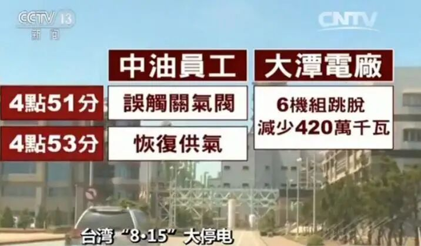
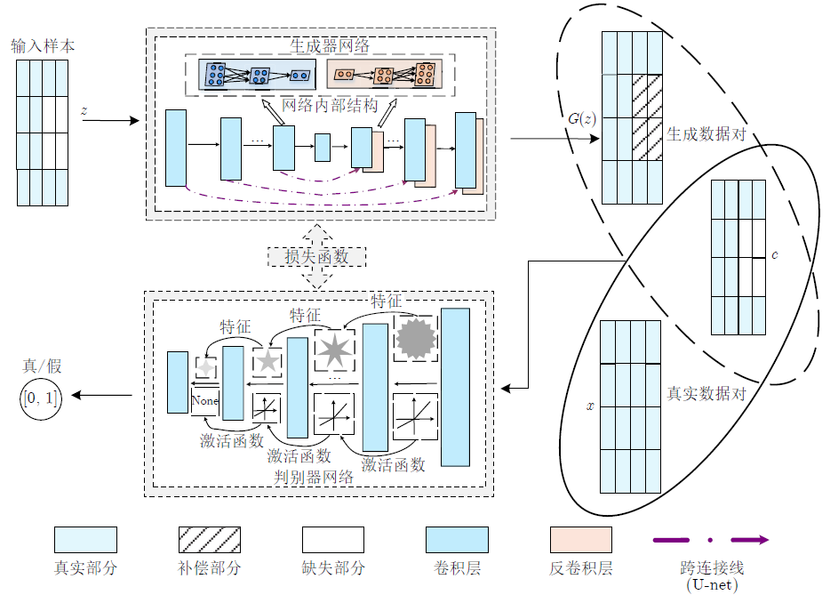
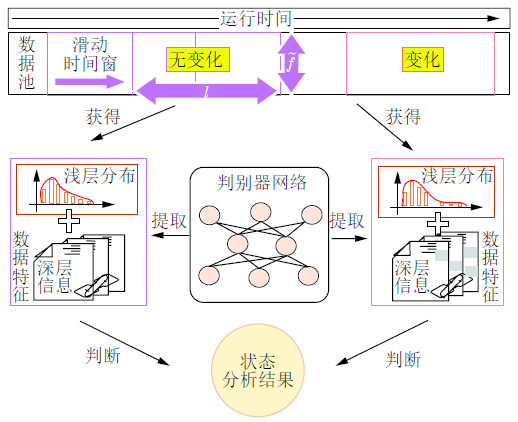

# 马大中, 张化光等：基于关联信息对抗学习的综合能源系统运行状态分析方法

原创 自动化学报 自动化学报 2020-11-30 16:15 北京

> 原文地址: [https://mp.weixin.qq.com/s/Kp7vmWnWmA9bCdCU5NljQQ](https://mp.weixin.qq.com/s/Kp7vmWnWmA9bCdCU5NljQQ)

点击上方**蓝字**关注我们

  

**综合能源系统运行状态分析**是指：在完成对电、气、热等能源子系统数据采集的基础上，通过物理模型或者数据驱动等方法对相关数据进行分析，从而完成系统运行状态的有效判断，确保系统的安全运行。

  

胡旭光, 马大中, 郑君, 张化光, 王睿. 基于关联信息对抗学习的综合能源系统运行状态分析方法. 自动化学报, 2020, 46(9): 1783−1797

http://www.aas.net.cn/cn/article/doi/10.16383/j.aas.c200159

  

综合能源系统是电、气、热等不同异质能源高度融合的统一化框架。通过打破传统能源间相互独立的局面，系统可以实现多主体用户的跨环节资源优化及协调互动，确保不同类型能源的低碳高效化应用。然而随着系统结构日益复杂及运行规模不断扩大，综合能源系统耦合结构会导致单一能源变化通过多种类型的耦合设备传递到其余能源子系统，进而影响整个系统的安全运行。图1展示了三起能源深度耦合造成的安全事件。此类事件给人民生活造成了严重影响，因此有关于保障系统安全的运行状态研究受到了人们重视。

  

_(a) 美国西南部大停电_

  

_(b) 美国南加州气网故障_

  

_(c) 台湾大停电_

  

_图1  综合能源系统安全事件_

  

**运行状态分析面临的挑战？** 综合能源系统是多能源耦合的分布式复杂系统。在实际应用过程中，以物理模型为主的状态估计方法难以建立准确模型，模型不精确误差会通过参数传递、累积，最终使得分析结果难以保证。此外由于综合能源系统包含不同类型的能源节点，数据量纲及变化幅值不统一的情况会导致现有数据驱动方法无法满足综合能源系统运行状态分析的需求。

  

进一步，实现运行状态分析的关键前提是数据完整性。然而在现实情况中由于传感器失效、网络通信中断造成的数据缺失情况时有发生，因此在进行系统运行状态分析时数据完整性是必须要考虑的问题。对于多时间尺度能源数据的补偿问题，仍需要结合系统潮流特性进行深入探究。

  

**如何补偿系统内缺失数据？** 首先针对电、气、热等多种类型能源运行数据潮流特性，以多能流计算的统一雅可比矩阵为依据进行数据关联度分析。在定义关联度要素的基础上，确定数据关联度关系，实现输入数据的优化排序。接着构建深度生成对抗网络实现数据缺失部分的可靠性补偿，具体结构如图2所示。此外在训练生成器过程中，通过设计的多属性融合生成器损失函数，促使生成器得到高精度补偿数据。

  

  

_图2  生成对抗网络结构示意图_

  

**如何实现系统运行状态分析？** 在得到训练好的生成对抗网络基础上，采用差异化数据特征衡量方式完成对系统运行状态的分析。如图3所示，首先通过判别器提取不同时刻完整能源数据的特征，接着分别对浅层特征分布及深层特征信息差异进行分析，最终通过融合判断的方法得到当前系统运行状态，从而完成系统运行状态分析。

  

_图3  生成对抗网络结构示意图_

  

最后对电−气−热综合能源系统不同类型节点的变化情况进行仿真分析，仿真结果表明本文提出的方法能够很好地反映和补偿数据缺失部分，并且采用判别器提取的特征可以有效地检测出节点变化，最终得到系统运行状态。

  

**作者简介**

  

**胡旭光**

东北大学信息科学与工程学院博士研究生. 主要研究方向为基于数据驱动的故障诊断, 信息物理系统的建模及优化控制.

E-mail: 1710252@stu.neu.edu.cn

**马大中**

东北大学信息科学与工程学院副教授. 主要研究方向为故障诊断, 容错控制, 分布式发电系统、微网和综合能源系统的优化与控制. 本文通信作者.

E-mail: madazhong@ise.neu.edu.

cn

**郑  君**

东北大学信息科学与工程学院硕士研究生. 主要研究方向为基于机器学习的综合能源系统故障检测与诊断.

E-mail: ZJ623928036@163.com

**张化光**

东北大学信息科学与工程学院教授. 主要研究方向为综合能源系统建模及优化控制, 自适应动态规划, 模糊控制, 网络控制, 混沌控制.

E-mail: hgzhang@ieee.org

**王  睿**

东北大学信息科学与工程学院博士研究生. 主要研究方向为综合能源系统中分布式电源的协同优化及其电磁时间尺度稳定性分析.

E-mail: 1610232@stu.neu.edu.cn

  

**热点文章**

[收藏！SCI论文经典词和常用句型汇总](http://mp.weixin.qq.com/s?__biz=MzAwMzAzMDgxOA==&mid=2651069036&idx=1&sn=961c952c84a07355dc70d4bb8291ce25&chksm=8131d021b6465937c80cf41a3118a5ad92a752cb3979f22d5964a741269a1df1987a37185a31&scene=21#wechat_redirect)

[吴国政等：浅析人工智能学科基金项目申请资助情况及展望](http://mp.weixin.qq.com/s?__biz=MzAwMzAzMDgxOA==&mid=2651068994&idx=1&sn=bca1ddc9774ad59ff1459a32883be60f&chksm=8131d00fb646591928654c4880aa609305efa30b538c0c431d8c8138df4401fcc87e80a131e0&scene=21#wechat_redirect)

[段广仁院士：高阶系统方法—Ⅲ. 能观性与观测器设计](http://mp.weixin.qq.com/s?__biz=MzI2NjA3MzM5MA==&mid=2649956510&idx=1&sn=7aa3652a7908ccd9621b47023dc25103&chksm=f29424dfc5e3adc938a51b7b1620a6f47911c974153f94b2c38cfdc37536b750195fbc4be8a4&scene=21#wechat_redirect)

[段广仁院士：高阶系统方法— II. 能控性与全驱性](http://mp.weixin.qq.com/s?__biz=MzI2NjA3MzM5MA==&mid=2649956009&idx=1&sn=d887902e385f28ddea0fcb569208bb86&chksm=f2941ae8c5e393feccb4347c9a3afbe191007f67323747782405b9ca5c754ba6e16017557786&scene=21#wechat_redirect)

[段广仁院士：高阶系统方法— I. 全驱系统与参数化设计](http://mp.weixin.qq.com/s?__biz=MzI2NjA3MzM5MA==&mid=2649955943&idx=1&sn=7d2e161c5d48ea877709b94ef706a3af&chksm=f2941a26c5e3933077b5c9ef2cf38af1087f3f074454251d441433f1c53861ddd85386b7a260&scene=21#wechat_redirect)

[陈虹教授等：智能时代的汽车控制](http://mp.weixin.qq.com/s?__biz=MzAwMzAzMDgxOA==&mid=2651065976&idx=1&sn=d6daa2fafd8e723a0238c5566cf1641c&chksm=8131c435b6464d23449b163afedd37f20a5d7598fe6684c6b011d19554e0ed38ef031fbf2ec9&scene=21#wechat_redirect)

[科研必备！盘点常用文献管理工具](http://mp.weixin.qq.com/s?__biz=MzI2NjA3MzM5MA==&mid=2649956322&idx=1&sn=aa1f98bb307dda70981e073546c973c4&chksm=f2941ba3c5e392b58981c27b2ea1334ef149e0b9eb126ac62453537db789a694cc35f72cac09&scene=21#wechat_redirect)

[值得收藏！SCI论文Introduction常用句式超全总结](http://mp.weixin.qq.com/s?__biz=MzI2NjA3MzM5MA==&mid=2649956198&idx=1&sn=5797df8adbd13e69d5e4ef09c6ee1d63&chksm=f2941b27c5e3923193e5a7b9199c59c1604e278c2c1356063ed30890dfbd6ae6e2ac8f2997ee&scene=21#wechat_redirect)

[【热点综述】2019年综述TOP20](http://mp.weixin.qq.com/s?__biz=MzI2NjA3MzM5MA==&mid=2649955584&idx=1&sn=b6460d48b4c365e8062c2b45bbcf8e38&chksm=f2941941c5e390574162e362028c22a441fa00ffbc0634599685c34f8a3a3446eaf90b8c0723&scene=21#wechat_redirect)

[【热点综述】2019年最新文章](http://mp.weixin.qq.com/s?__biz=MzI2NjA3MzM5MA==&mid=2649955359&idx=1&sn=cd768b5f2572472b6465c3f06b21a803&chksm=f294185ec5e3914807e5a5c9ec3143c15eb94a38ae51f5608acbc21b9b16cd20da65649401e0&scene=21#wechat_redirect)

[国家科技重大专项&重点研发计划等资助论文精选](http://mp.weixin.qq.com/s?__biz=MzI2NjA3MzM5MA==&mid=2649955416&idx=1&sn=152515bf1cc9800199a8da3d456f6b54&chksm=f2941819c5e3910ff3f98d74e2aae494046b5dbb6f6096c3d5c0c3d5ba134cf10f5e7af5bb86&scene=21#wechat_redirect)

[国家自然科学基金资助论文精选（二）](http://mp.weixin.qq.com/s?__biz=MzI2NjA3MzM5MA==&mid=2649955406&idx=2&sn=be8a73e34b097480f593ad399d4ce4d1&chksm=f294180fc5e39119440ddd930d887fd848daf3104587519b2295e2e32d97a5cb9cfd7f4e7bc3&scene=21#wechat_redirect)

[国家自然科学基金资助论文精选（一）](http://mp.weixin.qq.com/s?__biz=MzI2NjA3MzM5MA==&mid=2649955406&idx=1&sn=3c905081a57f1deb156b9f6f12b57a56&chksm=f294180fc5e3911966de31a290e784e8d5856902968fb29b3d3242a2e2d26104d526d217c79b&scene=21#wechat_redirect)  

[【前沿速递】机器人领域热点综述](http://mp.weixin.qq.com/s?__biz=MzI2NjA3MzM5MA==&mid=2649955259&idx=1&sn=c6aaf28c985bc4535380e5e774cac040&chksm=f2941ffac5e396ec6562e95c6ab505f84a1ad6f6f3f558a1a13abe94ec0a3db42a984830dec8&scene=21#wechat_redirect)

[【好文推荐】智能交通文集](http://mp.weixin.qq.com/s?__biz=MzI2NjA3MzM5MA==&mid=2649955221&idx=1&sn=9fc1c9e36a890e83da22882421bd8a14&chksm=f2941fd4c5e396c2bd720a9d9e007ffb1e8dd88fde551cfa3b5a41a527458ebc340522a4b669&scene=21#wechat_redirect)

[【热点专题】流程工业自动化](http://mp.weixin.qq.com/s?__biz=MzI2NjA3MzM5MA==&mid=2649955342&idx=1&sn=0301d93b276aaaf27fe36d71ee2c841d&chksm=f294184fc5e391596cf037d93097ab69ee48b5a3c36c5fd5dfdaa14a302c445a9ec4cf9dab11&scene=21#wechat_redirect)[专题](http://mp.weixin.qq.com/s?__biz=MzI2NjA3MzM5MA==&mid=2649955342&idx=1&sn=0301d93b276aaaf27fe36d71ee2c841d&chksm=f294184fc5e391596cf037d93097ab69ee48b5a3c36c5fd5dfdaa14a302c445a9ec4cf9dab11&scene=21#wechat_redirect)  

[【热点专题】数据驱动控制、学习及优化](http://mp.weixin.qq.com/s?__biz=MzI2NjA3MzM5MA==&mid=2649955310&idx=1&sn=9565312b88fe3ed17b199d148f22f191&chksm=f2941fafc5e396b93c014d1ab5d33c8f1da2a2d293843bcb814d5131b29677dfd4e38ff5699d&scene=21#wechat_redirect)[专题](http://mp.weixin.qq.com/s?__biz=MzI2NjA3MzM5MA==&mid=2649955310&idx=1&sn=9565312b88fe3ed17b199d148f22f191&chksm=f2941fafc5e396b93c014d1ab5d33c8f1da2a2d293843bcb814d5131b29677dfd4e38ff5699d&scene=21#wechat_redirect)

[【热点专题】模糊系统](http://mp.weixin.qq.com/s?__biz=MzI2NjA3MzM5MA==&mid=2649955382&idx=1&sn=07f211b9dd9d8c222f96d59f9960fd4f&chksm=f2941877c5e3916198db46714ecd96c3273dc248fa10dc75f84212a2531159e31f25f40c73c2&scene=21#wechat_redirect)[专题](http://mp.weixin.qq.com/s?__biz=MzI2NjA3MzM5MA==&mid=2649955382&idx=1&sn=07f211b9dd9d8c222f96d59f9960fd4f&chksm=f2941877c5e3916198db46714ecd96c3273dc248fa10dc75f84212a2531159e31f25f40c73c2&scene=21#wechat_redirect)

  

**期刊动态**

[《自动化学报》多名作者入选科睿唯安2020年度高被引科学家](http://mp.weixin.qq.com/s?__biz=MzI2NjA3MzM5MA==&mid=2649957295&idx=1&sn=597189346218d96d9906447a50281084&chksm=f29427eec5e3aef8d0662def8a0afcde2d2f3f828ae8208a52b14fc72169cedc5d81c06185a9&scene=21#wechat_redirect)

[自动化学报排名第一，被评定为中国中文权威期刊](https://mp.weixin.qq.com/s?__biz=MzI2NjA3MzM5MA==&mid=2649956509&idx=1&sn=1e39aaf65dc579606cf36258be8e1744&scene=21#wechat_redirect)

[《自动化学报》发表文章入选第五届“中国科协优秀科技论文”](http://mp.weixin.qq.com/s?__biz=MzI2NjA3MzM5MA==&mid=2649956281&idx=1&sn=71dbf4174159b1942b63ef08eca1dfa0&chksm=f2941bf8c5e392eef9fc02c51a7f85605a0e1c1b044fb8601c509746572832d86715fdc68b14&scene=21#wechat_redirect)

[2020年度国家杰青名单公布，《自动化学报》多位专家入选](http://mp.weixin.qq.com/s?__biz=MzI2NjA3MzM5MA==&mid=2649955856&idx=1&sn=b99cae140e826eb44167f31ff0df69e6&chksm=f2941a51c5e39347a56362162fb568dd1b37277274bfcf8b59178930104609f57bc2cb48652d&scene=21#wechat_redirect)

[《自动化学报》20篇文章入选2019“领跑者5000”顶尖论文](http://mp.weixin.qq.com/s?__biz=MzI2NjA3MzM5MA==&mid=2649955739&idx=1&sn=2b92c97a33944a61b36913f471989573&chksm=f29419dac5e390cc872091f2bf7d55f3d2e9cba612010294615680cc3020571ae80a3dda30d0&scene=21#wechat_redirect)

[自动化学报和IEEE/CAA JAS两刊编委获得2019年度国家自然科学基金项目](http://mp.weixin.qq.com/s?__biz=MzI2NjA3MzM5MA==&mid=2649955434&idx=1&sn=782abbffd5f83d1608e8bb509339ce85&chksm=f294182bc5e3913d5593db7f9f4c34e6266d942fc3c540165a545437b86f2756036fd9c62e25&scene=21#wechat_redirect)

[《自动化学报》多名编委荣获“杨嘉墀科技奖”等奖项](http://mp.weixin.qq.com/s?__biz=MzI2NjA3MzM5MA==&mid=2649955508&idx=2&sn=7fe0b57657f4f9cfadde5ee398c67de4&chksm=f29418f5c5e391e31af1fd99cf5c0b61a5c1c44d8b78e903b71b0628054f29a34c2a6c7972e5&scene=21#wechat_redirect)  

[《自动化学报》入选2019谷歌学术中文期刊TOP100，这些高影响力文章不容错过](http://mp.weixin.qq.com/s?__biz=MzI2NjA3MzM5MA==&mid=2649955369&idx=1&sn=3e2c817818af2cb8752f819667ddd347&chksm=f2941868c5e3917e5b02ef313a656a02270cad13e6e2ab08b617dad2091c4842153a3503a69b&scene=21#wechat_redirect)

[JAS入榜自动化学科TOP20！谷歌学术计量最新发布](http://mp.weixin.qq.com/s?__biz=MzI2NjA3MzM5MA==&mid=2649955829&idx=1&sn=65a242374cd79202ed66d6eb2996a661&chksm=f29419b4c5e390a277044eb7607080f302ee1ee57fb98b61da143f4b851a2f5f8b1c78b0caee&scene=21#wechat_redirect)

[JAS最新CiteScore 8.3，位居所属各领域Q1区前列](http://mp.weixin.qq.com/s?__biz=MzIxMjA5Njg2Nw==&mid=2649061028&idx=1&sn=ed2e409ce394028f1f5d138b83194a62&chksm=8f5a94a8b82d1dbee81f0723b724a6132ff9cc12cef3cf9796a5189d8ba9242e3d8b965d582d&scene=21#wechat_redirect)

[《自动化学报》多位编委和作者入选2019年中国高被引学者](http://mp.weixin.qq.com/s?__biz=MzI2NjA3MzM5MA==&mid=2649955656&idx=1&sn=3855f19fc1a4cbd306b580fd974e2442&chksm=f2941909c5e3901f25ed372ddda199e10bd1f1e9da57ff240b37327020a993c87fe2fe021ee0&scene=21#wechat_redirect)

[自动化学报最新影响因子5.936，再获中国最具国际影响力期刊称号](http://mp.weixin.qq.com/s?__biz=MzI2NjA3MzM5MA==&mid=2649955466&idx=1&sn=9c6704897821c19210518186e39d0ba9&chksm=f29418cbc5e391ddd81ab2ac1e23ee4ab89e543b226f4fc8d41dfe661d83c7463fed1fef1ac0&scene=21#wechat_redirect)  

[IEEE/CAA Journal of Automatica Sinica 被 SCI 收录](http://mp.weixin.qq.com/s?__biz=MzI2NjA3MzM5MA==&mid=2649955512&idx=1&sn=e3e85f94859128ed15dda84425097969&chksm=f29418f9c5e391ef44634f7051950c8b1304cc0cabad620775db21d9e85ebd13e6f733b7f03f&scene=21#wechat_redirect)  

[期刊引证报告发布：自动化学报各项主要指标蝉联第1，再获百种中国杰出期刊称号](http://mp.weixin.qq.com/s?__biz=MzI2NjA3MzM5MA==&mid=2649955508&idx=1&sn=aff836d3b0a4f52810122ffd1fa0f23c&chksm=f29418f5c5e391e3b1a6a9e951bf4d028224c9357e87648cdc54181ab6a4057cb6099ecaa0ef&scene=21#wechat_redirect)  

[《自动化学报》入选“庆祝中华人民共和国成立70周年精品期刊展”](http://mp.weixin.qq.com/s?__biz=MzI2NjA3MzM5MA==&mid=2649955387&idx=1&sn=62ce23f150d0a03760bf6f4f6d8275ce&chksm=f294187ac5e3916cd90ae2dde568a4b1b53a979beb38ee5faec7e958eb4501cf42593112d15c&scene=21#wechat_redirect)  

[《自动化学报》20篇文章入选2018“领跑者5000”顶尖论文](http://mp.weixin.qq.com/s?__biz=MzI2NjA3MzM5MA==&mid=2649955353&idx=1&sn=0ff56779fb42a8f874fe04aad60f81af&chksm=f2941858c5e3914e4ff91a57e72e2ef477c345e1bb6db9e8379ea2e7d2fb409491bba2db3580&scene=21#wechat_redirect)

[《自动化学报》和《自动化学报》（英文版）订阅信息](http://mp.weixin.qq.com/s?__biz=MzI2NjA3MzM5MA==&mid=2649955387&idx=2&sn=dc16f946c3dfe07b315cc57c96f3c570&chksm=f294187ac5e3916c479d1e5d899704f7cba032ce01acdbc9895e57f60482ccf80eba58f7c087&scene=21#wechat_redirect)  

[JAS影响因子世界排名第7，自动化领域世界学术影响力Q1区唯一的中国期刊！](http://mp.weixin.qq.com/s?__biz=MzI2NjA3MzM5MA==&mid=2649955473&idx=1&sn=3851a113e1dcea9a7983feeec9498d1c&chksm=f29418d0c5e391c6bb5ec5307db29885e00fd4dbfa47efb0251c43e217fcf60e95b6586b8ac0&scene=21#wechat_redirect)

  

**期刊目录**

[2020年第10期 工业人工智能专题](http://mp.weixin.qq.com/s?__biz=MzI2NjA3MzM5MA==&mid=2649957201&idx=1&sn=ab82a767bd716ab67fdf2942500d8b61&chksm=f2942710c5e3ae06b27f9e63a5e329a1123d90b051164e6b6123c500230541b1ed12d92abbfb&scene=21#wechat_redirect)

[2020年第09期 分布式信息能源系统理论与应用专题](http://mp.weixin.qq.com/s?__biz=MzI2NjA3MzM5MA==&mid=2649956412&idx=1&sn=8ebc13d63fd333ad85dbb8b5825df248&chksm=f294247dc5e3ad6ba297857a5b957e97cf499266c50318791fa8abd9432ecf1d9c3d9b287e36&scene=21#wechat_redirect)

[2020年第08期](http://mp.weixin.qq.com/s?__biz=MzI2NjA3MzM5MA==&mid=2649956008&idx=1&sn=1a2ea95039cb57d13f8a2c2904752449&chksm=f2941ae9c5e393ffe619c9b17f847097525a80e1a1580bb06f0cb290c46d523e11724d1978ef&scene=21#wechat_redirect)

[2020年第07期](http://mp.weixin.qq.com/s?__biz=MzI2NjA3MzM5MA==&mid=2649955834&idx=1&sn=1ce70709a36d93bd39b6415dff17c71c&chksm=f29419bbc5e390ad48ffa85cdcfaa94f3d28e1feb4e03c21b79a5e22df0fdf47f8c5fd020cee&scene=21#wechat_redirect)

[2020年上半年合集](http://mp.weixin.qq.com/s?__biz=MzI2NjA3MzM5MA==&mid=2649955913&idx=1&sn=79bcb27a9ec7a0db7bda0de2622c8f98&chksm=f2941a08c5e3931e2fec62fe080dc3e19b2d2d0dc4b067cab1d8202fd628c36cadc59e31481e&scene=21#wechat_redirect)

[2019年第12期 智能轨道交通系统专刊](http://mp.weixin.qq.com/s?__biz=MzI2NjA3MzM5MA==&mid=2649955524&idx=1&sn=a76b97bf832e984f0155acc0fb367bc7&chksm=f2941885c5e391935c353c88072e806cb0b5b9b78b1f7b23b3c6f4b8c6a2c12f72557f87b56b&scene=21#wechat_redirect)

[2019年第11期](http://mp.weixin.qq.com/s?__biz=MzI2NjA3MzM5MA==&mid=2649955490&idx=1&sn=bbe2565e502b7ed5e23ca910cad9b48e&chksm=f29418e3c5e391f52b0098db18982c174c54452aacccbfc7e46bfc30b2d84635db3769ad4126&scene=21#wechat_redirect)

[2019年第10期](http://mp.weixin.qq.com/s?__biz=MzAwMzAzMDgxOA==&mid=2651064742&idx=1&sn=80097cede4041fb1e47ffcd2d4049dcf&chksm=8131c3ebb6464afd499b085c96a0ea6a5e533656165aa9ef324d17fcbc1d75438b0428af90ba&scene=21#wechat_redirect)

[2019年第09期](http://mp.weixin.qq.com/s?__biz=MzI2NjA3MzM5MA==&mid=2649955428&idx=1&sn=54c45ff9c2280fe1ebc4ad49fcaeff17&chksm=f2941825c5e391338862ce891f34e768e3d924da2d74de0f7acf28d9e55fae35571b362ee000&scene=21#wechat_redirect)

[2019年第08期](http://mp.weixin.qq.com/s?__biz=MzI2NjA3MzM5MA==&mid=2649955392&idx=1&sn=1d3dea0f818780065e0ee045e45035d2&chksm=f2941801c5e391171954c601b58a29820d27b5aea7483db29130f832161839e1f0b66d31e5e7&scene=21#wechat_redirect)

[2019年第07期](http://mp.weixin.qq.com/s?__biz=MzI2NjA3MzM5MA==&mid=2649955375&idx=1&sn=b92bb595c2f3a53212f66f5eb10f9bbc&chksm=f294186ec5e3917836102cb94f7dbc23f66f83fb30713c32532d923ac6638b93d70c17ff0a97&scene=21#wechat_redirect)

[2019年上半年合集](http://mp.weixin.qq.com/s?__biz=MzI2NjA3MzM5MA==&mid=2649955383&idx=1&sn=146b8efdb966258f38d8a80dad78e270&chksm=f2941876c5e39160ea3949bf480b71c8d0daaf10aa4567558970d889b3a70988a635f44a4c5b&scene=21#wechat_redirect)

[2019年第01期](http://mp.weixin.qq.com/s?__biz=MzI2NjA3MzM5MA==&mid=2649955194&idx=2&sn=fb75bc8af9672922fa20efe2d30ff6c9&chksm=f2941f3bc5e3962db43689d03a54a0e40d83cb0e69fb9c48e87c0325b5bdf1b71028ebbbba0a&scene=21#wechat_redirect) 信息物理融合系统理论与应用专刊

  

  

**长按二维码｜关注我们**

**IEEE/CAA Journal of Automatica Sinica (JAS)**

**长按二维码｜关注我们**

**《自动化学报》服务号**

**长按二维码｜关注我们**

**《自动化学报》订阅号**  

  

**联系我们**

**网站:** http://www.aas.net.cn 

**投稿:** 

https://mc03.manuscriptcentral.com/aas-cn   

https://mc03.manuscriptcentral.com/ieee-jas 

**电话:**  010-82544653（日常咨询和稿件处理） 

           010-82544677（录用后稿件处理）

**邮箱:**  aas@ia.ac.cn（日常咨询和稿件处理）  

           aas\_editor@ia.ac.cn（录用后稿件处理）

**博客:** 

http://blog.sina.com.cn/aaseditor 

  

**点击****阅读原文** **了解更多**