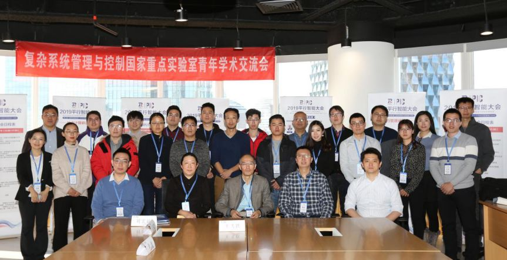
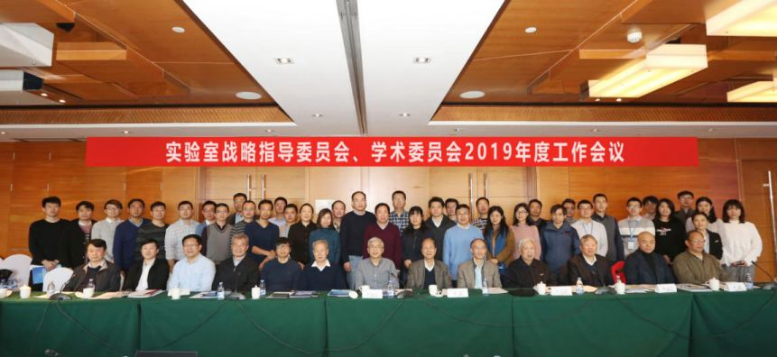
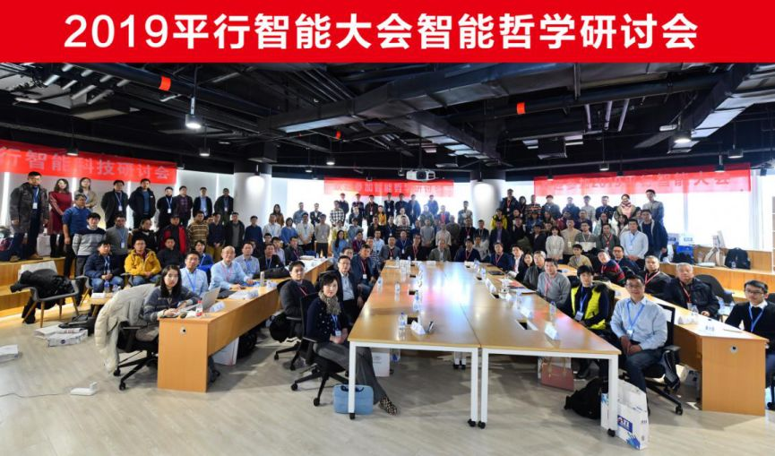
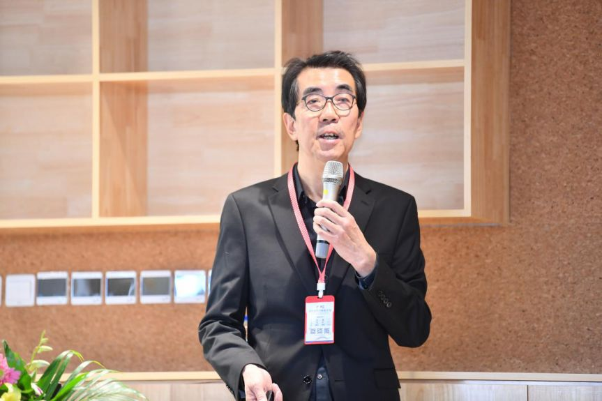
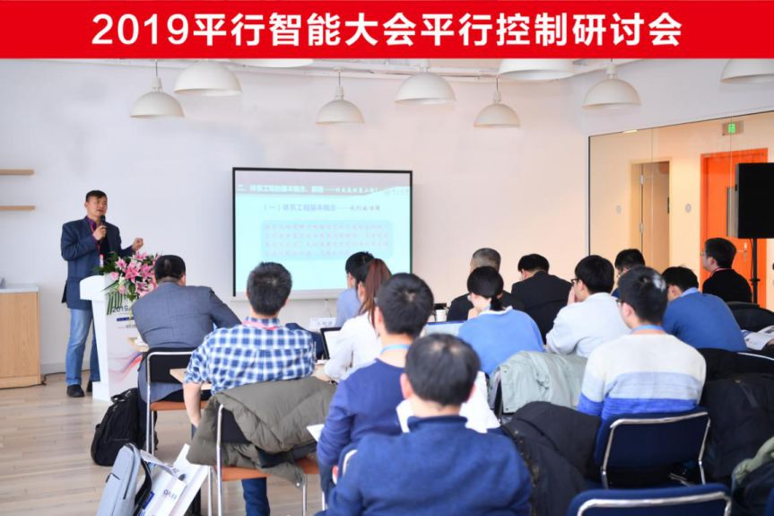
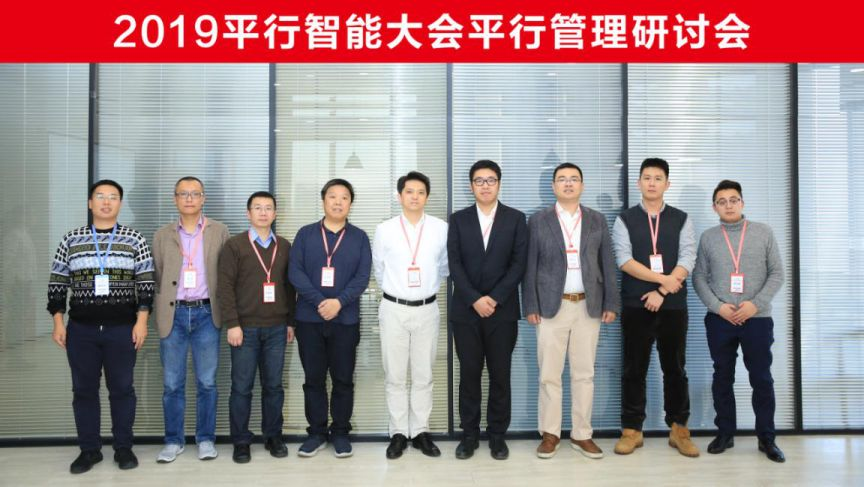
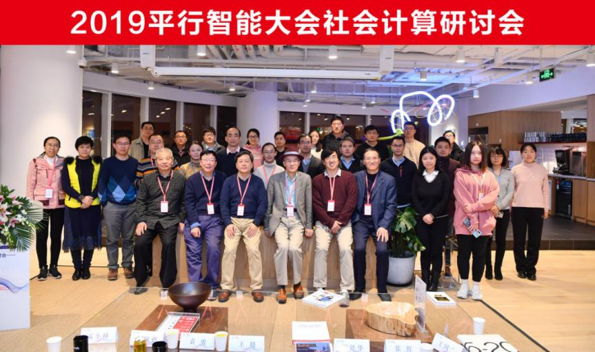
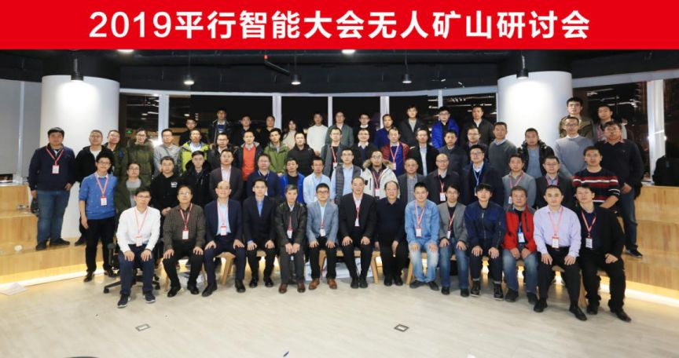

# 2019平行智能大会在北京成功举办

原创 自动化学报 2019-12-25 17:40 北京

> 原文地址: [https://mp.weixin.qq.com/s/TAUhC\_fCHEw-MpViWUghSA](https://mp.weixin.qq.com/s/TAUhC_fCHEw-MpViWUghSA)

  

**【导读】**2019年12月20至21日，“2019平行智能大会”在北京中航资本大厦成功举办。本次大会由中国自动化学会发起并联合中国科学院自动化研究所复杂系统管理与控制国家重点实验室、中国科学院哲学研究所等机构主办，怀德海智能学院、青岛智能产业技术研究院等单位承办。

随着人工智能在棋类游戏中对人类智能的超越，如何引导智能科学向善发展及其相关的伦理与哲学问题成为当前的关注热点。为适应时代科技发展需求，促进人工智能哲学及平行智能相关领域的学术交流与良性发展，2019年12月20至21日，由中国自动化学会发起并联合中国科学院自动化研究所复杂系统管理与控制国家重点实验室、中国科学院哲学研究所等机构主办，怀德海智能学院、青岛智能产业技术研究院等单位承办的“2019平行智能大会”在北京中航资本大厦成功举办。来自中国科学院自动化研究所、复旦大学、清华大学、中国人民大学、武汉大学、中山大学、香港城市大学、加拿大滑铁卢大学、美国丹佛大学、瑞典Chalmers大学、中国电科集团、国家电网以及欧美知名院校、科研院所、领袖企业的300余位相关领域的学界精英及产业引领者，以前沿的科学视角分享人工智能哲学及平行智能领域的思考与洞见，搭建起领域内从业者交流合作的桥梁。  

中国科学院自动化所研究员王飞跃教授在致辞中表示，2009年中国自动化学会发起并设立了平行管理、平行控制以及社会计算三个会议，到今年已经举办了11届。经过十多年的发展，“IT”不再仅代表信息技术，其时代主体是新"IT"智能技术。本次大会在以往三个会议的基础上，新增智能哲学研讨会以及无人矿山研讨会，并在20日上午和下午分别举办了复杂系统管理与控制国家重点实验室青年学术交流会暨平行智能科技研讨会、战略学术研讨交流会两场闭门会议。与以往的传统会议不同，本次大会现场讨论的气氛更加热烈，深度交流的契机更加广泛。与会嘉宾能够在自由讨论的情况下思辨真理，就是本次会议举办的目的。 

20日上午举办的复杂系统管理与控制国家重点实验室青年学术交流会暨平行智能科技研讨会

20日下午举办的实验室战略指导委员会、学术委员会2019年度工作会议

作为本次平行智能大会的重要环节，21日上午的举办的智能哲学研讨会中邀请中国工程院院士、中国电子科技集团首席科学家陆军，复旦大学哲学学院特聘教授刘闯，中国科学院自动化研究所研究员王飞跃等重磅嘉宾作会议报告。

平行智能大会智能哲学研讨会

中国电科电子科学研究院高级工程师单博楠作智能哲学研讨的个报告，题目为《信息系统发展思考》。报告通过贝塔郎菲和钱学森对系统的定义阐述了何为系统，从二元论定义和三元论定义的角度出发详细说明了系统包含的内容。在系统之中，最高级最复杂的准则是思维。报告详细介绍了电子信息技术的传输技术、存储技术、处理技术、应用技术。单博楠介绍，由电子信息技术组成的信息系统，构成了综合电子信息系统，其处理技术采用量子计算技术，能够对信息进行有目的性的加工，使之成为有用的信息，并进行输出过程。 

复旦大学哲学学院特聘教授刘闯在题为_Can Models Explain? A Tension in the Praxis of Science_的报告中认为，无论是从常识还是从经典的科学模型来看，只有真理或近似真理可以被解释。在今天的科学实践中，模型是必不可少的。它们通常被用来解释和理解它们的目标现象(或它们用来表示的系统)。但是模型通常是抽象的、理想化的，有些甚至涉及虚构的元素。如何用它们来解释模型?模型和解释之间存在着怎样的矛盾？报告分析了解决这一矛盾的主要建议，然后提出了一种可供选择的解决方案。在模型是否能够解释以及是否需要扮演解释提供者的角色存在争议。争论产生了其它的问题，或许可以提供给我们所需的解释。

复旦大学哲学学院特聘教授刘闯作题为Can Models Explain? A Tension in the Praxis of Science的报告

中国科学院自动化研究所研究员王飞跃在题为《智能科技与平行哲学：从莱布尼茨的Monad到区块链之DAO》的报告中，首先阐释了哲学与科学同源同根的本质，并就智能科技崛起后的哲学内在需求做了详细分析。针对莱布尼茨的Monad和区块链之DAO（谐音“道”—DAO分别是关键英文单词的第一个字母的集成。D是“分布式”和“非中心化”的第一个英文字母，A是“自主性”和“自动化”的第一个字母，O是“组织化”和“有序性”的第一个英文字母），报告定义了Monadao与Monadaology。从过程哲学到平行哲学，在Being和Becoming之后如何做到Believing?王飞跃教授在报告中分析了哲学理念Being-in-the world、Becoming-of-the world以及Believing-for-the world之间内在关联和必然外延。最后，报告介绍了平行思维与平行认知：Whatever Go, Go in Parallel！ 

21日下午，大会同期举办了平行控制研讨会、平行管理研讨会、社会计算研讨会以及无人矿山研讨会，邀请各自领域内权威专家、企业领袖，以专题报告及圆桌论坛等形式，分享前沿科技、展望未来趋势。通过专题论坛报告及互动讨论，各研讨会集中展示了国内外平行智能学术与产业发展的最新成果。

平行智能大会平行控制研讨会

平行智能大会平行管理研讨会

平行智能大会社会计算研讨会 

平行智能大会无人矿山研讨会

本次大会在各主办单位及承办单位的支持下，取得了圆满成功。会议聚焦人工智能哲学及平行智能领域相关学术问题和突破性进展，交流最新学术思想方法，展望未来科技发展趋势，致力于打造成为服务人工智能领域科技工作者的交流学习平台，为人工智能促进传统行业转型升级、培育经济发展新动能建言献策。

来源：大会组委会

  

  

JAS服务号

长按扫码关注我们

《自动化学报》

服务号

长按扫码关注我们

《自动化学报》

订阅号

长按扫码关注我们

  

  

**联系我们**

Tel:  010-82544653（日常咨询和稿件处理） 

        010-82544677（录用后稿件处理）

Fax: 010-82544497

Email: aas@ia.ac.cn（日常咨询和稿件处理）

          aas\_editor@ia.ac.cn（录用后稿件处理）

http://www.aas.net.cn